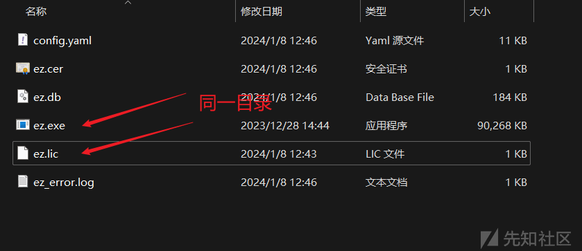
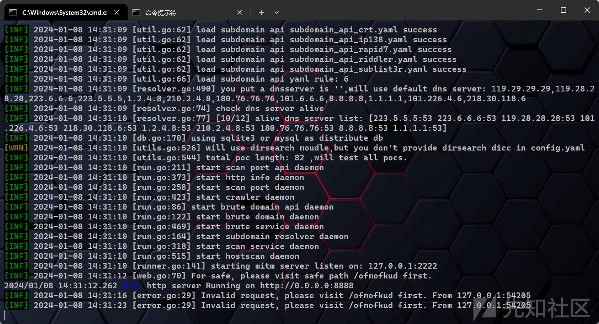
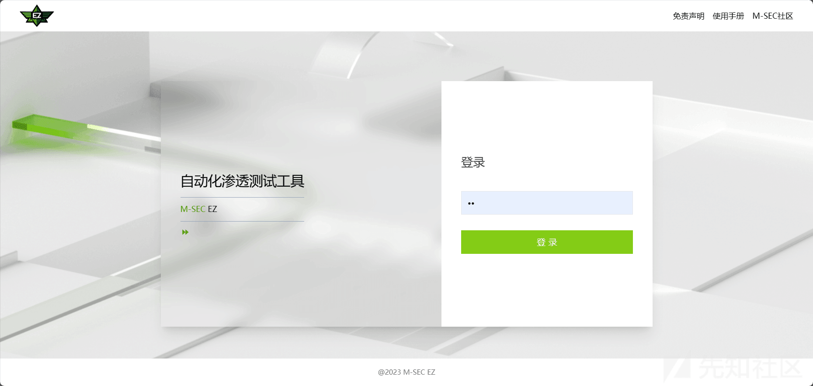
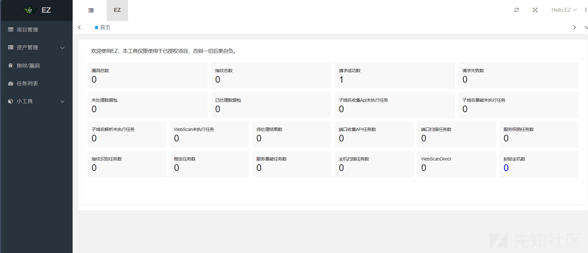
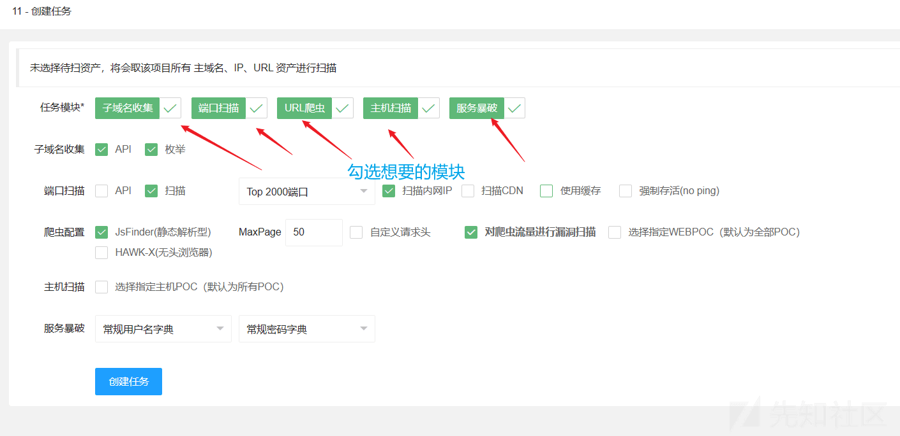
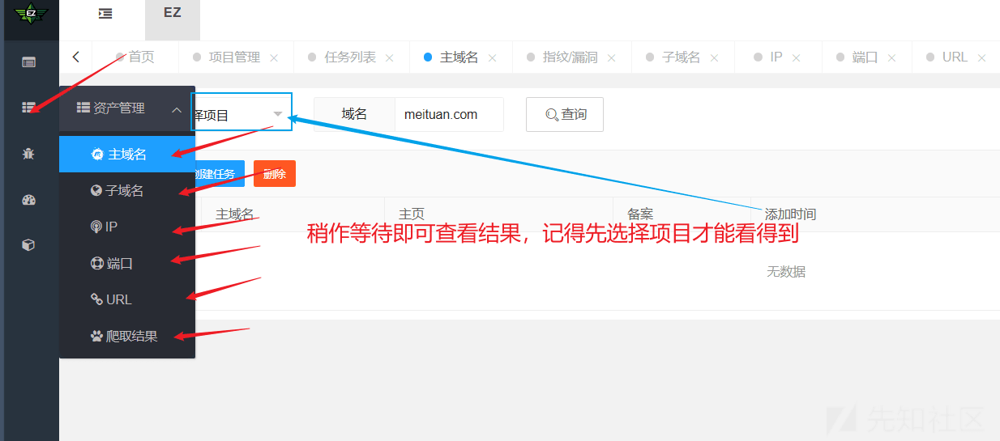
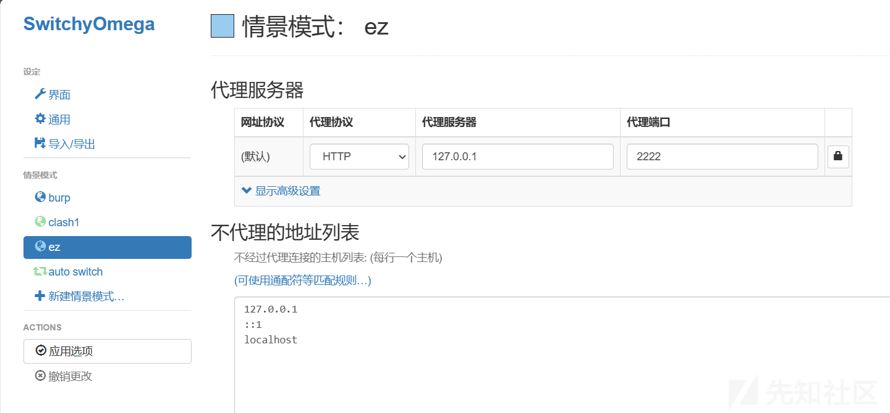
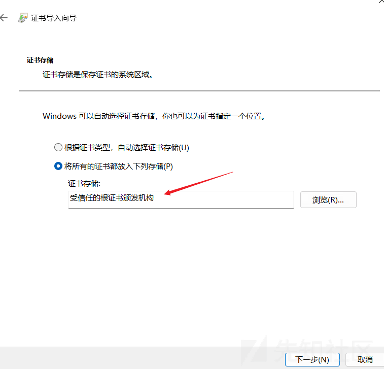
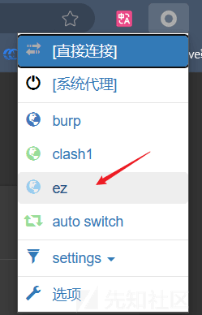

# 绿盟 ez 工具安装遇到的问题及解决方式 - 先知社区

绿盟 ez 工具安装遇到的问题及解决方式

- - -

# 一、下载使用（目前只有社区版）

## 第一步：github 下载地址：

[https://github.com/m-sec-org/EZ/releases/tag/1.8.6](https://github.com/m-sec-org/EZ/releases/tag/1.8.6)

## 第二步：到 M-SEC 漏洞社区申请证书并下载到与 github 上下载的 exe 文件存放在同一目录下：

[https://msec.nsfocus.com/?member/ezcertificate/#shenqingjl](https://msec.nsfocus.com/?member/ezcertificate/#shenqingjl)

[](https://xzfile.aliyuncs.com/media/upload/picture/20240108130230-207c0e9c-ade3-1.png)

[](https://xzfile.aliyuncs.com/media/upload/picture/20240108130347-4dd5494e-ade3-1.png)

## 第三步：执行.\\ez.exe webscan 命令会默认在工具同目录生成一个配置文件：config.yaml

[](https://xzfile.aliyuncs.com/media/upload/picture/20240108125901-a3a8d10c-ade2-1.png)

config.yaml 各参数解释如下：

```plain
http:                   # webscan 配置
  depth: 1              # PerFolder 检测深度，定义 http://t.com/a/ 深度为 1, http://t.com/a 深度为 0
  parallel: 30          # 同时运行的 Poc 数量
  max_qps: 300          # 每秒最大请求数
  retry: 0              # http 连接失败，重试次数，默认 0
  http_timeout: 6       # 读取 http 响应超时时间，不建议设置太小，否则可能影响到盲注的判断
  max_redirect: 5       # 单个请求最大允许的跳转次数
  headers:              # 如果在请求头未发现 UA，则更换 UA
    user_agent: "Mozilla/5.0 (Windows NT 10.0; rv:78.0) Gecko/20100101 Firefox/78.0"
  upstream_proxy: ""    # 为 mitm 本身配置独立的代理，支持 socks5，http
  white_host: ""        # 白名单，主机名包含任意一个字符串即开启此主机的扫描，以逗号为分割，如 127,localhost,weibo
  black_host: ""        # 黑名单，主机名包含任意一个字符串即屏蔽此主机的扫描，以逗号为分割，如 baidu,qq,gov，可同时和白名单参数一起使用，先走白，再走黑


result:                 # 扫描结果配置
  level: 1              # 过滤扫描结果>=level ,可接受的值 0，1，2，3，分别代表指纹，中危，高危，严重
  wecom_key: ""         # wecom 企业微信 机器人 key

plugins:                # webscan 漏洞插件、模块配置
  sqli:                 # sql 注入模块，目前只有 sqli 时间盲注和报错注入
    level: 2            # 闭合等级，和 sqlmap 一致，level:1-5，目前只针对时间盲注
    risk: 1             #  SQL 语句等级，和 sqlmap 一致，level:1-3，目前只针对时间盲注
  dirsearch:            # dirsearch 模块字典，慎重字典数量，大量字典会导致发包严重
    dicc: ""            # 字典路径，默认空代表无字典

service:                # servicescan 模块参数
  dail_timeout: 5       # 建立 tcp 连接的超时时间
  udp_timeout: 5        # udp 超时时间
  max_ping_qps: 5000    # 监听网卡 ping 每秒最大发包数
  send_ping_time: 3     # 监听网卡 ping 发包次数
  parallel_tcp: 10000   # 端口扫描 tcp 扫描并行大小
  parallel_syn: 10000   # 端口扫描 syn 扫描并行大小
  syn_send: 2           # 端口扫描 syn 扫描发包次数
  parallel_finger: 30   # 端口指纹扫描并行大小
  parallel_poc: 30      # 运行 hostscan poc 时候并发数量

dns:                    # dnsscan 模块参数
  brute_parallel: 1000  # 爆破子域名并行数

db:                     # 数据库配置，如果 redis 不为空则使用 redis，否则使用 sqlite（使用 redis 更高效，sqlite 只适合小测试需求）
  sqlite: "ez.db?_busy_timeout=9999999" # sqlite 配置：sqlite 数据库文件的路径
  redis: ""             # redis 配置，如：pass@127.0.0.1:6379:0，如果密码为空，则入@127.0.0.1:6379:0
  mysql:                # mysql 配置，如果配置了，则建立 vuln 表，保存结果，非深度用户慎用
    use: false          # 是否启用
    database: ez
    host: 127.0.0.1
    password: ""
    port: "3306"
    timeout: 3s
    user: root
  elastic_addr: ""      # elasticsearch 配置，如果配置了，将存储代理的数据包到数据库，便于聚合，查询，如 http://127.0.0.1:9200
  elastic_ignore_resp_body: false   # 存入数据库时是否忽略返回体，服务器低配置可配置为 true
  elastic_user: ""
  elastic_pwd: ""

reverse:                    # 反连平台配置
  token: test123            # 如 test123
  http: 1.1.1.1:8080        # 如 1.1.1.1:8080
  dns: a.evildomain.com     # 如 a.evildomain.com
  rmi: 1.1.1.1:8082         # 如 1.1.1.1:8082
  ldap: 1.1.1.1:8083        # 如 1.1.1.1:8083
brute:
  timeout: 8                # 爆破超时时间，内网 IP 全部默认 3s
  parallel: 200             # 总爆破并行大小
  groups: 600               # 爆破分组大小
  service_parallel:         # 爆破单个主机服务同时最大并发
    ssh: 16
    wmi: 16
    smb: 40
    mysql: 16
    vnc: 5
    redis: 50
    mssql: 20
    vmauth: 16
    esxi: 10
    ftp: 16
    ldap: 16
    posrtgresql: 20
    oracle: 16
    mongodb: 16
    snmp: 10

api:                        # 一些 api 配置，如 fofa
  fofa_email: ""
  fofa_key: ""

research_mode: false        # 研究者模式，输出一些可以测试的点+fuzz，发包量为 5-10 倍，适合本地环境的研究，不必要信息以及会误报可能比较多
```

# 功能介绍

## 运行主动扫描模块

### 一、启动模块

cmd 运行.\\ez web

[](https://xzfile.aliyuncs.com/media/upload/picture/20240108144551-907efd9a-adf1-1.png)  
官方文档中说是直接访问 127.0.0.1:8888, 但是其实第一次访问的时候你会发现报错 404，直接访问错误提示中的 127.0.0.1:54205 也是不行的 当时我甚至怀疑是我环境的问题，我连着换了几台虚拟机都发现不行，后来发现这是工具设置的一个反溯源的一种手段

Tip：  
1.EZ 从 1.5.0 版本开始使用 ez web 在启动时会默认设置安全路径为随机串，第一次需访问安全路径后才可正常登录，如果不想有安全路径则添加 --no-safe-path 参数，也可以使用 --safe-path 自定义安全路径  
2.如 ez web 登录密码忘记，可以执行 ez web --reset-web-password 命令重置密码为 ez

正确操作顺序是：先访问 127.0.0.1:8888 之后在命令行会出现如下提示

[](https://xzfile.aliyuncs.com/media/upload/picture/20240108144857-ff7a1fea-adf1-1.png)  
之后你将/ofmofkud 拼接在 127.0.0.1:8888/ofmofkud 之后再访问就会发现成功访问到登录界面了

[](https://xzfile.aliyuncs.com/media/upload/picture/20240108145015-2da7cd0e-adf2-1.png)

初始密码是 ez 登录后会让你重新修改密码，这是它的 web 界面

[](https://xzfile.aliyuncs.com/media/upload/picture/20240108145246-87f4d31a-adf2-1.png)

### 二、创建项目

[](https://xzfile.aliyuncs.com/media/upload/picture/20240108152154-9971da9e-adf6-1.png)

[](https://xzfile.aliyuncs.com/media/upload/picture/20240108152238-b405d798-adf6-1.png)

[](https://xzfile.aliyuncs.com/media/upload/picture/20240108152429-f5cee5de-adf6-1.png)

[](https://xzfile.aliyuncs.com/media/upload/picture/20240108154240-803029ca-adf9-1.png)

[](https://xzfile.aliyuncs.com/media/upload/picture/20240108154504-d5ff6dde-adf9-1.png)

[](https://xzfile.aliyuncs.com/media/upload/picture/20240108154733-2f06a1d6-adfa-1.png)

## 运行被动扫描模块

被动扫描：简单来说就是挂个代理在 ez 上，你在测试过程中就会在后台帮你测试，如果有可疑漏洞就会提示，但是不建议一直开着，容易被封 ip 等等  
（1）运行命令.\\ez.exe webscan (开启被动扫描前需要将主动扫描关闭)  
（2）ez 默认监听 2222 端口，所以需要配置浏览器代理，如下图

[](https://xzfile.aliyuncs.com/media/upload/picture/20240108212531-6583377c-ae29-1.png)  
（3）安装证书，我们在 ez.exe 同文件夹上存在 ez.cer 的文件，在浏览器中安装证书，注意要选择“受信任的根证书颁发机构”

[](https://xzfile.aliyuncs.com/media/upload/picture/20240108212730-ac6ff86e-ae29-1.png)  
（4）开启代理即可

[](https://xzfile.aliyuncs.com/media/upload/picture/20240108212923-f00ff47a-ae29-1.png)

注意：  
这里有我自己踩到的一个坑，在我们一开始生成的配置文件 config.yaml 中有黑白名单可以配置，当我们开启被动扫描的时候容易造成误伤，譬如我在编写此篇文章的时候忘记把被动扫描关闭，不过几秒钟就被 ban 了，另外平时测试的时候也可以在黑名单中加入 gov 或一些敏感的网站，避免被请去“喝茶"

[](https://xzfile.aliyuncs.com/media/upload/picture/20240108213110-2f757e8c-ae2a-1.png)

## 其他用法

①服务爆破②无头爬虫③子域名扫描④ez 联动 bp 等等详见官方文档：[https://msec.nsfocus.com/ezdocs/docs/EZLab/apiscan](https://msec.nsfocus.com/ezdocs/docs/EZLab/apiscan)
