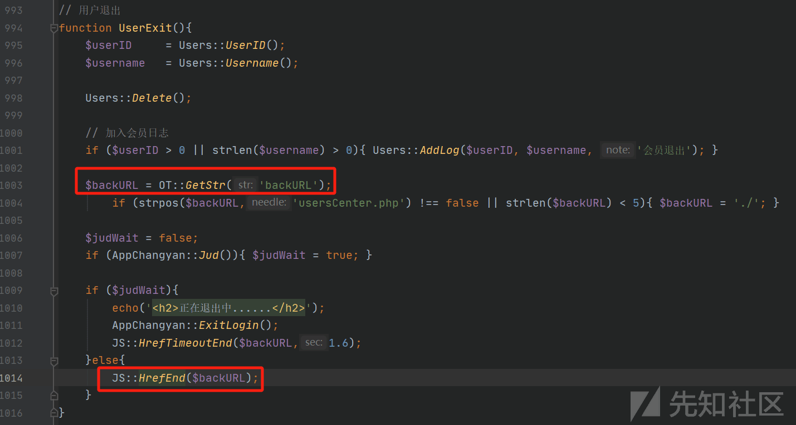
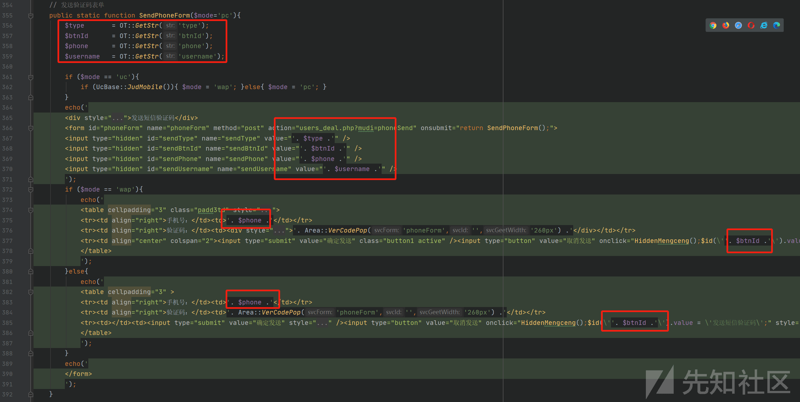
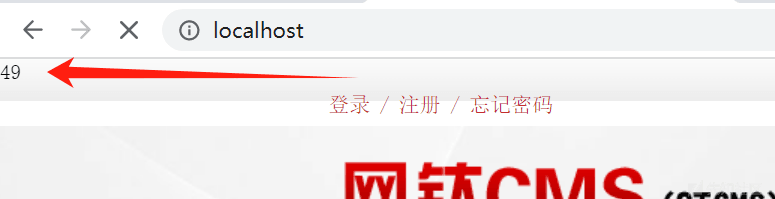

# 网太系统代码审计-PHP - 先知社区

网太系统代码审计-PHP

- - -

### 0x00 前言

网太 CMS PHP 版 基于 PHP+mysql 的技术架构，php 环境版本支持 php 5.3 到 php 7.3，建议用 php 7.1~7.3。

**源码下载：**  
[http://d.otcms.com/php/OTCMS\_PHP\_V7.16.zip](http://d.otcms.com/php/OTCMS_PHP_V7.16.zip)

**软件架构**  
非 MVC 架构  
页面：smarty  
数据库：Mysql

### 0x01 反射型 XSS1

在`inc\classJS.php`，发现该文件定义了一些用于 js 弹窗的方法。一些方法的可控字符串被`AlertFilter()`方法包裹了。

`AlertFilter()`方法将英文双引号替换成中文双引号，无法使用英文双引号就没法闭合 alert()，那么使用了`AlertFilter()`是没有 XSS 的。

这里有一些弹窗方法没有使用`AlertFilter()`，例如`HrefEnd()`，找找使用的位置。

找到使用`HrefEnd()`的位置。

在`users_deal.php`里 backURL 可控且没有做过滤。

构造 Payload，为了防止`document.location.href`跳转，将它的值设置为`#`号即可。

测试触发 XSS。  
Payload：`http://localhost/users_deal.php?backURL=%23%22%3balert(1);//#`

### 0x02 反射型 XSS2

在`inc\classAreaApp.php`，发现了一处简单的 XSS。

构造 Payload 测试触发反射型 XSS。  
Payload：`http://localhost/wap/users/p.php?m=sendPhoneForm&dataID=7866&theme=1%22&_=1706170896361&type=%22%3E%3Cscript%3Ealert(1);%3C/script%3E`

### 0x03 反射型 XSS3

在`wap\users\read.php`，有一处获取城市信息的功能。

跟进到`inc\classProvCity.php#GetDeal()`，可以看到获取了两个参数 idName、prov。

继续跟进到`inc\classProvCity.php#GetCityOptionJs()`，idName 被拼接之后返回给 echo 进行输出了。

构造 Payload 测试触发 XSS。  
Payload：`http://localhost/wap/users/read.php?m=getCityData&idName=%3Cscript%3Ealert(1);%3C/script%3E`

### 0x04 反射型 XSS4

在`apiRun.php#AutoRun()`看到可疑操作。

找到`$mode`变量是从`$_GET`获取且无过滤。

构造 Payload，可以通过`";`前面的内容，然后使用`//`注释后续内容，中间则是 XSS 的内容。

构造 Payload 测试触发 XSS。  
Payload：`http://localhost/apiRun.php?mode=%22;alert(1);//&mudi=autoRun`

在`apiRun.php#AutoRunBig()`有同样的问题。

### 0x05 SSRF1

用 Xcheck 找到一处 SSRF，在`inc\QrReader\QrReader.php#__construct()`里。如果`file_get_contents`获取的内容不是图片，它的返回值在交给`imagecreatefromstring`处理时会引发报错，所以这里只能 SSRF。

根据 Xcheck 路径跟踪表，`QrReader`对象在`admin\readDeal.php#ReadQrCode()`被创建，传入了可控参数`img`。

可以利用回显的延迟来对内网进行探测。

### 0x06 SSRF2

用 Xcheck 找到第二处 SSRF，在`inc\classReqUrl.php#UseCurl()`。

根据 Xcheck 路径跟踪表，`UseCurl()`在`inc\classReqUrl.php#UseAuto()`被使用。

接着按路径跟踪表，在`admin\read.php#GetSignal()`里调用了`UseAuto()`，可以看到获取了参数`signalUrl`。

这里同样只能通过回显的延迟来对内网进行探测。

### 0x07 SSTI

在后台有模板管理功能，编辑首页`index.html`试一下。

`{7*7}`直接以字符串的方式显示。

重新看一下，看到`{}`内的开头内容要为`otcms:`，按照这个样式进行修改。

重新访问，可以看到表达式被执行了。

它使用的模板引擎是 Smarty，可以使用`{otcms:$smarty.version}`查看一下 Smarty 的版本。

通过上述内容已经可以确认这里存在 SSTI 漏洞了，关于 Smarty 的 SSTI 漏洞，本人之前在先知发布过一篇[Smarty 最新 SSTI 总结](https://xz.aliyun.com/t/11108?time__1311=mqmx0DyDcDuGqq0vo4%2BxOD9WuKqDvN%2BQex&alichlgref=https%3A%2F%2Fxz.aliyun.com%2Fu%2F39303#toc-6 "Smarty 最新 SSTI 总结")，针对这个版本我们可以使用`CVE-2021-26119`来 RCE。  
将构造好的 Payload 写入 index.html。

测试触发 RCE。

分析一下代码，通过抓包找到功能代码。

在`admin\template_deal.php#AddOrRevFile()`很简单可以看到`fileContent`没做任何防范 SSTI 的操作，针对文件名倒是做了许多处理。

  

