# 致远 OA rest 接口重置密码漏洞分析 - 先知社区

致远 OA rest 接口重置密码漏洞分析

- - -

### 复现环境

致远 V7.1SP1

### 补丁分析

致远官方在 2023 年 8 月发布了 rest 接口重置密码漏洞补丁，补丁链接[https://service.seeyon.com/patchtools/tp.html#/patchList?type=%E5%AE%89%E5%85%A8%E8%A1%A5%E4%B8%81&id=175](https://service.seeyon.com/patchtools/tp.html#/patchList?type=%E5%AE%89%E5%85%A8%E8%A1%A5%E4%B8%81&id=175)

[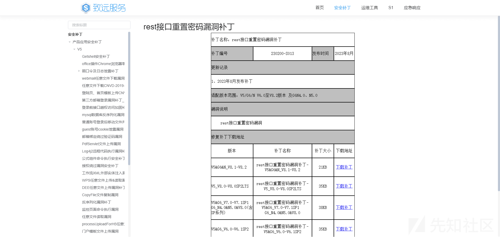](https://xzfile.aliyuncs.com/media/upload/picture/20240220173646-90a6bda4-cfd3-1.png)

[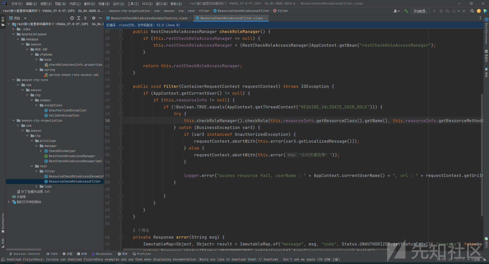](https://xzfile.aliyuncs.com/media/upload/picture/20240220173653-94cea6d0-cfd3-1.png)

致远是通过`jersey`框架实现`REST`接口，通过配置`init-param`参数来添加过滤器类，添加后，在进入到资源类之前，会先进入到过滤器类，一些校验的逻辑就可以写在过滤器中。

[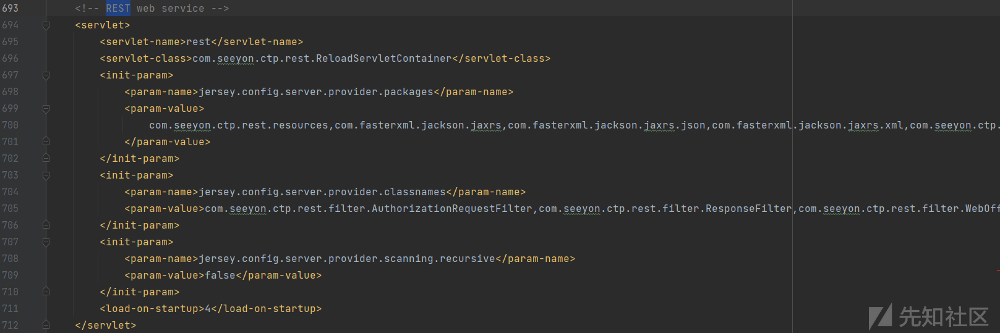](https://xzfile.aliyuncs.com/media/upload/picture/20240220173659-988f5eb8-cfd3-1.png)

rest 接口重置密码漏洞补丁的工作原理是通过将用户角色权限与资源访问权限的逻辑写在`ResourceCheckRoleAccessFilter`类中，在`ResourceCheckRoleAccessFilter`的`filter`方法中，会以访问资源类的类名及方法名和当前用户作为参数调用`RestCheckRoleAccessManagerImpl`的`checkRole`方法，验证当前用户是否具有访问资源类的权限，如果不具备访问权限，则抛出异常。

[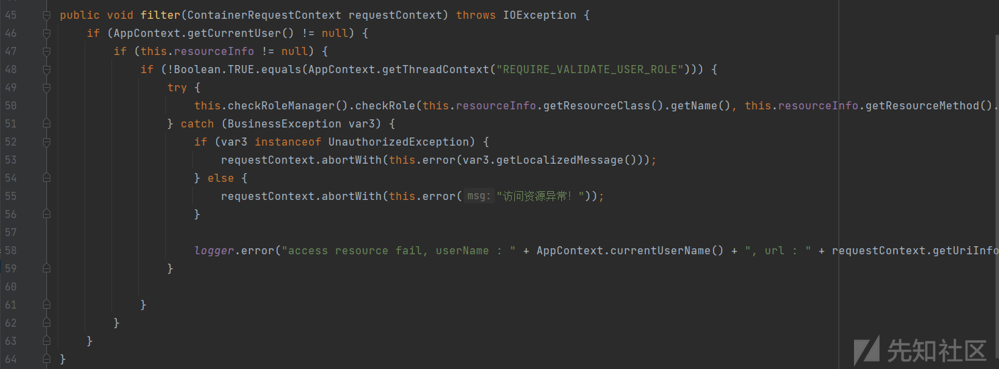](https://xzfile.aliyuncs.com/media/upload/picture/20240220173706-9c92c2d4-cfd3-1.png)

在补丁包中`checkRoleAccessInfo.properties`配置文件中，定义了`com.seeyon.ctp.rest.resources.MemberResource`类中方法已经对应的用户访问权限。

[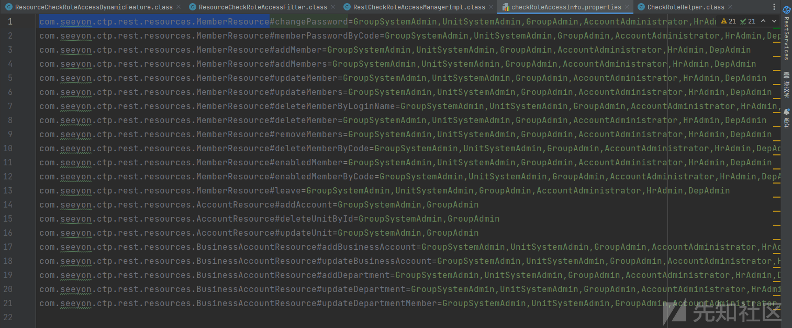](https://xzfile.aliyuncs.com/media/upload/picture/20240220173712-9ff53a4c-cfd3-1.png)

在`MemberResource.class`的`changePassword`方法中，可通过指定`memberid`和`password`对用户密码进行修改。

[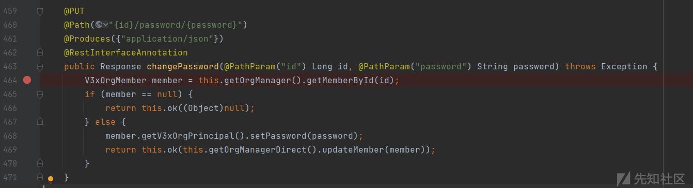](https://xzfile.aliyuncs.com/media/upload/picture/20240220173718-a3777536-cfd3-1.png)

致远中存在一些自带的用户，这些用户的`memberid`值都是固定的，正常情况下，我们可以通过`changePassword`方法修改`system`等用户的密码。

[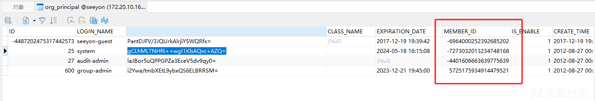](https://xzfile.aliyuncs.com/media/upload/picture/20240220173723-a6c151f8-cfd3-1.png)

```plain
seeyon-guest -6964000252392685202
system -7273032013234748168
audit-admin -4401606663639775639
group-admin 5725175934914479521
```

### rest 接口权限校验

在`CTPSecurityFilter.class`的`doFilter`方法中，根据`uri`的特征，分别有 7 种权限校验的方法。

[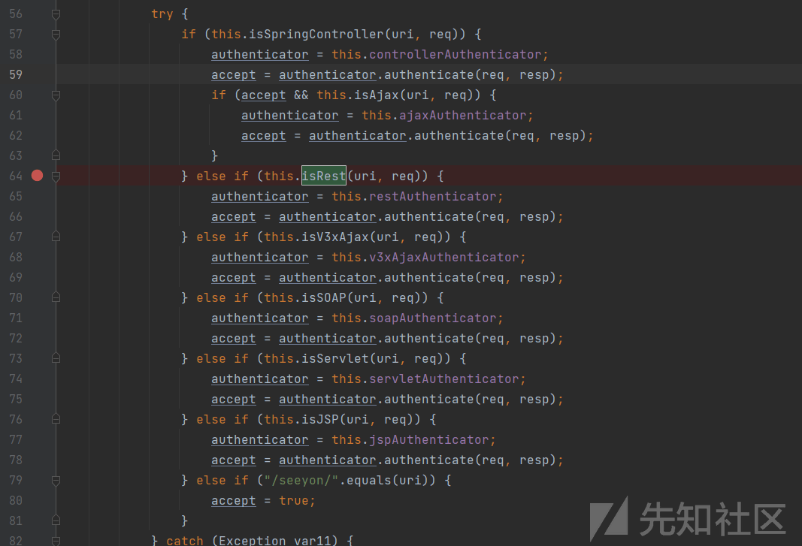](https://xzfile.aliyuncs.com/media/upload/picture/20240220173729-aa005120-cfd3-1.png)

[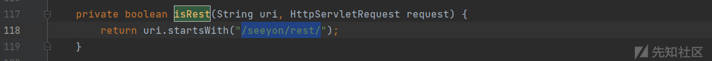](https://xzfile.aliyuncs.com/media/upload/picture/20240220173733-ac9a698e-cfd3-1.png)

当`uri`的前缀为`/seeyon/rest/`时，会调用`RestAuthenticator.class`的`authenticate`方法进行验证，该接口仅支持`token`进行认证，不允许使用`Session`。

[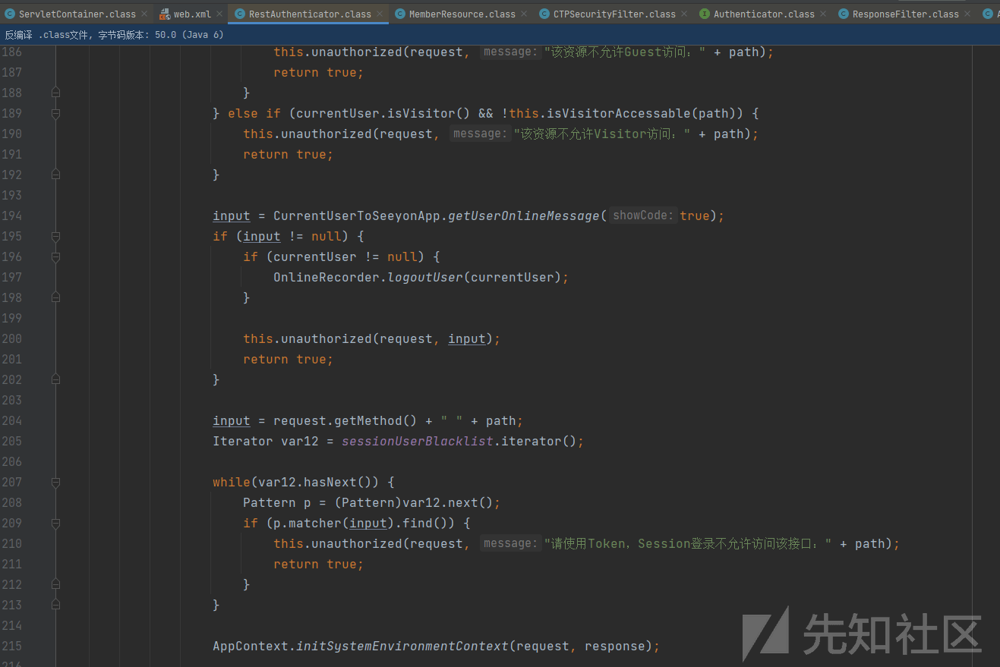](https://xzfile.aliyuncs.com/media/upload/picture/20240220173740-b09eaa4a-cfd3-1.png)

在致远的开放平台描述了 toekn 的获得方式，[https://open.seeyon.com/book/ctp/restjie-kou/gai-shu.html](https://open.seeyon.com/book/ctp/restjie-kou/gai-shu.html)

[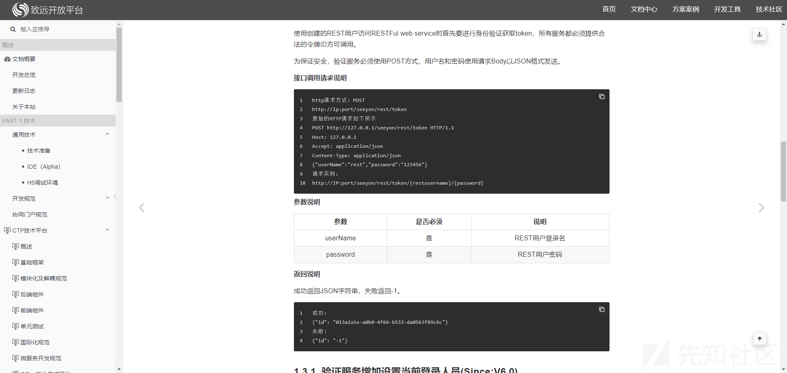](https://xzfile.aliyuncs.com/media/upload/picture/20240220173745-b384fe30-cfd3-1.png)

两个步骤，1、登录系统用户创建一个 rest 用户，

[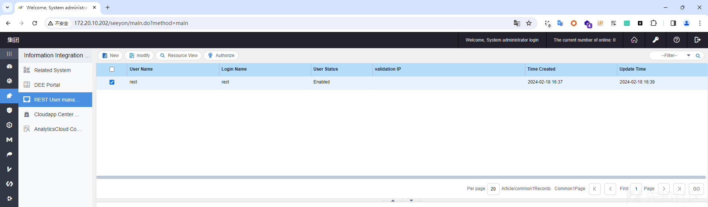](https://xzfile.aliyuncs.com/media/upload/picture/20240220173752-b7d93e88-cfd3-1.png)

2、通过`/seeyon/rest/token/{restusername}/{password}`接口获取 token

[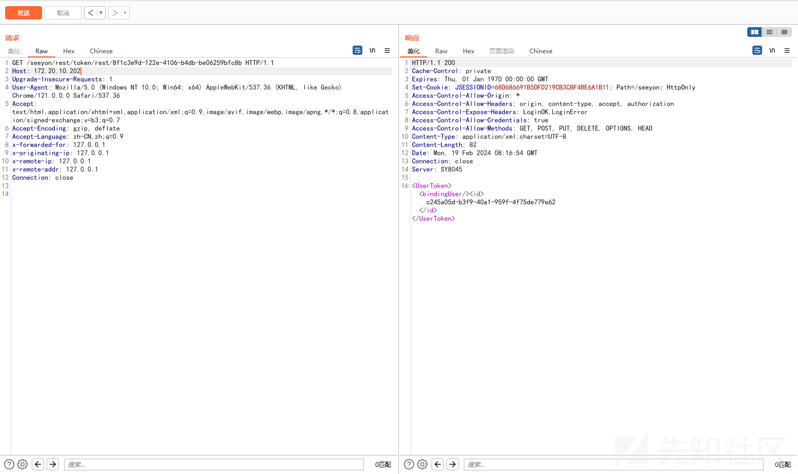](https://xzfile.aliyuncs.com/media/upload/picture/20240220173757-bb091132-cfd3-1.png)

获取到`token`以后，就可以调用`changePassword`方法修改密码了，调用路径`/seeyon/rest/orgMember/{id}/password/{password}`，这里将`system`用户密码修改为`123456`。

[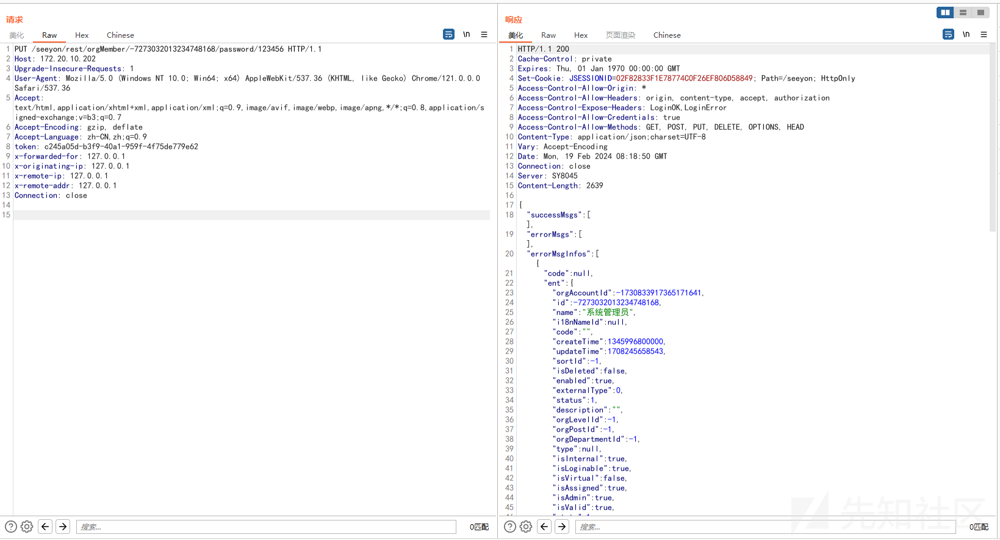](https://xzfile.aliyuncs.com/media/upload/picture/20240220173803-be983ae4-cfd3-1.png)

通过 system 管理员创建 rest 用户，在通过 rest 用户获取 token，最后通过 token 访问接口修改密码，利用的前提需要一个管理员账号，难免有些鸡肋。而访问 rest 接口只能是 token，而 token 只能通过管理员创建 rest 用户拿到，看起来是个死结，实际上大佬们的思路是另辟蹊径。

### 权限绕过

回到`CTPSecurityFilter.class`的`doFilter`方法中，在进入到`rest`接口的权限校验方法前，会先判断是不是`SpringController`的请求。

[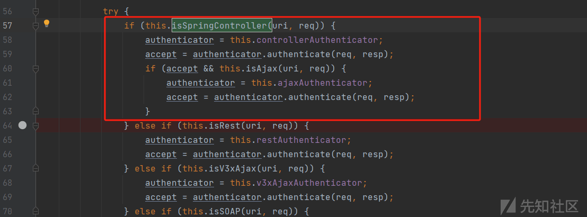](https://xzfile.aliyuncs.com/media/upload/picture/20240220173808-c190437c-cfd3-1.png)

当`uri`的后缀为`.do`或者 `.do;jessionid=`的时候，那么就会进入到`SpringControllerAuthenticator`的`authenticate`方法中进行验证。

[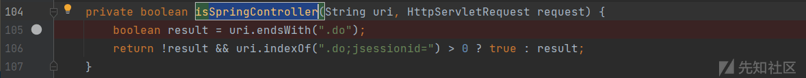](https://xzfile.aliyuncs.com/media/upload/picture/20240220173813-c4a8d15a-cfd3-1.png)

而 rest 接口修改密码的路由为`/seeyon/rest/orgMember/-7273032013234748168/password/123456`，`123456`为我们需要修改的密码，当把密码写成`123456.do`或者`123456.do;jessionid=` ，即可让该请求走`SpringControllerAuthenticator`的`authenticate`方法中进行验证，所以只需要普通用户的权限就可以修改管理员的密码。

[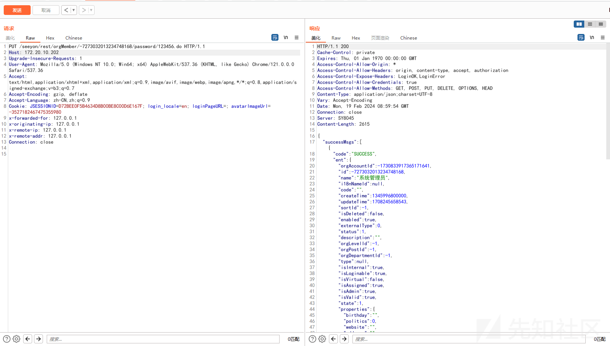](https://xzfile.aliyuncs.com/media/upload/picture/20240220173818-c76892f4-cfd3-1.png)

### 武器化利用思考

致远中存在一些接口，是可以 RCE 的，但是设置了访问权限，当拿到管理员权限以后，我们可以通过管理员权限为普通用户赋予一些访问权限，然后调用这些接口实现 RCE，另一个是通过管理员权限创建普通用户留后门。

### 修复

在致远 8.2 之后版本的`CTPSecurityFilter.class`中，除验证 uri 路径以`.do`结尾以外，还验证了该 uri 是否为`rest`接口，限制了普通用户禁止通过`SpringController`的验证逻辑去访问`rest`接口。

[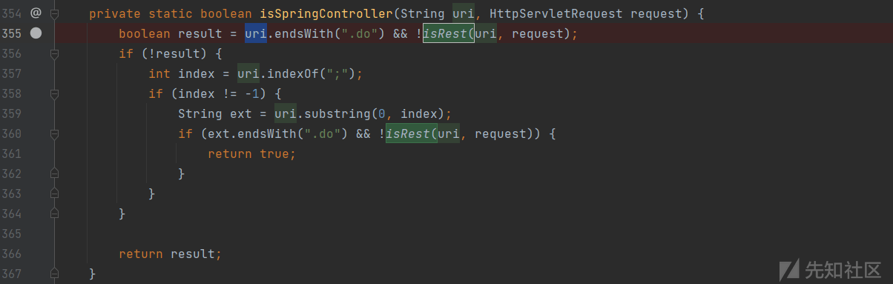](https://xzfile.aliyuncs.com/media/upload/picture/20240220173825-cb8e7f88-cfd3-1.png)
