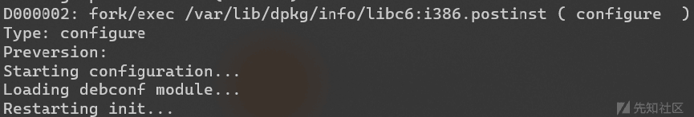
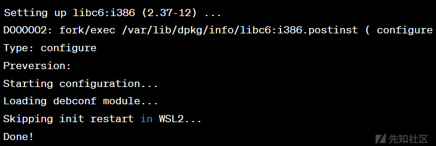
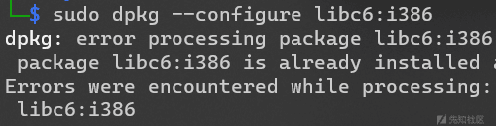

# 解决 WSL 中 libc6:i386 配置卡顿问题及深入探讨 - 先知社区

解决 WSL 中 libc6:i386 配置卡顿问题及深入探讨

- - -

**概括：**  
\----在使用 pwndbg 的 setup 脚本安装环境时，遇到了在 WSL2 中配置 libc6:i386 时的卡顿问题。尝试了多次重新配置，都卡在了 "Setting up libc6:i386"步骤。

**问题分析：**  
\----在 libc6:i386 的安装脚本 /var/lib/dpkg/info/libc6:i386.postinst 中，执行了 telinit u 操作，用于重新初始化系统。在 WSL2 中，对 telinit 的支持存在问题，导致卡顿。

```plain
if [ "$TELINIT" = "yes" ]; then
    telinit u 2>/dev/null || true ; sleep 1
fi
```

**解决过程：**  
查看脚本源代码

```plain
#!/bin/sh
set -e
type=$1
preversion=$2
checkpkgver () {
    local status pkg
    pkg=$1
    status=$(dpkg -s $pkg 2>/dev/null | grep ^Status: | sed -e 's/^Status: \(.*\) \(.*\) \(.*\)/\3/g')
    if [ -n "$status" ] && [ "$status" != "not-installed" ] && [ "$status" != "config-files" ]; then
    echo $(dpkg -s $pkg 2>/dev/null | grep ^Version: | sed -e 's/^Version: *//');
    fi
}
if [ "$type" = configure ]
then
    # Load debconf module if available
    if [ -f /usr/share/debconf/confmodule ] ; then
    . /usr/share/debconf/confmodule
    fi
    # Only change LC_ALL after loading debconf to ensure the debconf templates
    # are properly localized.
    export LC_ALL=C
    if [ -n "$preversion" ] && [ -x "$(command -v ischroot)" ] && ! ischroot; then
    if dpkg --compare-versions "$preversion" lt 2.37; then
        check="apache2.2-common apache apache-ssl apache-perl autofs at"
        check="$check boa cucipop courier-authdaemon cron cups exim"
        check="$check exim4-base dovecot-common cucipop incron lprng lpr"
        check="$check lpr-ppd mysql-server nis openbsd-inetd"
        check="$check openldapd openssh-server postgresql-common proftpd"
        check="$check postfix postfix-tls rsync samba sasl2-bin slapd"
        check="$check smail sendmail snmpd spamassassin vsftpd"
        check="$check wu-ftpd wu-ftpd-academ wwwoffle"
        check="$check webmin dropbear gdm"
        # NSS services check: 
                echo -n "Checking for services that may need to be restarted..."
        # Only get the ones that are installed, of the same architecture
        # as libc (or arch all) and configured. Restart openssh-server even
        # if only half-configured to continue accepting new connections
        # during the upgrade.
        check=$(dpkg-query -W -f='${binary:Package} ${Status} ${Architecture}\n' $check 2> /dev/null | \
            grep -E "(^openssh-server .* unpacked|installed) (all|${DPKG_MAINTSCRIPT_ARCH})$" | sed 's/[: ].*//')
        # some init scripts don't match the package names
        check=$(echo $check | \
            sed -e's/\bapache2.2-common\b/apache2/g' \
            -e's/\bat\b/atd/g' \
            -e's/\bdovecot-common\b/dovecot/g' \
            -e's/\bexim4-base\b/exim4/g' \
            -e's/\blpr\b/lpd/g' \
            -e's/\blpr-ppd\b/lpd-ppd/g' \
            -e's/\bmysql-server\b/mysql/g' \
            -e's/\bopenssh-server\b/ssh/g' \
            -e's/\bsasl2-bin\b/saslauthd/g' \
            -e's/\bsamba\b/smbd/g' \
            -e's/\bpostgresql-common\b/postgresql/g' \
            )
        echo
        echo "Checking init scripts..."
        for service in $check; do
        invoke-rc.d ${service} status >/dev/null 2>/dev/null && status=0 || status=$?
        if [ "$status" = "0" ] || [ "$status" = "2" ] ; then
            services="$service $services"
        elif [ "$status" = "100" ] ; then
            echo "WARNING: init script for $service not found."
        fi
        done
        if [ -n "$services" ]; then
            if [ -f /usr/share/debconf/confmodule ] ; then
            db_version 2.0
            db_input critical libraries/restart-without-asking || true
            db_go || true
            db_get libraries/restart-without-asking
            if [ "$RET" != true ]; then
            db_reset glibc/restart-services
            db_set glibc/restart-services "$services"
            db_input critical glibc/restart-services || true
            db_go || true
            db_get glibc/restart-services
            if [ "x$RET" != "x" ]
            then
                services="$RET"
            else
                services=""
            fi
            fi
        else
            echo
            echo "Name Service Switch update in the C Library: post-installation question."
            echo
            echo "Running services and programs that are using NSS need to be restarted,"
            echo "otherwise they might not be able to do lookup or authentication any more"
            echo "(for services such as ssh, this can affect your ability to login)."
            echo "Note: restarting sshd/telnetd should not affect any existing connections."
            echo
            echo "The services detected are: "
            echo "        $services"
            echo
            echo "If other services have begun to fail mysteriously after this upgrade, it is"
            echo "probably necessary to restart them too.  We recommend that you reboot your"
            echo "machine after the upgrade to avoid NSS-related troubles."
            echo
            frontend=`echo "$DEBIAN_FRONTEND" | tr '[:upper:]' '[:lower:]'`
            if [ "$frontend" = noninteractive ]; then
                echo "Non-interactive mode, restarting services"
                answer=yes
            else
                echo -n "Do you wish to restart services? [Y/n] "
                read answer
                case $answer in
                N*|n*) services="" ;;
                *) ;;
                esac
            fi
        fi
        echo
        if [ "$services" != "" ]; then
            echo "Restarting services possibly affected by the upgrade:"
            failed=""
            for service in $services; do
            case "$service" in
                gdm)
                echo -n "  $service: reloading..."
                if invoke-rc.d ${service} reload > /dev/null 2>&1; then
                    echo "done."
                else
                    echo "FAILED! ($?)"
                    failed="$service $failed"
                fi
                ;;
                *)
                echo -n "  $service: restarting..."
                if invoke-rc.d ${service} restart > /dev/null 2>&1; then
                    echo "done."
                else
                    echo "FAILED! ($?)"
                    failed="$service $failed"
                fi
                ;;
            esac
            done
            echo
            if [ -n "$failed" ]; then
                if [ -f /usr/share/debconf/confmodule ] ; then
                    db_fset glibc/restart-failed seen false
                db_subst glibc/restart-failed services "$failed"
                db_input critical glibc/restart-failed || true
                db_go || true
            else
                echo "The following services failed to start: $failed"
                echo
                echo "You will need to start these manually by running \`invoke-rc.d <service> start'"
                echo "If the service still fails to start, you may need to file a bug on"
                echo "${DPKG_MAINTSCRIPT_PACKAGE}:${DPKG_MAINTSCRIPT_ARCH} or the service involved."
                frontend=`echo "$DEBIAN_FRONTEND" | tr '[:upper:]' '[:lower:]'`
                if [ "$frontend" != noninteractive ]; then
                    echo
                    echo -n "Press ENTER to continue: "
                    read foo
                fi
            fi
            else
            echo "Services restarted successfully."
                    fi
        fi
                # Shut down the frontend, to make sure none of the
        # restarted services keep a connection open to it
            if [ -f /usr/share/debconf/confmodule ] ; then
            db_stop
        fi
        else
        echo "Nothing to restart."
        fi
    fi # end upgrading and $preversion lt 2.37
    fi # Upgrading
    # Restart init.  Currently handles chroots, systemd and upstart, and
    # assumes anything else is going to not fail at behaving like
    # sysvinit:
    TELINIT=yes
    if ischroot 2>/dev/null; then
        # Don't bother trying to re-exec init from a chroot:
        TELINIT=no
    elif [ -n "${DPKG_ROOT:-}" ]; then
        # Do not re-exec init if we are operating on a chroot from outside:
        TELINIT=no
    elif [ -d /run/systemd/system ]; then
        # Restart systemd on upgrade, but carefully.
        # The restart is wanted because of LP: #1942276 and Bug: #993821
        # The care is needed because of https://bugs.debian.org/753725
        # (if systemd --help fails the system might still be quite broken but
        # that seems better than the kernel panic that results if systemd
        # cannot reexec itself).
        TELINIT=no
        if systemd --help >/dev/null 2>/dev/null; then
            systemctl daemon-reexec
        else
            echo "Error: Could not restart systemd, systemd binary not working" >&2
        fi
    fi
    if [ "$TELINIT" = "yes" ]; then
        telinit u 2>/dev/null || true ; sleep 1
    fi
fi
exit 0
```

\----在脚本中关键操作插入 echo 语句，定位卡顿发生的位置。  
\----这里不放示例了，没什么技术含量，加 ECHO 就行  
\----修改后再次运行 sudo dpkg --configure -a -D777 执行重新配置  
[](https://xzfile.aliyuncs.com/media/upload/picture/20240202173252-09cb113c-c1ae-1.png)  
\----可见，卡在了 Restarting init 操作  
回到源代码取出相关代码段

```plain
if [ "$TELINIT" = "yes" ]; then
    echo "Restarting init..."
    telinit u 2>/dev/null || true ; sleep 1
fi
```

\----观察代码位置，处于脚本末端，exit 0 之前，可见脚本前面的配置操作都已执行，此处是最后一个操作  
\----telinit u 用于重启 init 对系统进行初始化，其中包括配置文件  
\----由于 WSL 的限制，该命令并不能运行，导致脚本卡住，无法继续 apt 后续操作  
于是解决方案为： 
\----通过重启 WSL 加载配置文件，避免执行 init 重启函数，确保脚本完整性，成功配置 libc 而不跳过执行。  
将代码修改为：

```plain
if [ "$TELINIT" = "yes" ]; then
    echo "Restarting init..."
fi
```

**验证解决方案**  
\----执行 sudo dpkg --configure libc6:i386  
\----回显并没有卡在 telinit，命令成功的执行了  
然后回到问题的最初，再次运行 pwndbg 的 setup 脚本  
[](https://xzfile.aliyuncs.com/media/upload/picture/20240202174605-e23c0282-c1af-1.png)  
成功跳过，并继续了后续安装  
[](https://xzfile.aliyuncs.com/media/upload/picture/20240202174705-06514092-c1b0-1.png)  
dpkg 也提示已配置

至此问题已解决

**深入探讨：**

**telinit 以及 init：**  
\----init 进程是 Linux 和 Unix 系统中的第一个用户空间进程，主要负责初始化系统环境和启动其他用户空间进程。其功能包括分配系统资源、设定系统默认状态、启动系统服务和管理进程的生命周期。init 的职责是确保系统在引导过程中正确配置，为用户提供一个可用的工作环境。  
\----而 telinit 是一个用于向 Linux 系统的 init 进程发送信号的命令。init 进程是系统的第一个用户空间进程，负责启动和管理其他进程。telinit 的主要作用是发送信号，通知 init 进程改变运行级别或重新初始化。在本例中，它发送了 u 参数，表示要求 init 重新初始化系统

**WSL 目前我所发现的诟病：**  
\----WSL 作为目前在 windows 上使用 linux 最好的方案，它在自己的使用优势上也有着不少的潜在问题和使用限制。目前我所接触到的问题，其中，在 win10 对 WSL 进行网络桥接是几乎无法进行的操作，而在 win11 上得到了解决。  
\----其次就是在使用 mkfifo 创建管道时，也同样受着 WSL 的限制，无法使用  
\----其次就是本次出现的问题，init 服务并不是用户在使用时可控的，可能有其他方法解决，但是都是对 WSL 的操作

**为什么 WSL 存在这么多的限制？:**  
\----首先是因为内核和架构问题，WSL 终究是运行在 Windows 上，它同样受 Windows 的影响，用户的操作过程其实就是一个不断翻译和适配的过程，他可能无法完美适配所有 linux，导致很多问题的出现  
\----进程管理方面，WSL 并没有完全将 linux 和 windows 之间的通道完全打通，两者在用户权限和安全模型的方面有明显的差异，而 WSL 就是在这个过程进行调解，这些差异导致某些功能或命令无法直接映射或受到一些限制。我预测这也是目前 MS 正在解决的目标。  
\----在 Windows 上没有完美的运行 linux 方案，但是 WSL 是目前最好的方案，而为了达到这个目标，必须牺牲一些 Linux 特有的功能进行适度的折衷。

**建议：**  
\----建议玩 WSL 的用户，如果没有特殊需求还是升级 win11 吧，与 win10 的 WSL 相差太大了，性能方面也有很多提升。  
\----在面对问题时，坚持不懈尝试，即便网络上缺乏相关资料，也可能成为开创者。深入挖掘底层原理是最有价值的学习路径。

以上观点及认知仅代表我个人，如内容有差异，也请各位多多交流
