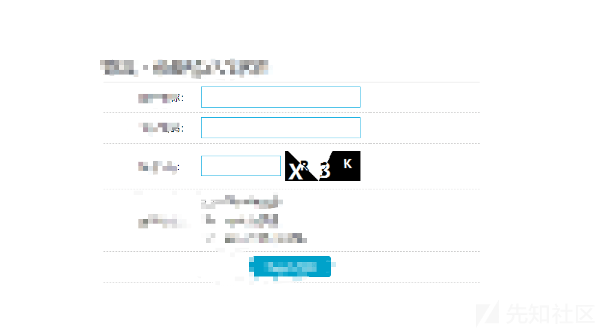
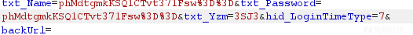
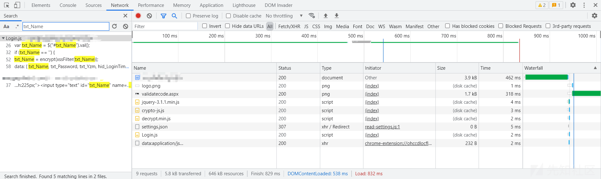
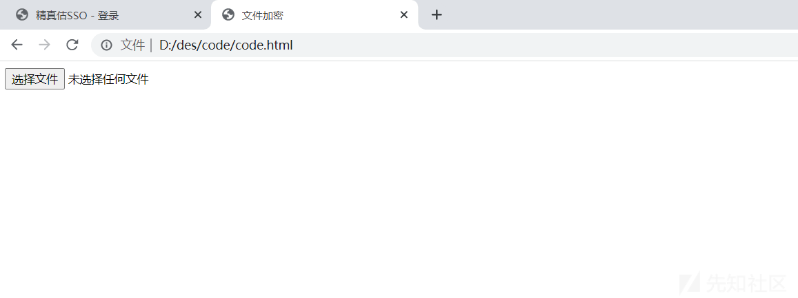
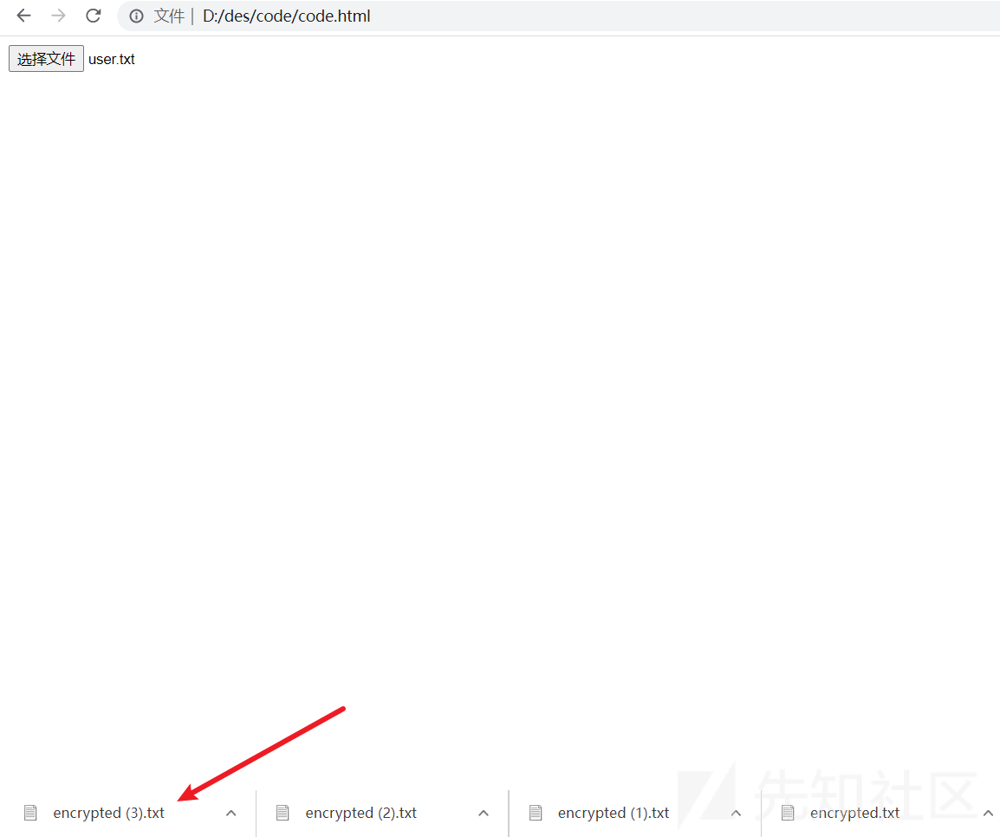
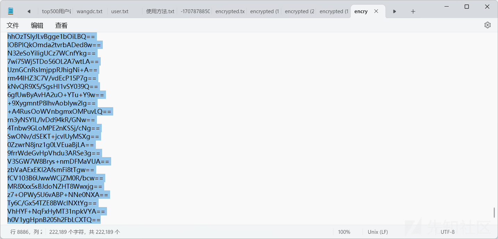

# 记一次 src 挖掘过程中遇到的前端 js 加密爆破 - 先知社区

记一次 src 挖掘过程中遇到的前端 js 加密爆破

- - -

[](https://xzfile.aliyuncs.com/media/upload/picture/20240214110237-81dd8296-cae5-1.png)

开局一个登录界面，由于测试其他系统的时候感觉这个系统的口令强度整体做的比较弱 (其他系统也有存在弱口令的情况)，就想着对这个登录进行爆破

首先要测测这里的验证码验证机制是真还是假的，测试发现对于同一个验证码是可以重放不同用户名密码，这就为后续提供了条件

我们先随机填一个账户密码抓包

[](https://xzfile.aliyuncs.com/media/upload/picture/20240214110536-eccfa6b0-cae5-1.png)

发现用户名密码都做了加密处理，之前爆破这里都放弃了，现在重新审视一下。

得知加密字段是 txt\_Name txt\_Password，在前端 js 搜索一下这两个字段

[](https://xzfile.aliyuncs.com/media/upload/picture/20240214110821-4f5a86b0-cae6-1.png)

成功搜到了相关加密代码

```plain
if (checkResult) {
        txt_Name = encrypt(xssFilter(txt_Name));
        txt_Password = encrypt(xssFilter(txt_Password));
```

得知这里使用了 encrypt 函数对密码用户名进行加密，xssFilter 可以忽略，是对一些特殊字符的过滤

到这里试试了网上很多的方法没有成功，不知道是环境问题还是哪里。

我也一点也不懂前端 js 技术，思考了一下 html 文件的大致逻辑，html 引用一系列 js 文件，这里

```plain
<script src="Js/jquery-3.1.1.min.js"></script>
```

的代码就大致相当于 php 中的文件包含，将 js 引入这个 html 文件，那我们能不能直接将网页中的所有 js 文件下载下来，然后利用本地的 html 文件引用，本地 html 文件再调用 js 中的加密函数。  
理论可以，我们开始实践

由于我不会 js 以及 html 的编写，这里向 chatgpt 说了一下我们的诉求，生成了对应的 html 文件

```plain
<!DOCTYPE html>
<html lang="en">
<head>
<meta charset="UTF-8">
<title>文件加密</title>
<script src="jquery-3.1.1.min.js"></script>  //这个部分引入网页的所有 js 文件
    <script src="crypto-js.js"></script>
    <script src="decrypt.min.js"></script>
    <script src="Login.js"></script>
<script>


    function handleFileSelect(event) {
        const file = event.target.files[0];
        const reader = new FileReader();

        reader.onload = function(e) {
            const content = e.target.result;
            const lines = content.split('\n');
            let encryptedLines = [];

            lines.forEach(line => {
                const encrypted = encrypt(line.trim()); //修改你的前端加密函数名称
                encryptedLines.push(encrypted);
                console.log(encrypted);
            });

            // 将加密的结果输出到一个新的 txt 文件
            const encryptedContent = encryptedLines.join('\n');
            const blob = new Blob([encryptedContent], { type: 'text/plain' });
            const url = URL.createObjectURL(blob);
            const link = document.createElement('a');
            link.href = url;
            link.download = 'encrypted.txt';
            link.click();
        };

        reader.readAsText(file);
    }
</script>
</head>
<body>
    <input type="file" id="fileInput" onchange="handleFileSelect(event)">
</body>
</html>
```

使用方法是我们首先下载网页的所有 js 文件，然后引用的这个文件中 (这个操作可以使用右键保存网页批量下载)，并且我们要知道前端加密数据的函数名，修改 html 文件中的函数名（位置在代码中以及标出），比如这里就是 encrypt

然后我们打开这个网页

[](https://xzfile.aliyuncs.com/media/upload/picture/20240214111639-77bdc77e-cae7-1.png)

选择一个用户名字典

[](https://xzfile.aliyuncs.com/media/upload/picture/20240214111701-84f55b64-cae7-1.png)

网页就会自动下载加密好的文本文件

[](https://xzfile.aliyuncs.com/media/upload/picture/20240214111729-95b96f80-cae7-1.png)

这里加密之前的字典是一行形式的，接着我们就可以直接导入 burpsuite 中字典进行爆破

综上就可以实现无需前端逆向知识，无需 js 文件编写知识实现对前端 js 加密爆破绕过的一种方法，对我这种小白很友好，文章技术含量也很低，仅仅提供一种便捷简单的方法，感谢阅读。
