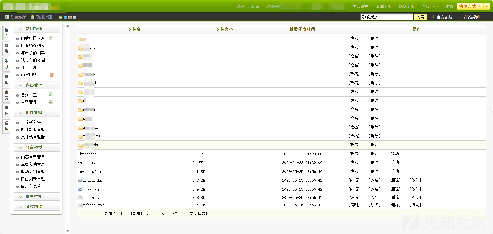
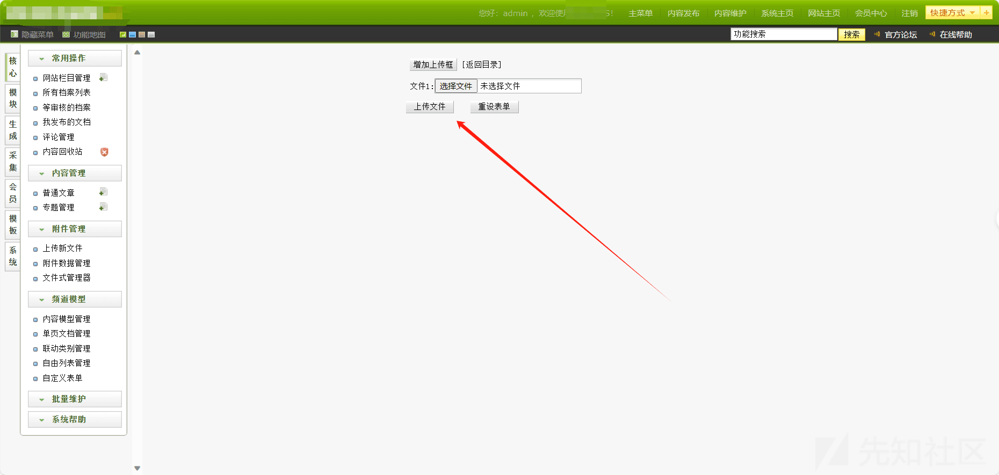
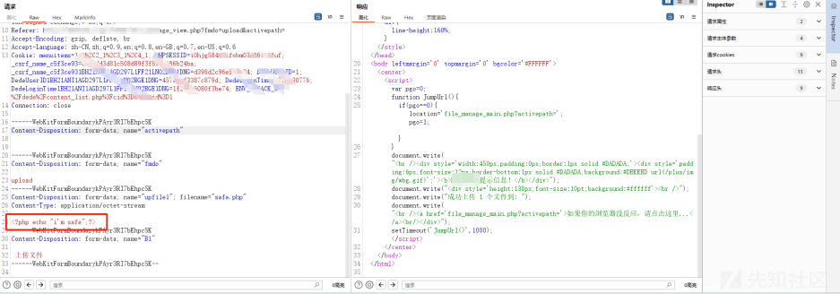
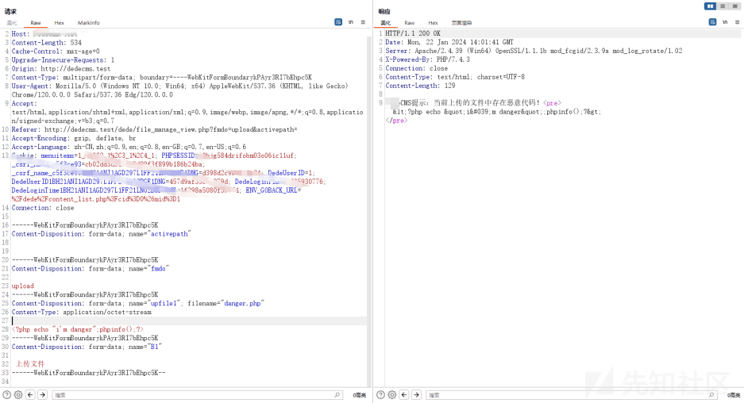
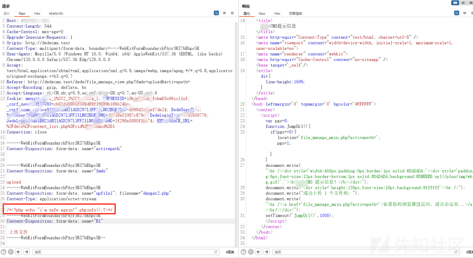
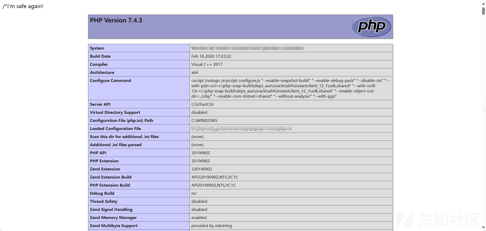
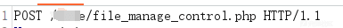
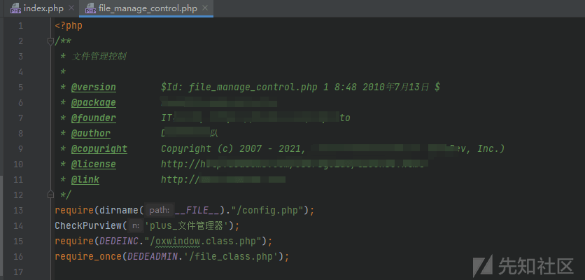

# 记一次代码审计中后台 getshell-bypass - 先知社区

记一次代码审计中后台 getshell-bypass

- - -

内容是去年在挖 xxcms 的时候发现的此漏洞，主要是针对上传点的检测绕过。

### 复现

登陆后台->文件管理器->文件上传  
[](https://xzfile.aliyuncs.com/media/upload/picture/20240125215051-c06a0abe-bb88-1.png)  
先做正常文件的上传，传入<?php echo "i'm safe";?>，正常上传。  
[](https://xzfile.aliyuncs.com/media/upload/picture/20240125215214-f1b39c2a-bb88-1.png)  
[](https://xzfile.aliyuncs.com/media/upload/picture/20240125215225-f874816e-bb88-1.png)  
再做一般恶意代码的上传，<?php echo "i'm danger";phpinfo();?>。当防护规则匹配到添加的 phpinfo()，返回 DedeCMS 提示：当前上传的文件中存在恶意代码！  
[](https://xzfile.aliyuncs.com/media/upload/picture/20240125215248-065f72f2-bb89-1.png)  
再次修改 payload 上传 /*<?php echo "i'm safe again!";phpinfo();?>*/。成功写入 phpinfo()  
[](https://xzfile.aliyuncs.com/media/upload/picture/20240125215255-0a227c04-bb89-1.png)  
[](https://xzfile.aliyuncs.com/media/upload/picture/20240125215300-0d380e2c-bb89-1.png)

### 分析

然后解释一下为什么使用此 payload 绕过，为什么此 payload 能绕过。  
先定位处理文件上传逻辑的代码块：xx/file\_manage\_control.php  
[](https://xzfile.aliyuncs.com/media/upload/picture/20240125215312-146f434a-bb89-1.png)  
去到文件上传的分支  
[](https://xzfile.aliyuncs.com/media/upload/picture/20240125215328-1e03dd4e-bb89-1.png)  
当$fmdo 为 upload 的时候，进入该段代码，进行文件上传的逻辑处理。  
155-177：常规处理上传文件的 PHP 代码。  
我们重点关注处理安全的部分

```plain
if (is_file($file) && ($file_ext == "php" || $file_ext == "htm")) {
                $fp = fopen($file, "r");
                $content = fread($fp, filesize($file));
                fclose($fp);

                // 不允许这些字符
                $content = preg_replace("#(/\*)[\s\S]*(\*/)#i", '', $content);

                global $cfg_disable_funs;
                $cfg_disable_funs = isset($cfg_disable_funs) ? $cfg_disable_funs : 'phpinfo,eval,assert,exec,passthru,shell_exec,system,proc_open,popen,curl_exec,curl_multi_exec,parse_ini_file,show_source,file_put_contents,fsockopen,fopen,fwrite,preg_replace';
                $cfg_disable_funs = $cfg_disable_funs.',[$]GLOBALS,[$]_GET,[$]_POST,[$]_REQUEST,[$]_FILES,[$]_COOKIE,[$]_SERVER,include,require,create_function,array_map,call_user_func,call_user_func_array,array_filert';
                foreach (explode(",", $cfg_disable_funs) as $value) {
                    $value = str_replace(" ", "", $value);
                    if(!empty($value) && preg_match("#[^a-z]+['\"]*{$value}['\"]*[\s]*[([{']#i", " {$content}") == TRUE) {
                        $content = dede_htmlspecialchars($content);
                        @unlink($file);
                        die("DedeCMS提示：{$file_base}文件中存在恶意代码！<pre>{$content}</pre>");
                    }
                }
            }
```

简单分为 4 个部分:a,b,c,d  
文件后缀为 php 或 htm

```plain
if (is_file($file) && ($file_ext == "php" || $file_ext == "htm"))
```

正则表达式：/*xxxx*/格式的注释内容会被替换成空字符串

```plain
$content = preg_replace("#(/\*)[\s\S]*(\*/)#i", '', $content);
```

保证$cfg\_disable\_funs 的值为需检测的危险函数、危险变量等

```plain
$cfg_disable_funs = isset($cfg_disable_funs) ? $cfg_disable_funs : 'phpinfo,eval,assert,exec,passthru,shell_exec,system,proc_open,popen,curl_exec,curl_multi_exec,parse_ini_file,show_source,file_put_contents,fsockopen,fopen,fwrite,preg_replace';
$cfg_disable_funs = $cfg_disable_funs.',[$]GLOBALS,[$]_GET,[$]_POST,[$]_REQUEST,[$]_FILES,[$]_COOKIE,[$]_SERVER,include,require,create_function,array_map,call_user_func,call_user_func_array,array_filert';
```

对文件写入的内容检测上面的$cfg\_disable\_funs 的值

```plain
if(!empty($value) && preg_match("#[^a-z]+['\"]*{$value}['\"]*[\s]*[([{']#i", " {$content}") == TRUE) {
  $content = dede_htmlspecialchars($content);
  @unlink($file);
  die("xxCMS 提示：{$file_base}文件中存在恶意代码！<pre>{$content}</pre>");
}
```

整体的逻辑没有问题。造成漏洞的原因有两个：1.当$content 的时候，/*<?php echo "i'm safe again!";phpinfo();?>*/会在步骤 b 的时候逃出变量$content 不参与后面的检测。2./\**/格式的注释是 php 代码中的多行注释格式。位于其中的代码将会被标记为不执行代码。但是当此字符串不包含在 php 的标签中的时候，/*和*/会被视为两段无关的字符串，所以/*<?php echo "i'm safe again!";phpinfo();?>*/==<?php echo "i'm safe again!";phpinfo();?>。  
/*  
code  
\*/

可惜，最后没找到组合拳。。。 =.=
