# 记一次安卓渗透流量被加密的解决思路 - 先知社区

记一次安卓渗透流量被加密的解决思路

- - -

### 0x1 简述

在对银行 APP 进行渗透测试时，遇到了 APP 被加壳以及流量被加密。此篇文章针对以上问题以修改 SO 文件方式进行绕过。

### 0x2 反编译 APP

首先 APP 作了加固，加固方式无从得知，从 MT 管理器提供的加固方法为：**娜迦加固**。仔细分析发现并不是，说明了 MT 管理器有时候提供的加固方法也会出错。反编译截图如下：

[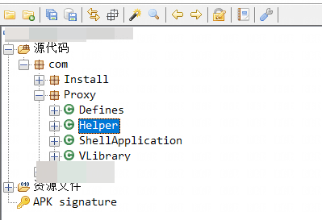](https://testingcf.jsdelivr.net/gh/yunxiaoshu/images/image-20230415154512501.png)

由于反编译后的包较少，直接挨个查看发现了一个可疑函数：

```plain
private static void copyAssets(String output, String input, Context context) {
        try {
            InputStream inputStream = context.getAssets().open(input);
            File localFile = new File(output);
            byte[] bytes = new byte[65536];
            BufferedInputStream bufferedInput = new BufferedInputStream(inputStream);
            BufferedOutputStream bufferedOutput = new BufferedOutputStream(new FileOutputStream(localFile));
            boolean first = true;
            byte[] nagic = {78, 71, 0, 0};
            byte[] magic = {100, 101, 120, 10};
            while (true) {
                int i = bufferedInput.read(bytes);
                if (first) {
                    first = false;
                    if (!(output.endsWith(Defines._DEX) && bytes[0] == nagic[0] && bytes[1] == nagic[1] && bytes[2] == nagic[2] && bytes[3] == nagic[3]) && output.endsWith(Defines._DEX) && bytes[0] == 110 && bytes[1] == 97 && bytes[2] == 103 && bytes[3] == 97) {
                        System.arraycopy(magic, 0, bytes, 0, magic.length);
                    }
                }
                if (i <= 0) {
                    bufferedOutput.flush();
                    bufferedOutput.close();
                    bufferedInput.close();
                    return;
                }
                bufferedOutput.write(bytes, 0, i);
            }
        } catch (Exception e) {
        }
    }
```

[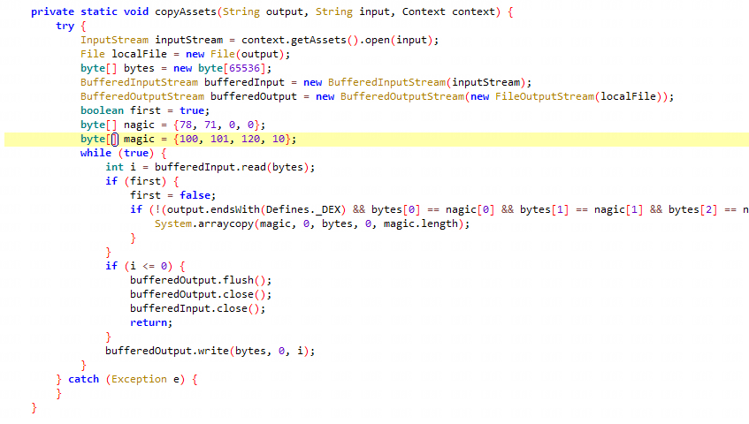](https://testingcf.jsdelivr.net/gh/yunxiaoshu/images/image-20230415154629629.png)

仔细分析可以看出 magic 字段为：**{100, 101, 120, 10}**，换算成 ASCII 码值为：dex，可推测为 dex 文件的文件头，继续往下看会发现最后使用

```plain
bufferedOutput.write(bytes, 0, i);
```

将文件写出，往上追溯代码可以得出输出目录：

[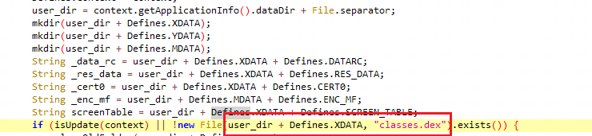](https://testingcf.jsdelivr.net/gh/yunxiaoshu/images/image-20230415155240237.png)

按住 Ctrl 并点击对应变量可以得到输出目录在应用程序的数据目录中.cache 目录下，这样我们安装 APP 并运行后，前往该目录的.cache 目录，便可以看到对应的 dex 文件，这就是原生的 dex 文件，将其导入 IDA 继续进行分析

我们在抓包时可以看到 API 目录为：**mobile**开头的，如下图所示：

[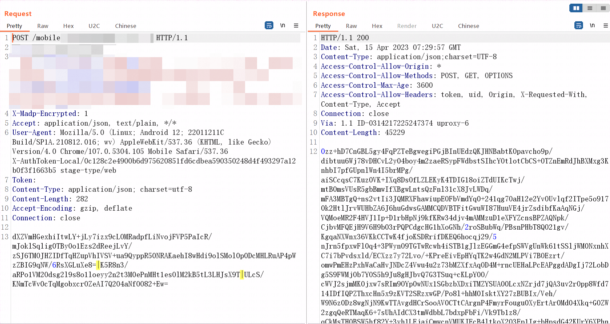](https://testingcf.jsdelivr.net/gh/yunxiaoshu/images/image-20230415155702946.png)

接下来直接搜索**mobile**开头的 API，找到其中一个查看源码，可以在源码附近发现加密函数：**telecomSMEncrypt**

[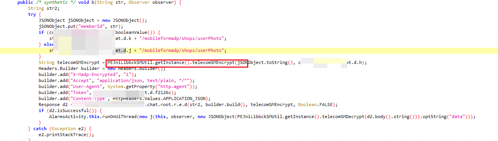](https://testingcf.jsdelivr.net/gh/yunxiaoshu/images/image-20230415160053204.png)

跟进**telecomSMEncrypt**函数可以发现使用了 Native 调用 so 文件里的函数进行加解密：

[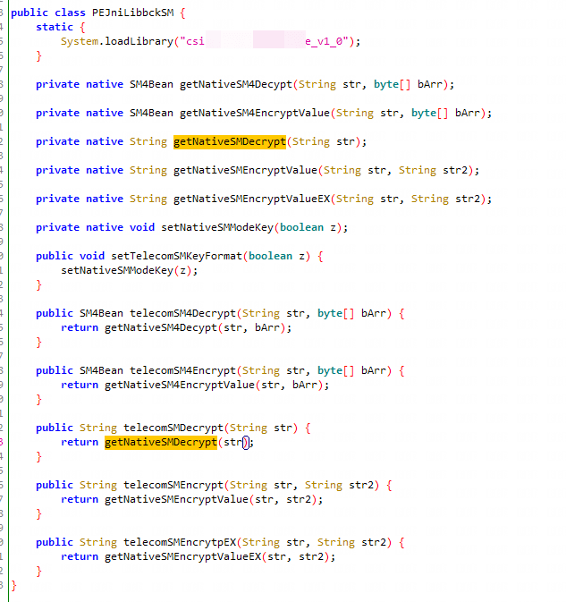](https://testingcf.jsdelivr.net/gh/yunxiaoshu/images/image-20230415160206246.png)

### 0x3 分析 so

那么我们便来分析一下这个 so 文件，使用 ida 打开 so 文件，在左侧函数框处直接搜索：**getNativeSM4EncryptValue**，发现搜索不到，于是搜索**JNI\_Onload**函数，幸运的是这个函数并没有被混淆，于是开始分析：

[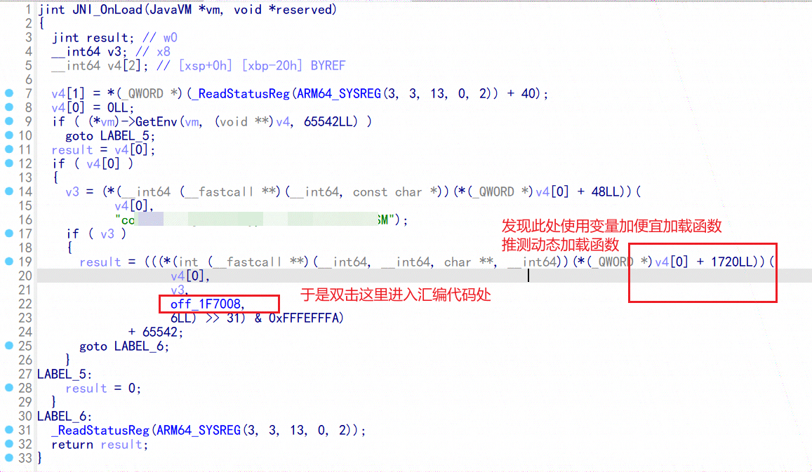](https://testingcf.jsdelivr.net/gh/yunxiaoshu/images/image-20230415160514393.png)

进入后发现函数名显示出来了，我们进入：**getNativeSM4EncryptValue**函数

[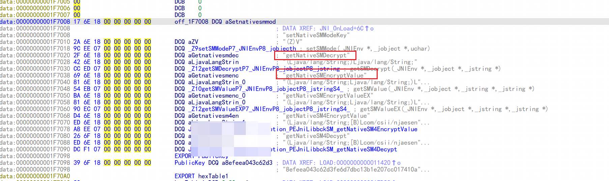](https://testingcf.jsdelivr.net/gh/yunxiaoshu/images/image-20230415160612178.png)

双击进入函数**\_Z10getSMValueP7\_JNIEnvP8\_jobjectP8*jstringS4***：

[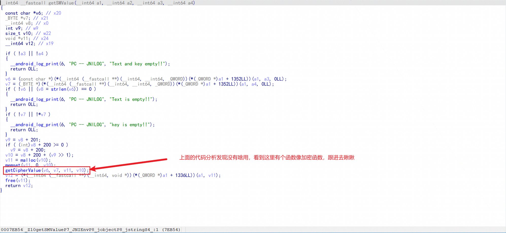](https://testingcf.jsdelivr.net/gh/yunxiaoshu/images/image-20230415160903415.png)

进入这个函数后发现使用 return 返回一个函数，继续往里跟：

[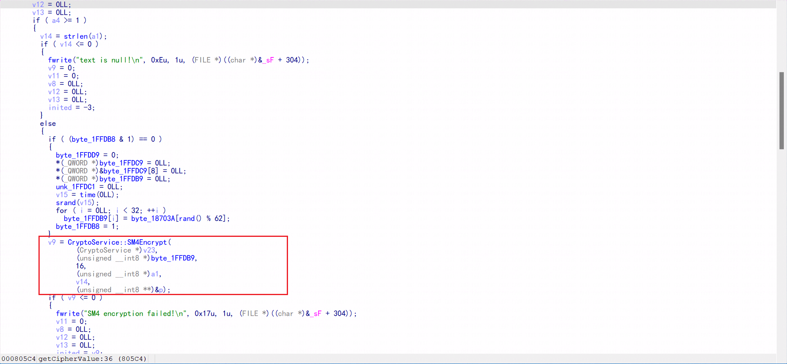](https://testingcf.jsdelivr.net/gh/yunxiaoshu/images/image-20230415161044925.png)

跟进来发现有 SM4 加密的特征了，这里分析了一下，推测**byte\_1FFDB9**为 key 值，**a1**为待加密的原文，我们看上面的**byte\_1FFDB9s**是如何生成的：

[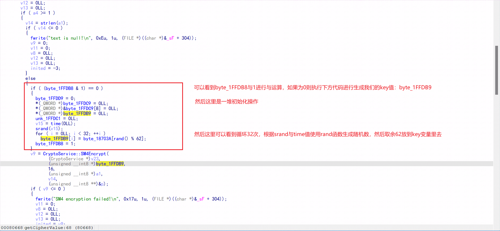](https://testingcf.jsdelivr.net/gh/yunxiaoshu/images/image-20230415161426194.png)

分析出来 key 是 32 位**byte\_18703A**数组的随机值，并且可以看到依据是**byte\_1FFDB8**的值为 0 的情况下，推测为每次打开 APP 都会初始化这个 key 值。知道 key 值得生成方法后，我们需要确定 SM4 算法的模式是什么，我们跟进**SM4Encrypt**函数发现：

[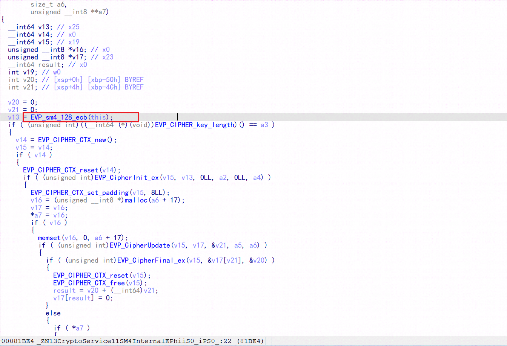](https://testingcf.jsdelivr.net/gh/yunxiaoshu/images/image-20230415161816590.png)

得了，ECB 模式，不需要 IV，所以这里就分析完 SM4 算法了。这里应该会有一个疑问：**既然每次打开 APP 时，key 都会变，我们都知道 ECB 模式的 SM4 算法是使用 key 进行解密的，服务端肯定不知道 key 是多少呀，那么是怎么去解密呢？**既然如此，我们继续回头分析后面的代码：

[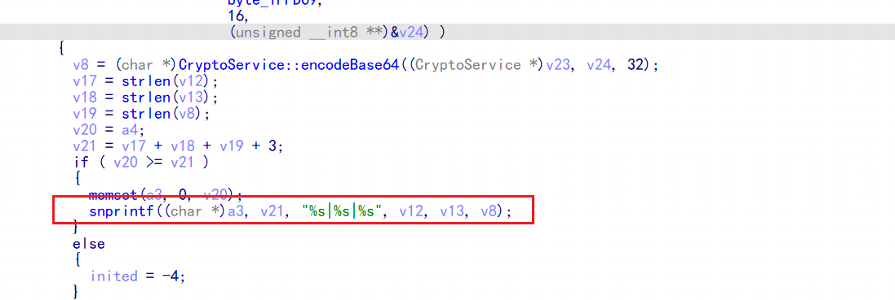](https://testingcf.jsdelivr.net/gh/yunxiaoshu/images/image-20230415162202270.png)

我们注意到上方的代码中出现了：**%s|%s|%s**，回去观察请求体发现也出现了两个 **|** ，因此我们需要确定一下这三个 **%s** 都是什么，我们往前分析 v12，v13 和 v8

[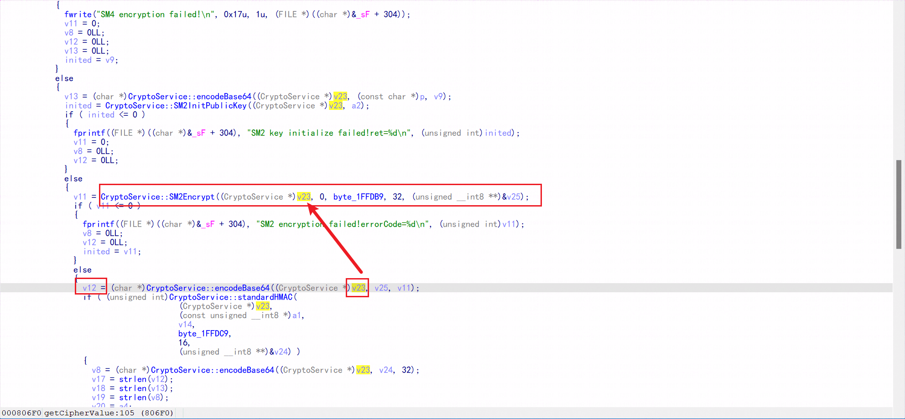](https://testingcf.jsdelivr.net/gh/yunxiaoshu/images/image-20230415162702746.png)

可以看到 v12 是 SM2 加密 key 的值**（但是 SM2 是非对称加密，没有私钥是无法解出 key 值的。而私钥只能在服务端有）**，下方图中可以看到 v13 是 SM4 加密的值

[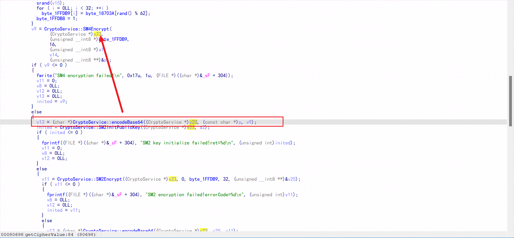](https://testingcf.jsdelivr.net/gh/yunxiaoshu/images/image-20230415162846065.png)

再来看 v8 的值，可以看出 v8 的值是 HMAC 加密后的值，这里应该是 SM3 加密后的值

[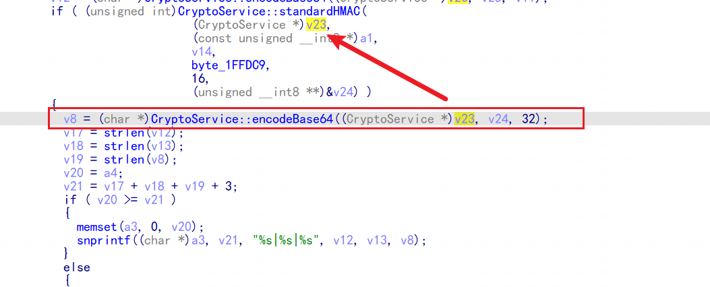](https://testingcf.jsdelivr.net/gh/yunxiaoshu/images/image-20230415163022563.png)

那么其实我们只需要固定住 key 值，之后的所有密文都可以使用我们固定的 key 值进行加解密了，这里有一个思路：把前面的**byte\_18703A**变量中的所有值改成同一个。

[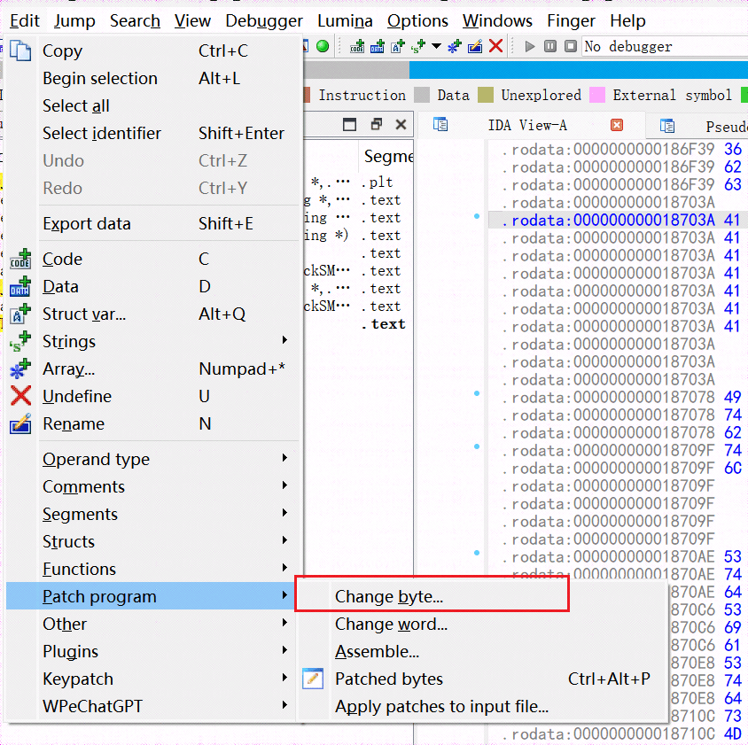](https://testingcf.jsdelivr.net/gh/yunxiaoshu/images/image-20230415163357418.png)

使用上方方法，修改如下，全部固定成大写的 A：

[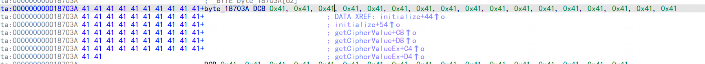](https://testingcf.jsdelivr.net/gh/yunxiaoshu/images/image-20230415163338155.png)

这样做的好处就是获取的 key 值只能是 32 个 A 了，我们就可以直接使用 32 个 A 作为 key 去进行 SM4 解密了。

### 0x4 替换 so

我们将修改好的 so 进行保存：**Edit - Patch program - Apply patches input file...**

然后将其替换值 APK 路径：**/data/app/~~xxxxxxxxx==/lib/arm/**目录下，重启应用程序进行抓包即可。
