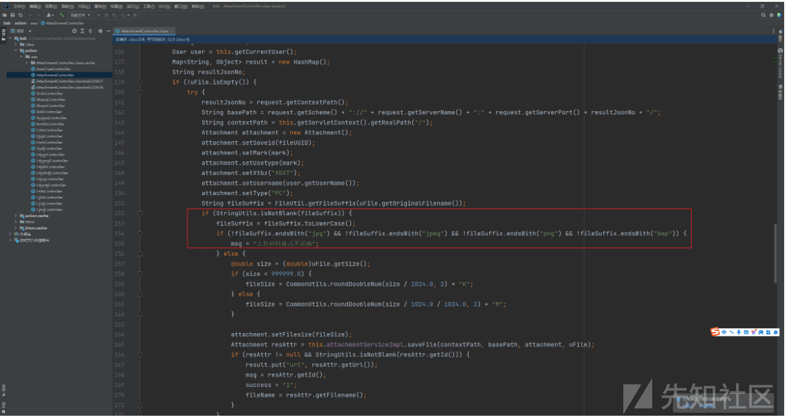
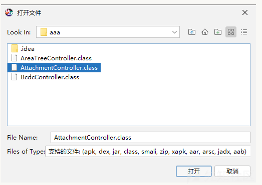

# 记一次差点给 Jadx 提 Issues 的踩坑日记 - 先知社区

记一次差点给 Jadx 提 Issues 的踩坑日记

- - -

# 前言

好心酸写这篇文章的时候，因为已经是下午四点整了，从早上的 10 点开始审这个代码，到现在只解决了一个问题，想 SI 的心都有了，还是含泪记录下本次`Java`​的踩坑记录吧，可能有师傅遇到过可能也觉得我很逗比，但还是发出来减少大家遇到这种问题的情况吧

# 踩坑日记

起因是因为有套 Java 被催着审，于是买了杯维他命水就开始看了，常规简单的操作就不说了什么上依赖反编译啥的，因为这些老生常谈而且作为审计 Java 的师傅来说真的就是家常便饭，所以我反编译啥的只是时间问题，于是就快速一顿操作进行基础环境的搭建就开始审计了

## 文件上传

搜索`upload`​一个一个找 发现了在这里

`@RequestMapping({"/attachment/*"})`​

有个`fileUpload.action`​映射

[](https://xzfile.aliyuncs.com/media/upload/picture/20240226151645-ffbfb022-d476-1.png)

[](https://xzfile.aliyuncs.com/media/upload/picture/20240226151704-0aed7db2-d477-1.png)

跟进`saveFile`​方法 发现是接口的方法，寻找实现接口的类重写的`saveFile`​方法

[](https://xzfile.aliyuncs.com/media/upload/picture/20240226151717-12c1e1fe-d477-1.png)

跟到`\service\impl\AttachmentServiceImpl.java`​

[](https://xzfile.aliyuncs.com/media/upload/picture/20240226151728-19334190-d477-1.png)

关键代码就是

```plain
String fileSuffix = FileUtil.getFileSuffix(uFile.getOriginalFilename()); // 直接获取用户上传的文件名后缀
String fileName = String.valueOf(DateUtils.formatNow("yyyyMMddHHmmssSSS")) + fileSuffix; // 并且与时间进行拼接
 String url = String.valueOf(basePath) + "uploadFile/" + attachment.getMark() + "/" + attachment.getUsername() + "/" + fileName; // 生成文件的路径

//接着就是真正的将上传的文件写入到一个 File 对象当中存储
byte0 = uFile.getBytes();
File targetFile = new File(pathUrl, fileName);
uFile.transferTo(targetFile);
targetFile.setReadOnly();
```

所以代码逻辑就清楚了，后续的关于`Attachment`​其实就是存储文件信息而已，实际已经上传成功了，但是其实这个上传是后台的上传

因为在`web.xml`​中发现过滤器是需要鉴权的

```plain
<filter>
    <filter-name>sessionFilter</filter-name>
    <filter-class>com.xxx.xxx.filter.SessionFilter</filter-class>
  </filter>
<filter-mapping>
    <filter-name>sessionFilter</filter-name>
    <url-pattern>*.action</url-pattern>
  </filter-mapping>
```

[](https://xzfile.aliyuncs.com/media/upload/picture/20240226151745-23925dec-d477-1.png)

就是个判断登录的逻辑，所以只能是后台了，由于是很早很早之前的就拿到的源码，当时是找到了账号的初始密码，所以通过默认密码 + 账号爆破再一次进入到该站的后台当中

上传附件抓到报文

[](https://xzfile.aliyuncs.com/media/upload/picture/20240226151756-29e29338-d477-1.png)

可以发现他的接口如下

```plain
/xxxx/xxxxx/fileUpload.action;jsessionid=xxxxxx?mark=xxxxx&fileUUID=xxxxx
```

说明`fileUUID`​ 跟 `mark`​ 都为可控点并且是某个处理逻辑进行处理的，比较轻松的就是他返回了上传地址

但是上传 jsp 的时候就返回了

`上传材料格式不正确`​

[](https://xzfile.aliyuncs.com/media/upload/picture/20240226151829-3d5e51d6-d477-1.png)

虽然源码比较久远，但是马子还在，于是上去再看了下改过的代码下来 发现他有一个很奇葩的写法

[](https://xzfile.aliyuncs.com/media/upload/picture/20240226151815-35791474-d477-1.png)

我一开始以为是黑名单，但是仔细一看，发现是白名单啊！

```plain
if (!fileSuffix2.endsWith("jpg") && !fileSuffix2.endsWith("jpeg") && !fileSuffix2.endsWith("gif") && !fileSuffix2.endsWith("png") && !fileSuffix2.endsWith("bmp") && !fileSuffix2.endsWith("jsp") && !fileSuffix2.endsWith("js") && !fileSuffix2.endsWith("html")) {
msg = "上传材料格式不正确";}
```

但是可是事实就是传不上去，难道是有什么限制吗？于是全局搜索了下`上传材料格式不正确`​ 关键词，发现仅仅只有四处存在

[](https://xzfile.aliyuncs.com/media/upload/picture/20240226151842-459fe27e-d477-1.png)

然后本地测了一下第一个`上传材料格式不正确`​ 发现肯定是能走进去的

[](https://xzfile.aliyuncs.com/media/upload/picture/20240226151852-4b31f286-d477-1.png)

第二个`上传材料格式不正确`​也不可能 因为根本走不到这里，因为只要后缀名为空就会被`catch`​捕捉到报错而进行报错，并不会因为后缀名为空就进入到这个`上传材料格式不正确`​中

[](https://xzfile.aliyuncs.com/media/upload/picture/20240226151901-50dde870-d477-1.png)

那么其他的就是不是这个接口或者没引用到了，那么回顾下，种种的测试都指向了，我的后缀名`.jsp`​并没有被白名单所匹配到 emmmm。。。存疑？可是我本地没问题啊。。。一样的代码，根本不需要考虑过滤器的原因，如果过滤器这地方拦了就不会显示`上传材料格式不正确`​了，好奇怪

然后经过了两三四五个小时，最终经过了几个小伙伴的帮忙，终于找到了问题！真的 x 了，找到问题的前一个小时里头，我还写了以下笔记

[](https://xzfile.aliyuncs.com/media/upload/picture/20240226151915-58f5f098-d477-1.png)

## 小丑想法

最终发现 TMD 是`Jadx`​的问题，我发现他针对单文件的反编译是很正常的，但是只要是一个目录下，他就发生了一些错乱，比如 增加莫名其妙的代码或者是反编译错误把别的地方的代码混杂在一起，以下是踩坑记录

首先目录结构如下  
[](https://xzfile.aliyuncs.com/media/upload/picture/20240226151924-5e34edb6-d477-1.png)

[](https://xzfile.aliyuncs.com/media/upload/picture/20240226151931-62c59cc2-d477-1.png)

此时以`IDEA的反编译`​ + `jd-gui.exe`​ + `jadx`​ 三个反编译工具进行演示

以下都关注方法`fileUpload`​内容

IDEA 直接打开`AttachmentController.class`​

[](https://xzfile.aliyuncs.com/media/upload/picture/20240226151946-6bb4dc12-d477-1.png)

`jd-gui.exe`​ 直接打开`AttachmentController.class`​

[](https://xzfile.aliyuncs.com/media/upload/picture/20240226151956-71c3cf50-d477-1.png)

此时使用`Jadx`​打开单文件

[](https://xzfile.aliyuncs.com/media/upload/picture/20240226152006-77441ebc-d477-1.png)

[](https://xzfile.aliyuncs.com/media/upload/picture/20240226152016-7d730f96-d477-1.png)

接下来就是坑点了，使用`Jadx`​打开当前的目录

[](https://xzfile.aliyuncs.com/media/upload/picture/20240226152029-852f24f4-d477-1.png)

正当我准备搞清楚问题之后，我满脑子已经想好了如何给`Jadx`​进行提交`Issues`​认为百分百是`Jadx`​的多文件目录反编译问题 然后得到@[skylot](https://github.com/skylot) 那牛子的感谢然后觉得今天一天的踩坑非常的值得，可惜做梦是美好的 然而，当我一打开整个目录发现一样可以正常反编译一点毛病都没我当场已经裂开了，真的不知道用什么心情可以形容当时的我

[](https://xzfile.aliyuncs.com/media/upload/picture/20240226152043-8d30c2d4-d477-1.png)

然后我去洗了把脸重新去看我反编译的目录的时候，我发现了一个东西---->缓存/备份

[](https://xzfile.aliyuncs.com/media/upload/picture/20240226152050-91e6bf22-d477-1.png)

我的妈耶，220627 220926 的`classbak`​ 我没仔细看直接就反编译了，我一口老血吐出来，然后带着这些文件我再次打开这个目录

[](https://xzfile.aliyuncs.com/media/upload/picture/20240226152100-97e154dc-d477-1.png)

果然万恶之源就是这个备份！！

最终问题解决，一天时间又这样子没了，害，这就是`Java`​吧

# 总结

果然`Java`​真是个神奇的东西，稍微不细心一天就没了，原来时间就这么流逝的，好开心，因为`Java`​又活了一天啦，谢谢你`Java`​

回归正题，以后反编译还是要先留个心眼吧，以后 TMD 先看看有无缓存 别上来就直接反编译了，害 裂开，为了避免自己二次踩坑，也是写了个非常简单的脚本，源码第一步！先扫扫看看有无可以的文件后缀吧呜呜呜

```plain
"""
Author: Zjacky
Date: 2024/1/9
Name: bak_finder.py
"""

# rest of the code goes here

import os
import argparse

parser = argparse.ArgumentParser(description='Scan files for keywords.')
parser.add_argument('-r', '--root', help='the root directory to scan')
args = parser.parse_args()

# 定义你想要匹配的关键字列表
keywords = ['bak', 'beifen']


for dirpath, dirnames, filenames in os.walk(args.root):
    for filename in filenames:
        if any(keyword in filename for keyword in keywords):
            print(os.path.join(dirpath, filename))

# python3 back.py -r 目录
```

[](https://xzfile.aliyuncs.com/media/upload/picture/20240226152113-9f759f5a-d477-1.png)

所以最后回看代码，发现是进行了白名单的限制的 所以上传的洞就没了，于是整个流程下来一天又没了。。。。害，又要继续被迫营业了
