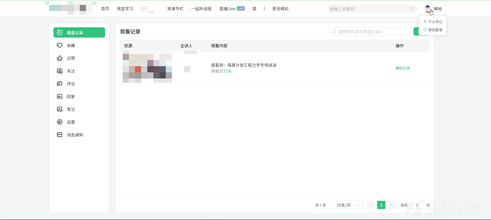
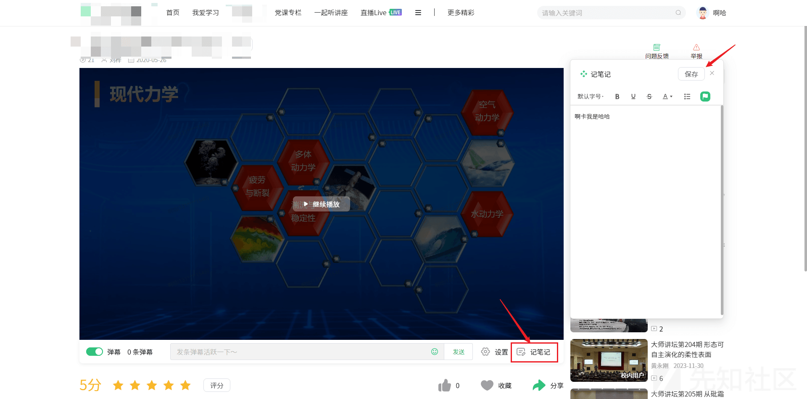
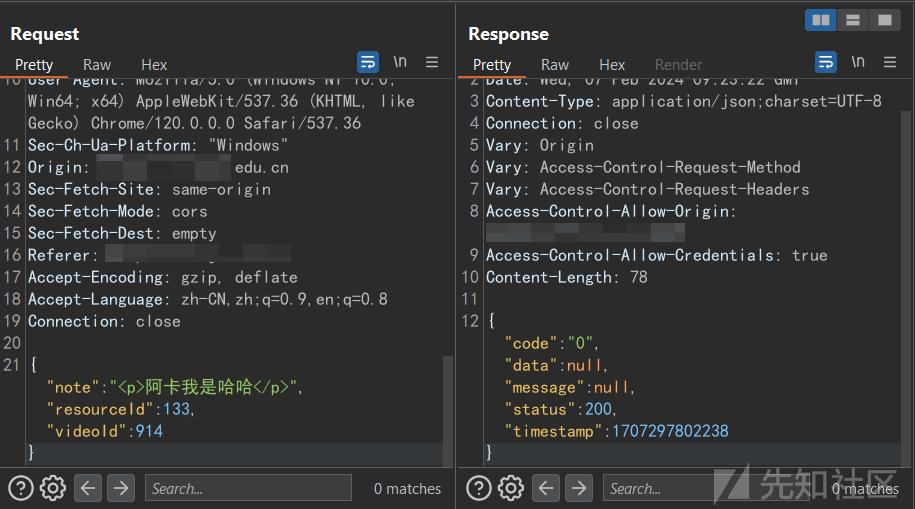
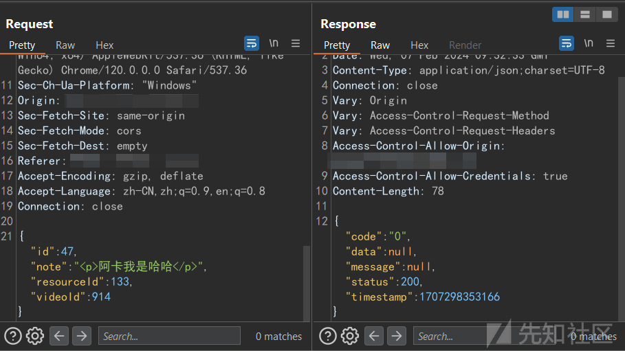
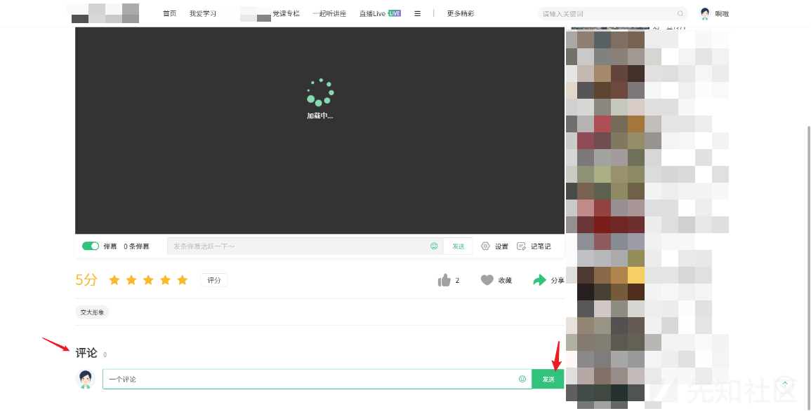
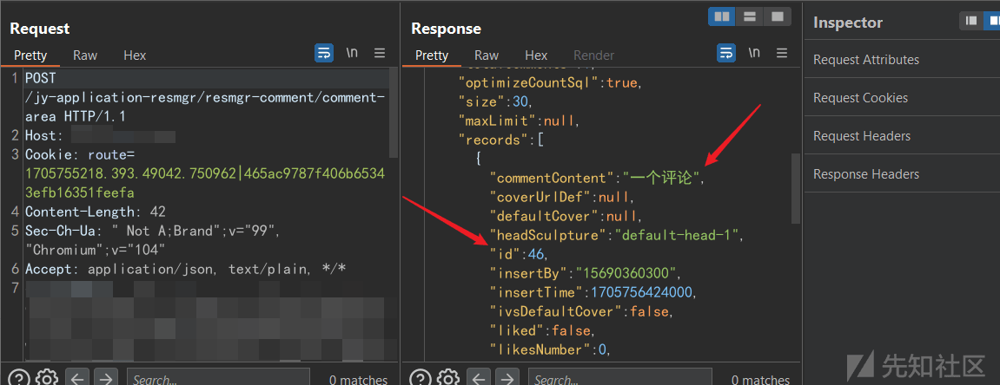
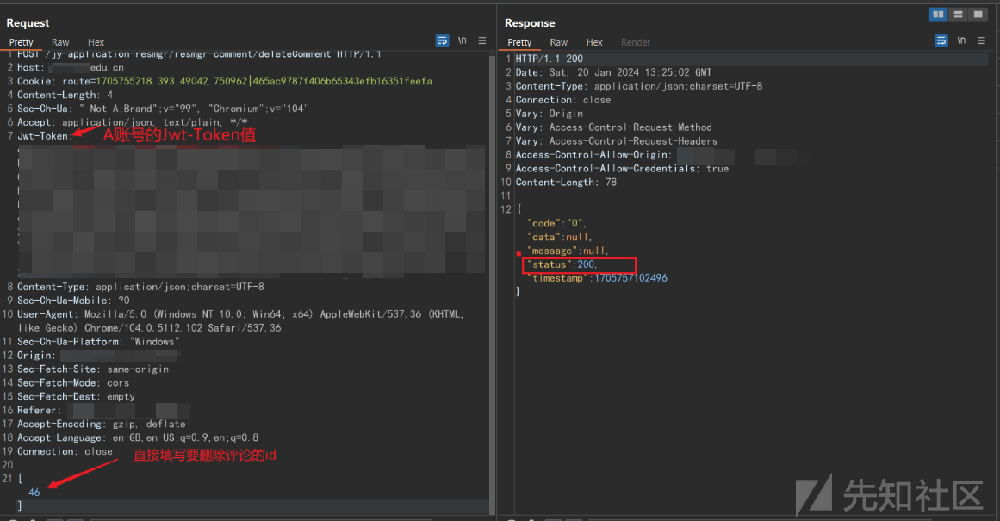
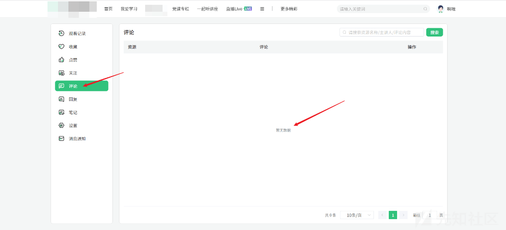

# 记一次有趣的逻辑漏洞挖洞经历 - 先知社区

记一次有趣的逻辑漏洞挖洞经历

- - -

## 前言

前几天在网上冲浪的时候无意间看到了一个 Edu 的站点，是一个很常见的类似 MOOC 的那种在线学习系统，对外开放，同时有注册和登录功能。对于我这种常年低危的菜鸡来说，这是最愿意看到的，因为一个 Web 网站有了登录功能，就代表其网站必须要有权限划分，而有了权限划分，在这里的开发就容易出现很多问题，越权便是一种常见的问题。经过测试，发现这个站点就存在越权的问题，例如 A 账号可以通过发包更改 B 账号内的数据，但这些数据不是密码，个人信息等数据，而是平台上的评论，收藏，和点赞的数据。尽管这些数据或许不是那么敏感，危害听起来不大，但是也算是水平越权的一种了，因此最终这个漏洞提交 EduSRC 后被评为中危。接下来我将回到当初的视角，与大家一起复盘，分析这次挖洞经历。

## 发现过程

1.  访问网站之后，看起来就是一个常见的在线平台首页 (各位师傅请原谅我厚码，因为这个首页 banner 就是这个学校的全景，哈)
    
    
    
2.  右上角可以发现有登录，注册功能，于是果断注册一个账号上去看一下都有什么功能，从个人信息修改部分进行一些常规的 XSS 测试，看看是否能构成存储 XSS；在头像上传部分可以进行文件上传的测试，看看是否存在任意文件上传，说到这里不知道为什么，感觉现在的新系统里很少有任意文件上传了。在侧面可以看到有一些“点赞”，“收藏”，“评论”，“笔记”等功能。
    
    
    
3.  点到随意一个视频，可以看到视频的右下角有一个记笔记的功能，我们随意写一点东西，添加一个笔记，此时我们在 Burp 里面观察分析一下这个笔记是怎么创建的，同时分析一下返回包里面的数据。
    
    
    
4.  抓到的包内容如下，可以看到是 json 形式进行传输的，请求中三个参数，第一个是笔记内容，第二个是资源 id，第三个是视频的 id，返回包内容则是返回留言成功与否和时间戳，其中令人疑惑的就是第二个"resourceld"，这个参数不是从 1 开始的，而是直接跳到 133，于是怀疑当用户记笔记的时候，这个 id 就会自动加 1，跟用户是谁无关，只是根据全站的笔记数自动 +1，同时这个参数也是用户笔记的“标识码”。此时我马上进入个人中心，测试了一下删除笔记功能。
    
    
    
5.  抓包内容如下，也是对一个接口进行的 POST 请求，数据格式为 json，可以发现删除功能的请求包内容确实存在与创建笔记功能请求包中相同的内容，但是多了一个"id"参数，这是怎么回事？这篇笔记是我账号的第一篇笔记，但是 id 却不是从 1 开始的，结合刚才分析，这个 id 看起来更像是一个全站所有用户的笔记数总数，每次用户一旦创建笔记，这个 id 就会加一，但是这个 id 似乎只有在删除的时候抓包才能看到。
    
    
    
6.  综合以上的分析，发现在删除的时候参数中没有判断权限的参数，只是一些删除内容相关的参数，经过测试我们发现若是更改 id 发包，响应包与删除成功的响应包一致，因此判断可能存在越权问题。观察其他功能的请求包，发现跟上面两个都类似，在删除时差不多都是 POST 请求表单携带 id 即可实现删除。
    
7.  开始验证！再注册一个账号，暂且叫他 B 账号，我们用 B 账号发表一个评论。
    
    
    
8.  为了方便测试，此时我们到个人中心里面查看已发表的评论，抓包观察这个评论的 id 是 46。
    
    
    
9.  直接再到 Repeater 里面，这里还是之前测试用 A 账号删除评论时的请求包，直接更改 id 为 46，发包，从返回包看可知删除评论成功。
    
    
    
10.  此时登录 B 账号，点进个人中心，发现之前发送的评论和笔记已经都被删除
    
    
    

## 成因分析

综合请求包和返回包的内容来看，以笔记为例，可以猜测出背后的创建和删除逻辑分别是：

1.  创建：POST 请求接口，直接携带内容，同时后端会给这个笔记直接定义一个 id，这个 id 跟笔记是哪个用户发布的没有关系，不可控，直接强制是全站笔记数 +1，比如 A 账号发布了，这个笔记的 id 是 47，那么无论下一个笔记是谁发的，笔记的 id 都是 48。
2.  删除：POST 请求接口，携带要删除的笔记 id，其实从上面的请求包我们可以看到，评论的删除确实是 POST 请求只携带了 id，但是笔记的删除请求中是携带了“笔记内容”和“视频 id”这类参数，但是测试可以发现，这个参数后端根本没有判断，后端拿到 id 后就直接对相应的笔记执行了删除操作，没有进行鉴权。因此只要从 id 向下遍历到 0，也就把全站所有用户的笔记都删除了。

## 总结复盘

在这之前我也挖掘过类似的逻辑漏洞，那个漏洞是越权删除图片库中其他用户上传的图片，实际与此次的成因大同小异，都是因为没有对平台用户的个人“资产”没有进行鉴权而导致的问题，在类似平台的开发过程中，很多开发者为了方便，后端会直接处理请求中的关键信息 (例如上面笔记的"id")，从而直接对其执行操作，不会再比较其他的数据，这就导致了水平越权问题的出现。作为安全人员，我们也可以多多关注资产中这类功能点，测试其存在的问题。

感谢你的看到这里，我是小安，欢迎你对我的文章进行批评，如果有不清楚的，欢迎给我留言~
