# 记一次白盒审计解决 CTF 题目 - 先知社区

记一次白盒审计解决 CTF 题目

- - -

**在做某次比赛题目遇到的一道 CMS 渗透的题目，www.zip 泄露了源代码，需要现场代码审计漏洞。在系统的网站设置里写入恶意语句后在工具首页生成处重新生成一个 PHP 文件。**  
[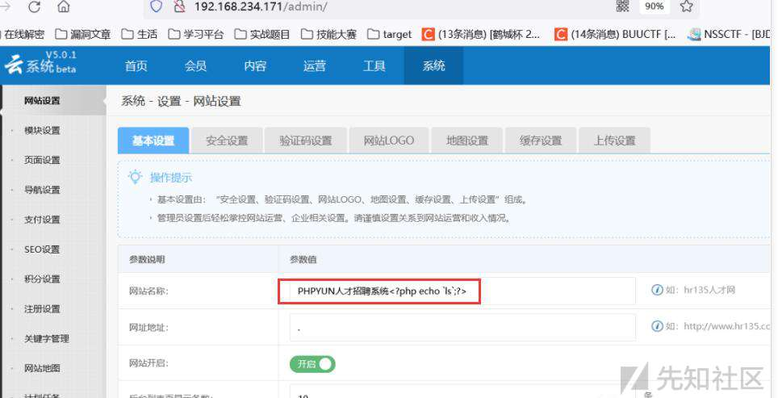](https://xzfile.aliyuncs.com/media/upload/picture/20240221131020-82d12c1a-d077-1.jpg)  
[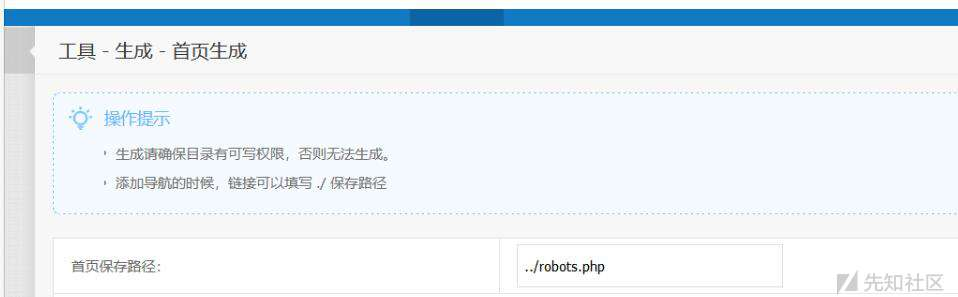](https://xzfile.aliyuncs.com/media/upload/picture/20240221131028-870dce96-d077-1.jpg)  
[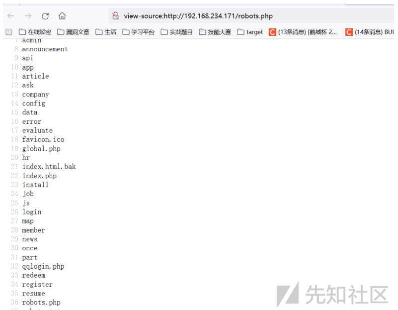](https://xzfile.aliyuncs.com/media/upload/picture/20240221131036-8c1e0d74-d077-1.jpg)

**下面是审计过程：**  
因为是后台漏洞，我们直接去看 admin 目录下的 index.php 文件看下路由怎么写的，两个变量一个 m 一个 c，根据分析就知道$model 是控制功能点具体对应的哪个文件，$action 则对应着文件的具体哪个函数  
[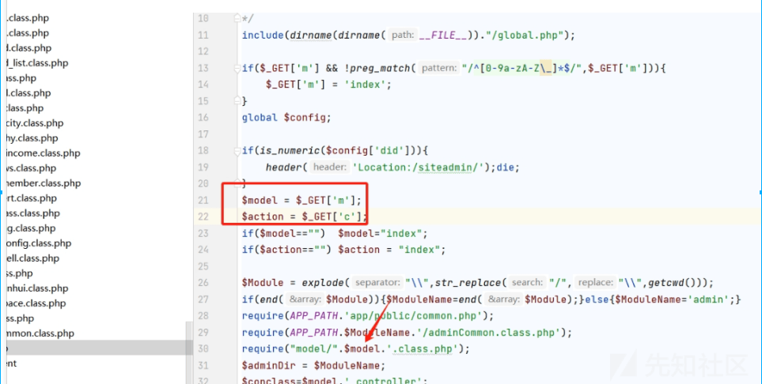](https://xzfile.aliyuncs.com/media/upload/picture/20240221131212-c50adb8a-d077-1.png)  
[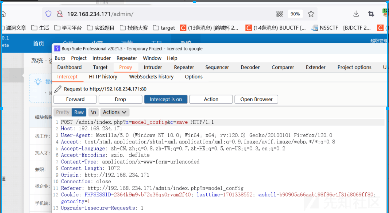](https://xzfile.aliyuncs.com/media/upload/picture/20240221131234-d22c821e-d077-1.png)  
根据我们抓包分析把这个功能点定位到 config.class.php 文件的 save\_action() 功能，看具体的代码其实就在 83 和 85 行。  
[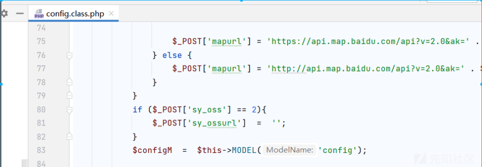](https://xzfile.aliyuncs.com/media/upload/picture/20240221131256-dfb5a244-d077-1.png)  
第 83 行追踪 MODEL，没看太懂好像就是包含了 config.model.php 文件  
[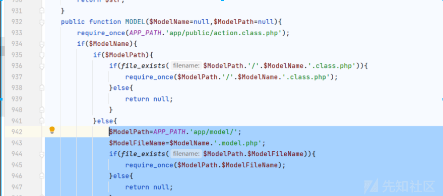](https://xzfile.aliyuncs.com/media/upload/picture/20240221131321-ee5205d6-d077-1.png)  
第 85 行发现将$POST 进行了传值，追踪 setConfig() 方法。首先在数据库中的 admin\_config 表进行查询列名为 name 的那列然后赋值给$config，随后对$config 数组进行遍历给$v，定义了$allList 数组赋值$v\['name'\]，这里就是将遍历后的数组$config 值给它，然后将 POST 传参进来的值进行遍历给$v，然后在 if 判断中检查传进的值是否在原先定义的数组$allList 中，如果在就把参数的值更新掉没有就新增。  
[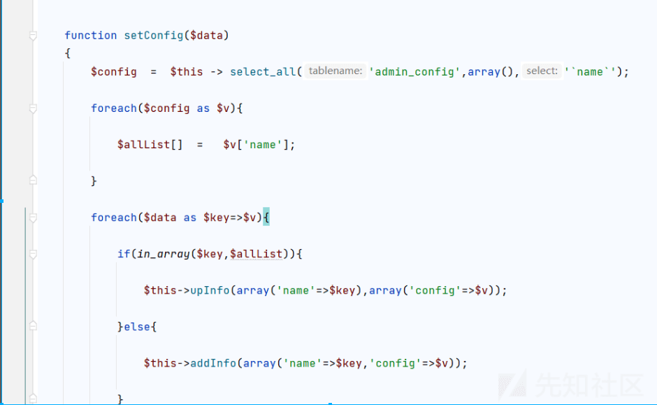](https://xzfile.aliyuncs.com/media/upload/picture/20240221131347-fe0defd0-d077-1.png)  
[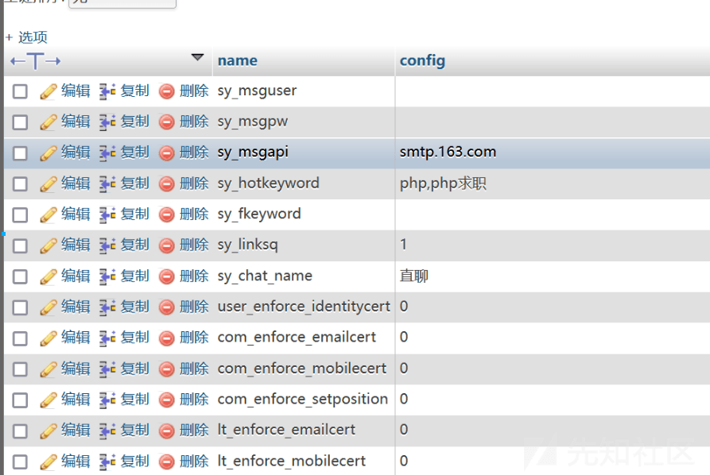](https://xzfile.aliyuncs.com/media/upload/picture/20240221131404-07c56f08-d078-1.png)  
继续追踪下一部分到 cache.class.php 中的 index\_action() 方法，根据观察参数定位到 make\_index\_url 这个参数，调用了 webindex() 方法，追踪  
[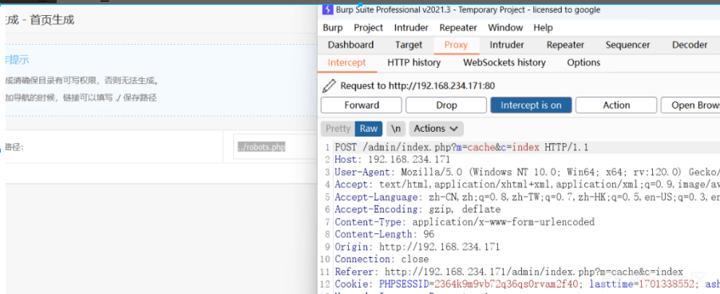](https://xzfile.aliyuncs.com/media/upload/picture/20240221131430-17b18b04-d078-1.png)  
[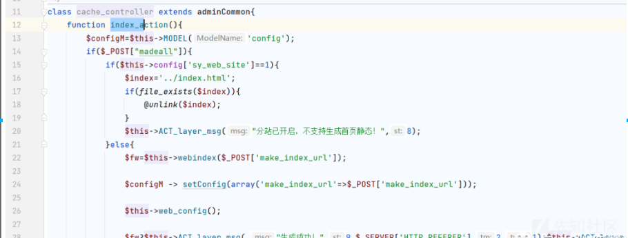](https://xzfile.aliyuncs.com/media/upload/picture/20240221131451-244f5e4a-d078-1.png)  
webindex() 函数的$path，是由是可控的然后进行 fwrite() 写入，$content 处写入的内容就是经过模板渲染后的基本设置的内容。  
[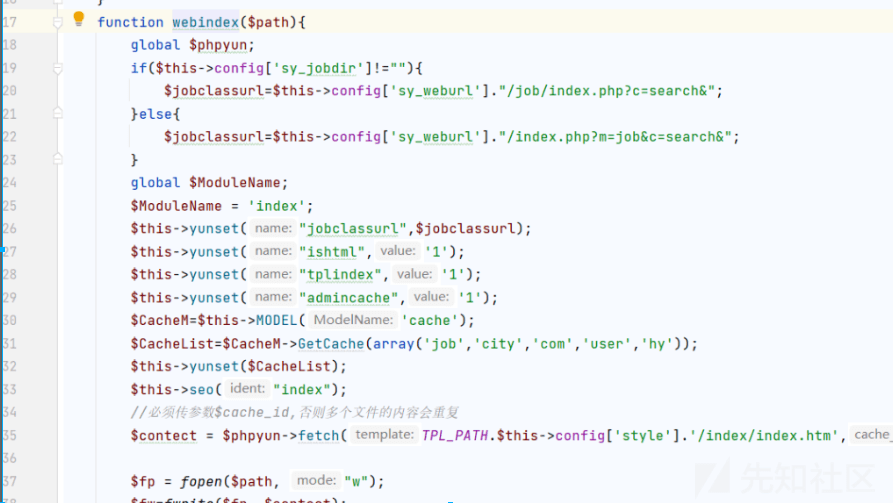](https://xzfile.aliyuncs.com/media/upload/picture/20240221131515-32a2f1aa-d078-1.png)  
为啥不可以用其他命令执行函数或者说写一句话呢，因为在 gobal.php 中包含了安全文件进行了敏感词过滤，同时将英文括号变成了中文。  
[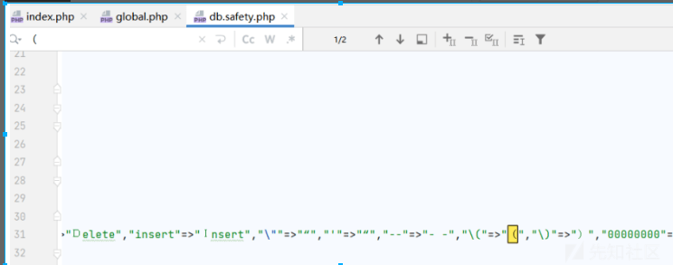](https://xzfile.aliyuncs.com/media/upload/picture/20240221131547-4593945e-d078-1.png)
