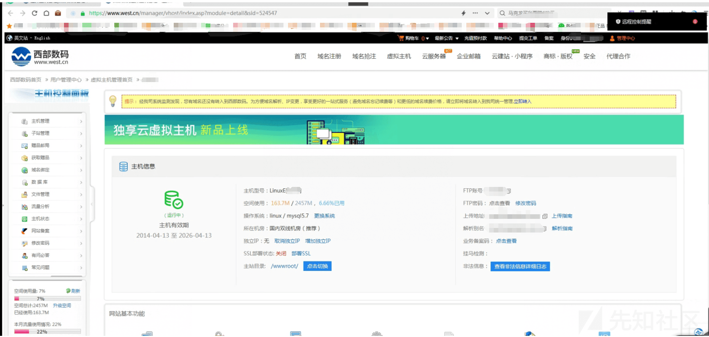
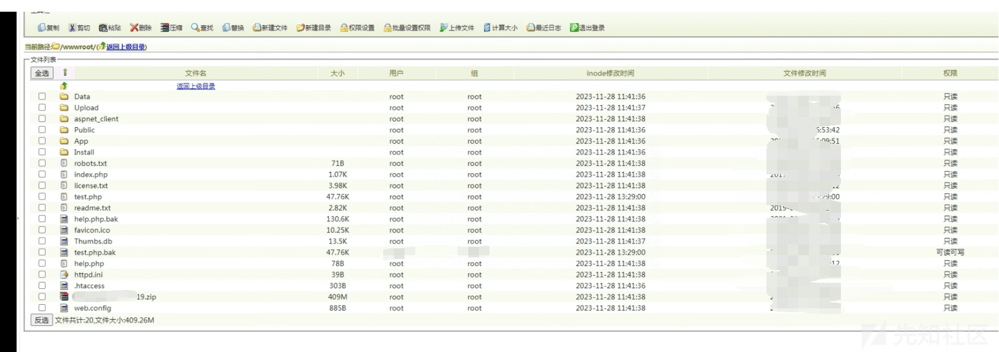
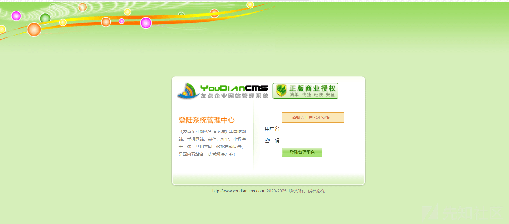
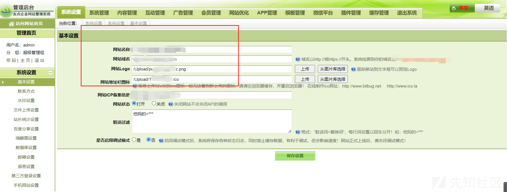
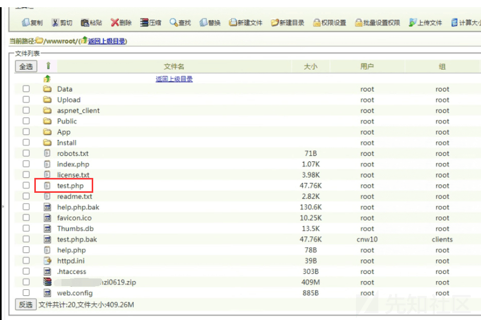
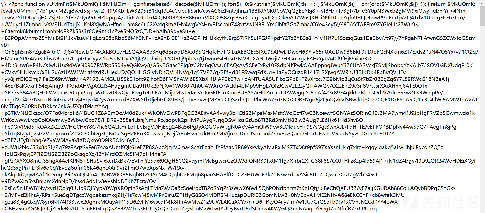
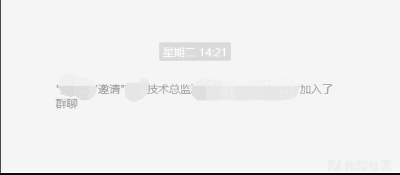
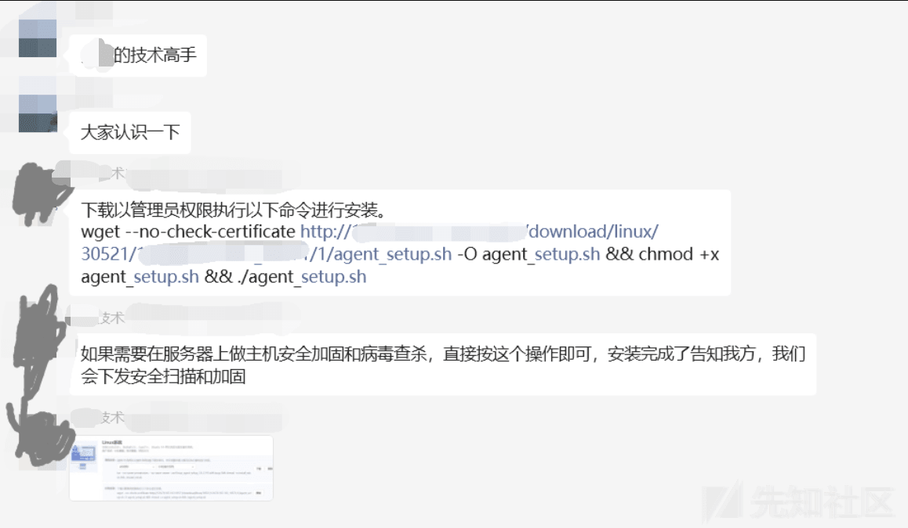
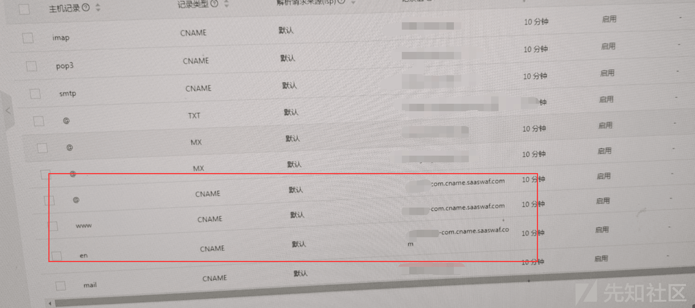

# 记一次虚拟主机应急 - 先知社区

记一次虚拟主机应急

- - -

## 0x01 背景

某天中午老板微信发来一个域名，手机打开看是个色情网站，如下图：

[](https://xzfile.aliyuncs.com/media/upload/picture/20231201120243-7a55c8c0-8ffe-1.png)

老板说网站被黑了，原来是网站被黑帽搞了 SEO，让应急恢复网站业务。

## 0x02 应急处理

用电脑浏览器访问网站，发现页面内容为空白，但右键打开源码发现有东西：

会对访问者的 UA 进行检测，并且 JS 会进一步检测是否为手机 UA，检测到手机 UA 才会跳转到色情页面。

[](https://xzfile.aliyuncs.com/media/upload/picture/20231201120629-00ed6140-8fff-1.png)

用向日葵连接运维电脑进行远程应急，连上后，发现网站是用虚拟主机来搭建。

```plain
通常购买虚拟主机服务后，虚拟主机控制台会提供一个 FTP 地址和 FTP 账号密码，开发把源码上传至虚拟主机 FTP 服务器上进行网站部署，然后在主机管理页面绑定域名就能访问网站业务。整个部署过程虚拟主机服务商仅提供 FTP 账号密码进行文件管理，无法对网站服务器进行管理控制。
```

控制台有文件管理功能、数据库管理、主机状态管理。  
[](https://xzfile.aliyuncs.com/media/upload/picture/20231130205447-a481d62c-8f7f-1.png)  
首先来到主机状态管理，先把网站给关停，然后进行文件管理功能，对网站目录压缩，下载源码进行分析  
[](https://xzfile.aliyuncs.com/media/upload/picture/20231130205712-fa816178-8f7f-1.png)  
分析`web.config` `.htaccess` `httpd.ini`文件内容均未发现异常，排除劫持配置文件导致的 SEO

```plain
.htaccess 
<IfModule mod_rewrite.c>
    RewriteEngine on
    RewriteCond %{REQUEST_FILENAME} !-d
    RewriteCond %{REQUEST_FILENAME} !-f
    RewriteCond %{REQUEST_URI} !^.*(\.css|\.js|\.gif|\.png|\.jpg|\.jpeg|\.bmp)$
    RewriteRule ^(.*)$ index.php/$1 [QSA,PT,L]
    RewriteRule ^(.*)App/Tpl/(.+).html$  / [NC,F]
</IfModule>
```

```plain
web.config
<?xml version="1.0" encoding="UTF-8"?>
<configuration>
    <system.webServer>
        <rewrite>
            <rules>
                <rule name="OrgPage" stopProcessing="true">
                    <match url="^(.*)$" />
                    <conditions logicalGrouping="MatchAll">
                        <add input="{HTTP_HOST}" pattern="^(.*)$" />                
                        <add input="{REQUEST_FILENAME}" matchType="IsFile" negate="true" />             
                        <add input="{REQUEST_FILENAME}" matchType="IsDirectory" negate="true" />            
                    </conditions>               
                    <action type="Rewrite" url="index.php/{R:1}" />         
                </rule>
                <rule name="disableDownloadHtml">
                    <match url="^App/Tpl/.*.html$" ignoreCase="true" />
                    <action type="CustomResponse" url="/" statusCode="403" statusReason="Forbidden" statusDescription="Forbidden" />
                </rule>
            </rules>
        </rewrite>
   </system.webServer>
</configuration>
```

```plain
httpd.ini
RewriteRule (.*)$ /index\.php\?s=$1 [I]
```

对整个目录都进行搜索（大佬们有没有更好的搜索工具推荐），搜索结果显示整个网站源码文件中只有一个文件被修改：  
`\wwwroot\Data\runtime\Data\config_cn.php`

[](https://xzfile.aliyuncs.com/media/upload/picture/20231201121116-ac191618-8fff-1.png)

文件在`runtime`缓存目录下，`config.cn.php`文件内容返回一个数组，想到把文件里面的 seo 内容给删掉看看网站会不会恢复正常。结果删除相应内容后访问网站还是会发生跳转，继续分析可能是网站配置被修改，打开数据库查找相关的 config 表进行排查：

[](https://xzfile.aliyuncs.com/media/upload/picture/20231201121303-ec213f10-8fff-1.png)

果不其然，seo 内容被注入到数据库内。删掉数据库中的 SEO 内容，并且把`config.cn.php`内容修改后网站业务恢复正常。  
[](https://xzfile.aliyuncs.com/media/upload/picture/20231130205758-1631d11e-8f80-1.png)

## 0x03 漏洞分析

由于是虚拟主机无法对网站 wwwroot 目录以外的目录进行访问，所以无法获取网站服务器内的各种日志，通过查看虚拟主机控制面板，也没有日志管理功能，这里无法通过日志进行溯源分析。但是我们可以对网站进行分析。

访问网站后台，发现该网站使用`youdiancms`搭建：

[](https://xzfile.aliyuncs.com/media/upload/picture/20231130210207-aa6fb8be-8f80-1.png)

访问数据库 admin 表，发现存在多个管理用户：

[](https://xzfile.aliyuncs.com/media/upload/picture/20231130210059-8232d304-8f80-1.png)

并且所有密码都是 MD5 加密，cmd5 能查到所有密码，登录后台进行分析，在`基本设置`功能内看到了 SEO 内容，

[](https://xzfile.aliyuncs.com/media/upload/picture/20231130210046-7a889102-8f80-1.png)

继续分析其他设置，`上传设置`：

[](https://xzfile.aliyuncs.com/media/upload/picture/20231130210035-73cbc424-8f80-1.png)

可以看到被添加 php、php3 等后缀，后台可以直接任意文件上传，分析服务器文件也发现了大马：

[](https://xzfile.aliyuncs.com/media/upload/picture/20231130210022-6beffb26-8f80-1.png)  
`test.php`  
[](https://xzfile.aliyuncs.com/media/upload/picture/20231130210010-64df4e18-8f80-1.png)  
由此推测黑客利用弱口令登录后台直接修改配置文件进行色情 SEO，并且利用`youdiancms`后台文件上传功能获得网站服务器控制权限。

## 0x04 途中

中途相关负责人联系到大厂工程师进群协助：

[](https://xzfile.aliyuncs.com/media/upload/picture/20231201131248-44e9e7fc-9008-1.png)  
学习下大厂的应急处置流程：  
首先大概是安装`waf agent`对服务器进行扫描  
[](https://xzfile.aliyuncs.com/media/upload/picture/20231201131338-62940a58-9008-1.png)  
发现是虚拟主机后采用另外一套方案，直接修改域名 cname 解析上 saas waf 进行防护： 
[](https://xzfile.aliyuncs.com/media/upload/picture/20231130205929-4c29dac8-8f80-1.png)  
[](https://xzfile.aliyuncs.com/media/upload/picture/20231130205915-444d1e3c-8f80-1.png)  
开 waf 授权： 
[](https://xzfile.aliyuncs.com/media/upload/picture/20231201131458-9273ef4a-9008-1.png)  
saas waf 配置：  
[](https://xzfile.aliyuncs.com/media/upload/picture/20231130205855-37da9e68-8f80-1.png)  
把域名 CNAME 记录值 配置成 saas waf 提供的地址：  
[](https://xzfile.aliyuncs.com/media/upload/picture/20231130205843-30bb0294-8f80-1.png)  
waf 生效： 
[](https://xzfile.aliyuncs.com/media/upload/picture/20231130205829-28c5bab6-8f80-1.png)

## 0x05 最后

大厂 YYDS，向大厂学习应急处理流程。
