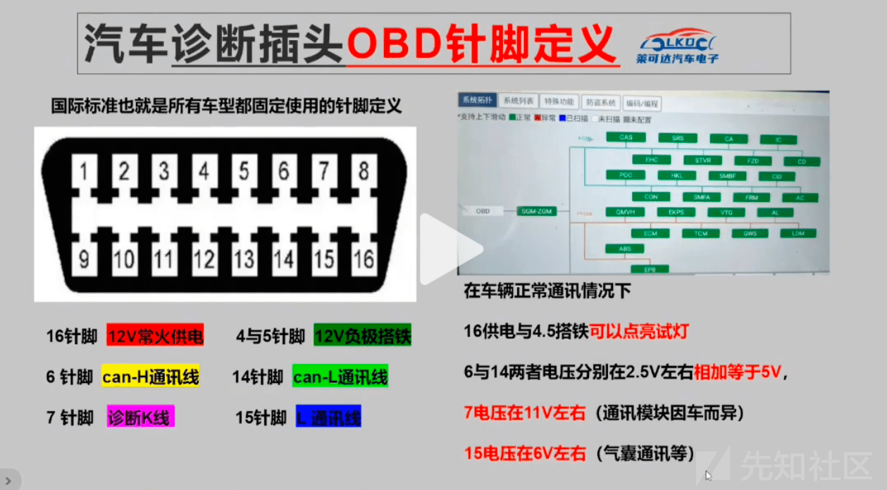
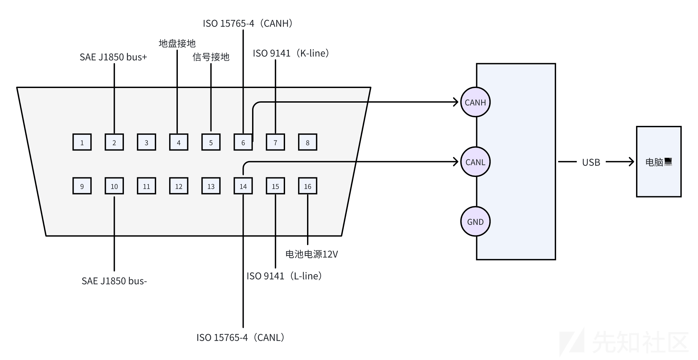
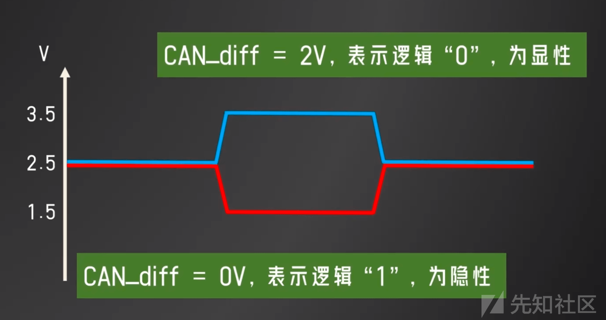
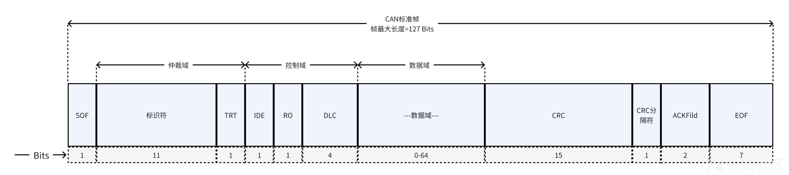
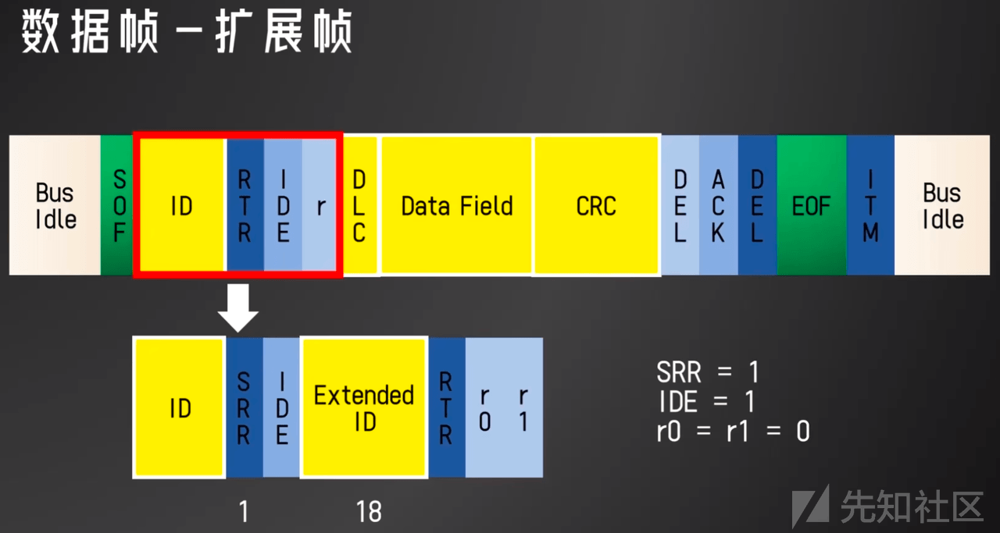
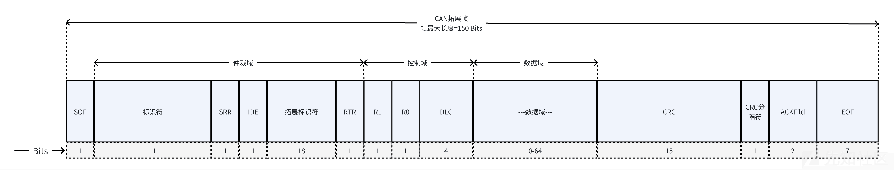

# 「车联网安全」OBD（汽车诊断插头）与 CAN 报文 - 先知社区

「车联网安全」OBD（汽车诊断插头）与 CAN 报文

- - -

# 什么是 OBD？

> OBD 代表"诊断接口"（On-Board Diagnostics），它是一种用于汽车的标准化接口系统，旨在监测和报告车辆的运行状况。主要有两个版本，OBD-I 和 OBD-II。
> 
> 1.  OBD-I：这是早期的汽车诊断系统，它的实施并不标准化，各个汽车制造商可能有不同的实现方式。OBD-I 主要用于 20 世纪 80 年代和 90 年代的汽车。
> 2.  OBD-II：OBD 的第二代，它是在 1996 年后引入的，并成为几乎所有新型汽车的标准。OBD-II 标准化了诊断接口和故障码的格式，使得无论是何种汽车制造商，诊断工具都能够兼容。这使得汽车技师和车主能够更容易地检测和修复车辆问题。
> 
> OBD-II 接口通常位于车辆驾驶室下部，可以通过连接 OBD-II 扫描工具与车辆的电脑系统通信。通过这个接口，可以读取车辆的实时数据，诊断发动机和车辆系统的问题，并检索故障码，这有助于更快地定位和解决车辆故障。

# OBD 诊断插头图解

# 对应关系表

部分可能不一致

|     |     |     |
| --- | --- | --- |
| 针脚  | 对应关系 |     |
| 1 针脚 | 开电门 12V（可打开功率试灯），关电门 0V |     |
| 4/5 针脚 | 长地线，找个正极接起来（4/5）可以点亮功率试灯。 |     |
| 6 针脚 | CAN 高 通讯线 |     |
| 7 针脚 | 诊断 K 线，单独和变速箱，电脑板之间通讯，比电瓶电压低 1V（11V 左右） |     |
| 14 针脚 | CAN 低 通讯线 |     |
| 15 针脚 | L 线，汽车电脑板连接（电压一般是电瓶的一半，6V 左右） |     |
| 16 针脚 | 30 长电源，在任何情况下，必须可以点亮功率试灯 |     |
| 3 针脚 | 舒适 CAN 高 |     |
| 11 针脚 | 舒适 CAN 低 |

# 安全测试

OBD 接口可能存在多种安全风险，我们可以使用安全测试工具对如下风险进行测试

-   物理访问：OBD 接口通常用于诊断端口进行访问，该端口通常位于汽车易于访问的区域，如仪表板下方，这使攻击者很容易物理访问端口并进行恶意连接。
    
-   身份校验：许多 OBD 端口不需要身份验证，这使得攻击者不需要密码或凭证即可直接访问汽车上的计算机。
    
-   安全控制：OBD 系统旨在促进诊断和维修工作，通常没有考虑安全性，因此它们可能存在缺少加密、访问控制和入侵检测等安全控制，从而容易受到攻击。
    

## 测试工具-OBD 诊断仪

最常见的 OBD 工具是 OBD 诊断仪，车辆在维修机构开始维修汽车前，通常使用 OBD 诊断仪来读取车内的故障码，以帮助维修人员快速定位故障。

### OBD 诊断仪通常使用方法

1.  找到 OBD-II 接口：它通常位于车辆驾驶座下方，可以是在仪表板附近或驾驶座的脚踏板下。连接 OBD 诊断仪时，确保车辆处于关键位置，以便 OBD-II 接口处于活动状态。
    
2.  插入 OBD 诊断仪：将 OBD 诊断仪的插头插入车辆的 OBD-II 接口。确保插头正确对准并完全插入。
    
3.  启动车辆引擎：有些 OBD 诊断仪要求车辆引擎运行，以便能够读取实时数据。在连接后，启动车辆引擎。
    
4.  选择功能：使用 OBD 诊断仪的控制面板或连接的移动设备选择所需的功能。这可能包括读取实时数据、检索故障码、执行特定测试等。
    
5.  读取实时数据：如果您希望监视车辆的实时性能数据，选择相应的功能并查看屏幕上的数据。这可以包括引擎转速、车速、冷却液温度等信息。
    
6.  检索故障码：如果车辆发生故障，您可以使用诊断仪读取存储在车辆电脑系统中的故障码。这些故障码提供有关车辆问题的信息，有助于定位和解决故障。
    
7.  执行测试和操作：一些高级的 OBD 诊断仪具有执行特定测试或操作的功能。根据需要，执行相应的操作，例如发动机测试或清除故障码。
    
8.  断开连接：在完成使用后，安全地断开 OBD 诊断仪与车辆的连接。这通常涉及从 OBD-II 接口中拔出插头。
    

### 使用 OBD 访问车内 ECU 和通信数据

1.  将 CAN 工具连接到 OBD 接口，例如，可以使用 CANoe，接线方式见下图，将 CAN 设备的 CANH 和 CANL 通过电线连接到 OBD 接口的 CANH 和 CANL 上。
    
2.  使用该工具，可以通过 CAN 发送“请求帧”。
    
3.  相关 ECU 通过 CAN 发送“响应帧”。
    
4.  读取相关通信报文，并使用 DBC 文件进行解码。
    

# CAN 报文解读

## CAN 信号物理层面的实现

**电信号如何表示 0 和 1？**

> -   CAN 高：2.5V~3.5V
> -   CAN 低：1.5V~2.5V
> 
> 通讯时当 CAN\_diff=0（CAN 高 2.5，CAN 低 2.5V 时），表示逻辑 1 为隐性，使用双绞线以及两个电信号表示一个逻辑位的好处是，不会因为外界环境影响信号传输到准确性，存在影响也是同时影响，不会影响最终的电压差。两端有防止信号反射的 120 欧电阻，能接入 CAN 总线的电控单元通常由微控制器、CAN 控制器、CAN 收发器三部分构成。

**报文举例**

|     |     |     |     |     |     |     |     |     |     |     |     |     |
| --- | --- | --- | --- | --- | --- | --- | --- | --- | --- | --- | --- | --- |
| 报文名称 | 报文 ID | 发送周期 | 报文长度 | 报文起始位置 | 信号名 | 数据起始位 | 数据长度 | 系数  | 偏置数 | 最小值 | 最大值 | Coding 释意 |
| EMS\_Control | 100 | 10ms | 8byte | 0   | EMS\_RPM | 7   | 8bit | 30  | 0   | 0   | 7650 | \-  |
| 10ms | 8byte | 1   | EMS\_FAIL\_F | 0   | 1bit | \-  | \-  | \-  | \-  | 0b:normal      1b:abnormal |

## 冲突仲裁

CAN 总线采用“线与”规则进行冲突仲裁，当多个信号同时发送时，有的发 1，有的发 0 而只要有 0 当前总线就是 0，因为 1 与上 0 还是 0，看上去就是 1 被 0 覆盖了，所以逻辑 0 为显性。CAN 消息根据用途不同，分为：数据帧、远程帧、错误帧、超载帧。

## 位填充机制

五个 1 填充一个 0，五个 0 填充一个 1（此处“五个”计算填充位也需计算在内，CAN 收发器会填充和去除这些填充）

## CAN 标准帧

> 1.  SOF（Start of Frame）：中文意思是"帧开始"。SOF 是 CAN 消息的起始标志，用于指示一个 CAN 帧的开始。它是一个固定的比特模式，标志着数据帧或远程帧的开始，允许接收方节点进行帧同步和开始接收数据。在 CAN 通信中，SOF 是通信帧结构的一部分，用于确保数据帧的正确传输和解析。
> 2.  标识符（Identifier）：CAN 消息的标识符，用于唯一标识消息的类型和优先级。
> 3.  TRT（Transmission Request）：传输请求，表示一个 CAN 节点要发送消息的请求信号。
> 4.  IDE（Identifier Extension）：标识符扩展，指示标识符是否包括扩展标识信息。
> 5.  RO（Read-Only）：只读，可能指示某个 CAN 消息的特性，表示它是只读的，不允许修改。
> 6.  DLC（Data Length Code）：数据长度码，指示 CAN 消息中的数据域的长度。
> 7.  数据域（Data Field）：CAN 消息中包含实际数据的部分，用于传输信息。
> 8.  CRC（Cyclic Redundancy Check）：循环冗余校验，用于检测 CAN 消息的数据是否损坏或错误。
> 9.  CRC 分割符（CRC Delimiter）：CRC 校验码与数据域之间的分隔符，用于将校验码与数据区分开。
> 10.  ACK Field：确认字段，用于确认 CAN 消息的接收情况，以确保成功的数据传输。
>     
> 11.  EOF（End of Frame）：帧结束，表示 CAN 消息的结束，用于分隔不同消息之间的帧。
>     

## CAN 拓展帧

> 1.  SOF (Start of Frame): 帧开始，是 CAN 消息的起始标志，指示 CAN 帧的开始。它允许接收方节点进行帧同步和开始接收数据。
> 2.  标识符 (Identifier): CAN 消息的唯一标识符，用于区分不同类型和优先级的消息。
> 3.  SRR (Substitute Remote Request): 替代远程请求，指示远程帧中标识符的替代格式。
> 4.  IDE (Identifier Extension): 标识符扩展，指示标识符是否包括扩展信息。在拓展帧中，它表示标识符是拓展的。
> 5.  拓展标识符 (Extended Identifier): 在 CAN 拓展帧中，指示标识符是拓展的，允许更大范围的标识符。
> 6.  RTR (Remote Transmission Request): 远程传输请求，指示消息是数据帧还是远程帧。远程帧用于请求其他节点发送数据。
> 7.  R1 和 R0 (Reserved Bits): 保留位，用于将来可能的标准化用途，当前必须设置为 0。
> 8.  DLC (Data Length Code): 数据长度码，指示 CAN 消息中数据域的长度，即实际数据的字节数。
> 9.  数据域（Data Field）：CAN 消息中包含实际数据的部分，用于传输信息。
> 10.  CRC (Cyclic Redundancy Check): 循环冗余校验，用于检测 CAN 消息的数据是否损坏或错误。
>     
> 11.  CRC 分隔符 (CRC Delimiter): 用于分隔 CRC 校验码和数据域，确保正确解析校验码。
>     
> 12.  ACK Field (Acknowledgment Field): 确认字段，用于确认 CAN 消息的接收情况，以确保成功的数据传输。
>     
> 13.  EOF (End of Frame): 帧结束，表示 CAN 消息的结束，用于分隔不同消息之间的帧。
>     

- - -

# 拓展资料

【趋近于完美的通讯 CAN 总线！4 分钟看懂！】 [https://www.bilibili.com/video/BV14k4y187e6/?share\_source=copy\_web&vd\_source=cccc7bdde4dee6a54d0feb196cf11a5f](https://www.bilibili.com/video/BV14k4y187e6/?share_source=copy_web&vd_source=cccc7bdde4dee6a54d0feb196cf11a5f)

OBD 诊断接口的针脚含义解析：[https://v.douyin.com/ieb3pcE9/](https://v.douyin.com/ieb3pcE9/)

诊断插头 OBD 每个针脚的定义： [https://v.douyin.com/iebwS168/](https://v.douyin.com/iebwS168/)

《智能汽车网络安全权威指南》
