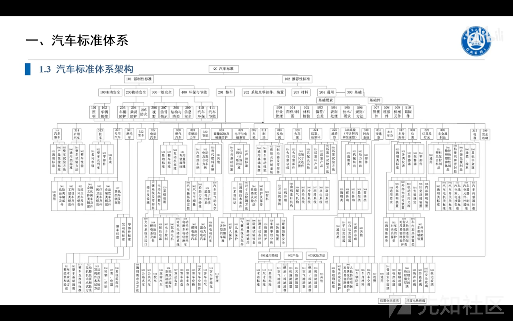

# 车联网安全合规之法规标准与测试要点 - 先知社区

车联网安全合规之法规标准与测试要点

- - -

> 花了一些时间把资料整理同步一下

[https://internal-api-drive-stream.feishu.cn/space/api/box/stream/download/preview/HAI5bSKjDogUo7xiFHJcbPNfnMd/?preview\_type=16](https://internal-api-drive-stream.feishu.cn/space/api/box/stream/download/preview/HAI5bSKjDogUo7xiFHJcbPNfnMd/?preview_type=16)  

# **汽车标准体系**

blob:[https://li2h5rwaaaa.feishu.cn/2eda5659-cb2e-4002-8164-2851ce7d881e](https://li2h5rwaaaa.feishu.cn/2eda5659-cb2e-4002-8164-2851ce7d881e)  

blob:[https://li2h5rwaaaa.feishu.cn/959e5de0-d015-400e-ad50-2c84146e5790](https://li2h5rwaaaa.feishu.cn/959e5de0-d015-400e-ad50-2c84146e5790)  

## 国内汽车安全法规标准

|     |     |     |     |
| --- | --- | --- | --- |
| 类别  | 法规/标准名 | 强制/推荐 | 归口部门 |
| 企业网络安全 | 网络安全法 | 强制  | 网信、工信、公安等有关部门 |
| 企业网络安全 | 等保 2.0 | 强制  | 公安  |
| 车辆网络安全 | 智能网联汽车生产企业及产品准入管理指南（征求意见稿） | 强制  | 工信部 |
| 车辆网络安全 | 工信部关于加强车联网网络安全和数据安全工作的通知 | 强制  | 工信部 |
| 车辆网络安全 | 关于进一步加强汽车远程升级（OTA）技术召回监管的通知 | 强制  | 国家市场监管总局 |
| 车辆网络安全 | 汽车整车信息安全技术要求 | 强制  | 汽标委 |
| 车辆网络安全 | 汽车软件升级通用技术要求 | 强制  | 汽标委 |
| 车辆网络安全 | 道路车辆 - 网络安全工程 | 推荐  | 汽标委 |
| 数据安全 | 数据安全法 | 强制  | 网信、工信、公安等有关部门 |
| 数据安全 | 汽车采集数据处理安全指南 | 推荐  | 信安标委 |
| 数据安全 | 汽车数据安全管理若干规定 | 强制  | 网信、工信、公安等有关部门 |
| 隐私保护 | 个人信息保护法 | 强制  | 国家网信部门 |
| 隐私保护 | 网络安全技术 个人网络安全规范 | 推荐  | 信安标委 |
| 隐私保护 | 网络安全技术 个人网络安全影响评估指南 | 推荐  | 信安标委 |

## 国外汽车安全法规标准 (部分地区)

|     |     |     |     |
| --- | --- | --- | --- |
| 类别  | 法规/标准名 | 强制/推荐 | 归口部门 |
| 企业信息安全 | 欧盟网络安全法 | 强制  | 欧盟网络安全局（ENISA） |
| 企业信息安全 | 新加坡网络安全法 | 强制  | 新加坡网络安全相关部门 |
| 车辆网络安全 | ON R155 车辆网络安全 | 强制  | 各国交通部 |
| 车辆网络安全 | ON R156 软件更新管理 | 强制  | 各国交通部 |
| 车辆网络安全 | ISO/SAE 21434 道路车辆 - 网络安全工程 | 推荐  | ISO/SAE |
| 车辆网络安全 | ISO/PAS 5112 汽车网络安全管理体系审核 | 推荐  | ISO/PAS |
| 数据安全 | ISO 20077 道路车辆 - 拓展车辆（ExVe）方法 | 推荐  | ISO |
| 隐私保护 | 通用数据保护条例（GDPR） | 强制  | 欧盟各成员国监管部门 |
| 隐私保护 | 车联网个人数据保护指南（EDPB） | 推荐  | 欧洲数据保护委员会 |

# 合规检查

> 来源于网络，大部分与整车安全测试内容相契合

## **合规性测试**（包含但不限于如下测试项）

外部连接安全

-   远程操控安全
    
-   近距离通信
    
-   第三方应用安全
    
-   外部接口安全
    

通信信道安全

-   车辆消息欺骗和干扰
    
-   未授权的操纵、删除（其他方式）车辆代码/数据
    
-   不可信的消息引起的会话劫持、重放攻击
    
-   车辆收到的消息（例如 X2V 或诊断消息）或在车辆内部传输的消息包含恶意内容
    
-   嵌入通信介质中的病毒能够感染车载系统
    
-   信道拒绝服务攻击
    
-   非特权用户能够获得对车辆系统的特权访问
    
-   信息泄露
    

软件升级/OTA 安全

-   升级包签名安全测试
    
-   升级包鉴权测试
    
-   信道安全测试
    
-   车端校验安全测试
    
-   升级日志安全
    
-   秘钥存储安全测试
    
-   安全刷写测试
    

数据代码安全

-   数据防提取
    
-   个人敏感信息存储
    
-   秘钥存储
    
-   车载软件安全
    
-   关键服务监测安全
    
-   数据代码防篡改
    

系统漏洞

-   车用密码安全测试
    
-   部件或配件破解测试
    
-   软硬件漏洞测试
    
-   网络安全设计引入漏洞测试
    
-   无意识数据传输安全测试
    
-   物理篡改攻击测试
    

## **灰盒\*\***渗透测试\*\*（包含但不限于如下测试项）

网关系统

-   硬件安全
    
-   CAN 网关
    
-   以太网网关
    
-   混合网关
    

充电系统

-   硬件安全 - 关键芯片 (MCU、加密芯片、通信芯片)
    
-   软件系统
    
-   数据安全
    
-   通信系统
    
-   充电云服务
    

T-Box

-   硬件安全
    
-   入口查找
    
-   数据安全
    
-   操作系统安全
    
-   日志审计安全
    

IVI

-   硬件安全
    
-   入口查找
    
-   总线安全
    
-   数据安全 linux
    
-   数据安全 Android
    
-   操作系统安全
    
-   日志安全
    
-   软件升级
    
-   WIFI 安全
    
-   蓝牙安全
    
-   浏览器安全
    
-   本地提权
    
-   USB 安全
    

车机 APP

-   通信方式
    
-   获取 APK
    
-   应用软件基础安全
    
-   应用软件代码安全
    
-   应用软件运行安全
    

TSP 云平台

-   漏洞注入
    
-   失效的身份认证和会话管理
    
-   XML 实体注入
    
-   敏感数据泄露
    
-   失效的访问控制
    
-   安全配置错误
    
-   跨站脚本攻击（XSS）
    
-   不安全的反序列化
    
-   使用含有已知漏洞的组件
    
-   流程缺陷
    
-   文件遍历
    
-   HTTP 主机 header 攻击
    
-   跨站资源共享（CORS）
    
-   服务端请求伪造攻击（SSRF）
    
-   HTTP 请求夹带攻击（HTTP request smuggling）
    

手机 APP

-   配置管理安全
    
-   信息泄漏
    
-   身份认证安全
    
-   会话安全 cookie
    
-   输入输出安全
    
-   HTML5 安全
    
-   逻辑安全
    

- - -

# 拓展资料

青骥信息安全公益小组

《智能汽车网络安全权威指南》

智能网联汽车渗透测试服务 ACT PENTEST：[https://mp.weixin.qq.com/s/hw4i2kv1N43OFsKadq00zQ](https://mp.weixin.qq.com/s/hw4i2kv1N43OFsKadq00zQ)

GBIoV：[https://github.com/Cha111Ng1/GBIoV](https://github.com/Cha111Ng1/GBIoV)
