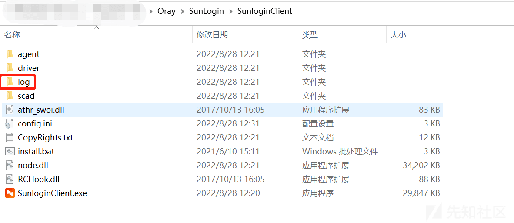
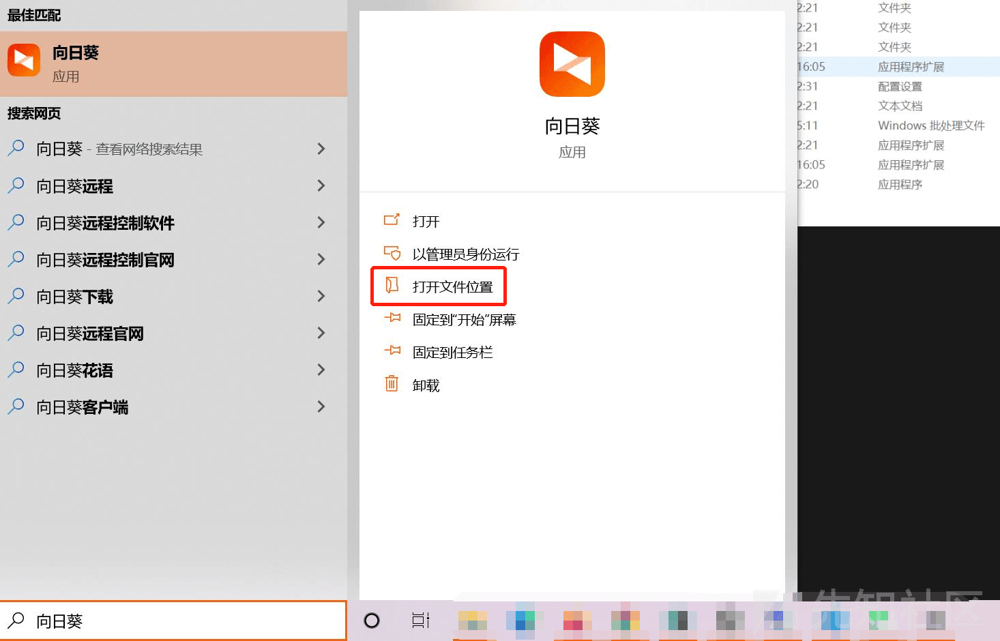
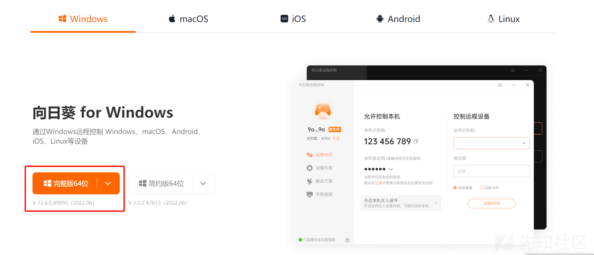
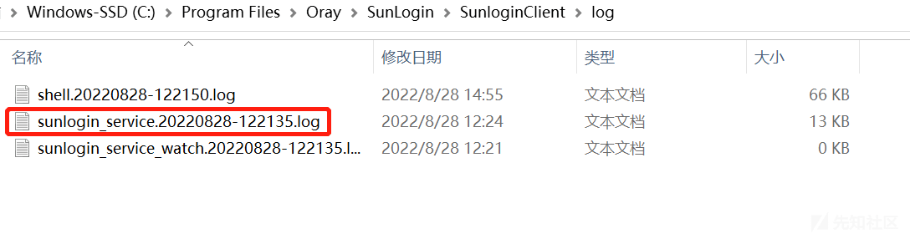
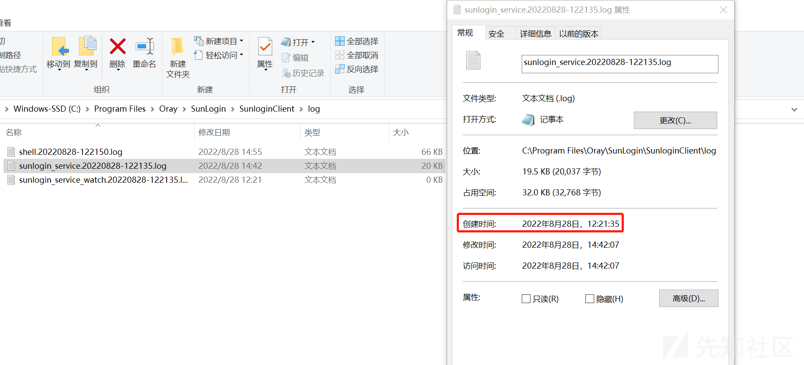
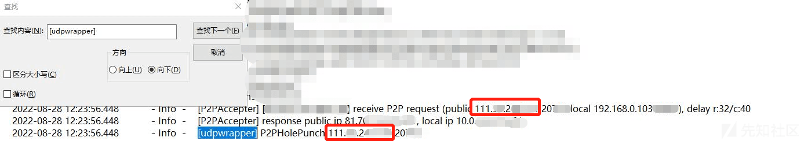
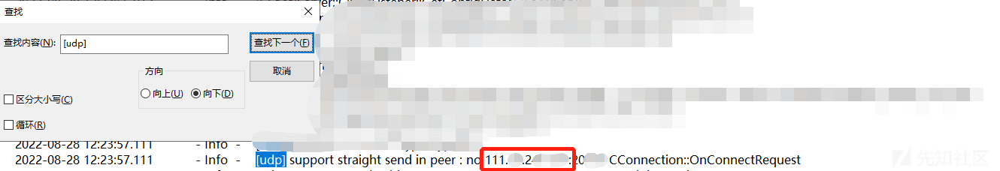
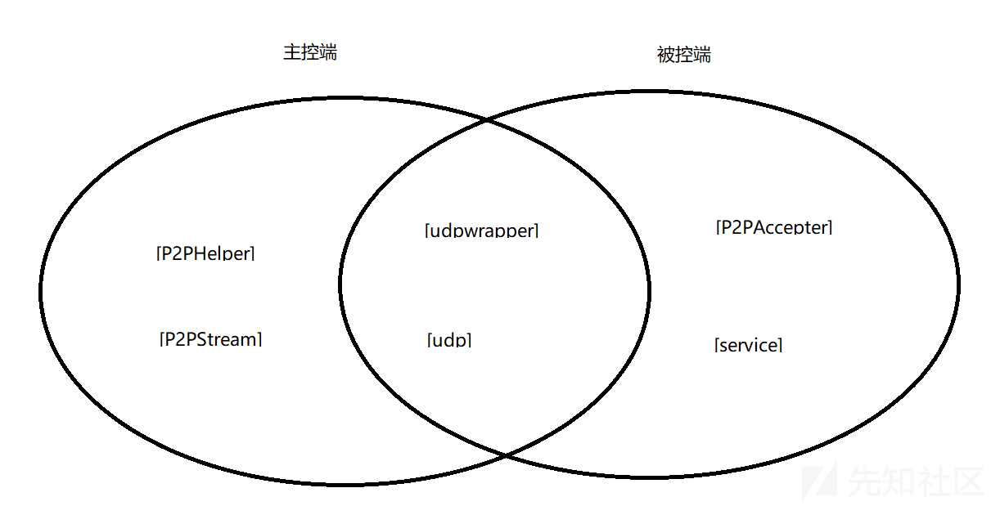
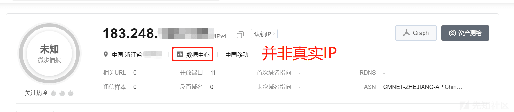
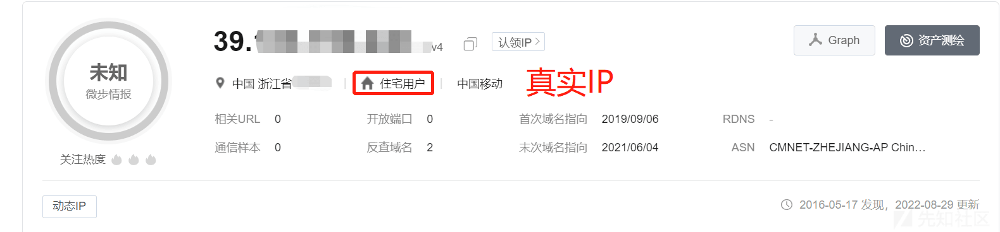

# 【远控类取证】本地提取连接日志分析 - 先知社区

【远控类取证】本地提取连接日志分析

- - -

# 0x00 前言

本文详细的对此类远控软件目录信息特征的获取方法做了探究，希望可以帮助到有相关侦察&比赛需求的师傅，本文仅作学习使用，切莫用作非法

# 0x01 非默认路径如何找到文件夹

## 桌面存在图标

【右键】——【打开文件所在位置】——【打开`log`文件夹】  
[](https://xzfile.aliyuncs.com/media/upload/picture/20240204003732-875f81c8-c2b2-1.png)

## 桌面不存在图标

【任务栏搜索向日葵】——【打开文件位置】——【打开`log`文件夹】  
[](https://xzfile.aliyuncs.com/media/upload/picture/20240204003756-95b684b0-c2b2-1.png)

# 0x02 如何找到日志中的 IP 信息

## 环境介绍

远程控制一般是通过远控软件进行的，类似的还有 Todesk、TeamViewer、Splashtop、QQ 等，遇到此类问题，首先就需要找到操作日志，并且读懂日志，这里以向日葵为例，向日葵的日志一般保存在日葵安装目录下`C:\Program Files\Oray\SunLogin\SunloginClient\log`路径中名为`sunlogin_service.时间-数字.log`的日志文件

我先来讲一下我的测试环境，两台 Windows10 主机，一台物理机一台虚拟机（腾讯云），软件均为`V12.6.0.49095` 官网最新版，注意！我测试用的都是完整版，简约版只有被控功能，但日志无区别，实验过程中**仅进行了正常连接通讯，没有传递文件等**，腾讯云机器做被控机，物理机做主控机  
[](https://xzfile.aliyuncs.com/media/upload/picture/20240204003958-de36e77a-c2b2-1.png)

## 探究方法

这里我用的还是 QQ\\微信\\钉钉等语音功能获取真实 IP 相同的实验方法，即**通过 IP 反推取证特征**

### 一。根据已知信息，找到正确的目录文件

想获取到有效的文件首先是找到对的路径，这里我们通过较短时间的测试拿到了三条目录，但是真正包含有效信息的只有`sunlogin_service.时间-数字.log` 结构的文件，即第二条  
[](https://xzfile.aliyuncs.com/media/upload/picture/20240204004033-f3248692-c2b2-1.png)

### 二。确定有效时间

时间以【创建时间】判断最为准确，一般文件浏览 编辑都会对【修改日期】产生影响，所以【右键】——【属性】，即可查询【创建时间】  
[](https://xzfile.aliyuncs.com/media/upload/picture/20240204004049-fcc16972-c2b2-1.png)

### 三。通过 IP 反推特征点

我的腾讯云主机 IP 是 `81.7x.xx.x` ，物理机 IP 是 `111.xx.2xx.xxx` 打开 `sunlogin_service.时间-数字.log` ，搜索我这里用的是 Vscode，使用 notepad++ 或直接使用 TXT 打开都是一样的  
[](https://xzfile.aliyuncs.com/media/upload/picture/20240204004107-0729c6fc-c2b3-1.png)  
这里我在**主控机目录**通过**被控机真实 IP**搜索出了 8 项相关的目录（在真实环境中会更多），其中部分项也包含主控机真实 IP

```plain
[29528] 2022-08-28 12:23:55.938 - Info  -   [P2PHelper] receive peer local ip 10.x.xx.x:15xxx, public ip 81.7x.xx.x:15xxx
[29528] 2022-08-28 12:23:55.938 - Info  -   [P2PStream] EstablishP2P local ip 111.xx.2xx.xxx:20xxx/192.168.0.103:160xx ==> peer ip 81.7x.xx.x:15xxx/10.x.xx.x:15xxx
[29528] 2022-08-28 12:23:55.938 - Info  -   [udpwrapper] attempt to prepare P2P connection via: 60.1xx.xxx.xx:41xx, (local)192.168.0.103:16xxx|(public)111.xx.2xx.xxx:20xxx ==> (local)10.x.xx.x:15xxx|(public)81.xx.xx.x:15xxx
[29528] 2022-08-28 12:23:55.938 - Info  -   [udpwrapper] P2PHolePunch 81.7x.xx.x:15xxx
[6668]  2022-08-28 12:23:56.537 - Info  -   [udpwrapper] receive p2p hello message from 81.7x.xx.x:15xxx, stop hole punch thread @1417
[6668]  2022-08-28 12:23:56.568 - Info  -   [udp] OnConnectRes with 81.7x.xx.x:15xxx, mode 2, peer straight send no
[29528] 2022-08-28 12:23:56.569 - Info  -   [P2PStream] connected (by udp) 0.0.0.0:160xx <--> 81.7x.xx.x:15xxx
```

由此我们可知在**主控机目录**中，`[P2PHelper]` `[P2PStream]` `[udpwrapper]` `[udp]` 中是包含真实 IP 信息的，因此我们在真实环境中可搜索上述四项来获取主控端和被控端的真实 IP 和端口，知道了这些特征点，我们用**相同时间段的被控机目录**做验证  
[](https://xzfile.aliyuncs.com/media/upload/picture/20240204004226-36baf062-c2b3-1.png)  
[](https://xzfile.aliyuncs.com/media/upload/picture/20240204004236-3c605a84-c2b3-1.png)  
我们可以看到在搜索`[udpwrapper]` 和`[udp]` 时，分别都搜索到了**主控机真实 IP**，那么这里就存在一个问题，`[P2PHelper]` 和 `[P2PStream]` 在**被控机目录**中并不适用

那么还需要探究被控机的特征点，还是用相同的方法，在**被控机目录**通过**主控机真实 IP**搜索出了 5 项相关的目录（在真实环境中会更多）

```plain
[5668] 2022-08-28 12:23:56.448 - Info  - [P2PAccepter] [60.xx.xxx.xx:41xx] receive P2P request (public 111.xx.2xx.xxx:20xxx local 192.168.0.1031xxxx), delay r:32/c:40
[5668] 2022-08-28 12:23:56.448 - Info  - [udpwrapper] P2PHolePunch 111.xx.2xx.xxx:20xxx
[3452] 2022-08-28 12:23:57.111 - Info  - [udp] support straight send in peer : no 111.xx.2xx.xxx:20xxx CConnection::OnConnectRequest
[3452] 2022-08-28 12:23:57.149 - Info  - [udp] OnConnectAck with 111.xx.2xx.xxx:20xxx, mode 2, peer straight send no
[5668] 2022-08-28 12:23:58.025 - Info  - [service][UdpAcceptor] new acceptor 111.xx.2xx.xxx:20xxx-->0.0.0.0:15xxx
```

由这些目录我们获取了两个新的特征点 `[P2PAccepter]` 和 `[service]` ，至此所有的特点便找齐了

## 探究结果

来总结一下，`[P2PHelper]` `[P2PStream]` 只对主控机有效，`[P2PAccepter]` `[service]` 只对被控机有效，`[udpwrapper]` `[udp]` 对双端都有效，关系如下图所示  
[](https://xzfile.aliyuncs.com/media/upload/picture/20240204004304-4d58b41c-c2b3-1.png)  
在实战中，运用此特征点还可以分析在这次通讯中此主机所承担的“角色”

# 0x04 参考资料

1.  **固话 GOIP 取证解疑与向日葵日志分析 —— 明不可欺**
2.  **向日葵官网 —— [https://sunlogin.oray.com/](https://sunlogin.oray.com/)**

# 0x05 特征表

**注：实验均在五分钟内完成，只进行连接，未进行其他操作**

## ToDesk

文件路径：`\todesk\Logs`

目标文件格式：`**client_年_月_日.log**` `**session_年_月_日.log**`（client 内包含手机号）

|     | 主控端 | 被控端 |
| --- | --- | --- |
| 获取本地 IP | LocalIpport | LocalIpport |
| 获取对方控端 IP | RemotePort tcp begin connect | RemotePort tcp begin connect |
| 本地注册手机号 | token login center | token login center |

使用 `**tcp begin connect` `RemotePort`\*\* 查询 IP 时，需先排排除类似 `127.0.0.1` 的本地 IP，对家宽&企业专线环境下的目标需根据 IP 侧情报进行综合研判，对服务器用户暂无有效手段（可能与实验时间过短有关）详细见下图  
[](https://xzfile.aliyuncs.com/media/upload/picture/20240204004434-82d3aeee-c2b3-1.png)  
[](https://xzfile.aliyuncs.com/media/upload/picture/20240204004446-89f96452-c2b3-1.png)

## 向日葵

文件路径：`**\Oray\SunLogin\SunloginClient\log**`

目标文件格式：`**sunlogin_service.时间-数字.log**` （同时包括 IP 和手机号）

|     | 主控端 | 被控端 |
| --- | --- | --- |
| 获取本地 IP | ipconfig(Windows) ifconfig(Mac) | ipconfig(Windows) ifconfig(Mac) |
| 获取对方控端 IP | \[P2PHelper\] \[P2PStream\] \[udpwrapper\] \[udp\] | \[P2PAccepter\] \[service\] \[udpwrapper\] \[udp\] |
| 本地注册手机号 | account | account |

## TeamViewer

文件路径：**`C:\Users\安装用户\AppData\Roaming\TeamViewer`**

目标文件：**`TeamViewer15_Logfile.log`**

|     | 主控端 | 被控端 |
| --- | --- | --- |
| 获取本地 IP | ipconfig(Windows) ifconfig(Mac) | ipconfig(Windows) ifconfig(Mac) |
| 获取对方控端 IP | punch received | punch received |
| 本地注册手机号 | 无日志留存 | 无日志留存 |

## 同类小众产品名单

[Splashtop 官网 - 高性能远程控制软件，远程桌面连接软件](https://www.splashtop.cn/cn/)

[Connect to Work or Games from Anywhere | Parsec](https://parsec.app/)

[Get Microsoft 远程桌面 from the Microsoft Store](https://apps.microsoft.com/store/detail/microsoft-%E8%BF%9C%E7%A8%8B%E6%A1%8C%E9%9D%A2/9WZDNCRFJ3PS?hl=zh-cn&gl=CN)

[The Fast Remote Desktop Application - AnyDesk](https://anydesk.com/en)

[NoMachine - Free Remote Desktop For Everybody](https://www.nomachine.com/)

[GotoHTTP - Online remote control platform](https://gotohttp.com/)
