# 适用于不支持指定密钥套件的 NET 程序的 TLS 解密方法 - 先知社区

适用于不支持指定密钥套件的 NET 程序的 TLS 解密方法

- - -

## 概述

在笔者上一篇《QuasarRAT 与 AsyncRAT 同源对比及分析》文章中，笔者提及说发现了一种疑似可适用于 NET 程序研究场景下的密钥套件自定义方法，因此，在过完新年后，笔者就尝试对其进行了梳理及研究。通过进一步梳理分析，笔者发现此方法基本可适用于所有不支持指定密钥套件的 NET 程序，可有效辅助我们对 NET 程序进行 TLS 通信解密，辅助对 NET 程序的通信模型进行快速的研究分析，梳理分析情况如下：

-   编写 NET 程序时，可基于 HttpClient、WebRequest、TcpClient 和 SsslStream 及第三方库 OpenSSL.NET 来实现 TLS 通信程序的构建。
-   HttpClient、WebRequest、TcpClient 和 SslStream 是.NET Framework 中提供的类，均不支持直接指定密钥套件；第三方库 OpenSSL.NET 支持直接指定密钥套件。
-   HttpClient 类和 WebRequest 类会在.NET 中使用 SslStream 来处理 HTTPS 请求的安全通信；TcpClient 需要配合 SslStream 类来实现安全通信。
-   .NET 标准库中的 SslStream 类依赖于 SChannel 进行 SSL/TLS 通信，通过修改 SChannel 配置会影响.NET 应用程序中 SslStream 的行为。
-   在对 QuasarRAT 和 AsyncRAT 的实战测试过程中，通过修改 SChannel 配置及导入私钥可实现对其 TLS 通信的解密。

**备注：在笔者《Remcos RAT 通信模型剖析及攻防技术对抗》文章的“通信解密尝试”章节中，对 TLS 通信解密的方法进行了分类介绍。**

## NET 程序构建 TLS 通信的方式

为快速了解NET程序可使用哪些库及类构建TLS通信，笔者尝试基于ChatGPT对相关问题进行梳理，例如：C#语言支持哪些方法构建TLS通信？是否支持指定密钥套件？

通过对输出结果进行解读对比，笔者发现除使用第三方库（OpenSSL、BouncyCastle）时可指定密钥套件外，其余方式均不支持指定密钥套件。

相关截图如下：

[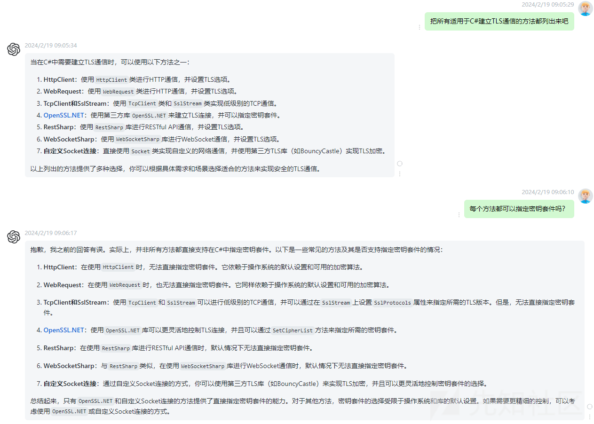](https://xzfile.aliyuncs.com/media/upload/picture/20240219155310-ecd5c328-cefb-1.png)

## NET 程序 TLS 通信的原理

结合 ChatGPT，对 NET 程序 TLS 通信的原理进行剖析，梳理发现：

-   HttpClient 类在.NET 中会使用 SslStream 来处理 HTTPS 请求的安全通信；
-   WebRequest 类在.NET 中会使用 SslStream 来处理 HTTPS 请求的安全通信；
-   若要在 TcpClient 中实现安全通信，可使用 SslStream 类来封装 TcpClient 的网络流；
-   第三方库 OpenSSL.NET 类库不会直接调用 SslStream 来处理 SSL/TLS 安全通信，会使用 OpenSSL 库自身的 API 来实现加密通信；

详细情况如下：

-   HttpClient

[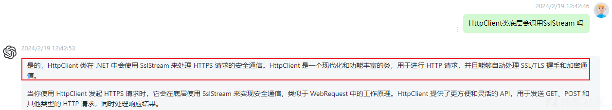](https://xzfile.aliyuncs.com/media/upload/picture/20240219155324-f5a39728-cefb-1.png)

-   WebRequest

[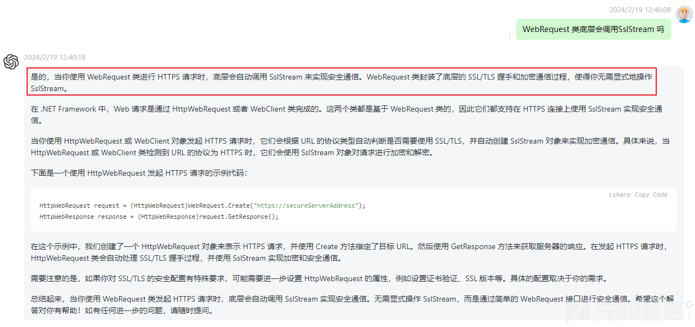](https://xzfile.aliyuncs.com/media/upload/picture/20240219155340-fec928c2-cefb-1.png)

-   TcpClient

[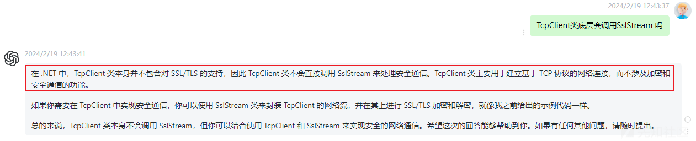](https://xzfile.aliyuncs.com/media/upload/picture/20240219155353-06ed23b4-cefc-1.png)

-   OpenSSL.NET

[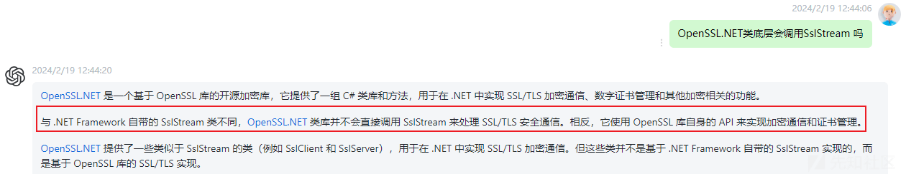](https://xzfile.aliyuncs.com/media/upload/picture/20240219155407-0f513158-cefc-1.png)

## 针对 SslStream 类的通用 TLS 解密方法

通过对 NET 木马 SslStream 类原理进行研究及分析，发现：

-   .NET 标准库中的 SslStream 类并不直接支持指定密钥套件；
-   .NET 标准库中的 SslStream 类依赖于 SChannel 进行 SSL/TLS 通信；
-   通过组策略或注册表设置可限制或指定 Windows 系统上的 SChannel 组件的密钥套件；
-   通过修改 SChannel 配置（密钥套件可选择通用于 TLS 各版本及不同 Windows 版本的密钥套件）会影响.NET 应用程序中 SslStream 的行为；

修改 SChannel 配置的流程如下：

1.  打开组策略编辑器：运行`gpedit.msc`以打开本地组策略编辑器。
2.  导航到密钥套件设置：在组策略编辑器中，导航到`计算机配置` -> `管理模板` -> `网络` -> `SSL配置设置`。在这里，可以找到“SSL 密码套件顺序”设置。
3.  配置密码套件：双击“SSL 密码套件顺序”，启用该设置，并在文本框中输入你希望使用的密钥套件列表。密钥套件应该按照优先级排序，使用逗号分隔。
4.  重启系统。

[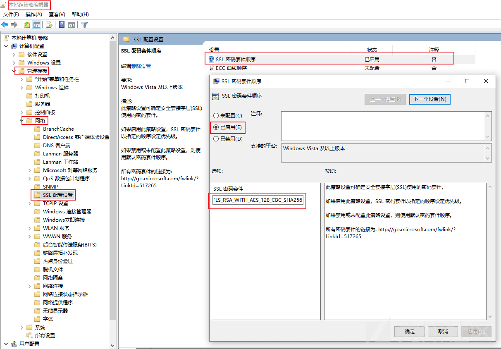](https://xzfile.aliyuncs.com/media/upload/picture/20240219155425-19a6de0a-cefc-1.png)

TLS 各版本支持的密钥套件如下：

```plain
#TLS 1.0 密钥套件
TLS_RSA_WITH_3DES_EDE_CBC_SHA
TLS_DHE_DSS_WITH_3DES_EDE_CBC_SHA
TLS_DHE_RSA_WITH_3DES_EDE_CBC_SHA
TLS_RSA_WITH_AES_128_CBC_SHA
TLS_DHE_DSS_WITH_AES_128_CBC_SHA
TLS_DHE_RSA_WITH_AES_128_CBC_SHA
TLS_RSA_WITH_AES_256_CBC_SHA
TLS_DHE_DSS_WITH_AES_256_CBC_SHA
TLS_DHE_RSA_WITH_AES_256_CBC_SHA
#TLS 1.1 密钥套件
TLS_RSA_WITH_3DES_EDE_CBC_SHA
TLS_DHE_DSS_WITH_3DES_EDE_CBC_SHA
TLS_DHE_RSA_WITH_3DES_EDE_CBC_SHA
TLS_RSA_WITH_AES_128_CBC_SHA
TLS_DHE_DSS_WITH_AES_128_CBC_SHA
TLS_DHE_RSA_WITH_AES_128_CBC_SHA
TLS_RSA_WITH_AES_256_CBC_SHA
TLS_DHE_DSS_WITH_AES_256_CBC_SHA
TLS_DHE_RSA_WITH_AES_256_CBC_SHA
#TLS 1.2 密钥套件
TLS_RSA_WITH_AES_128_CBC_SHA
TLS_RSA_WITH_AES_256_CBC_SHA
TLS_RSA_WITH_AES_128_CBC_SHA256
TLS_RSA_WITH_AES_256_CBC_SHA256
TLS_RSA_WITH_AES_128_GCM_SHA256
TLS_RSA_WITH_AES_256_GCM_SHA384
TLS_DHE_RSA_WITH_AES_128_CBC_SHA
TLS_DHE_RSA_WITH_AES_256_CBC_SHA
TLS_DHE_RSA_WITH_AES_128_CBC_SHA256
TLS_DHE_RSA_WITH_AES_256_CBC_SHA256
TLS_DHE_RSA_WITH_AES_128_GCM_SHA256
TLS_DHE_RSA_WITH_AES_256_GCM_SHA384
TLS_ECDHE_RSA_WITH_AES_128_CBC_SHA
TLS_ECDHE_RSA_WITH_AES_256_CBC_SHA
TLS_ECDHE_RSA_WITH_AES_128_CBC_SHA256
TLS_ECDHE_RSA_WITH_AES_256_CBC_SHA384
TLS_ECDHE_RSA_WITH_AES_128_GCM_SHA256
TLS_ECDHE_RSA_WITH_AES_256_GCM_SHA384
TLS_ECDHE_ECDSA_WITH_AES_128_CBC_SHA
TLS_ECDHE_ECDSA_WITH_AES_256_CBC_SHA
TLS_ECDHE_ECDSA_WITH_AES_128_CBC_SHA256
TLS_ECDHE_ECDSA_WITH_AES_256_CBC_SHA384
TLS_ECDHE_ECDSA_WITH_AES_128_GCM_SHA256
TLS_ECDHE_ECDSA_WITH_AES_256_GCM_SHA384
```

微软官方针对不同 Windows 版本支持不同的 TLS 密码套件和优先级顺序的说明如下：

-   微软官方链接：[https://learn.microsoft.com/zh-cn/windows/win32/secauthn/cipher-suites-in-schannel](https://learn.microsoft.com/zh-cn/windows/win32/secauthn/cipher-suites-in-schannel)
    
-   相关截图如下：
    

[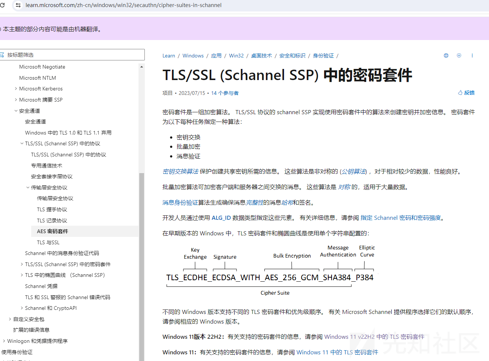](https://xzfile.aliyuncs.com/media/upload/picture/20240219155440-2305300a-cefc-1.png)

## 实战测试

为了进一步确定此 TLS 解密方法的适用范围，笔者尝试对基于 HttpClient 类、WebRequest 类（TcpClient 类需要直接调用 SslStream 类实现 HTTPS 请求的安全通信）编写的 TLS 通信程序进行研究测试，确实 HttpClient 类、WebRequest 类是否会使用 SslStream 来处理 HTTPS 请求的安全通信：

-   由于笔者不是很擅长编写C#程序，因此在基于HttpClient类、WebRequest类构建Client、Server端程序时，运行过程中总会报错；
-   为了达到目的，笔者换了一个思路，直接基于 HttpClient 类、WebRequest 类编写访问 https 网站的程序进行测试；
-   通过修改 SChannel 配置，可对 WebRequest 类编写的程序的密钥套件进行修改，证明 WebRequest 类会使用 SslStream 来处理 HTTPS 请求的安全通信；

WebRequest 类实现程序的测试代码如下：

```plain
using System;
using System.IO;
using System.Net;

class Client
{
    static void Main()
    {
        // 创建 HttpWebRequest 实例，并设置 SSL/TLS 选项
        HttpWebRequest request = (HttpWebRequest)WebRequest.Create("https://www.baidu.com/");
        request.Method = "GET";
        request.AllowAutoRedirect = false;
        request.ServerCertificateValidationCallback += (sender, cert, chain, errors) => true; // 忽略证书验证

        // 发起 HTTPS 请求
        HttpWebResponse response = (HttpWebResponse)request.GetResponse();

        // 读取响应内容
        using (StreamReader reader = new StreamReader(response.GetResponseStream()))
        {
            string responseBody = reader.ReadToEnd();
            Console.WriteLine(responseBody);
        }
    }
}
```

修改 SChannel 配置前通信数据包截图如下：

[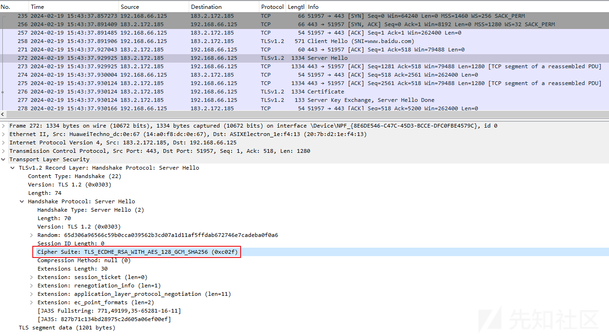](https://xzfile.aliyuncs.com/media/upload/picture/20240219155457-2cfe8dea-cefc-1.png)

修改 SChannel 配置后通信数据包截图如下：

[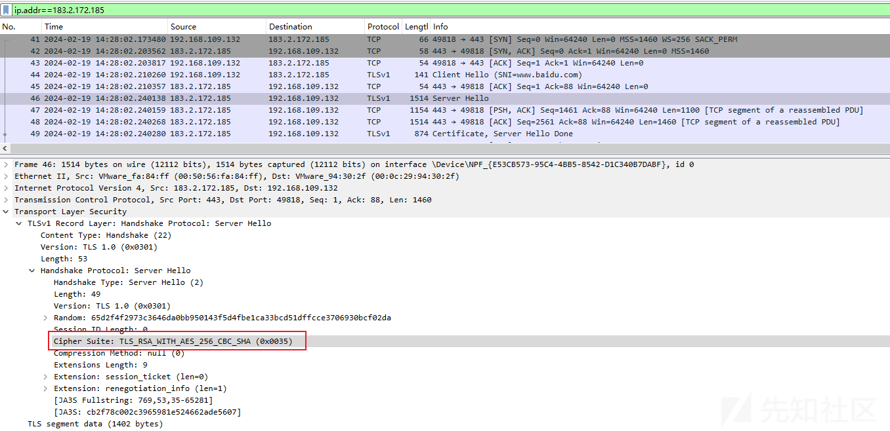](https://xzfile.aliyuncs.com/media/upload/picture/20240219155514-374752aa-cefc-1.png)

## 实战测试 - 开源 RAT

结合实际案例，尝试对 NET 木马的 TLS 解密方法进行研究，梳理如下：

-   在 Client 端及 Server 端的任意一方进行 SChannel 配置，均可实现自定义密钥套件；
-   在自定义密钥套件的基础上，使用私钥即可对 NET 程序进行解密；
-   QuasarRAT 使用 SslStream 构建 TLS 通信，因此通过修改 SChannel 配置及导入私钥可实现对 TLS 通信的解密；
-   AsyncRAT 使用 SslStream 构建 TLS 通信，因此通过修改 SChannel 配置及导入私钥可实现对 TLS 通信的解密；

### QuasarRAT

SslStream 构建 TLS 通信代码截图如下：

[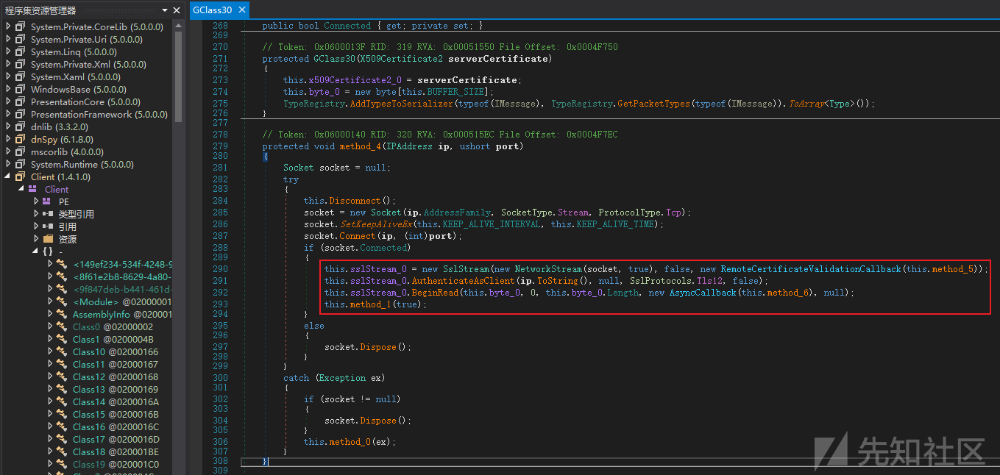](https://xzfile.aliyuncs.com/media/upload/picture/20240219155533-4238e1c4-cefc-1.png)

修改 SChannel 配置前通信数据包截图如下：

[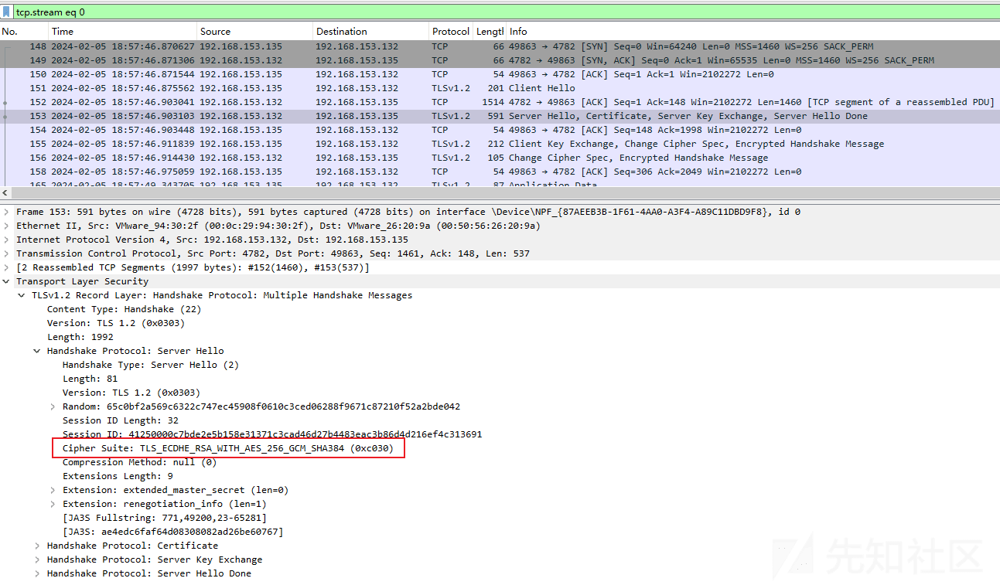](https://xzfile.aliyuncs.com/media/upload/picture/20240219155550-4c581c38-cefc-1.png)

修改 SChannel 配置后通信数据包截图如下：

[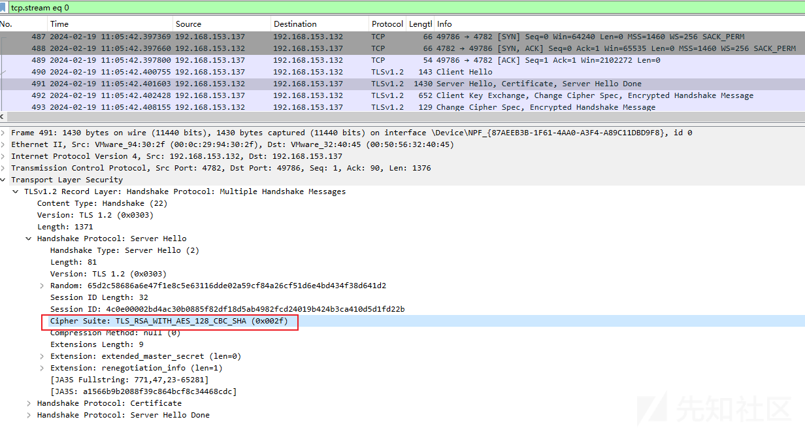](https://xzfile.aliyuncs.com/media/upload/picture/20240219155606-561f559c-cefc-1.png)

TLS 解密后数据载荷截图如下：

[](https://xzfile.aliyuncs.com/media/upload/picture/20240219155622-5f43fa06-cefc-1.png)

### AsyncRAT

SslStream 构建 TLS 通信代码截图如下：

[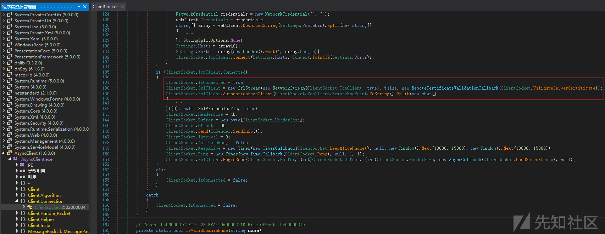](https://xzfile.aliyuncs.com/media/upload/picture/20240219155638-68e9bce4-cefc-1.png)

修改 SChannel 配置前通信数据包截图如下：

[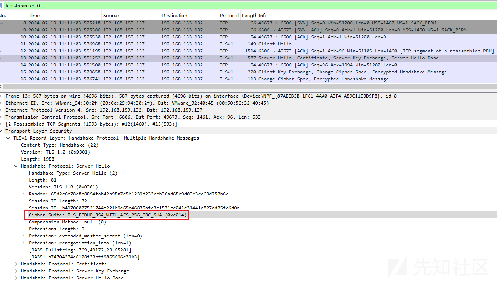](https://xzfile.aliyuncs.com/media/upload/picture/20240219155659-7581f76e-cefc-1.png)

修改 SChannel 配置后通信数据包截图如下：

[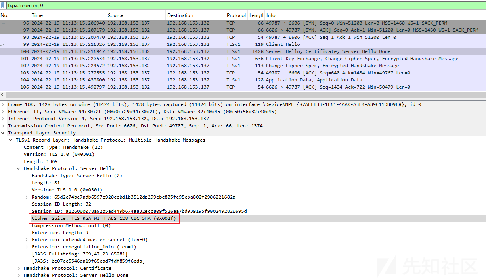](https://xzfile.aliyuncs.com/media/upload/picture/20240219155714-7ed06b84-cefc-1.png)

TLS 解密后数据载荷截图如下：

[](https://xzfile.aliyuncs.com/media/upload/picture/20240219155728-86bc96d8-cefc-1.png)
