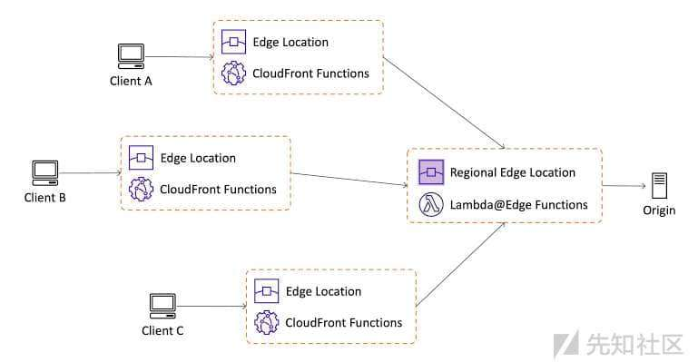
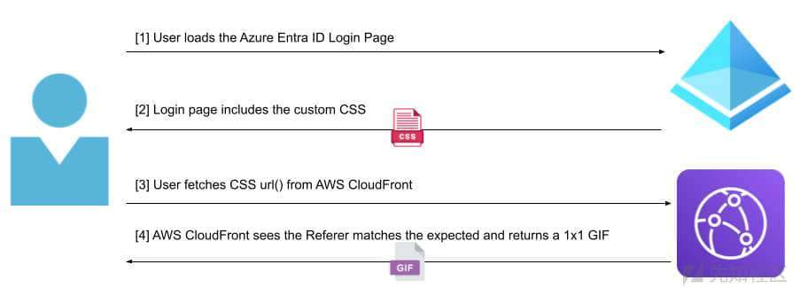
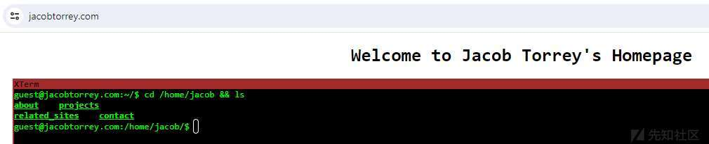
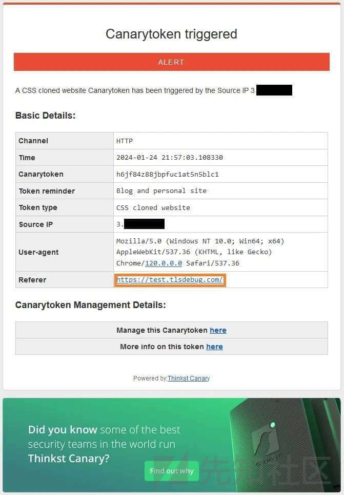
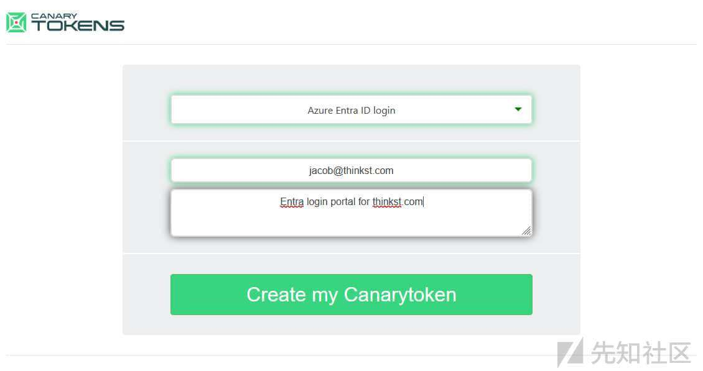

# 通过加入前端代码来抵抗克隆网站的钓鱼攻击 - 先知社区

通过加入前端代码来抵抗克隆网站的钓鱼攻击

- - -

原文链接：[https://blog.thinkst.com/2024/01/defending-against-the-attack-of-the-cloned-websites.html](https://blog.thinkst.com/2024/01/defending-against-the-attack-of-the-cloned-websites.html)

# 正文之前

在上一篇文章中，[Casey 谈到](https://blog.thinkst.com/2023/09/cloned-website-token-and-reverse-proxies.html "Casey 谈到")了我们的克隆网站 Canarytoken 以及它如何抵御现代网络钓鱼攻击。

今天，我们发布了[两个新版本的令牌](https://canarytokens.org/ "两个新版本的令牌")，当攻击者对你的一个站点使用中间对手（AitM）攻击时，它们会提醒你。还有一个好处是，新令牌可以部署在你只有有限管理访问权限的属性的资产（如 Azure 租户登录门户或托管博客）上。

在这篇文章中，我们简要回顾了 AitM 网络钓鱼、基于 Javascript 的克隆网站令牌的局限性，以及我们如何构建新的基于 CSS 的网站令牌。最后，我们将向你展示如何将我们的 CSS 安装到 Azure Entra ID 登录门户中，只需单击几下即可 - 如果你的用户成为目标，则为你提供高质量的警报。

[Zolder.io](http://zolder.io/)（Thinkst 合作伙伴）的人们独立构建了一个非常时髦且相似的 token，请查看他们的[博客文章](https://zolder.io/using-honeytokens-to-detect-aitm-phishing-attacks-on-your-microsoft-365-tenant/ "博客文章")了解更多详情。

# 正文

## AitM phishing

早期的网络钓鱼网站是受害者网站的 HTML/CSS 和 Javascript 的静态克隆，它们会存储输入的凭证，在某些情况下，在窃取受害者用户的凭据后将受害者用户重定向到合法网站。这些静态站点难以处理动态登录流程和 MFA（多因子认证）。

现在，借助 [EvilGinx](https://github.com/kgretzky/evilginx2 " EvilGinx") 和 [Modlishka](https://github.com/drk1wi/Modlishka "Modlishka") 等工具，攻击者创建了一个位于用户和受害者站点之间的反向代理服务器。这允许对 Javascript 进行动态修改以反映网络钓鱼网站（可以配置为防止触发非混淆克隆网站令牌），并在窃取会话后将用户无缝传递到受害者站点。由于攻击者充当代理，因此受害者站点会动态呈现给用户，并且攻击者可以绕过多种类型的 MFA，因为用户正在登录并接受推送，或输入 SMS/TOTP 代码。

[Microsoft](https://www.microsoft.com/en-us/security/blog/2022/07/12/from-cookie-theft-to-bec-attackers-use-aitm-phishing-sites-as-entry-point-to-further-financial-fraud/ "Microsoft") 的这张图显示了经典 AitM 网络钓鱼攻击的步骤：

## Javascript 克隆网站

正如 [Casey 的博客](https://blog.thinkst.com/2023/09/cloned-website-token-and-reverse-proxies.html "Casey 的博客")中所详述的那样，我们经典的克隆网站 CanaryToken 对世界各地的公司都很有用。我们只需生成一小段（可选混淆）Javascript 代码，以添加到您的网站。当客户端加载页面时，javascript 会检查站点是否从预期的父域提供，否则会触发警报。

Side-Note:题外话

值得注意的是，当从预期的父域加载站点时，不会向 Canarytokens 服务器发出外部请求。我们仅在检测到克隆站点的极少数情况下收到请求。

这个令牌运行得非常好，特别是如果对 AitM 服务器的简单域名替换进行混淆。但是，它需要能够将 Javascript 插入页面，这是许多第三方服务提供商不允许的要求。

## CSS 克隆网站令牌

我们花了一些时间试图找出是否有一个聪明的 CSS 技巧，类似地仅在域名异常时向 Canarytokens 服务器发出警报，但为了降低第 3 方 CSS 导入的风险，浏览器中的 CSS 解释器受到相当的限制。我们的解决方案是通过 [url()](https://developer.mozilla.org/en-US/docs/Web/CSS/url "url()") 函数创建一个指向我们服务器的不可见背景图像的引用，在服务器中我们检查 Referer \[原文如此\] HTTP 标头以确保它是从正确的域名加载的。这意味着只需添加 CSS 规则即可将令牌插入到您的网页中。

### version 0.1

有些服务允许我们进行轻度自定义（主要是为了外观和感觉），但不允许我们上传自定义 JavaScript（阻止我们使用可信赖的克隆站点令牌），因此我们开始寻找 CSS 作为第二选择。CSS 相对受限，但我们可以通过 url（）函数为指向我们控制的服务器的不可见背景图像创建引用来初步达到我们的目标。

在该服务器上，我们可以检查 Referer \[sic\] HTTP 标头，以确保从正确的域名加载 CSS。

这适用于许多 AitM 网络钓鱼攻击（因为攻击者无法控制浏览器上 Referer 标头的隐私政策），但某些浏览器会省略或以其他方式欺骗该标头。

另一个缺点是，我们的 Canarytokens 服务器现在对于每个页面加载都是需要重新加载的，无论是否良性，都会增加站点有效用户的延迟，并可能为我们的服务器增加大量负载，尤其是在部署到例如流行的 Azure 租户的登录门户时。

### Lambdas, functions and edges

参考链接：  
[AWS Lambda 与 Azure Functions：10 大区别 - IOD - The Content Engineers (iamondemand.com)](https://iamondemand.com/blog/aws-lambda-vs-azure-functions-ten-major-differences/)  
[将 AWS Lambda 与 CloudFront Lambda@Edge 结合使用 - AWS Lambda (amazon.com)](https://docs.aws.amazon.com/zh_cn/lambda/latest/dg/lambda-edge.html)

为了管理这一点，并模糊 CSS 引用的目的（因为有许多 Canary Token 检测器本质上是 grep [canarytokens.com](http://canarytokens.com/) 字符串），我们希望使用一个流行的基于云的提供程序来过滤掉合法请求，然后只将可疑请求传递到我们的服务器。

第一个想法是 AWS Lambda 或 Azure Function 作为替代品，但启动时间可能会降低用户体验，并且成本会过高。AWS 提供了一系列其他无服务器函数来平衡成本、延迟和功能：有鉴于此，我们探索了 Lambda@Edge 函数，这些函数在所有区域自动执行（减少延迟），但对运行时环境有一些限制。

### Cloudfront 函数

在可扩展性/功能之前的权衡，CloudFront Functions 更进一步。

它们运行速度极快（最大执行时间为 ~1ms），但功能（故意地）非常有限。然后，目标是弄清楚如何利用有限的功能来提供具有成本效益和高性能的体验。

### 我们的解决方案

我们向所有 CloudFront 接入点部署了一个函数，该函数解析传入请求字符串中的两条编码数据：预期的 Referer 和与之关联的 Canarytoken ID。如果 Referer 标头与预期的标头匹配，则该函数将通过返回 1×1 透明 GIF 来终止，否则它会向具有解析 ID 的 Canarytoken 服务器发出 HTTP 重定向。下图显示了用户登录到 Azure 租户时的流程：

下图显示了在用户登录页面之间部署 AitM 网络钓鱼服务器时发生的情况：

这种设计赢了。它提供非常低的延迟、全球部署和轻量级功能，并且由于 CloudFront 是 CDN，因此链接到 CDN 资产不会对对手产生怀疑。

现在我们只需要让它易于部署！

## 在 Web 上使用 CSS token

为了将其中一个令牌部署到编辑范围有限的站点（例如，您只能添加 HTML 而不能添加 Javascript 的站点），我将向您展示如何在我的个人网站中添加一个不可见的站点，当它未通过正确的域名加载时发出警报。

首先，我导航到 Canarytokens 站点，然后从下拉列表中选择 CSS 克隆的网站令牌。然后我输入我的电子邮件地址和我期望的域名（我的网页是 [jacobtorrey.com](http://jacobtorrey.com/)）。同样重要的是，要放一个有用的备忘录，以便在几个月后提醒自己，当它发生发出告警时，它会被放置在什么地方，以帮助我做出反应。单击“创建”，将生成令牌：

此 CSS 旨在将 url（）函数 复制并粘贴（或自动安装）到 Azure Entra ID 租户中，但 url（）函数可用于其他位置。我在我的网页上创建一个空的 style=“display：hidden; background：url（'https\[：\][//dakg4cmpuclai\[.\]cloudfront\[.\]net/h6jf84z88jbpfuc1at5n5/amFjb2J0b3JyZXku/img.gif](http://dakg4cmpuclai.cloudfront.net/h6jf84z88jbpfuc1at5n5/amFjb2J0b3JyZXku/img.gif)'）; 并保存它。当我按预期查看此页面时，它看起来没有什么不同，并且我没有收到任何警报：

但是，如果我使用 EvilGinx 对这个网站进行网络钓鱼并导航到它，它看起来是一样的：

我立即收到一封电子邮件提醒：

它有客户端 IP 地址和引用域名，以及我自己设置的提醒。太棒了！我可以看到这个网站是从哪里提供的，如果这是一个真正的网络钓鱼网站，我会知道它的 URL，可以继续提交滥用报告，或从我的网络中阻止该域。单击“更多信息”将提供以下信息（审查 IP 和主机名）：

这种技术适用于大多数博客平台（例如，WordPress）和其他允许某些 HTML 编辑的托管平台，但不适用于 Javascript。

## 完善一下细节

现在我们有了新的基于 CSS 的克隆网站令牌，是时候让部署的用户体验更加简单了。我们估计 Azure 门户将是一个流行的用例，在我们的测试中发现，上传自定义 CSS 时所需的步骤很麻烦。请务必注意，Entra UI 中的自定义品牌功能需要 Entra ID P1 或 P2 订阅。为了使其尽可能易于部署，我们探讨了如何构建 Azure 应用程序，这些应用程序可以在获得授权后代表租户安装自定义品牌 CSS。

我们构建了一个 Azure 应用程序，当用户使用足够的管理员权限登录到其租户时，该应用程序可以请求访问权限以自动安装 CSS 文件（但前提是不存在会发生冲突的 CSS 文件）。安装 CSS 后，Azure 应用程序将撤消自己的权限，从而降低风险。我们注意到，有时将自定义 CSS 传播到 Azure 的 CDN 需要几分钟到几小时，但它已安装。以下屏幕截图显示了用于保护 Azure 租户的此简化过程：

以同样的方式开始，我们创建一个令牌，这次选择 Azure Entra ID 登录名。同样，我们想给自己一个关于令牌的有用提醒：

单击“创建”后，我们看到令牌已生成：

这一次，我们可以看到一个选项，可以遵循自动安装流程，也可以手动下载并手动将 CSS 安装到 Azure 租户中。单击“自动”选项，将打开一个新选项卡，提示我登录，或选择要登录的 Azure 帐户。此帐户必须是租户上的管理员帐户才能授予所需权限：

PS:安装程序需要 Organization.ReadWrite.All 和 Application.ReadWrite.All 权限才能使用 CSS 创建/更新公司品牌，并分别将自身从租户中删除。User.Read 是对应用程序进行身份验证所需的默认权限。在安装尝试结束时，将撤消所有权限。

我为要使用此令牌保护的租户选择帐户，并发送到授权页面，询问我是否要授权应用程序和所需的权限。

接受此提示会将您重定向回状态为“令牌”页面：

就是这样！稍后，你的 Azure 登录页现在将包含此 CSS，如果攻击者尝试使用 AitM 网络钓鱼代理来攻击你的用户，你将在发生时收到警报，以及攻击者正在使用的域名。

## 结论

网络钓鱼仍然是一种非常有效的窃取帐户的方法，并且该工具已经成熟，可以让 FIDO2/通行密钥 MFA 技术外的所有技术都容易受到 AitM 网络钓鱼和会话窃取的攻击。虽然我们现有的 Javascript 令牌仍然很受欢迎，并提供有关网络钓鱼网站创建的有价值的警报，但我们希望覆盖更多用户的在线服务。我们新的 CSS 和无缝 Azure 登录门户克隆站点令牌提供了另一种方法来快速检测你所依赖的第三方服务提供商，以此来保护你的组织。这些令牌依赖于客户端行为来发出警报，因此它们是整体安全策略的一部分（其中应包括基于令牌的 MFA！），而不是单一的银弹。如果您试一试，我们会很高兴，并让我们知道它是怎么回事！
