# 逻辑漏洞背后隐藏的刷票总结 - 先知社区

逻辑漏洞背后隐藏的刷票总结

- - -

# 前言：

说起刷票，可能大家都经常听到这个词，但是网上这种相关的漏洞文章却少之又少，本文将总结个人案例以及生活中碰到的情况汇总成本篇文章，刷票的行为通常是利用逻辑漏洞来实现的，比如通过伪造投票请求、绕过验证等手段来增加投票数量，从而拿到名次奖励，文章仅发表思路，这些思路不仅限于刷票。

# 思路总结

## 一、无任何验证措施

程序开发问题，单一投票功能，用户可点击直接进行投票，且无任何限制，没有上限  
利用 pyton 写个简单的 exp：

```plain
import requests
url='http://www.domain.com/comment.php?aid=123&who=1&t=1385710179528'
while 1:
    requests.get(url)
```

## 二、客户端验证

一切来自客户端的数据都是不可信的，因为这些数据全部都是在前端  
1) 弹框提示，仅仅是弹框，并没有阻断后面代码执行，刷新页面继续投票，票数照常增加  
[](https://xzfile.aliyuncs.com/media/upload/picture/20231103154824-5e171a52-7a1d-1.png)  
2) 排除第一种情况，换个浏览器即可重新投票，或者清理下缓存即可重新投票  
[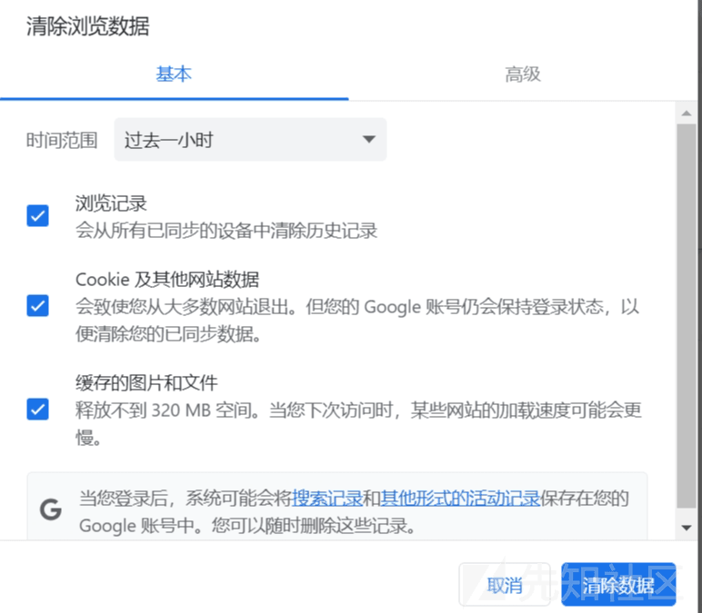](https://xzfile.aliyuncs.com/media/upload/picture/20231103154924-82069c44-7a1d-1.png)  
3) 有时候你可能也会碰到投票后按钮变为灰色，只需删除前端控制代码即可，或者直接往服务端进行发包，因为是客户端限制  
[](https://xzfile.aliyuncs.com/media/upload/picture/20231103154931-86326370-7a1d-1.png)

## 三、User-Agent 验证

有的会用 user-agent 进行验证，毕竟打开页面，他也许就判断你的浏览器，觉得你只经常用这个浏览器，修改 user-agent 即可绕过

```plain
Mozilla/5.0 (iPhone; CPU iPhone OS 10_0 like Mac OS X) AppleWebKit/602.1.38 (KHTML, like Gecko) Version/10.0 Mobile/14A5297c Safari/602.1
Mozilla/5.0 (Macintosh; Intel Mac OS X 10_15_7) AppleWebKit/537.36 (KHTML, like Gecko) Chrome/87.0.4280.67 Safari/537.36 Edg/87.0.664.52
Mozilla/5.0 (Linux; Android 6.0.1; Nexus 5X Build/MMB29P) AppleWebKit/537.36 (KHTML, like Gecko) Chrome/87.0.4280.88 Mobile Safari/537.36 (compatible; Googlebot/2.1; +http://www.google.com/bot.html)
Mozilla/5.0 (Linux; Android 10; V1914A Build/QP1A.190711.020; wv) AppleWebKit/537.36 (KHTML, like Gecko) Version/4.0 Chrome/77.0.3865.120 MQQBrowser/6.2 TBS/045410 Mobile Safari/537.36
Mozilla/5.0 (Windows NT 10.0; Win64; x64) AppleWebKit/537.36 (KHTML, like Gecko) Chrome/87.0.4280.88 Safari/537.36
Mozilla/5.0 (Windows NT 6.1) AppleWebKit/537.36 (KHTML, like Gecko) Chrome/61.0.3163.100 Safari/537.36
Mozilla/5.0 (compatible; NetcraftSurveyAgent/1.0; +info@netcraft.com)
Mozilla/5.0 (Windows NT 10.0; Win64; x64) AppleWebKit/537.36 (KHTML, like Gecko) Chrome/86.0.4240.75 Safari/537.36
Mozilla/5.0 (Windows NT 10.0; WOW64) AppleWebKit/537.36 (KHTML, like Gecko) Chrome/78.0.3904.108 Safari/537.36
Mozilla/5.0 (Macintosh; Intel Mac OS X 10_13_6) AppleWebKit/537.36 (KHTML, like Gecko) Chrome/79.0.3945.88 Safari/537.36
Mozilla/5.0 (compatible; bingbot/2.0; +http://www.bing.com/bingbot.htm)
Mozilla/5.0 (compatible; SeznamBot/3.2; +http://napoveda.seznam.cz/en/seznambot-intro/)
Mozilla/5.0 (Windows NT 10.0; WOW64) AppleWebKit/537.36 (KHTML, like Gecko) Chrome/74.0.3729.169 Safari/537.36
Mozilla/5.0 (Windows NT 6.2) AppleWebKit/537.36 (KHTML, like Gecko) Chrome/31.0.1650.63 Safari/537.36 QIHU 360SE; 360Spider
Mozilla/5.0 (X11; Linux x86_64) AppleWebKit/537.36 (KHTML, like Gecko) Chrome/49.0.2623.75 Safari/537.36 Google Favicon
Mozilla/5.0 (Macintosh; Intel Mac OS X 10_14_5) AppleWebKit/537.36 (KHTML, like Gecko) Chrome/87.0.4280.88 Safari/537.36
Mozilla/5.0 (Windows NT 10.0; WOW64; Trident/7.0; rv:11.0) like Gecko
Mozilla/5.0 (compatible; Googlebot/2.1; +http://www.google.com/bot.html)
Mozilla/5.0 (Windows NT 6.1; Win64; x64; rv:56.0) Gecko/20100101 Firefox/56.0
Mozilla/5.0 (Windows NT 6.3) AppleWebKit/537.36 (KHTML, like Gecko) Chrome/87.0.4280.88 Safari/537.36
Mozilla/5.0 Dalvik/2 ( Linux; U; NEM-AL10 Build/HONORNEM-AL10;Youku;7.1.4;) AppleWebKit/537.36 (KHTML, like Gecko) Version/4.0 Safari/537.36 (Baidu; P1 6.0) iPhone/7.1 Android/8.0
Mozilla/5.0 (compatible; Baiduspider/2.0; +http://www.baidu.com/search/spider.html\x09
Mozilla/5.0 (Windows NT 10.0; Win64; x64) AppleWebKit/537.36 (KHTML, like Gecko) Chrome/87.0.4280.67 Safari/537.36 Edg/87.0.664.55
Mozilla/5.0 (iPhone; CPU iPhone OS 14_0_1 like Mac OS X) AppleWebKit/605.1.15 (KHTML, like Gecko) Mobile/15E148 SP-engine/2.25.0 main%2F1.0 baiduboxapp/12.4.0.13 (Baidu; P2 14.0.1) NABar/1.0
Mozilla/5.0 (Linux; Android 10; CDY-TN00 Build/HUAWEICDY-TN00; wv) AppleWebKit/537.36 (KHTML, like Gecko) Version/4.0 Chrome/78.0.3904.108 Mobile Safari/537.36
Mozilla/5.0 (Linux; Android 4.1.1; Nexus 7 Build/JRO03D)
Mozilla/5.0 (Windows NT 10.0; WOW64) AppleWebKit/537.36 (KHTML, like Gecko) Chrome/85.0.4183.121 Safari/537.36
Mozilla/5.0 (X11; Linux x86_64) AppleWebKit/537.36 (KHTML, like Gecko) Chrome/86.0.4240.75 Safari/537.36
Mozilla/5.0 (Macintosh; Intel Mac OS X 10_15_7) AppleWebKit/537.36 (KHTML, like Gecko) Chrome/87.0.4280.88 Safari/537.36
Mozilla/5.0 (Windows NT 10.0; Win64; x64) AppleWebKit/537.36 (KHTML, like Gecko) Chrome/71.0.3578.98 Safari/537.36; 360Spider
Mozilla/5.0 (Symbian/3; Series60/5.2 NokiaN8-00/012.002; Profile/MIDP-2.1 Configuration/CLDC-1.1 ) AppleWebKit/533.4(KHTML, like Gecko) NokiaBrowser/7.3.0Mobile Safari/533.4 3gpp-gba
Mozilla/5.0 (Windows NT 10.0; Win64; x64) AppleWebKit/537.36 (KHTML, like Gecko) Chrome/78.0.3904.87 Safari/537.36
Mozilla/5.0 (Macintosh; Intel Mac OS X 11_0_1) AppleWebKit/537.36 (KHTML, like Gecko) Chrome/87.0.4280.88 Safari/537.36
Mozilla/5.0 (Linux; Android 6.0.1; Nexus 5X Build/MMB29P) AppleWebKit/537.36 (KHTML, like Gecko) Chrome/86.0.4240.96 Mobile Safari/537.36 (compatible; Googlebot/2.1; +http://www.google.com/bot.html)
Mozilla/5.0 (Windows NT 10.0; Win64; x64) AppleWebKit/537.36 (KHTML, like Gecko) Chrome/86.0.4240.198 Safari/537.36
Mozilla/5.0 (Macintosh; Intel Mac OS X 10_11) AppleWebKit/601.1.27 (KHTML, like Gecko) Chrome/47.0.2526.106 Safari/601.1.27
Mozilla/5.0 (Windows NT 6.1; WOW64) AppleWebKit/537.36 (KHTML, like Gecko) Chrome/52.0.2743.116 Safari/537.36
Mozilla/5.0 (Windows NT 10.0; Win64; x64; rv:79.0) Gecko/20100101 Firefox/79.0
Mozilla/5.0 (Windows NT 10.0; Win64; x64) AppleWebKit/537.36 (KHTML, like Gecko) Chrome/70.0.3538.102 Safari/537.36 Edge/18.18363
Mozilla/5.0 (Linux; Android 5.0) AppleWebKit/537.36 (KHTML, like Gecko) Mobile Safari/537.36 (compatible; Bytespider; https://zhanzhang.toutiao.com/)
Mozilla/5.0 (Linux; Android 9; ANE-AL00 Build/HUAWEIANE-AL00; wv) AppleWebKit/537.36 (KHTML, like Gecko) Version/4.0 Chrome/79.0.3945.116 Mobile Safari/537.36
Mozilla/5.0 (Macintosh; Intel Mac OS X 10_15_7) AppleWebKit/537.36 (KHTML, like Gecko) Chrome/86.0.4240.198 Safari/537.36 Edg/86.0.622.69
Mozilla/5.0 (Windows NT 10.0; WOW64) AppleWebKit/537.36 (KHTML, like Gecko) Chrome/87.0.4280.66 Safari/537.36
Mozilla/5.0 (Windows NT 6.1; WOW64) AppleWebKit/537.36 (KHTML, like Gecko) Chrome/63.0.3239.132 Safari/537.36 QIHU 360SE
Mozilla/5.0 (X11; Ubuntu; Linux x86_64; rv:36.0) Gecko/20100101 Firefox/36.0
Mozilla/5.0 (X11; Linux x86_64) AppleWebKit/537.36 (KHTML, like Gecko) Ubuntu Chromium/75.0.3770.90 Chrome/75.0.3770.90 Safari/537.36
Mozilla/5.0 (Macintosh; Intel Mac OS X 10_15_6) AppleWebKit/605.1.15 (KHTML, like Gecko) Version/14.0.1 Safari/605.1.15
```

## 四、Cookie 验证

有时候会用绑定 cookie 来进行验证，一个 cookie 为一个用户，修改 cookie 即可绕过限制，有时候并不一定需要用户的 cookie，可以随意修改两个字符尝试，也许会有意想不到的效果

## 五、IP 验证

有时候系统会根据 ip 来进行判断，一个 ip 投票一次，可尝试修改 X-Forwarded-For，Clien-IP，可进行绕过  
[](https://xzfile.aliyuncs.com/media/upload/picture/20231103160157-42dfaf68-7a1f-1.png)  
排除上面情况，还是使用 ip 进行验证，可使用 ip 代理池进行绕过

```plain
import requests
from random import choice

# 代理池列表
proxy_list = ['http://ip1:port1', 'http://ip2:port2', 'http://ip3:port3']

# 随机选择一个代理
proxy = choice(proxy_list)

# 构造请求头
headers = {
    'User-Agent': 'Mozilla/5.0 (Windows NT 10.0; Win64; x64) AppleWebKit/537.36 (KHTML, like Gecko) Chrome/58.0.3029.110 Safari/537.3'}

# 发送请求
try:
    response = requests.get('http://www.example.com', headers=headers, proxies={'http': proxy})
    print(response.text)
except:
    print('请求失败')
```

tips:路由器每次重启 ip 不一样，手机开飞行模式也一样，代理 ip 也可以

## 六丶当投票量大于阅读量时就是刷票行为

测试刷票漏洞时可以观察下阅读量，如果票数大于阅读量肯定就是刷票，假设根据前面的姿势刷票投到了第二，但某产商说我们统计结果会有人工判断，如果发现会进行漏洞降级，此时需要你的投票数量一定要符合阅读范围之内，如果绕过了限制进行刷票时，持续了一段时间失败了，请看浏览量，也许在此处做了判断  
[](https://xzfile.aliyuncs.com/media/upload/picture/20231103161012-69ec82ba-7a20-1.png)

## 七、组合拳 1：Csrf 刷票

Csrf 简介：攻击者利用用户已经登录的身份，在用户不知情的情况下向服务器发送恶意请求，从而实现攻击目的。攻击者通常会在第三方网站上植入恶意代码，当用户访问该网站时，代码就会自动向目标网站发送伪造的请求，从而欺骗服务器执行非法操作

Burp 的 Engagement tools 功能可直接生成 CSRF\_PoC  
[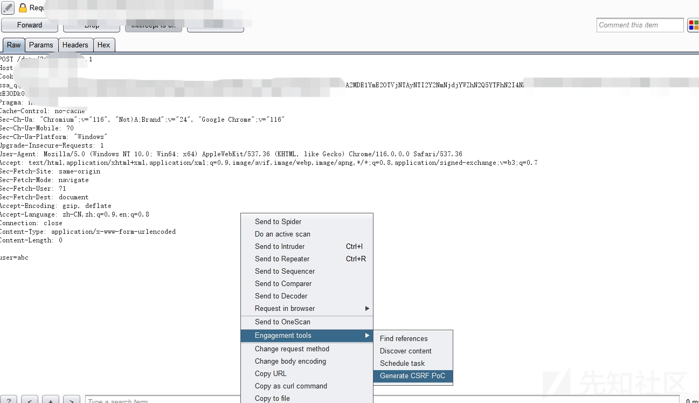](https://xzfile.aliyuncs.com/media/upload/picture/20231103162523-8865652a-7a22-1.png)

## 八、组合拳 2：Xss 打 Cookie 刷票

如果站点存在 xss，储存 Xss 就不用说了，配合 Csrf 直接自动化刷票了，即使是反射 Xss 也可以进行利用，比如"看这个人的票数好高，大家看看他是不是刷票：[http://domain.com](http://domain.com/)" 同时网址缩短后做上跳转收集用户的 Cookie，接着遍历 Cookie 批量发包即可实现刷票，如有 Csrf 也可以利用 Csrf 实现自动化刷票，相对没有储存 Xss 利用方便

## 九、观察数据包请求（验证参数等等）

有的候系统在点击投票时会生成一个验证值，可能在 Get，Post，Cookie，修改他们给的判断值即可实现刷票  
[](https://xzfile.aliyuncs.com/media/upload/picture/20231103162847-024f4950-7a23-1.png)

## 十、并发线程（条件竞争）

利用前面方法我们无法进行刷票了，都被限制了，这时我们可以利用并发线程，简单来说就是让服务器处理跟不上请求速度，线程还没有达到需要验证的地方已经发出去了很多请求，用 Fiddler 批量发包，导致服务器没有跟上处理，导致刷票，出现问题的几率比较高  
[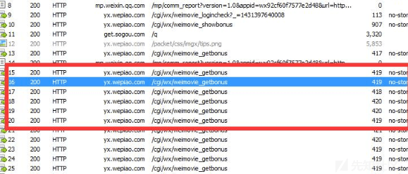](https://xzfile.aliyuncs.com/media/upload/picture/20231103170302-cb640390-7a27-1.png)

## 十一、听说点击投票时出现验证码？

### (一)、验证码使用后不会销毁

验证码可重复使用，不提示验证码错误  
[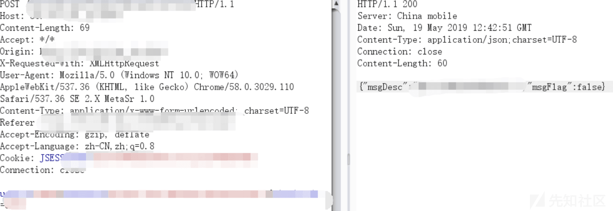](https://xzfile.aliyuncs.com/media/upload/picture/20231103163930-816dea10-7a24-1.png)

### (二)、生成验证码字符集可控

验证码可控，可自行选择验证码（案例：ThinkCMF 1.X-2.X）  
[](https://xzfile.aliyuncs.com/media/upload/picture/20231103164015-9c9af968-7a24-1.png)

### (三)、验证码存放在暴露位置

[](https://xzfile.aliyuncs.com/media/upload/picture/20231103164028-a42f78e8-7a24-1.png)

### (四)、验证码为空，或 8888,0000 等可绕过

验证码为空，是因为程序逻辑错误，验证码验证一次之后本该退出此次验证码，生成新的，由于没有生成新的继续验证密码是否正确，8888,0000 等为开发程序时设置的万能密码，方便测试，有时候会忘记删除

```plain
1111
2222
3333
4444
5555
6666
7777
8888
9999
```

### (五)、验证码尺寸可控

我们的主题是绕过验证码去投票，那么可以尺寸改为很小，仅有一个数字或者字母，这样很好去识别，从而进行绕过刷票

点缀一下其他的知识：如 1.png?width=100 修改 width 控制大小，首先可造成 Ddos  
该问题被人们广为关注源于 PHPcms 早期版本的后台登录验证码尺寸可控，可用于 DDoS  
[](https://xzfile.aliyuncs.com/media/upload/picture/20231103164812-b8bb0cae-7a25-1.png)

### (六)、验证码过于简单，可轻易机器识别

验证码过于简单，可轻易机器识别，同样可实现绕过刷票  
[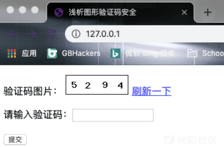](https://xzfile.aliyuncs.com/media/upload/picture/20231103164953-f49a226e-7a25-1.png)  
[](https://xzfile.aliyuncs.com/media/upload/picture/20231103165153-3c60cb7a-7a26-1.png)

### (七)、会话绕过

当投票前几次没有验证码，而后又出现了验证码可能是因为一个会话的尝试次数比较多，可以尝试修改会话，直接清空缓存或打开隐私窗口

## 十二、听说还有手机号验证码投票？

这个就更简单了，可以利用在线接码平台，这里分享几个，网上有很多，挖洞注册也一样可以用  
1）[https://jiemahao.com/](https://jiemahao.com/) （免费）  
2）[https://bestsms.xyz/](https://bestsms.xyz/) （免费）  
3）[https://sms-activate.org/cn](https://sms-activate.org/cn) （付费）  
[](https://xzfile.aliyuncs.com/media/upload/picture/20231103163509-e5aef196-7a23-1.png)

# 案例 1：记一次\*\*刷票

某天，早晨醒来，刚醒看到朋友发个投票的，让我投一下  
[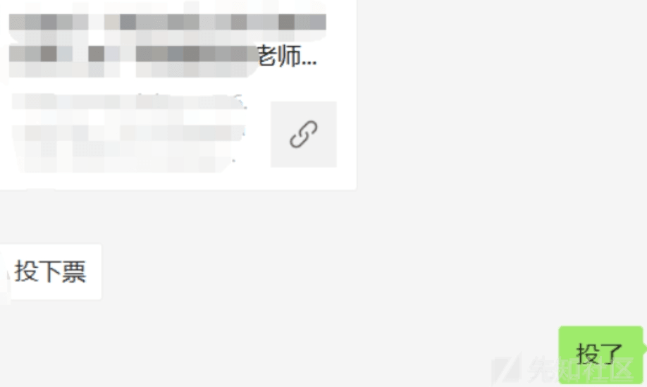](https://xzfile.aliyuncs.com/media/upload/picture/20231103182319-02032cf4-7a33-1.png)  
先是正常投了一下，想着刚好看看测试一下，起床刷个牙，开开电脑，先抓包，分析一下，提示让用\*\*投票  
[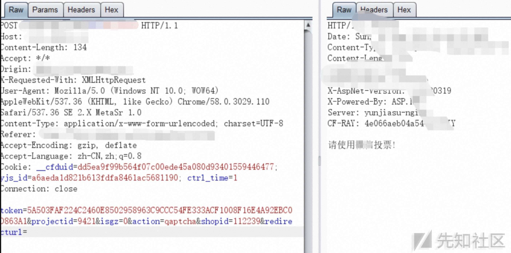](https://xzfile.aliyuncs.com/media/upload/picture/20231104164106-e531dac4-7aed-1.jpg)  
此时我再用客户端的\*\*进行登陆抓包，发现提示还是一样  
[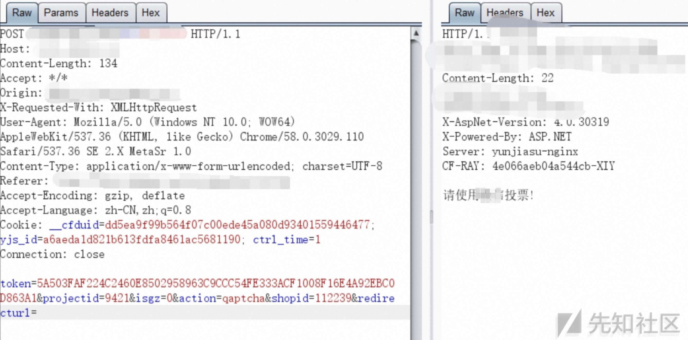](https://xzfile.aliyuncs.com/media/upload/picture/20231104164342-41e3776e-7aee-1.jpg)  
思考一下，他是如何判断我是否用的\*\*？  
我明明用的\*\*，而提示没用\*\*，猜测肯定是 User-Agent 搞的鬼  
[](https://xzfile.aliyuncs.com/media/upload/picture/20231103171024-d2c9f6e8-7a28-1.png)  
因为是客户端的\*\*，所以 User-Agent 还是根据系统的显示，替换个手机的 User-Agent，提示如下：  
[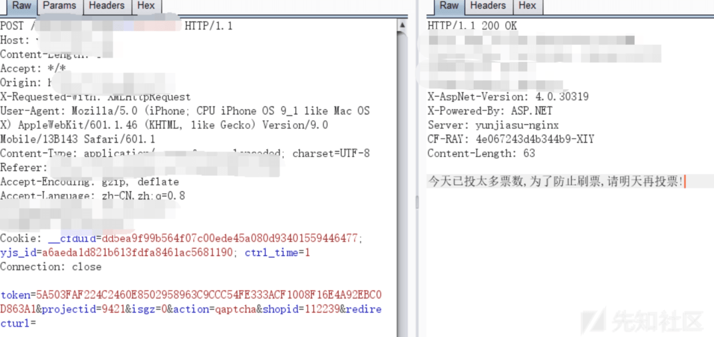](https://xzfile.aliyuncs.com/media/upload/picture/20231103182844-c40ad612-7a33-1.png)  
可以看到，可以进行投票了，不过提示投票过多，明天再试  
此时分析 Post 数据包看到有个 token 值，猜测 token 来进行判断的，因为 token 也属于表示用户身份的特征  
测试随便修改一位数，发现投票成功  
[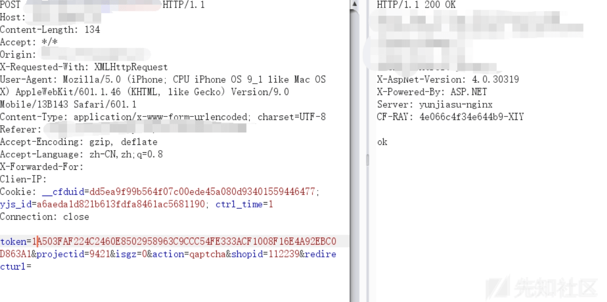](https://xzfile.aliyuncs.com/media/upload/picture/20231103182943-e6fe45dc-7a33-1.png)  
遍历投票  
[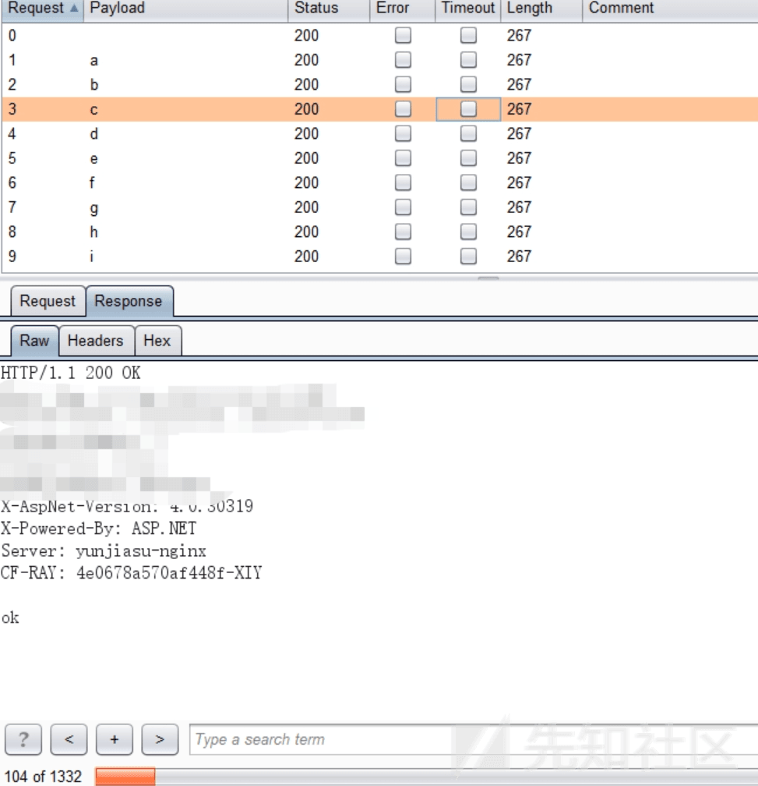](https://xzfile.aliyuncs.com/media/upload/picture/20231103183022-feb02862-7a33-1.png)  
1：  
[](https://xzfile.aliyuncs.com/media/upload/picture/20231103171148-046cc888-7a29-1.png)  
2：  
[](https://xzfile.aliyuncs.com/media/upload/picture/20231103171150-05964126-7a29-1.png)

# 案例 2：记一次为学校排行刷票

一个漆黑的夜晚，接近十一点，辅导员在群里发了一个高校排行投票  
[](https://xzfile.aliyuncs.com/media/upload/picture/20231103181653-1c03394c-7a32-1.png)  
打开看了下，我们学校才第三，1000+ 票，第一名 2W+（xxx 信息工程 xx）  
相信他们是刷的票，搞信息的学校，肯定有大师傅  
首先分析了一下，Cookie 不会验证用户：  
[](https://xzfile.aliyuncs.com/media/upload/picture/20231103183117-1f1fb838-7a34-1.png)  
ip 也不会验证用户：  
[](https://xzfile.aliyuncs.com/media/upload/picture/20231103183259-5bc9bf9a-7a34-1.png)  
发现上面有两个参数，一个 vid 是指学校  
id 测试发现投票成功为 4，但是投票到达一定次数就会换另一个值，Bp 遍历一下  
[](https://xzfile.aliyuncs.com/media/upload/picture/20231103182015-94d99ef6-7a32-1.png)  
持续几十票，id 就不可以用了，发现增加 1 位即可投票成功，既然知道了规律，那还等什么！  
[](https://xzfile.aliyuncs.com/media/upload/picture/20231103182116-b8c20286-7a32-1.png)  
刷之后，稳定排名第二  
[](https://xzfile.aliyuncs.com/media/upload/picture/20231103182253-f2e3e042-7a32-1.png)

# 结束语

针对投票这方面产商可以加强验证机制、如随机 token+ 服务端验证，在提交表单处再次增加随机校验码等等，上面思路仅是在刷票途中用到的一些思路，最重要的是师傅们要学到技巧，用到其他情况上面，并不单单指投票，就比如看到某个功能点就会考虑存在哪些漏洞，漏洞应该在什么点会触发！
