# 部分中间人攻击手法简介 - 先知社区

部分中间人攻击手法简介


# 中间人攻击简介

中间人攻击（Man-in-the-Middle Attack，简称 MITM 攻击）是一种网络安全攻击，攻击者通过在通信的两端之间插入恶意节点，从而达到监视、篡改或劫持通信流量的效果

中间人攻击常见的手法包括：

1.  ARP 欺骗 (ARP Spoofing):攻击者发送 ARP 欺骗包，让受害者误认为攻击者的 MAC 地址是目的 IP 对应的 MAC 地址，从而将流量导向攻击者。
2.  DNS 欺骗 (DNS Spoofing):攻击者篡改 DNS 服务器的记录，使受害者访问网站时被重定向到攻击者控制的网站。
3.  SSL 压制 (SSL Stripping):攻击者压制受害者和服务器之间的 SSL/TLS 加密连接，使用明文传输窃取信息。
4.  WiFi 伪装 (Evil Twin):攻击者设置一个与正规 WiFi 相似的假冒网络，诱使用户连接，获取网络流量。
5.  会话劫持 (Session Hijacking):攻击者通过获取会话标识符，接管受害者与服务器之间的会话。

# ARP 欺骗

## 简介

ARP 欺骗是中间人攻击方式中的一项经典攻击手法，该攻击方式可以令受害者错认为攻击者的 MAC 是网关 MAC，从而将全部流量转发至攻击者主机。由于 ARP 协议的限制，该手段通常用于内网机器通讯时的地址转换。

原理：

*   地址解析协议，即 ARP（Address ResolutionProtocol），是根据 IP 地址获取物理地址的一个 TCP/IP 协议。主机发送信息时将包含目标 IP 地址的 ARP 请求广播到局域网络上的所有主机，并接收返回消息，以此确定目标的物理地址；收到返回消息后将该 IP 地址和物理地址存入本机 ARP 缓存中并保留一定时间，下次请求时直接查询 ARP 缓存以节约资源。通俗的说，DNS 是域名与 IP 对应的协议，而 arp 是 IP 与 mac(物理地址) 对应的协议，DNS 常用于主机与外网机器连接时进行地址转换，而 arp 多用于内网机器通信时地址的转换

手法：

*   攻击者使用 ARP 欺骗工具发送 ARP 响应报文，声称自己的 MAC 地址是受害者要找的 IP 的 MAC。
*   受害者接收到响应后会更新自己的 ARP 缓存，之后发往该 IP 的流量就会发往攻击者。

效果：

*   攻击者可以窃听通信内容，劫持会话，进行网站钓鱼等攻击。
*   攻击者可以成为“中间人”,控制受害者和服务器之间的通信。
*   如果攻击者同时欺骗受害者和服务器，可以修改传输的数据包内容。
*   攻击者可以选择只劫持部分特定的流量，使攻击难以被察觉。

## 网络拓扑

网络拓扑如图：

[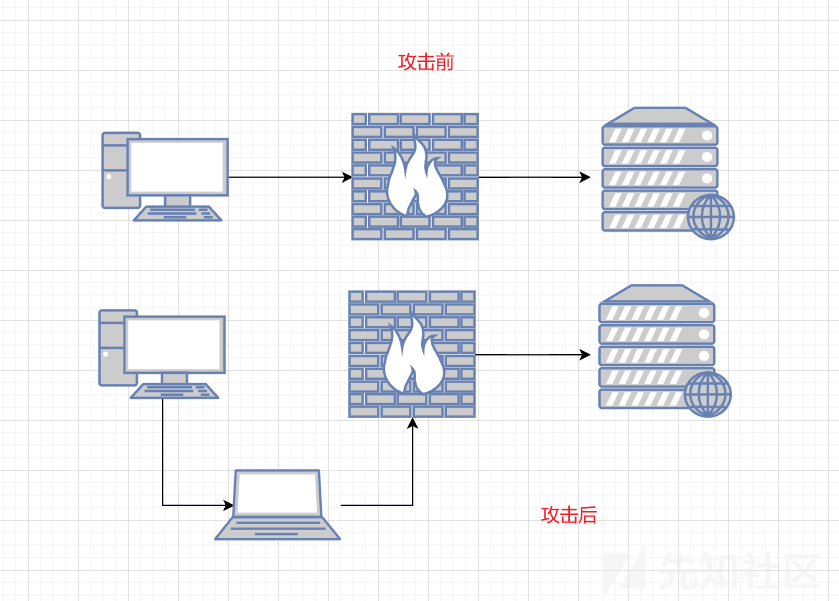](https://xzfile.aliyuncs.com/media/upload/picture/20230923200024-c788b5f2-5a08-1.png)

受害者：192.168.243.128（00-0C-29-12-DC-7A）

攻击者：192.168.243.129（00:0c:29:f7:fb:a8）

提前开启抓包工具对虚拟网卡进行抓包

## arp 欺骗方法

使用 kali，工具命令如下：

```plain
arpspoof -i <网卡接口> -t <目标的内网地址> <网关 ip>
```

执行命令后，可以在抓包软件中看出，攻击者发出了大量的 arp response 包，声明自己为网关地址（243.2）

[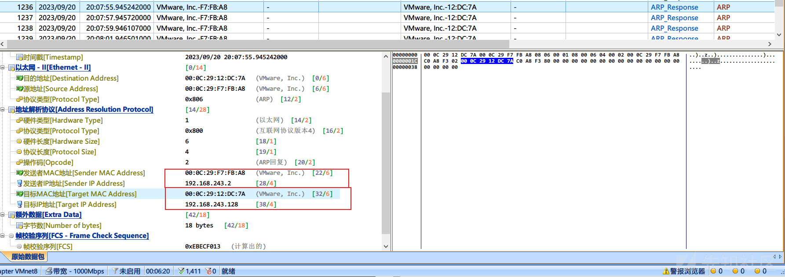](https://xzfile.aliyuncs.com/media/upload/picture/20230923200038-cf85d2c6-5a08-1.png)

此时我们再去攻击者设备上查看 arp 表，发现网关地址的 mac 已经被污染为攻击者的 mac

[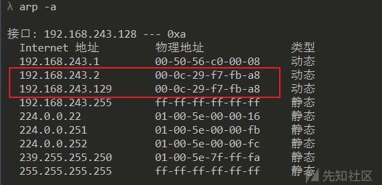](https://xzfile.aliyuncs.com/media/upload/picture/20230923200043-d2d04a1a-5a08-1.png)

## 流量转发与劫持

劫持成功后，受害者所有的流量都会发送至攻击者，但攻击者默认并没有开始流量转发功能，所以会导致受害者无法上网

在受害者这里发送 dns 请求

[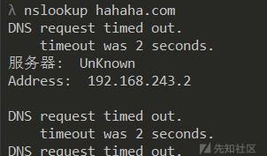](https://xzfile.aliyuncs.com/media/upload/picture/20230923200051-d71bb05a-5a08-1.png)

攻击者这里就能看到了，说明流量成功的被转移到攻击者主机这里

[](https://xzfile.aliyuncs.com/media/upload/picture/20230923200056-da9162c0-5a08-1.png)

为了能在劫持流量的同时，保证受害者正常上网，攻击者主机需要开启流量转发功能

出于安全考虑，Linux 系统默认是禁止数据包转发的。所谓转发即当主机拥有多于一块的网卡时，其中一块收到数据包，根据数据包的目的 ip 地址将包发往本机另一网卡，该网卡根据路由表继续发送数据包。这通常就是路由器所要实现的功能。

```plain
su - #改变用户为 root，并使用 root 环境变量
echo 1 >/proc/sys/net/ipv4/ip_forward   #将参数换为 1
```

默认为 0，0 为不转发，1 为启用流量转发

启用流量转发后，再操作受害者访问网页，可以发现能正常上网，且流量被攻击者截获

[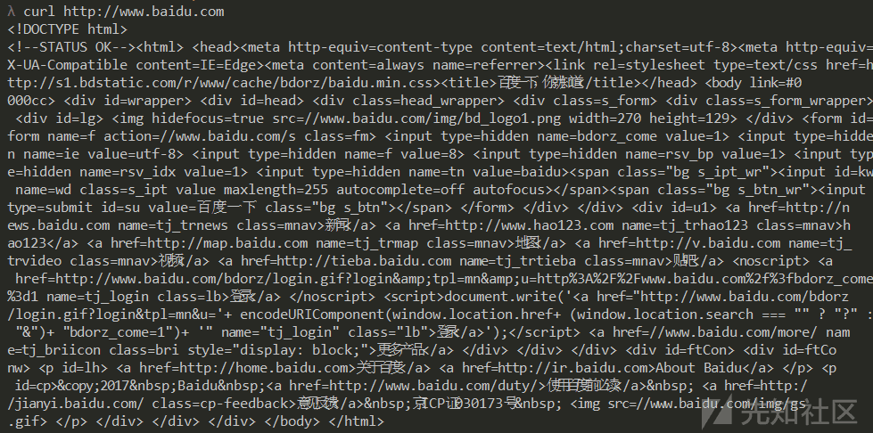](https://xzfile.aliyuncs.com/media/upload/picture/20230923200105-dffde59e-5a08-1.png)

[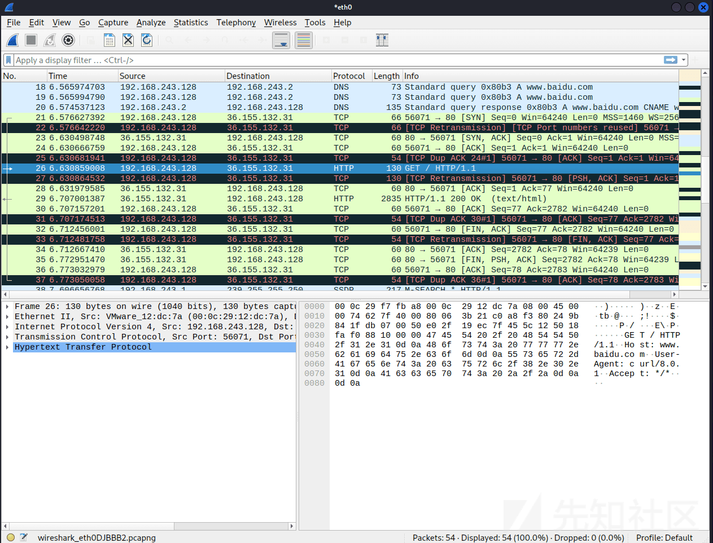](https://xzfile.aliyuncs.com/media/upload/picture/20230923200116-e6830b56-5a08-1.png)

# DNS 劫持

## 简介

DNS 劫持 (DNS Spoofing) 的原理、手法和效果如下：

原理：

*   DNS(域名系统) 用于域名与 IP 地址之间的解析。DNS 劫持通过伪造 DNS 响应欺骗受害者。

手法：

*   欺骗受害者的 DNS 服务器，向用户发送虚假的域名解析响应。
*   典型的手法是中毒本地网络的 DNS 缓存服务器，或进行 ARP 欺骗成为"中间人"。
*   还可以通过攻击域名注册商或云服务器等方式实现。

效果：

*   受害者会连接到攻击者指定的错误 IP 地址。
*   攻击者可以将流量重定向到钓鱼网站或恶意服务器。
*   黑客可以中间人攻击受害者与服务器的通信。
*   攻击者可以选择目标，比如只劫持银行或邮件服务的域名。
*   攻击者可以记录受害者的上网记录

总的来说，当我们有了控制受害者 dns 服务器或 dns 请求的权限时，便可进行 dns 劫持

## 搭建 dns 服务器

这里可以使用 AdGuard 搭建 dns 服务器，搭建完成后把过滤规则、dns 黑白名单关掉清空即可

[https://github.com/AdguardTeam/AdGuardHome](https://github.com/AdguardTeam/AdGuardHome)

## ARP 欺骗下的 DNS 劫持

假设前期我们已经完成了 arp 欺骗，成为了中间人，这时我们已经可以控制受害者机器任意流量

通过 wireshark 可以看出，受害者默认的 dns 服务器为 192.168.243.2

[](https://xzfile.aliyuncs.com/media/upload/picture/20230923200133-f092a03e-5a08-1.png)

此时我们利用 iptables 对受害者的流量进行重定向，将其访问 192.168.243.2:53 端口的流量重定向至攻击者 192.168.243.129:53

```plain
iptables -t nat -A PREROUTING -p udp --dport 53 -d 192.168.243.2 -j DNAT --to-destination 192.168.243.129:53

检查 nat 表、过滤表规则是否还存在：
iptables -t nat -L
iptables -L
# 删除命令
iptables -t nat -D PREROUTING -p udp --dport 53 -j REDIRECT --to-port 5353
iptables -t nat -D PREROUTING -p udp --dport 53 -d 8.8.8.8 -j DNAT --to-destination 127.0.0.1:53
```

受害人访问百度，可以发现攻击者截获了受害人的 dns 请求

[](https://xzfile.aliyuncs.com/media/upload/picture/20230923200143-f676d06a-5a08-1.png)

将指定域名劫持至攻击者服务器

[](https://xzfile.aliyuncs.com/media/upload/picture/20230923200153-fc6e480e-5a08-1.png)

当然，如果受害人使用了 https，伪造 https 站点会导致证书错误

[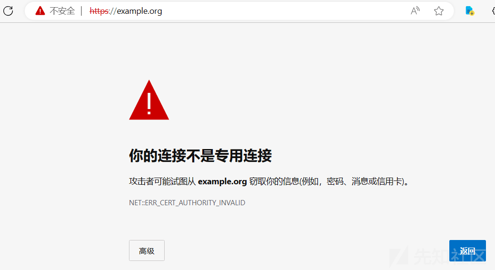](https://xzfile.aliyuncs.com/media/upload/picture/20230923200159-ffaf8bd6-5a08-1.png)

## 直接修改受害者 dns 的 dns 劫持

若我们控制了受害者网络出口路由器或者其本人电脑的权限，则可以修改其电脑或路由器上 dns 为我们自己的 dns 服务器，从而达到 dns 劫持的效果

# HTTP/HTTPS流量劫持修改

提前说明，此类攻击方法并不是完美的，在没有让受害者信任根证书的情况下，通过中间人攻击解密受害者 https 请求时，会使受害者浏览器提示**https 证书错误**

## 工具准备-mitmproxy

### 工具简介

`mitmproxy`是一个交互式的中间代理 HTTP 和 HTTPS 的控制台界面。

**特点**:

1.  中间人 (Man-in-the-middle) 代理:mitmproxy 可以作为一个 HTTP/HTTPS 代理，实现中间人攻击，拦截和修改流量。
2.  保存完整的 HTTP 会话以供以后重播和分析
3.  重放 HTTP 对话的客户端
4.  重播以前记录的服务器的 HTTP 响应
5.  反向代理模式将流量转发到指定的服务器
6.  在 OSX 和 Linux 上的透明代理模式
7.  使用 Python 对 HTTP 流量进行脚本化更改
8.  用于拦截的 SSL / TLS 证书即时生成

### 工具使用

mitmproxy、mitmdump、mitmweb 都可以完成 mitmproxy 的启动。它们提供了不同的操作界面，但功能一致，且都可以加载自定义脚本

`mitmproxy` 命令启动后，会提供一个命令行界面，用户可以实时看到发生的请求，并通过命令过滤请求，查看请求数据。

`mitmdump`是 mitmproxy 的命令行模式。它提供了类似 tcpdump 的功能，可帮助你查看，记录和以编程方式转换 HTTP 流量。

`mitmweb` 命令启动后，会提供一个 web 界面，用户可以实时看到发生的请求，并通过 GUI 交互来过滤请求，查看请求数据。这里我们使用 mitmweb，直接在命令行输入 mitmweb 即可启动

[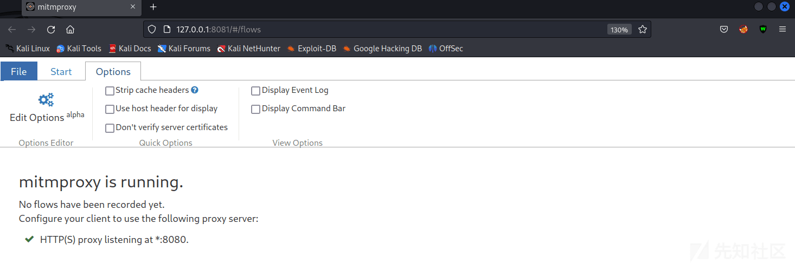](https://xzfile.aliyuncs.com/media/upload/picture/20230923200211-07529310-5a09-1.png)

mitmproxy 会默认将 8080 端口作为 http/https 流量的监听端口

## 重定向 HTTP/HTTPS 流量

工具已经准备完成，下一步是将受害者发往 80 端口和 443 端口（或发往其他端口的 https 流量）的流量重定向至攻击者的 8080 端口

### 重定向 arp 欺骗后流量

如果前期**完成了 arp 欺骗**，劫持了受害者的所有流量，则直接通过防火墙修改本机的流量转发规则即可

```plain
# 将 eth0 网卡的所有访问 80 和 443 流量转发至 8080 端口
iptables -t nat -A PREROUTING -i eth0 -p tcp --dport 80 -j REDIRECT --to-port 8080
iptables -t nat -A PREROUTING -i eth0 -p tcp --dport 443 -j REDIRECT --to-port 8080

# 只转发指定 IP 的流量
iptables -t nat -A PREROUTING -s 192.168.243.128 -p tcp --dport 80 -j REDIRECT --to-ports 8080
iptables -t nat -A PREROUTING -s 192.168.243.128 -p tcp --dport 443 -j REDIRECT --to-ports 8080
```

重定向后，受害者访问流量即可被我们抓获

[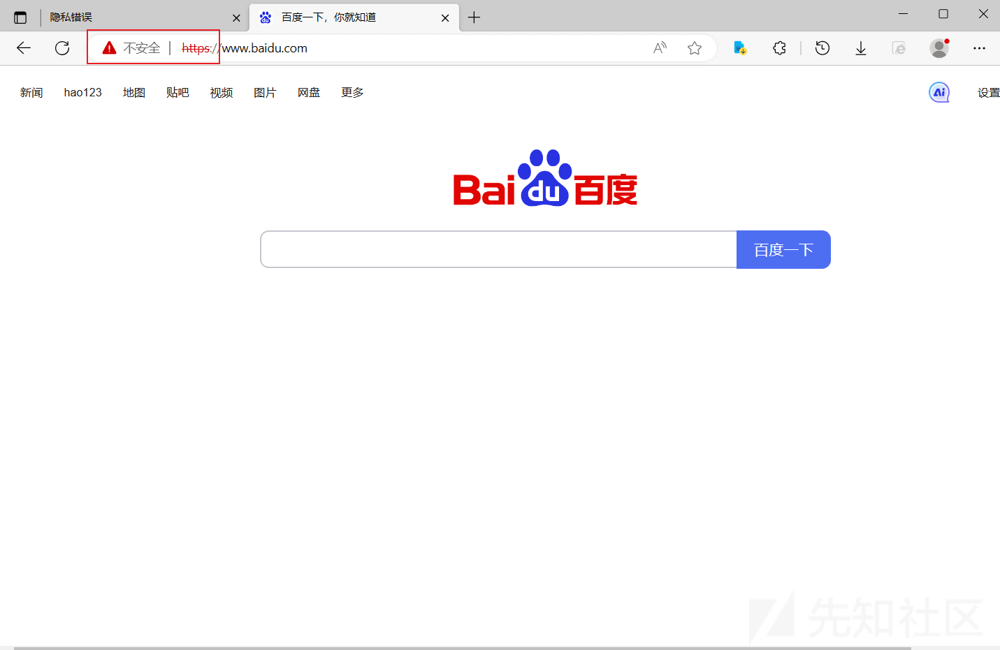](https://xzfile.aliyuncs.com/media/upload/picture/20230923200220-0c4165cc-5a09-1.png)

[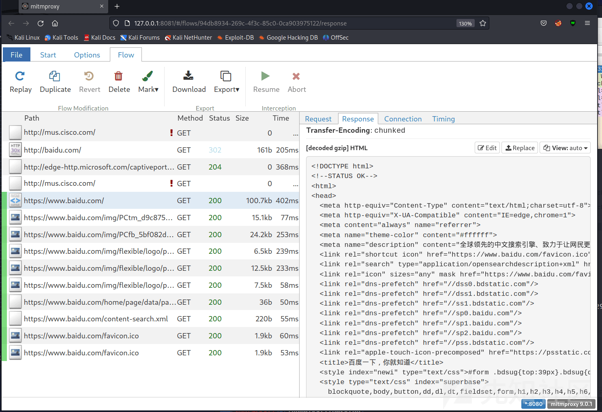](https://xzfile.aliyuncs.com/media/upload/picture/20230923200225-0f9f2ec0-5a09-1.png)

还可以拦截请求，修改请求

[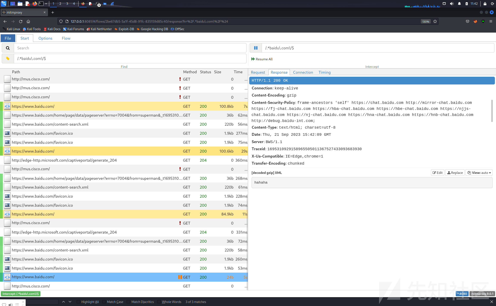](https://xzfile.aliyuncs.com/media/upload/picture/20230923200233-14284b7a-5a09-1.png)

[](https://xzfile.aliyuncs.com/media/upload/picture/20230923200237-16857b22-5a09-1.png)

### 重定向 dns 劫持流量

如果前期完成了 DNS 劫持，那么我们还需要将要劫持的域名进行 dns 重写

[](https://xzfile.aliyuncs.com/media/upload/picture/20230923200242-19cd3860-5a09-1.png)

重写后，受害者访问指定域名的流量就可以被我们劫持

[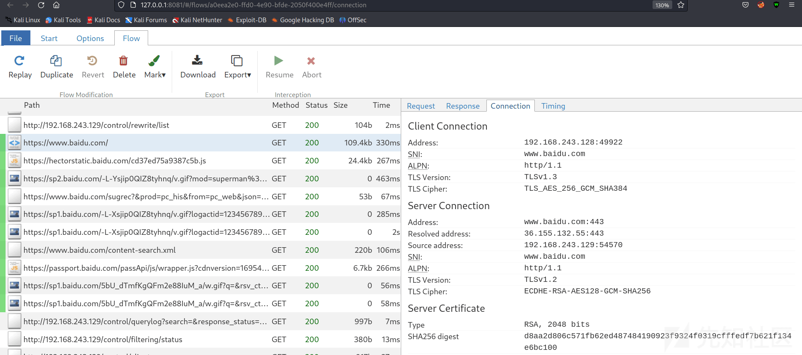](https://xzfile.aliyuncs.com/media/upload/picture/20230923200248-1d24ea76-5a09-1.png)

### 重定向非标准 80 和 443 端口流量

只需要在防火墙配置时，修改相应端口即可，如：

```plain
iptables -t nat -A PREROUTING -i eth0 -p tcp --dport 8443 -j REDIRECT --to-port 8080
```

## 信任根证书后的流量劫持

### 证书安装

只要客户端信任其内置的证书颁发机构，`Mitmproxy`即可即时解密加密的流量。通常，这意味着必须在客户端设备上安装`mitmproxy CA`证书。

到目前为止，安装`mitmproxy`证书的最简单方法是使用内置的证书安装应用程序。为此，只需启动 mitmproxy 并使用正确的代理设置配置目标设备。

现在启动设备上的浏览器，并访问 `mitm.it`。您应该会看到类似以下内容的内容：

[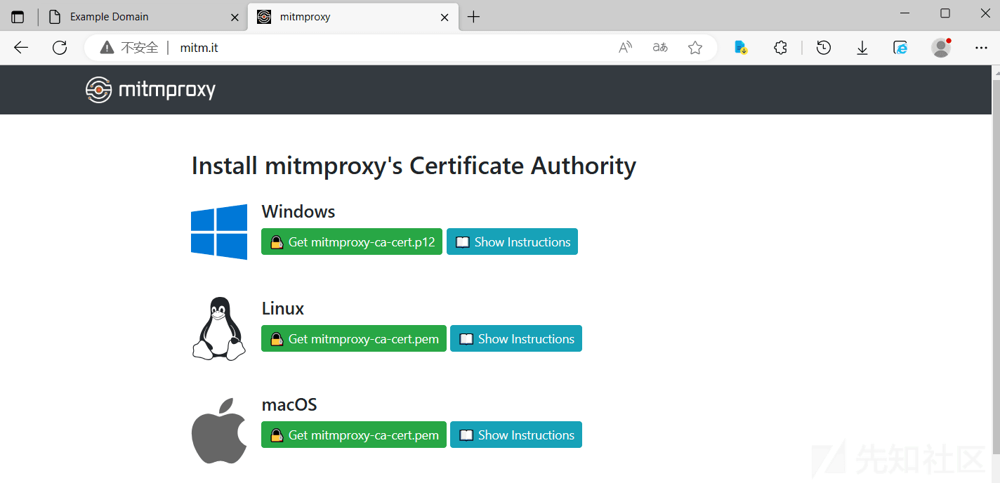](https://xzfile.aliyuncs.com/media/upload/picture/20230923200255-21663108-5a09-1.png)

单击相关图标，按照所用平台的设置说明进行操作，一切顺利。

有时无法选择使用快速安装应用程序 - 想到 Java 或 iOS Simulator-或出于某些其他原因而只需要手动进行操作即可。以下是一些通用平台的手动证书安装文档的指针列表。`mitmproxy CA`证书位于`~/.mitmproxymitmproxy`的首次启动后，位于该文件夹位置。

[](https://xzfile.aliyuncs.com/media/upload/picture/20230923200300-23ffc866-5a09-1.png)

由`mitmproxy`在`.mitmproxy`目录中创建的文件如下：

*   mitmproxy PEM 格式的证书和私钥。
*   mitmproxy-ca-cert.pem PEM 格式的证书。使用它可以在大多数非 Windows 平台上分发。
*   mitmproxy-ca-cert.p12 PKCS12 格式的证书。用于 Windows。
*   mitmproxy-ca-cert.cer 与.pem 相同的文件，但某些 Android 设备需要扩展名。

### 手动导入根证书

双击证书文件，导入本地计算机

[](https://xzfile.aliyuncs.com/media/upload/picture/20230923200305-27056732-5a09-1.png)

选根证书

[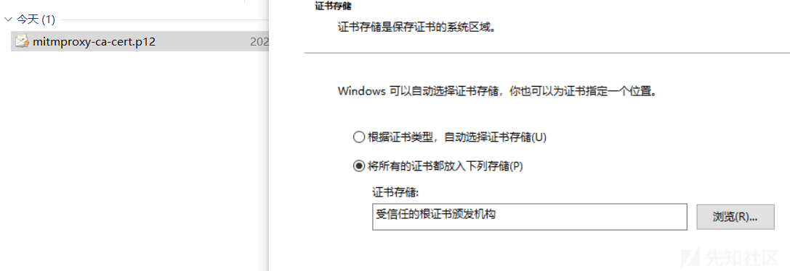](https://xzfile.aliyuncs.com/media/upload/picture/20230923200309-29961140-5a09-1.png)

导入成功后即可发现红锁以及提示消失了

[](https://xzfile.aliyuncs.com/media/upload/picture/20230923200313-2c06363a-5a09-1.png)

### 命令行导入根证书

使用 powershell 可以直接在没有弹窗提示的情况下完成证书导入（需要管理员权限）

```plain
CertUtil -enterprise -f -addstore Root .\mitmproxy-ca-cert.cer
```

### 防护措施

不忽略提醒强行上网，同时加强对根证书的管控，不安装可疑的根证书

Windows 中证书存储于注册表中，使用火绒等 hips 工具做好对相关注册表的监控与防护即可

当前用户的**证书** HKEY\_CURRENT\_USER\\Software\\Microsoft\\SystemCertificates

本地计算机**证书** HKEY\_LOCAL\_MACHINE\\SOFTWARE\\Microsoft\\SystemCertificates
