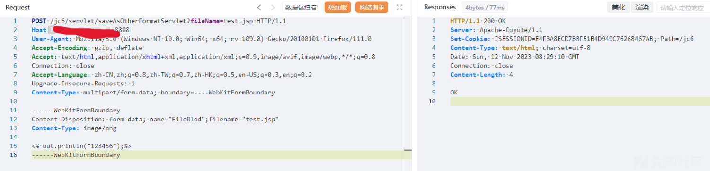

# 金和 OA saveAsOtherFormatServlet 接口任意文件上传漏洞和多个 SQL 注入漏洞分析 - 先知社区

金和 OA saveAsOtherFormatServlet 接口任意文件上传漏洞和多个 SQL 注入漏洞分析

- - -

# 路由分析

通过分析 web.xml 配置文件，我们可以发现以下定义。

其中定义了一个名为“spring”的`DispatcherServlet`和它的映射路径。我们可以知道`DispatcherServlet`是 Spring 框架中的前端控制器，负责接收所有的 HTTP 请求，并将它们转发到相应的处理程序（控制器中的方法）。通过这个我们可以知道`/JHSoft.WCF/*`路由与`spring` Servlet 有关联。这里表明，任何 URL 路径匹配`/JHSoft.WCF/`后跟任何内容的请求都将由`spring` Servlet 处理。

在后面还配置了其他多个`servlet`和它们的映射，这些`servlet`用于处理各种业务逻辑。

# saveAsOtherFormatServlet 接口任意文件上传漏洞

通过 web.xml 配置文件定位`servlet`和映射路由。

查看代码

分析代码可以知道，这是一个继承自 HttpServlet，用于处理 HTTP 请求的 Servlet。并且定义了`processRequest`方法，其中 HttpServlet 中的 doGet 方法和 doPost 方法都是转发请求到 processRequest 方法处理，所以这里`processRequest`方法用于处理来自 doGet 和 doPost 方法的请求

分析代码可知`String fileName = request.getParameter("fileName");`这里会从从请求参数中获取文件名。然后通过`IUploadService uploadService = (IUploadService) SpringContextUtil.getBean("uploadService");`获取一个 bean 对象`IUploadService`是一个与文件上传相关的服务。`IUploadService`：这是一个接口类型，这里是典型的服务层设计模式，通过封装业务逻辑，提供给控制层调用。

查看实现类，代码量很大，整体来看，这个类就是提供了文件上传和附件管理相关的业务逻辑实现，包括文件的保存、查询、删除以及与业务数据的关联等操作。当用的具体方法，我们再进行分析。

回到前面，注意这里会从请求中获取业务类型参数，如果为空则默认为“公文正文”。进行判断，当业务类型不是“infoContent”，会执行获取附件列表操作，也就是`uploadService.getAttachmentList`

查看代码并分析，可以知道是根据给定的业务类型和业务标识，通过 Hibernate Query Language (HQL) 查询语句从数据库中检索出与之对应的所有附件信息列表。

如果获取到了附件列表，尝试从第一个附件中获取文档路径，然后从文档路径中剥离出文件名，得到上传路径 realPath。后续进行判断当 realPath 为空，就设置为默认路径。`realPath = request.getSession().getServletContext().getRealPath("") + "/upload/gwzw";`也就是将 web 应用的根目录的路径和`"/upload/gwzw"`字符串连接起来，得到上传路径。

然后就是进入上传文件的逻辑，在上传的操作中会先`List<FileItem> fileItems = upload.parseRequest(request);`解析 HTTP 请求来提取所有表单项，并将这些表单项作为`FileItem`对象的集合保存起来，方便后续的处理。这里用到的是 Apache Commons FileUpload 组件，简单来说就是将请求封装成一个`FileItem`对象，需要什么再进行提取就行。后续操作就是从`FileItem`提取文件进行写入。

根据字段名判断是什么类型的表单项然后决定处理方式，这里我们看后续当字段名是"FileBlod"进行的操作，`FileOutputStream fos2 = new FileOutputStream(new File(realPath + File.separator + fileName));`创建文件输出流，用于写入文件内容，其中`fileName`为我们的输入，`realPath`在前面定义。

后续就是无关的业务类型的操作，我们直接看写入流程。

就是创建文件输出流，然后将上传的文件内容写入到指定文件中。当文件成功上传后输出 OK。至此我们的上传文件流程大致结束，根据以上的分析文件上传路径为当前 web 应用根目录+`/upload/gwzw`+上传文件名，其中文件名可控。

## 漏洞复现

# clobfield 接口 SQL 注入漏洞

通过 web.xml 配置文件定位`servlet`和映射路由。

  

查看代码

可以发现定义了一个 Servlet，继承自`HttpServlet`类。会先从请求中获取一系列参数，然后创建 clobfield1 类的实例。查看 clobfield1 类构造函数，就是创建`clobfield1`类的实例时，从 Spring 的应用上下文中获取`JdbcTemplate`的实例并初始化类的`jt`成员变量，其中`JdbcTemplate`是 Spring 框架提供的一个用于简化数据库操作的类，提供了一系列的 JDBC 操作模板方法。

  

创建好实例后，会将请求中获取参数设置进 clobfield1 实例的属性。然后就是通过检查 strKey 参数，来确定是读操作还是写操作，当进行读操作时，会调用 wd.readClob() 方法，并输出其返回的内容。

其中 readClob 方法代码如下，首先会获取数据库连接，然后创建语句对象 `stat = conn.createStatement();`创建了一个`Statement`对象，在 JDBC 操作中我们可以知道`Statement`是手动拼接 SQL 语句和参数，PreparedStatement 通过占位符（`?`）来指定参数，并进行预编译仿造 sql 注入。当然也不能完全隔绝。

通过`stat.execute("select " + this.sImgname + " from " + this.sTablename + " where " + this.sKeyname + "='" + this.sKeyvalue + "'");`执行 sql 语句，我们可以发现是直接将我们输入参数拼接到 SQL 语句中，从而造成 sql 注入。

## 漏洞复现

构造 sql 语句查询数据库版本

# GetAttOut 接口 SQL 注入漏洞

在前面的路由分析中我们可以知道`/JHSoft.WCF/*`路由与`spring` Servlet 有关联。任何 URL 路径匹配`/JHSoft.WCF/`后跟任何内容的请求都将由`spring` Servlet 处理。

通过搜索路由我们可以发现`/TEST/GetAttOut`路由，结合前面的分析完整路由为`/jc6/JHSoft.WCF/TEST/GetAttOut`

  

这里使用@RequestMapping 注解定义请求映射地址为"GetAttOut"，处理相应的 HTTP 请求。

首先会通过`readStream(request.getInputStream())`读取请求流并转换为字符串，`jsonStr.replaceAll("\"", "");`处理其中的 JSON 字符串，替换掉所有的引号，将输入传给`keyId`，然后拼接进入 sql 语句，`EformReturnJson re = this.eformService.execSqlReList("select * from outwork where keyid='" + keyId + "'");`并通过`execSqlReList`方法执行 sql 查询。

查看 execSqlReList 代码，其中执行 sql 查询是通过 `this.databaseOperator.execSqlReList(sql);`方法执行 SQL 查询，databaseOperator 是一个封装了数据库操作的类，然后遍历查询结果。

查看`databaseOperator.execSqlReList(sql);`方法，只关注 sql 语句执行部分，这里会根据传入的 SQL 语句创建一个 PreparedStatement 对象`ps = con.prepareStatement(sql);`，然后执行查询并获取结果集，`ResultSet rs = ps.executeQuery();`。  
  
虽然这里`prepareStatement`用于表示预编译的 SQL 语句，当 sql 语句中并没有占位符进行预编译，并且即使 SQL 语句中没有使用任何占位符，也可以使用 `con.prepareStatement(sql);` 执行。`prepareStatement` 方法，同样可以执行没有参数的普通 SQL 语句。至此我们可以发现是直接将我们输入参数拼接到 SQL 语句中没有过滤和预编译，从而造成 sql 注入。

## 漏洞复现

参考链接  
[https://blog.csdn.net/qq\_56698744/article/details/134830686](https://blog.csdn.net/qq_56698744/article/details/134830686)  
[https://blog.csdn.net/luochen2436/article/details/135083785](https://blog.csdn.net/luochen2436/article/details/135083785)  
[https://blog.csdn.net/jjjj1029056414/article/details/135578823](https://blog.csdn.net/jjjj1029056414/article/details/135578823)
