# 针对 FinGhost 黑产组织攻击样本的详细分析 - 先知社区

针对 FinGhost 黑产组织攻击样本的详细分析

- - -

# 概述

FinGhost 组织是一个专业从事黑灰产的攻击组织，该攻击组织此前主要针对金融从业者，利用钓鱼网站、社工、间谍软件以及各种最新的热点事件捆绑病毒文件，然后诱导用户点击安装病毒文件，从而实现远控肉鸡控制。

笔者对该组织进行跟踪，捕获到该组织的攻击样本，并对该样本进行详细分析，该组织正处于发展阶段，通过肉鸡控制大量主机，从而进行网络违法犯罪活动。

# 详细分析

1.捕获到的样本时间戳为 2023 年 4 月 12 日，如下所示：  
[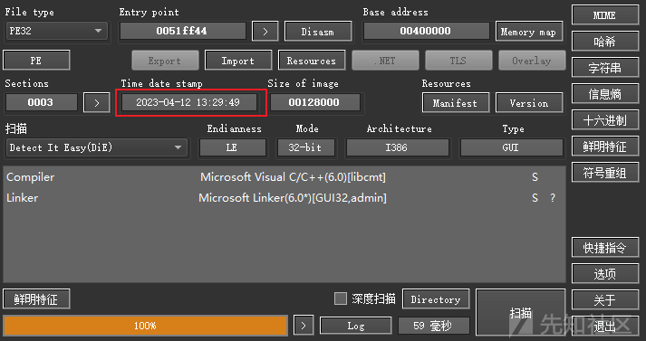](https://xzfile.aliyuncs.com/media/upload/picture/20240216223759-fb2135d6-ccd8-1.png)  
2.解密样本中硬编码数据段中的加密数据，如下所示：  
[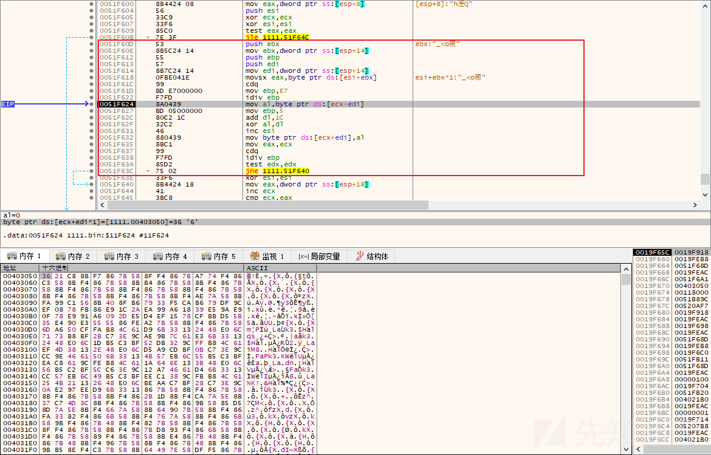](https://xzfile.aliyuncs.com/media/upload/picture/20240216223844-163085b6-ccd9-1.png)  
3.解密之后，如下所示：  
[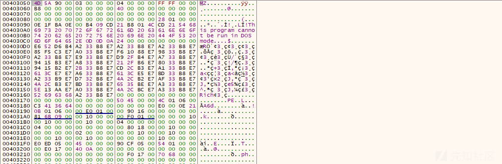](https://xzfile.aliyuncs.com/media/upload/picture/20240216223911-265835b0-ccd9-1.png)  
4.在内存中分配空间，将解密的数据，传入到分配的内存空间中，如下所示：  
[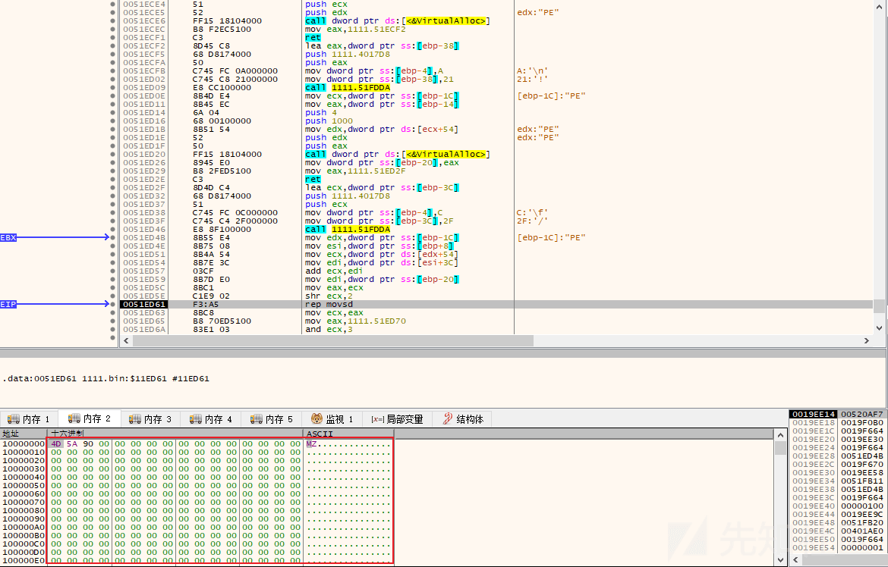](https://xzfile.aliyuncs.com/media/upload/picture/20240216223933-33392596-ccd9-1.png)  
5.然后跳转到解密数据执行，如下所示：  
[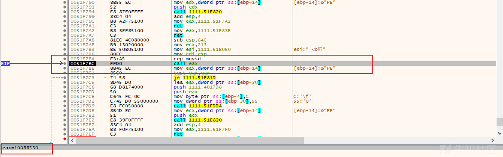](https://xzfile.aliyuncs.com/media/upload/picture/20240216224003-44dd1866-ccd9-1.png)  
6.执行解密出来的恶意 Payload 的 Shellex 函数，如下所示：  
[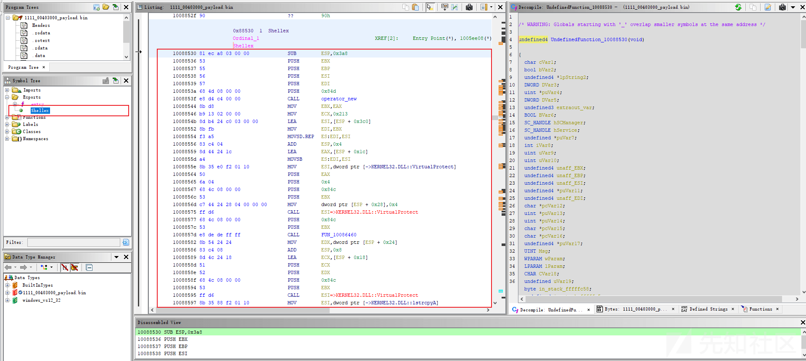](https://xzfile.aliyuncs.com/media/upload/picture/20240216224028-53f3c2a0-ccd9-1.png)  
7.将文件拷贝到 C:\\Windows 目录，如下所示：  
[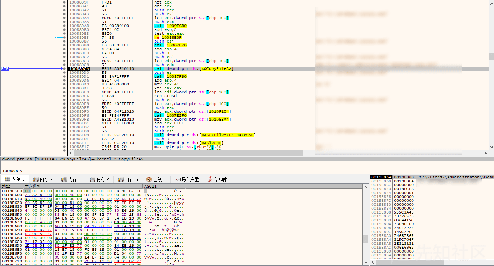](https://xzfile.aliyuncs.com/media/upload/picture/20240216224051-61e630f0-ccd9-1.png)  
8.设置相关的注册表项，如下所示：  
[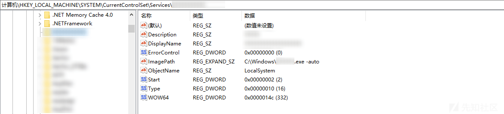](https://xzfile.aliyuncs.com/media/upload/picture/20240216224117-710b205e-ccd9-1.png)  
9.创建一个自启动服务，服务名为程序名，参数为-auto，并启动服务，如下所示：  
[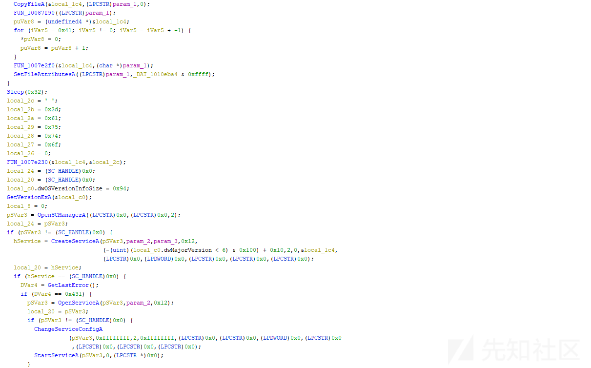](https://xzfile.aliyuncs.com/media/upload/picture/20240216224144-813d2a12-ccd9-1.png)  
10.创建完成之后的服务项，如下所示：  
[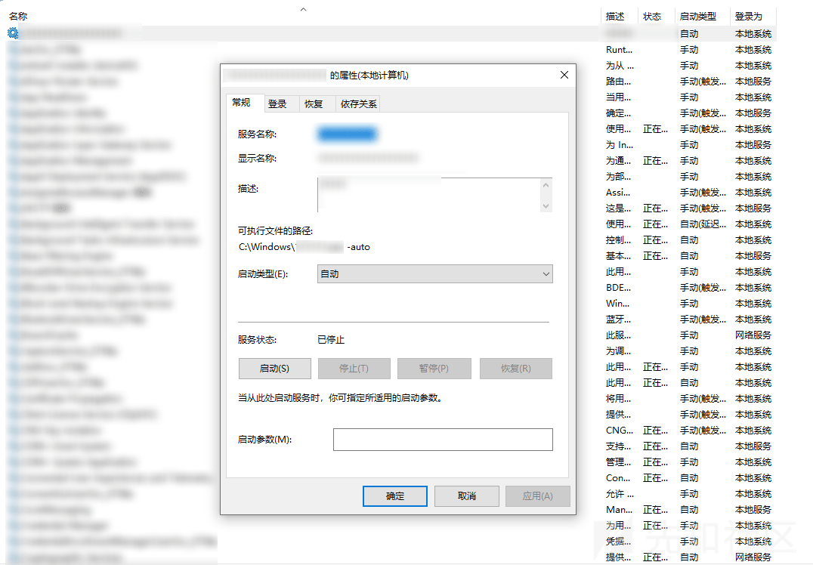](https://xzfile.aliyuncs.com/media/upload/picture/20240216224210-90fd3ee2-ccd9-1.png)  
11.解密远程 C2 服务器 IP：45.195.*.*，如下所示：  
  
12.遍历进程获取一些常用安全软件信息，如下所示：  
[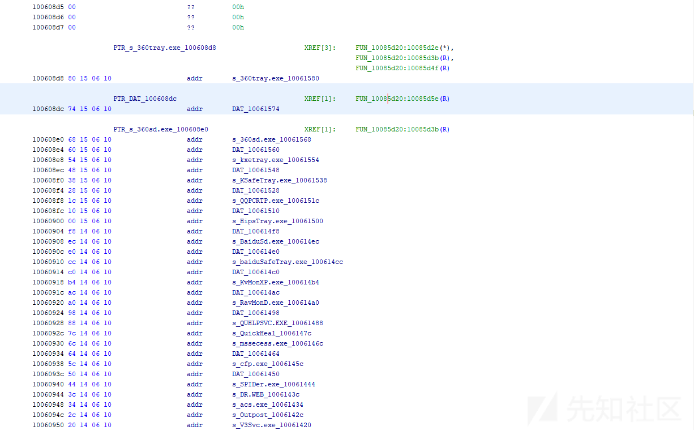](https://xzfile.aliyuncs.com/media/upload/picture/20240216224307-b30a683e-ccd9-1.png)  
13.连接远程服务器，返回相应的执行指定，如下所示：  
[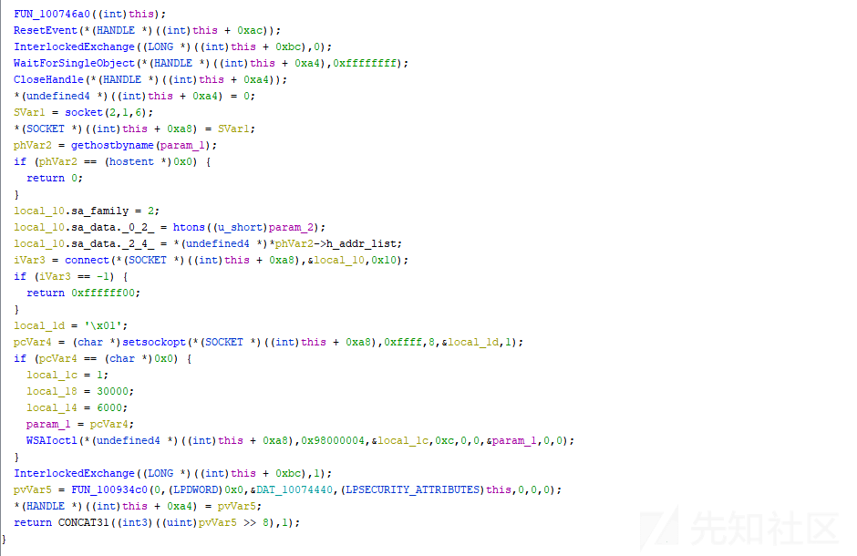](https://xzfile.aliyuncs.com/media/upload/picture/20240216224335-c3c02420-ccd9-1.png)  
14.拷贝自身到 C:\\Program Files\\Common Files\\scvhost.exe，并设置自启动项，如下所示：  
[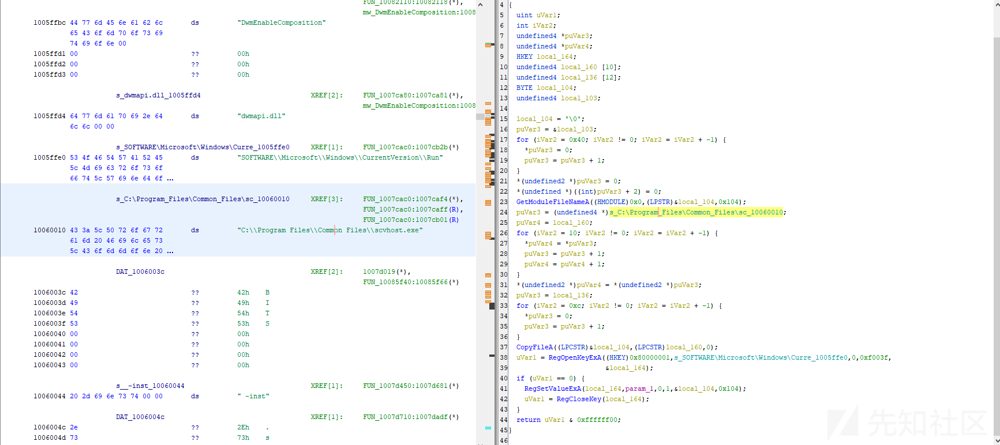](https://xzfile.aliyuncs.com/media/upload/picture/20240216224401-d33a2630-ccd9-1.png)  
15.从远程服务器下载 Mimikatz，获取主机登录密码，如下所示：  
[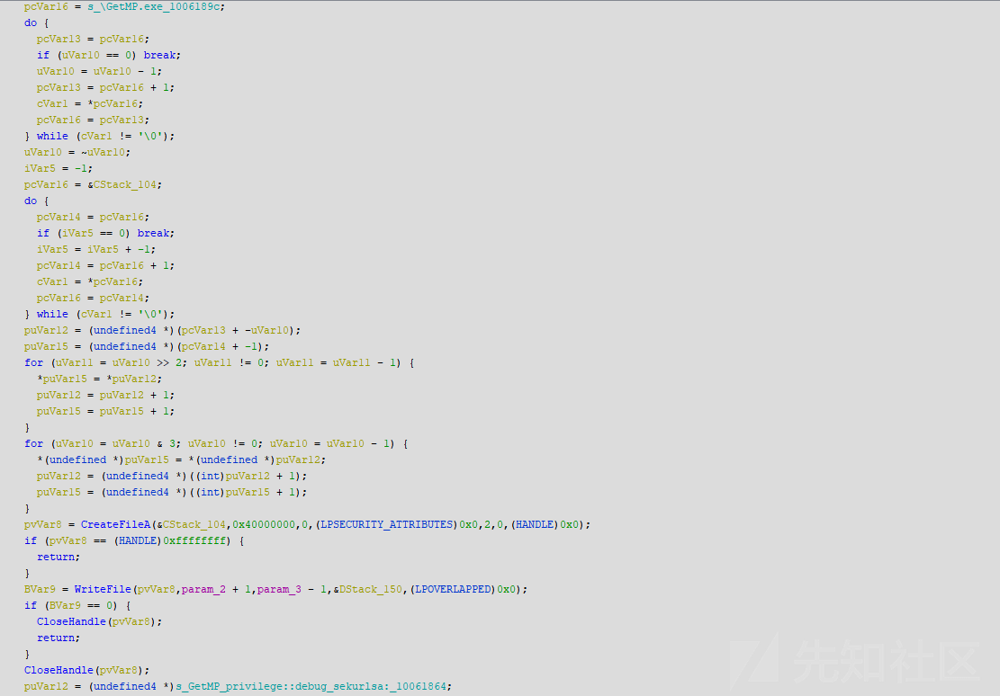](https://xzfile.aliyuncs.com/media/upload/picture/20240216224429-e3b187d8-ccd9-1.png)  
16.截屏桌面屏幕信息、鼠标记录、获取和设置剪切版信息、获取桌面相关信息等，如下所示：  
[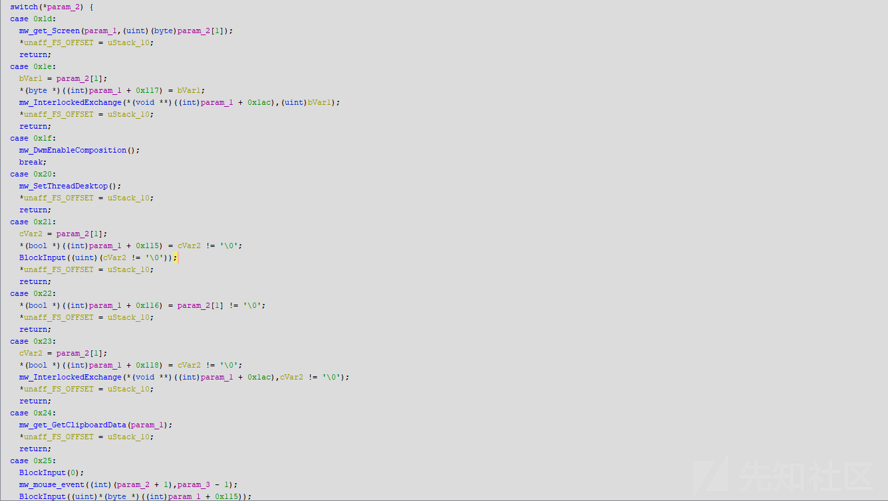](https://xzfile.aliyuncs.com/media/upload/picture/20240216224455-f33ee650-ccd9-1.png)  
17.获取键盘记录，如下所示：  
[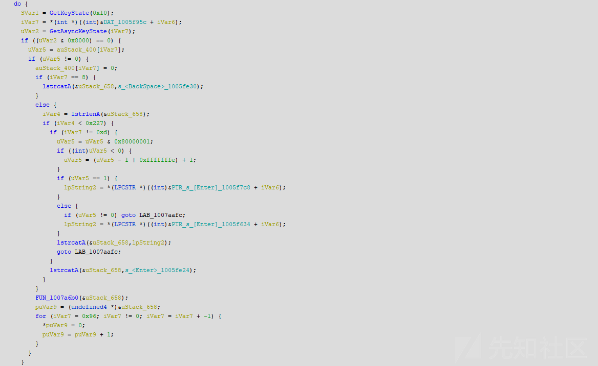](https://xzfile.aliyuncs.com/media/upload/picture/20240216224520-021ba8de-ccda-1.png)  
18.通过调用 QQ 接口 API，获取登录的 QQ 帐号的相关信息，如下所示：  
[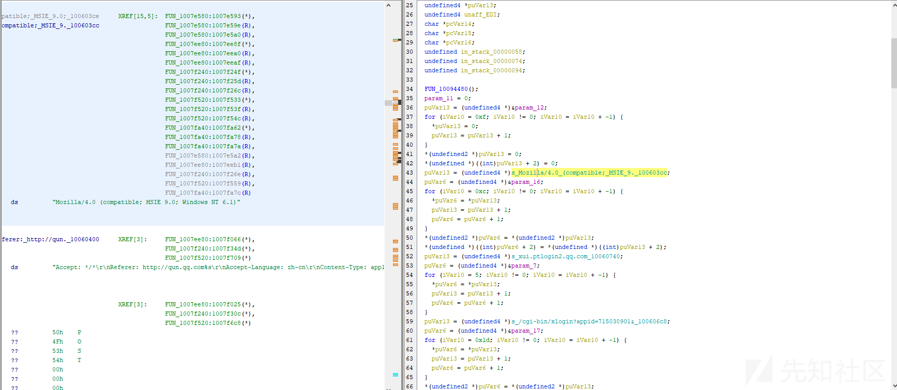](https://xzfile.aliyuncs.com/media/upload/picture/20240216224548-13085e62-ccda-1.png)  
19.远控监听，开启 3389 远控连接等功能，如下所示：  
[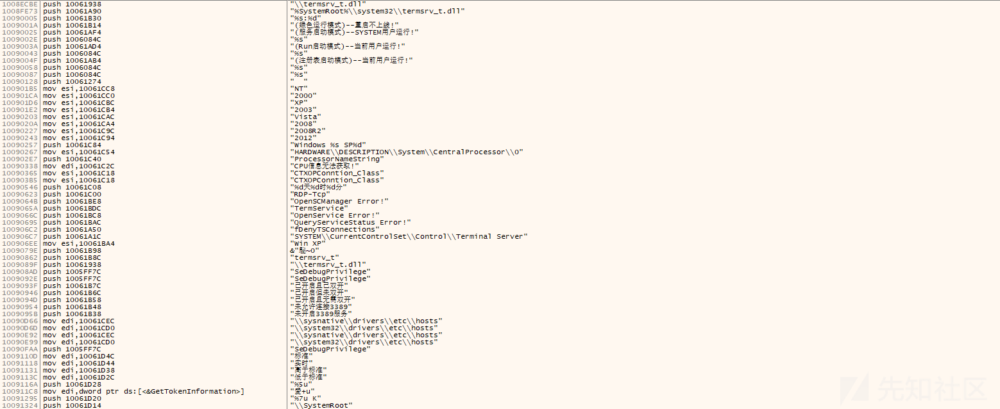](https://xzfile.aliyuncs.com/media/upload/picture/20240216224618-24c8982e-ccda-1.png)  
20.该木马为 Gh0st 远控变种样本，功能非常强大，就不一一列举了，如下所示：  
[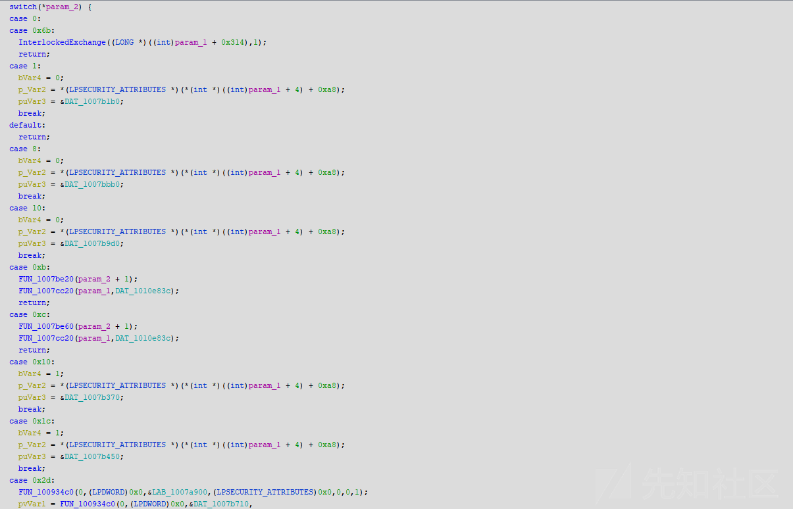](https://xzfile.aliyuncs.com/media/upload/picture/20240216224645-34da2e62-ccda-1.png)

# 总结

最近一两年黑产团伙非常活跃，主要通过钓鱼攻击的方式对受害者进行攻击，然后再安装远控后门，控制受害者主机，然后再进行相关的网络犯罪活动，需要持续关注。
