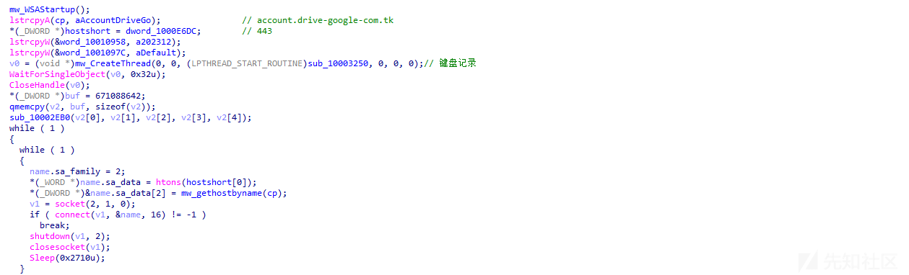

# 针对 SugarGh0st 组织最新攻击样本的分析 - 先知社区

针对 SugarGh0st 组织最新攻击样本的分析

- - -

# 前言概述

2023 年 11 月份 Cisco Talos 发现了一起针对乌兹别克斯坦外交部和韩国用户的攻击活动，攻击活动使用了一种新型的 RAT 恶意软件 SugarGh0st，SugarGh0st 是 Gh0st RAT 的最新的变种之一。

2023 年 12 月份哈萨克斯坦国家技术服务中心发现 SugarGh0st 组织针对哈萨克斯坦进行大规模网络钓鱼的攻击活动，该攻击活动使用了 SugarGh0st 在 2023 年 12 月更新的最新攻击样本。

对比 2023 年 11 月 SugarGh0st 组织的攻击样本，2023 年 12 月的攻击样本主要在免杀方面进行了相关的更新，加载脚本变成了 VBS 脚本，利用 Windows 登录自启动来加载执行 DLL 恶意模块，同时增加了相应的免杀技术，对 DLL 文件进行增肥，加壳等技术手段以逃避安全软件的检测。  
  
笔者从 vx-underground 下载到最新的攻击样本，并针对 SugarGh0st 组织最新的攻击样本进行了相关的分析。

# 样本分析

1.钓鱼压缩包自解压之后，会在相应的目录生成几个恶意文件，如下所示：  
  
2.自解压之后会调用 VBS 脚本，VBS 脚本会注册恶意 DLL 模块为 Windows 登录自启动脚本来建立持久性，如下所示：  
  
该攻击技术曾被多个 APT 组织使用，相关 ATT&CK 实例与 APT 攻击组织，如下所示：  
  
3.加载的恶意 DLL 模块 update.dll 有两百多 M，并使用 VMP 加壳处理，如下所示：  
  
4.VMP 入口点代码特征，如下所示：  
  
5.动态调试，脱壳之后，到达恶意 DLL 模块的入口点处，如下所示：  
  
6.读取 Temp 目录下的 authz.lib 文件内容，并在内存中解密，如下所示：  
  
7.动态调试，读取 authz.lib 文件内容到内存，如下所示：  
  
8.异或解密文件内容，如下所示：  
  
9.解密之后，如下所示：  
  
10.最后跳转到解密的 shellcode 代码执行，如下所示：  
  
11.shellcode 获取关键函数地址，然后调用 VirtualAlloc 函数分配内存空间，如下所示：  
  
12.解密出 payload 数据到内存中，如下所示：  
  
13.解密出来的 payload 就是 SugarGh0st RAT，与此前 Cisco Talos 发布的 payload 相似，创建一个互斥变量，变量名就是该 RAT 的 C2 域名，如下所示：  
  
14.启动键盘记录功能，在相应目录下生成记录文件，如下所示：  
  
15.硬编码记录了样本的编译时间为 2023 年 12 月，如下所示：  
  
16.通过硬编码的 C2 域名和端口，与黑客远程服务器建立连接，如下所示：  
  
17.对进程进行提权相关操作，如下所示：  
  
18.获取主机相关信息发送到远程服务器，然后执行 C2 命令通信，如下所示：  
  
19.文件操作相关的 C2 命令，如下所示：  
  
其他 C2 指令可以参考 Cisco Talos 此前发布的相关报告，这里就不一一列举了。

# 总结结尾

安全对抗会一直持续存在，有攻必有防，攻与防就是矛与盾的关系，攻击者会不断更新自己的攻击样本和攻击技术，持续对抗安全产品的检测和查杀，安全研究人员需要持续不断的提升自己的安全能力，深入研究这些对抗技术，才能做到知已知彼，更快的发现这些安全问题。

笔者一直从事与恶意软件威胁情报相关的安全分析与研究工作，包含各种各样的不同类型的恶意软件，通过深度分析和研究这些恶意软件，了解全球黑客组织最新的攻击技术以及攻击趋势。
