# 针对以哈网络战 Wiper 攻击武器的详细分析 - 先知社区

针对以哈网络战 Wiper 攻击武器的详细分析

- - -

# 前言概述

随着全球网络安全战的爆发，各种 Wiper 类型的恶意软件被大量应用到了国与国之间的网络安全战，成为网络安全战的重要攻击武器，专门针对敌对国的基础设施进行网络攻击行动，破坏敌国的各种基础设施，此前俄乌网络战的期间就使用了大量的 Wiper 攻击武器进行网络攻击。

此前 Google 安全团队发布了以色列与哈马斯网络战争相关报告，报告下载链接：  
[https://services.google.com/fh/files/misc/tool-of-first-resort-israel-hamas-war-cyber.pdf，](https://services.google.com/fh/files/misc/tool-of-first-resort-israel-hamas-war-cyber.pdf%EF%BC%8C) 有兴趣的朋友可以下载研究一下，同时提供了相关的 IOCS，IOCS 链接：  
[https://github.com/google/threat-team/tree/main/2024/2024-02-14-tool-of-first-resort-israel-hamas-war-cybert，](https://github.com/google/threat-team/tree/main/2024/2024-02-14-tool-of-first-resort-israel-hamas-war-cybert%EF%BC%8C) 笔者针对以哈网络战中使用的几种 Wiper 攻击武器进行了详细分析。

# 详细分析

## 2.1 CHILLWIPE Wiper 恶意软件

CHILLWIPE 恶意软件是一款 SH 脚本类型的攻击样本，主要针对 Linux 系统，伪装成 F5 漏洞更新程序，如下所示：  
[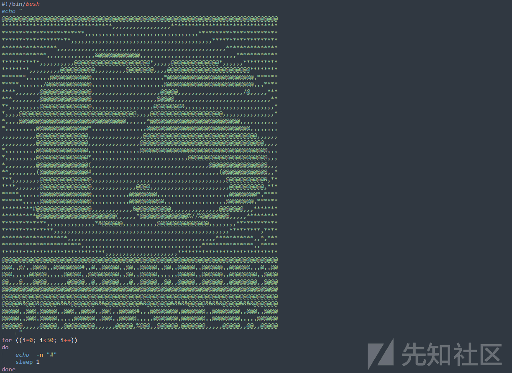](https://xzfile.aliyuncs.com/media/upload/picture/20240229201506-2c80a6ac-d6fc-1.png)  
删除系统所有用户帐号，如下所示：  
[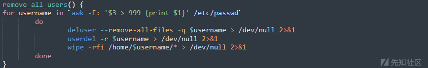](https://xzfile.aliyuncs.com/media/upload/picture/20240229201520-34cd0db4-d6fc-1.png)  
删除系统包含的文件，如下所示：  
[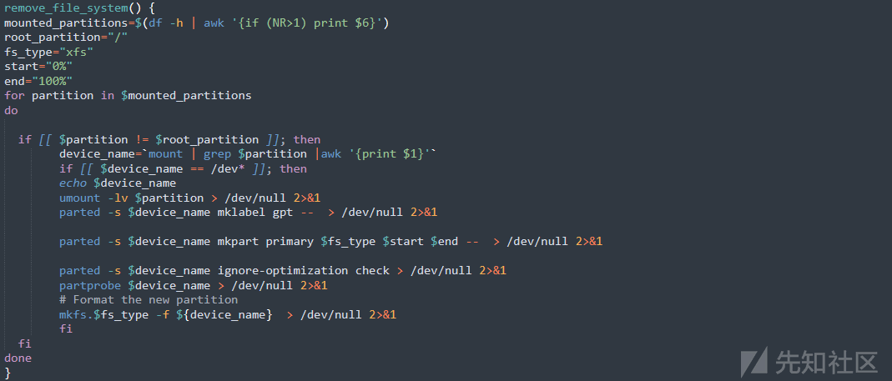](https://xzfile.aliyuncs.com/media/upload/picture/20240229201539-405e020a-d6fc-1.png)  
通过 Telegram 发送相关消息到远程服务器，如下所示：  
[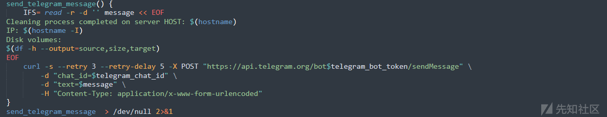](https://xzfile.aliyuncs.com/media/upload/picture/20240229201552-484fed7a-d6fc-1.png)  
删除系统文件，如下所示：  
[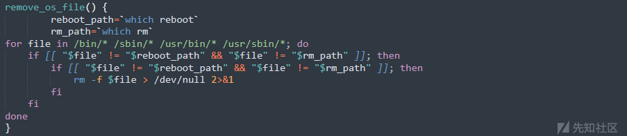](https://xzfile.aliyuncs.com/media/upload/picture/20240229201608-5170bac4-d6fc-1.png)  
最后重启系统。

## 2.2 COOLWIPE Wiper 恶意软件

COOLWIPE恶意软件是一款使用C#编写的NET类型的攻击样本，如下所示：  
[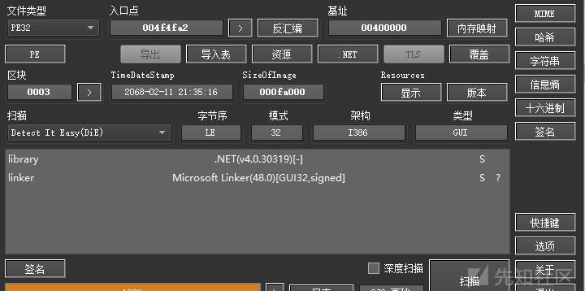](https://xzfile.aliyuncs.com/media/upload/picture/20240229201636-624bb7c2-d6fc-1.png)  
它同样伪装成 F5 漏洞更新程序，如下所示：  
[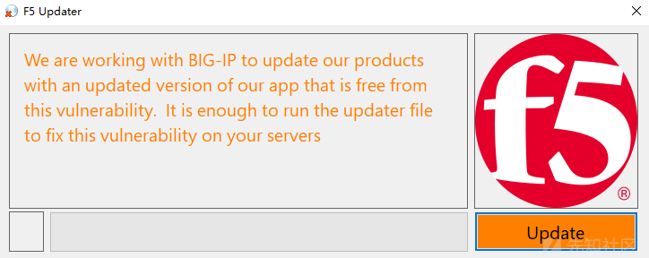](https://xzfile.aliyuncs.com/media/upload/picture/20240229201706-742d47da-d6fc-1.png)  
点击 Update 按钮之后，会在系统目录下生成一个恶意软件，如下所示：  
[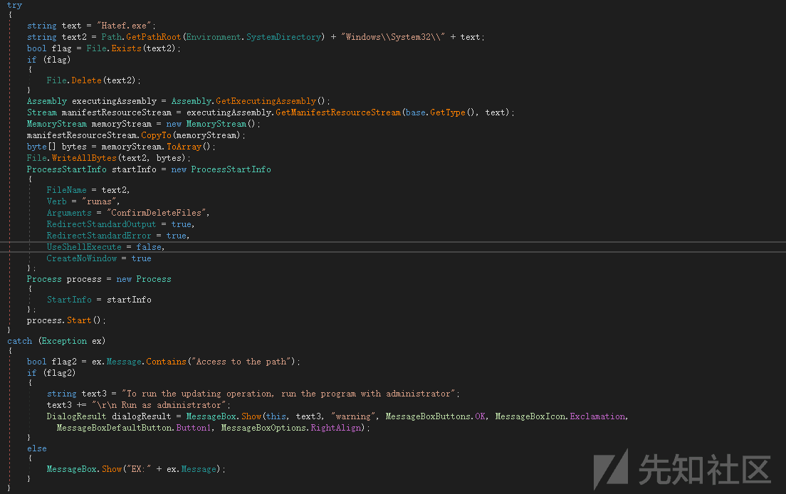](https://xzfile.aliyuncs.com/media/upload/picture/20240229201721-7d5c6d2c-d6fc-1.png)  
生成的 Hatef.exe 恶意程序，对系统中的文件进行覆盖或删除操作，如下所示：  
[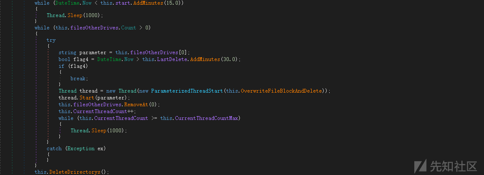](https://xzfile.aliyuncs.com/media/upload/picture/20240229201738-8747c61a-d6fc-1.png)  
具体操作，如下所示：  
[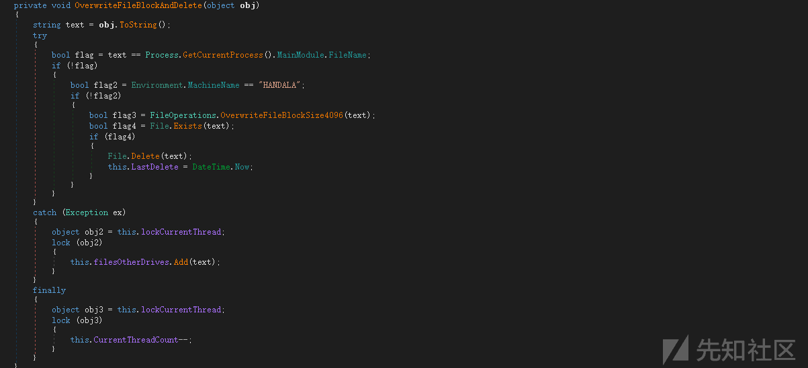](https://xzfile.aliyuncs.com/media/upload/picture/20240229201757-92b11d1c-d6fc-1.png)  
然后通过 Telegram 发送系统主机相关信息和操作消息到远程服务器，如下所示：  
[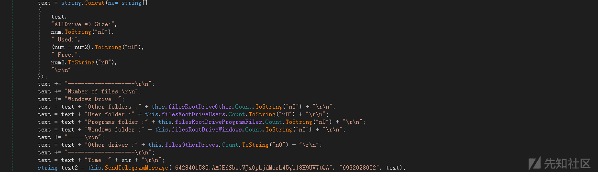](https://xzfile.aliyuncs.com/media/upload/picture/20240229201813-9c3f97d2-d6fc-1.png)

## 2.3 DUNE BiBi Wiper 恶意软件

DUNE BiBi Wiper 恶意软件包含 Windows 和 Linux 两个平台的攻击样本，笔者分别对这两个平台攻击样本进行详细分析。

### 2.3.1 Windows 平台恶意软件

判断是否带有参数，参数为系统目录路径，如果带参数，则遍历参数目录下的文件，如下所示：  
[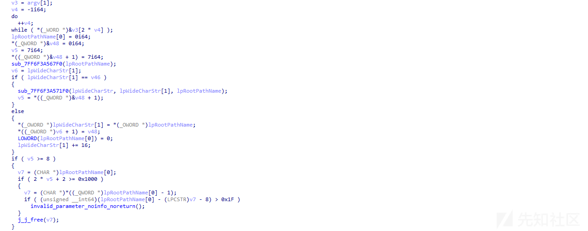](https://xzfile.aliyuncs.com/media/upload/picture/20240229201854-b4e02068-d6fc-1.png)  
如果不带有参数，则遍历 C:\\Users 目录下的文件，如下所示：  
[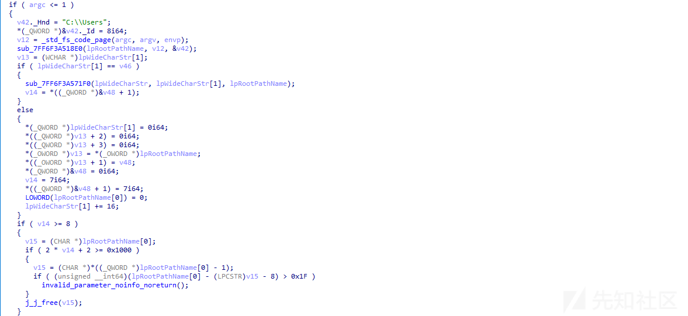](https://xzfile.aliyuncs.com/media/upload/picture/20240229201909-bd926036-d6fc-1.png)  
获取操作系统主机信息，如下所示：  
[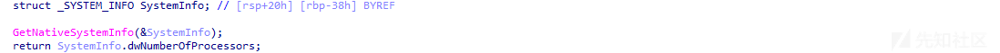](https://xzfile.aliyuncs.com/media/upload/picture/20240229201925-c6ca57f8-d6fc-1.png)  
显示被损坏操作系统磁盘文件目录，以及系统主机信息，如下所示：  
[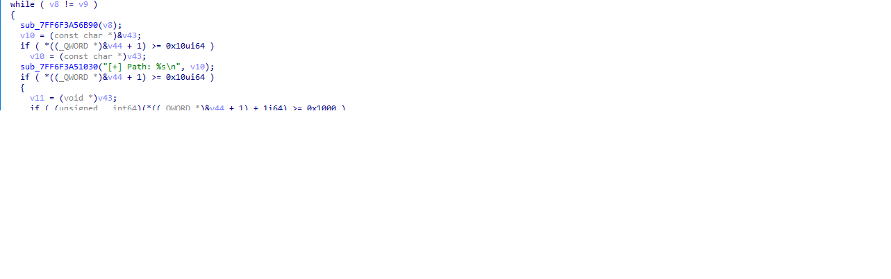](https://xzfile.aliyuncs.com/media/upload/picture/20240229201942-d16352f0-d6fc-1.png)  
调用 CMD 命令，删除磁盘卷影复本、禁用系统启动修复等，如下所示：  
[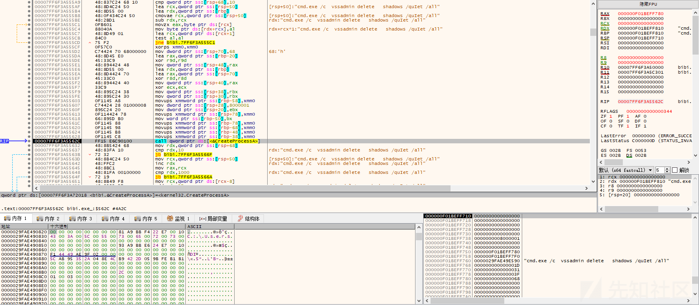](https://xzfile.aliyuncs.com/media/upload/picture/20240229201956-d9d630d8-d6fc-1.png)  
相关命令，如下：  
cmd.exe /c vssadmin delete shadows /quIet /all  
cmd.exe /c wmic shadowcopy delete  
cmd.exe /c bcdedit /set {default} bootstatuspolicy ignoreallfailures  
cmd.exe /c bcdedit /set {default} recoveryenabled no  
遍历目录下的文件，重命名文件并损坏文件，通过写入与目标文件长度相同的随机数据替换原文件内容，如下所示：  
[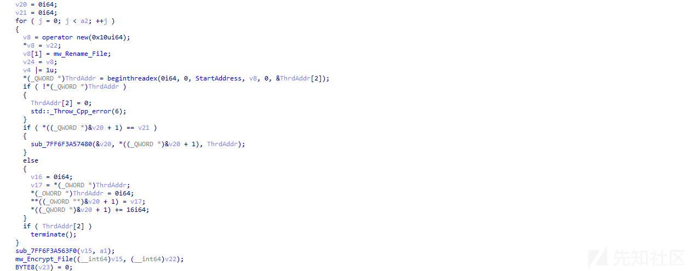](https://xzfile.aliyuncs.com/media/upload/picture/20240229202033-ef53b318-d6fc-1.png)  
填充写入随机数据内容，如下所示：  
[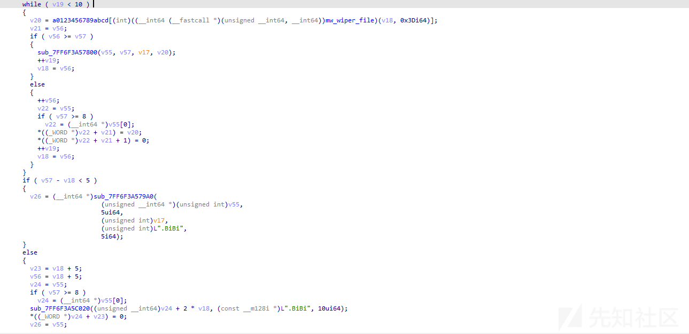](https://xzfile.aliyuncs.com/media/upload/picture/20240229202048-f84be3f0-d6fc-1.png)  
如果文件后缀名为 EXE、SYS、DLL 等后缀，则不损坏，如下所示：  
[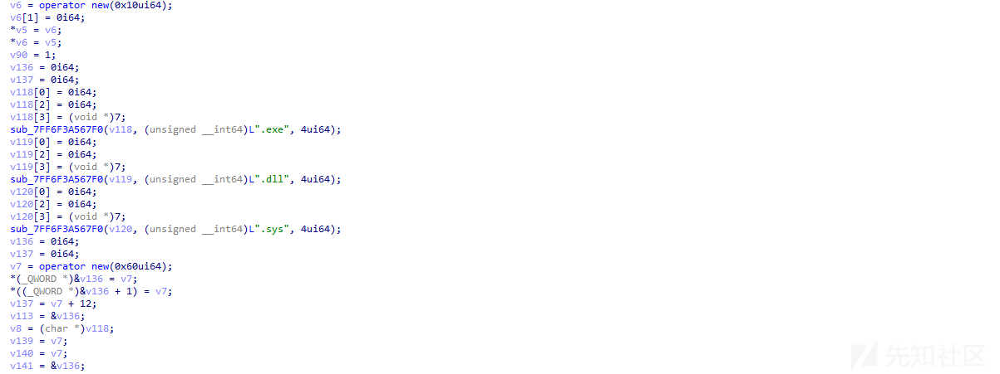](https://xzfile.aliyuncs.com/media/upload/picture/20240229202101-008f890e-d6fd-1.png)  
重命名后的文件名为\[随机字符串名\].BiBi\[随机数\]，如下所示：  
[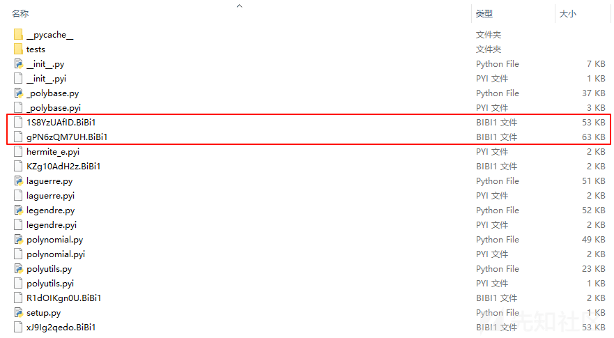](https://xzfile.aliyuncs.com/media/upload/picture/20240229202116-09367a72-d6fd-1.png)  
显示轮数、统计状态等信息，如下所示：  
[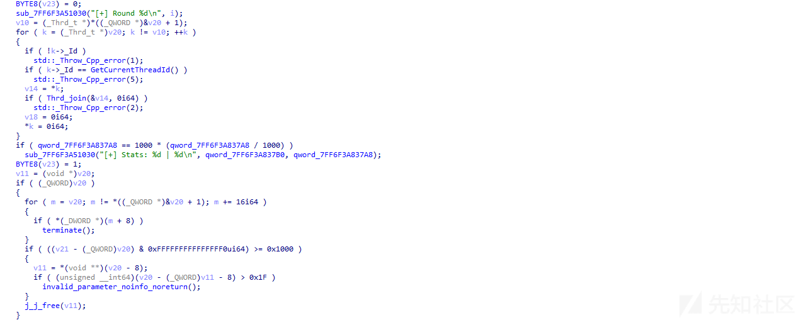](https://xzfile.aliyuncs.com/media/upload/picture/20240229202132-12ee2b6e-d6fd-1.png)  
恶意样本运行之后，如下所示：  
[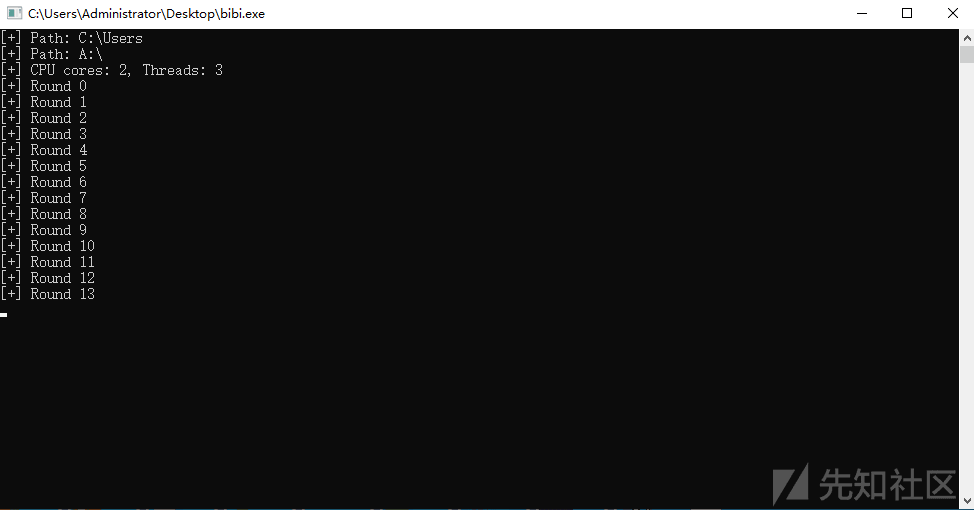](https://xzfile.aliyuncs.com/media/upload/picture/20240229202148-1c39a5f4-d6fd-1.png)

### 2.3.2 Linux 平台恶意软件

Linux 平台 DUNE BiBi Wiper 恶意软件的功能与 Windows 平台的类似，恶意样本运行之后，如下所示：  
[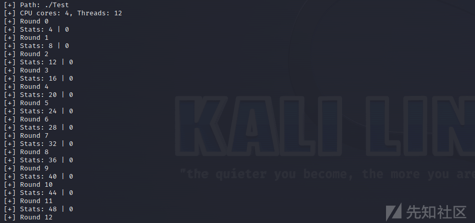](https://xzfile.aliyuncs.com/media/upload/picture/20240229202227-33b6e480-d6fd-1.png)  
损坏的文件的文件名，如下所示：  
[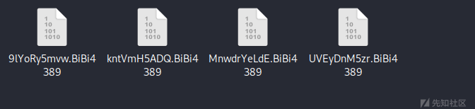](https://xzfile.aliyuncs.com/media/upload/picture/20240229202241-3bad3c34-d6fd-1.png)  
判断是否有参数，没有参数，则遍历/目录下的文件，如下所示：  
[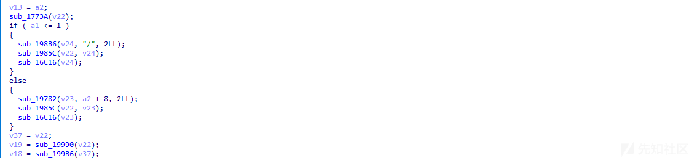](https://xzfile.aliyuncs.com/media/upload/picture/20240229202255-446a3002-d6fd-1.png)  
显示被损坏操作系统磁盘文件目录，以及系统主机信息，如下所示：  
[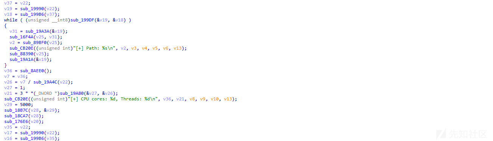](https://xzfile.aliyuncs.com/media/upload/picture/20240229202321-53977134-d6fd-1.png)  
生成随机数据，如下所示：  
[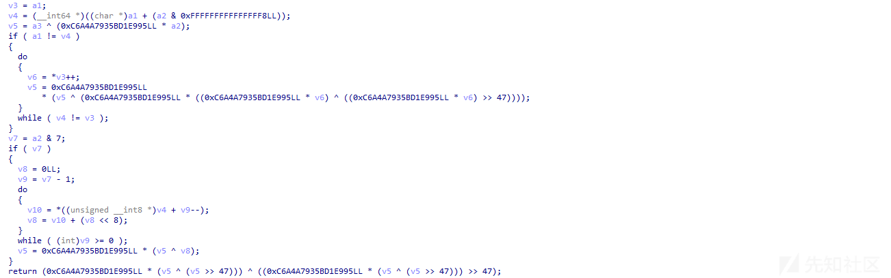](https://xzfile.aliyuncs.com/media/upload/picture/20240229202342-5ffd646a-d6fd-1.png)  
写入文件，损坏文件，如下所示：  
[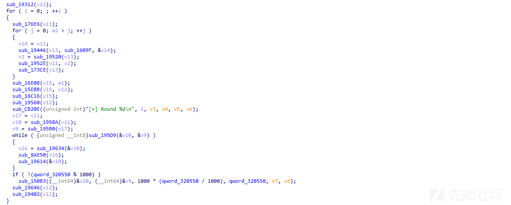](https://xzfile.aliyuncs.com/media/upload/picture/20240229202358-69e740e0-d6fd-1.png)  
通过上面的分析，可以发现 Wiper 类型的攻击样本与勒索类型的攻击样本非常相似，区别在于勒索类型的攻击样本按特定的方式和黑客的密钥加密文件，加密后的文件可以通过黑客的私有密钥解密，同时会留下勒索提示信息文件供受害者联系，交赎金之后提供解密工具解密文件，但大部分 Wiper 类型的攻击样本，主要作用就是破坏系统文件，通过直接删除或擦除改写磁盘系统文件内容达到破坏主机系统文件的目的，不要求支付赎金，也不会生成勒索提示信息文件，被破坏的系统文件一般也很难恢复。

# 威胁情报

[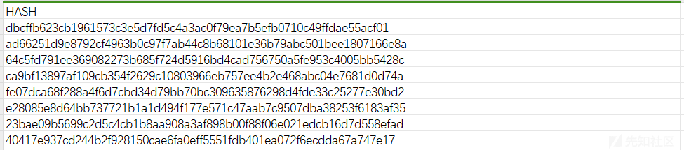](https://xzfile.aliyuncs.com/media/upload/picture/20240229202421-77679cf6-d6fd-1.png)

# 总结结尾

未来可能还会有更多的国与国之间的网络安全战，这些网络安全战中 Wiper 攻击武器起到了至关重要的作用，同时也是网络安全战最重要的攻击武器，通过些攻击武器可以破坏敌对国家的重要基础设施。

恶意软件、勒索、APT、黑产明年仍然是全球企业面临的最大的安全威胁，同时也是全球网络犯罪的最主要经济来源，是最需要安全厂商密切关注和研究的方向，未来攻击者仍然会不断的开发新的恶意软件，研究各种新的攻击技术，使用新的攻击手法，进行更复杂的攻击活动，这将会不断增加安全威胁分析和情报人员分析溯源，应急响应的难度，安全研究人员需要不断提升自己的安全能力，更好的应对未来各种威胁挑战，安全对抗会持续升级，这是一个长期的过程，也正如笔者一直说的，做安全不是一个结果，做安全是一个过程，因为永远没有结果，各种网络安全威胁会不断变化和升级，我们需要快速应对这些威胁。
