# 针对新型 SWIFT 勒索病毒的详细分析报告 - 先知社区

针对新型 SWIFT 勒索病毒的详细分析报告

- - -

# 前言概述

这几年勒索病毒已经在全球范围内大规模爆发，全球基本上每天都有企业被勒索病毒攻击，勒索攻击已经成为了全球网络安全最大的威胁，未来随着数字经济的发展，勒索攻击在未来几年，甚至很长的一段时间内仍然是全球最大的网络安全威胁，而且勒索攻击已经形成了一套完整的生态化体系运作，要想彻底解决勒索病毒需要涉及到很多层面，这也是为啥勒索攻击一直无法有效解决的原因。

最近几个国家联手打击 LockBit 勒索病毒黑客组织，可能 LockBit 勒索病毒黑客组织会像此前的 GandCrab 和 Sodinokibi 勒索病毒黑客组织一样消失，但是勒索攻击仍然会一直发生，正所谓野火烧不尽，春风吹又生，只要勒索攻击能给黑客组织带来巨大的经济利益，就会一直有新的勒索病毒黑客组织出现，需要持续关注。

笔者近期注意到一款新型的勒索病毒 SWIFT，并对这款新型的勒索病毒进行了详细分析。

# 详细分析

1.样本的编译时间为 2024 年 2 月 15 日，如下所示：  
[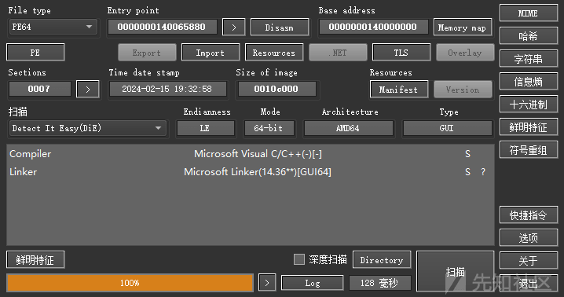](https://xzfile.aliyuncs.com/media/upload/picture/20240221201820-4d33504c-d0b3-1.png)  
2.获取操作系统语言，如果操作系统语言 ID 为 0x429，则直接退出，如下所示：  
[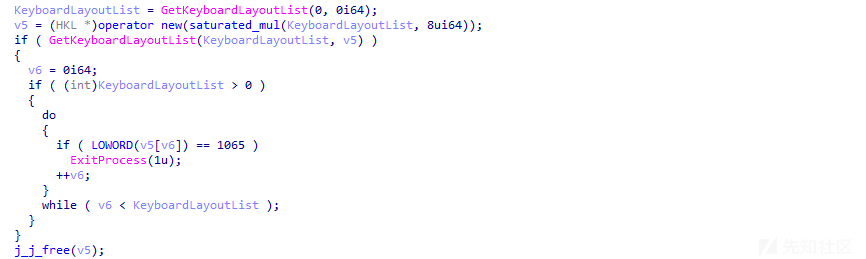](https://xzfile.aliyuncs.com/media/upload/picture/20240221201835-5635a672-d0b3-1.png)  
3.判断当前进程是否以管理员或 ROOT 权限运行，如果以管理员权限运行，则创建互斥变量，如下所示：  
[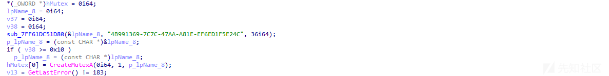](https://xzfile.aliyuncs.com/media/upload/picture/20240221201852-600ba430-d0b3-1.png)  
4.获取勒索病毒加密密钥相关信息，并设置注册表项，如下所示：  
[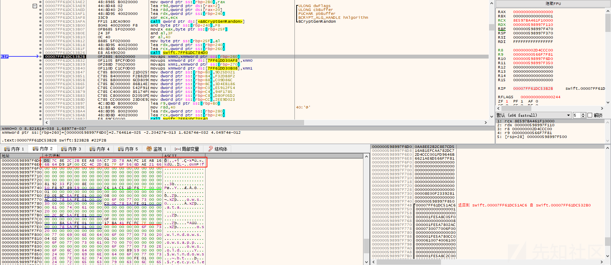](https://xzfile.aliyuncs.com/media/upload/picture/20240221201905-67b85084-d0b3-1.png)  
5.设置注册表项 HKEY\_CURRENT\_USER\\Software\\Proton\\public，如下所示：  
[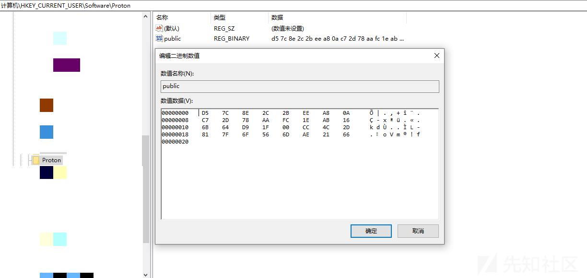](https://xzfile.aliyuncs.com/media/upload/picture/20240221201919-702fbe50-d0b3-1.png)  
6.设置注册表项 HKEY\_CURRENT\_USER\\Software\\Proton\\full，如下所示：  
[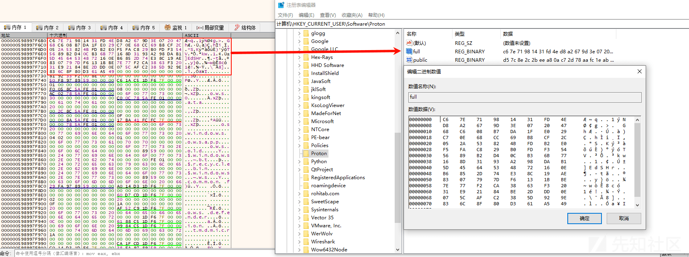](https://xzfile.aliyuncs.com/media/upload/picture/20240221201932-781b4cc4-d0b3-1.png)  
7.获取加密后的文件后缀名、勒索邮箱 (备用邮箱) 地址、受害者 ID 等相关信息，如下所示：  
[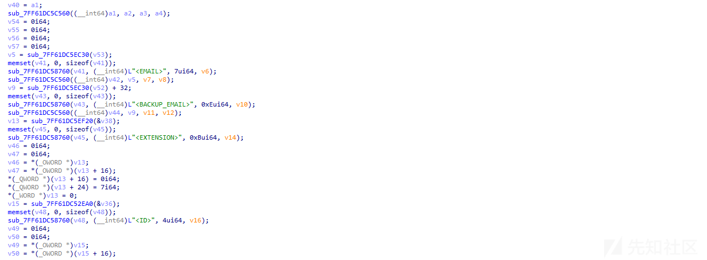](https://xzfile.aliyuncs.com/media/upload/picture/20240221201950-826a5576-d0b3-1.png)  
8.加密后的文件后缀名、勒索邮箱 (备用邮箱)、受害者 ID 等信息，如下所示：  
[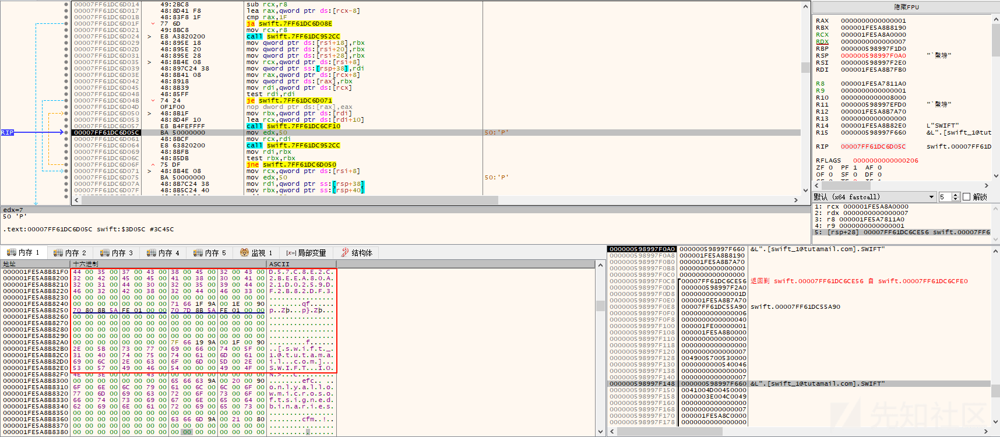](https://xzfile.aliyuncs.com/media/upload/picture/20240221202004-8b3c8674-d0b3-1.png)  
9.清理回收站的内容，如下所示：  
[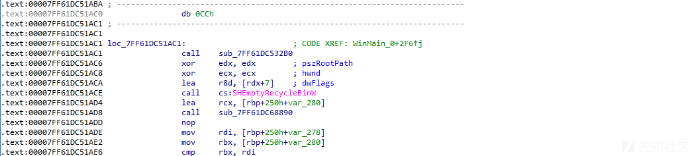](https://xzfile.aliyuncs.com/media/upload/picture/20240221202021-95454b06-d0b3-1.png)  
10.通过 CMD 命令执行删除磁盘卷影幅本和禁用系统修复操作，如下所示：  
[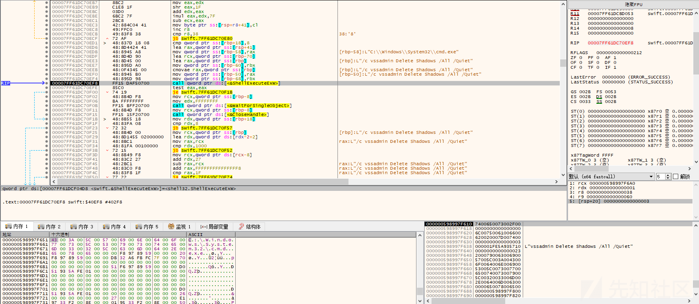](https://xzfile.aliyuncs.com/media/upload/picture/20240221202035-9dbce320-d0b3-1.png)  
相关命令，如下：  
vssadmin Delete Shadows /All /Quiet  
bcdedit /set {default} recoveryenabled No  
bcdedit /set {default} bootstatuspolicy ignoreallfailures  
wmic SHADOWCOPY /nointeractive  
11.将程序拷贝一份到系统开始自启动目录下，命名为此前生成的\[ID\].exe，如下所示：  
[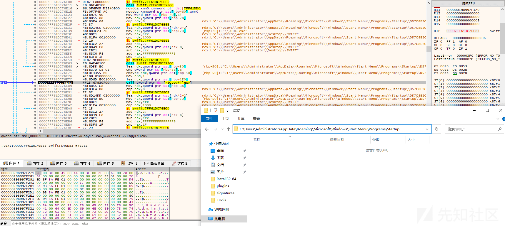](https://xzfile.aliyuncs.com/media/upload/picture/20240221202056-aa0f6d8c-d0b3-1.png)  
12.解密获取进程列表信息，如下所示：  
[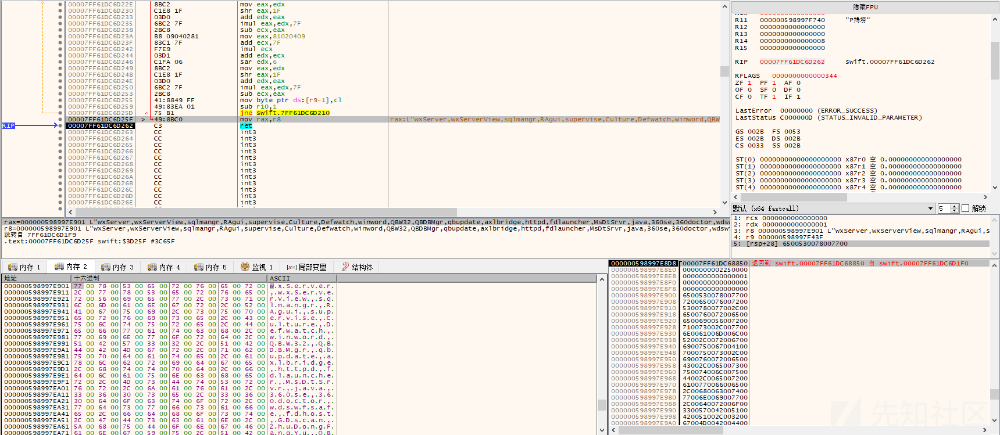](https://xzfile.aliyuncs.com/media/upload/picture/20240221202111-b313b3ca-d0b3-1.png)  
13.遍历上面的进程列表，并结束该进程，如下所示：  
[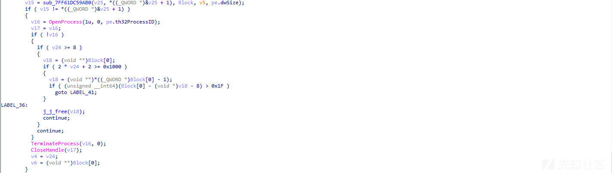](https://xzfile.aliyuncs.com/media/upload/picture/20240221202138-c2c6099e-d0b3-1.png)  
14.解密获取服务列表信息，如下所示：  
[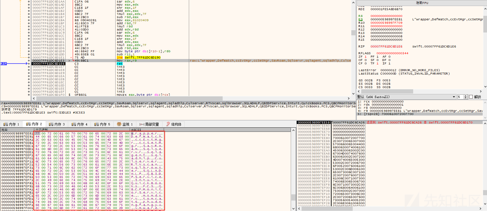](https://xzfile.aliyuncs.com/media/upload/picture/20240221202156-cdea23be-d0b3-1.png)  
15.遍历上面的服务列表，并停止服务，如下所示：  
[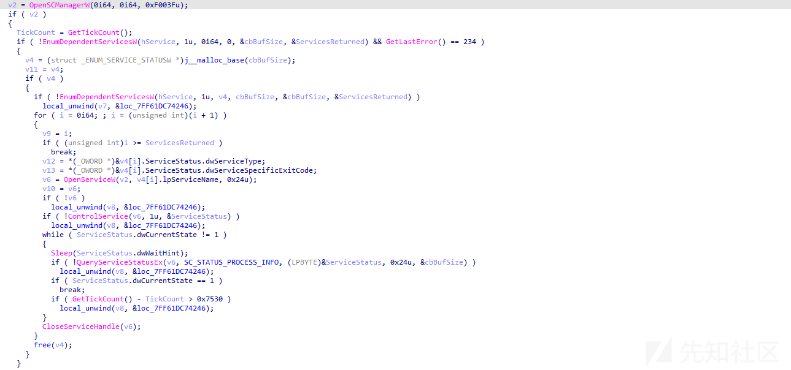](https://xzfile.aliyuncs.com/media/upload/picture/20240221202216-d99affb2-d0b3-1.png)  
16.遍历系统磁盘目录和网络共享目录，如下所示：  
[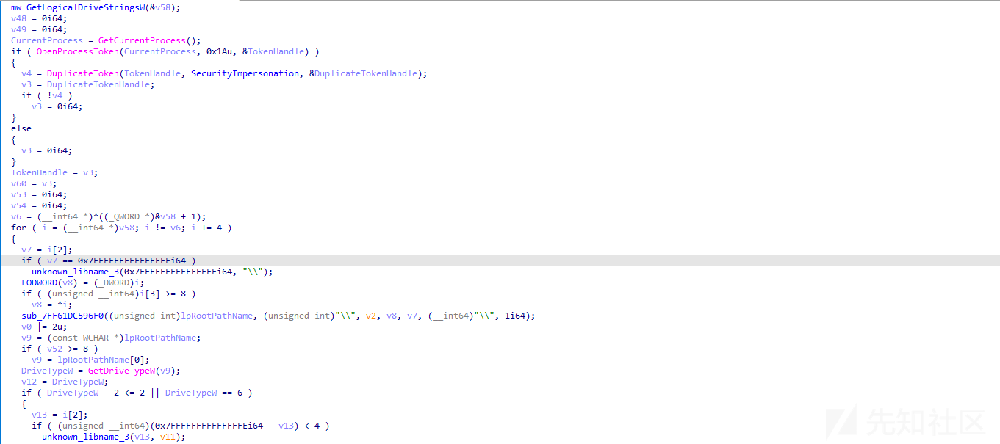](https://xzfile.aliyuncs.com/media/upload/picture/20240221202232-e33df06a-d0b3-1.png)  
17.创建线程遍历磁盘目录下的文件，如下所示：  
[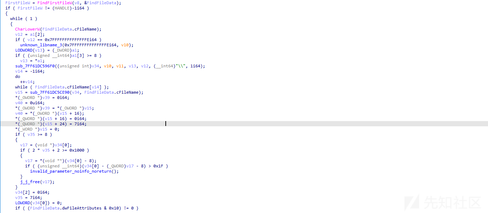](https://xzfile.aliyuncs.com/media/upload/picture/20240221202248-ecdf1aae-d0b3-1.png)  
18.生成勒索提示信息文件，如下所示：  
[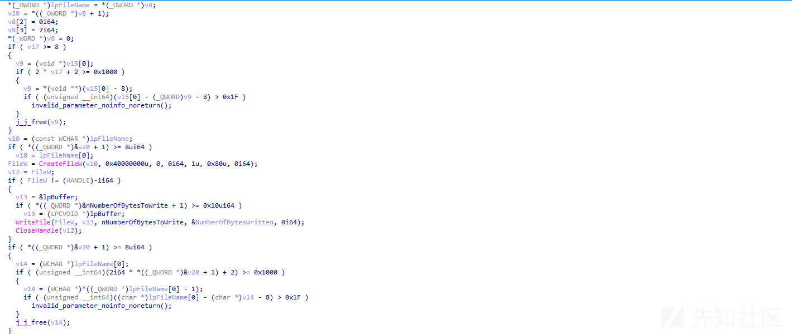](https://xzfile.aliyuncs.com/media/upload/picture/20240221202305-f6d8d6bc-d0b3-1.png)  
勒索提示信息文件名为#SWIFT-Help.txt，如下所示：  
[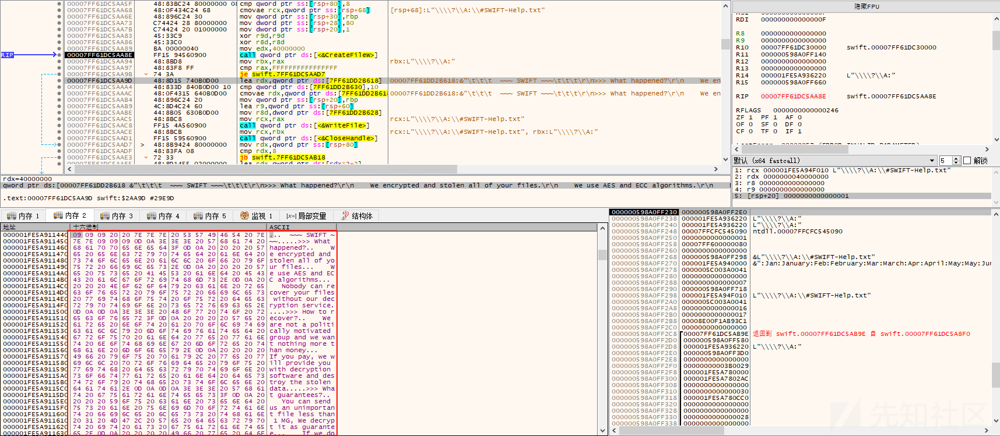](https://xzfile.aliyuncs.com/media/upload/picture/20240221202320-ffd927c6-d0b3-1.png)  
勒索提示信息文件内容，如下所示：  
[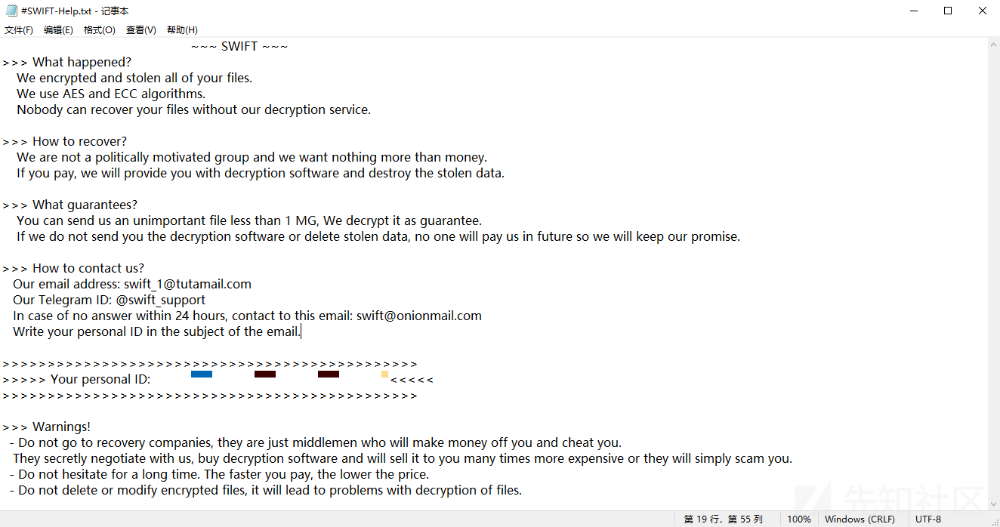](https://xzfile.aliyuncs.com/media/upload/picture/20240221202336-0961d54a-d0b4-1.png)  
19.将遍历到的系统文件读取到内存中，然后进行加密操作，当文件大小小于 0x96000 时，直接加密整个文件，如下所示：  
[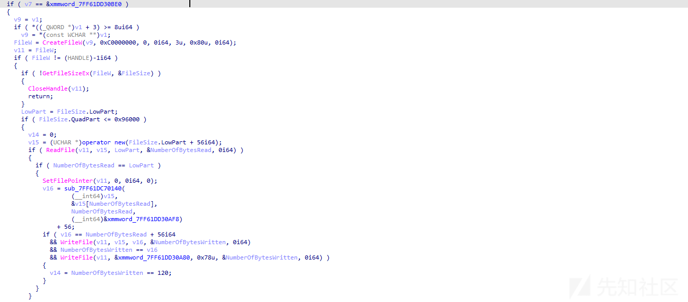](https://xzfile.aliyuncs.com/media/upload/picture/20240221202354-13dacf36-d0b4-1.png)  
20.当文件大小大于 0x96000 时，采用分块加密的方式，按 0x2000 大小分块进行加密操作，如下所示：  
[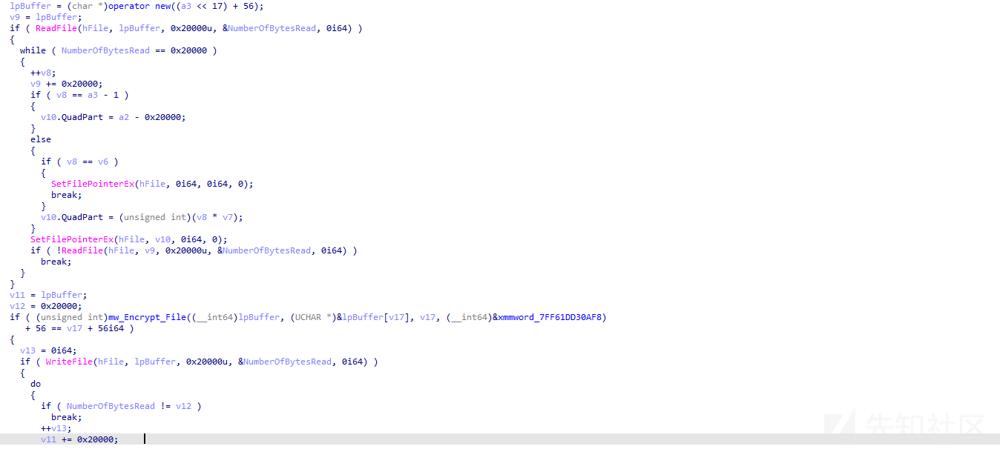](https://xzfile.aliyuncs.com/media/upload/picture/20240221202414-1fff1560-d0b4-1.png)  
21.加密算法使用 AES+ECC 算法，如下所示：  
[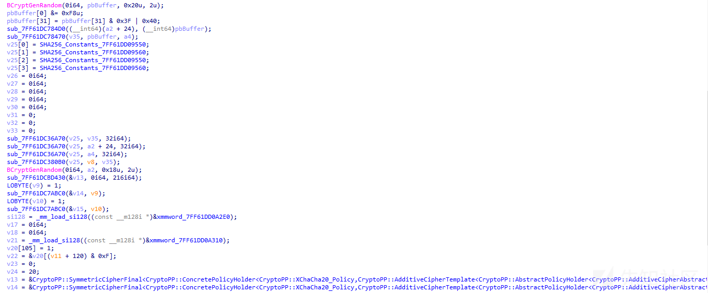](https://xzfile.aliyuncs.com/media/upload/picture/20240221202432-2ab41528-d0b4-1.png)  
22.加密完成之后，通过 MoveFileW 函数对原文件进行重命名操作，如下所示：  
[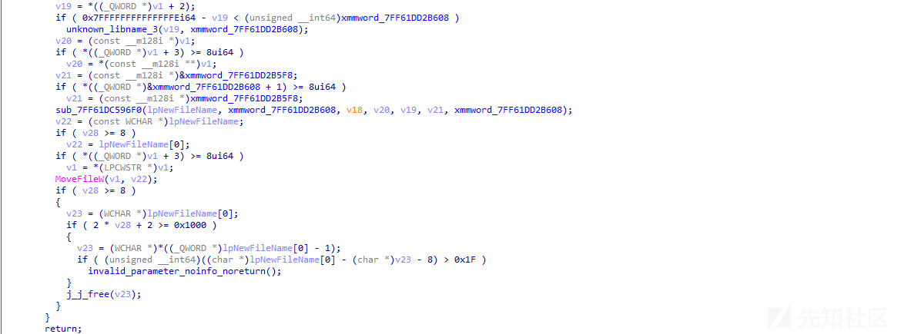](https://xzfile.aliyuncs.com/media/upload/picture/20240221202448-345a2810-d0b4-1.png)  
23.加密后的文件后缀名为\[swift\_1@tutamail.com\].SWIFT，如下所示：  
[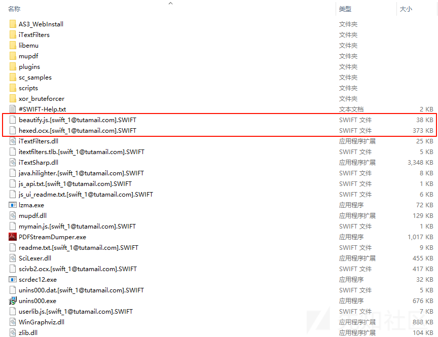](https://xzfile.aliyuncs.com/media/upload/picture/20240221202505-3e89f8f6-d0b4-1.png)  
24.获取桌面勒索提示信息，然后替换桌面背景图片，如下所示：  
[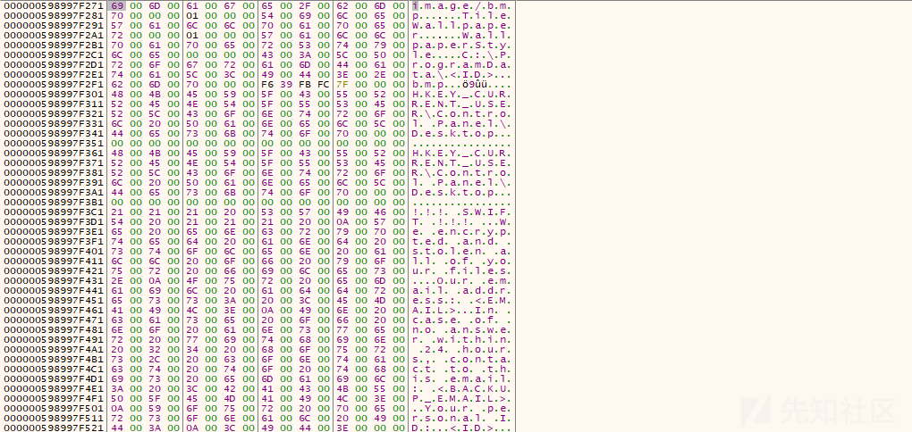](https://xzfile.aliyuncs.com/media/upload/picture/20240221202524-49b46ea0-d0b4-1.png)  
25.替换后的桌面背景，如下所示：  
[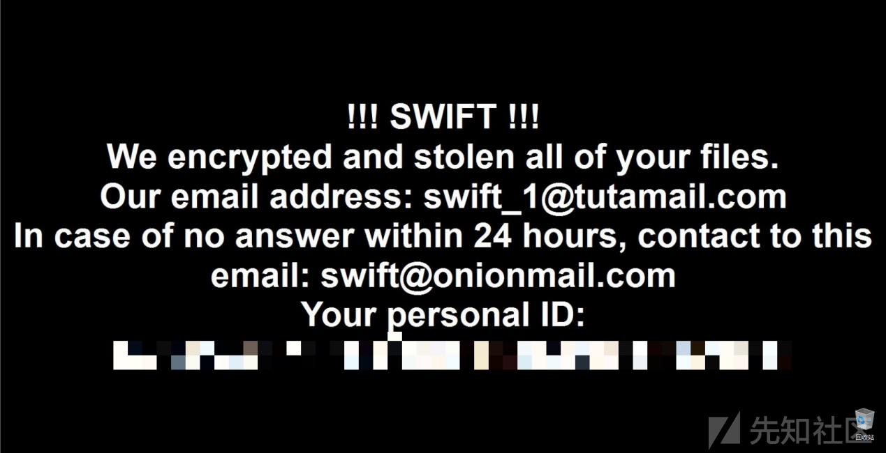](https://xzfile.aliyuncs.com/media/upload/picture/20240221202540-535b65bc-d0b4-1.png)  
26.在 C:\\ProgramData 目录下生成\[ID\].bmp 背景图片，如下所示：  
  
27.设置相关的注册表项，将勒索提示信息写入到注册表项当中，如下所示：  
[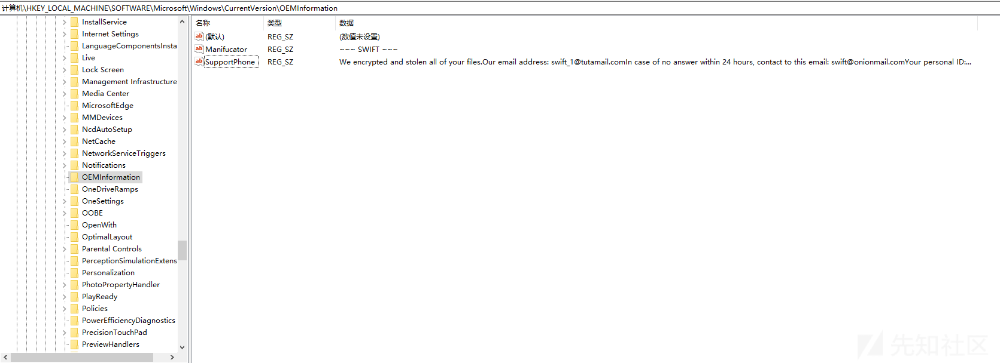](https://xzfile.aliyuncs.com/media/upload/picture/20240221202614-67684908-d0b4-1.png)  
28.将勒索提示信息写入到系统注册表项当中，如下所示：  
[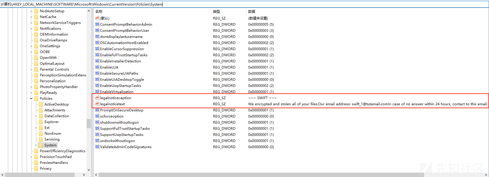](https://xzfile.aliyuncs.com/media/upload/picture/20240221202629-70929da8-d0b4-1.png)  
29.调用命令打开勒索提示信息文件，显示勒索提示文件内容，如下所示：  
[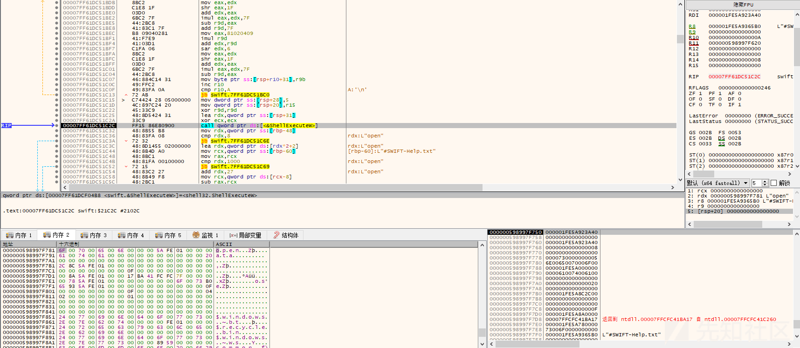](https://xzfile.aliyuncs.com/media/upload/picture/20240221202645-7a256c4c-d0b4-1.png)  
到此整个勒索病毒样本就分析完毕了，该勒索病毒流程非常清晰，是一款最新的勒索病毒，后面可能还会出现它的其他变种样本。

# 威胁情报

[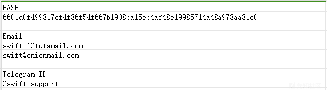](https://xzfile.aliyuncs.com/media/upload/picture/20240221202724-91518428-d0b4-1.png)

# 总结结尾

未来几年勒索攻击仍然会一直流行，勒索病毒攻击仍然将会是全球最大的网络威胁，而且只会越来越多，现在的黑客组织大部分都是为了获利，勒索病毒攻击的巨在利益已经让一些 APT 黑客组织也纷纷加入到勒索病毒攻击活动当中，全球最赚钱的 Lazarus APT 组织就曾利用勒索病毒进行勒索攻击活动，现在越来越多的 APT 组织也开始加入到勒索攻击当中，同时被勒索病毒几重勒索之下，很多企业最后会选择交纳赎金，这也间接导致勒索攻击会越来越流行的根本原因。

搞钱成了黑客组织的最大目的，勒索攻击的巨大利益，自然而然的会让更多黑客组织加入进来，而且数字货币的流行又为勒索病毒黑客组织提供了“天然”的保护，如果像以前那种通过银行汇款到某个帐户或者使用微信扫描支付等方式，这种很容易被查，现在的数字货币流行也是导致勒索攻击流行的原因之一，未来数字货币的问题不解决勒索攻击仍然会一直流行，需要持续关注。
