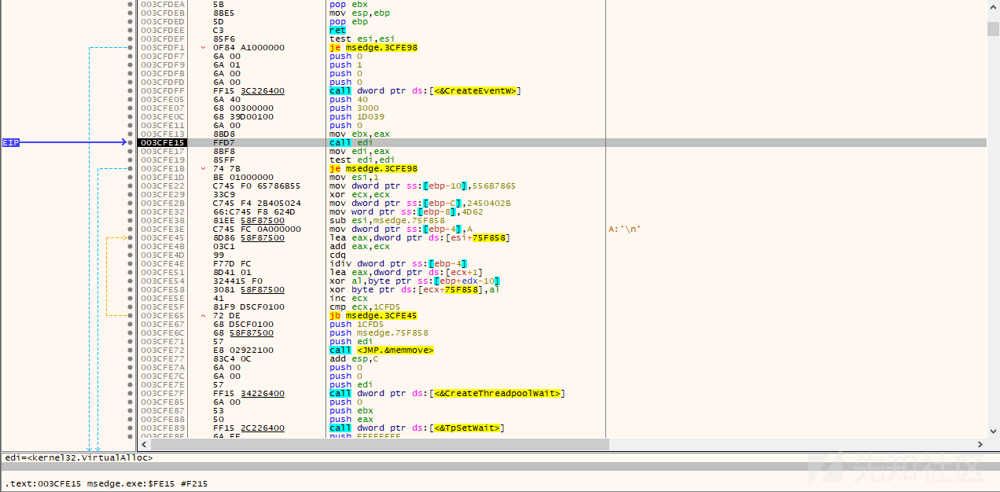
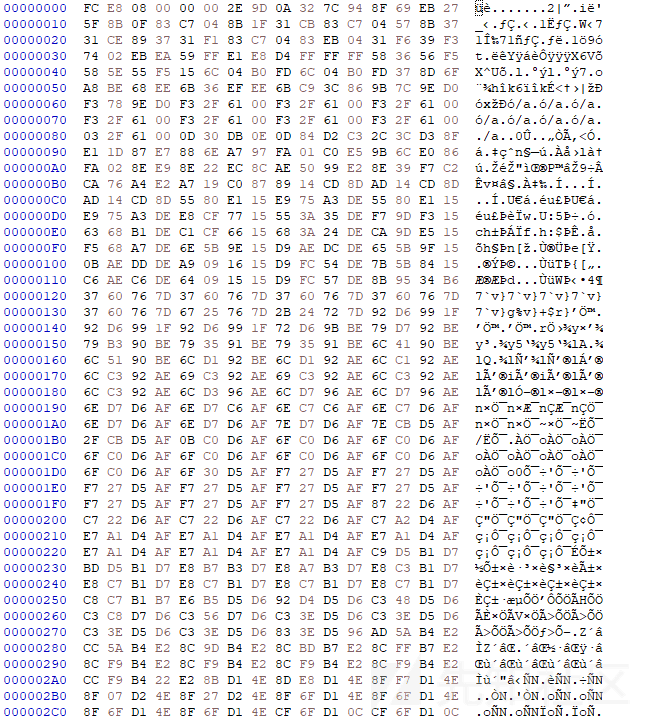

# 针对某免杀 CS 样本的详细分析 - 先知社区

针对某免杀 CS 样本的详细分析

- - -

# 前言概述

某微信好友求助笔者，可能自己中招了，让笔者看看是啥东西，具体做了什么，如下所示：  
  
随后发来了样本和解压密码，如下所示：  
  
笔者通过 VT 查了一下，发现 VT 上已经有样本了，但是检出率还挺低的，如下所示：  
  
这么低的检出率，难倒是样本给错了？这瞬间激起了笔者想一探研究的兴趣，笔者平时没事的时候就喜欢研究一些有趣的好玩的对抗型攻击样本，如果样本在 VT 已经标记的很清楚了，我倒真没啥兴趣分析，越有趣越好玩越高级越新鲜的对抗型攻击样本，我反而是越有兴趣深入分析研究，今天就让我们看看它究竟是什么？

# 详细分析

1.样本解压之后，如下所示：  
  
2.里面包含一个 EXE 程序和一个 XML 文件，XML 文件内容，如下所示：  
  
好像没什么特别的内容，为啥样本压缩包里会包含这个 XML 文件呢？难倒是样本运行之后会检测这个 XML 文件？

3.通过分析 EXE 程序，发现该程序确实会针对 XML 文件进行相关操作，如下所示：  
  
4.该 EXE 程序会检测 XML 文件，检测到 XML 文件，则跳转到恶意代码，如下所示：  
  
5.恶意代码前面是一段数据解密操作，获取核心函数地址，后面解密 Payload 的核心代码，如下所示：  
  
6.分配内存空间，用于解密 ShellCode 数据，如下所示：  
  
7.解密 ShellCode 数据，如下所示：  
  
8.将解密的 ShellCode 数据移动到此前分配的内存空间，如下所示：  
  
9.最后通过 CreateThreadpoolWait 执行解密的 ShellCode 代码，如下所示：  
  
10.跳转到 ShellCode 代码执行，如下所示：  
  
11.解密出第二段 ShellCode 代码，如下所示：  
  
12.执行第二段 ShellCode 代码，加载执行里面的 Payload 代码，如下所示：  
  
13.Payload 代码与此前母体核心代码相似，分配内存空间，用于存放第三阶段的 ShellCode 代码，如下所示：  
  
14.解密第三阶段的 ShellCode 代码，如下所示：  
  
15.解密出来的第三阶段的 ShellCode 代码，如下所示：  
  
16.第三阶段的 ShellCode 代码，从黑客远程服务器读取第四阶段 ShellCode 代码，然后在内存中加载执行，如下所示：  
  
17.ShellCode 代码，如下所示：  
  
18.通过分析发现该 ShellCode 代码通过异或算法解密出第五阶段的 ShellCode 代码并加载执行，如下所示：  
  
19.该 ShellCode 加载执行里面的 CS 木马，如下所示：  
  
20.解析出该 CS 的配置信息，如下所示：  

# 关联分析

通过该域名关联到相关的样本，如下所示：  
  
分析关联到的样本 123.exe，编译时间为 2023 年 8 月 14 日，如下所示：  
  
该样本就是上面母体样本解密出来的第二阶段 ShellCode 里面包含的 Payload 代码，如下所示：  
  
分析下面两个 ProgramData 压缩包的样本，发现里面的 EXE 是一样的，与上面的样本一样都包含一个 XML 文件，如下所示：  
  
样本的编译时间为 2023 年 8 月 7 日，应该是比上面母体样本更早的攻击样本，如下所示：  
  
该样本需要加载读取 XML 文件内容才能执行后面的恶意代码，如果没有读取到 XML 文件相应的内容，则直接报错误，如下所示：  
  
加载 XML 成功之后，执行跳转到后面的恶意代码，如下所示：  
  
恶意代码解密 ShellCode 代码，如下所示：  
  
解密出来的 ShellCode 代码，如下所示：  
  
最后通过 CreateThread 执行 ShellCode 代码，如下所示：  
  
该样本解密出来的 ShellCode 代码，与上面样本解密出来的第三阶段的 ShellCode 代码基本一致，如下所示：  
  
通过上面的分析，可以得出此前我们分析的样本应该是关联到样本的更新版本，关联到的样本编译时间为 2023 年 8 月 07 日，我们分析的样本编译时间为 2023 年 9 月 11 日，同时去年八九月份正好在进行相关的攻防演练，可以判断该样本大概率是某个公鸡队的样本。

# 威胁情报

# 总结

做安全，免杀是一个永恒的话题，是一场猫捉老鼠的游戏，通过研究一些对抗型的攻击样本，可以更好的了解攻击者在使用什么技术。
