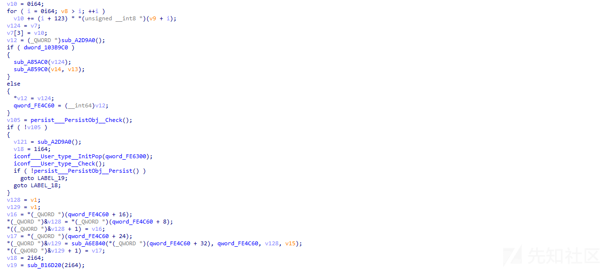
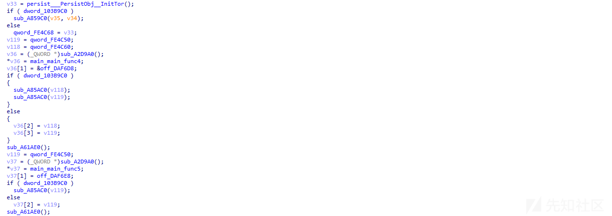

# 隐藏在暗网深处的钓鱼攻击活动 - 先知社区

隐藏在暗网深处的钓鱼攻击活动

- - -

# 前言

前段时间群里有兄弟发了两个 0day 漏洞的 POC，如下所示：  
  
一般这种 POC 是不会随便发出来的，不是葫芦娃，就是木马后门之类的。

趁今天休息，笔者简单看了看这个样本，攻击者在反溯源分析方面做了一点功课，可能是个钓鱼老手。

针对上面的钓鱼攻击样本，笔者画了一个简单的流程图，如下所示：  

# 分析

1.解压 POC 包之后，如下所示：  
  
2.打开解压缩后文件目录下的漏洞 poc.py 脚本，该 poc.py 代码里面包含一段恶意代码，如下所示：  
  
3.poc 恶意脚本代码会判断操作系统版本是 windows 还是 linux，并分别从 github 下载对应的恶意程序，然后使用 cVe35364% 密钥解压缩文件到对应的目录并执行，该 github 链接地址己经 404 了，如下所示：  
  
4.poc 恶意脚本从 github 上下载的恶意程序，如下所示：  
  
5.恶意程序会检查系统端口号，如下所示：  
  
6.检测持久化操作，设置计划任务持久化，如下所示：  
  
在指定的目录生成恶意程序，如下所示：  
  
7.设置的计划任务持久化，如下所示：  
  
8.检测配置信息文件，生成配置信息文件，如下所示：  
  
9.检测 TOR 应用程序，并下载安装 TOR，如下所示：  
  
10.下载安装启动 TOR，如下所示：  
  
11.恶意程序通过 Tor 内置 Bridge 可插拔传输器与 C2 进行通信，并利用 obfs4 混淆 Tor Bridge 的网络流量，如下所示：  
  
12.该恶意程序主要盗取剪切板数据和浏览器相关数据，如下所示：  
  
通过分析发现攻击者在行为隐藏、流量隐藏和反溯源分析方面，做了一些处理。

在行为隐藏方面，攻击者使用了与 Chrome、Edge 等浏览器更新程序类似的文件名或者使用 Windows 系统更新类似的文件名，同时设置了相应的计划任务，与正常的 Chrome、Edge 和 Windows 系统更新计划任务非常相似。

在流量隐藏方面，攻击者使用 obfs4 混淆 Tor Bridge 网络流量，隐藏真实的 IP 网络流量数据。

在反溯源分析方面，攻击者上传 github 的项目的邮箱地址被攻击者隐藏起来了，设置了指定 github 提交邮箱，邮箱地址格式为

\[ID+USERNAME\]@users.noreply.github.com，导致分析者无法拿到攻击者的真实邮箱地址。

通过上面的分析，可见攻击者还是做了一定的“功课”的，但在样本自身免杀方面暂时没有做过多的处理。

攻防对抗就是一个持续的过程，攻击者一直在研究新的攻击技术，以逃避安全厂商的检测以及安全研究人员的分析溯源，也许未来攻击者会在样本自身免杀方面做一些处理，同时在流量隐藏方面、反溯源分析方面会做的更好，攻防对抗会不断升级，安全研究人员也需要不断提升自己的安全分析能力。

# 总结

高端的黑客组织一直没有闲着，未来黑客组织的攻击手法会越来越高，使用的一些攻击技术会越来越隐蔽，针对特定目标进行高端定向攻击，是未来安全的一种趋势，针对高价值的目标，黑客会研究和采用更高级的攻击手法，使用更高级的攻击技术和攻击样本，安全对抗没有终点，而且未来高端的安全对抗会越来越激烈，安全厂商和安全研究人员需要持续不断的提升自己的安全能力。
