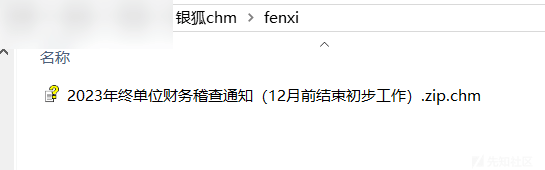
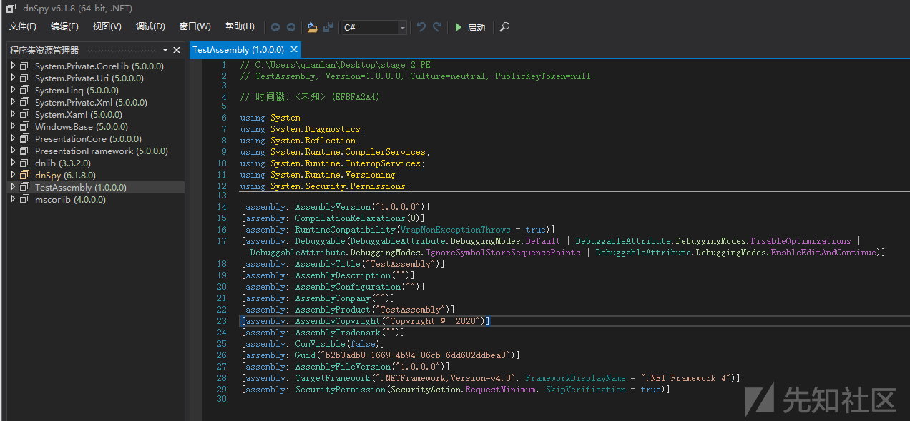

# 黑产组织"银狐"向财务人员投递".chm"诱饵文件释放"Tianma"远控，诱饵执行流程及木马逆向分析 - 先知社区

黑产组织"银狐"向财务人员投递".chm"诱饵文件释放"Tianma"远控，诱饵执行流程及木马逆向分析

- - -

# 前言

部分黑灰产组织以国内企业用户为攻击目标，长期发展肉鸡，窃密远控，人工选择受害者并定向欺诈，对国内受影响实体造成大量的经济损失。所以黑灰产组织的攻击手法和武器库也值得安全从业人员关注，此文章记录了目标组织较为新型的邮件附件恶意载荷执行流程，此样本涉及技术手法较为丰富且体系化，涉及”jsp、C#、C++“三种类型的恶意程序，值得学习和记录。

# 背景

在 2023 年初至今，东南亚区域的中文黑灰产圈通过微信\\QQ 等即时通信工具、邮件以及伪造工具网站的方式大肆对境内金融、教育、电商、货运、设计等各行各业进行钓鱼攻击，其主要目的为攻击相关公司的财务或信息人员，进行诈骗活动窃取目标资金或获取其他信息数据。  
在初始的时候，各个安全机构根据某些活动将该行动的背后团伙称为“银狐”、“谷堕”组织等。但随着深入跟踪发现，发现该类型的网络攻击诈骗行动囊括了大量的黑产团伙，且该类黑产团伙攻击频率相当之快，其中的大部分团伙使用“winos”这款由 ghost 远控修改而来的变种作为控制软件，攻击技战术也基本相同。  
此篇文章记录了目标组织主要的钓鱼手法之一。

## 样本基本信息

在相关人员邮箱中发现一份带诱导性描述的邮件，其附件信息如下。

```plain
HASH
SHA256:
2edc73c7d2f05fe9ccc078b3456cb1fdfb25e1d7d042b027a038d2a67c1d5a46
MD5:
d0d11b0cef237ca7db83d2de86d6ca7d
SHA1:
2297c9b2004d3ce994bfdaa201f0b678b02925b1

文件类型：
MS Windows HtmlHelp Data(.chm)
```

[](https://xzfile.aliyuncs.com/media/upload/picture/20240227145357-fae48070-d53c-1.png)

### 执行流程

[](https://xzfile.aliyuncs.com/media/upload/picture/20240227145507-24547154-d53d-1.png)

# 样本逆向分析

## 1 初始恶意附件“.CHM”文件

".chm"文件常常被各个黑客组织或个人作为邮件附件，广泛利用于钓鱼攻击中。用解压缩软件打开即可，解压如下。

[](https://xzfile.aliyuncs.com/media/upload/picture/20240227145558-42b4de22-d53d-1.png)  
"test.html"文件包含可疑代码 (大段的密文，一般是待解密的 shellcode，正常工作邮件不会发这样的附件)。  
[](https://xzfile.aliyuncs.com/media/upload/picture/20240227145623-51d4d89e-d53d-1.png)  
".chm"文件是什么？----".chm"文件是“Compiled HTML Help”的缩写，是一种 Windows 平台帮助文档的文件格式。具体来说是一组编译打包好的 HTML 页面、图像或其他资源，可以用解压软件打开。  
定义了三段密文字符串和其长度，即待解密的 shellcode。  
".chm"文件是如何被黑客利用的？----“.chm”文件支持脚本语言 JavaScript 和 VBScript，攻击者可以在脚本中构造外恶意资源下载和执行、计划任务、开机启动项、痕迹清理等恶意功能。

### 1.1“test.html”静态分析

函数"Base64ToStream"功能为将 Base64 编码的数据转换为字节流。  
[](https://xzfile.aliyuncs.com/media/upload/picture/20240227145654-6455c988-d53d-1.png)  
定义了三段密文字符串和其长度，即待解密的 shellcode。  
[](https://xzfile.aliyuncs.com/media/upload/picture/20240227145727-77c1c526-d53d-1.png)  
随后初始化一个 WScript.Shell 对象，用于操作 Windows Shell。通过 shell 读取注册表中的.NET Framework 版本号 (可以联想到密文可能会解密出“.net”的 shellcode)，如果读取失败则将 stage\_3 赋给 stage\_1，并将版本号设置为 v2.0.50727。

[](https://xzfile.aliyuncs.com/media/upload/picture/20240227145753-87716d3c-d53d-1.png)  
随后将进程环境变量 COMPLUS\_Version 设置为.NET Framework 版本号。随后调用函数“Base64ToStream”尝试将 stage\_1（经过 Base64 编码的二进制数据）反序列化为对象，若出现异常则对 stage\_2 做相同操作。

[](https://xzfile.aliyuncs.com/media/upload/picture/20240227145808-9076b630-d53d-1.png)  
我刚初次分析没有找到执行的位置，看了些资料才知道 BinaryFormatter 的 Deserialize 函数进行反序列化时，其中包含的代码将在系统中执行，反序列化为对象的过程中，恶意代码已经执行了。

接下来就需要动态调试查看明文的 shellcode 有什么功能了。

### 1.2“test.html”动态调试

#### 1.2.1 stage\_1 解密

复写其转码和反序列化程序（代码在后面），将恶意代码输出为 hex 流，用 winhex 打开查看。

[](https://xzfile.aliyuncs.com/media/upload/picture/20240227145846-a7209bf8-d53d-1.png)  
将 ascll 码部分取出格式化，这一部分就是“stage\_1”的明文信息了。功能大致是关闭“DisableActivitySurrogateSelectorTypeCheck”类型检查以绕过高版本框架对 ActivitySurrogateSelector 类的滥用。

[](https://xzfile.aliyuncs.com/media/upload/picture/20240227145906-b2bb066a-d53d-1.png)  
按一般经验用 IE 浏览器控制台就可以，但它调用的一些控件貌似浏览器不支持，最后实在不行，就复写了它的调试代码如下，把调试结果按 hex 流输出。

```plain
(function task() {
    function base64ToArrayBuffer(base64) {
        const binaryString = window.atob(base64);
        const len = binaryString.length;
        const bytes = new Uint8Array(len);

        for (let i = 0; i < len; ++i) {
            bytes[i] = binaryString.charCodeAt(i);
        }

        return bytes.buffer;
    }
    //过长没有完全展示
    var stage_1 = "AAEAAAD/////AQAAAAAAAAAMAgAAAF5NaWNyb3NvZnQuUG93ZXJTaGVsbC5FZGl0b3IsIFZlcnNpb249My4wLjAuMCwgQ3VsdHpc3U";
    var stage_1_size = 2341;

    // 解码 Base64 字符串为 ArrayBuffer
    var stage1ArrayBuffer = base64ToArrayBuffer(stage_1);

    // 将 ArrayBuffer 转换为十六进制字符串
    var hexString = Array.from(new Uint8Array(stage1ArrayBuffer))
        .map(byte => byte.toString(16).padStart(2, '0'))
        .join(' ');

    // 输出十六进制字符串
    console.log(hexString);
})();
```

#### 1.2.1 stage\_2 解密

用相同方法调试出 stage\_2（stage\_2 与 stage\_3 貌似没什么区别）。

[](https://xzfile.aliyuncs.com/media/upload/picture/20240227150010-d8ec55b4-d53d-1.png)  
初步看着没什么头绪，但发现在 stage\_2 中包含有一个 PE 文件，以“4D5A”为起始重新保存一个文件。

[](https://xzfile.aliyuncs.com/media/upload/picture/20240227150025-e1fb696a-d53d-1.png)  
保存后查看其文件信息，一个“.NET(v4.0.30319)”的 dll 模块，但我在反序列化出的二进制流中，没有看明白 dll 是怎么调用的。接下来就分析这个模块。

[](https://xzfile.aliyuncs.com/media/upload/picture/20240227150046-ee637d32-d53d-1.png)  
在 stage2 中，可以看到其存在 PDB 路径“2023-TianMa~\\\\TMAir\_Ghost10.0\_dev\_vs2022 标记 v4.2.0\\\\CHM\\\\KH\\\\TestAssembly\\\\obj\\\\Release\\\\TestAssembly.pdb”，表明其该攻击者使用的后续载荷为 Ghost10.0 版本修改的变种，且名称为 TianMa。

[](https://xzfile.aliyuncs.com/media/upload/picture/20240227150108-fb643292-d53d-1.png)

## 2“.NET”恶意模块分析

### 2.1“.NET”模块静态分析

".net"的程序用工具“dnSpy”分析，相比”C\\C++“恶意程序的逆向分析，”.net“程序几乎是源码，看起来比较简单。使用“dnSpy”打开在明文 stage\_2 中还原的二进制文件做静态分析。

[](https://xzfile.aliyuncs.com/media/upload/picture/20240227150148-134cdd8c-d53e-1.png)  
包括两个功能模块”shellcode“和”TestAssembly“。

[](https://xzfile.aliyuncs.com/media/upload/picture/20240227150222-27dee5b0-d53e-1.png)  
在”TestAssembly“中，首先定义了一个字典 keyValuePairs，在”c\\users\\searches\\“下生成一个随机字符的文件。随后拼接”[https://muchengoss.oss-cn-hongkong.aliyuncs.com/](https://muchengoss.oss-cn-hongkong.aliyuncs.com/) “和目标文件“svchost.exe”，“libcef.dll”，“libcef.png”，“decod.exe”，“cache.dat”放入字典中。

随后调用 Shellcode 类中的 Load2 方法加载 shellcode。

[](https://xzfile.aliyuncs.com/media/upload/picture/20240227150253-3a3431c0-d53e-1.png)  
load2 方法判断操作系统版本，然后根据版本加载不同的 shellcode。

[](https://xzfile.aliyuncs.com/media/upload/picture/20240227150308-42d87836-d53e-1.png)  
x86 架构 shellcode 长度 62464 字节。

[](https://xzfile.aliyuncs.com/media/upload/picture/20240227150322-4ba8c01a-d53e-1.png)  
x64 架构 shellcode 长度 99840 字节。

[](https://xzfile.aliyuncs.com/media/upload/picture/20240227150337-5446f07a-d53e-1.png)

### 2.2“.NET”模块中的 shellcode 定位

我分析 64 位的 shellcode。在 dnspy 中貌似不好定位，可以在 winhex 中全局搜索字符流。下图是 x64 架构 shellcode 定义部分，字符”77906982“，对应着 hex 流”4D 5A 45 52“，x64 和 x86 的 shellcode 在第 10 个字节处开始不一样（见前两张图）。下图则是在 winhex 中定位 shellcode。

[](https://xzfile.aliyuncs.com/media/upload/picture/20240227150355-5f53c5e2-d53e-1.png)  
去除前边的的 hex 流重新保存位文件，这样就获取了 x64 的 shellcode，基本信息如下，是一个 c++ 程序。

[](https://xzfile.aliyuncs.com/media/upload/picture/20240227150404-64bd2eba-d53e-1.png)

### 2.3 x64"C++"模块 shellcode 分析

搞了好一会儿发现这个东西还不能分开调试，它要完整的执行最初的”.chm“文件，然后再执行至 c++ 的 shellcode 模块。因为有一部分参数比如文件路径，是在内存中生成和传递的。

这一块”c++“的 shellocde 程序实际上是下载器。

shellcode 请求之前在”.net“模块中拼接的路径，下载后续恶意资源。

[](https://xzfile.aliyuncs.com/media/upload/picture/20240227150429-7327a1ec-d53e-1.png)  
在本地%temp%路径创建的当前进程 PID 号多次重复，作为文件夹名称，在此写入要下载的 url 路径与文件名。

获取当前进程 PID。

[](https://xzfile.aliyuncs.com/media/upload/picture/20240227150439-796900be-d53e-1.png)  
拼接路径，创建文件夹。

[](https://xzfile.aliyuncs.com/media/upload/picture/20240227150454-8245bb96-d53e-1.png)  
%temp%/397239723972397239723972397239723972\_b  
%temp%/397239723972397239723972397239723972  
在此路径接收下载的另外 5 个样本文件。

-   cache.dat，加密的的 7z 压缩包
-   decod.exe，7zip 压缩工具
-   libcef.dll，aplib 压缩数据，stage2 或 stage3 会进行解压缩
-   libcef.png，加密载荷，需要解压缩后的 libcef.dll 解密并调用，加密的 Tianma 远控 (基于 Ghost 改造)
-   libcef.exe/svchost.exe，公开可信libcef工具，会加载lbcef.dll加载文件

最终通过分析解密的 libcef.png 文件为上述提到的 TianMa 远控，该远控拥有 Ghost 远控所拥有的的功能，包括但不限于键盘记录、文件浏览、命令执行、浏览器信息窃取等功能，这个网上分析很多就不再赘述。

## IOC

MD5

a0a49aa714d01c8e4249a58b70edf3c0

5a0e22748b83e10fbb1bc79725b01428

7e8fd3d8bc887455b76cbdfc338eed4e

3327b42f2c9aa4a98200ccdc4f781837

0792a18e287f2658d7f08dbf1a3b46bc

URL

[https://muchengoss.oss-cn-hongkong.aliyuncs.com/TG.exe](https://muchengoss.oss-cn-hongkong.aliyuncs.com/TG.exe)

[https://muchengoss.oss-cn-hongkong.aliyuncs.com/cache.dat](https://muchengoss.oss-cn-hongkong.aliyuncs.com/cache.dat)

[https://muchengoss.oss-cn-hongkong.aliyuncs.com/decod.exe](https://muchengoss.oss-cn-hongkong.aliyuncs.com/decod.exe)

[https://muchengoss.oss-cn-hongkong.aliyuncs.com/libcef.dll](https://muchengoss.oss-cn-hongkong.aliyuncs.com/libcef.dll)

[https://muchengoss.oss-cn-hongkong.aliyuncs.com/libcef.png](https://muchengoss.oss-cn-hongkong.aliyuncs.com/libcef.png)
