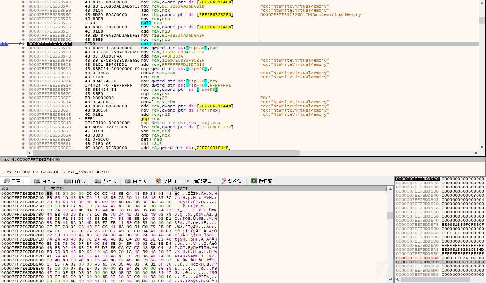
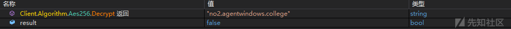

# 黑产组织攻击样本的一些对抗技术 - 先知社区

黑产组织攻击样本的一些对抗技术

- - -

# 前言概述

笔者针对黑产组织的一批攻击样本进行了详细跟踪分析，从这批攻击样本可以看出黑产组织一直在更新自己的攻击武器，里面使用了多个不同的对抗手法，包含代码混淆、加壳、反虚拟机、反调试等技术。

# 详细分析

## 1.对抗技术一：代码混淆

对比黑产组织之前的攻击样本和最新的攻击样本，如下所示：  
  
最新的攻击样本，导入函数如下所示：  
  
通过动态分析，发现前面的部分代码与此前旧样本的攻击代码基本一致，访问腾讯的 ntp 服务 ntp5.tencent.com 的方式进行反调试，同时最新的攻击样本还使用了一些反虚拟机反沙箱的技巧，旧样本的相关代码，如下所示：  
  
然后在内存中解密出 shellcode 代码，如下所示：  
  
将解密出的 shellcode 代码注入到进程当中，如下所示：  
  
调用注入的 shellcode 代码，如下所示：  
  
解密出来第一段 shellcode 代码，如下所示：  
  
第一段 shellcode 会加载后面的 DLL 模块文件，如下所示：  
  
DLL 模块文件核心代码，如下所示：  
  
加载执行 DLL 模块之后，解密出第二段 shellcode 代码，如下所示：  
  
解密出来第二段 shellcode 代码，如下所示：  
  
发现该段 shellcode 代码里面包含 HWSyscalls 代码，如下所示：  
  
HWSyscalls 代码地址：[https://github.com/ShorSec/HWSyscalls](https://github.com/ShorSec/HWSyscalls) ，该 shellcode 解密出 Payload 后门，如下所示：  
  
通过分析该 Payload 为 AsyncRAT 后门，如下所示：  
  
远程服务器域名地址为：no2.agentwindows.college、webwhatsapp.cc，如下所示：  
  
配置信息解密代码，如下所示：  

## 2.对抗技术二：反虚拟机 (反沙箱)

样本在虚拟机中运行之后，直接退出了，使用了反虚拟机手段，查壳发现样本使用了 ENIGMA(5.X)\[-\]壳加密，如下所示：  
  
脱壳之后，如下所示：  
  
相关反沙箱代码如下所示：  
  
检测系统内存反虚拟机，如下所示：  
  
遍历 Temp 目录下的文件数反虚拟机，如下所示：  
  
通过时间间隔来反虚拟机，如下所示：  
  
在内存中解密出来 Payload，如下所示：  
  
调用该 Payload 模块的 Load 函数，如下所示：  
  
Load 导出函数，如下所示：  
  
创建相关的恶意文件存放目录，如下所示：  
  
从黑客服务器 URL: [http://67.211.72.49/Multifile.zip](http://67.211.72.49/Multifile.zip) ，下载恶意文件压缩包，如下所示：  
  
通过密码:M2SYVcMwVsYU2arfmXchl226fzHU4d4M 解密压缩包文件，然后再读取解密压缩包的文件内容，如下所示：  
  
解压后的文件，如下所示：  

# 威胁情报

# 总结结尾

安全对抗会一直持续存在，有攻必有防，攻与防就是矛与盾的关系，安全研究人员需要持续不断的提升自己的安全能力。  
笔者一直从事与恶意软件威胁情报相关的安全分析与研究工作，包含各种各样的不同类型的恶意软件，通过深度分析和研究这些恶意软件，了解全球黑客组织最新的攻击技术以及攻击趋势。
