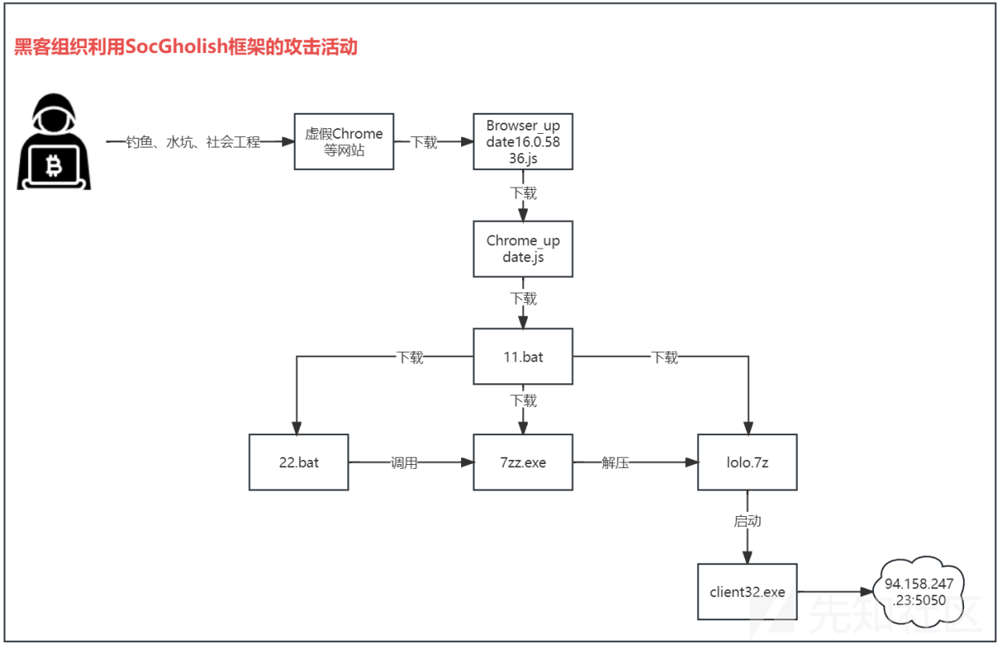
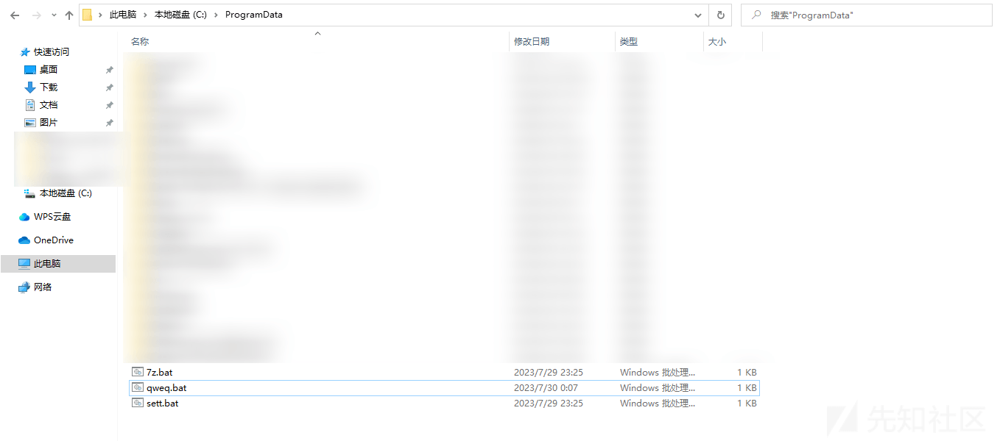

# 黑客组织利用 SocGholish 框架发动新一轮攻击活动 - 先知社区

黑客组织利用 SocGholish 框架发动新一轮攻击活动

- - -

# 前言

黑客组织最早在 2020 年左右就开始使用 SocGholish 框架发起攻击活动，该框架模拟多个浏览器 (Chrome、FireFox) 更新、Flash Player 更新等网站，通过钓鱼、水坑、社会工程技术等攻击手法诱骗受害者访问网站，并点击下载更新脚本，安装各种恶意软件。

近日，笔者捕获到黑客组织利用 SocGholish 框架进行新一轮攻击活动，并对该攻击活动进行了详细分析。

# 攻击流程

攻击流程图，如下所示：  

# 详细分析

1.虚假 Chrome 网站内嵌恶意 JS 脚本代码，如下所示：  
  
2.提示受害者需要下载更新 Chrome 程序，点击下载之后，会下载相应的恶意脚本，如下所示：  
  
3.解压之后，如下所示：  
  
4.恶意 JS 脚本会从远程服务器下载恶意代码，如下所示：  
  
5.通过上面的 URL 从远程服务器下载另外一个 JS 恶意脚本，如下所示：  
  
6.下载的 Chrome 更新脚本通过增加大量的注释来混淆恶意代码，如下所示：  
  
7.去混淆之后，该恶意脚本通过 URL 从远程服务器下载一个 BAT 脚本，如下所示：  
  
8.下载的恶意 BAT 脚本，会生成并调用其他三个 BAT 恶意脚本，如下所示：  
  
9.生成的三个恶意文件，如下所示：  
  
10.三个恶意脚本会下载其他程序，下载的程序，如下所示：  
  
11.恶意脚本利用下载的解压工具解压恶意程序，如下所示：  
  
12.解压的恶意程序是一款商用的 RAT 远控 NetSupport Manager，拥有正常的数字签名，如下所示：  
  
13.同时将该商业 RAT 远控设置为开机自启动，如下所示：  
  
14.RAT 远控配置文件服务器 IP 地址和端口为 94.158.247.23:5050，如下所示：  
  
到此，该攻击活动分析完毕，此攻击活动不仅用于安装商业远控木马进行 APT 攻击活动，也可用于勒索病毒黑客组织进行定向勒索攻击活动，还可用于一些供应链攻击场景，需要提高警惕，持续保持关注。

# 威胁情报

# 总结

黑客组织利用各种恶意软件进行的各种攻击活动已经无处不在，防不胜防，很多系统可能已经被感染了各种恶意软件，全球各地每天都在发生各种恶意软件攻击活动，这些攻击活动主要包含：勒索攻击、APT 窃密攻击等，笔者最近几年专注于针对勒索病毒黑客组织、APT 定向攻击黑客组织、以及各种黑灰产黑客组织进行跟踪分析和研究，发现这些组织一直在持续更新自己的攻击样本以及攻击技术，不断有企业被攻击，这些黑客组织从来没有停止过攻击活动，而且非常活跃，持续不断地更新攻击样本，采用新的攻击技术。

笔者在此前的文章中已经多次提到，安全是一个过程，而不是一个结果，安全没有结果，这就是安全行业与 IT 行业里面其他都不相同的一个特点，攻与防双方都在不断提升自己的安全能力，安全的核心就是人与人的对抗，人与人之间就是安全技术的对抗，例如今天你解决了这个安全问题，明天黑客就会使用新的攻击手法，你又得去解决新出现的问题，今天你能杀掉这类攻击样本，明天黑客就会改进自己的攻击样本，所以安全就是一个持续不断、对抗不断升级的过程，这就是安全行业的特点。

基于上面这个特点，所以浮燥的人很难在安全行业里面长久生存下去，能够在安全行业做十几年，几十年的都是那些真正热爱安全，不断保持学习，不断进步，持续积累的人，这就是做安全需要付出的代价，安全就是一条“不归路”，只有你真的热爱安全行业，喜欢研究安全技术，并乐于花时间研究各种真实的黑客组织的攻击活动和攻击技术，脚踏实地，持续深入的学习和研究，不断提升自己的专业能力，未来才能在这个行业长久走下去，笔者前几天看了一篇文章，里面的一段话：

和其他的 IT 技术不一样，网络安全无论攻防两端，都是一个高速动态发展、持续提高的过程，“防得了一时，防不了一世”。没有绝对的安全，也没有永远的安全，只有相对暂时的安全。网络安全面对的是全世界智商最高的犯罪分子，我们不能低估我们的对手，也不能高估自己的能力。因此，网络安全是一个持续进化的旅程，而不是一个持续稳定的结果。

这个作者与笔者的观念基本一致，未来黑客会研究和采用更高级的攻击手法，使用更高级的攻击样本和攻击技术，会开发更为复杂的恶意软件，会使用更隐藏的免杀植入方式，会挖掘更多新的安全漏洞，安全对抗没有终点，如果想在安全行业走的更远，就踏踏实实不断提升自己的能力，黑客组织都在进步，安全从业人员更需要持续不断的进步，才能抵御未来各种网络安全攻击，而且未来高端的安全对抗会越来越激烈，安全厂商和安全研究人员需要持续不断的提升自己的安全能力。
